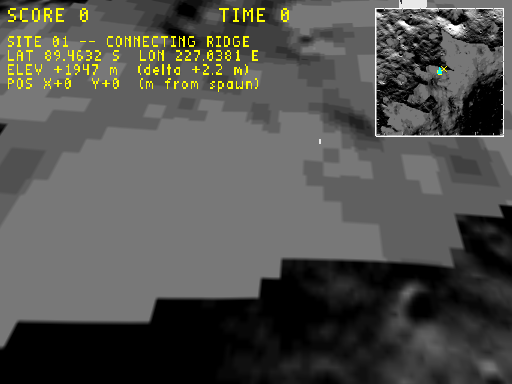
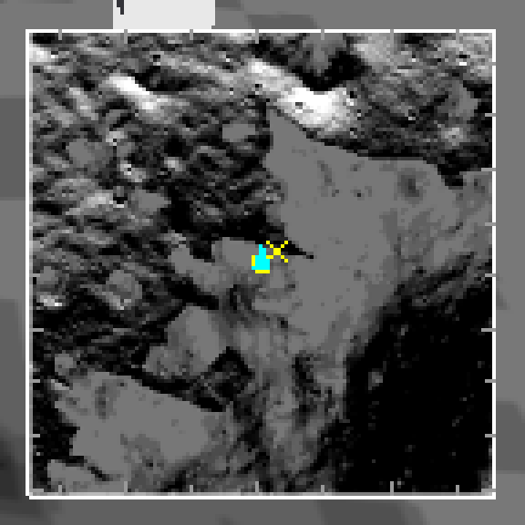

# Plan: lat/lon tick marks on the moon minimap

**Status:** Done
**Date:** 2026-05-31
**Estimate:** ~30 min · **Actual:** ~25 min

## Verification screenshots

**Full capture** (512×384) — ticks are present along all four edges of the minimap but subtle at full-pixel resolution (3 px minor, 4 px major, dim white):



**4× point-sampled crop** of just the minimap, showing the ticks clearly. Counted: ~7 lon ticks on top + bottom edges (30′ spacing), ~8 lat ticks on left + right edges (10″ spacing) — exactly what the auto-pick predicts for 89.46° S × 1 km × 1 km:



## Context

The moon overlay's top-right minimap currently shows hillshade + spawn square + lander cross + player dot + compass chevron, but no angular reference. The text block already shows the player's absolute lat/lon as numbers; the ticks would let the eye estimate angular *distance* on the map (e.g. "the lander is half an arcminute east of me").

Follow-up [3] from `2026-05-31-position-display-hud-overlay-on-the-moon-level-tex.md`.

## Geometric reality (literal "integer arcminute" doesn't work)

At PGDA Site 01 (~89.46° S), the play-area span is:

| Axis | Metres | Degrees | Arcminutes | Arcseconds |
|---|---|---|---|---|
| Latitude (Y) | 1000 | 0.024° | **~1.5'** | 87" |
| Longitude (X) | 1000 | 3.52° | **211'** | 12 660" |

A literal "1 arcmin everywhere" gives **1** tick across the latitude axis and **211** ticks across the longitude axis — the longitude axis would be a solid bar at 128 px, the latitude axis nearly empty. The cause is meridian convergence at the pole: 1 arcmin of longitude shrinks to a few metres of surface distance, but 1 arcmin of latitude stays ~30 m. The polar location makes the asymmetry extreme.

The adaptation: **auto-pick a "nice" angular subdivision per axis**, targeting ~7 ticks across the visible span. Cheap, portable to any future level at any latitude / play-area size, no per-level constants.

Nice-number ladder (in degrees), ascending:

```
1/3600  (1″)   1/1200  (3″)   1/720  (5″)   1/360  (10″)   1/120  (30″)
1/60    (1′)   1/20    (3′)   1/12   (5′)   1/6    (10′)   1/2    (30′)
1.0     (1°)   3.0     (3°)   5.0    (5°)   10.0   (10°)   30.0   (30°)
```

Algorithm: `pick_unit(span_deg) = smallest entry s.t. span_deg/entry ≤ 10`. At PGDA Site 01 this picks **10″ for lat** (87″/10″ = 8.7 ticks) and **30′ for lon** (211′/30′ = 7.0 ticks). Major-tick unit is the next-coarser entry on the same ladder (1′ for lat at 10″ spacing; 1° for lon at 30′ spacing).

## Approach

Three-pixel ticks at the inside of the minimap edges (not full lines across the map — full lines would clutter the hillshade and the existing markers). Drawn in dim white (`0.6, 0.6, 0.6`) so they read but don't compete with the yellow spawn/lander/player markers or the cyan compass chevron.

Major ticks 4 px (vs 3 px minor), at the next-coarser ladder entry, so the eye can lock onto round intervals without labels — labels at 128 px are unreadable. The text block carries absolute coordinates; ticks are purely for distance-on-map visual estimation.

## Files modified

- **`wfsource/source/gfx/gl/display.cc`** — in the moon-overlay block of `DrawHud()`, after the border-draw and before the spawn square, add the auto-picked tick loop. ~40 lines of `GL_LINES` against the existing linearisation constants (`LAT0`, `LON0`, `D_LAT_PER_M`, `D_LON_PER_M`).

## Algorithm sketch

```cpp
// Ladder of "nice" angular units in degrees, ascending.
static const double kNiceUnitsDeg[] = {
    1/3600.0, 3/3600.0, 5/3600.0, 10/3600.0, 30/3600.0,   // arcseconds
    1/60.0,   3/60.0,   5/60.0,   10/60.0,   30/60.0,     // arcminutes
    1.0,      3.0,      5.0,      10.0,      30.0,        // degrees
};
auto pick_unit = [](double span_deg) {
    for (double u : kNiceUnitsDeg) if (span_deg / u <= 10.0) return u;
    return 30.0;
};
auto pick_major = [](double minor) {
    for (double u : kNiceUnitsDeg) if (u > minor + 1e-12) return u;
    return minor * 6.0;
};
// ... iterate integer multiples of {lat,lon}_unit that fall within
// {lat,lon}_{min,max}; inverse-transform to game-world; world_to_screen;
// draw a perpendicular tick at each matching edge.
```

## Why edge ticks, not full grid lines

Full grid lines across the map would overlay the hillshade (already busy) and cross the spawn square / lander cross / player dot, hurting their legibility. Edge ticks live in the dead pixels just inside the border, give the same angular reference, and don't compete.

## Verification

1. `task build` clean.
2. `WF_GAME_SCREENSHOT_PPM=… engine/wf_game -record_video … -Lwflevels/moon_site01-standalone.iff` capture: minimap shows ~8 lat ticks on the vertical edges (10″ spacing) and ~7 lon ticks on the horizontal edges (30′ spacing), majors at 1′ lat / 1° lon being 1 px longer.
3. Programmatic resize via Xlib helper, re-capture in a 1500×800 window: ticks scale to the new minimap position; spacing density is unchanged (still ~7 per axis).
4. Sanity-check `pick_unit` at extremes: span of 0.001° picks `1″` (3 ticks); span of 100° picks `30°` (≤4 ticks). Both edge-of-ladder behaviours produce ≤10 ticks without overflow.
