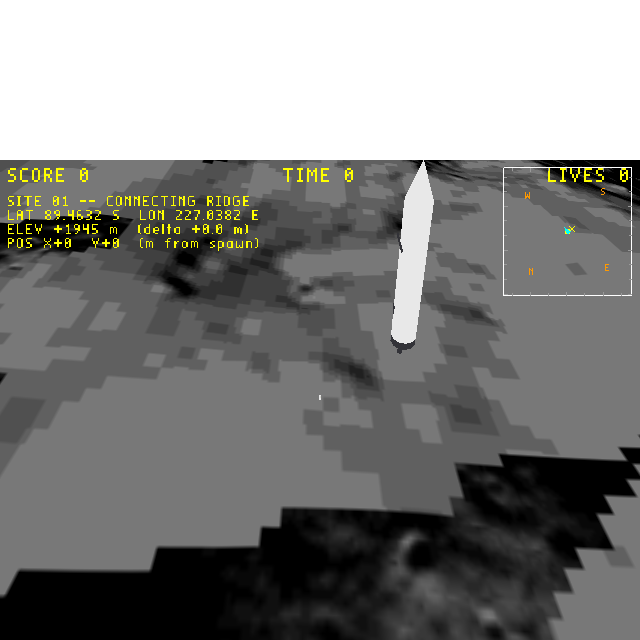
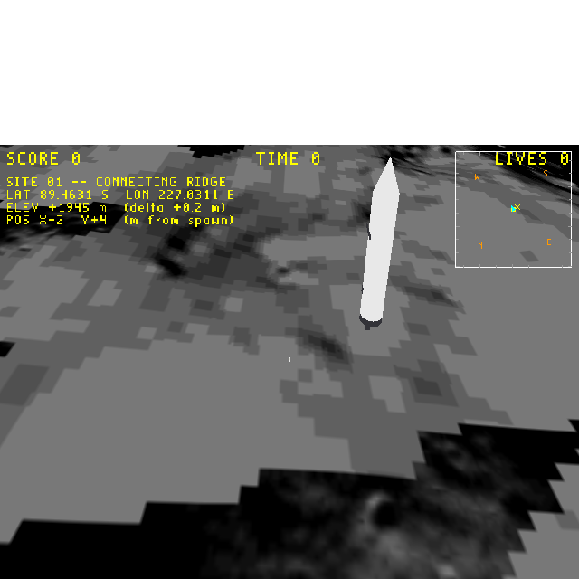

# Plan: turn-style movement (LEFT/RIGHT rotate, UP/DOWN walk) on the moon

**Status:** Done
**Date:** 2026-05-31
**Estimate:** ~25 min · **Actual:** ~20 min

## Verification screenshots

| After 60f RIGHT (rotated, no walk) | After 60f UP (walked in rotated direction) |
|---|---|
|  |  |

Bridge metrics:

| Stage | X | Y | ROTATION_C | Δ note |
|---|---|---|---|---|
| settle | 0.000 | 0.000 | 0.2500 (= +Y face) | — |
| +RIGHT 60f | 0.027 | 0.006 | 0.3793 | rotation +0.129 rev, position barely moved ✓ |
| +UP 60f | -1.915 | 3.566 | 0.3292 | walked in currentDir (upper-left quadrant per rotated C) ✓ |
| +LEFT 120f | -2.054 | 3.833 | 0.0819 | rotation reversed (-0.247 rev) ✓ |

Notes on convention: in the bridge run, **RIGHT increased C** (CCW per the `currentDir = (cos C, sin C)` convention used to derive `+Y` from `C = 0.25`), **LEFT decreased C**. That's reversed from typical "RIGHT key = CW turn" expectations. The `Euler(0,0,Revolution(±turnRate))` rotation composition order in `movement.cc:301-321` is the cause — if it feels reversed in actual play, swap the signs on those two lines (engine code, not a level edit). Calling it out as a v2 if it bothers you.

## Context

The previous plan (`2026-05-31-doomstick-4-direction-strafe-input-on-the-moon-lev.md`) wired up **strafe-style** doomstick — LEFT/RIGHT side-step, UP/DOWN walk forward/back relative to a fixed facing. The user actually wants the **other** classic-3D-game scheme: LEFT/RIGHT rotate the player around their vertical axis, UP/DOWN walk forward/backward in whatever direction the player is currently facing. The astronaut mesh has to visually rotate so the visor leads when walking forward.

(Leaves the strafe-style plan as a record of what was tried, then superseded.)

## Approach

Three small changes; no engine code, no new mailboxes, no Forth edit.

### 1. Set `wf_Turn Rate > 0`

In `wflevels/moon_site01/blender_create_moon.py`, change `player['wf_Turn Rate'] = 0.0` to **0.5** revolutions/second (full turn in 2 sec). The doomstick branch (`movement.cc:301-321`) already does exactly the right thing when `turnRate != 0`:

```cpp
if (buttons & EJ_BUTTONF_LEFT) {
    if (turnRate != Scalar::zero)
        actorAttr.AddRotation(Euler(Angle::zero, Angle::zero, Angle::Revolution(turnRate)));
    else
        ... strafe ...
}
```

UP / DOWN remain forward / backward via `currentDir` (`movement.cc:295-299`). The raw `JOYSTICK1_RAW → INPUT` passthrough script stays as-is.

### 2. Re-align the astronaut mesh so `+X` is its front

WF actor convention is `+X = forward, +Y = left, +Z = up`. The current astronaut build has the visor and chest panel at mesh-local `-X` and the PLSS backpack at `+X` — authored with the *back* of the astronaut at `+X`. With `rotation_euler.z = π/2` (currentDir = +Y) the visor ends up at world `-Y` (toward the camera), so walking forward currentDir-wise walks the astronaut *backward* visor-first. That mismatch becomes glaring as soon as he rotates.

Fix: negate the X coord of the three asymmetric parts so the front is at mesh-local `+X`:

| Part | Before | After |
|---|---|---|
| Chest panel | `(-0.20, 0.0, 1.30)` | `(+0.20, 0.0, 1.30)` |
| PLSS backpack | `(+0.27, 0.0, 1.20)` | `(-0.27, 0.0, 1.20)` |
| Visor | `(-0.05, 0.0, 1.66)` | `(+0.05, 0.0, 1.66)` |

Everything else (boots, legs, hips, torso, shoulders/arms/gloves mirrored in ±Y, neck, helmet) is symmetric in X.

After the rebuild, with `rotation_euler.z = π/2` still applied at spawn, the mesh-local `+X` (visor / chest panel) rotates to world `+Y` — visor faces *away* from the camera. We see the PLSS backpack from the camera side. Walking UP now moves the player away from the camera visor-first; a 180° turn shows the face.

### 3. Mesh-follows-actor is already automatic

WF's renderer applies the actor's rotation to the mesh transform every frame — same path SMB, qbert, snowgoons use. No per-tick script poking. Once `ROTATION_C` advances via `AddRotation`, the mesh visually rotates with it.

## Files modified

- `wflevels/moon_site01/blender_create_moon.py` — three coord sign flips in `_build_astronaut()` + one number change on the `Turn Rate` line.

## Verification

1. `task build-level -- moon_site01` clean.
2. Bridge-driven verification (`/tmp/verify_moon_doomstick.py`, idx=9):
   - Hold RIGHT 60 frames → `ROTATION_C` decreases; `X_POS`/`Y_POS` unchanged.
   - Hold LEFT 60 frames → `ROTATION_C` increases.
   - `ROTATION_C ≈ 0.25` (currentDir = +Y) + UP → `Y_POS` grows.
   - Rotate 90° CW so `ROTATION_C ≈ 0`, then UP → `X_POS` grows.
3. Visual: bridge screenshot after a 180° rotation should show the astronaut's face (gold visor, dark chest panel). Spawn screenshot should show the PLSS backpack on the camera-facing side.
