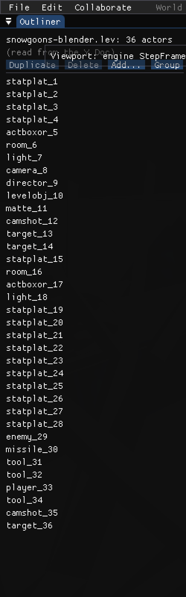
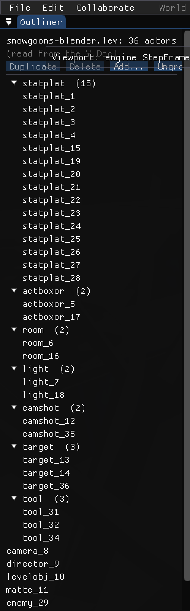

# Outliner: toggle to group actors into a collapsible tree by shared name prefix

**Status:** Done (2026-05-31, ~30 min). Verified headless on snowgoons — flat vs
grouped Outliner + persistence round-trip; proof below.

## Context

The wf-edit **Outliner** (`engine/wf_edit/main.cc:1713-1784`) lists every actor as a
flat `ImGui::Selectable` row over `c->actor_names`. Real levels are dominated by
repeated classes — snowgoons has 36 actors, 17 of them `statplat_1…statplat_28` —
so the flat list is long and noisy. Add a header toggle that switches the flat
list into a **collapsible tree grouped by the actors' shared base name**, so the
17 statplats collapse under one node.

Decisions (user-chosen):
- **Grouping rule:** base name = the actor name with its trailing `_<digits>`
  index stripped (`statplat_1`→`statplat`, `Player01`→`Player`). A base shared by
  **≥2** actors becomes a collapsible group; an actor with a unique base stays a
  plain top-level row. One level, exact base match — so `camera_*` and `camshot_*`
  are NOT merged under "cam".
- **Persistence:** the toggle persists in `~/.config/wf-edit/identity.json`,
  mirroring the existing `gizmo_snap` pref exactly.

## Mockup

Flat (today) vs grouped (toggle on) — snowgoons, 36 actors:

```
 FLAT  ([Group])                      GROUPED  ([Ungroup])
 ┌──────────────────────────┐        ┌──────────────────────────┐
 │ House: 36 actors         │        │ House: 36 actors         │
 │ (read from the Y.Doc)    │        │ (read from the Y.Doc)    │
 │ [Duplicate][Delete][Add…]│        │ [Duplicate][Delete][Add…]│
 │ [Group]                  │        │ [Ungroup]                │
 │ ───────────────────────  │        │ ───────────────────────  │
 │  statplat_1              │        │ ▾ statplat (17)          │
 │  statplat_2              │        │     statplat_1           │
 │  statplat_3              │        │     statplat_2           │
 │  … (14 more statplats)   │        │     … (15 more)          │
 │  actboxor_5              │        │ ▾ tool (3)               │
 │  room_6                  │        │     tool_31              │
 │  light_7                 │        │     tool_32              │
 │  camera_8                │        │     tool_34              │
 │  director_9              │        │ ▾ target (3)             │
 │  levelobj_10             │        │ ▾ camshot (2)            │
 │  matte_11                │        │ ▾ light (2)              │
 │  camshot_12              │        │ ▾ actboxor (2)           │
 │  target_13               │        │ ▾ room (2)               │
 │  target_14               │        │   camera_8     ┐         │
 │  room_16                 │        │   director_9   │ unique  │
 │  light_18                │        │   levelobj_10  │ base →  │
 │  … (flat, 36 rows) …     │        │   matte_11     │ plain   │
 │                          │        │   enemy_29     │ rows    │
 │                          │        │   player_33    ┘         │
 └──────────────────────────┘        └──────────────────────────┘
```

Collapsing a group is one click — e.g. the 17 statplats fold away:

```
 ▸ statplat (17)      ← collapsed: 17 rows hidden
 ▾ tool (3)
     tool_31  tool_32  tool_34
 ▾ target (3)
     …
```

Selecting a row works identically in both modes (sets `c->selected`); the
peer-presence dot still renders in the right margin.

## Established facts (verified)

- Outliner render loop: `main.cc:1761-1783`. Per row: `ImGui::Selectable(c->actor_names[i], c->selected==i)` → `c->selected = i`, then an optional peer-presence dot drawn on `dl = ImGui::GetWindowDrawList()` using `GetItemRectMin/Max`. Selection is an **int index** into `actor_names`; `actor_eids[i]` is the parallel stable id used for peer presence.
- Names come from the Doc `NAME` field (`level_doc.cc:277-294 NameOf`), stored verbatim (e.g. `camera_8`); fallback = chunk_type. Pattern in practice: `<class>_<index>`.
- Header buttons use `ImGui::SmallButton(...)` (`main.cc:1719-1725`); `Add...` opens a popup. The toggle button slots into this row.
- Reuse the collapsible idiom from `property_panel.cc:653-660` (`PushID` + tree-node flags + `DefaultOpen`); for an indented *tree* use `ImGui::TreeNodeEx(...)` + `ImGui::TreePop()` rather than `CollapsingHeader` (which doesn't indent).
- Persistence model to mirror — `gizmo_snap`: `WfeditIdentity` struct ends at `main.cc:120`; `LoadIdentity` `:152`; `SaveIdentity` `:187`; `EditorCtx` runtime copy `:279`; restore `:2907`; save-back `:3106` (guarded by non-empty `peer_id`, then `SaveIdentity`).
- `main.cc` already includes `<unordered_map>`, `<vector>`, `<string>`, `<algorithm>`; `<cctype>` is not — `BaseName` uses a plain `'0'..'9'` check to avoid a new include.

## Changes — one file (`engine/wf_edit/main.cc`)

### 1. Persist the toggle (mirror `gizmo_snap`)

- `WfeditIdentity` (before `:120`): `bool outliner_group_by_prefix = false;`
- `LoadIdentity` (~`:162`): `id.outliner_group_by_prefix = j.value("outliner_group_by_prefix", false);`
- `SaveIdentity` (~`:197`): `{"outliner_group_by_prefix", id.outliner_group_by_prefix},`
- `EditorCtx` (~`:279`): `bool outliner_group = false;`
- restore (~`:2907`): `ctx.outliner_group = identity.outliner_group_by_prefix;`
- save-back (~`:3106`): `identity.outliner_group_by_prefix = ctx.outliner_group;`

### 2. Base-name helper (file-local static)

```cpp
// "statplat_1"→"statplat", "Player01"→"Player", "House"→"House".
// Strips a trailing run of digits and one preceding separator (_/-/.).
static std::string BaseName(const std::string& n) {
    size_t e = n.size();
    while (e > 0 && n[e-1] >= '0' && n[e-1] <= '9') --e;
    if (e == 0) return n;                                   // all-digit name → its own key
    if (n[e-1]=='_' || n[e-1]=='-' || n[e-1]=='.') --e;
    return e == 0 ? n : n.substr(0, e);
}
```

### 3. Toggle button + branched rendering (`main.cc:1759-1783`)

Add to the header button row (after `Add...`):
```cpp
ImGui::SameLine();
if (ImGui::SmallButton(c->outliner_group ? "Ungroup" : "Group"))
    c->outliner_group = !c->outliner_group;
```

Factor the existing per-row body (Selectable + peer dot) into a lambda
`render_row(int i)` capturing `c, dl`, then branch after the `Separator`:

- **Flat (default):** the current `for` loop, calling `render_row(i)`.
- **Grouped:** group `actor_names` by `BaseName`, first-appearance order; pass 1
  renders multi-member bases as `TreeNodeEx` groups (`SpanAvailWidth | DefaultOpen`,
  `PushID(base)`, label `base "  (N)"`, indented children + `TreePop`); pass 2
  renders unique-base actors as plain rows in Doc order. (Matches the chosen mockup:
  groups first, loose items after.)

`render_row` keeps `c->selected = i` and the peer dot unchanged — selection
semantics (and `--select=N` / `WF_EDIT_SELECT`) are identical; grouping is a pure
render layer.

## Edge cases

| Case | Behavior |
|---|---|
| Unique base (camera_8, player_33) | Pass-2 plain row, no group node. |
| `camera_*` vs `camshot_*` | Distinct exact bases → never merged. |
| All-digit / separator-only name | `BaseName` returns the full string → unique → plain row. |
| Selected actor inside a collapsed group | Highlight still set; row hidden until expanded. Acceptable; auto-expand is a possible later polish. |
| Empty actor list | Both passes no-op; header still shows. |
| Peer-presence dot | Drawn by `render_row` in both modes. |

## Verification

1. Build: `task build-wf-edit` → `build-editor/wf-edit`; confirm mtime advanced.
2. **Screenshots** (headless, `--screenshot PATH` space-form, repo PPM, background; `ffmpeg` PPM→PNG): flat Outliner (baseline) and grouped Outliner (`statplat (17)` etc. collapsible, singletons loose). Grouped mode captured by seeding the persisted pref (temp `XDG_CONFIG_HOME` identity.json with `outliner_group_by_prefix:true`) so the headless frame renders grouped without synthetic clicks.
3. **Persistence:** toggle on, quit, confirm `~/.config/wf-edit/identity.json` has `"outliner_group_by_prefix": true`; relaunch → starts grouped.
4. No engine/data/codegen impact; `WF_ENABLE_EDITOR=OFF` build unaffected.

### Result (verified 2026-05-31)

Built `build-editor/wf-edit`; captured both modes headless by seeding the
persisted pref in a temp `XDG_CONFIG_HOME`.

-  — toggle reads **Group**;
  the full 36-row flat list (`statplat_1..4`, `actboxor_5`, … `statplat_28`, …).
-  — toggle reads
  **Ungroup**; collapsible `▾` group nodes with live counts (`statplat (15)`,
  `actboxor (2)`, `room (2)`, `light (2)`, `camshot (2)`, `target (3)`,
  `tool (3)`), unique-base actors (`camera_8`, `director_9`, …) as plain rows
  below. (Counts are dynamic — snowgoons has 15 statplats, not 17.)

Persistence confirmed: each run's exit wrote `"outliner_group_by_prefix"` back to
its `identity.json` (false / true), so the toggle survives restart.

## Phasing & commits

- **Phase 1 (one commit):** persistence wiring + `BaseName` + toggle + grouped render + plan doc + proof screenshots.
- **Phase 2 (verification):** screenshots attached.
