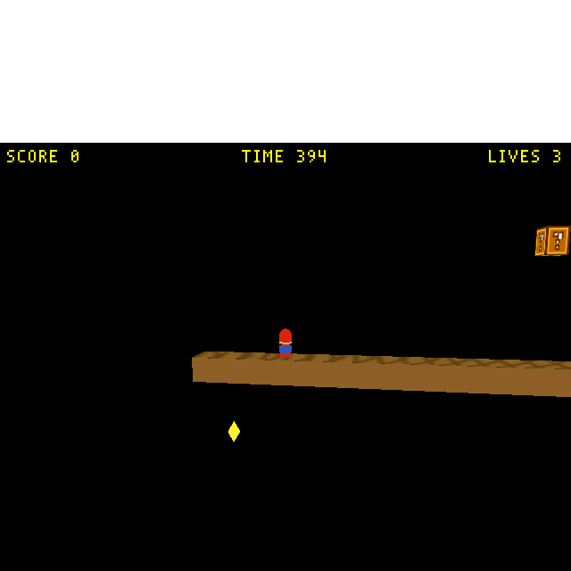
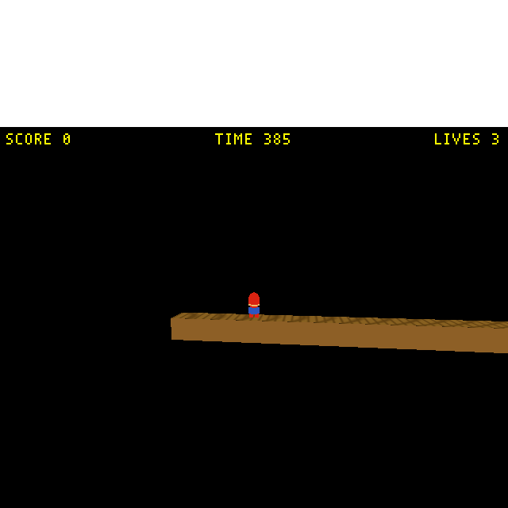
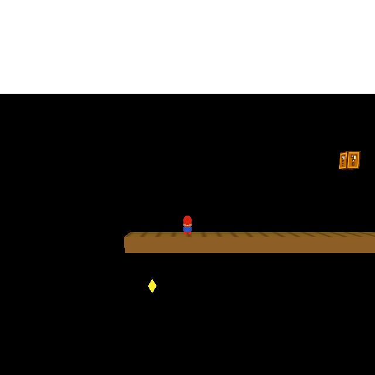

# Plan: SMB flag → next-level transition + W1-2 scaffold (bare underground proof)

**Date:** 2026-05-31
**Status:** Done + verified (2026-05-31; ~1 h). Headless bridge proof — booting `cd.iff` and
driving the flow produced the level-load sequence **`120 → 18 → 120`** (W1-1 → W1-2 → W1-1):
the meta-loop advances on `LEVEL_TO_RUN`, and **walking Mario into W1-2's flagpole looped back
to W1-1** (the flag ActBox end-to-end). Screenshots: `tests/screenshots/smb_transition_{1..4}_*.png`.
W1-1 regressions (`verify_smb_scroll`, `verify_smb_scoring`) stayed green after the re-export.
The brick ceiling is at 5 tiles (7.5 m) so it sits in the side-camera frame — see
`tests/screenshots/smb_transition_2_w1_2.png` (floor + brick ceiling + dark void = underground).

## Context

W1-1 already ends at a flagpole, but reaching it only sets `END_OF_LEVEL` → the meta-loop
reloads the **same** level. We want the flag to **advance to the next level**, and a second
SMB level (W1-2) to advance into. Scope (user-set):

- **W1-2 = bare transition proof** — a short *underground* corridor (flat ground + brick ceiling
  + dark matte + Mario + end flagpole). Walk in, reach the flag, bounce back out. Faithful
  population (256 tiles, lifts, warp zone, piranha-pipes, 68 coins) is a follow-up.
- **Underground retheme now** — near-black/teal matte + brick ceiling + dark ground.
- **Transition first** — the end-of-level is an instant cut this pass; the faithful flagpole
  celebration (flag-raise + fanfare) is the explicit next piece (see Follow-ups).

**Outcome:** boot `cd.iff` (`task run`) → Mario walks to W1-1's flag → W1-2 loads; walks to
W1-2's flag → W1-1 reloads. An endless W1-1 ↔ W1-2 loop, proving flag-driven level flow.

### This is a `cd.iff`-only feature, and it needs ZERO engine/C++ changes (verified)

Level-advance only exists on the bundle path — by construction, not by choice:

- Meta-loop [`game.cc:233-264`](../../wfsource/source/game/game.cc): each iteration runs
  `shell.fth`, then loads `GAMEFILE_LEVELSTART + _desiredLevelNum` from the GAME/SHEL/TOC bundle
  and `RunLevel()`s it. This loop **only runs when booting `cd.iff`**.
- `-L<path>` (`task run-smb`, `run-level`) sets `gLevelOverridePath` → `RunLevel`s one file and
  returns ([`game.cc:177-188`](../../wfsource/source/game/game.cc)). No meta-loop, so nobody
  reads `LEVEL_TO_RUN`; a flag there just ends the process. Advancing **requires `cd.iff`** —
  there is no `-L` shortcut and we are **not** adding one (no `-g` flag, no separate bundle).
- [`mailbox.inc:247`](../../wfsource/source/mailbox/mailbox.inc) — `LEVEL_TO_RUN, 5000`,
  documented as "written by a flagpole ActBox to advance".
- [`shell.fth`](../../wfsource/source/game/shell.fth) seeds `LEVEL_TO_RUN=0` only on first boot
  (gated on persistent mailbox 6000), so `_desiredLevelNum` **persists across levels** — what a
  level writes survives the reload. Boot level = TOC index 0.
- A **level-side** write to 5000 routes via [`mailbox.cc:90-102`](../../wfsource/source/game/mailbox.cc)
  → `WFGame::WriteSystemMailbox` → `_desiredLevelNum` ([`game.cc:705`](../../wfsource/source/game/game.cc)).
  `END_OF_LEVEL` (1905) is a GLOBAL_SYSTEM mailbox → `level.cc` → `_done`.
- **Trap:** never let the flag set an index past the TOC ([`game.cc:249`](../../wfsource/source/game/game.cc)
  `GetTOCEntry` asserts) — the last level loops back.

## Design — the flagpole "advance" ActBox (data-only composition)

The flagpole = visual `statplat` + an invisible `actbox` writing `END_OF_LEVEL (1905) = 1`
([`docs/plans/2026-05-25-smb-flagpole-end-of-level.md`](2026-05-25-smb-flagpole-end-of-level.md)).
Add a **second invisible ActBox** at the same volume writing `LEVEL_TO_RUN (5000) = <next index>`.

- Both ActBoxes: `Activated By Actor = "Player"`, identical BOX3 (always fire together),
  `Activated Actor Mailbox = 4005` (`SCRATCH_USER_START`, dodges the reserved-mailbox-0 SIGABRT).
- Ordering safe: both writes land in the same `ActBox::update`; the meta-loop reads
  `_desiredLevelNum` only after `RunLevel()` returns.
- **Death stays correct:** death sets `END_OF_LEVEL` but not `LEVEL_TO_RUN` → same level reloads.
- Parameterized as `NEXT_LEVEL_INDEX` per level.

**`cd.iff` ordering (decided):** `[smb_w1_1 (0), smb_w1_2 (1), snowgoons (2), qbert (3)]` —
boots into Mario, demos kept (reachable by writing `LEVEL_TO_RUN`). So **W1-1 flag writes
`5000 = 1`** (→ W1-2), **W1-2 flag writes `5000 = 0`** (→ W1-1). The snowgoons/qbert tail never
sees a TOC overflow because the SMB flags only target 0 and 1.

## Part A — W1-1: add the advance ActBox

Edit [`wflevels/smb_w1_1/blender_create_smb.py`](../../wflevels/smb_w1_1/blender_create_smb.py)
only: add `LEVEL_TO_RUN = 5000` + `NEXT_LEVEL_INDEX = 1` by the flagpole constants; after the
existing `flagpole_trigger` ActBox, create a second `flagpole_advance` ActBox (same cube bounds,
`actbox` schema, `wf_MailBox = LEVEL_TO_RUN`, `wf_MailBoxValue = NEXT_LEVEL_INDEX`,
`Activated By = Player`, `Activated Actor Mailbox = 4005`, invisible). Re-export +
`build_level_binary.sh smb_w1_1`; confirm both actbox chunks (1905 and 5000) in `smb_w1_1.lev`.

## Part B — W1-2: bare underground level

New `wflevels/smb_w1_2/blender_create_smb_w1_2.py` (copy `blender_create_smb.py`, strip all
population; keep scene/addon setup, snowgoons-skeleton import, camera **Director** script,
**player**, **flagpole composition** with `NEXT_LEVEL_INDEX = 0`). Removed coins, ?-blocks,
bricks, power-ups, enemies+scripts, fireball pool, piranha, pyramids/staircase, pit sensors,
coin-room (+ its 2nd room), popup. **As built:** short corridor `FLAGPOLE_X = 24*T` (36 m),
`PITS = []` (flat ground); Director camera X-max → `FLAGPOLE_X - 12.0` (auto). Underground
retheme: near-black/teal matte (`0x041018`) + a solid brick-coloured ceiling `statplat` slab at
**`GROUND_TOP_Z + 5*T`** (7.5 m — low enough to sit in the side-camera frame; 9 tiles was above
it). The grid-textured ground is **kept as-is** — it gives the textile step a real page, so the
zero-texture gotcha never bit. Restored the 4 Mario tint constants the player script reads
(`FIRE_TINT`/`MARIO_DEFAULT_TINT`/`STAR_FLASH_A`/`STAR_FLASH_B`, defined in W1-1's deleted §6).
Added `wflevels/smb_w1_2/smb_w1_2-standalone.iff.txt` (L4 wrapper). 17 actors total. Build with
`build_level_binary.sh smb_w1_2`.

## Part C — bundle into the real `cd.iff` (no new tasks, no separate bundle)

Edit the **existing `build-cd-iff` task** in [`Taskfile.yml`](../../Taskfile.yml) so its `cdpack`
line becomes `[smb_w1_1, smb_w1_2, snowgoons, qbert]`-standalone (W1-1 = level 0 so the bundle
boots into Mario; demos kept at 2/3). Update the task `desc:`. Run/verify with the **existing
`task run`** (and `task run-debug` for a headless look). Nothing else added.

## Critical files

| File | Change |
|---|---|
| [`wflevels/smb_w1_1/blender_create_smb.py`](../../wflevels/smb_w1_1/blender_create_smb.py) | + `flagpole_advance` ActBox; re-export |
| `wflevels/smb_w1_2/blender_create_smb_w1_2.py` | **new** — bare underground level + flagpole |
| `wflevels/smb_w1_2/smb_w1_2-standalone.iff.txt` | **new** — L4 wrapper (mirror W1-1) |
| [`Taskfile.yml`](../../Taskfile.yml) | edit **`build-cd-iff`** cdpack line + desc (no new tasks) |
| [`docs/level-building.md`](../level-building.md) / [`docs/level-design-troubleshooting.md`](../level-design-troubleshooting.md) | log the flag-advance pattern + gotchas |
| `wflevels/smb_w1_1.iff`/`-standalone.iff`, `wflevels/smb_w1_2.iff`/`-standalone.iff`, `wfsource/source/game/cd.iff` | rebuilt artifacts |

**No C++/engine changes. No new run/debug/test plumbing.**

## Verification (minimal — via the real bundle, no new harness)

1. Build: rebuild W1-1, build W1-2, `task build-cd-iff`, `task build`; confirm binary mtime advanced.
2. W1-2 fields landed: grep `smb_w1_2.lev` for both flagpole actboxes (1905 and 5000) + the ceiling.
3. **Transition proof (headless bridge; the engine `Level Loaded: Object Count` line IDs each
   level — 120 = W1-1, 18 = W1-2):** boot `cd.iff` (→ 120); drive the meta-loop directly
   (`set_mailbox 5000=1` + `1905=1`, idx 0) → 18 (W1-2); then **walk** Mario across flat W1-2 into
   its flagpole → 120 (loop back to W1-1). Net sequence **`120 → 18 → 120`** — proof artifacts below.
   - *(W1-1's own 315 m flag is too far to walk headlessly, and teleporting `X_POS` glitches the
     Jolt body into a fall/death → death reloads the same level. So the flag ActBox is proven on
     W1-2, which uses the byte-identical composition; the W1-1 advance ActBox is field-verified in
     `smb_w1_1.lev` — `MailBox 5000 = 1`.)*
   - *Run real-time with `vblank_mode=0 __GL_SYNC_TO_VBLANK=0`* or the engine throttles to ~1 FPS
     when the window is unfocused. The bridge has no actor/level-name op and its `step`/state-reads
     are flaky across a transition (the `DebugServer` stops in `UnloadLevel`), so the engine log's
     `Object Count` sequence is the reliable level-ID signal.
   - (Verified with a throwaway driver, kept at `/tmp/verify_smb_transition.py` — not committed,
     per "no new harness"; can be promoted to `tests/verify_smb_level_transition.py` on request.)
4. Regression: `python3 tests/verify_smb_scroll.py` + `verify_smb_scoring.py` still pass after the
   W1-1 re-export (scoring 6/6; the flagpole bonus still fires).

### Proof artifacts

**Run-through video (27 s — the full loop):**
[`tests/recordings/smb_w1_1_w1_2_transition.mp4`](../../tests/recordings/smb_w1_1_w1_2_transition.mp4)
— W1-1 → (meta-loop) → W1-2 → *walk into the flag* → W1-1. Recorded with `-record_video`; its FBO
is narrower than the on-screen window, so the 7.5 m ceiling sits just above the *video* frame —
the screenshots below (window-native 640 px) show it.

**Screenshots** (`tests/screenshots/`) — W1-1 has a `?`-block + coin, bare W1-2 has neither (and
adds the brick ceiling), so the content change across the cuts *is* the transition:

*1 — `cd.iff` boots into W1-1:*

*2 — advanced to W1-2 (underground: flat floor + brick ceiling + near-black void):*

*3 — back in W1-1 after walking W1-2's flag (loop-back — `?`-block + coin return):*

## Follow-ups (logged, not this pass)

### NEXT PIECE — faithful flagpole celebration (W1-1), 2D→3D

Today the flag hard-cuts. The original SMB end sequence has two flag motions + a celebration;
build this immediately after the transition plumbing is proven. **No engine change** — all
scriptable-actor + mailbox + level-clock, same idioms as pipe-warp/coin/popup.

Key design change: the celebration **delays** the level-end. The flag no longer instantly writes
`LEVEL_TO_RUN`+`END_OF_LEVEL`; a script sequences the show, then writes those two mailboxes at the
**end** (~3–5 s later). Same transition mechanism, fired later.

Faithful beats (original → WF mapping):
1. **Pole flag slides DOWN** as Mario grabs the pole. Flag becomes a scriptable actor (statplats
   can't tick a script — the `_nonStatPlat->_pScript` path) driving its own Z from the level clock
   + a "celebration started" mailbox. Grab-height score (100/400/800/2000/5000) — reuse the
   existing `SMB_EOL_LATCH` (1840) height+time bonus.
2. **Mario auto-slide-down + walk into the castle** via `ScriptControlsInput` (input-lockout hook
   in `actor.cc:_InitScript`).
3. Add a **castle** mesh at the level end (none exists today).
4. **Castle flag RAISES** up the rooftop pole — same Z-drive script, opposite direction; the
   "flag which raises" beat.
5. **Fanfare** SFX wav (audio — only verifiable on the other machine).
6. **Timer → score drain** (×50/unit, tick sound) using the existing Director timer + `SMB_SCORE`.
7. **Fireworks** on timer last-digit 1/3/6 — reuse the `SMB_POPUP_*` sprite-spawn idiom.

A "Visible core" subset (1 + 3 + 4 + a brief hold) is the smallest version that still reads as a
celebration if the full set is too much at once.

### Other

- Faithful W1-2: 256 tiles, all sections, full coin/enemy/pipe counts.
- Moving lifts + warp zone + piranha-pipes → `platform.oas` / `spline.oas`.
- Real victory / game-over state (vs. the W1-2→W1-1 loop).
