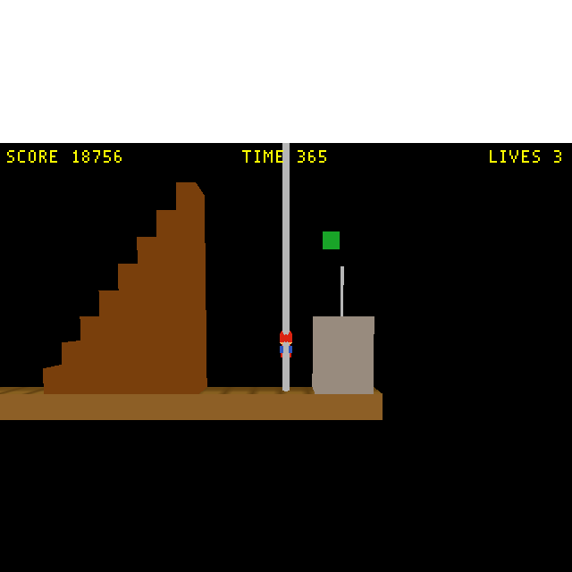
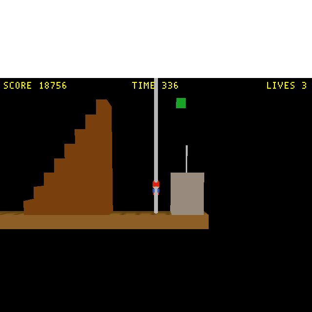
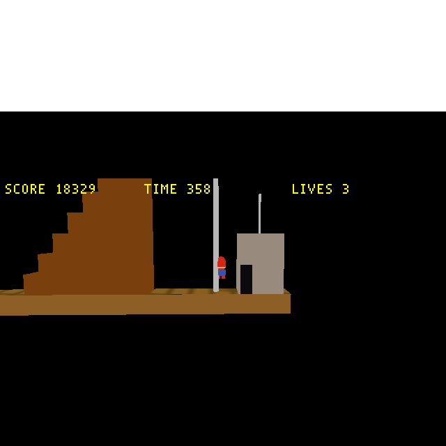
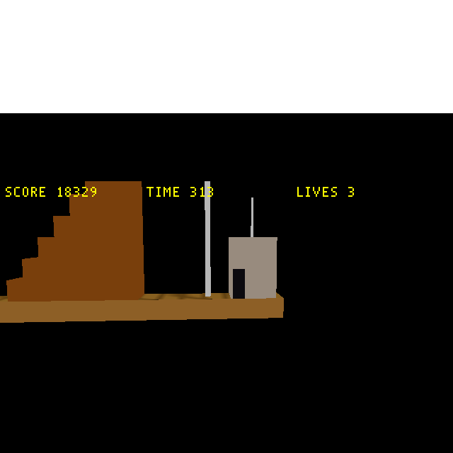
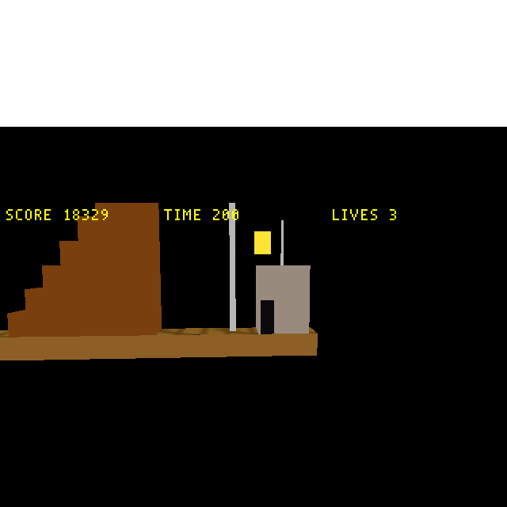
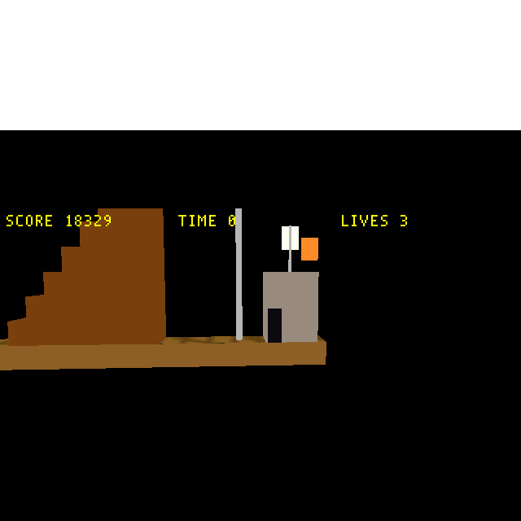

# Plan: SMB W1-1 flagpole celebration (flag-raise + timer→score, 2D→3D)

**Date:** 2026-05-31
**Status:** Done + verified (Phases 1–2 2026-05-31; Phase 3 2026-06-01). All three phases landed —
Phase 3 adds **Mario auto-walking into the castle** (then vanishing) and **fireworks** popping above
it. Reaching the flag fires
`SMB_CELEBRATE` (not `END_OF_LEVEL`); the Director sequences a ~3.5 s show (pole flag slides
down, a new castle's rooftop flag raises, the timer drains into score) then fires `END_OF_LEVEL`
→ the existing `LEVEL_TO_RUN` advance. Headless proof (step-teleport Mario to the pole,
`vblank_mode=0`): no crash, flag slides to base, castle flag raises, SCORE credited (~18.7k),
timer drains. Screenshots `tests/screenshots/smb_celebration_{1_before,2_during,3_flagtouch,4_flag_castle}.png`.

**As built / review fixes:** the flagpole is a real round 3D cylinder (16-sided, 0.54 m — was a
thin sliver); both flags are thin **vertical** slabs (a flat plane is edge-on to the side camera);
`SMB_CELEBRATE_START` is seeded in the **Player** (runs before the flag enemies) so they animate
from the start instead of snapping to the end (the Director seeds it too, but runs last).
**Open polish:** the castle flag sits a bit high/detached from its rooftop pole. **Verification
limit:** the step-teleport sinks Mario to the advance ActBox's Z-edge, so the headless capture
reloads W1-1 rather than advancing to W1-2 — walked play advances (proven by the transition test).

## Context

Reaching the W1-1 flagpole today is an **instant cut** — the trigger ActBox writes
`END_OF_LEVEL=1` and the level unloads the same frame (the
[transition](2026-05-31-smb-flag-next-level-transition-and-w1-2-scaffold.md) then loads W1-2).
The original SMB plays a **celebration** first: the triangular pole flag slides **down**, Mario
hops to the castle, a small flag **raises** on the castle, the remaining **timer drains into
score**, then it advances. This pass builds the faithful **visual core** on W1-1:

- **Pole flag slides DOWN** the flagpole (the "grab" beat).
- **Mario is pinned** at the flag (stops, faces the castle) for the duration. *(He walks into the
  trigger at ground level, so there is no "slide down the pole" for Mario himself — the flag does.)*
- A **castle** at the level end with a small flag that **RAISES** up its rooftop pole — the "flag
  which raises" beat.
- The remaining **timer drains into score** (×50/unit) with the HUD counting down.
- **Then** the level advances (the existing `LEVEL_TO_RUN`→W1-2 transition, fired ~3.5 s later).

**Deferred (tagged follow-up):** Mario *walking into* the castle (extra scripted lateral motion +
ScriptControlsInput); the **fanfare** SFX (audio — only verifiable on the other machine);
**fireworks** (the `SMB_POPUP_*` sprite-spawn idiom). W1-2 keeps its instant transition (it's the
bare proof; a celebration there is part of the faithful-W1-2 follow-up).

## Design — a coordinated cutscene via two new mailboxes

The celebration is a multi-actor sequence keyed off the level clock, the same idiom as the piranha
plant / score popup (Anchored `enemy` actors that drive their own `Z_POS` from `TIME`).

**New mailboxes** ([`mailbox.inc`](../../wfsource/source/mailbox/mailbox.inc), next-free 1862; add
`MAILBOXENTRY` rows per the named-constant convention — note the verbose `INDEXOF_` prefix the
scripts must use, flagged for the eventual cleanup):

| Name | Index | Meaning |
|---|---|---|
| `SMB_CELEBRATE` | 1862 | 0 → 1 when the flag is touched; the whole cutscene gates on it |
| `SMB_CELEBRATE_START` | 1863 | level-`TIME` captured on the rising edge; phases = `TIME − START` |

**Phase timeline** (`elapsed = TIME − SMB_CELEBRATE_START`, all readers compute it themselves):

| Phase | elapsed (s) | Who | What |
|---|---|---|---|
| A | 0 – 0.5 | `flagpole_flag` | slides Z from 13.5 m (pole top) → 1.5 m (base) |
| B | 0 – end | `Player` | pinned at `FLAGPOLE_X` (write `X_POS` each frame; ignores input) |
| C | 0.8 – 1.4 | `castle_flag` | raises Z from base → rooftop pole top |
| D | 1.5 – 3.3 | `Director` | drain `HUD_TIMER` → 0, `+50`/unit into `SMB_SCORE`/`HUD_SCORE` |
| E | ≥ 3.5 | `Director` | write `END_OF_LEVEL=1` → level unloads → meta-loop loads W1-2 |

**Wiring (data + Forth only, one tiny per-level engine rebuild for the 2 mailboxes):**
- `flagpole_trigger` ActBox: write **`SMB_CELEBRATE=1`** instead of `END_OF_LEVEL=1`.
- `flagpole_advance` ActBox: **unchanged** — still writes `LEVEL_TO_RUN=1` on overlap (harmless
  early; only consumed when the Director fires `END_OF_LEVEL` in phase E).
- `flagpole_flag`: **`statplat` → Anchored `enemy`** (statplats can't tick a script —
  `actor.cc:731`) + a slide-down script.
- **`castle`**: new `statplat` block mesh just past the pole (`FLAGPOLE_X + ~3*T`); **`castle_flag`**:
  new Anchored `enemy` + raise-up script.
- `Player` script (`_build_mario`): the existing height+time bonus block (lines ~1246-1265) moves
  from "on `END_OF_LEVEL`" to "on `SMB_CELEBRATE` rising edge" (keep `SMB_EOL_LATCH` as the one-shot
  guard); add a pin (`SMB_CELEBRATE` set → `FLAGPOLE_X INDEXOF_X_POS write-mailbox`).
- `Director` script: on `SMB_CELEBRATE` rising edge seed `SMB_CELEBRATE_START`; while celebrating,
  **suspend the normal timer countdown** (it owns `HUD_TIMER`) and run the phase-D drain; fire
  `END_OF_LEVEL` at phase E. Camera holds (ratchet already clamps at the flag).

All in **`wflevels/smb_w1_1/blender_create_smb.py`** (W1-1 only).

## Build phases (commit per phase)

**Phase 1 — mechanism + scoring beat (no new art):**
mailboxes; `flagpole_trigger`→`SMB_CELEBRATE`; Director sequencer (START → timer-drain → phase-E
`END_OF_LEVEL`); Player pin + bonus-on-`SMB_CELEBRATE`. Rebuild engine (`touch
engine/stubs/scripting_stub.cc && task build`, mailbox.inc changed), W1-1, cd.iff.
*Verify:* bridge-set `SMB_CELEBRATE=1` → HUD_TIMER drains to 0 with `SMB_SCORE` climbing → level
advances to W1-2 after ~3.5 s (engine log `120 → 18`). Mario stays put under held-RIGHT.

**Phase 2 — the visuals:**
`flagpole_flag` → Anchored `enemy` + slide-down script; add `castle` + `castle_flag` + raise-up
script. Re-export + rebuild.
*Verify:* screenshots of the flag mid-slide, the castle, and the castle flag raised; plus an mp4 of
the full beat into the transition.

**Phase 3 — Mario walks into the castle + fireworks (2026-06-01):**
Slots two new beats into the elapsed-based timeline (all keyed off `elapsed = TIME −
SMB_CELEBRATE_START`):
- **Mario walk + hide** (Player script): `wf_Visibility Mailbox = SMB_MARIO_VIS` (seeded `1` each
  frame so the unseeded-global default doesn't hide him at load); the celebration tail replaces the
  old clamp — `elapsed < 0.9` hold at the pole, `0.9–1.6` walk X 315→317 (into the castle door),
  `≥ 1.6` set `SMB_MARIO_VIS=0` (disappear) + hold X.
- **Castle door**: a dark `castle_door` statplat on the castle's left face so he walks *into* a door.
- **Fireworks**: three `firework_0/1/2` Anchored `enemy` bright slabs above the castle,
  `wf_Visibility Mailbox = SMB_FIREWORK_n`, each self-gated visible only while `SMB_CELEBRATE` set
  **and** `elapsed ∈ [tₙ, tₙ′]` (staggered [2.1,3.0]/[2.6,3.5]/[3.1,4.0]).
- **Director finale** extended `3.5 → 4.2` so `END_OF_LEVEL` fires *after* the fireworks.

> **zForth gotcha (cost a long detour):** the window test was first written `… < and if …`, but this
> zForth has **no `and`/`or` word** — the bitwise primitives are spelled **`&`** / **`|`** (as every
> other SMB script already does). `and` compiled to `NOT_A_WORD`, and the per-frame recompile retries
> left dict garbage that surfaced as misleading `OUTSIDE_MEM` aborts — a red herring that looked like
> dictionary exhaustion. Fix was one character: `and` → `&`. New mailboxes: `SMB_MARIO_VIS` (1864),
> `SMB_FIREWORK_0/1/2` (1865–1867).
*Verify:* the step-teleport capture **settles the bungee camera** (hold Mario at 313, just shy of the
315 trigger, with zeroed velocities for ~2.6 s) *before* firing `SMB_CELEBRATE`, so the firework
windows get a stable framing instead of a mid-swing drop. Screenshots of the walk, the vanish, and
each firework; mp4 of the full beat; `verify_smb_scroll` + `verify_smb_scoring` green.

## Verification

- The **flag-touch → `SMB_CELEBRATE`** link is the same ActBox mechanism already proven (the W1-1
  flag's 315 m position is unwalkable headlessly and teleport glitches Jolt), so drive the
  **sequencer** by bridge-setting `SMB_CELEBRATE=1` (idx 0) and screenshot each phase; the
  field-verified `smb_w1_1.lev` confirms `flagpole_trigger` now writes `1862`.
- Run real-time with `vblank_mode=0 __GL_SYNC_TO_VBLANK=0` (else ~1 FPS unfocized).
- Screenshots → `tests/screenshots/smb_celebration_*.png`; mp4 → `tests/recordings/`.
- Regression: `verify_smb_scroll` + `verify_smb_scoring` both pass. The flagpole bonus now fires on
  `SMB_CELEBRATE`, so `verify_smb_scoring` was updated to poke `SMB_CELEBRATE` (1862) instead of
  `END_OF_LEVEL` (1905) — it had gone stale at the Phase 1 refactor (bonus 19.9k confirmed).

## Critical files

| File | Change |
|---|---|
| [`wfsource/source/mailbox/mailbox.inc`](../../wfsource/source/mailbox/mailbox.inc) | + `SMB_CELEBRATE` (1862), `SMB_CELEBRATE_START` (1863); **P3:** + `SMB_MARIO_VIS` (1864), `SMB_FIREWORK_0/1/2` (1865–1867) |
| [`wflevels/smb_w1_1/blender_create_smb.py`](../../wflevels/smb_w1_1/blender_create_smb.py) | trigger→`SMB_CELEBRATE`; flag→Anchored enemy + slide; + castle + castle_flag; Player pin/bonus; Director sequencer + drain; **P3:** Player walk/hide + vis mailbox, `castle_door`, 3 fireworks (`&` not `and`), Director finale 3.5→4.2 |
| `engine/wf_game` | rebuilt (mailbox.inc changed; `ZF_DICT_SIZE` left at 65536 — dict was a red herring) |
| `wflevels/smb_w1_1.iff`/`-standalone.iff`, `wfsource/source/game/cd.iff` | rebuilt artifacts (+ `castle_door.iff`, `firework_0/1/2.iff` meshes) |
| [`tests/verify_smb_scoring.py`](../../tests/verify_smb_scoring.py) | flagpole-bonus trigger updated `END_OF_LEVEL` (1905) → `SMB_CELEBRATE` (1862) |

## Proof

*Flag just touched — pole flag at top, before the show:*

*Celebration — pole flag slid to the base, castle flag raised (green, top), score credited, timer draining; flagpole is a round 3D cylinder:*

**Phase 3 proof** (settled-camera capture, `tests/recordings/smb_w1_1_celebration.mp4` for the full beat):

*Mario walking right into the castle (elapsed 1.1 s, before any firework):*

*Mario vanished into the castle, flag raised (elapsed 1.8 s):*

*Fireworks popping above the castle in their staggered windows (elapsed 2.4 s and 3.6 s), score banked, timer drained:*

## Follow-ups (after this pass)

- **Fanfare** SFX (`SfxLibrary`; audio-verify on the other machine).
- **Radial spark-burst fireworks** + **count = remaining-timer last digit** (1/3/6), **flag/firework
  positioning**, and **faithful W1-2** are being done in
  [2026-06-01-smb-fireworks-rework-and-faithful-w1-2.md](2026-06-01-smb-fireworks-rework-and-faithful-w1-2.md).
