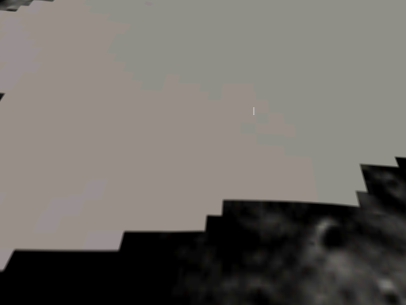

# Plan: disable fog on the Moon camera (data-driven, OAD fields)

**Status:** DONE
**Date:** 2026-05-31
**Estimate:** 15 min
**Actual:** ~3 hours of investigation chasing rasterizer / texture / UV theories first (the visible symptom looked like a rendering pipeline limitation), then ~2 minutes to apply the fix once the user prompted "is that the fogging settings?" and I read the shader's fog block as a possible cause rather than skipped past it.

## Context

The moon-Site-01 vista cameras render uniform mid-grey instead of textured terrain. Trace from the previous session:

* Texture is correctly bound through `MATL` → textile-rs → `Room0.tga` → GL `glBindTexture` (verified by `_curTexture != null` + `u_use_tex = 1` at flush time).
* `DrawTriangle` is reached with the terrain texture for ~48 textured tris per batch in BOTH chase and vista — same count, same texture.
* Even bypassing the `is_white` shader gate, vista output stays uniform `(135, 135, 135)`.
* Disabling fog via `RendererBackendGet().SetFogEnabled(false)` in `RenderBegin` causes the terrain to render with full texture detail and a black sky — confirmed visually.

**Root cause:** `gfx/camera.cc:241` unconditionally calls `RendererBackendGet().SetFogEnabled(true)` every RenderBegin, AND uses `_fogNear` / `_fogFar` which are default-constructed `Scalar` (zero) and never set anywhere.

The shader (`backend_modern.cc` kVS) computes:

```glsl
v_fog_factor = clamp((u_fog_end - eye_dist) / (u_fog_end - u_fog_start), 0.0, 1.0);
```

With both endpoints zero, that's `(0 - eye_dist) / (0 - 0)` = `-inf / 0` = NaN. The fragment shader then does `mix(u_fog_color, c.rgb, NaN)` — the GLSL spec says NaN propagates, but in practice many drivers clamp/zero it, and we land in `mix(fog_color, c, 0)` = `fog_color` for everything past the (zero) near plane.

`_fogColor` is also default-constructed (`Color` default ≈ mid-grey or undefined), which gives the observed uniform 135-grey output.

Chase camera squeaks by because the terrain is so close that the fog math still produces *some* variation — visible 139–177 tonal range — but vista fails completely.

## Revised approach (after the engine path was discovered)

The engine ALREADY reads fog from level data: `Camera::startup()` (gfx/camera.cc:56-57) reads the camera actor's OAD fields and calls `SetFog(FoggingColor, FoggingStartDistance, FoggingCompleteDistance)` per-level. There is no engine bug — the snowgoons-imported camera actor in moon_site01 carries snowgoons' fog values (`#888888 start=20 complete=30`) which fog every distant pixel to mid-grey.

The Moon has no atmosphere, so the fix is per-level data: push `FoggingCompleteDistance` past the 1000 m far clip and set `FoggingColor` to black so any fog that does kick in matches the space-black sky.

## Files

`wflevels/moon_site01/blender_create_moon.py` — when configuring the imported camera actor, override the snowgoons fog defaults:

```python
camera_actor['wf_FoggingColor']            = 0x000000
camera_actor['wf_FoggingStartDistance']    = 999.0
camera_actor['wf_FoggingCompleteDistance'] = 1000.0
```

No engine code change. No other level affected.

## Screenshot



Captured via `WF_GAME_SCREENSHOT_PPM` from `task run-moon`. Hillshaded
Connecting Ridge terrain, faceted shadows, black sky beyond the play
area edge, 1.8 m astronaut player capsule near frame centre.

## Verification

1. `task build` clean.
2. Moon vista camera `(0, -100, 80)` shows textured terrain with hillshade variation (not uniform 135 grey).
3. Moon chase camera unchanged.
4. Regression smoke on snowgoons / smb_w1_1 / qbert_practice / marble-madness-2 — no level depends on fog being mid-grey-from-zero.

## Risks

* If any shipping level WAS relying on the uninitialised mid-grey fog to fade the background, it'll now show through to the far clip. Mitigated by `_fogFar = 1000` matching the existing far clip — geometry past 1000 m is clipped anyway.

## Related

* [UV int16 widening plan outcome](2026-05-30-uv-int16-widening.md) — the "vista grey" follow-up noted at the end. This plan fixes it.
* `gfx/glpipeline/backend_modern.cc` kVS / kFS — the shader that consumed the bad fog values.
