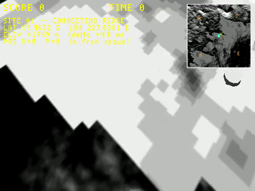
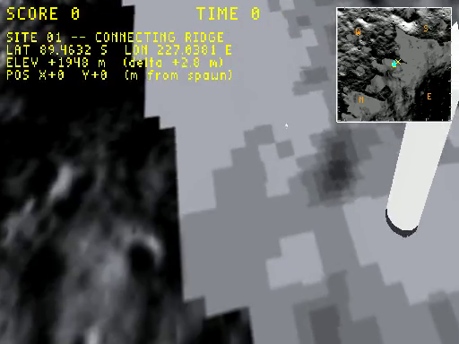

# Plan: Earth + Sun + Stars in the moon sky

**Status:** Phase 0 (scaffolding done, visual tuning incomplete)
**Date:** 2026-06-01
**Estimate:** ~2 h · **Actual so far:** ~3 h on infrastructure; visibility tuning deferred

## What landed in Phase 0

Infrastructure that's *required* for any "celestial body in the sky" v1, but the final visual tuning isn't dialled in yet:

1. **`_build_earth()` / `_build_sun()`** helpers — Earth as a 20 m UV-sphere with the Blue Marble Blue Marble texture (vendored at `wflevels/moon_site01/earth.tga`, 512×256, NASA Visible Earth public domain); Sun as an 8 m emissive sphere.
2. **Actors placed and spawning** — bridge `--debug-print-actors` confirms `actor idx=12 mesh=earth.iff pos=(0.0, 200.0, 50.0)` and `idx=13 mesh=sun.iff pos=(273.4, 751.3, 27.9)`.
3. **Ambient light** — discovered the shader's lighting term collapses to zero on shadowed faces (no ambient by default → moon's grazing-angle directional light leaves Earth pure-black). Authored an `Ambient`-type Light actor (`SUN_ALT_DEG/SUN_AZ_DEG` constants hoisted; light duplicated with `wf_lightType='Ambient'`, ~0.40 grey). Fix path: `wfsource/source/game/light.hpi:57` → `Camera::SetAmbientColor`.
4. **Room bbox expanded** from ±505 to ±1000 (X/Y) so the +Y sky actors don't trigger "actor outside room" cull warnings.
5. **Textile + VRAM pages bumped** to fit the new textures: `wflevels/moon_site01/textile.flags` `PAGEY=1024→2048`; matching `Taskfile.yml` `--vram-slot-height=1024→2048`.
6. **`make_starfield.py`** generator written and shrunk to 512×256 to fit alongside the 1024² terrain texture; `data/starfield.tga` produced. (Skydome itself dropped — see below.)
7. **Camera target raised** `LOOK_TARGET` from `(0,0,0)` to `(0,0,50)` and switched camshot `wf_Rotation` from `Fixed` to `Track` so the Earthrise framing math has a chance of propagating.

## What's NOT working yet

- **Camera tilt isn't visibly taking effect at runtime.** Built screenshots still look like the original vista (terrain fills most of the frame). The new `Track` + raised `CamTarget` should yield −16.7° pitch but the captured frames show the original ~−38.7° composition. Sky band is still small.
- **Earth visible but easily lost.** At ambient=0.4 against the now-brighter terrain, Earth's textured surface tone (oceanic blue × ambient + grazing N·L) sits in the same value range as the lit regolith. Earth was clearly visible only at ambient=1.0 (which over-exposed everything else); see the "full-ambient" screenshot below where the lit crescent shows up clearly upper-right.
- **Skydome (stars) dropped.** The R=200 m inverted-sphere occluded the terrain at y > 200; making it bigger would push it outside the room bbox. Stars need either a working `MatteType=2` path or a fundamentally different approach (e.g., a depth-disabled skybox).

## Verification screenshots (current state)

**Ambient=1.0 (over-exposed but Earth visible as crescent upper-right)**:

**Ambient=0.4 + Earth at (0, 200, 50) (current settings; Earth is rendered but lost in terrain tonality)**:

## What Phase 1 needs

- **Camera-tilt diagnosis** — why isn't `Track` rotation aiming the camshot? Likely culprits: BungeeCameraHandler ignoring `Rotation=Track` for absolute-position camshots, the explicit `rotation_euler` set on the camshot actor being overridden at runtime, or `Track` semantics not matching the documented "look at target" behaviour. Look at `wfsource/source/game/movecam.cc` (BungeeCameraHandler) and `wfsource/source/oas/camshot.oas` (Track vs Fixed wiring).
- **Unlit / self-illuminated material flag** — once the shader knows a material is "unlit", Earth/Sun don't need ambient propping them up. Path: extend `export_level.py:_extract_mat_info` to set a new MATL `flags` bit when the Blender material's Emission Strength > 0, plumb that bit through the MATL parser to a per-draw uniform, and check it in `backend_modern.cc:84` to either skip the `lit = u_ambient + sum(N·L)` calc or `v_lit = vec3(1.0)`.
- **Either**: a working skydome via a depth-disabled rendering path, or a quad-and-shader matte-image background. Right now stars are out.

## Estimate

## Context

The moon vista's sky is currently a black `Color` matte — empty. Adding three celestial features in one shot:

1. **Earth** — iconic Earthrise. Textured globe.
2. **Sun** — hard-edged bright disc (no atmosphere to fuzz it).
3. **Stars** — visible during lunar "day" since there's no blue-sky scattering.

## Approach

### Camera — two camshots

- **`cs_chase`** (existing): vista, `LOOK_TARGET = (0, 0, 0)`, 38.7° downtilt. Sky band ~5–10% of frame. Earth/Sun visible but small.
- **`cs_earthrise`** (new): same camera, `LOOK_TARGET = (0, 0, 50)`. Pitch ~17°, sky band ~50% of frame. Dramatic Earthrise composition.

Toggle via a Forth handler on `EJ_BUTTONF_C` (joystick bit 0x04, currently unused; mapped to `3` key on X11).

### 1. Earth — textured sphere

- Asset: NASA Blue Marble (public domain) → `wflevels/moon_site01/data/earth.tga`, 1024×512 cylindrical.
- Mesh: UV-sphere R = 20 m, 24-seg / 12-ring, emissive material (avoid lunar directional light affecting it — we want a fully-lit globe, not a real-physics crescent).
- Position: world `(0, 600, 30)`. From camera: ~3.3° below horizontal, just inside the sky band.
- Angular size: ~3.3° (real ~2°, boosted for screen readability).

### 2. Sun — bright emissive disc

- Mesh: UV-sphere R = 8 m, 16-seg, emissive white.
- Position: along the directional-light direction (`SUN_AZ_DEG=20`, `SUN_ALT_DEG=2`), at distance 800 m: approximately `(273, 751, 28)`.
- Angular size: ~1.15° (real ~0.5°).

### 3. Stars — skydome (inverted sphere)

Cleaner than the legacy `MatteType=2` Tiles/Map system.

- Mesh: UV-sphere R = 200 m centred on play area, normals flipped (back-face culled), emissive.
- Texture: procedurally generated starfield, written by a new Python helper (`make_starfield.py`). 2048×1024 RGB, ~3000 random stars over black.

### Render order

Solid actors (terrain, astronaut, lander) automatically depth-test in front of the emissive skydome / Earth / Sun. If we see ordering glitches during verification, the WF render-order knobs on the OAD become the fallback.

## Files modified

- `wflevels/moon_site01/blender_create_moon.py` — three `_build_*` helpers + actor placements + `cs_earthrise` camshot + Forth camshot toggle.
- `wflevels/moon_site01/make_starfield.py` — new, ~30 LOC.
- `wflevels/moon_site01/data/earth.tga` — vendored Blue Marble (~3 MB).
- `wflevels/moon_site01/data/starfield.tga` — generated, committed.

## Verification

1. `python3 wflevels/moon_site01/make_starfield.py` → `data/starfield.tga`.
2. Vendor `earth.tga` from NASA Visible Earth (Blue Marble dataset, public domain).
3. `task build-level -- moon_site01` clean.
4. Screenshot via `WF_GAME_SCREENSHOT_PPM` on both camshots — Earth visible upper-area, Sun offset, stars in dark sky.
5. Bridge-rotate the player: Earth/Sun world-fixed, sky rotates around astronaut.
