# Plan: SMB shared mesh library — one model per type, game-wide

**Date:** 2026-06-01
**Status:** Planning (gallery + approach; sharing-depth decision pending)

## Context

The mesh assets duplicate on **two axes** today:

1. **Per-instance** — the exporter ([`export_level.py:1025`](../../wftools/wf_blender/export_level.py))
   writes **one `.iff` per object**, named by object name, even when objects share a Blender mesh
   datablock. So 16 goombas → `goomba_00.iff … goomba_15.iff`, 19 coin-room coins →
   `cr_coin_0.iff … cr_coin_18.iff`, etc.
2. **Per-level** — every level dir (`wflevels/smb_w1_1/`, `wflevels/smb_w1_2/`) re-exports its **own**
   copy of every mesh; there's no shared `coin.iff`.

The room asset pool (`cbRoom`, the `Named Room #N` lmalloc) loads one entry per **unique mesh `.iff`
referenced**. W1-2's faithful population references **108 unique meshes** → the pool OOMs on load
(`Lmalloc … out of memory, Named Room #0`). The fix is **not** a pool bump
([[feedback_check_git_diff_before_bumping_pools]]) — it's **one mesh per model type, reused
everywhere** ([[feedback_share_mesh_datablocks]]).

**Goal (user):** *"one coin / player / brick / koopa … for the whole game, not per world/level."*

## Gallery of unique SMB models

*Each model rendered individually (exact geometry + real materials/textures), one per row.
Reproduce: `blender --background --python wftools/wf_blender/smb_model_gallery.py` → `docs/plans/screenshots/model_<slug>.png`.
"Copies" = distinct `.iff`s currently (per-instance × per-level); target is **1** shared each.*

### Characters
| Render | Model | Material(s) | Copies → 1 |
|---|---|---|---|
| 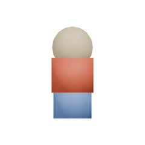 | **Mario** | red `#DE2412`, blue `#2E57C2`, skin `#F5BA69` | 2 |
| 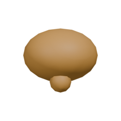 | **Goomba** | brown `#8C450F`, tan `#D4A657` | ~29 |
| 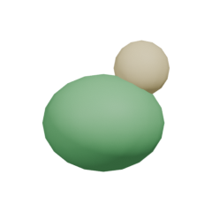 | **Green Koopa** | green `#248F33`, skin `#E6C257` | ~4 |
| 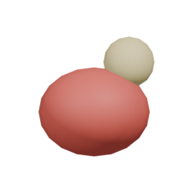 | **Red Koopa** | red `#C71F1A` + skin (shares green's geometry) | ~1 |
| 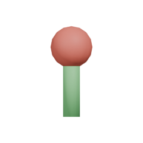 | **Piranha Plant** | stem `#33B33D`, head `#D9291F` | ~4 |

### Pickups
| Render | Model | Material(s) | Copies → 1 |
|---|---|---|---|
| 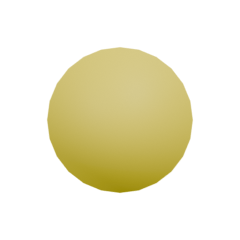 | **Coin** | gold `#FFD600` | ~40 |
| 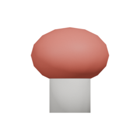 | **Super Mushroom** | red `#D9291F` (shared template) | ~2 |
| 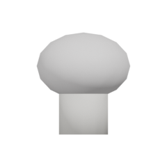 | **Fire Flower** | white `#FAF2F2` (same template, Fire state) | — |
|  | **Starman** | yellow `#FAD91A` | ~2 |
| 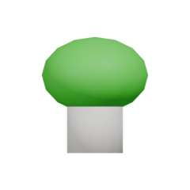 | **1-Up Mushroom** | green `#0DBF0D` | ~2 |

### Effects / projectiles
| Render | Model | Material(s) | Copies → 1 |
|---|---|---|---|
| 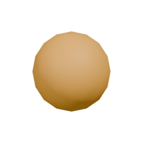 | **Fireball** | orange `#FA730D` | ~2 |
| 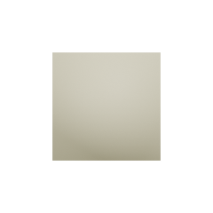 | **Spark** (firework) | warm `#FFF28C` | ~2 |
|  | **Score Popup** | yellow `#FFF233` | ~2 |
| 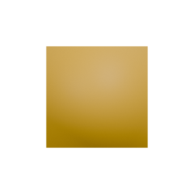 | **Brick Debris** | brown `#C46B00` | ~2 |

### Blocks / terrain (fixed-size → 1 mesh; sized → 1 unit cube + per-object scale)
| Render | Model | Material / texture | Copies → 1 |
|---|---|---|---|
| 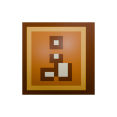 | **? Block** | `qblock` TGA (yellow ? on orange) | ~5 |
| 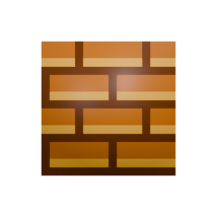 | **Brick** | `brick` TGA (running-bond) | ~15 |
| 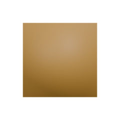 | **Hard Block** (staircase/pyramid) | `#7A400D` (unit cube + scale) | ~28 |
| 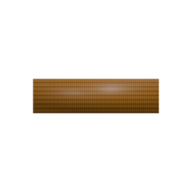 | **Ground segment** | grid TGA + side `#8F6126` | ~6 |
|  | **Pipe** | green `#009E00` (+ scale for height) | ~7 |
| 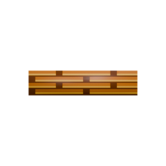 | **Underground Ceiling** | brick TGA `#8C4D24` | ~2 |
| 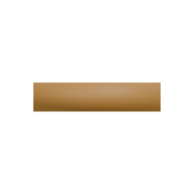 | **Coin-Room Floor** | `#73380D` | ~1 |

### Flagpole / castle
| Render | Model | Material(s) | Copies → 1 |
|---|---|---|---|
| 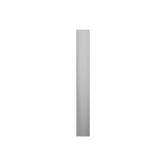 | **Flagpole Pole** | grey `#B8B8B8` | ~2 |
|  | **Pole Flag** | green `#1AA629` | ~2 |
| 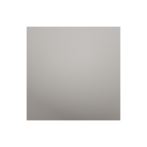 | **Castle** | `#998C80` | ~1 |
| 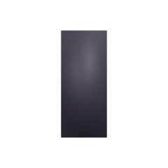 | **Castle Door** | `#0D0A0F` | ~1 |
|  | **Warp-Zone Sign** | yellow `#F2EB33` | ~1 |

≈ **26 unique models** vs **108 unique meshes** currently in W1-2 alone.

## Architecture (corrected, per user 2026-06-01)
- **Rooms are the asset-streaming unit.** Each SMB level has **2 rooms**: `RM0` (the whole surface
  level, loaded at level start) and `RM1` (the bonus coin room, streamed in on pipe-entry). The OOM
  is `RM0` — it must hold every unique surface mesh at once.
- **PERM is per-level** (loaded once per level, shared by *that level's* rooms) — NOT game-wide.
  So "load once for the whole game" is not a thing; the runtime unit is the level. "One coin for the
  whole game" means **one source `.iff`** (no per-level source copies), loaded per-level.

## Approach
1. **Exporter dedup** — `export_level.py`: write one `.iff` per **mesh datablock**, not per object;
   the 2nd+ object sharing a datablock references the first's `.iff`. Auto-fixes the already-shared
   goombas/coins (no limit change). Builders for the rest (koopas, bricks, hard-blocks, pipes,
   piranhas) start sharing a datablock — build geometry once, instance with per-object location
   (and scale for size variants) — so the dedup applies to them too.
2. **Put the common meshes in PERM** — these levels barely stream, so the shared models
   (coin/goomba/brick/koopa/…) belong in PERM: loaded once per level and shared by `RM0`+`RM1`
   instead of duplicated per-room. Cuts the `RM0` pool directly.
3. **One source `.iff` per type** — a single canonical mesh per model in a shared dir, referenced by
   all SMB levels (no per-level source copies).
4. **If PERM overflows** (plausible if "everything" goes in PERM — fine for these small 80s ports):
   **shrink the ROOM texture allocation** (`PAGEX/PAGEY` in `textile.flags`, freeing room for
   `PERMPAGEX/PERMPAGEY`). This is a limit/allocation change → **discuss with user first**
   ([[feedback_check_git_diff_before_bumping_pools]]).

## Order of operations
(1) exporter dedup + builder datablock-sharing is the no-limit-change core that fixes the per-instance
bloat (108→~26 unique in RM0) and very likely the OOM by itself. (2) PERM placement + (4) the
texture rebalance come after, with sign-off, only if still needed.

## Rule captured
[[feedback_share_mesh_datablocks]] (identical actors share one mesh; each unique mesh = a room-pool
entry) + [[feedback_check_git_diff_before_bumping_pools]] (never bump a limit without asking).
