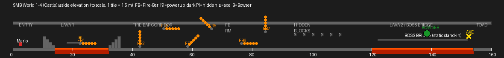

# Build a faithful Super Mario Bros. World 1-4 (Castle)

**Date:** 2026-06-03
**Status:** Not started
**Author:** Claude (Sonnet 4.6)

## Goal

Add **SMB World 1-4** — the first castle — to the level set. W1-4 introduces four new
mechanics not present in W1-1 through W1-3:

| Mechanic | Phase 1 treatment |
|---|---|
| Castle corridor (closed ceiling, gray tileset, lava sections) | Implement |
| Fire-Bars (spinning hazard) | Implement — cross-product orbital velocity, no sin/cos needed |
| Fake Bowser (walks bridge, fires fireballs, requires 5 fireball hits OR the axe) | Implement |
| Axe + bridge collapse | Axe triggers celebration; bridge is a **static stand-in** |
| Moving bridge / Bowser's bridge carry | **Deferred to Phase 2 plan** |

Reference: [`docs/smb-level-layouts.md` §1-4](../smb-level-layouts.md).
Shared castle structure with 6-4 (which adds more Fire-Bars and Podoboos).

## Layout (160 tiles = 240 m)



`T = 1.5 m`. `FLOOR_Z = 0`. `CEILING_Z = 8T = 12 m`. `LAVA_SURFACE_Z = −2T = −3 m`.

```
Section              Cols     Description
─────────────────────────────────────────────────────────────────────
Entry corridor        0–10    Solid gray floor + ceiling; Mario spawns col 2
Step-down            10–14    4-step staircase descending to lava level
LAVA PIT 1           14–32    Lava floor (death sensor); one 8-tile platform cols 18–26
                              at Z=2T; Fire-Bar #1 pivot col 22 Z=2T; ? Block col 22 Z=4T
Step-up              32–36    4-step back to ground level
FIRE-BAR CORRIDOR    36–70    Solid floor + ceiling; 4 Fire-Bars
                              FB#2 col 42 Z=1T (floor), FB#3 col 50 Z=7T (ceil)
                              FB#4 col 58 Z=1T, FB#5 col 66 Z=7T
FIRE-BAR ROOM        70–90    Solid floor + ceiling; 2 Fire-Bars
                              FB#6 col 76 Z=2T (low), FB#7 col 84 Z=6T (high)
HIDDEN BLOCK CHAMBER 90–112   Solid floor + ceiling; 6 hidden ? blocks
                              at Z=5T (hit-from-below); cols 94,97,100,103,106,109
APPROACH             112–120  Solid floor bridge to lava boss section
LAVA PIT 2           120–154  Lava floor; Boss Bridge static stand-in (solid platform
                              cols 122–152 at Z=3T, marked TODO-moving-platform)
                              Fake Bowser starts col 138; Axe at col 152
TOAD ROOM            154–160  Narrow solid ground strip; castle-wall end cap
```

All gaps between platform Z=3T and ground Z=0 are jumpable step-downs.  
Ceiling tiles seal every section (no sky visible anywhere in the castle).

## New mechanics design

### Fire-Bars — cross-product orbital velocity

Each fire-bar is 1 pivot (a statplat hard block, `smb_hard_block` material) + 5 fire
segments (Physics actors, `smb_lava` material, 0.5T cube). The **cross-product velocity
formula** maintains a perfect circle from any correct starting position — no sin/cos needed:

```
XSPEED = −OMEGA × (Z_POS − PIVOT_Z)
ZSPEED =  OMEGA × (X_POS − PIVOT_X) − 9.81 × DELTA_TIME   # gravity correction
```

Each segment is placed in Blender at its starting position (pivot + radius × unit vector at
θ=0 for the bar's initial angle). `FIREBAR_SCRIPT` reads `LOCAL_FIREBAR_PIVOT_X` /
`LOCAL_FIREBAR_PIVOT_Z` (written via `set_mailbox` at spawn) and `INDEXOF_DELTA_TIME` for
the gravity correction, then writes `XSPEED` and `ZSPEED` each frame.

- `omega = 2π / 3.0 ≈ 2.09 rad/s` (one rotation in 3 s; faithful to NES fire-bar cadence)
- Radii: `T, 2T, 3T, 4T, 5T` (5 segments per bar, 1.5 m spacing)
- Each bar's segments share a `LOCAL_FIREBAR_PIVOT_X/Z` mailbox pair.
  Use local mailbox indices 3900–3903 (two per segment suffice since pivot is shared; give
  each bar a unique pair, or store per-actor in actor-local space — confirm which is cleaner
  against the mailbox table at implementation time).
- Each segment is a lethal enemy (proximity death, no stomp) via a trimmed `ENEMY_SCRIPT`
  variant that skips the walk / stomp logic and just damages Mario on XZ proximity.

Gravity correction note: the `ZSPEED` line adds `−9.81 × dt` each frame. Since Jolt adds
gravity **after** the script sets `ZSPEED`, there will be residual drift ≈ g×dt² per frame
(< 1 mm at 60 fps). If visible, switch to direct `Z_POS` writes (also writable, confirmed
by `BRICK_SCRIPT`) with a tracked angle local-mailbox.

### Fake Bowser — `FAKEBOWSER_SCRIPT`

A large Physics actor (1.5T × 1.5T) on the boss bridge that:

1. **Walks** the bridge back-and-forth (like `ENEMY_SCRIPT` wall-bounce logic).
2. **Fires fireballs** leftward at Mario every 2 s (spawns a `fireball_template` via
   `ConstructTemplateObject` with `XSPEED = −12`). Timer via accumulated `DELTA_TIME`.
3. **Hit points.** Local mailbox `LOCAL_BOWSER_HP` initialised to 5. Each Mario fireball
   contact (detected via `SMB_FIREBALL_LIVE_X / Z` proximity, same as enemy defeat
   already in `ENEMY_SCRIPT`) decrements HP; at 0 → `0 INDEXOF_ALIVE write-mailbox` and
   write `1 INDEXOF_SMB_CELEBRATE write-mailbox` (same as axe).
4. **Cannot be stomped** — touching from above just damages Mario (treat as side contact).
5. **Cannot be shelled** (ignore `COLLIDER_IDX` from koopa shells).

Fake Bowser mesh: reuse `koopa_green` body scaled 2× via actor `x/y/z_scale` OAD fields
(the scale pipeline now handles this end-to-end since the mesh-collapse plan).
No new mesh `.iff` needed.

### Axe — `AXE_SCRIPT`

A small gold-coloured Anchored actor at col 152. `AXE_SCRIPT` mirrors `COIN_PICKUP_SCRIPT`:
proximity to Mario (|dx| < 1T, |dz| < 1T) triggers:

```forth
1 INDEXOF_SMB_CELEBRATE write-mailbox
0 INDEXOF_ALIVE write-mailbox
```

The Director's existing `SMB_CELEBRATE` handler fires the end-of-level celebration sequence.
The celebration is reused verbatim (flagpole slide is replaced by the static castle doorway
already present in W1-2/W1-3). For the Toad "Another Castle" text: filed as TODO — a
title-card actor showing text is a separate feature; for now the celebration just transitions
to the next level.

Axe mesh: new `unit_box_smb_axe.iff` in the shared `wflevels/smb/` dir — a small
`smb_hard_block` coloured gold via material override. Alternatively reuse
`unit_box_smb_castle.iff` with a bright tint; decide at implementation.

### Boss bridge static stand-in

A wide statplat spanning cols 122–152 at Z = 3T, `smb_hard_block` material, with a
`# TODO(moving-platform Phase 2): replace with animated collapsing bridge` comment.
The bridge does not move or collapse in Phase 1. After the axe is touched Fake Bowser
despawns and the celebration fires; Mario can walk off the platform normally.

### Castle corridor

`_add_castle_corridor(name, col_start, col_end)` helper:
- Floor tiles: `add_statplat` from `col_start*T` to `col_end*T`, Z range `[−T, 0]`,
  `smb_castle` material (already `unit_box_smb_castle.iff` in shared dir).
- Ceiling tiles: same X span, Z range `[CEILING_Z, CEILING_Z+T]`, same material.
- No side walls between sections (open corridor).

Lava floor sections: instead of the floor statplat, place a `smb_lava` statplat
(`Z [−3T, −2T]`, new `unit_box_smb_lava.iff` — a red/orange unit box added to shared
dir) plus a pit-death sensor (`Anchored`, `TRIGGER_SCRIPT` → `SMB_PLAYER_HURT`) spanning
Z `[−5T, −2T]`.

Background: set camera `Background Colour` to `0x1C1C1C` (dark charcoal — matches NES
castle black) and `FoggingColor` to the same dark value. Castle levels have no sky.

## Phases

### Phase 0 — Scaffold + new shared assets

1. `mkdir wflevels/smb_w1_4/`; write `mesh.flags` (`MESH_DIR=../smb`,
   `MESH_REF_PREFIX=../smb/`).
2. Start `blender_create_smb_w1_4.py` from W1-3 as template; strip tree-tops,
   paratroopas, open-sky setup; keep snowgoons-import skeleton, `smb_common` imports,
   `player_script`, `director_script`, `celebration`.
3. **New shared mesh:** `unit_box_smb_lava.iff` — a unit-box with a red/orange material
   (`smb_lava`, RGB `0xFF4500`). Add to `wflevels/smb/` via `_unit_box_geo` + a
   `smb_lava` material entry in `smb_common.py`'s material table.
4. **New shared mesh:** `unit_box_smb_axe.iff` (bright gold unit box,
   `smb_axe` material, RGB `0xFFD700`).
5. **New shared mesh (maybe):** `unit_box_smb_firebar.iff` — a small red/orange
   0.5T cube for fire segments. Or reuse `unit_box_smb_lava.iff` at a scaled-down size
   (scale pipeline handles it).
6. **New Forth script:** `FIREBAR_SCRIPT` in `smb_common.py`.
7. **New Forth script:** `FAKEBOWSER_SCRIPT` in `smb_common.py`.
8. **New Forth script:** `AXE_SCRIPT` in `smb_common.py`.
9. **New mailbox entries** in `wfsource/source/game/mailbox.inc`: `LOCAL_FIREBAR_PIVOT_X`,
   `LOCAL_FIREBAR_PIVOT_Z` in the local-actor range. Confirm range availability.

### Phase 1 — Castle geometry

- `_add_castle_corridor` helper as described above.
- Entry corridor (cols 0–10), step-down staircase (cols 10–14), step-up staircase (32–36),
  fire-bar corridor (36–70), fire-bar room (70–90), hidden block chamber (90–112),
  approach (112–120), end strip (154–160).
- LAVA PIT 1: lava statplat + death sensor (cols 14–32).
- LAVA PIT 2 (boss section): lava + death sensor (cols 120–154); boss bridge stand-in.
- Platform over lava pit 1 (cols 18–26 at Z=2T).
- Dark background / fogging in camera + director config.
- `actboxor` `w1_4_abor_surface` for `cs_castle` (or reuse `cs_side` — verify which
  collision surface is needed for closed-ceiling levels).
- **Verify:** `blender --background --python` exports a `.lev` with expected object count.
  Screenshot the spawn: gray walls, dark background, lava visible.

### Phase 2 — Fire-Bars

- `_build_firebar(name, pivot_col, pivot_z, omega, n_segs=5, initial_angle=0)` builder
  in the W1-4 script (not promoted to `smb_common` yet — wait until a second castle needs it).
- Places pivot hard block + `n_segs` fire segments at starting positions
  `(pivot_x + r*cos(initial_angle), pivot_z + r*sin(initial_angle))` for
  `r = 1T, 2T, …, n_segs*T`.
- For each segment: `set_mailbox(seg, LOCAL_FIREBAR_PIVOT_X, pivot_x)` and
  `set_mailbox(seg, LOCAL_FIREBAR_PIVOT_Z, pivot_z)`.
- Assign `FIREBAR_SCRIPT`. Mark segment as lethal (`SMB_PLAYER_HURT` on proximity,
  same proximity radius as other enemies, **no stomp path**).
- Place the 7 bars per the layout table above. Alternate `initial_angle` between bars
  so all 7 don't start in the same orientation (0°, 90°, 180°, 45°, 135°, 0°, 90°).
- **Verify:** run headless, dump segment positions from bridge, confirm they change frame
  over frame and orbit the correct pivot.

### Phase 3 — Enemies + items

- `_build_fakebowser(name, col)`: spawns a large Physics actor at `col*T`, Z=3T (on the
  boss bridge), scaled 2×, `FAKEBOWSER_SCRIPT`. Sets `LOCAL_BOWSER_HP=5` via
  `set_mailbox`.
- `? Block` (powerup) at col 22, Z=4T (hit from below by jumping from the lava platform).
  Reuse `_make_powerup_block` from `smb_common`.
- 6 hidden `? Block` at Z=5T in the hidden block chamber — reuse `_make_powerup_block`
  with `hidden=True` (the block is invisible until bumped from below; coin pops out).
  Coins use `COIN_PICKUP_SCRIPT`. If "hidden block" (invisible until hit) isn't yet
  implemented in `smb_common`, implement it here: a Visibility Mailbox = 0 block whose
  `QBLOCK_SCRIPT` variant reveals itself on Z-axis bump.

### Phase 4 — Axe + celebration wiring

- `_build_axe(name, col)`: Anchored actor at `col*T`, Z=3T, `unit_box_smb_axe.iff`,
  `AXE_SCRIPT`.
- Director script: the existing `SMB_CELEBRATE` handler already fires the celebration
  sequence and `END_OF_LEVEL`. No Director change needed — the axe writes `SMB_CELEBRATE`
  just like the flag ActBox.
- `celebration(cfg)` call: `FLAGPOLE_X` = col 152 × T (the axe X), `NEXT_LEVEL_INDEX` = 0
  (loops back to W1-1 — W1-5 doesn't exist yet). The castle + castle-flag animations in
  `celebration()` are reused; the flagpole-slide is suppressed because `FLAGPOLE_X` is
  at the end of the level with no pole actor (the pole builder is only called when
  `celebration()` places it — audit which actors in `celebration()` are optional and skip
  the pole + flag actors for the castle variant, OR wire a dummy pole). Simplest: call
  `celebration(cfg)` as-is and also place a flagpole at the axe position (won't look
  wrong inside the castle — the celebration flagpole is inside the castle wall). Revisit
  appearance in Phase 5 verify.
- `NEXT_LEVEL_INDEX` for W1-3 stays at 0 until W1-4 is in `cd.iff` (Phase 5 re-points it).

### Phase 5 — Build pipeline + level chaining

1. `blender --background --python wflevels/smb_w1_4/blender_create_smb_w1_4.py`
2. `bash wftools/wf_blender/build_level_binary.sh smb_w1_4`
3. Add `wflevels/smb_w1_4/smb_w1_4-standalone.iff.txt` (mirror W1-3 standalone wrapper,
   point at `../smb_w1_4.iff`).
4. **Insert W1-4 as cd.iff level 3**: edit `Taskfile.yml` `build-cd-iff` command — order
   becomes `[smb_w1_1 (0), smb_w1_2 (1), smb_w1_3 (2), smb_w1_4 (3), snowgoons (4), qbert (5)]`.
5. **Re-point W1-3 → W1-4**: change W1-3's `celebration` `NEXT_LEVEL_INDEX` 0→3, re-export
   + rebuild W1-3.
6. `task build-cd-iff`.

### Phase 6 — Verify (headless)

- `task build`; verify binary timestamp advanced (`ls -la engine/wf_game`).
- Boot standalone `smb_w1_4-standalone.iff` via `task run-debug`.
- Capture still at spawn: gray walls, dark background, lava below the step-down.
- Debug-bridge walk: inject `joystick1_raw=0x2000` to drive Mario rightward.
  - Confirm lava pit 1 death (Mario falls off the platform → `SMB_PLAYER_HURT` fires).
  - Confirm fire-bar segments are moving (query segment X_POS frame over frame).
  - Confirm ? block spawns a powerup.
  - Confirm fake Bowser fires fireballs (check fireball_template actors appear).
  - Confirm axe triggers celebration → `END_OF_LEVEL` written.
- Add `tests/screenshots/smb_w14_*.png` checkpoints.
- `tests/verify_smb_w1_4_enemies.py`: assert fire-bar segment positions change by > 0.5 m
  between frames (orbit confirmed); assert Fake Bowser fires a fireball within 5 s of spawn.

### Phase 7 — TODO + commit

- Add `TODO.md` entry for: "Toad 'Another Castle' title-card text" (a static message
  actor after axe → needs string rendering, deferred).
- Update W1-3 plan status → DONE (already marked).
- Update `wf-status.md` with W1-4 summary entry (reverse-chron prepend).
- Git commit: `feat(smb): faithful World 1-4 castle — fire-bars, fake Bowser, axe`.

## Phase 2 deferred plan — Moving platforms

**Separate plan to be written before implementation.**  
Scope (from `TODO.md:135` + W1-3 Phase 8):

1. `JoltCharacterGetGroundVelocity()` — wrap `CharacterVirtual::GetGroundVelocity()` in
   [`jolt_backend.cc`](../../wfsource/source/physics/jolt_backend.cc).
2. Add ground velocity to the character's XY before `JoltCharacterSetLinVelocity` in the
   Jolt ground branch ([`movement.cc:441`](../../wfsource/source/movement/movement.cc)).
3. Give movers a **KINEMATIC** Jolt body on a layer `WFCharObjLayerFilter` accepts;
   pose-driven each frame from the actor's Path/scripted position.
4. Route `MOBILITY_PATH` (or scripted Anchored) actors through body creation in `actor.cc`.
5. **Retrofit W1-3** static stand-ins: `w1_3_lift_step_*` → real vertical mover,
   `w1_3_mover_0/1` → real horizontal movers.
6. **Retrofit W1-4** boss bridge: static stand-in → animated collapsing bridge
   (triggered on axe touch via `SMB_CELEBRATE` rising edge in the bridge's own script).

No current level uses movers → zero regression risk; purely additive.

## New artifacts

| Path | Description |
|---|---|
| `wflevels/smb_w1_4/blender_create_smb_w1_4.py` | Level script |
| `wflevels/smb_w1_4/mesh.flags` | Shared mesh dir pointer |
| `wflevels/smb_w1_4/smb_w1_4-standalone.iff.txt` | Standalone wrapper |
| `wflevels/smb_w1_4/smb_w1_4.{lev,lvl,iff.txt,ini,...}` | Generated build artifacts |
| `wflevels/smb/unit_box_smb_lava.iff` | Lava floor tile |
| `wflevels/smb/unit_box_smb_axe.iff` | Axe collectible mesh |
| `wflevels/smb/unit_box_smb_firebar.iff` | Fire-bar segment (or reuse lava tile at scale) |
| `wflevels/smb/w1_4_abor_surface.iff` | W1-4 collision surface actor |
| `wflevels/smb/w1_4_ground_{0,1}.iff` | Entry + end ground meshes |
| `wflevels/smb/w1_4_pit_death_{0,1}.iff` | Lava death sensors |
| `smb_common.py` additions | `FIREBAR_SCRIPT`, `FAKEBOWSER_SCRIPT`, `AXE_SCRIPT`, `smb_lava` mat, `smb_axe` mat |
| `mailbox.inc` | `LOCAL_FIREBAR_PIVOT_X`, `LOCAL_FIREBAR_PIVOT_Z` entries |
| `tests/verify_smb_w1_4_enemies.py` | Headless fire-bar + Bowser verification |
| `tests/screenshots/smb_w14_*.png` | Verification stills |
| `docs/plans/2026-06-03-smb-moving-platforms.md` | Phase 2 plan stub (write before implementing) |

## Risks

| Risk | Mitigation |
|---|---|
| Fire-bar gravity drift (segment falls over time) | Monitor in Phase 6; switch to direct `Z_POS` write if > 0.5T drift per second |
| Cross-product divergence (segment spirals outward) | Bound radii in `FIREBAR_SCRIPT`: if `sqrt(dx²+dz²) > r_max`, clamp to r_max; or just verify in bridge test |
| Fake Bowser fireball OOM (many fireballs accumulate) | Keep same Generator-based approach as Mario's fireballs; ensure lifetime matches Mario's (3 s TTL) |
| `celebration()` flagpole slide looks wrong indoors | Add a `castle_mode=True` param to `celebration()` that skips the pole-slide actors; or just verify it's acceptable |
| `LOCAL_FIREBAR_PIVOT_X/Z` mailbox range collision | Grep mailbox.inc for the local actor range ceiling before assigning; leave 4 slots per bar (2 coords × 7 bars = 14 indices) |
