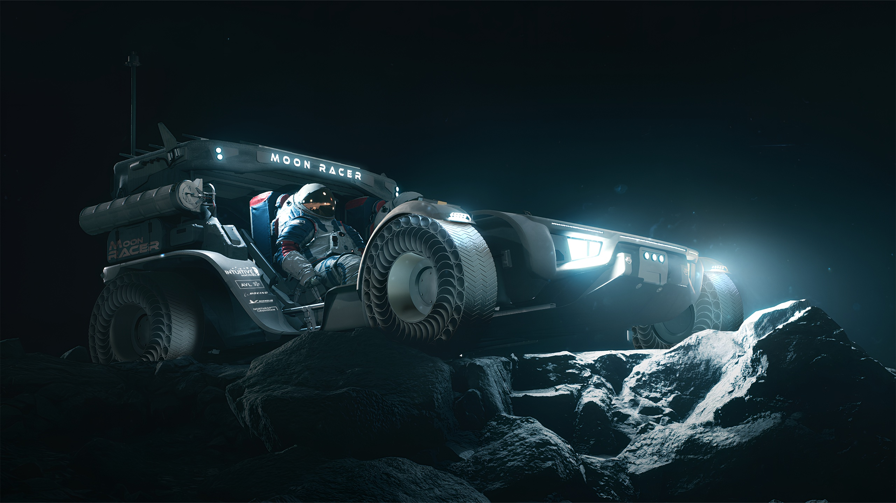
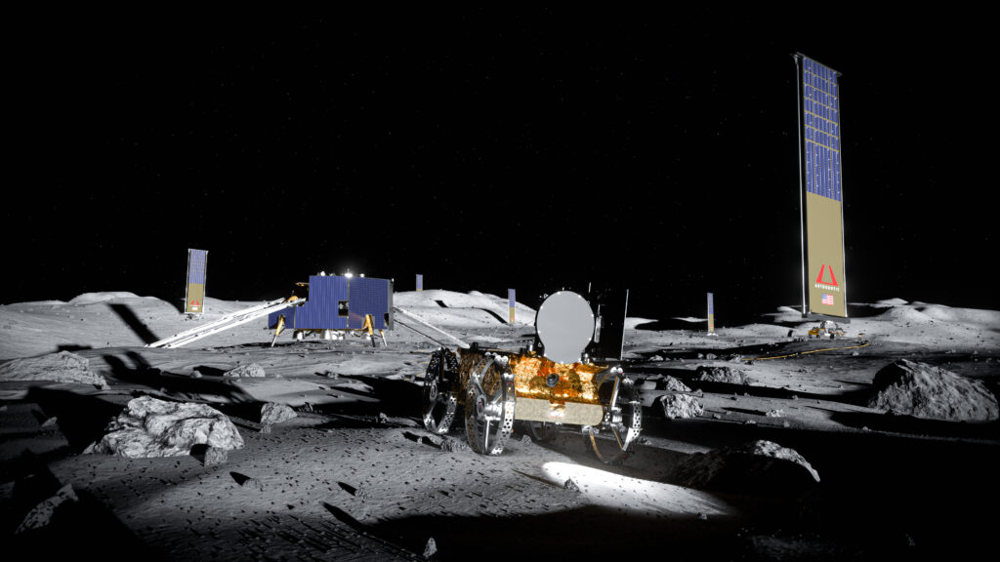
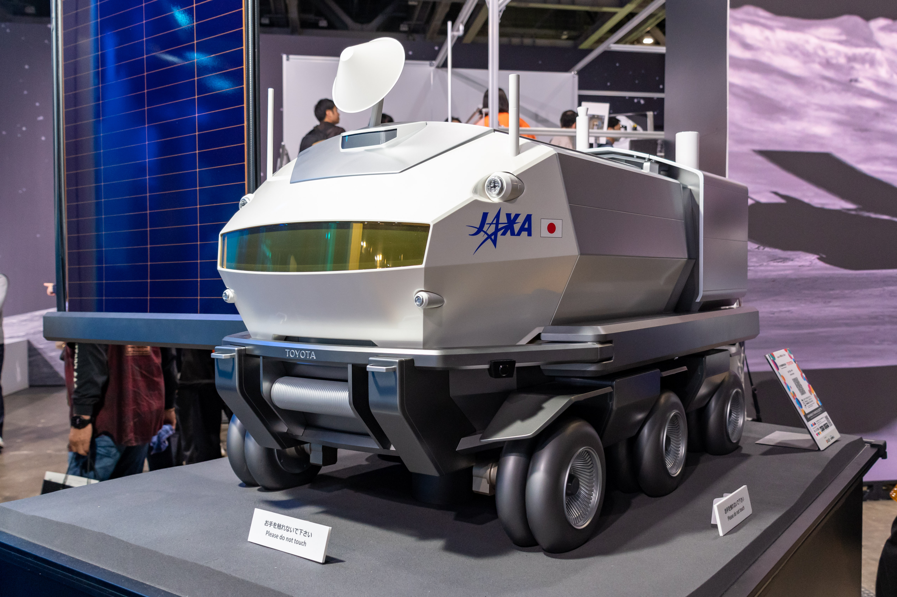
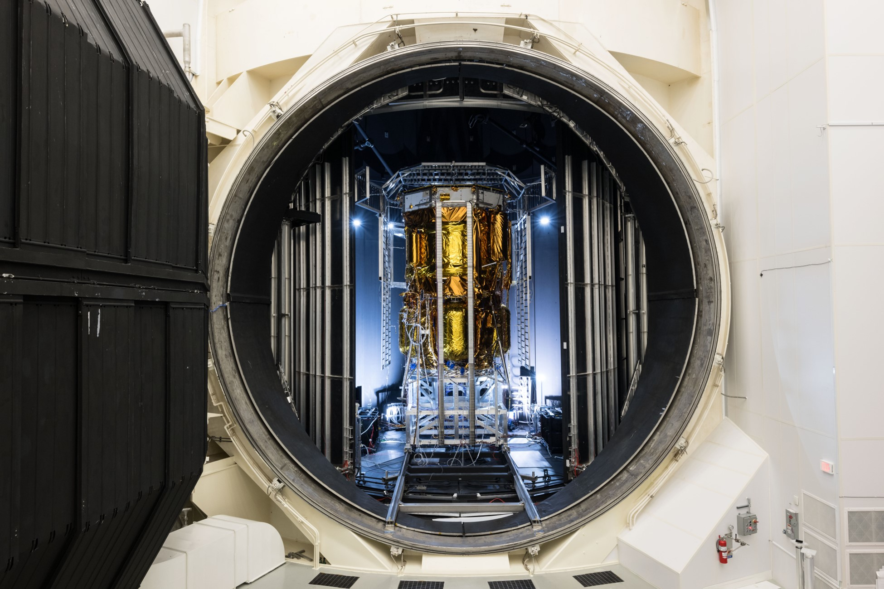
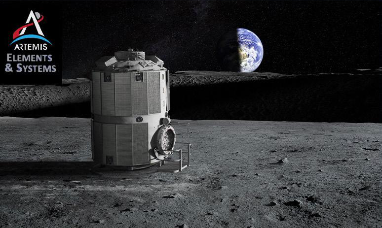
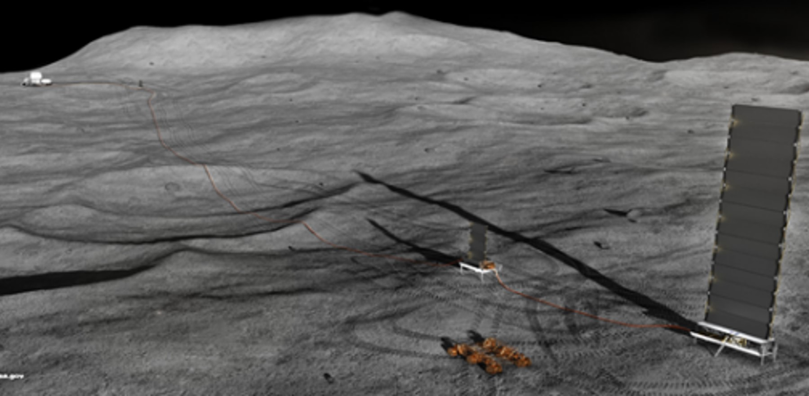
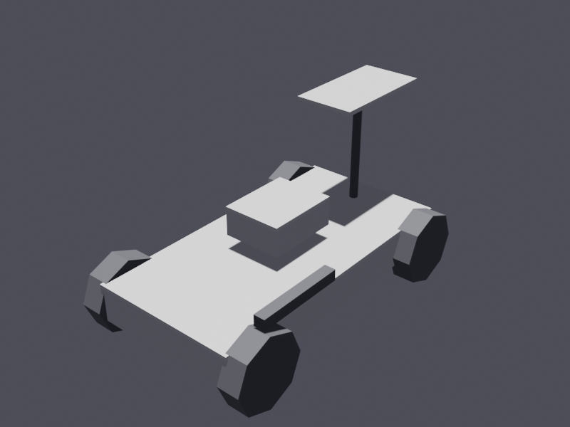

# Moon Site 01 — Surface Asset Models

**Plan file:** docs/plans/2026-06-03-moon-surface-assets.md  
**Context:** The investigation doc `docs/investigations/2026-06-02-moon-site01-future-surface-assets.md` surveyed all real Artemis hardware planned for the lunar south pole. The level already has terrain, an astronaut player, and the Starship HLS lander. This plan adds six priority assets identified in the investigation doc as having the strongest published reference geometry to model against.

---

## Model source survey (2026-06-03)

Searched NASA 3D Resources, NASA GitHub, official Sketchfab/NASA account, contractor sites (Intuitive Machines, Astrobotic, Toyota, Blue Origin), CGTrader, ArtStation, GrabCAD, Printables, and TurboSquid.

| Asset | Official model? | Best community/commercial option | Decision |
|---|---|---|---|
| Moon RACER (LTV) | None | Fan-made low-poly 3MF on Printables (generic concept, not Moon RACER design) | **Build from primitives** |
| VSAT Tower (LunaGrid) | None | Nothing found | **Build from primitives** |
| Lunar Cruiser | None | CGTrader BLEND/FBX 8K (paid); ArtStation FBX ~$45 (paid) — community, no official | **Build from primitives** (purchase deferred) |
| Blue Moon MK1 | None | Sketchfab @Soleg 212k tris (license TBD); CGTrader 359k verts (paid) | **Build from primitives** (purchase deferred) |
| Foundation Surface Habitat | None | Nothing found (design still proprietary/concept-stage) | **Build from primitives** |
| FSP Reactor | None | Kilopower precursor only (wrong vehicle, wrong era) | **Build from primitives** |

## Mesh creation approach

Three tiers depending on source availability:

**Tier A — Sourced model (Lunar Cruiser, Blue Moon MK1):**
1. Download/purchase hi-res model (BLEND or FBX preferred).
2. Vendor the original at `wflevels/moon_site01/vendor/<asset>_hirez.*` — committed to repo.
3. Reduce in Blender to engine limits (< 32k faces): Decimate modifier + manual cleanup.
4. Bake flat-colour materials into PERM-compatible palette (no image textures in hi-res source → reassign to `_make_mat()` colours).
5. Export mesh as `.blend` sidecar; import into `blender_create_moon.py` via `bpy.ops.wm.append()` instead of a `_build_*()` primitive builder.

**Tier B — Primitive build (Moon RACER, VSAT, FSH, FSP):**
Same pattern as `_build_artemis_lander()` and `_build_astronaut()`:
1. `_build_*()` function calls `bpy.ops.mesh.primitive_cylinder_add()` / `cube_add()` / `cone_add()`.
2. Assigns `_make_mat()` colours.
3. Joins parts with `bpy.ops.object.join()`.
4. Returns the joined object.

All materials in both tiers use `_make_mat(name, rgb)` — flat procedural colours, no separate texture images → everything lands in PERM automatically. Do not create per-asset atlas pages.

The level pipeline (`blender --background --python blender_create_moon.py`) rebuilds the whole scene each run. Vendored source models are read-only sidecar files that the script imports; they are not modified by the pipeline.

---

## Phase 1 — Moon RACER (LTV rover)

**Tier B — primitive build** (no model exists anywhere publicly).


*Moon RACER concept art (Intuitive Machines / NASA, April 2024). Source: [NASA News Release 24-027](https://www.nasa.gov/news-release/nasa-selects-companies-to-advance-moon-mobility-for-artemis-missions/).*

**Why Moon RACER:** Investigation doc explicitly calls it "highest-bang-for-buck next addition" and notes Intuitive Machines built a drivable Earth-side mock-up in November 2024 giving the cleanest reference geometry of the three LTV candidates (vs Lunar Dawn / FLEX).

**Dimensions:** ~4 m long × 2 m wide × 1.5 m tall (open-cab electric buggy).

**Primitives in `_build_moon_racer()`:**
- Chassis frame: cube 4.0 × 2.0 × 0.5 m at z=0.6 m (white)
- 4 wire-mesh wheels: cylinder r=0.5, w=0.3 m at corners ±1.6 m fore/aft, ±1.1 m port/starboard, z=0.5 (dark/black)
- Crew seat: cube 1.0 × 0.8 × 0.4 m centered at z=1.25 (white)
- Camera mast: cylinder r=0.06, h=1.5 m at front-centre, z=1.75 (dark)
- Solar panel: cube 1.5 × 0.8 × 0.06 m atop mast (white)
- Robotic arm (folded): cube 1.2 × 0.15 × 0.15 m on starboard rear at z=1.1 (dark)

**Materials:** `rover_white` (0.92, 0.92, 0.92), `rover_dark` (0.15, 0.15, 0.17)

**Placement:** `(15.0, 20.0, 0.0)` — parked in the foreground between astronaut spawn and lander, clearly visible from the vista camera.

**Actor setup:** `statplat`, `Mobility='Anchored'`, `Model Type='Mesh'`, no script.

---

## Phase 2 — Remaining five assets

All added as a new section `# ── 6c. Surface assets ──` after the lander block. Tier A (sourced) assets use `bpy.ops.wm.append()` to load the reduced mesh from a vendored sidecar `.blend`; Tier B (primitive) assets use a `_build_*()` function.

### VSAT Tower (Astrobotic LunaGrid)

**Tier B — primitive build** (no model found anywhere).


*LunaGrid VSAT delivered by Astrobotic's Griffin lander (Astrobotic, July 2024). Source: [Astrobotic press release](https://www.astrobotic.com/lunagrids-vertical-solar-array-technology-enters-tvac/).*

Dimensions: 10 m tall mast, solar array at top.

**Primitives in `_build_vsat_tower()`:**
- Ground anchor: cube 1.5 × 1.5 × 0.4 m at z=0.2 (dark)
- Mast: cylinder r=0.12, h=9.5 m at z=5.5 (silver: 0.78, 0.78, 0.8)
- Solar panel face A: cube 2.5 × 0.06 × 2.0 m at top of mast z=10.5 (white)
- Solar panel face B: same rotated 90° around mast

**Placement:** `(60.0, 40.0, 0.0)` — behind/beside the lander; its 10 m height silhouettes against the sky clearly from the vista camera.

### Toyota / JAXA Lunar Cruiser

**Tier B — primitive build** (no public model; paid community models exist but not purchasing yet).


*Toyota/JAXA Lunar Cruiser 1/5-scale model, Japan Mobility Show 2023. Source: [Wikimedia Commons](https://commons.wikimedia.org/wiki/File:Toyota_JAXA_LUNA_CRUISER_Model_at_Japan_Mobility_Show_2023.jpg) (CC).*

Dimensions: 6 m × 5.2 m × 3.8 m pressurized cabin on 6 large wheels.

**Primitives in `_build_lunar_cruiser()`:**
- Main body box: cube 5.5 × 4.5 × 2.2 m at z=1.8 (white)
- Viewport strip: cube 5.6 × 4.6 × 0.4 m at z=2.8 (dark — eye-level window band)
- Airlock end-cap: cube 0.5 × 3.0 × 2.0 m on +X end at z=1.8 (dark)
- 6 wheels (2 rows of 3): cylinder r=0.7, w=0.35 m; evenly spaced ±1.9 m fore/aft, ±0 centre, ±1.6 m port/starboard, z=0.7 (dark)
- Roof solar boom: cube 2.0 × 0.1 × 0.08 m at z=4.15 + thin panel cube 2.0 × 1.5 × 0.06 m atop it (white)
- Antenna: cylinder r=0.05, h=1.0 m at z=4.7 (dark)

**Materials:** `cruiser_white` (0.90, 0.90, 0.88), `cruiser_dark` (0.18, 0.19, 0.20)

**Placement:** `(-20.0, 35.0, 0.0)` — far side of camp, bulk clearly distinct from the LTV.

### Blue Moon Mark 1 Cargo Lander

**Tier B — primitive build** (no public model; paid community models exist but not purchasing yet).


*Blue Moon Mark 1 after environmental testing in Chamber A, NASA Johnson Space Center (NASA, May 2026). Source: [NASA](https://www.nasa.gov/missions/artemis/blue-origin-moon-lander-completes-testing-at-nasa-vacuum-chamber/).*

Dimensions: ~8 m tall × ~3 m diameter. Gold thermal-blanket body, four splayed landing legs.

**Primitives in `_build_blue_moon_mk1()`:**
- Main tank cylinder: cyl r=1.4, h=5.0 m at z=4.5 (gold: 0.72, 0.55, 0.10)
- Engine skirt: cyl r=1.6, h=0.6 m at z=1.8 (dark: 0.20, 0.20, 0.22)
- Engine bell: cone r1=1.0, r2=0.4, h=1.5 m at z=0.75 (dark)
- Payload deck: cube 3.2 × 3.2 × 0.4 m at z=7.2 (silver: 0.70, 0.72, 0.73)
- 4 landing legs: cylinder r=0.08, h=2.8 m; each rotated 35° outward from vertical at ±45°/±135° in XY, foot radius ~2.5 m (dark)
- Foot pad per leg: cyl r=0.25, h=0.1 m at ground level (dark)

**Materials:** `mk1_gold` (0.72, 0.55, 0.10), `mk1_silver` (0.70, 0.72, 0.73), `mk1_dark` (0.20, 0.20, 0.22)

**Placement:** `(-40.0, -15.0, 0.0)` — second landing site; gold body contrasts Starship's silver in the low polar sun.

### Foundation Surface Habitat (FSH)

**Tier B — primitive build** (design still proprietary/concept-stage; no model exists anywhere).


*NASA Foundation Surface Habitat concept from the Artemis Plan (NASA, September 2020). Public domain. Source: [Wikimedia Commons](https://commons.wikimedia.org/wiki/File:NASA_Foundation_Surface_Habitat.png).*

Dimensions: 4 m-diameter metallic base ~3 m tall; 6.5 m-diameter inflatable upper ~7 m tall. Total ~10 m.

**Primitives in `_build_fsh()`:**
- Metallic base cylinder: cyl r=2.0, h=3.0 m at z=1.5 (dark: 0.25, 0.27, 0.3)
- Airlock stub: cube 2.0 × 1.8 × 2.0 m on +X face at z=1.5 (dark)
- Inflatable upper cylinder: cyl r=3.2, h=6.5 m at z=6.75 (white: 0.90, 0.90, 0.88)
- Transition ring: cyl r=2.6, h=0.8 m at z=3.4 (dark, connecting metallic to inflatable)
- Radiator panels: 2× cube 1.0 × 0.1 × 2.0 m on −X and +X faces of upper section (white)

**Placement:** `(-55.0, 55.0, 0.0)` — back of base camp.

### Fission Surface Power (FSP) Reactor

**Tier B — primitive build** (only Kilopower precursor exists; that's the wrong vehicle and wrong design era).


*NASA Fission Surface Power surface-deployment concept (NASA Glenn Research Center, May 2023). Source: [NASA FSP programme page](https://www.nasa.gov/exploration-systems-development-mission-directorate/fission-surface-power/).*

Dimensions: reactor vessel ~2 m tall × 1.8 m diameter; radiator skirt ~6 m diameter.

**Primitives in `_build_fsp_reactor()`:**
- Reactor vessel: cyl r=0.9, h=2.0 m at z=1.0 (dark grey: 0.3, 0.3, 0.32)
- Conical top shield: cone r1=0.9, r2=0.5, h=1.0 m at z=2.5 (dark)
- 4 radiator fins (fan-out): cube 2.8 × 0.06 × 1.6 m, rotated 0/45/90/135° around Z axis at z=1.0 (silver: 0.65, 0.65, 0.68)
- Regolith shielding berm: cyl r=2.5, h=0.5 m at z=0.25 (lunar: 0.82, 0.80, 0.73)

**Placement:** `(-90.0, 80.0, 0.0)` — kept away from habitat per NASA reference imagery.

---

## Implementation

**File changed:** `wflevels/moon_site01/blender_create_moon.py`

New section after `# ── 6b. Artemis lander ──`:
```python
# ── 6c. Surface assets ────────────────────────────────────────────────────────
# All placed as Anchored statplat actors.
```

Each asset wired as: `attach_schema(obj, 'statplat')`, `Mobility='Anchored'`, `Model Type='Mesh'`, `Visibility Mailbox=1`, no script. No new mailboxes needed.

New primitive builder functions: `_build_moon_racer()`, `_build_vsat_tower()`, `_build_lunar_cruiser()`, `_build_blue_moon_mk1()`, `_build_fsh()`, `_build_fsp_reactor()`.

Reuse `_make_mat()` and `attach_schema()` helpers already in the script.

### Atlas / material placement

**All non-ground materials go in PERM.** All new materials use `_make_mat(name, rgb)` — flat procedural colours, no separate texture images → lands in PERM automatically. Do not create per-asset atlas pages. PERM budget is fine: six new assets are all flat-colour, very low UV area.

### Per-asset screenshot workflow

After each asset's `_build_*()` function is written and the script re-run in Blender, capture a close-up viewport render using the Blender MCP bridge:

```python
# Position the Blender viewport to a 3/4 front-top angle on the asset,
# then capture via mcp__blender__get_viewport_screenshot.
# Save the PNG to docs/plans/screenshots/moon_<asset>.png
# and embed it in the matching section of this plan doc.
```

Steps per asset:
1. Write `_build_*()` + wire actor, `py_compile` check.
2. In Blender (via `mcp__blender__execute_blender_code`): run the build function in isolation, deselect all, select the new object, frame it with `bpy.ops.view3d.view_selected()`, set a 3/4 top-front view angle.
3. `mcp__blender__get_viewport_screenshot` → save PNG.
4. Edit this plan doc: replace the `<!-- screenshot: <asset> -->` placeholder below each heading with ``.

**Commit structure:**
- Phase 1 commit: Moon RACER builder + placement + screenshot in plan + plan doc
- Phase 2 commit (per asset or batched): each remaining asset + screenshot + plan update

---

## Asset renders

Screenshots added here as each asset is completed.

### Moon RACER



### VSAT Tower

<!-- screenshot: vsat_tower -->

### Lunar Cruiser

<!-- screenshot: lunar_cruiser -->

### Blue Moon Mark 1

<!-- screenshot: blue_moon_mk1 -->

### Foundation Surface Habitat

<!-- screenshot: fsh -->

### FSP Reactor

<!-- screenshot: fsp_reactor -->

---

## Verification

```bash
# After each phase:
python3 -m py_compile wflevels/moon_site01/blender_create_moon.py
blender --background --python wflevels/moon_site01/blender_create_moon.py
bash wflevels/moon_site01/build_level_binary.sh
task run -- wflevels/moon_site01/moon_site01-standalone.iff
```

Visual checks from the vista camera (Y=−100, Z=80):
- Moon RACER visible as a small 4-wheeled vehicle between spawn and lander
- VSAT tower vertical mast readable at its placement coords
- Lunar Cruiser bulk clearly larger than LTV
- Blue Moon MK1 gold cylinder distinct from Starship's silver
- FSH at the back of camp identifiable as a habitat (wide inflatable + metallic base)
- FSP radiator fins readable at far placement
