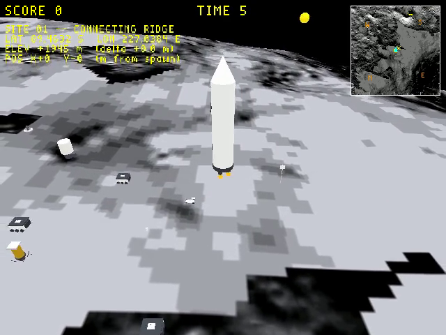
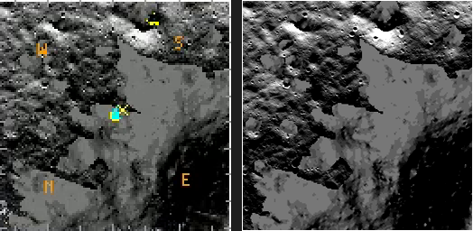
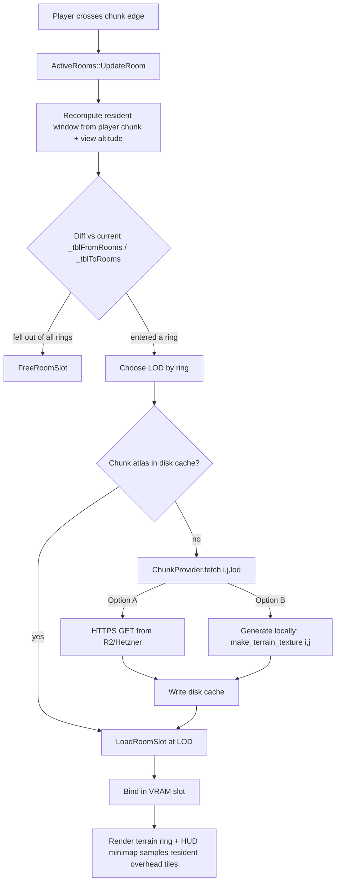

# Moon Overhead-Map / Chunk-Streaming Plan

**Status:** Phase 1 complete (2026-06-04, ~1 hr actual vs ~2–3 hr est.) · Phases 2–5 pending · **Scope (user-chosen):** Full streaming design + Phase 1; resident window sized from horizon math; target whole-moon eventually.

## Context

The logged follow-up was small: the Moon Site 01 minimap is loaded from a hardcoded `fopen("wflevels/moon_site01/minimap.tga")` in `wfsource/source/gfx/gl/display.cc:101`, bypassing the asset bundle. The TODO was "wire it into the cd.iff asset stream."

Pulling that thread unravels a much bigger one. Three facts collide:

1. **A room can't just hold an extra TGA.** `wfsource/source/asset/assslot.cc:92` *asserts* that every TGA in a room/PERM slot is either the palette (`0xFFE`) or the single atlas (`0xFFF`). All object textures are packed into that one atlas by **textile**; the only per-room texture is the ground atlas. So the minimap must live *inside* an atlas, not beside it.
2. **The moon is huge.** At 1 km × 1 km chunks the whole lunar surface is **37.9 million chunks**. You cannot keep every chunk's ground texture (let alone its overhead map) resident — you must stream.
3. **The overhead map *is* the ground texture, downscaled — never a stored asset.** Confirmed against the data: `wflevels/moon_site01/Room0.ruv` holds **exactly one** texture, `terrain_texture.tga` at `(u=0,v=0,w=1024,h=1024)` — the ground texture *fills the whole room atlas* and already is a top-down orthographic image of the chunk. So the minimap is just a downscaled sample of whatever ground-LOD atlas each chunk currently holds resident (1024² near / 256² mid / 64² far). The shipped `minimap.tga` is a redundant copy and gets **deleted**. Stored low-res tiles are needed *only* for far/non-resident chunks, where they double as the distant-terrain LOD.

So this plan designs the **moon chunk-streaming architecture** and lands a concrete **Phase 1**: derive the minimap at runtime from the resident ground atlas (deleting `minimap.tga` and the `fopen`). The intended outcome: a moon you can walk/drive/fly across, with terrain that streams in chunks, a HUD minimap that stitches the resident chunks at their live LOD, and a clear path from "one site" to "whole moon."

## What already exists — build on it, don't rebuild

The engine **already streams rooms**. We are extending a working system, not inventing one.

| Capability | Where | Today's value |
|---|---|---|
| Room residency (load/free slots) | `asset/assets.cc` `LoadRoomSlot`/`FreeRoomSlot` | 3 transient + 1 perm |
| Streaming trigger | `room/actrooms.cc` `ActiveRooms::UpdateRoom` → `ChangeActiveRoom` | player bbox exits room → rescan → swap |
| Active-set diff (load-new / free-old) | `actrooms.cc` `_tblFromRooms`/`_tblToRooms` | **already set-based, not hardwired to 2** |
| Room adjacency | `oas/levelcon.h` `_RoomOnDisk.adjacentRooms[]` | `MAX_ADJACENT_ROOMS = 2` |
| VRAM slots | `gfx/vmem.hp` | `MAX_TRANSIENT_SLOTS = 3` |
| Per-chunk atlas + UV table | textile → `Room_n.tga` + `Room_n.ruv`; runtime `RMUV::GetRMUV("name")` (`gfx/rmuv.cc:60`) | by filename, 48 B/entry |
| Resident atlas as bound GL texture | `vmem.hpi` `GetSlotTexturePixelMap(slot)` → `PixelMap::SetGLTexture()` | one per slot |

The two streaming knobs (`MAX_ADJACENT_ROOMS`, `MAX_TRANSIENT_SLOTS`) and the synchronous `LoadRoomSlot` disk read are the only things that genuinely cap scale. The active-set diff logic generalizes to any resident set already.

---

## Map 1 — how we chunk the surface

Chunks are 1 km × 1 km cells on the **south-polar stereographic (PS)** grid that `display.cc` already uses for the position readout (`LAT0 = -89.4632`, `LON0 = 227.0381`, PS centre `(-11000, -12000) m`). Chunk `(i, j)` covers PS metres `[i·1000, (i+1)·1000) × [j·1000, (j+1)·1000)`; its WF room bounding box is that cell. Today's single static room = chunk `(0,0)` at the game origin.

> **Chunk size is pinned at 1 km by the mesh format, not taste:** terrain face indices are `int16`, capping a chunk at ~127 verts/side; at 10 m sampling that's 1.27 km. 1 km (100 verts/side, 99×99 quads — exactly today's `lunar_terrain.iff`) leaves headroom.

Top-down view, player at chunk `(0,0)`, LOD rings around them:

```
        ┌────┬────┬────┬────┬────┬────┬────┐
  +3    │    │    │    │    │    │    │    │   far ring  ── overhead-LOD (64²)
        ├────┼────┼────┼────┼────┼────┼────┤              distant terrain == minimap tiles
  +2    │    │ ▒▒ │ ▒▒ │ ▒▒ │ ▒▒ │ ▒▒ │    │   mid ring  ── ¼-res (256²)
        ├────┼────┼━━━━┿━━━━┿━━━━┼────┼────┤
  +1    │    │ ▒▒ │████│████│████│ ▒▒ │    │  ┐
        ├────┼────┃████│████│████┃────┼────┤  │  near ring ── full-res (1024²)
   0    │    │ ▒▒ │████│ @@ │████│ ▒▒ │    │  │  @@ = player's chunk
        ├────┼────┃████│████│████┃────┼────┤  │  walk/drive happens here
  -1    │    │ ▒▒ │████│████│████│ ▒▒ │    │  ┘
        ├────┼────┼━━━━┿━━━━┿━━━━┼────┼────┤
  -2    │    │ ▒▒ │ ▒▒ │ ▒▒ │ ▒▒ │ ▒▒ │    │
        ├────┼────┼────┼────┼────┼────┼────┤
  -3    │    │    │    │    │    │    │    │
        └────┴────┴────┴────┴────┴────┴────┘
   col   -3   -2   -1    0   +1   +2   +3      (each cell = 1 km)
```

As the player crosses a chunk edge, the rings slide: `ChangeActiveRoom` frees chunks that fell out of a ring and loads the ones that entered — at the ring's LOD. This is the existing mechanism with (a) a bigger resident set and (b) a per-chunk LOD choice.

---

## Map 2 — horizon math sets the ring sizes

Size the window **from horizon math** rather than fixing a grid. Lunar horizon distance `d ≈ √(2·R·h)`, `R = 1737.4 km`:

| Viewpoint | eye/altitude | horizon | chunks to edge | full window |
|---|---:|---:|---:|---:|
| Astronaut on foot | 1.8 m | **2.5 km** | ±3 | 7×7 |
| Rover / crater rim | 10 m | 5.9 km | ±6 | 13×13 |
| Ridge top | 100 m | **18.6 km** | ±19 | 39×39 |
| Low flight (lander) | 1 km | 59 km | ±59 | 119×119 |
| High flight | 10 km | 186 km | ±187 | 375×375 |

Two conclusions:

- **Ground play is naturally short-ranged** (2.5 km ≈ 3 chunks). Full-res detail only matters within ~±2 chunks.
- **A single resident grid cannot serve elevated views.** A ridge sees 39×39 = 1521 chunks; at full res that's **3.2 GB of VRAM** — impossible. The only way to "see far" is **LOD rings**: full detail near, progressively coarser out to the horizon. And the coarse tiles are exactly the overhead/minimap images.

Cross-section (why far tiles must be coarse):

```
   altitude
     100m ┤●  ridge eye                                      horizon ≈ 18.6 km
          │ \____
      10m ┤      \________                  horizon ≈ 5.9 km
     1.8m ┤●______________\__________________  horizon ≈ 2.5 km
          └──┬─────┬─────┬─────┬─────┬─────┬──►  ground distance
             1km   3km   6km   10km  15km  19km
   LOD:    │ full │ full│ mid │ mid │ far │ far │
           │ 1024²│     │ 256²│     │ 64² │     │   detail you can't resolve anyway
```

### Chosen ring layout (the horizon-derived decision)

Each ring loads the chunk's **ground atlas at a different LOD** — and that same resident atlas is what the HUD minimap samples for that chunk. There is no separate overhead asset; "minimap tile" and "this chunk's resident ground LOD" are one texture.

| Ring | Covers | Resident ground LOD | grid | chunks |
|---|---|---|---:|---:|
| **Near** (full detail) | ground play, astronaut horizon | 1024² (2.1 MB) | 5×5 | 25 |
| **Mid** | rover / rim distance | 256² (0.13 MB) | 13×13 minus near | 144 |
| **Far** | ridge horizon | 64² (8 KB) | 39×39 minus mid | 1352 |

Far rings beyond 39×39 (flight altitude) switch to a single pre-baked **global overhead mosaic** instead of per-chunk tiles — see Phase 5.

---

## Budget — memory & disk

### Per-chunk storage (BGR555, 2 B/px — matches today's `Room0.tga` = 2.10 MB)

| Asset | Size |
|---|---:|
| Ground atlas `Room_n.tga` 1024² | 2.10 MB |
| Mid LOD 256² (resident texture for mid ring) | 0.13 MB |
| Far LOD 64² (resident texture for far ring) | 0.008 MB |
| Terrain mesh `lunar_terrain.iff` (99×99 quads) | 0.39 MB |
| palette + ruv + cyc | 0.004 MB |
| **Per chunk, all LODs** | **≈ 2.64 MB** |

> The mid/far LODs aren't minimap-specific storage — they're the textures a chunk loads when it's in the mid/far ring (you can't keep a 1024² atlas resident for 1500 chunks). The minimap just samples whichever one is resident, so it adds **zero** dedicated storage. A chunk that's only ever walked on (always near-ring) needs only its 1024² atlas.

### Resident VRAM — LOD rings vs naïve full-res

| Approach | Resident chunks | VRAM |
|---|---:|---:|
| Naïve full-res to ridge horizon | 1521 | **3.2 GB** ❌ |
| **LOD rings (near 5×5 / mid 13² / far 39²)** | 1521 | **≈ 82 MB** ✅ |
| Ground-only full-res (no elevated view) | 25 (5×5) | 52 MB |

> The LOD rings buy a **39× VRAM reduction** for the same visual reach. This is the whole game. Resident RAM (asset arenas) scales similarly — a streaming chunk holds only its mesh (~0.4 MB) in RAM; the atlas lives in VRAM.

### Disk by target extent (all-LOD, 2.64 MB/chunk)

| Target | Area | Chunks | Disk |
|---|---|---:|---:|
| Site 01 only (today) | 1 km² | 1 | 2.6 MB |
| Near ring | 25 km² | 25 | 66 MB |
| Connecting-Ridge local | 8×8 km | 64 | 169 MB |
| Regional | 32×32 km | 1,024 | 2.7 GB |
| Large region | 100×100 km | 10,000 | 26 GB |
| **Whole moon** | 3.79×10⁷ km² | **37.9 M** | **≈ 100 TB** ❌ |

**Whole-moon can't be pre-baked into the bundle or shipped (~100 TB).** So "whole-moon eventually" means chunks are produced + delivered **on demand** into a local disk cache (the 100 TB is a derived cache, never a deliverable). Two ways to source them, both feeding the same cache + loader (see Phase 4):

- **Option A — stream pre-baked chunks from object storage** (R2 now, Hetzner-ready). Bake every chunk's LOD set server-side from NASA source data, upload once, fetch on demand over HTTPS. Thin client, needs network.
- **Option B — generate on-device** from the shipped compact global datasets (LOLA DEM, already used by `dem_to_grid.py`, + an LROC WAC mosaic, ~tens of GB), running the per-chunk `make_terrain_texture(i,j)` generator on cache miss. Offline, no hosting, heavier client.

---

## Mockup — the HUD minimap (stitched resident overhead maps)

Today's minimap is a single 128² inset (a standalone TGA). Under this design it becomes a **window onto the resident far/mid-LOD tiles** — it literally shows what's streamed in, with the player centred:

```
   ┌─ SCORE 0 ───────────────── TIME 120 ─────────────── LIVES 3 ─┐
   │ SITE 01 -- CONNECTING RIDGE          ╔══════════════════╗     │
   │ LAT 89.4632 S  LON 227.04 E          ║▓▓▒▒▒▒░░░░░░▒▒▓▓██ ║     │
   │ ELEV +1944 m  (delta +0.0 m)         ║▒▒▒▒░░░░  ░░░░▒▒▓▓ ║     │
   │ POS X+0  Y+0  (m from spawn)         ║▒▒░░░  ┌──┐  ░░▒▒▒ ║     │
   │                                      ║░░░░   │ ◆│   ░░░▒▒ ║    │  ◆ = player chunk (full-res)
   │                                      ║░░░  ──┼──┼──  ░░░░ ║    │  ▲ = heading chevron
   │                                      ║▒░░░   │▲ │   ░░░▒▒ ║    │  ┌┐ = near-ring boundary
   │                                      ║▒▒░░░  └──┘  ░░░▒▒▒ ║    │  ░▒▓ = mid/far LOD tiles
   │                                      ║▓▒▒▒░░░    ░░░▒▒▓▓█ ║    │  X = lander, □ = spawn
   │                                      ║██▓▓▒▒▒░░░░▒▒▒▓▓███ ║     │
   │                                      ╚══════════════════╝     │
   └──────────────────────────────────────────────────────────────┘
```

Each minimap cell samples that resident chunk's ground atlas (whatever LOD it currently holds) — already a bound GL texture, no extra upload, no stored minimap. For Site 01 today the atlas is one `terrain_texture.tga` rect filling 0..1 UV, so the cell is a straight downscaled quad of the resident room texture. Chunks not resident render as flat void. This makes the minimap *truthful*: it shows exactly the streamed world, and "see far" on the minimap == "more rings resident."

**Phase 1 result (2026-06-04)** — the minimap now samples the live ground atlas in-engine (no `minimap.tga`, no `fopen`):



Correctness check — live atlas (left) vs the old baked `minimap.tga` (right): feature-for-feature match at the correct orientation (ncc 0.90 at identity after fixing the V flip), markers aligned:



---

## Diagram — streaming + LOD selection pipeline



(ASCII fallback: edge-cross → recompute window → diff → free-old / pick-LOD → cache hit loads; miss goes through ChunkProvider — Option A fetches from object storage, Option B generates locally — both write the disk cache → bind → render terrain + minimap from the same resident tiles.)

---

## Implementation plan (phased)

Each phase is independently shippable and commits with its docs (per repo convention). Estimates are average-programmer scale.

### Phase 1 — derive the minimap from the resident ground atlas (single chunk) · ✅ DONE 2026-06-04
*Deletes the `fopen` **and** `minimap.tga`; the minimap becomes a downscaled view of the live ground texture.*
- **Landed as:** `game.cc` `wf_moon_ground_atlas()` (looks up RM0's resident atlas via `AssetManager::LookupTexture("terrain_texture.tga", …)`); `display.cc` samples it (UV 0..1, V oriented so terrain-north = inset-top); `make_terrain_texture.py` no longer emits `minimap.tga`; the asset is deleted. Verified by screenshot + ncc match above.
- `display.cc` `LoadMoonMinimapTexture()` → **delete** (no `fopen`, no `glGenTextures`, no second upload, no `gMoonMinimapTex`). In the `wf_moon_overlay_enabled` HUD block, get the resident Room0 atlas: `theLevel->GetAssetManager()` → slot for the player's room → `GetSlotTexturePixelMap(slot)` → its GL texture. Draw the 128² minimap quad sampling that atlas. Look up the rect via `RMUV::GetRMUV("terrain_texture.tga")` (here `0,0,1024,1024` — the whole atlas), so the same code works once a chunk's ground is a sub-rect of a shared atlas.
- Re-add the two authored touches cheaply at draw time: the white border quad already exists; apply a small contrast/brightness factor via `glColor`/a 1-line tweak instead of baking it.
- `make_terrain_texture.py`: **remove** the `minimap.tga` emission block (lines ~248–263). Delete the committed `wflevels/moon_site01/minimap.tga`.
- Decide mipmap-vs-accept for the 1024²→128² downscale (a small inset; `glGenerateMipmap` once on the room atlas, or accept minor sparkle).
- Net: minimap is bundled, streamed, Android/iOS-safe, **zero** loose-file I/O, **zero** added asset bytes, and automatically correct under streaming (it's the live ground texture).
- Critical files: `wfsource/source/gfx/gl/display.cc` (reach `AssetManager` via `game/level.hpi` `GetAssetManager()`, `theLevel` from `game/game.cc`); `wflevels/moon_site01/make_terrain_texture.py`. **No textile/levcomp/iff changes** — the ground texture is already in the bundle.

### Phase 2 — author the moon as a chunk grid + raise resident limits · ~2–3 days
*One site → a small grid; verify streaming with > 2 neighbours.*
- `blender_create_moon.py`: emit an N×N grid of rooms (start 3×3), each room = one 1 km PS cell with its own terrain mesh + ground atlas + overhead tile. Generate room **adjacency from grid coordinates** (8-neighbour) instead of the hand-authored 2-list.
- Engine knobs (user-sanctioned bump; quantify in the commit): `MAX_ADJACENT_ROOMS` (`oas/levelcon.h`), `MAX_TRANSIENT_SLOTS`/`MAX_SLOTS` (`gfx/vmem.hp`), and `MAX_ACTIVE_ROOMS` (`asset/assets.hp`) raised to hold the near ring (5×5 = 25). Per-room `cbRoom` trimmed (a pure terrain chunk ≪ today's 8 MB). VRAM slot count via the existing `--vram-*` CLI overrides.
- `room/rooms.cc` `InitRoomSlotMap`: generalize the BFS slot assignment to "all chunks within ring radius of the current chunk."
- Verify: walk across a chunk seam, confirm the far room loads and the near room frees (slot reuse), minimap shows both.

### Phase 3 — LOD rings + far-chunk overhead tiles · ~3–4 days
*"See far" without exploding VRAM.*
- Per chunk, textile emits 3 atlas LODs (1024² / 256² / 64²) — or a ring picks which atlas variant to load.
- Resident-window computation keyed on **view altitude** (eye height / camera Z) → ring radii from the horizon table.
- `ChangeActiveRoom` loads each entering chunk at its ring's LOD; minimap stitches mid+far tiles.
- Verify the 82 MB-VRAM ridge view from Map 2 against `MEMORY`/VRAM counters.

### Phase 4 — whole-moon chunk sourcing: Option A or Option B · scoping spike first
*Makes "whole moon" real without the ~100 TB full pre-bake.* Reaching whole-moon (37.9 M chunks) needs chunks **produced and delivered on demand** behind the streaming window. Two strategies; both feed the **same on-disk cache** through one seam — a `ChunkProvider::fetch(i, j, lod) → atlas/mesh bytes` interface plugged in behind the LOD-ring loader — so they're swappable and can even coexist (A primary, B offline fallback). A spatial index (chunk `(i,j)` hash) replaces the fixed grid adjacency in both.

#### Option A — stream from object storage (R2 now; Hetzner-ready) · ~1–1.5 weeks
Pre-bake every chunk's LOD set **server-side** from NASA source data, upload to object storage, and have the client fetch on demand over HTTPS into the local disk cache. Thin client; needs network (falls back to whatever's already cached when offline).

- **Backend-agnostic on purpose.** R2 and Hetzner Object Storage are both S3-compatible, and chunk objects are immutable, so the **read path is a plain HTTPS GET against a configurable base URL** (`WF_CHUNK_BASE_URL` — an R2 public/custom-domain today, a Hetzner/CDN endpoint later). Swapping R2→Hetzner is a config change, not a code change. The **write/seed path** uses the S3 API (endpoint + bucket + key), which both speak.
- **Key scheme** (deterministic, CDN-cacheable): `moon/v1/{lod}/{i}/{j}.tga` for atlases (`lod ∈ {near,mid,far}`), `moon/v1/mesh/{i}/{j}.iff` for meshes. Optional content-addressed variant (`moon/v1/blob/{sha256}` + a per-region manifest) for immutable far-future CDN caching.
- **Engine read path:** `ChunkProvider::fetch` = libcurl HTTPS GET `${WF_CHUNK_BASE_URL}/moon/v1/{lod}/{i}/{j}.tga` → write to `~/.cache/worldfoundry/moon/…` → load as a normal room atlas. Cache hit skips the network entirely. Async (Phase-4 loader) so a fetch never blocks the frame; show a coarser cached LOD until the finer one arrives.
- **Seed scripts** (new, `wftools/moon_chunk_bake/`):
  - `bake_chunk.py i j` — parameterize the existing `make_terrain_texture.py` / `dem_to_grid.py` by chunk `(i,j)` over the **global** LOLA DEM + LROC WAC mosaic (NAC where coverage exists); emit that chunk's near/mid/far atlas LODs + mesh.
  - `bake_region.py --bbox <i0,j0,i1,j1>` / `--all` — drive `bake_chunk` across a region or the whole grid in parallel; idempotent (skip already-baked).
  - `seed_r2.sh` — upload the baked tree to R2 via `rclone` (or `aws s3 --endpoint-url`), reading endpoint/bucket/creds from env so the **same script targets Hetzner by swapping the endpoint**. Idempotent (checksum / skip-existing).
- **Source data (NASA).** LOLA global DEM (Lunar Orbiter Laser Altimeter) + LROC WAC global mosaic (Lunar Reconnaissance Orbiter Camera), from the PDS Geosciences / LROC archives — same lineage as today's Site 01 NAC DTM. Document exact products + provenance + a checksummed fetch in `wftools/moon_chunk_bake/SOURCES.md`; do **not** vendor the multi-GB rasters.

#### Option B — generate on-device, async loader (the former Phases 4+5, merged) · ~1.5–2 weeks
Ship the compact global datasets and generate each chunk on-device on cache miss; no server, fully offline.

- **Async / pipelined loader + eviction** (kills the synchronous `LoadRoomSlot` frame stall at grid scale): background load queue; an entering chunk's slot fills over frames showing a coarser/placeholder LOD until ready; LRU / distance eviction for chunks past the outermost ring. *(This loader is the shared machinery — Option A reuses it; only the `ChunkProvider` differs: network GET vs local generate.)*
- **On-device generation:** ship LOLA global DEM + a downsampled WAC mosaic (~tens of GB) alongside the bundle; on cache miss run `make_terrain_texture(i,j)` / `dem_to_grid(i,j)` locally; cache the generated atlas to disk; load as normal.
- **Trade-off vs A:** no network or hosting and works fully offline, but ships tens of GB and spends device CPU/GPU generating chunks (heavier on mobile). A is a thin client but needs connectivity + hosting. They share the loader + cache, so A-primary / B-fallback is viable.

---

## Verification

- **Phase 1:** `task build` only (no level rebuild needed — no asset change). `task run-moon` with `WF_GAME_SCREENSHOT_PPM` + `-record_video`; minimap renders from the live ground atlas (hillshade matches the in-world terrain), and `grep` confirms `LoadMoonMinimapTexture`/`fopen("…minimap.tga")` are gone and `minimap.tga` is deleted. Walk via debug-bridge `inject_input`; the minimap is the same image the player is standing on. Boot snowgoons → minimap absent (still gated on `wf_moon_overlay_enabled`).
- **Phase 2:** debug-bridge `inject_input` to walk the player across a seam; assert via stderr that `FreeRoomSlot`/`LoadRoomSlot` fire for the expected chunk indices (per `reference_debug_bridge_test_gotchas` — count "AddObject ok" lines, watch slot logs). Screenshot shows continuous terrain across the seam.
- **Phase 3:** capture from a scripted elevated camera; compare resident-chunk count + VRAM against the Map 2 budget (±1 ring).
- **Phase 4 (both options):** frame-time trace across many seams shows no stall spikes (async loader); cache hit serves with zero provider calls. **Option A:** `seed_r2.sh` round-trips a baked chunk to R2 and the client fetches the identical bytes via `WF_CHUNK_BASE_URL`; pulling the network (after warm cache) still renders cached chunks; swapping the base URL to a Hetzner/local endpoint needs no rebuild. **Option B:** cache-miss generation produces a byte-stable atlas re-run-to-re-run.

## Open design notes (decide as we build)

- **Mid/far LOD authoring:** generate the 256²/64² ground tiles by area-downsampling the 1024² atlas at textile time vs. re-sampling the DEM/mosaic at coarser scale. Downsample is simpler. (These are real terrain LODs, not minimap-specific — the minimap just reads whichever is resident.)
- **Minimap legibility:** the deleted `minimap.tga` baked in a contrast boost + white border for readability against black sky. Re-add at draw time (contrast factor in the HUD shader/`glColor`; the border quad already exists) rather than re-introducing a baked asset. Decide whether the raw ground (more truthful) is actually preferable to the boosted version.
- **Seam continuity:** adjacent chunk atlases must agree at edges (overlap 1 texel or share a border row) or the ground shows tile seams. The PS projection is continuous, so this is a sampling-margin detail, not a topology problem.
- **PERM stays tiny:** player/lander/vehicle/skydome remain in PERM (always resident); only terrain chunks stream. Confirms the user's "all object textures in PERM, ground per-room" model scales unchanged.
