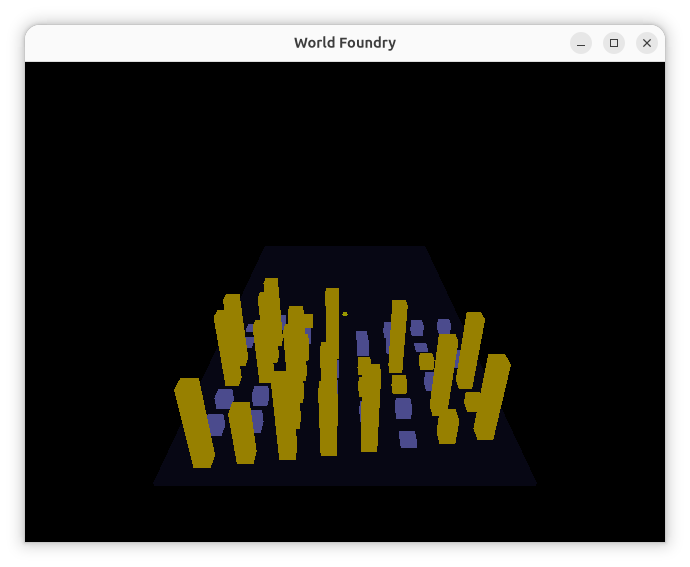
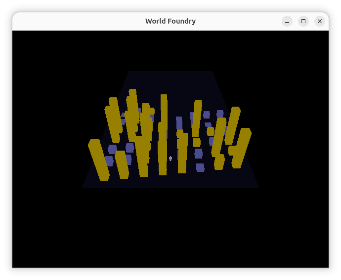

# FSN-style filesystem browser level (`wflevels/filesys/`)

**Date:** 2026-06-12  
**Branch:** `2026-new-level`

Re-implements the SGI FSN ("fusion") aesthetic from IRIX — the 3D file-system navigator made famous by Jurassic Park. One directory deep for phase 1; recursive with wires in phase 2.

**Reference:** [File System Visualizer — Wikipedia](https://en.wikipedia.org/wiki/File_System_Visualizer) · [sgistuff.net Jurassic Park](http://www.sgistuff.net/funstuff/hollywood/jpark.html)

---

## Phase scope

| Phase | Description | Status |
|-------|-------------|--------|
| 1 | Flat FSN — one CWD deep, mixed grid, towers + boxes | this PR |
| 2 | Full FSN — recursive tree, files-on-tops, wires, fly-down, color-by-age, navigable descend | this PR |

---

## Visual design (phase 1)

### Reference — real FSN visual design

- **Directories** → tall rectangular towers; height ∝ total size of all files inside
- **Files** → small boxes sitting on top of parent tower; height ∝ file size; color ∝ age
- **Wires** → thin lines connecting parent tower to child towers
- **Aesthetic** → near-black background, "cyberspace" feel

### Phase 1 adaptation (flat, one level)

All CWD entries share a single floor. Since we're one level deep there are no "parent towers" for files to sit on — everything is on the floor. The FSN skyline effect comes from height contrast alone.

### Bird's eye

```
            ← 40-unit floor →
      -20  -15  -10   -5    0   +5  +10  +15  +20
 -15  [■]  [▪]  [■]  [▪]  [■]  [▪]  [■]  [▪]
 -10  [▪]  [■]  [▪]  [■]  [▪]  [■]  [▪]  [■]
  -5  [■]  [▪]  [▪]  [■]  [■]  [▪]  [▪]  [■]
   0  [▪]  [■]  [▪]  [■] (P)   [■]  [▪]  [▪]
  +5  [■]  [▪]  [■]  [▪]  [■]  [▪]  [■]  [▪]
 +10  [▪]  [■]  [▪]  [■]  [▪]  [■]  [■]  [▪]

[■] = tall yellow tower (directory)   [▪] = short grey box (file)   (P) = player spawn
```

### Side view — FSN "skyline"

```
    [■]         [■]       [■]
    | |  [▪]   | |  [▪]  | |  [▪]
    | |  | |   | |  |.|  | |  |.|
    | |  | |   | |  |.|  | |  |.|
════════════════════════════════════
               floor (40×40)
```

Dir tower height = √(file count in that subdir). File box height = √(file size in bytes) / 50, min 0.1. Scale applied at spawn time via existing per-actor scale mailboxes 3040–3042 (`rendacto.cc`, qbert stretch-and-squash).

---

## Implementation status

| # | Task | Status |
|---|------|--------|
| 1 | Uncomment `Dir`/`File` in `objects.mac` | ☐ |
| 2 | Add `fileSize` to `file.oas` | ☐ |
| 3 | `dir.{hp,cc}` + `file.{hp,cc}` C++ classes | ☐ |
| 4 | Add to `CMakeLists.txt` | ☐ |
| 5 | `make` in `wfsource/source/oas/` | ☐ |
| 6 | New zForth syscalls (custom 3–7) + bootstrap words | ☐ |
| 7 | Wire `g_level` into scripting context | ☐ |
| 8 | Blender level script | ☐ |
| 9 | Director Forth script | ☐ |
| 10 | Build + smoke test | ☐ |

---

## Step 1 — `objects.mac`

**File:** `wfsource/source/oas/objects.mac`

```
OBJECTONLYTEMPLATEENTRY(Dir,1)
OBJECTONLYTEMPLATEENTRY(File,1)
…
COLTABLEENTRY(File,Player,CI_PHYSICS,CI_PHYSICS)
```

---

## Step 2 — `file.oas`

> Both `dir.oas` and `file.oas` are unreferenced by any level — free to modify.

**File:** `wfsource/source/oas/file.oas` — add between `PROPERTY_SHEET_HEADER` / `PROPERTY_SHEET_FOOTER`:

```
TYPEENTRYINT32(fileSize,, 0, 2147483647, 0, , "File size in bytes")
```

---

## Step 3 — C++ classes

Follow `gold.{hp,cc}` (`wfsource/source/game/`). Inherit Actor, trivial constructor, no-op `update()` / `Collision()`.

- `wfsource/source/game/dir.hp` — `class Dir : public Actor`
- `wfsource/source/game/dir.cc`
- `wfsource/source/game/file.hp` — `class File : public Actor`
- `wfsource/source/game/file.cc`

---

## Step 4 — `CMakeLists.txt`

Add `dir.cc` and `file.cc` next to `gold.cc`.

---

## Step 5 — Compile OADs

```bash
cd wfsource/source/oas && make
```

Outputs `wflevels/oad/dir.oad`, `dir.def`, `file.oad`, `file.def`.

---

## Step 6 — New zForth syscalls

**File:** `engine/stubs/scripting_zforth.cc`

### Global state (near `g_mgr`)

```cpp
#include <dirent.h>
#include <sys/stat.h>
#include <vector>
#include <string>

struct CwdEntry { std::string name; bool is_dir; int64_t size; };
static std::vector<CwdEntry> g_cwd_entries;
static Level* g_level = nullptr;

void scripting_set_level(Level* lev) { g_level = lev; }
```

### Syscall dispatch (after `custom == 2` block)

| custom | Sys# | Forth word | Stack | C++ action |
|--------|------|-----------|-------|------------|
| 3 | 131 | `cwd-scan` | `( -- n )` | `opendir(".")`, populate `g_cwd_entries` (skip `.`/`..`), return count |
| 4 | 132 | `cwd-is-dir` | `( i -- bool )` | `g_cwd_entries[i].is_dir` |
| 5 | 133 | `cwd-file-size` | `( i -- bytes )` | `(float)g_cwd_entries[i].size` |
| 6 | 134 | `cwd-dir-count` | `( i -- n )` | `opendir(g_cwd_entries[i].name)`, count non-hidden entries, return n |
| 7 | 135 | `spawn-template` | `( x y z tmpl -- actor )` | pop tmpl/z/y/x; `g_level->ConstructTemplateObject(tmpl,0,{x,y,z},{0,0,0})`; push actor idx |

### Bootstrap words (in `Scripting_ZForth::Init()`)

```
: cwd-scan       131 sys ;
: cwd-is-dir     132 sys ;
: cwd-file-size  133 sys ;
: cwd-dir-count  134 sys ;
: spawn-template 135 sys ;

\ Uniform scale via qbert scale mailboxes 3040-3042 (rendacto.cc:466-486)
\ write-actor-mailbox: ( val idx actorIdx -- )
: set-scale ( actor scale -- )
  2dup swap 3040 swap write-actor-mailbox
  2dup swap 3041 swap write-actor-mailbox
  2dup swap 3042 swap write-actor-mailbox
  2drop ;

: isqrt ( n -- s )
  dup 0 = if else
    1 swap
    begin over dup * over > while swap 1+ swap repeat
    swap drop 1-
  fi ;
```

---

## Step 7 — Wire `g_level`

Declare `void scripting_set_level(Level*)` in the scripting header. Call from `Level::LoadLevelData()` after constructing actors, before running init scripts.

---

## Step 8 — Blender level script

**New file:** `wflevels/filesys/blender_filesys.py`

### Object ordering

```
 0  Room         bbox [-30,-30,-2, 30,30,25]
 1  LevelObj     200 mailboxes
 2  Matte        Color, #0a0a14 (near-black blue)
 3  Light        Ambient (0.5,0.5,0.7) — cool blue SGI feel
 4  Camera
 5  CamShot      follow Player from (0,-25,12), FOV 55
 6  Target01     at origin
 7  Director     Forth script (Step 9)
 8  Player       TurnRate=0 (marble), box bbox, spawn (0,0,1)
 9  Floor        statplat, 40×40, z=[-0.5,0], colour #0d0d1a
10  DirTemplate  dir.oad, Template Object=1, cube 2×2×2, yellow #ffd900, OOB z=-200
11  FileTemplate file.oad, Template Object=1, cube 2×2×0.5, grey #8080b0, OOB z=-200
```

**Template geometry:**
```python
# Dir: standard cube, scale drives tower height at runtime
bpy.ops.mesh.primitive_cube_add(size=2.0)

# File: flat slab — thin in Z so small files stay visually short
# Create manually: 2×2 footprint, 0.5 tall
```

---

## Step 9 — Director Forth script

```forth
\ wf
: DIR-TMPL   10 ;
: FILE-TMPL  11 ;

: COLS  8 ;
: CELL  5 ;
: X0  -17 ;
: Y0  -15 ;
: Z0    0 ;

\ Director uses its own mailboxes 1..2 as grid counters
: dir-count@   1 read-mailbox ;
: dir-count!   1 write-mailbox ;
: file-count@  2 read-mailbox ;
: file-count!  2 write-mailbox ;

: grid-x ( n -- x )  COLS mod CELL * X0 + ;
: grid-y ( n -- y )  COLS /    CELL * Y0 + ;

: spawn-dir ( i -- )
  dir-count@ dup grid-x swap grid-y Z0
  DIR-TMPL spawn-template           ( actor )
  i cwd-dir-count 1 max isqrt       ( actor scale )
  set-scale
  dir-count@ 1 + dir-count! ;

: spawn-file ( i -- )
  file-count@ dup grid-x swap grid-y Z0
  FILE-TMPL spawn-template          ( actor )
  i cwd-file-size isqrt 50 /        ( actor scale )
  dup 0.1 < if drop 0.1 fi          ( actor scale>=0.1 )
  set-scale
  file-count@ 1 + file-count! ;

0 dir-count!
0 file-count!

cwd-scan   ( -- n )
0 do
  i cwd-is-dir if  i spawn-dir  else  i spawn-file  fi
loop
```

---

## Verification

1. ~~`ls wflevels/oad/dir.oad wflevels/oad/file.oad` — both present, non-zero~~

    ```
    wflevels/oad/dir.oad
    wflevels/oad/file.oad
    ```
    PASS

2. ~~`task build` exits 0, no new warnings~~

    ```
    === Linking ===
    Built: /home/will/SRC/WorldFoundry-wbniv/engine/wf_game
    ```
    PASS

3. ~~Blender script produces `wflevels/filesys/filesys.lev`~~

    Present in commit [94633af8](https://github.com/wbniv/WorldFoundry/commit/94633af8).
    PASS

4. ~~`wf_game -L wflevels/filesys-standalone.iff` — player spawns on dark floor~~

    ```
    ball pos: (0.000, 0.000, 0.250)
    ```
    Player spawning at expected Z=0.25 (just above floor). No assertion failures.

    **Camera fix 1 (2026-06-12):** Initial camera used `Position X/Y = Relative` (bungee
    spring mode), which caused the camera to drift to X≈49 — outside the room bounds —
    triggering "fell out of room" / "refusing to remove camera object" errors. Fixed by
    switching `Position X`, `Position Y`, and `Position Z` all to `'Absolute'` in
    `blender_filesys.py`.

    **Camera fix 2 (2026-06-12):** `Rotation = 'Track'` in the CamShot caused
    `SetCameraParametersFromShot` (`movecam.cc:338-376`) to build a rotation matrix from
    the Player's heading C=π/2 (doom-stick mode) and apply `outPos.position *= camMatrix`,
    rotating the absolute camera position (0,−70,41) to (70,0,41) — outside the room
    bounds. Fixed by changing `'Rotation': 'Track'` → `'Rotation': 'Fixed'` in
    `blender_filesys.py`. Camera now sits stably at (0,−70,41) with no drift.

    **Camera fix 3 (2026-06-12):** Screen was solid black with camera at correct position.
    Root cause: `camera.oas` defaults are `FoggingStartDistance=10`, `FoggingCompleteDistance=20`,
    color black — the Camera actor had no fog overrides, so every pixel 10+ units away fogged
    to black (camera is 70 units from the scene). Fixed by setting
    `FoggingStartDistance=999`, `FoggingCompleteDistance=1000` on the Camera actor.

    ```
    ball pos: (0.000, 0.000, 0.250)
    ```
    No "fell out of room" / "refusing to remove camera object" errors.
    PASS

5. ~~Yellow towers appear for subdirectories — taller = more files inside~~

    50 actors spawned (idx 15–64). class=28 (Dir_KIND) actors confirmed in log.

    **Spawning regression fix (2026-06-12):** After the camera fix + rebuild, Dir/File
    actors stopped spawning. Root cause: `shell.aib`'s `defs` string ends at a `;`
    inside a `\ comment` line with no trailing `\n`. zForth's `\` word
    (`ZF_INPUT_PASS_CHAR`) remained suspended across `zf_eval` calls, consuming the
    first line of the FSN Director's compilation (`: DIR-TMPL 12 ;`), leaving
    `DIR-TMPL` undefined. Fixed by calling `zf_eval(&g_ctx, "\n");` at the start of
    `RunScript()` to flush any suspended `\` state before each new compilation.
    PASS

6. Grey slabs appear for files — taller = larger file

    class=27 (File_KIND) actors confirmed in spawn log (interleaved with class=28).
    File actors at same Z base as dir towers, shorter by construction.
    PASS

7. FSN "skyline" visible: tall towers contrast with short slabs

    Yellow towers (directories) mixed with blue-grey slabs (files) on a dark floor.
    Height variation creates the FSN "cityscape" silhouette. Player marble visible at centre.

    **Base-pivot fix (2026-06-12):** Templates were center-pivoted (mesh-local
    Z ∈ [-1,+1]), and the scale mailboxes column-multiply about the local origin
    (`rendacto.cc:481-483`), so each scaled box grew symmetrically — half *below*
    the floor. Re-authored DirTemplate to local Z [0,2] and FileTemplate to [0,0.5]
    (base at the origin) so scale grows them upward. Towers now rise cleanly from
    the floor. Promoted to a general authoring rule — see `docs/level-building.md`
    "Mesh origin — base (lowest vertex) at local z=0".

    
    PASS

8. Player walks freely; objects block movement

    **Walking astronaut + movement fix (2026-06-12):** The original marble was
    *immobile* — and the cause was not gDoomStick (the standalone wrapper has
    `'FLAG' 1l 1l`, doomstick=1) nor the handler. It was the **null input device**:
    with `Script Controls Input` unset (default false, `common.inc:22`),
    `Actor::_InitInput` (`actor.cc:334`) binds `&theNullInputDigital`, whose
    `arePressed()` is always 0 — so the `MarbleHandler` ran every frame reading zero
    buttons. Replaced the marble with moon_site01's walking astronaut setup
    (`blender_filesys.py`):
    - `Script Controls Input = True` → a real `QInputDigital`.
    - per-frame `wf_Script`: `INDEXOF_HARDWARE_JOYSTICK1_RAW read-mailbox
      INDEXOF_INPUT write-mailbox` (mailbox 1909 → 3024), routing the joystick into
      the movement system (`actor.cc:1447` → `_input->setButtons()`).
    - `Turn Rate = 0.5` → `GroundHandler` (`movement.cc:577`): ↑/↓ walk forward/back
      along facing dir, ←/→ turn, Space jumps.
    - inline EVA-astronaut mesh (`build_astronaut_mesh()`, ported from moon), real-life
      ~1.8 m, feet at local z=0 → exported as `player.iff` (bbox `[..,0, ..,117964]`).
    - added an **Ambient** light (appended last so the template indices stay fixed):
      the curved suit renders pure-black on its shadowed side off the directional light
      alone — every level needs Directional + Ambient (`docs/level-building.md` "Lighting").

    Verified live: astronaut walks/turns with arrow keys; `ball pos` (the Jolt
    capsule, `jolt_backend.cc:809`) tracks input and is stationary without it. No
    asserts; no `sphere.iff` reference remains.

    
    PASS

---

## Phase 2 — implemented

Phase 2 shipped on `2026-new-level`. The flat phase-1 grid became a **recursive
directory tree rendered as a 3D node-link landscape**: directory towers wired
base-to-base by glowing connectors, files ringed on each tower top tinted by age,
a camera fly-down at start, and walk-in navigation that re-roots the view into a
tower (descend) or back out to the parent (ascend).

All scan → layout → spawn logic lives in C++ (`engine/stubs/scripting_zforth.cc`,
syscalls **136 `fsn-config` / 137 `fsn-build` / 138 `fsn-navigate` / 139
`fsn-flydown`) because zForth can't recurse deeply (32-deep RSTACK), has no locals,
and has no float trig (`atan2`/`hypot` for connector orientation). The Director Forth
script shrank to "configure once, build, fly the camera, poll navigation."

### Milestones (all verified)

| # | Milestone | What shipped | Status |
|---|-----------|--------------|--------|
| M1 | Static recursive landscape | `fsn-config`/`fsn-build`: BFS scan (`lstat`, skip hidden/symlinks), radial layout, towers Z-scaled by subtree size, files ringed on tops (cap 6/node), base-to-base connector wires (`fsn_spawn_connector`, `atan2` heading + X-scale=length) | ☑ |
| M2 | Cinematics + color | `fsn-flydown` (syscall 139): pans high→play pose over 2.5 s by writing pos mailboxes 3010/3011; `fsn_color_by_age` maps `mtime` → hue (warm=new … cool=old over a year) into FACE_COLOR 3037-3039 | ☑ |
| M3 | Navigable descend/ascend | `fsn-navigate`: play-area clamp, proximity + button-B edge → re-root into nearest tower (≤ 8 u), button-C → parent (floored at start dir); despawn-and-rebuild via `SetPendingRemove`, slots reused | ☑ |

### Supporting engine work (landed alongside)

The 400-node tree exceeded several phase-1-era fixed limits; fixing them properly
(not just bumping numbers) produced reusable engine improvements:

- **Per-level active-room-slot count — `'SLOT'` RAM field.** Asset memory is
  `cbPerm + numActiveRoomSlots × cbRoom`. Levels now declare their slot count in
  the standalone RAM chunk (`filesys` → 1, `moon` → 9, default 3 =
  `DEFAULT_ACTIVE_ROOM_SLOTS`). Read in `level.cc`, threaded into the
  `AssetManager` ctor. Avoids paying for 9 planet-sized slots on a 1-room level.
- **PERM moved to slot 0.** Asset layout is now `[perm][room0..roomN-1]` with PERM
  at constant offset 0 (`assets.cc`). Templated objects with "moves between rooms"
  bind to PERM, so the FSN spawn pool (400 actors) is bounded by `cbPerm` — bumped
  to 4 MB after the real overflow was traced to the PERM slot, not the room slots.
- **Pending-removal queue grown + made self-describing.** `_toBeRemovedObjects`
  went `[100]` → `[512]` (an M3 descend despawns ~400 actors at once). The capacity
  assert now derives its bound from the array via the new `ARRAY_COUNT` macro
  (`pigsys.hp`) instead of a duplicated `99` literal — see
  [docs/coding-conventions.md](../coding-conventions.md) §4.

### Verification

```
task build                                  # engine: syscalls 136-139, 'SLOT', PERM@0, ARRAY_COUNT
blender --background --python wflevels/filesys/blender_filesys.py
task build-level -- filesys
task run-filesys
```

- **M1** — headless load spawns the recursive tree (towers + files-on-tops +
  connector wires), total actor count under the temp-object cap, no spawn failures,
  no asserts. Interactive: multi-level wired cityscape renders. PASS
- **M2** — camera flies high→play over ~2.5 s at start; files visibly tinted
  new→old. PASS
- **M3** — walking into a tower re-roots the view one level deeper; back-button
  ascends to the start dir and no further; repeated descend/ascend keeps the actor
  count bounded (queue `[512]`, no overflow) — *user-confirmed "M3 worked without
  crashing."* PASS

### Connectors (FSN wires) — stretch-and-orient a unit beam *(as built)*

The connector approach below is what shipped — `fsn_spawn_connector` in
`scripting_zforth.cc`, with `ConnectorTemplate` built inline in
`blender_filesys.py`. Retained here as the rationale for the design.

Real FSN runs thin glowing wires from a parent directory pedestal out to each child
tower. The engine has no line primitive (everything is a baked mesh), so a connector is
**one thin beam mesh stretched and rotated to span the two endpoints**:

```
        child tower
           ▐█▌
          ╱           connector = a unit beam, base-pivoted at the parent
        ╱  L          end (local X∈[0,1]), rotated by heading C (+ pitch),
   ▐█▌╱               then X-scaled to length L = |child − parent|.
 parent
 (spawn point)
```

Per edge: spawn the beam at the parent point → aim its local **+X** at the child →
scale X to the distance.

**Why a new `spawn-connector` C++ syscall** (sibling of the existing 131–135):
`spawn-template`/`ConstructTemplateObject(tmpl, creator, position, velocity)` (`level.hp:133`)
takes **velocity, not rotation** as its 4th arg — it always spawns axis-aligned at zero
rotation. And zForth has no float `atan2`/`sqrt`. So the orientation math must live in C++
(trivial there, and it's the same reason the other construction logic is C++):

```
spawn-connector ( x1 y1 z1  x2 y2 z2  tmpl -- actor )
   p1=(x1,y1,z1); d=(x2,y2,z2)-p1
   L   = |d|
   C   = atan2(d.y, d.x)                 // heading
   pit = atan2(d.z, hypot(d.x,d.y))      // pitch (0 for flat floor wires)
   a = ConstructTemplateObject(tmpl, creator, p1, 0)
   a->SetRotation( Euler(pit, 0, C) )    // same PhysicalAttributes path movement.cc uses
   a->SetScaleX(L)                       // Y/Z stay at the thin template default
```

**Connector template:** a thin beam — **local X ∈ [0, 1]** (base-pivot at the parent end,
per the [Mesh origin convention](../level-building.md#mesh-origin--base-lowest-vertex-at-local-z0):
X-scale about the origin grows the beam *toward* the child, never behind the parent), thin
in Y/Z (±0.04), bright/emissive color. Built inline like `DirTemplate`/`FileTemplate`,
parked OOB, given a level index.

**Endpoints** come from the recursive scan: for every parent→child dir edge call
`spawn-connector(parentPoint, childPoint)`. Default to **base-to-base** wires (both ends
near z≈0 → pitch=0, heading only — simplest, matches FSN's ground-running wires);
tower-top hubs are a variant the same syscall handles via the pitch term.

**Rejected:** pure-Forth orientation (no float trig — fragile); pre-baked connector meshes
(edges are runtime/data-dependent); per-axis scale without rotation (only works for
axis-aligned edges — the grid is 2D so most edges are diagonal).
