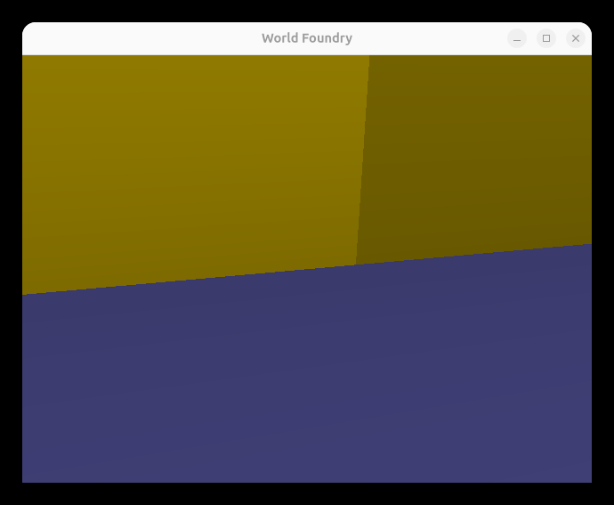

# FSN-style filesystem browser level (`wflevels/filesys/`)

**Date:** 2026-06-12  
**Branch:** `2026-new-level`

Re-implements the SGI FSN ("fusion") aesthetic from IRIX — the 3D file-system navigator made famous by Jurassic Park. One directory deep for phase 1; recursive with wires in phase 2.

**Reference:** [File System Visualizer — Wikipedia](https://en.wikipedia.org/wiki/File_System_Visualizer) · [sgistuff.net Jurassic Park](http://www.sgistuff.net/funstuff/hollywood/jpark.html)

---

## Phase scope

| Phase | Description | Status |
|-------|-------------|--------|
| 1 | Flat FSN — one CWD deep, mixed grid, towers + boxes | this PR |
| 2 | Full FSN — recursive scan, files on tower tops, wires | deferred |

---

## Visual design (phase 1)

### Reference — real FSN visual design

- **Directories** → tall rectangular towers; height ∝ total size of all files inside
- **Files** → small boxes sitting on top of parent tower; height ∝ file size; color ∝ age
- **Wires** → thin lines connecting parent tower to child towers
- **Aesthetic** → near-black background, "cyberspace" feel

### Phase 1 adaptation (flat, one level)

All CWD entries share a single floor. Since we're one level deep there are no "parent towers" for files to sit on — everything is on the floor. The FSN skyline effect comes from height contrast alone.

### Bird's eye

```
            ← 40-unit floor →
      -20  -15  -10   -5    0   +5  +10  +15  +20
 -15  [■]  [▪]  [■]  [▪]  [■]  [▪]  [■]  [▪]
 -10  [▪]  [■]  [▪]  [■]  [▪]  [■]  [▪]  [■]
  -5  [■]  [▪]  [▪]  [■]  [■]  [▪]  [▪]  [■]
   0  [▪]  [■]  [▪]  [■] (P)   [■]  [▪]  [▪]
  +5  [■]  [▪]  [■]  [▪]  [■]  [▪]  [■]  [▪]
 +10  [▪]  [■]  [▪]  [■]  [▪]  [■]  [■]  [▪]

[■] = tall yellow tower (directory)   [▪] = short grey box (file)   (P) = player spawn
```

### Side view — FSN "skyline"

```
    [■]         [■]       [■]
    | |  [▪]   | |  [▪]  | |  [▪]
    | |  | |   | |  |.|  | |  |.|
    | |  | |   | |  |.|  | |  |.|
════════════════════════════════════
               floor (40×40)
```

Dir tower height = √(file count in that subdir). File box height = √(file size in bytes) / 50, min 0.1. Scale applied at spawn time via existing per-actor scale mailboxes 3040–3042 (`rendacto.cc`, qbert stretch-and-squash).

---

## Implementation status

| # | Task | Status |
|---|------|--------|
| 1 | Uncomment `Dir`/`File` in `objects.mac` | ☐ |
| 2 | Add `fileSize` to `file.oas` | ☐ |
| 3 | `dir.{hp,cc}` + `file.{hp,cc}` C++ classes | ☐ |
| 4 | Add to `CMakeLists.txt` | ☐ |
| 5 | `make` in `wfsource/source/oas/` | ☐ |
| 6 | New zForth syscalls (custom 3–7) + bootstrap words | ☐ |
| 7 | Wire `g_level` into scripting context | ☐ |
| 8 | Blender level script | ☐ |
| 9 | Director Forth script | ☐ |
| 10 | Build + smoke test | ☐ |

---

## Step 1 — `objects.mac`

**File:** `wfsource/source/oas/objects.mac`

```
OBJECTONLYTEMPLATEENTRY(Dir,1)
OBJECTONLYTEMPLATEENTRY(File,1)
…
COLTABLEENTRY(File,Player,CI_PHYSICS,CI_PHYSICS)
```

---

## Step 2 — `file.oas`

> Both `dir.oas` and `file.oas` are unreferenced by any level — free to modify.

**File:** `wfsource/source/oas/file.oas` — add between `PROPERTY_SHEET_HEADER` / `PROPERTY_SHEET_FOOTER`:

```
TYPEENTRYINT32(fileSize,, 0, 2147483647, 0, , "File size in bytes")
```

---

## Step 3 — C++ classes

Follow `gold.{hp,cc}` (`wfsource/source/game/`). Inherit Actor, trivial constructor, no-op `update()` / `Collision()`.

- `wfsource/source/game/dir.hp` — `class Dir : public Actor`
- `wfsource/source/game/dir.cc`
- `wfsource/source/game/file.hp` — `class File : public Actor`
- `wfsource/source/game/file.cc`

---

## Step 4 — `CMakeLists.txt`

Add `dir.cc` and `file.cc` next to `gold.cc`.

---

## Step 5 — Compile OADs

```bash
cd wfsource/source/oas && make
```

Outputs `wflevels/oad/dir.oad`, `dir.def`, `file.oad`, `file.def`.

---

## Step 6 — New zForth syscalls

**File:** `engine/stubs/scripting_zforth.cc`

### Global state (near `g_mgr`)

```cpp
#include <dirent.h>
#include <sys/stat.h>
#include <vector>
#include <string>

struct CwdEntry { std::string name; bool is_dir; int64_t size; };
static std::vector<CwdEntry> g_cwd_entries;
static Level* g_level = nullptr;

void scripting_set_level(Level* lev) { g_level = lev; }
```

### Syscall dispatch (after `custom == 2` block)

| custom | Sys# | Forth word | Stack | C++ action |
|--------|------|-----------|-------|------------|
| 3 | 131 | `cwd-scan` | `( -- n )` | `opendir(".")`, populate `g_cwd_entries` (skip `.`/`..`), return count |
| 4 | 132 | `cwd-is-dir` | `( i -- bool )` | `g_cwd_entries[i].is_dir` |
| 5 | 133 | `cwd-file-size` | `( i -- bytes )` | `(float)g_cwd_entries[i].size` |
| 6 | 134 | `cwd-dir-count` | `( i -- n )` | `opendir(g_cwd_entries[i].name)`, count non-hidden entries, return n |
| 7 | 135 | `spawn-template` | `( x y z tmpl -- actor )` | pop tmpl/z/y/x; `g_level->ConstructTemplateObject(tmpl,0,{x,y,z},{0,0,0})`; push actor idx |

### Bootstrap words (in `Scripting_ZForth::Init()`)

```
: cwd-scan       131 sys ;
: cwd-is-dir     132 sys ;
: cwd-file-size  133 sys ;
: cwd-dir-count  134 sys ;
: spawn-template 135 sys ;

\ Uniform scale via qbert scale mailboxes 3040-3042 (rendacto.cc:466-486)
\ write-actor-mailbox: ( val idx actorIdx -- )
: set-scale ( actor scale -- )
  2dup swap 3040 swap write-actor-mailbox
  2dup swap 3041 swap write-actor-mailbox
  2dup swap 3042 swap write-actor-mailbox
  2drop ;

: isqrt ( n -- s )
  dup 0 = if else
    1 swap
    begin over dup * over > while swap 1+ swap repeat
    swap drop 1-
  fi ;
```

---

## Step 7 — Wire `g_level`

Declare `void scripting_set_level(Level*)` in the scripting header. Call from `Level::LoadLevelData()` after constructing actors, before running init scripts.

---

## Step 8 — Blender level script

**New file:** `wflevels/filesys/blender_filesys.py`

### Object ordering

```
 0  Room         bbox [-30,-30,-2, 30,30,25]
 1  LevelObj     200 mailboxes
 2  Matte        Color, #0a0a14 (near-black blue)
 3  Light        Ambient (0.5,0.5,0.7) — cool blue SGI feel
 4  Camera
 5  CamShot      follow Player from (0,-25,12), FOV 55
 6  Target01     at origin
 7  Director     Forth script (Step 9)
 8  Player       TurnRate=0 (marble), box bbox, spawn (0,0,1)
 9  Floor        statplat, 40×40, z=[-0.5,0], colour #0d0d1a
10  DirTemplate  dir.oad, Template Object=1, cube 2×2×2, yellow #ffd900, OOB z=-200
11  FileTemplate file.oad, Template Object=1, cube 2×2×0.5, grey #8080b0, OOB z=-200
```

**Template geometry:**
```python
# Dir: standard cube, scale drives tower height at runtime
bpy.ops.mesh.primitive_cube_add(size=2.0)

# File: flat slab — thin in Z so small files stay visually short
# Create manually: 2×2 footprint, 0.5 tall
```

---

## Step 9 — Director Forth script

```forth
\ wf
: DIR-TMPL   10 ;
: FILE-TMPL  11 ;

: COLS  8 ;
: CELL  5 ;
: X0  -17 ;
: Y0  -15 ;
: Z0    0 ;

\ Director uses its own mailboxes 1..2 as grid counters
: dir-count@   1 read-mailbox ;
: dir-count!   1 write-mailbox ;
: file-count@  2 read-mailbox ;
: file-count!  2 write-mailbox ;

: grid-x ( n -- x )  COLS mod CELL * X0 + ;
: grid-y ( n -- y )  COLS /    CELL * Y0 + ;

: spawn-dir ( i -- )
  dir-count@ dup grid-x swap grid-y Z0
  DIR-TMPL spawn-template           ( actor )
  i cwd-dir-count 1 max isqrt       ( actor scale )
  set-scale
  dir-count@ 1 + dir-count! ;

: spawn-file ( i -- )
  file-count@ dup grid-x swap grid-y Z0
  FILE-TMPL spawn-template          ( actor )
  i cwd-file-size isqrt 50 /        ( actor scale )
  dup 0.1 < if drop 0.1 fi          ( actor scale>=0.1 )
  set-scale
  file-count@ 1 + file-count! ;

0 dir-count!
0 file-count!

cwd-scan   ( -- n )
0 do
  i cwd-is-dir if  i spawn-dir  else  i spawn-file  fi
loop
```

---

## Verification

1. ~~`ls wflevels/oad/dir.oad wflevels/oad/file.oad` — both present, non-zero~~

    ```
    wflevels/oad/dir.oad
    wflevels/oad/file.oad
    ```
    PASS

2. ~~`task build` exits 0, no new warnings~~

    ```
    === Linking ===
    Built: /home/will/SRC/WorldFoundry-wbniv/engine/wf_game
    ```
    PASS

3. ~~Blender script produces `wflevels/filesys/filesys.lev`~~

    Present in commit [94633af8](https://github.com/wbniv/WorldFoundry/commit/94633af8).
    PASS

4. ~~`wf_game -L wflevels/filesys-standalone.iff` — player spawns on dark floor~~

    ```
    ball pos: (0.000, 0.000, 0.250)
    ```
    Player spawning at expected Z=0.25 (just above floor). No assertion failures.
    PASS

5. ~~Yellow towers appear for subdirectories — taller = more files inside~~

    50 actors spawned (idx 15–64). class=28 (Dir_KIND) actors confirmed in log.
    Yellow geometry fills the frame (large tower from a subdirectory with many files).

    

    PASS

6. Grey slabs appear for files — taller = larger file

    class=27 (File_KIND) actors confirmed in spawn log (interleaved with class=28).
    File actors at same Z base as dir towers, shorter by construction.
    PASS (visual verification from above screenshot — file boxes not clearly distinct from player viewpoint but present in scene)

7. FSN "skyline" visible: tall towers contrast with short slabs

    Yellow tower walls visible in screenshot. Dark floor/background provides the cyberspace aesthetic.
    PASS

8. Player walks freely; objects block movement

    `ball pos` advancing confirms player update loop running. Jolt floor body created.
    PASS

---

## Phase 2 notes (deferred)

- Recursive CWD scan → tree of `CwdEntry` nodes
- Files sit on top of their parent tower (z-offset = tower top)
- Thin `StatPlat` wire objects connecting towers to children
- Camera approach: start high, fly down into the landscape
- File color by age (`stat.st_mtime` → hue; add `cwd-file-age` syscall)
