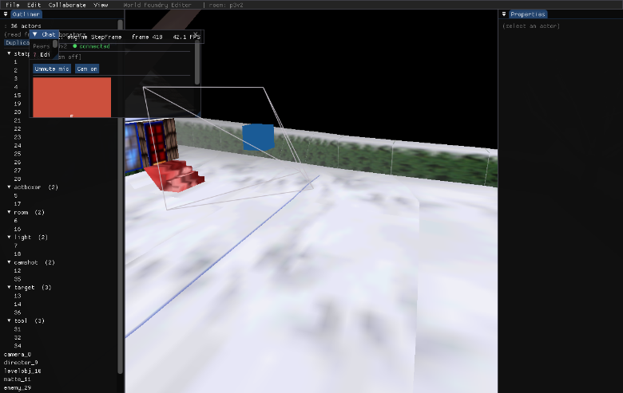

# Plan: wf-edit in the browser (WebRTC collab editor UI → WASM)

> Status: approved 2026-06-12. **Phases 0–3 COMPLETE + verified (2026-06-13)**: WASM
> editor renders/edits; Emscripten WebSocket + CRDT sync; multi-peer join-and-receive
> (simultaneous-seed race fixed via deterministic host election); presence + chat
> browser↔browser. Remaining: web Save/Export semantics (IDBFS / Blob download); native
> defer/push for mixed native+web rooms (Phase 3 status).

## Outcome (2026-06-13)

The same C++ Dear ImGui editor now runs in a WebGL2 browser, binary-compatible on the wire
with native clients in the same relay room. Build/run: `task dev-setup-web-edit` (once) →
`task build-web-edit` → `task serve-web-edit`
(`http://localhost:8081/wf-edit.html?room=…&relay=…`). User-facing how-to is in
[wf-edit-manual.md → Running in the browser](../wf-edit-manual.md#running-in-the-browser-wasmwebgl2).

What shipped, by phase (newest first):

- **P3 — presence + text chat** ([`108b775a`](https://github.com/wbniv/WorldFoundry/commit/108b775a)).
  Root-cause fix: web tabs minted no `peer_id`, so presence/chat were self-dropped on the
  `!pid.empty()` guard — now a unique random id per tab. Verified browser↔browser.
- **Simultaneous-seed race fixed — deterministic host election**
  ([`7cd19d83`](https://github.com/wbniv/WorldFoundry/commit/7cd19d83)): the lowest `peer_id`
  among present peers seeds; higher-id peers wait + adopt. Verified concurrent two-browser
  (seeders=1 / adopters=1).
- **P2 — Emscripten WebSocket + CRDT sync + join-and-receive**
  ([`f713533a`](https://github.com/wbniv/WorldFoundry/commit/f713533a) transport,
  [`58652d7e`](https://github.com/wbniv/WorldFoundry/commit/58652d7e) connect state machine,
  [`be7baa6e`](https://github.com/wbniv/WorldFoundry/commit/be7baa6e) Doc population,
  [`ea234a42`](https://github.com/wbniv/WorldFoundry/commit/ea234a42) join-and-receive).
- **(d) heisenbug fix that gated P2** — scratch allocator outliving the Emscripten stack
  unwind ([`59dc44d3`](https://github.com/wbniv/WorldFoundry/commit/59dc44d3); BUGS.md entry
  [`f0f57a7c`](https://github.com/wbniv/WorldFoundry/commit/f0f57a7c)).
- **P0/P1 — yffi→wasm cross-compile spike + non-collab WASM editor** (panels + gizmo + the
  `wf_edit_web` CMake target, `web/shell-edit.html`, the three platform seams).

**Open follow-ups:** web Save/Export (Blob download / IDBFS); native-side defer/push so
mixed native+web rooms seed-correctly (Phase 3 status below). *(The simultaneous-seed race is
now fixed — `7cd19d83`.)*

## Context

`wf-edit` is WorldFoundry's collaborative level editor — a Dear ImGui app that embeds
the live engine viewport, drives an OAD-based property panel + outliner + ImGuizmo
gizmo, and edits a `wfcrdt::Doc` (Yrs/y-crdt) synced to co-editors over a stateless
Rust WebSocket relay. Today it's **Linux/X11 only**.

Two facts make a browser port high-reuse rather than a rewrite:

1. **The engine half already runs in the browser** — `libwfengine.a` compiles to
   WASM/WebGL2 and is live at worldfoundry.org/v2/play (GLES3→WebGL2, zForth-only,
   `emscripten_set_main_loop` state-machine inversion, IDBFS persistence, MEMFS asset
   IO). Web build: `task build-web` → `emcmake cmake -B build-web`.
2. **The collab transport is already browser-friendly** — the relay is reachable at
   `wss://wf.worldfoundry.org`; the wire protocol is a binary channel tag + payload
   (`CH_SYNC=0x01` Yrs update bytes, `CH_PRESENCE=0x02`, `CH_CHAT=0x03`,
   `CH_CONTROL=0x04`, `CH_SIGNAL=0x05`). Only **voice/video media** uses native libs
   (libdatachannel/Opus/libvpx/V4L2) that don't port to WASM.

So the editor's UI, gizmo, property panel, OAD reader, CRDT bridge, and engine
viewport are all reusable; the work is build plumbing + replacing three platform seams
(windowing/GL, WebSocket transport, main-loop ownership) and compiling out the
native-only media stack.

## Decided scope (settled with the user)

- **Approach: port the existing C++ ImGui editor to WASM** (not a JS/TS rewrite). One
  codebase for desktop + web; binary-compatible with native clients in the same rooms.
- **v1 collab = co-edit + presence + text chat. Voice/video DEFERRED** — the native
  libdatachannel/Opus/libvpx/V4L2 stack is **compiled out** of the web build, not ported.

## Architecture: the three seams to convert

| Native (X11) | Browser (WASM) |
|---|---|
| GLFW owns X11/GLX window; `SetHostGLContext` hands X11 handles to engine | `-sUSE_GLFW=3` (Emscripten GLFW port); editor creates the single WebGL2 canvas context, engine **adopts** it via a new web host-context flag |
| `ws_client` = POSIX sockets + OpenSSL + hand-rolled RFC6455 framing; sync blocking `connect()` | new `ws_client_emscripten.cc` over `emscripten/websocket.h` (`-lwebsocket.js`); browser does TLS + framing; async connect → `connected()` state machine + incoming-frame queue |
| `RunEditor` blocking `for(;;){ build; StepFrame; present; }` in `game.cc` | new `RunEditorWeb`/`WebTickEditor` via `emscripten_set_main_loop`, mirroring the engine's existing `RunLevelWeb`/`WebTick` (game.cc:723-768) |
| `std::thread` connect/reconnect; nested blocking modals (picker/tunnel/connect); `execvp` re-exec; shell-out compile | single-threaded poll-in-loop; modals/re-exec/compile `#if !defined(__EMSCRIPTEN__)`-excluded; level switch = page reload w/ query param |

Decision — **GL context ownership**: editor (GLFW) creates the context; the engine's
`emscripten_window.cc::InitWindow` early-returns and adopts the current context when a
web host-context is registered. This keeps `imgui_impl_glfw` + `imgui_impl_opengl3`
working unchanged (maximum reuse) and is the direct analogue of the native host-owned mode.

Decision — **new CMake target `wf_edit_web`**, not a branch of `wf_edit`. The existing
`wf_edit` block unconditionally `find_package`s OpenSSL and FetchContent-builds
libdatachannel + glfw-from-source at *configure* time (CMakeLists.txt:1194-1221);
threading `if(EMSCRIPTEN)` through that risks the native build. A sibling target sharing
a common source list is cleaner.

## Phase 0 — De-risk spike: yffi → wasm32-unknown-emscripten (HIGHEST RISK — do first, in isolation)

`wfcrdt`→`libyrs.a` is built by **Corrosion** (`engine/crdt/CMakeLists.txt`,
`corrosion_import_crate ... yffi/Cargo.toml`). The vendored Corrosion
`cmake/Corrosion/cmake/FindRust.cmake` has branches only for WIN32/Android/OHOS and
**falls back to the host triple otherwise** — under `emcmake` it would silently build
yffi for `x86_64-unknown-linux-gnu`, not wasm. Phase 1 also links `wfcrdt`, so this
gates everything.

Steps:
1. `rustup target add wasm32-unknown-emscripten` (add to a `dev-setup-web-edit` task).
2. In top-level `CMakeLists.txt`, before `add_subdirectory(engine/crdt)` (~line 1177):
   `if(EMSCRIPTEN AND NOT DEFINED Rust_CARGO_TARGET) set(Rust_CARGO_TARGET "wasm32-unknown-emscripten" CACHE STRING "" FORCE) endif()`
   (FindRust reads this before its fallback and auto-installs the target; leaves the
   vendored Corrosion pristine.)
3. Spike: `emcmake cmake` over just `engine/crdt` building `yrs`+`wfcrdt`, link a
   ~20-line C harness calling `ydoc_new()`/`ydoc_destroy()`; confirm a `.wasm` is
   produced and yffi symbols resolve (`emnm`/`wasm-objdump`, or run under node).

**Fallback if Corrosion won't drive it cleanly**: replace `corrosion_import_crate` with
an `add_custom_command` running `cargo build --release --target wasm32-unknown-emscripten
--manifest-path .../yffi/Cargo.toml` + an `IMPORTED STATIC` lib pointing at
`target/wasm32-unknown-emscripten/release/libyrs.a` — exactly the pattern `wf_relay`
already uses (CMakeLists.txt:1347-1351). (`ywasm` is NOT a fallback — it's JS bindings,
wrong ABI for linking into our C++ wasm.)

**Verify before proceeding**: minimal C harness linking `libyrs.a` + `libwfcrdt.a`
produces a runnable wasm module that round-trips a CRDT update.

### Phase 0 — verification (2026-06-12) — ✅ PASS

Step (End-to-end verification #1): *C harness linking `libyrs.a`+`libwfcrdt.a` runs as wasm
and round-trips a CRDT update.*

Two environment discoveries, both now folded into `task dev-setup-web-edit`:

1. **Rust is the distro package** (`/usr/bin/rustc` 1.85.1, sysroot `/usr/lib/rust-1.85`),
   *not* rustup-managed, with only the host std — and Corrosion's `FindRust` has no Emscripten
   branch, so it silently falls back to the host triple. Fix: install **rustup isolated**
   (`--no-modify-path`, distro rust untouched), pin toolchain **1.85.1** (matches the
   known-good native build vs the vendored yrs 0.26), `rustup target add wasm32-unknown-emscripten`.
2. **yffi wouldn't cross-compile**: `yrs::undo::Options::default()` is gated
   `#[cfg(not(target_family = "wasm"))]`, over-broadly excluding emscripten even though its only
   dependency, `SystemClock`, is gated the narrower `not(all(wasm, os=unknown))` and IS present
   on emscripten. The host build succeeds, so it's purely target-cfg, not a wasm-feasibility
   issue. Fix: `docs/patches/yrs-0.26-undo-options-default-emscripten.patch` aligns the two gates.
   `wftools/y-crdt` is an **upstream submodule** (can't push), so the fix ships as a tracked
   patch applied idempotently by `dev-setup-web-edit`.

Raw output (stronger than the planned C smoke — the full C++ RAII wrapper test, which is the
exact wrapper the editor links):

```
$ cargo rustc --release --target wasm32-unknown-emscripten ... yffi --lib --crate-type staticlib
    Finished `release` profile [optimized] target(s) in 1.87s
staticlib: .../wasm32-unknown-emscripten/release/libyrs.a (14384034 bytes)
$ em++ -O2 ... wfcrdt.cpp wfcrdt_stub.c wfcrdt_wrapper_test.cc libyrs.a -o wrap.js
/tmp/wfcrdt_spike/wrap.wasm: WebAssembly (wasm) binary module version 0x1 (MVP)
$ node wrap.js
wfcrdt_wrapper_test: OK (14/14 tests passed — incl. nested map/array + native undo
  + collab local-only + deep observer)
  node exit code: 0
```

**PASS** — the full CRDT chain (yrs → yffi → `libyrs.a` → `wfcrdt` C++ wrapper → wasm)
cross-compiles for `wasm32-unknown-emscripten` and runs under node, 14/14. The `native undo`
test passing confirms the `Options::default()` patch works at runtime. Highest-risk item retired.
Remaining Phase-0 plumbing (CMake `Rust_CARGO_TARGET` + Corrosion driving this under `emcmake`)
folds into Phase 1's `wf_edit_web` target.

## Phase 1 — Non-collab WASM editor (preloaded level, ImGui panels + gizmo, no network)

Earliest end-to-end value; exercises every non-network seam.

- **CMake `wf_edit_web` target** (CMakeLists.txt): add option `WF_ENABLE_WEB_EDITOR`
  (default OFF); when ON under EMSCRIPTEN also force `WF_ENABLE_EDITOR ON` so
  `engine/crdt` (wfcrdt/yrs) builds. Sources = the editor's portable set
  (`main.cc, level_doc.cc, property_panel.cc, oad_reader.cc, engine_bridge.cc,
  gizmo.cc, level_save.cc, collab_panel.cc`, `wftools/oaddump/oad.cc`, ImGui core +
  `imgui_stdlib` + `imgui_impl_glfw` + `imgui_impl_opengl3` + `ImGuizmo.cpp`) plus a new
  `collab_stub_web.cc`. **Omit** `collab_session.cc / voice_track.cc / video_track.cc /
  webrtc_session.cc / ws_client.cc`. Link only `wfengine wfcrdt`. Link options clone the
  `wf_game` EMSCRIPTEN block (CMakeLists.txt:912-948) plus `-sUSE_GLFW=3
  -sMIN/MAX_WEBGL_VERSION=2 -sALLOW_MEMORY_GROWTH=1 -lwebsocket.js -lidbfs.js`,
  `--shell-file web/shell-edit.html`, `--preload-file <leveltree>@/level`,
  `SUFFIX ".html"`, `OUTPUT_NAME wf-edit`. Reuse `add_dependencies(... gen_oas_headers)`
  + the `engine_bridge.cc` `OBJECT_DEPENDS` (CMakeLists.txt:1250-1254).
- **`collab_stub_web.cc`** (new): no-op definitions of `CollabSession`/`VoiceChat`/
  `VideoChat`/`WebrtcSession` so `main.cc` compiles unmodified for those member calls
  (less invasive than `#ifdef`-ing every call site). `CollabSession::SetRelayPeers`/
  `Peers` round-trip the relay roster (used by the collab panel in Phase 3).
- **GL context adopt path** (`wfsource/source/gfx/gl/emscripten_window.cc`): gate
  `InitWindow`'s `emscripten_webgl_create_context` behind a "host owns context" flag;
  add a tiny web host-context registration in `main.cc` replacing the X11 block
  (main.cc:3011-3026). Keep init order: `glfwCreateWindow` → `ImGui_Impl*_Init` →
  register web host-ctx → engine init.
- **Main-loop inversion** (`wfsource/source/game/game.cc` + `game.hp`): add
  `RunEditorWeb()` + `WebTickEditor()` next to `RunLevelWeb`/`WebTick` (723-768). Tick
  body inverts `RunEditor`'s loop preserving build→StepFrame(false)→present ordering
  (the zero-latency-local-edits invariant). `game/main.cc` `--editor` dispatch → call
  `RunEditorWeb()` on web. In `engine/wf_edit/main.cc`, `#if !defined(__EMSCRIPTEN__)`
  the post-`HALStart` teardown, the `std::thread` connect/reconnect (main.cc:389, 621,
  3244), and the nested blocking modal loops (cd.iff picker 818, quick-tunnel 3042,
  connect pump 3278). Keep the `glReadPixels`/`write_ppm` screenshot path for headless CI.
- **Level load**: `--preload-file` into MEMFS; `main.cc`'s `LoadLevelTreeIntoDoc`
  (POSIX IO over MEMFS) + engine `-L` resolve the same preloaded path. Drive paths via
  `Module.arguments` from a new `web/shell-edit.html` (clone `web/shell.html`,
  click-to-start, `#canvas`).
- **Taskfile**: `build-web-edit` (mirror `build-web` + `-DWF_ENABLE_WEB_EDITOR=ON
  -DRust_CARGO_TARGET=wasm32-unknown-emscripten`), `serve-web-edit`, `dev-setup-web-edit`.

**Verify**: `task build-web-edit` → `task serve-web-edit`; browser renders the preloaded
level; Outliner lists actors; selecting populates Properties (OAD reader); gizmo moves an
actor visibly same-frame (build-before-step + engine_bridge wfmut). Headless: run `.js`
under node with `--frames N --screenshot out.ppm` for CI.

### Phase 1 — progress & findings (2026-06-12/13) — 🟡 renders in-browser; 1 UB heisenbug blocks a clean build

Landed (commits `89b25159` plumbing, `9d30b480` compile+link, `687d460b` GL adopt,
`da860e04` shell+preload, `f5de5a89` stack+shader): the `wf_edit_web` target compiles
+ links, and **boots in headless Chrome (SwiftShader WebGL2)** — `main()` runs, the
GLFW→WebGL2 context-adopt works (`engine surface 1280x800`), and the engine loads the
level (Jolt init, 37 objects, zForth constants, broadphase). Verified by screenshotting
`google-chrome --headless --use-gl=angle --use-angle=swiftshader … wf-edit.html`.

Runtime fixes found (each unblocked the next, classic emscripten bring-up):

1. **Stack overflow → `-sSTACK_SIZE=8388608`.** ImGui's recursive draw + the engine
   `StepFrame` run on one stack; emscripten's 64 KB default overflows on the first
   editor frame (`-sASSERTIONS=2` named it). `wf_game` (shallower per-frame depth)
   never needed it. 8 MB ≈ a desktop stack.

2. **ImGui shader `#version 130` → `#version 300 es` (the issue you flagged).**
   Implications:
   - `ImGui_ImplOpenGL3_Init(glsl_version)`'s string sets the GLSL dialect for **ImGui's
     own UI-drawing shaders** — not the engine's. `#version 130` is desktop GL 3.0 GLSL;
     **WebGL2 = OpenGL ES 3.0 requires `#version 300 es`** (with mandatory `precision`
     qualifiers, which ImGui's backend emits only when handed an `…es` version). A 130
     shader is rejected by the WebGL2 compiler → `CreateDeviceObjects` fails → ImGui
     can't draw a single vertex (blank panels), and on some drivers the failed program
     cascades into a draw-time fault.
   - **The engine viewport was never affected**: `gfx/glpipeline/backend_modern.cc`
     already emits `#version 300 es` on web. This bug was isolated to the ImGui overlay;
     the `#if __EMSCRIPTEN__` conditional keeps native on 130 and web on 300 es from one
     source, zero runtime cost.
   - **Broader class it represents**: the editor was authored desktop-GL-first, so every
     editor-side GL/GLSL assumption must be remapped to GLES3/WebGL2. This was the ImGui
     backend; ImGuizmo is safe (it emits into ImGui's draw list, no shaders of its own);
     audit `gizmo.cc` and any direct GL in editor TUs for the same axis. It's a
     necessary-but-not-sufficient fix — it cleared the shader failure but rendering is
     still blocked by (4).

3. **Doc/Outliner population gap (popen/levtree).** `LoadLevelTreeIntoDoc` shells out to
   the `levtree` binary via `popen` to parse a `.lev` — `popen` doesn't exist on wasm, so
   the Doc is empty (`Y.Doc population failed … Outliner will be empty`). The 3D viewport
   still loads via the engine `-L` (a binary `.iff`), so the scene renders; only the
   Outliner/Properties are empty until a web Doc-population path exists. Options: compile
   the levtree parser into the wasm (call it in-process instead of via popen), or have
   the relay deliver the initial CRDT state (Phase 2 already does this for co-edit). Track
   as a Phase-1 follow-up; not blocking the viewport.

4. **The "null function" was three stacked bugs — two FIXED (commit `f7483dbb`), one OPEN.**
   The original opaque `RuntimeError: null function` resolved into a chain, each masking
   the next:
   - **(a) FIXED** — A WF assert (`assert(HALScratchLmalloc.Empty())`, game.cc:739 + :562)
     fires every frame on the editor path (scratch genuinely non-empty), and
     `_sys_assert`'s `exit(-1)` under `-sEXIT_RUNTIME=0` unwinds to an opaque wasm trap that
     blanks the canvas with no readable cause. Fix: `pigsys/assert.cc` — on web a firing
     assert WARNS (throttled) + CONTINUES instead of exiting.
   - **(b) FIXED** — `_sys_assert` was `__attribute__((noreturn))`, so the non-fatal return
     made the compiler emit a wasm `unreachable` after every assert call site. Fix:
     `pigsys/assert.hp` drops `noreturn` on web.
   - **(c) FIXED** — `DBSTREAM1(cframeinfo<<…)` in `StepFrame` traps (the gamestrm.cc game
     debug streams hit a cross-TU static-init-order issue on web → null streambuf vtable;
     `cprogress` from the lib-stream TU works, `cframeinfo` doesn't). Fix: guarded on web
     (it's a null sink + violates DBSTREAM1's own "not in the game loop" contract).
   - **(d) FIXED (commit `59dc44d3`) — `stack-use-after-scope` on the HAL scratch allocator.**
     It looked like a CRDT-bridge heisenbug (traps right after `[bridge] InitBridgeMap: 0
     actors`, masked by any `fprintf`), but ASan + `emsymbolizer` pinned it to **`game.cc:553`**
     — the `assert(HALScratchLmalloc.Empty())` in `StepFrame` (which runs just after
     `editor_build`, hence the misleading "after InitBridgeMap"). Root cause is in **`hal.cc`,
     not the bridge:** `HALStart` holds the global `_HALScratchLmalloc` pointing at a **stack
     local** `__scratchLMalloc` and calls `PIGSMain` inside that scope. Native runs the game
     loop nested in that frame (local stays alive); web's `emscripten_set_main_loop(…,
     simulate_infinite_loop=1)` **unwinds the C stack**, destroying the local while the global
     still points at it → every `StepFrame` reads a dead `LMalloc` → garbage vtable → "null
     function" (layout-sensitive, so `fprintf` masked it). Latent since the 2010 first commit;
     see [`docs/BUGS.md`](../BUGS.md). Fix: `static` `__scratchLMalloc` on web so it outlives
     the unwind. The earlier (a)–(c) fixes (non-fatal asserts, cframeinfo guard) were treating
     symptoms of the same dead allocator + an independent gamestrm static-init issue; kept as
     they're correct on their own.

   **Render proof — CLEAN build (no fprintf, no ASan), all (a)–(d) + Doc-population fixed:**
   the editor draws its menu bar (File/Edit/Collaborate), a **populated Outliner (36 snowgoons
   actors** — `InitBridgeMap: 36 actors`), Properties, and the engine viewport rendering the
   snowgoons terrain, full frame loop completing, **zero traps**. So the whole WASM/WebGL2 +
   ImGui + engine-viewport architecture is sound — Phase 1 renders end-to-end in a clean build.

   

   *wf-edit running in headless Chrome (SwiftShader WebGL2): Dear ImGui menu bar + Outliner
   (36 actors: statplat/actboxor/room/light/camshot/target/tool/…) + Properties, and the
   engine viewport. The terrain is flat grey because snowgoons' inherited camera fog
   (FoggingColor 0x888888, complete at 30 m) greys out anything past the pulled-back
   edit camera — the known snowgoons fog trap, not missing textures.*

## Phase 2 — Emscripten WebSocket backend + CRDT sync (co-edit with a native client)

- **`ws_client_emscripten.cc`** (new): implement the *same* `wfedit::WsClient` interface
  (`connect/lastError/disconnect/connected/send/poll`) over `emscripten/websocket.h`.
  Keep the public signatures in `ws_client.h` identical; add `#if defined(__EMSCRIPTEN__)`
  private members (a `EMSCRIPTEN_WEBSOCKET_T`, a state enum, an incoming-frame
  `std::deque<std::vector<uint8_t>>`).
  - `connect()` → `emscripten_websocket_new` + register onopen/onmessage/onclose/onerror
    (`this` as userData); returns "connect initiated" (state `Connecting`), not blocking.
  - `connected()` → `state == Open` (set by onopen). The web connect flow moves into the
    main-loop tick: call `connect()`, each tick check `connected()`, then send the
    `CH_CONTROL` join frame (`SendRoomJoin`) and wire `observeUpdates`→relay send
    (main.cc:3329-3335) — a small web state machine replacing the threaded native one.
  - `onmessage` delivers complete binary messages (browser handles RFC6455) → push to
    queue; `poll()` pops one. **Application framing (byte-0 channel tag + payload) is
    byte-identical on the wire**, so web and native interoperate in the same room.
  - `send()` → `emscripten_websocket_send_binary`; `disconnect()` → close+delete;
    `lastError()` → map onerror/onclose into the existing `ConnectError` enum.
- The `CollabDrain` `CH_SYNC` apply (`doc.beginRemote()`, main.cc:646-655) and the
  `observeUpdates`→send wiring are **reused unchanged**; only connect/reconnect scaffolding
  differs. Initial state: relay pushes a full `CH_SYNC` snapshot on join (relay Phase-7
  persistence); CRDT merge converges it with the preloaded Doc — no blocking wait.
- **Exceptions note**: keep `wf_edit_web`'s own TUs (incl. `main.cc`, which uses
  nlohmann/json `try/catch` for presence/chat) **with exceptions enabled**, while the
  engine library stays `-fno-exceptions` (as today).

**Verify**: run native `wf-edit --relay=wss://wf.worldfoundry.org --room=webtest` AND a
browser `wf-edit.html` on the same room; moving an actor in one moves it in the other
(bidirectional `CH_SYNC` + wasm CRDT apply + identical framing). A fresh tab joining
mid-session shows current edits from the relay snapshot.

### Phase 2 — status (2026-06-13) — ✅ COMPLETE: transport verified + Doc-population done + multi-peer join-and-receive verified

- **DONE (commits `f713533a`, `58652d7e`)** — real browser-WebSocket backend
  (`ws_client_emscripten.cc` over `emscripten/websocket.h`, same `WsClient` interface +
  wire framing as native) and the web connect state machine: `main()` initiates a
  non-blocking connect pre-`HALStart`; `WebConnectStep` (in `editor_build`) sends the
  room-join + wires `observeUpdates`→relay once `connected()` flips; `CollabDrain`
  applies inbound. Threaded connect + mid-session reconnect are native-only. Compiles +
  links into `wf_edit_web`.
- **GATE CLEARED** — finding (d) fixed (`59dc44d3`), so a clean build runs `editor_build`
  (`WebConnectStep` / `CollabDrain`) every frame.
- **TRANSPORT VERIFIED (2026-06-13)** — local `wf-relay` + headless-Chrome
  `wf-edit.html?room=webtest&relay=ws://localhost:9911`: browser console
  `relay connected, joined room=webtest`; relay log `[relay] anon joined room webtest`;
  zero traps. So `ws_client_emscripten` + `WebConnectStep` work end-to-end against a real relay.
- **DOC-POPULATION FIXED (`be7baa6e`)** — the browser now loads the level locally (36
  snowgoons actors via preloaded levtree JSON), so it has a base Doc for editing.
- **MULTI-PEER JOIN-AND-RECEIVE DONE + VERIFIED (`main.cc`, this commit)** — the
  seeding/CRDT-origin problem is solved. On web, when joining a relay room the local Doc
  load is **deferred** (`web_defer_doc_load = !room_id.empty()` in `main()`); after the
  join frame, `WebConnectStep` arms a ~0.6 s window and `WebSeedStep` (run each
  `editor_build` frame) resolves the role:
  - **Host path** — if the Doc is still empty at the deadline, this peer is first in:
    `LoadLevelTreeIntoDoc` runs *after* `observeUpdates` is wired, so every commit
    auto-pushes `CH_SYNC` to the relay, seeding it for later joiners.
  - **Joiner path** — if the relay populated the Doc within the window (`content` array
    non-empty), this peer adopts it as-is and **never loads locally** — so there are no
    independent Yrs client IDs and no duplication.

  This avoids the duplicate-vs-converge trap: exactly one peer ever loads the `.lev`; all
  others inherit its Doc via the relay. Native is untouched — `web_defer_doc_load` is
  `false` off-wasm (collapses to the original `if (!show_picker)`), and `WebSeedStep` /
  the new `EditorCtx::web_seed_*` fields are inside `#if defined(__EMSCRIPTEN__)` /
  inert on native.
- **VERIFIED (2026-06-13)** — local `wf-relay --port 9931` + two sequential headless-Chrome
  tabs on `wf-edit.html?room=coedit&relay=ws://localhost:9931` (separate
  `--user-data-dir`). Tab A console: `room was empty — seeded it from
  /level/snowgoons-blender.lev`. Tab B console: `adopted room Doc from relay (36 actors)`
  — **36, not 0, not 72** (no duplication). Relay log shows both joins to room `coedit`.
  Tab B screenshot (Outliner = 36 actors, full tree, viewport rendering):
  
  The relay's durable snapshot held the seed across A's disconnect, so B (joining after A
  left) still adopted it — proving both the seed→relay push and the relay→joiner adopt
  legs of the round-trip.

## Phase 3 — Presence + text chat

Mostly falls out of Phase 2: the `CH_PRESENCE` (main.cc:656-690) and `CH_CHAT`
(main.cc:691-713) handlers live in `main.cc` (not `collab_session.cc`) and are already in
the web build.

- Ensure the periodic presence broadcast + chat send happen in the web tick (route
  through `relay_client.send`, now the web WS backend; `glfwGetTime()` works under
  `-sUSE_GLFW=3`).
- `collab_stub_web.cc::SetRelayPeers/Peers` round-trip the relay roster so
  `collab_panel.cc` shows web peers (multicast path is absent on web — relay-only, the
  desired behavior).
- `web/shell-edit.html`: plumb `?room=` / `?relay=` / `?name=` query params into
  `Module.arguments`.

**Verify**: native + browser in one room; browser shows the native peer's name/colour and
a selection ring on the actor it selected; chat round-trips both ways; closing a tab
evicts the peer after the timeout.

### Phase 3 — status (2026-06-13) — ✅ COMPLETE: presence + chat verified browser↔browser

- **ROOT-CAUSE FIX — empty web peer_id (`main.cc`)** — on web there's no `identity.json`
  in MEMFS and the `collab_stub_web` `CollabSession` has no id generator, so
  `OurPeerId()` was empty. Every tab broadcast presence/chat with `peer_id=""`, which the
  receiver drops on its `!pid.empty()` guard → **peers never saw each other**. Fixed by
  minting a unique random id per tab (`web-%08x%08x` via `std::random_device` →
  crypto.getRandomValues) when no persisted identity exists. Distinct ids per tab is
  exactly right — each browser tab is an independent collaborator. (This was the only real
  bug; the presence/chat send+receive code is the Phase-2 transport, unchanged.)
- **Test affordances added (`main.cc`, unconditional — useful on native too):** a one-shot
  `peer joined room — <id> (<name>)` log when a peer first appears; a `chat from <name> —
  <text>` log on inbound `CH_CHAT`; and `WF_EDIT_CHAT_SEND=<text>` (gated on a peer being
  present, so the receiver is guaranteed connected) which broadcasts one chat frame —
  mirrors the UI Send button without driving the ImGui input widget.
- **VERIFIED (2026-06-13)** — two real-time browser tabs via a dependency-free Node-22 CDP
  driver (`Target.createTarget` ×2, `Runtime.consoleAPICalled` capture; **no
  `--virtual-time-budget`** — that fast-forwards 20 s of page time into ~1.4 s wall-clock,
  so two independently fast-forwarding tabs have a sub-second co-connected window and
  live-only presence never crosses; CDP keeps both tabs live in real wall-clock). Tab A
  seeds + `WF_EDIT_AUTO_SELECT=5`; tab B (staggered 4 s) joins. Result:
  - **Join-and-receive:** A `seeded it from snowgoons-blender.lev`; B `adopted room Doc
    from relay (36 actors)` — no duplication.
  - **Presence (bidirectional):** A `peer joined room — web-eebc… (Editor (web-ee))`; B
    `peer joined room — web-fab7… (Editor (web-fa))`. Relay log shows the real per-tab ids
    joining (not "anon"), confirming the CONTROL join frame carries the minted id.
  - **Chat round-trip:** A `WF_EDIT_CHAT_SEND sent "hello from A"`; B `chat from Editor
    (web-fa) — hello from A`.
  - **UI:** tab B renders peer A's remote camera frustum + selection ring and A's colour
    block ("connected") in the Collab panel:
    

- **FIXED — simultaneous-seed race** ([`7cd19d83`](https://github.com/wbniv/WorldFoundry/commit/7cd19d83)).
  Previously the host election was a bare ~0.6 s timeout (empty Doc at deadline ⇒ seed), so
  two peers joining a *brand-new* room within that window both seeded → duplicated content
  (independent Yrs client ids → ~72 actors, not 36). Now `WebSeedStep` runs a **deterministic
  election**: at the deadline a peer seeds only if its `peer_id` is the **lowest** among
  itself + all present peers (from `peer_presence`, populated by `CollabDrain`); a higher-id
  peer extends its window and waits for the lower-id peer's seed (the `n > 0` adopt check then
  picks it up). If the elected seeder dies, the 8 s presence eviction drops it, the waiter
  becomes lowest, and it seeds — so the wait is bounded, not indefinite. Solo peers (empty
  `peer_presence`) seed exactly as before. **Verified browser↔browser via raw CDP with two
  SEPARATE chrome processes** (each its own foreground tab — a `createTarget` background tab
  is *hidden* and its rAF main loop pauses, so a single-browser two-tab race test can't even
  connect the second peer): a concurrent brand-new room gives **seeders=1 / adopters=1** (one
  tab logs `won host election` + seeds, the other adopts 36 actors; pre-fix this was two
  seeders), and a 4 s-stagger regression still seeds-then-adopts with bidirectional presence + chat.

- **REMAINING follow-up — native-side defer/push for cross-impl join-and-receive:** the web
  editor defers its Doc load and the host pushes via `observeUpdates`, but **native** still
  loads its Doc *before* connecting and never pushes that initial state, so a *native* seeder
  → *web* adopter doesn't converge (the relay has nothing to replay). Pure web↔web rooms
  (verified above) are unaffected. Applying the same defer/push on native would make mixed
  native+web rooms seed-correct; tracked as a follow-up.

## Save semantics on web (no local FS / no shell)

- ~~Disable **Save + Compile** (shells out to `build_level_binary.sh`) on web.~~ ✅ done —
  File menu hides Save + Save+Compile on web; Ctrl+S → Export.
- Primary "it's saved" = the relay's durable snapshot (co-editors already converge).
- ~~Explicit **Export**: `SaveDocToLev` → MEMFS → offer as a JS `Blob` download.~~ ✅ done —
  **Export = levtree JSON download** (option 1 below): File → "Export .lev source (JSON)…"
  (or Ctrl+S) builds the lossless levtree tree in-process (`DocToLevtreeJson`, factored out
  of `SaveDocToLev`) and downloads it via an `EM_JS` Blob helper (`wfedit_download_text`).
  No `popen`. **Verified** headlessly (`WF_EDIT_EXPORT=1` + CDP `Browser.setDownloadBehavior`):
  the captured `snowgoons-blender.lev.json` parses as `root.id=LVL`, 36 chunks, and
  `levtree print` of it round-trips to a valid 3456-line `.lev`.
- Optional cross-session local persistence via IDBFS (`-lidbfs.js`, `syncfs`) — **still open**.
- **Still open:** a true one-click `.lev` download (option 2 — port `levtree print` to wasm).

> **BLOCKER found 2026-06-13 (scoping #5):** there is **no working in-process `.lev`
> writer on web.** `SaveDocToLev` (`level_save.cc`, compiled into `wf_edit_web`) builds the
> lossless levtree JSON in-process (pure nlohmann), but then calls
> `RunLevtreePrint` (`level_doc.cc:321`) which **shells out via `popen`** to the `levtree`
> Rust tool. Emscripten *declares* `popen` (so it links) but it's a non-functional stub
> (no fork/exec), so `SaveDocToLev` returns false at runtime. Two ways forward, with very
> different effort:
> 1. **Export the levtree JSON** (the lossless intermediate) as a Blob download — fully
>    in-process, ~1 h; the user runs `levtree print <file>.json` natively to get the `.lev`
>    (or re-imports via the Blender add-on). Smallest change; "round-trips, but not a
>    one-click .lev."
> 2. **Port `levtree print` (JSON→`.lev`) to run in-wasm** — either cross-compile the
>    `levtree` crate to `wasm32-unknown-emscripten` and link it like `libyrs.a`, or
>    reimplement the printer in C++. Gives a true one-click `.lev` download but is a
>    sub-project (and the C++ reimpl risks drift from the Rust tool).
> 3. **Yrs CRDT snapshot export** — in-process (yrs is linked), but only re-importable by
>    another `wf-edit`, not a `.lev`. Niche.
>
> Independent of which export ships, **IDBFS** can persist the MEMFS level/identity across
> reloads (`-lidbfs.js` + `syncfs`) — orthogonal to the export-format choice.

## Files to create / modify

**Create**: `engine/wf_edit/ws_client_emscripten.cc`, `engine/wf_edit/collab_stub_web.cc`,
`web/shell-edit.html`.

**Modify**: `CMakeLists.txt` (`WF_ENABLE_WEB_EDITOR` + `Rust_CARGO_TARGET` set +
`wf_edit_web` target), `engine/crdt/CMakeLists.txt` (Phase-0 cross-compile, with cargo
custom-command fallback), `engine/wf_edit/ws_client.h` (web private members behind the same
interface), `engine/wf_edit/main.cc` (web host-ctx register, `#if __EMSCRIPTEN__`
exclusions for threads/modals/teardown/re-exec, web connect state machine),
`wfsource/source/game/game.cc` + `game.hp` (`RunEditorWeb`/`WebTickEditor`),
`wfsource/source/game/main.cc` (`--editor` web dispatch),
`wfsource/source/gfx/gl/emscripten_window.cc` (host-context adopt path), `Taskfile.yml`
(`build-web-edit`, `serve-web-edit`, `dev-setup-web-edit`).

## Top risks

1. **(HIGHEST) Corrosion mis-targets yffi to the host triple** — confirmed in
   `FindRust.cmake`. Mitigate by forcing `Rust_CARGO_TARGET`; fallback is the cargo
   custom-command + IMPORTED lib. **Spike in Phase 0 before committing further.**
2. **Single canvas, two would-be context creators** (GLFW-emscripten vs engine
   `InitWindow`) — editor creates, engine adopts via host-ctx flag.
3. **Threads / blocking modals / `execvp` / shell-out compile** — all excluded on web;
   connect/reconnect becomes a poll-in-loop state machine.
4. **Async WS vs the synchronous `connect()` contract** — redefine web `connect()` as
   "begin connecting" + `connected()` state machine + queue-drained `poll()`.
5. **Teardown/save-on-exit never runs** (main loop never returns) — move persistence to
   explicit actions / `beforeunload` + IDBFS sync.

## End-to-end verification

1. ~~Phase 0: C harness linking `libyrs.a`+`libwfcrdt.a` runs as wasm and round-trips a CRDT update.~~ ✅ done (Phase 0 status).
2. ~~Phase 1: `task build-web-edit && task serve-web-edit` → browser renders preloaded level; Outliner/Properties/gizmo work; headless screenshot non-blank.~~ ✅ done (Phase 1 status).
3. ~~Phase 2: two browser tabs on a relay room co-edit; mid-session join adopts current state (join-and-receive, 36 actors, no dup).~~ ✅ done 2026-06-13 (Phase 2 status). *(Verified browser↔browser via local relay; native↔browser interop not separately run — same wire framing + the proven native sync code, but the native side does not yet defer/push its initial Doc, so native-seeds→web-adopts needs the same join-and-receive treatment on native; tracked with the seed-race follow-up.)*
4. ~~Phase 3: presence (names/colours/selection rings) + chat round-trip between two browsers; unique per-tab peer_id.~~ ✅ done 2026-06-13 (Phase 3 status). *(Browser↔browser via CDP; peer eviction-on-close not separately asserted — the 8 s timeout sweep at main.cc:809 is unchanged from the proven native path.)*
5. **Remaining:** web Save/Export semantics (disable Save+Compile; `SaveDocToLev`→Blob download; optional IDBFS persistence) — see "Save semantics on web".
6. ~~Follow-up: simultaneous-seed race~~ ✅ fixed `7cd19d83` (deterministic host election). **Still open:** native-side defer/push for cross-impl (native+web) join-and-receive (Phase 3 status).
