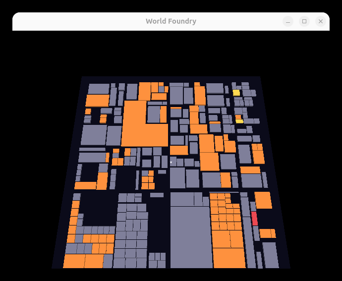

# KDirStat/QDirStat treemap view (`wflevels/treemap/`) — *implemented 2026-06-13*

**Branch:** `2026-new-level`

Third view in the filesystem-visualization family (after the FSN node-link browser and the
[Filelight sunburst](2026-06-13-filesystem-viz-on-a-flat-table-forth-policy-core-f.md)), on the
same **§6 flat-table + Forth-policy core**. KDirStat/QDirStat is the **squarified treemap**: the
plane tiled with rectangles, **area ∝ recursive size**, **nested by directory**, **colored by
file type** — read from above like the 2D tool, walkable.

User-chosen form: **flat true-2D** (height ~uniform; meaning in area + color), **color by file
type** (KDirStat's signature), **static** (no re-rooting).

**Why it's the cleanest view in the family.** Treemap cells are **axis-aligned boxes**, so a
corner-pivot unit box scaled `(w, h, slab)` *is* any cell — **no bespoke meshes** (Filelight
needed annular sectors) and **no trig anywhere** (Filelight/FSN needed `cos/sin/atan2`). No
navigation, no fly-down.

```
TOP-DOWN (fills the floor; walk on it / read like 2D KDirStat)
┌──────────────┬─────────┬────────────┐    area ∝ recursive size
│ wfsource     │ engine  │ wflevels   │    colour ∝ file type
│ ┌────┬──┬──┐ │ ┌──┬───┐│ ┌───┬────┐ │    inset gaps = nesting depth
│ │.cc │.h│..│ │ │.o│lib ││ │.iff│.lev│ │
│ └──┴──┴───┘  │ └─┴───┴──┘│ └───┴──┴──┘ │  squarified → near-square cells
└──────────────┴─────────┴────────────┘
 source=blue image=green video=purple audio=cyan archive=red docs=yellow binary=orange dir=grey
```

## Architecture (the §6 split — no trig at all)

- **C emitter `tm-scan`** (`scripting_zforth.cc`) — runs the **squarified-treemap layout**
  (Bruls et al.: greedily pack children into rows along the shorter side while the worst aspect
  ratio improves; finalize the row, shrink the rect, recurse per dir) and the **extension →
  type-id classifier** (`tm_classify`; the *string* stays in C). Emits a flat table of cells
  `{x, y, w, h, type, depth}` (`TmCell`) + `tm-x/y/w/h/type/depth ( i -- v )` accessors. Pure
  arithmetic — `tm_worst` is the Bruls closed form, no trig.
- **Render policy in the Director `.fth`** — iterates the table and spawns a corner-pivot unit
  box per cell, `set-scale3 (w,h,slab)`, `set-color (type>rgb type)`. The **file-type color
  palette and slab height are hot-reloadable** Director policy (same mechanism proven for
  Filelight — edit the `.fth`, rebuild the level only, engine binary untouched).

Reuses the core: `fl_subtree_bytes` (recursive size), `fsn_scan`, `fsn_spawn`/`g_fsn_maxNodes`
(shared spawn budget), `set-color`; the Blender scaffolding (astronaut, lights, floor, room,
`'SLOT' 1l`). New: `set-scale3` bootstrap word, syscalls 160-168, one unit-box template.

**Budget tuning (the one real gotcha).** The layout is depth-first, so a small cell budget gets
eaten by the first huge subtree and the rest of the rect stays empty. Fixed with **area-based
culling** (`TM_MIN_AREA = 11` stop-recursing threshold + `TM_MIN_LEAF = 2.5` sliver cull) so
~250 visible cells fill the *whole* rect well under the 480-cell pool.

## Verification

```
task build
blender --background --python wflevels/treemap/blender_treemap.py
task build-level -- treemap
task run-treemap
```

- `TM: laid out '.' — 247 cells` — under the 480 pool; **fills the entire floor** (after the
  area-cull fix; before it, the budget was eaten by `.git`/`wfsource` and only the corner filled).
- Render: near-square nested cells tiling the plane, area ∝ size, colored by file type (grey
  dirs, orange binaries dominate this asset-heavy repo, with yellow docs / red archive accents) —
  recognizable KDirStat. No asserts, no out-of-room skips.
  
  PASS

## Out of scope (future)
Cushion shading (KDirStat's lit ridges — a shader, not geometry); per-depth z-terracing (a
one-line Director tunable, default off per the flat choice); walk-in re-root navigation (the
static choice — the `fl-navigate` pattern is available if wanted); a "files below N%" HUD.
