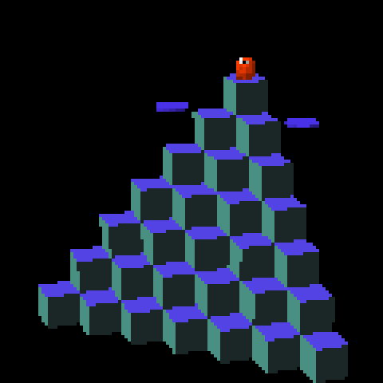
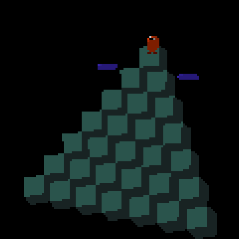
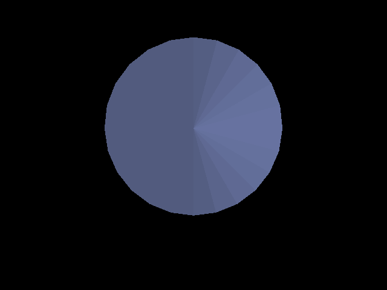
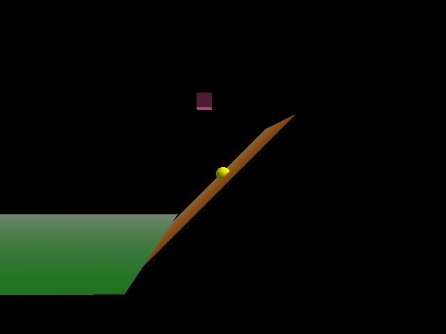
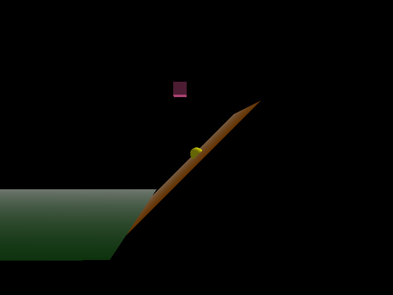

# Plan: Planetarium dome view + engine-wide backface culling

## Context

Continuing the **filesystem-visualization family** in World Foundry (FSN node-link · Filelight
flat sunburst · KDirStat treemap already shipped). This turn adds the **4th view — a planetarium
dome** (sunburst wrapped onto a hemisphere; player stands at centre and looks up). While scoping
the dome's mesh facing, the user raised that the renderer's **lack of backface culling causes
display artifacts** — confirmed: nothing enables `GL_CULL_FACE`, so both sides of every polygon
draw (z-fighting on coincident faces, back-face bleed-through, doubled fill). The user chose to
**fix culling engine-wide**, via the **software normal-based** mechanism (winding-independent).

Two separable efforts result. They are independent, but because software culling keys off
**face normals** (already correct everywhere — proven by correct lighting), the dome's facing
becomes irrelevant to visibility. **Recommended order: land culling first** (engine-only, no asset
rebuilds, gives the dome a free regression check), **then build the dome against the culling-on
binary** so its framing screenshots reflect final behavior.

---

## Effort 1 — Engine-wide backface culling (software, normal-based)

**Goal:** cull every back-facing triangle engine-wide, **on by default**, with `WF_CULL=0` to
disable for instant A/B. Winding-independent — **zero mesh edits, no winding audit** — by reusing
the per-face normals the engine already computes (`CalculateNormal`, `face.hpi:27-48`) and that
one-sided lighting already proves directionally correct (outward on props, inward on interiors).

**Why software, not hardware `GL_CULL_FACE`:** winding is globally inconsistent
(`rendacto.cc:147` cube is CW-from-inside; Blender boxes CCW-from-outside; `rendmatt.cc:221` matte
ad-hoc) — a single `glFrontFace`+cull would erase a large, hard-to-enumerate set of surfaces and
require flipping every interior mesh (rooms, dome, skydome) inward. The software dot-product test
sidesteps all of it.

**The test (one chokepoint).** All triangles from all 8 `RenderPoly3D*` renderers *and* the matte
flow through `ModernRendererBackend::DrawTriangle` (`wfsource/source/gfx/glpipeline/backend_modern.cc:347-364`).
Do the cull there, in **eye space** (camera at origin, looking −Z) using the already-maintained
`_mv[16]`:
- `Ne = MV_upper3x3 * face.normal` (same transform used for light dirs at `backend_modern.cc:311-313`)
- `Pe = MV * faceCenter` where `faceCenter = (v0+v1+v2)/3`
- **cull when `dot(Ne, Pe) > 0`** (normal points away from the camera)

**DOUBLE_SIDED exception (already-dormant flag).** `material.hp:117` defines `DOUBLE_SIDED = 8`,
never used. Add inline `IsDoubleSided() const { return _materialFlags & DOUBLE_SIDED; }` to
`material.hp`. Extend `DrawTriangle`'s signature (`renderer_backend.hp:72-76` + the
`backend_modern.cc` override) with a `cullExempt` bool. The 8 `RenderPoly3D*` TUs (representative:
`rendftl.cc:75`) pass `currentRenderMaterial->IsDoubleSided()`; the matte's two `DrawTriangle`
calls (`rendmatt.cc:221-222`) pass `true` so the background is never culled.

**Global toggle.** In the backend, cache `static bool gCull = !(getenv("WF_CULL") && atoi(...)==0)`
(default ON), mirroring the `getenv("WF_GAME_SCREENSHOT_PPM")` precedent at `display.cc:983`. Gate
the whole cull block on it.

**Critical files:**
- `wfsource/source/gfx/glpipeline/backend_modern.cc` — cull test in `DrawTriangle`; `WF_CULL` read; eye-space `Ne`/`Pe` from `_mv`.
- `wfsource/source/gfx/renderer_backend.hp` — `DrawTriangle` signature `+ cullExempt`.
- `wfsource/source/gfx/material.hp` — `IsDoubleSided()` accessor.
- the 8 `wfsource/source/gfx/glpipeline/rend{f,g}{t,c}{l,p}.cc` — pass material's flag through.
- `wfsource/source/gfx/rendmatt.cc` — pass `cullExempt=true` at the two matte draws.

**Verification — A/B, headless, deterministic.** Use the built-in PPM hook
(`WF_GAME_SCREENSHOT_PPM=<path>` → `display.cc:981-1010` writes a frame-30 PPM; reproducible, no
X11 grab). For each shipped level, capture **before** (`WF_CULL=0`, current binary) and **after**
(default cull, patched binary); pixel-diff (`compare -metric AE`). Levels: SMB W1-1..1-4 (matte
background must survive), snowgoons, qbert, filesys, filelight, treemap (densest two-sided-prism
stress), **moon_site01 (interior-viewed skydome — the key must-not-vanish case)**. Gates: (1) no
foreground/interior/skydome/matte surface vanished; (2) prior back-face artifacts (z-fight
speckle, see-through) gone; (3) patched binary with `WF_CULL=0` reproduces baseline pixel-for-pixel
(toggle is the only behavioral change). Any regressor gets a `DOUBLE_SIDED` tag on the offending
mesh rather than disabling the global cull. Record a level×{before,after,AE,verdict} table.

**Plan doc to create on implementation:** `docs/plans/2026-06-13-engine-backface-culling.md` + TODO entry.

---

## Effort 2 — Planetarium dome view (`wflevels/dome/`)

Full design already written to **`docs/plans/2026-06-13-planetarium-dome-view.md`** (created this
turn). Summary:

- **Reuses Filelight's `fl-scan` table verbatim** — depth→**elevation band**, a0/a1→azimuth (rev),
  branch→hue; `seg-size` unused (size lives in the arc). **No `scripting_zforth.cc` change, no
  engine rebuild** — the strongest proof yet of "a new view = new `.fth` + meshes."
- **NEW `wflevels/dome/blender_dome.py`** (cloned from `blender_filelight.py`): astronaut, lights,
  floor, room, Director, ActBoxOR + **player-controlled look-around camera** (see below) +
  per-depth **`spherical_band_geo` patch templates** (idx 12/13/14) + a **zenith cap** (idx 15).
  Elevation bands: cwd cap φ∈[72,90]°, depth1 [50,72]°, depth2 [28,50]°, depth3 [8,28]°;
  hemisphere R≈35. Patch normals point **inward** (toward the player) — which, under software
  culling, is exactly what keeps them visible (normal faces camera ⇒ not culled).
- **Camera — player turns to look around (not Fixed).** Unlike Filelight's `Rotation = Fixed`
  position-tracking camshot, the dome camera follows the **player's heading**: it sits at the
  player (centre of the dome) with a **fixed upward pitch** at the bands, and its **azimuth =
  the player's facing**, so turning the joystick swings the upward view around the dome (the
  natural "stand under the planetarium and look around" feel — no automated spin). Exact CamShot
  config (heading-follow mode + up-pitch + FOV≈80) is an M2 tuning step against a screenshot.
- **Director `.fth` render policy:** `depth→band-tmpl`, per-branch `hsv>rgb` hue (identical to
  Filelight), `spawn0`+`set-rotation` (Z-heading rev) per arc wedge, zenith cap spawned once. No
  height curve (size is angular). Static dome geometry — no `fl-navigate`/`fl-flydown`.
- **NEW `task run-dome`** (mirror of `run-filelight`); build via the generic `task build-level -- dome`.
- **Verification:** M1 static dome renders (N segments, bands + cap, no asserts/out-of-room/terminate,
  <500 pool); M2 per-branch hue + camera framing + screenshot to `wflevels/dome/screenshots/`;
  M3 hot-reload proof (edit Director `.fth` only, rebuild level only, engine untouched).
- **Out of scope:** walk-/aim-to-re-root navigation, size→radial relief, tiered monument
  (#2, the last remaining sunburst variant).

**Dome ↔ culling dependency:** none under software culling — the dome's inward normals are correct
for both lighting and the normal-based cull. Build the dome after culling lands so M2 screenshots
already reflect culling-on.

---

## Sequencing & deliverables

1. **Culling** (engine): implement → `task build` → A/B verify across the level set → commit +
   `docs/plans/2026-06-13-engine-backface-culling.md` + flip `docs/level-design-troubleshooting.md:721`
   note ("culling is now ON by default; mark interior/special meshes `DOUBLE_SIDED`") + TODO.
2. **Dome** (level): `blender_dome.py` → `task build-level -- dome` → `task run-dome` against the
   culling-on binary → M1/M2/M3 verify + screenshot → commit + mark the dome done in TODO
   (filesystem-viz family open-items), link the commit.

Both commits stage **only** their own files (the tree has unrelated `moon_site01`, `.history`,
`y-crdt`, wf-edit changes — leave them).

---

## Outcome — Effort 1 (culling), 2026-06-13

**Shipped the cull mechanism but DEFAULT-OFF (`WF_CULL=1` opt-in)** — not on-by-default as planned.

A/B across 7 shipped levels (frame-30 PPM, `WF_CULL=0` vs on) found:
- **Mechanism correct.** qbert, snowgoons (standalone iff), filesys, moon_site01 (run with its
  `--vram-*` params) are pixel-clean; the matte background is correctly cull-exempt.
- **But the "normals are already correct" premise is false.** Several procedural generators are
  wound **inward** — `add_solid_box` / `make_box_mesh` / `disk_geo`. Derived from
  `CalculateNormal=(v2-v0)×(v1-v0)` (`face.hpi:35`): the box `top` face `(4,5,6,7)` normal is −Z
  (down). So culling removed visible tops — SMB ground top **vanished**, treemap cell tops +
  filelight centre disk **darkened**. These faces were already rendering ambient-only (latent
  under-lighting); culling just exposed it.
- **Reversing winding is not a clean fix.** Tried it on filelight (`disk_geo` + `add_solid_box`)
  and treemap (`add_solid_box`): the disk came out *dimmer* than its intended bright look, and the
  treemap cells were **not** restored — because appearance is entangled with one-sided lighting +
  the `set-color`/`FACE_COLOR` override, not winding alone. (Those edits were **reverted**; the
  levels are byte-identical to before.)

**Decision (user-approved):** ship the mechanism `WF_CULL`-gated, **off by default**; keep all 7
levels pixel-identical; treat "rewind every shipped mesh to consistent normals + flip the default
on" as a **separate scoped effort** (TODO). The planetarium dome — authored with correct normals
from scratch — is the first `WF_CULL=1` consumer.

**Landed (engine, default-off):** the cull in `backend_modern.cc` + `backend_metal.mm`,
`DrawTriangle` `cullExempt` param (`renderer_backend.hp`, stub), `Material::IsDoubleSided()`
(`material.hp`), the 8 `rend*.cc` pass the flag, `rendmatt.cc` cull-exempt. Docs updated
(`level-design-troubleshooting.md`, `level-building.md`) with the winding rule + `WF_CULL` toggle.

> Capture caveat: a fresh post-flip confirmation screenshot wasn't grabbed (display/process
> contention late in the session); default-off is guaranteed by the code (`WF_CULL` unset → cull
> skipped) and the cull path was exercised by the 12-PPM A/B sweep on the same binary.

---

## Effort 1b — rewind + default-on, 2026‑09‑21

**Outcome: the default was NOT flipped. One genuine inward‑wound level was found and fixed
(the dome); two levels hit the (c) colour‑entanglement case the 06‑13 attempt reverted; one
level is not byte‑reproducible frame‑to‑frame, so the A/B method cannot rule on it.** The flip
is blocked on a design call — see **Blockers** below.

### Method

`task build` (green) → for every one of the 20 `wflevels/*-standalone.iff` levels, capture
backend frame 20 twice, once with `WF_CULL=0` and once with `WF_CULL=1`:

```
engine/wf_game --frame-step-smoke=30 --cycles=1 -rate20 -record_video \
  -L<abs>/wflevels/<level>-standalone.iff --capture-frame=20=<out.png>
```

run from `wfsource/source/game`, with `run-condo`/`run-moon`'s `--vram-*` flags for
`condo_639_640*` and `moon_site01`. Two notes the 06‑13 sweep did not have:

- **`-record_video` is required on Linux.** `--capture-frame`'s PNG write lives inside the
  recorder path (`gfx/gl/display.cc:1223`, `if (bRecordVideo) CaptureFrame(...)`), so without
  it the run exits 0 and silently writes nothing. `output.mp4` is gitignored.
- **A determinism control was run first** — the same sweep with `WF_CULL=0` on *both* legs.
  Every level came back byte‑identical except `treemap`, which is not reproducible run‑to‑run
  at all (21653 px differ between two identical runs). Without that control, `treemap`'s
  culling "difference" would have been a phantom.

### 1. Baseline A/B, all 20 shipped levels, frame 20

Raw output (`lit` = non‑black pixels of 307200; `IoU` = lit‑coverage intersection‑over‑union;
`pxdiff` = pixels differing in any channel):

```
level                      frame  lit WF_CULL=0  lit WF_CULL=1    delta    IoU%   only0   only1   pxdiff verdict
condo_639_640                 20         307200         307200        0  100.00       0       0      143 colour-only
condo_639_640_tour            20         307200         307200        0  100.00       0       0      167 colour-only
dome                          20          67522              0   -67522    0.00   67522       0    67522 (b) EVERYTHING LOST
filelight                     20         121396         121396        0  100.00       0       0        0 IDENTICAL
filesys                       20          64574          64574        0  100.00       0       0        0 IDENTICAL
marble-madness                20          29619          29619        0  100.00       0       0    29071 colour-only
marble-madness-2              20          19268          19268        0  100.00       0       0     7436 colour-only
mm_practice                   20          94094          94094        0  100.00       0       0        0 IDENTICAL
mm_practice_blender           20         122851              0  -122851    0.00  122851       0   122851 (b) GROUND LOST
mm_practice_blender_rt        20         122851              0  -122851    0.00  122851       0   122851 (b) GROUND LOST
moon_site01                   20         175321         175321        0  100.00       0       0        0 IDENTICAL
pilot_demo                    20          94731          94731        0  100.00       0       0        0 IDENTICAL
qbert_practice                20           6043           6042       -1   99.98       1       0     5100 (b) CUBE TOPS LOST
smb_w1_1                      20          14041          14041        0  100.00       0       0        0 IDENTICAL
smb_w1_2                      20          25772          25772        0  100.00       0       0        0 IDENTICAL
smb_w1_3                      20          10794          10794        0  100.00       0       0        0 IDENTICAL
smb_w1_4                      20          83492          83492        0  100.00       0       0        0 IDENTICAL
snowgoons                     20         100849         100849        0  100.00       0       0       98 colour-only
snowgoons-blender             20         100849         100849        0  100.00       0       0       97 colour-only
treemap                       20         163850         163850        0  100.00       0       0    21684 NON-DETERMINISTIC
```

Determinism control (`WF_CULL=0` on both legs) — everything `IDENTICAL` except:

```
treemap                       20         163850         163850        0  100.00       0       0    21653 (c) COLOR-ONLY changed=21653 maxdiff=245
```

**PASS** (sweep executed; 9 of 20 levels are already culling‑clean pixel‑for‑pixel:
`filelight`, `filesys`, `mm_practice`, `moon_site01`, `pilot_demo`, `smb_w1_1..4`).

**The 06‑13 premise about the box generators no longer holds.** `add_solid_box` /
`make_box_mesh`'s face list `[(0,3,2,1),(4,5,6,7),…]` is *Blender*‑outward, and since the
2026‑09‑19 exporter face‑hand flip
([plan](2026-09-19-exporter-face-hand.md)) the exporter reverses each loop, so those boxes now
land WF‑outward. `filelight`, `filesys` and the SMB levels — the ones the 06‑13 outcome named
as losing their tops — are now pixel‑identical under culling. No generator needed rewinding.

### 2. Classify each difference

Breakdown of the changed pixels (mean RGB over the changed set, cull‑off → cull‑on):

```
condo_639_640          n=   143  bbox=(152,65)-(161,88)    cull0=[24 52 90]      cull1=[46 101 160]    darker=0     brighter=143
condo_639_640_tour     n=   167  bbox=(146,144)-(157,169)  cull0=[24 52 90]      cull1=[46 101 160]    darker=0     brighter=167
marble-madness         n= 29071  bbox=(0,164)-(423,423)    cull0=[72.4 116.4 57] cull1=[59 76 47.5]    darker=29006 brighter=63
marble-madness-2       n=  7436  bbox=(224,188)-(383,281)  cull0=[137.4 …]       cull1=[128.2 …]       darker=7435  brighter=0
snowgoons              n=    98  bbox=(99,298)-(173,469)   cull0=[65 63.2 63.2]  cull1=[135.6 … 145.5] darker=13    brighter=85
snowgoons-blender      n=    97  bbox=(99,298)-(173,469)   cull0=[65.5 …]        cull1=[136.7 … 146.6] darker=13    brighter=84
```

- **(a) legitimately hidden faces removed** — `condo_639_640`, `condo_639_640_tour`,
  `snowgoons`, `snowgoons-blender`. Tiny (≈100–170 px), confined to one small box, and
  *brighter* after: a back‑facing polygon was bleeding over a brighter front face and culling
  removed it. Silhouette unchanged. Good.
- **(b) a visible face vanished** — `dome`, `mm_practice_blender`, `mm_practice_blender_rt`,
  `qbert_practice`. Note that only the `dome` shows up as lost *coverage*; the other three keep
  100 %/99.98 % IoU because the vanished face is backed by another lit surface. **Lit‑pixel
  count and IoU alone are not sufficient to classify — every changed level had to be looked at.**
- **(c) colour changes, coverage unchanged** — `marble-madness`, `marble-madness-2`. See
  **Blockers**.
- **unclassifiable** — `treemap`, which is not deterministic run‑to‑run (control above), so
  neither IoU nor pxdiff can be attributed to culling.

`qbert_practice` (case b) is the clearest picture of what inward winding looks like — the
cubes' blue top faces and dark front faces are culled, leaving only the teal sides:

| `WF_CULL=0` | `WF_CULL=1` |
|---|---|
|  |  |

### 3. Fix (b) at the source — the dome

**`wflevels/dome/blender_dome.py` was the one generator that genuinely needed rewinding, and
the 2026‑09‑19 exporter flip is what broke it.** `spherical_band_geo` and `cap_geo` were hand
wound against the *engine's* `(v2−v0)×(v1−v0)` formula ("verified") back when the exporter
wrote loop order unchanged. The exporter now reverses every loop, so those patches were
exported WF‑**outward** and culled from the centre: the dome — the level whose whole point is
being the first correct `WF_CULL=1` consumer — has been rendering **completely black** under
`WF_CULL=1` since `9c36ba82`, which rebuilt it. Nobody re‑checked it against the rebuilt `.iff`.

Fix: reverse both face lists so they are inward **in Blender**, which the exporter's reversal
then carries through to WF‑inward — the "author for Blender" rule the 09‑19 plan established.
Docstrings and the module header rewritten to state the rule rather than the engine formula.

| `WF_CULL=1` before | `WF_CULL=1` after |
|---|---|
|  |  |

Re‑captured after `blender --background --python blender_dome.py` + `task build-level -- dome`:

```
level                      frame  lit WF_CULL=0  lit WF_CULL=1    delta    IoU%   only0   only1   pxdiff verdict
dome                          20          67522          67522        0  100.00       0       0        0 IDENTICAL
```

and against the *pre‑fix* `WF_CULL=0` baseline (i.e. the look is unchanged with culling off):

```
baseline(cull off, pre-fix) vs after-fix(cull ON): maxdiff 34 | lit 67522 67522
```

**PASS** — coverage IoU 100 %, lit‑pixel count identical, residual `maxdiff 34` is the
one‑sided lighting now hitting the patches' other face (expected when a normal is reversed).

> **Side finding — the dome no longer reproduces from its script, for an unrelated reason.**
> Re‑running `blender_dome.py` drops `lightRed/lightGreen/lightBlue/lightType` from **both**
> `Light01` and `AmbientLight` in the emitted `dome.lev` (the script sets them as
> `wf_*` props; `_emit_lev_fields`'s schema walk emits nothing for them and prints no error).
> The regenerated level renders **black with culling off too** (0 lit px). So the committed
> `wflevels/dome/dome.lev` was kept at HEAD and only the four rewound template meshes
> (`band{1,2,3}template.iff`, `captemplate.iff`) were taken from the re‑export. Consequence:
> `dome.lev`'s `slopeA–D` still carry the pre‑rewind sign. It has no visible effect (the
> captures above are the evidence), but the level is now in the same
> "does not rebuild from its script" bucket as `qbert_practice` and `mm_practice_blender_rt`.
> This is a separate defect in `wftools/wf_blender/export_level.py`, adjacent to
> [2026-09-20-export-level-light-field-duplication.md](2026-09-20-export-level-light-field-duplication.md).

### Blockers — why the default was not flipped

1. **(c) colour entanglement, `marble-madness` + `marble-madness-2`.** Culling leaves coverage
   at 100 % IoU but darkens a large surface (the green floor slab, 29006 px darker; the grey
   ledge, 7435 px darker). The bright appearance depends on a **back‑facing** polygon being
   drawn — remove it and the front‑facing one underneath is lit from the wrong side by the
   one‑sided lighting. That is exactly the "appearance is entangled with one‑sided lighting +
   the `set-color`/`FACE_COLOR` override, not winding alone" finding the 06‑13 attempt hit and
   reverted. These are **native, text‑authored `.iff`** levels — they do not go through the
   Blender exporter, so there is no generator to rewind; the fix is a decision about
   `FACE_COLOR`/one‑sided‑lighting semantics, not a winding edit.

   | `WF_CULL=0` | `WF_CULL=1` |
   |---|---|
   |  |  |

2. **`treemap` is not byte‑reproducible**, so no A/B verdict is possible for it by this method.

3. **Three (b) levels cannot be rebuilt from their scripts.** `mm_practice_blender` and
   `mm_practice_blender_rt` ship `-standalone.iff` files from `628d24af` / `b2df9c90`, i.e.
   pre‑exporter‑flip, in the old hand — they were never rebuilt in the 09‑19 sweep and lose
   their whole ground plane under culling. `qbert_practice` loses its cube tops and is the
   documented "restored from HEAD, still in the old hand" case. Rebuilding all three runs into
   the same class of exporter reproducibility bug the dome just hit.

**FAIL / DEFERRED** for step 5 (flip the default) and step 6 (regression‑guard the flip).
`WF_CULL` remains opt‑in in both `backend_modern.cc` and `backend_metal.mm`; the docs
(`level-design-troubleshooting.md`, `level-building.md`) still describe it correctly as
off‑by‑default and are unchanged.
