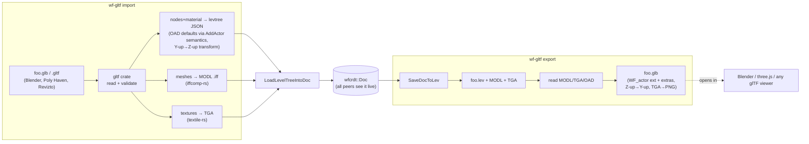

# Plan: glTF import/export — turning wf_edit into a general 3D scene tool

**Status:** NOT STARTED — plan only.

**Date:** 2026-07-05
**Branch:** written on `2026-new-level` (local line). **The code it targets — `engine/wf_edit/` and `wftools/` — lives on `origin/2026-new-level` (the remote line).** See root `TODO.md` reconcile item; land this after the branches are reconciled, or author it directly on the remote line. When it merges into the remote line, add a row to `docs/plans/README.md` (the drift hook `check-plan-index.sh` will flag its absence).

## Why this is the highest-leverage investment

From [docs/investigations/2026-07-05-wf-edit-monetization.md](../investigations/2026-07-05-wf-edit-monetization.md): *"The single highest-leverage engineering investment is glTF import/export. It converts wf_edit from 'WorldFoundry's editor' into 'a collaborative 3D scene tool,' unlocking all of Part A. Nothing else on the list changes the ceiling as much."* The [default-sim-environment analysis](../investigations/2026-07-05-worldfoundry-default-sim-environment.md) makes the same point as its pillar 2 ("interop over lock-in"): format neutrality is a prerequisite for *default* status, not a feature.

Today wf_edit reads and writes **only** `.lev`/OAD (WorldFoundry's own format). That is the single fact that keeps every non-game vertical (AEC, previz, industrial, defense, education) out of reach — they all arrive with [glTF](https://www.khronos.org/gltf/) (or something that exports to it). glTF is the [Khronos](https://www.khronos.org/) runtime-3D interchange standard — "the JPEG of 3D" — Y-up, right-handed, metric, PBR (*physically-based rendering*) materials, with a JSON scene graph plus binary buffers (`.gltf`+`.bin` or self-contained `.glb`).

**Definition of done:** a foreigner's `.glb` (e.g. a [Poly Haven](https://polyhaven.com/) asset — several already vendored under `assets/polyhaven/*.gltf`) drops into a wf_edit collaborative session as placed, textured actors; and a WF level exports to a `.glb` that opens correctly in Blender / any glTF viewer. Round-tripping a WF level through glTF and back is lossless.

## What already exists (the load path we build on)

From the remote-line source (`git show origin/2026-new-level:engine/wf_edit/level_doc.h`, `level_save.h`, `oad_reader.h`):

- **`LoadLevelTreeIntoDoc(lev_path, Doc&, out_save_path)`** — parses a `.lev` into the CRDT `wfcrdt::Doc`. Internally it goes through a **"levtree" JSON** intermediate (`RunLevtreePrint` is the inverse). This JSON is the natural target for an importer: *produce levtree JSON, and the existing loader turns it into live Doc content that all peers see.*
- **`SaveDocToLev` / `RunBuildLevel`** — Doc → `.lev` → compiled `.iff` (via `iffcomp-rs`). The export side can reuse this to reach a canonical level, then convert.
- **`AddActor(doc, class_name)`** — creates an actor pre-populated with the *complete* set of OAD defaults. This is how imported geometry gets valid WF actors without the glTF file knowing anything about OAD.
- **Mesh + texture model:** actors reference geometry by a `FILE` field (`"Mesh Name" → "House.iff"`) — meshes are binary **MODL `.iff`** (written by `iffcomp-rs`), textures are **TGA** (produced by [`textile-rs`](../../wftools/textile-rs)). An importer must emit MODL + TGA; an exporter must read them.
- **Rust toolchain precedent:** `iffcomp-rs`, `oaddump-rs`, `lvldump-rs`, `textile-rs` — deterministic file↔file converters. glTF conversion belongs here as a peer, not inside the C++ editor.
- **Coordinate convention already settled:** the Blender plugin maps Y-up↔Z-up at `wftools/wf_blender/export_level.py:23-25` with `wf=(rot.x, rot.z, -rot.y)`. **The glTF path must use the identical transform** so Blender, glTF, and WF all agree — glTF is Y-up like Blender's export space.

## Design decisions

1. **A standalone Rust crate, not C++ in the editor.** New tool `wftools/wf_gltf-rs` (CLI `wf-gltf`), using the Khronos-blessed [`gltf`](https://crates.io/crates/gltf) crate (read) + [`gltf-json`](https://crates.io/crates/gltf-json) (write). Rationale: reuses the deterministic Rust pipeline; works **headless** (CI, `wf_py`, batch conversion) not just in the editor; keeps wf_edit thin (it already shells out to `levtree`/`RunBuildLevel`, so `wf-gltf import|export` slots into the same pattern). Determinism is a first-class requirement (sorted keys, stable node/buffer ordering, no hashmap iteration leakage) — it must fit the "bit-identical" thesis.
2. **levtree JSON is the seam.** Import = `glb → levtree JSON (+ MODL meshes + TGA textures)`, then the existing `LoadLevelTreeIntoDoc` merges it into the Doc. Export = Doc → `.lev` → read → `glb`. We do **not** write a second Doc parser.
3. **Two fidelity tiers, one extension.**
   - *Foreign glTF → WF* (Blender, Poly Haven, Revizto export…): map geometry + node transform + material only; fill all other OAD fields from `AddActor` defaults. Lossy by nature, and that's fine.
   - *WF → glTF → WF*: carry the full OAD field set in a **`WF_actor` glTF extension** (+ mirror in node `extras` for viewers that ignore extensions), so the round-trip is lossless. glTF's extension mechanism is designed for exactly this.
4. **Scene-graph mapping.** glTF `scene` → WF level; top-level glTF nodes → WF actors in a default room; nested node hierarchy → **baked into world transforms in Phase 1** (flatten), true hierarchy deferred. Map glTF node TRS → WF pos/rot/scale through the Blender-consistent Y-up→Z-up transform, with a configurable metric-scale factor (glTF is meters; WF world units are fixed-point — pick and document the scale, watch fixed-point range/precision on large scenes).
5. **Materials:** glTF PBR metallic-roughness → WF's simpler material model — baseColor texture → TGA via `textile-rs`; scalar/rough/metal factors mapped best-effort; document what's dropped. Export goes the other way (TGA → PNG embedded in the `.glb`).

## Dataflow

## Phases

Each phase is independently valuable and independently shippable. Stop after any phase and wf_edit is strictly more capable than before.

### Phase 0 — Scaffold `wf_gltf-rs` (est. 1–2 days)
- New crate `wftools/wf_gltf-rs` mirroring `iffcomp-rs` layout (Cargo, CLI with `import`/`export` subcommands, `--scale`, `--room`, `--deterministic` defaulting on).
- Vendor/verify the `gltf` + `gltf-json` crates build under the workspace and (stretch) the wasm/emscripten target, since the editor is also wasm.
- Wire a `task gltf-*` entry and a smoke test that round-trips a trivial two-triangle `.glb` through parse→print with byte-stable output.

### Phase 1 — Import geometry (the "it's real" milestone) (est. 3–5 days)
- `wf-gltf import foo.glb -o foo.lev`: for each mesh primitive, write a MODL `.iff` (positions, normals, UVs, indices) via the `iffcomp-rs` writer path; emit one WF actor per top-level node referencing its mesh, transform baked through the Y-up→Z-up map + scale.
- Fill non-geometry OAD fields from class defaults (mirror `AddActor`).
- **Verification:** import an already-vendored `assets/polyhaven/WoodenTable_02/WoodenTable_02_1k.gltf`, load the resulting `.lev` in wf_edit, confirm the table appears correctly placed and scaled. This is the demo that proves the thesis.

### Phase 2 — Materials & textures (est. 2–4 days)
- glTF baseColor (and, best-effort, metallic-roughness/emissive) → TGA via `textile-rs`; populate the actor's material/texture OAD fields.
- Verification: the Poly Haven table imports *textured*, not flat-shaded, in wf_edit.

### Phase 3 — Export WF → glTF (est. 3–5 days)
- `wf-gltf export foo.lev -o foo.glb`: read MODL meshes + TGA + OAD; emit a `.glb` with geometry, PNG-embedded textures, Z-up→Y-up transform.
- Verification: export the snowgoons level (or a lighthouse level), open the `.glb` in Blender and in a browser [three.js](https://threejs.org/) viewer; geometry + textures correct.

### Phase 4 — Lossless round-trip via `WF_actor` extension (est. 3–4 days)
- Define + document the `WF_actor` glTF extension carrying the full OAD field set (scripting, physics flags, mailboxes, camera, etc.); write it on export, read it on import (mirrored into `extras` for foreign viewers).
- **Conformance test:** `foo.lev → glb → lev'` is byte-identical (or semantically identical modulo documented normalization) on a golden corpus. Deterministic output verified across two machines (ties into the determinism thesis — this test *is* a determinism artifact).

### Phase 5 — Wire into wf_edit (est. 2–3 days)
- **File ▸ Import glTF…** and **Export glTF…** menu items in wf_edit that shell out to `wf-gltf` (same popen/preloaded-JSON pattern as `levtree`/`RunBuildLevel`); import merges the produced levtree JSON into the live `Doc` so **all collaborators see the imported scene appear in real time** (the collaboration story becomes "drop a `.glb` in the shared session").
- Drag-and-drop a `.glb` onto the viewport as the fast path.
- Verification: two browser peers in one session; one imports a `.glb`; both see it; either can then edit/place it.

### Phase 6 — Docs + USD on-ramp (est. 1–2 days)
- Publish `docs/formats/gltf-mapping.md`: the node/material/coordinate/unit mapping and the `WF_actor` extension spec.
- Note the follow-on: an [OpenUSD](https://openusd.org/) bridge (pillar 2 of the sim-env doc) — glTF first because it's simpler and covers more inbound traffic; USD for the Omniverse/film world later. IFC import (AEC) is a separate, larger plan and explicitly *not* here.

## Verification strategy

- **Golden corpus:** the vendored Poly Haven `.gltf` assets + snowgoons + one lighthouse level; `wf-gltf` conversions checked into a fixtures dir; round-trip byte-stability asserted in CI (deterministic output is a hard requirement, not a nice-to-have).
- **Visual confirmation** in wf_edit (use the `/run` or `/verify` skill) after Phases 1, 2, 3, 5 — geometry and textures must be *seen* correct, not just parse clean.
- **Cross-viewer check** (Phase 3): exported `.glb` must open in Blender **and** a three.js viewer — two independent glTF implementations catch spec violations our own reader would forgive.

## Risks & mitigations

- **PBR ↔ WF material gap.** glTF materials are richer than WF's. Mitigation: map baseColor faithfully, best-effort the rest, *document every dropped channel*; never silently lose data without a log line.
- **Fixed-point precision/range on large or metric scenes.** glTF float positions → WF fixed-point can overflow/underflow on architectural-scale models. Mitigation: configurable `--scale`, optional recentre-to-origin, and a range-check warning. This directly interacts with the [determinism thesis](../investigations/2026-07-05-worldfoundry-default-sim-environment.md) — quantisation must be deterministic.
- **Coordinate/unit disagreement with the Blender plugin.** Mitigation: share one transform constant/function; add a test that Blender-export and glTF-export of the same scene agree.
- **Animation & skinning.** glTF animations/skins vs WF path/channel keyframes is a hard mapping. Mitigation: **out of scope** for this plan (static geometry only); note as a follow-on.
- **Scene hierarchy flattening (Phase 1)** loses parenting. Mitigation: bake transforms first, add true hierarchy once the flat path is proven.

## Out of scope (explicit)

Animation/skinning import-export; IFC (separate AEC plan); OpenUSD (follow-on, noted in Phase 6); glTF draco/meshopt compression; morphing/blend-shapes; a native in-process glTF loader in the runtime engine (this is an *editor/tooling* pipeline — the runtime keeps eating MODL `.iff`, preserving the ~2 MB footprint).

## References

- Monetization: [2026-07-05-wf-edit-monetization.md](../investigations/2026-07-05-wf-edit-monetization.md) (§3 names this the top engineering unlock; every Part A industry depends on it).
- Strategy: [2026-07-05-worldfoundry-default-sim-environment.md](../investigations/2026-07-05-worldfoundry-default-sim-environment.md) (pillar 2, interop over lock-in).
- Prior art in-tree: `wftools/wf_blender/export_level.py` (coordinate transform, OAD field mapping), `wftools/iffcomp-rs` + `wftools/textile-rs` (MODL/TGA writers), `engine/wf_edit/level_doc.{h,cc}` + `level_save.{h,cc}` (the Doc load/save seam), `engine/wf_edit/oad_reader.{h,cc}` (OAD schema).
- External: [glTF 2.0 spec](https://registry.khronos.org/glTF/specs/2.0/glTF-2.0.html), [`gltf` Rust crate](https://docs.rs/gltf/), [glTF extension registry](https://github.com/KhronosGroup/glTF/tree/main/extensions).
