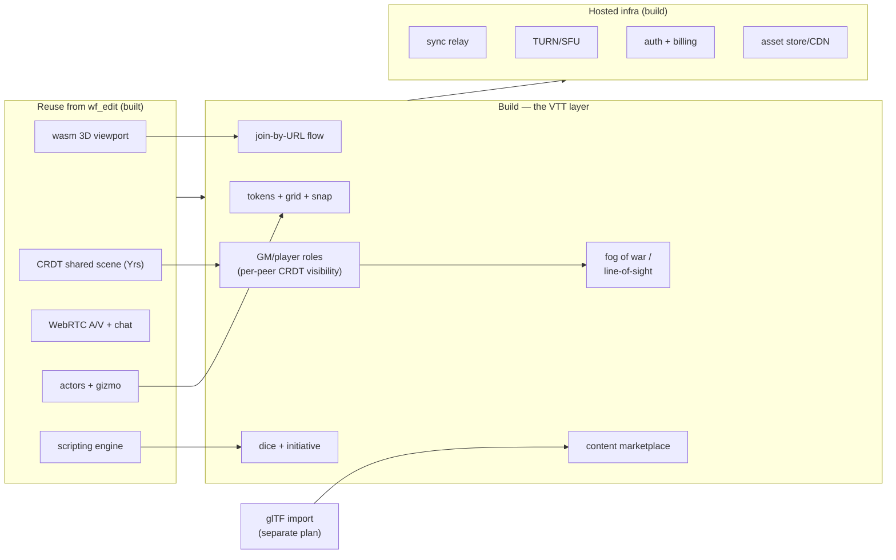
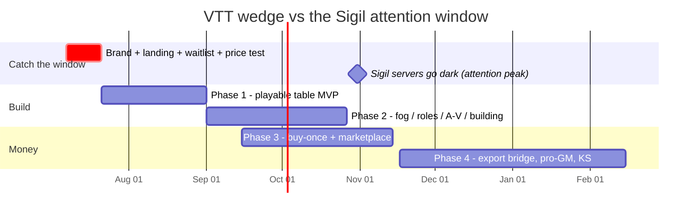

# Plan: the VTT wedge — a browser-native 3D virtual tabletop on wf_edit

**Status:** NOT STARTED — plan only.

**Date:** 2026-07-07
**Branch:** `2026-new-level` (reconciled — `engine/wf_edit` + `wftools` are now in-tree, so this can be built directly here). When it lands, add a row to the auto-generated `docs/plans/README.md` index (same outstanding regen as the [glTF plan](2026-07-05-gltf-import-export.md)).

## Thesis — why this is the near-term wedge

The [market-validation pass](../investigations/2026-07-05-wf-edit-market-validation.md) picked **VTT (virtual tabletop) over education** as the 3–12-month wedge, on verified evidence:

- **Proven, still-growing paid demand.** [Foundry VTT](https://foundryvtt.com/)'s paid-license base grew +32% then +22% YoY; its premium-content catalog +85% to 862 packages; [Roll20](https://roll20.net/) has 10M+ registered accounts. People pay for VTTs today.
- **A frictionless consumer buyer.** One game master (GM) makes a **$25–50 credit-card purchase**; players join free. No procurement, no seat negotiation.
- **A live vacuum with a clock.** Wizards of the Coast's D&D-branded 3D VTT, [Sigil](https://www.dndbeyond.com/posts/2086), shuts its servers down **end of October 2026** (~16 weeks from today), stranding 3D-VTT users. The main remaining 3D option, [TaleSpire](https://talespire.com/), is a $24.99 Windows install, still in Early Access after five years.

**The specific gap wf_edit fits — and it is not "another VTT."** Map the incumbents on install-vs-browser × 2D-vs-3D:

| | 2D maps | 3D maps |
|---|---|---|
| **Needs install / host** | Foundry VTT ($50, self-host) | TaleSpire ($24.99, Windows); Sigil (dead) |
| **Browser, zero-install** | Roll20 (freemium) | Tabula Sono (browser 3D VTT — *play*, not authoring/export) |

wf_edit is exactly a wasm 3D viewport you reach by URL. The pitch is *"TaleSpire's 3D, in the browser, no install — the GM buys once, players click a link."*

**Corrected by the [competitive](../investigations/2026-07-07-competitive-landscape.md) + [demand](../investigations/2026-07-07-game-worlds-vtt-demand.md) passes (2026-07-07) — read before over-investing in collaboration:** the browser-3D-VTT corner is **not empty** ([Tabula Sono](https://tabula-sono.com/) already ships browser, no-install, multiplayer 3D VTT — but it does collaborative *play*, not authoring or export), and *"collaborative browser 3D"* is now **commoditized** (PlayCanvas, Spline, Tabula Sono all have real-time co-editing) **and weakly demanded for building** (most GMs prep *solo* — 20–40 min/encounter, with a healthy paid market for pre-built drop-in maps; real-time co-building clearly wins only in the casual Minecraft sandbox). So the wedge is **not** the collaboration. It is **browser + zero-install + 3D + one-click retro/engine export + buy-once**, with *async map-grab and solo prep as first-class* and live co-building as a casual/social bonus. The **engine** (fixed-point, runs everywhere) is the moat; collaboration is packaging. Reweight the build accordingly (don't over-engineer CRDT authoring for a use case few structured builders want).

**Pricing is settled by the evidence, and it is not what the monetization doc first guessed.** Ship **buy-once host-pays (~$29–49) + a premium-content marketplace** — the [Foundry model](../investigations/2026-07-05-wf-edit-market-validation.md), the *only* indie-VTT model publicly shown to work. **Not** the $8–15/mo subscription in monetization idea B3.1 (that overshoots demonstrated willingness to pay), and explicitly **not** Sigil's "standalone game with passive monetization" bet, which is precisely what killed it.

**Two hazards to internalize up front:**

1. **Naming.** "WorldFoundry" vs the incumbent "Foundry VTT" is a collision. The VTT product needs its **own distinct brand** — never ship it as "WorldFoundry VTT."
2. **The A/V differentiator is unproven.** Built-in voice/video/chat is nice, but tables already run on Discord. Do **not** build the pitch on A/V — the wedge is *browser + 3D + zero-install*. A/V is a bundled convenience whose deal-winning power we must *test*, not assume (the validation's open question #1).

## What we already have (reuse verbatim)

- **Browser 3D viewport, zero-install** — `engine/wf_edit` compiled to wasm/WebGL. This *is* the wedge; no incumbent leads with it.
- **Real-time shared scene** — the CRDT `wfcrdt::Doc` (Yrs) with multi-peer join/seed. Moving a token = a CRDT edit every peer sees. This is the table.
- **Voice / video / text chat + presence** — WebRTC already wired (`voice_track`, `video_track`, `webrtc_session`, `collab_panel`). The table's comms, if they prove wanted.
- **Actors + gizmo + property panel** — the primitive that becomes a **token/miniature**.
- **Scripting engine** (Lua/Fennel/zForth/wasm) — powers dice, initiative, effects, fog logic without new engine code.
- **One-click shareable scene**; the engine renders the 3D map.
- **Dependency:** [glTF import](2026-07-05-gltf-import-export.md) — the path for battlemaps, tilesets, and monster minis. The VTT is a *major reason* glTF is the #1 engineering unlock.

## ⚠ Hard prerequisite — the collab relay is unauthenticated today

Before *any* paid VTT launch, the collaboration substrate must gain authentication and a permission model. The [2026-07-05 project review](../investigations/2026-07-05-project-review.md) §5 found the relay was built LAN-first, but "Host a call" now forwards it through a public Cloudflare tunnel **with no authentication added**:

- **#61 (High) — no room auth.** Anyone who learns or guesses the tunnel URL + room id downloads the *entire level*, injects CRDT edits every peer applies, and reads/forges chat and presence.
- **#62 (High) — client-supplied `peer_id` is the map key with overwrite semantics.** A player can evict another off the table (and two blank ids collide as `"anon"`).
- **#63 (Medium) — unbounded per-peer queues + uncapped rooms.** Memory-exhaustion DoS from any tunnel client.

This is not infra polish. A VTT *sells GM licenses and invites players in by shared link*, and the "per-peer CRDT visibility = GM/player roles + fog of war" design below silently assumes a trust boundary that **does not exist yet**. Room authentication + a GM-vs-player permission model is **Phase 0/1 work, not a Phase 3 afterthought** — never expose a paid table on the current open relay. (Related, lower severity: #68 — every Doc *read* opens a write transaction, fragile under many concurrent player-readers; #71 — a latent web-identity self-drop trap if identity persistence is ever wired.)

## What must be built (the VTT layer)

wf_edit is a *level editor*, not a VTT. The gap:

- **Tokens** — PC/NPC miniatures on the map (reskin actors); select, move, group, stack.
- **Grid + snap** — square/hex overlay, snap-to-grid movement, distance/measurement.
- **GM vs player roles** — the GM sees everything; players see their tokens + revealed areas. Implemented as **per-peer CRDT visibility scopes** — the one place the collaboration substrate is a genuine, hard-to-copy moat.
- **Fog of war / dynamic line-of-sight** — hide unexplored map from players, reveal as they move. This is *the* feature that separates a real VTT from a toy, and the hardest one.
- **Dice roller** — shared, table-visible, scripted; ideally 3D dice on the map.
- **Initiative / turn tracker** — order combatants, advance turns.
- **Player join-by-URL flow** — click link → pick character → at the table, free, on any device (the zero-install payoff).
- **Campaign persistence** — tables and state survive across sessions (hosted).
- **Content library + marketplace** — prebuilt maps/tilesets/tokens; creator uploads; 30% take (the Foundry revenue engine).
- **Hosted infrastructure (the real cost)** — CRDT sync relay, TURN/SFU for A/V, asset storage/CDN, auth/accounts, billing. None of this exists yet; it is a substantial chunk independent of the game features.

## Design decisions

1. **Buy-once host-pays (~$29–49) + marketplace. Players free.** Mirror Foundry exactly — the only demonstrated indie-VTT model. No subscription.
2. **The wedge is browser + 3D + zero-install + real-time multiplayer editing — NOT the built-in A/V.** The [2026-07-07 A/V validation](../investigations/2026-07-07-av-and-collab-validation.md) settled this: built-in voice/video is a *neutralized non-factor* (Figma won on live multiplayer with zero A/V; Roll20 ships A/V but tables use Discord anyway). So **lead with simultaneous co-editing** — the genuine, category-defining differentiator (Figma/Google Docs/SubEthaEdit) — and keep A/V as a minimal, optional convenience players can ignore in favor of their existing Discord. Don't spend build budget making A/V good; spend it making multiplayer editing + fog-of-war good. (Competitive note: [Spline](https://spline.design/) already does browser Figma-style multiplayer 3D editing in the *design* space — WorldFoundry's defensible ground is game worlds / VTT / the long tail, where Spline isn't.)
3. **System-agnostic first**, like Foundry/TaleSpire's core — a 3D map + tokens + dice, *not* a D&D-rules engine. Avoids rules-licensing entanglement and keeps sheets light. Rules automation is a later, optional layer.
4. **Roles/fog = per-peer CRDT visibility scopes.** Lean into the substrate's genuine moat; don't reimplement visibility as ad-hoc server state.
5. **Distinct brand.** Name the product independently of "WorldFoundry"/"Foundry."
6. **Content is the bottleneck, so seed it.** 3D maps are harder to make than 2D battlemaps — ship a starter tileset + easy in-browser building (wf_edit's strength) + glTF import so GMs aren't staring at an empty grid.

## Phased build — with an honest read of the 16-week window

**Reality check first:** a 1–3 person team cannot ship a *complete* 3D VTT (tokens + grid + fog + roles + dice + infra + billing + marketplace) in 16 weeks. So treat **end-of-October not as a ship deadline but as an attention window** — displaced Sigil users will be *looking* for a home. The move that actually fits the window is a **landing page + waitlist now** to catch that attention, an MVP as fast as focus allows, and the full product over 6–12 months. Don't over-promise a Sigil-killer by Halloween.

### Phase 0 — De-risk + scaffold (weeks 0–2)
- **Brand + landing page + waitlist**, with a **buy-once price test** ($29 / $39 / $49) — cheap, real willingness-to-pay signal, and it catches the Sigil-window attention *immediately* while the build runs. This is the highest-value first action.
- Reach displaced Sigil users where they are (r/VirtualTabletop, r/DnD, Foundry/TaleSpire communities); 10+ conversations.
- Lock MVP scope; stand up the infra skeleton (auth, sync relay, asset bucket).

### Phase 1 — Playable table MVP (weeks 2–8)
Tokens on a grid with snap movement; GM/player roles + **join-by-URL** (players free, in-browser, any device); dice; text chat (already built); 3–5 prebuilt 3D maps. **Milestone:** a stranger's group can run a real session in the browser. Aim to have this in front of the Sigil crowd before end-of-October — flag openly that it is tight.

### Phase 2 — The features that make it a *real* VTT (weeks 8–16)
Fog of war / dynamic line-of-sight (per-peer CRDT visibility); initiative tracker; voice/video wired to the table (+ instrumentation to measure actual use vs Discord); in-browser map building (reuse wf_edit) + **glTF asset import**.

### Phase 3 — Monetize (weeks 12–20, overlapping)
Buy-once license + billing; content marketplace (maps/tilesets/tokens, 30% take); first publisher/creator outreach.

### Phase 4 — Grow (post-launch)
Roll20/Foundry **export bridge** (sell to their users without fighting them — monetization B3.4); pro-GM toolkit (B3.5); actual-play streamer kit (B3.10); a Kickstarter themed edition (B3.7) as both funding and marketing.

## Definition of done (wedge v1)

A GM buys a license, builds or loads a 3D encounter, sends players a URL; players join free in-browser on any device; the table plays a full session with tokens, grid, dice, fog of war, and (optionally) voice/video; and the GM can buy a map pack from the marketplace. Success signals: **N paying GMs**, first marketplace sale, and instrumentation showing whether tables use the built-in A/V or Discord.

## De-risk / validation (cheap, before heavy build)

- **Landing-page price test + waitlist** (Phase 0) — real willingness-to-pay and audience-size signal for a few dollars. Doable this week.
- **Instrument A/V usage** in the MVP — settles the load-bearing open question with data instead of assumption.
- **10+ conversations** with displaced Sigil / existing Foundry / TaleSpire GMs on what actually makes them switch.
- **3D-demand sanity check** — TaleSpire's lifetime economics are unpublished; corroborate 3D-specific willingness-to-pay via SteamDB owner estimates and community signal before over-investing.

## Risks & mitigations

- **Built-in A/V is a confirmed non-differentiator** (2026-07-07 A/V validation — Roll20 ships A/V yet tables use Discord) → don't build the pitch or much budget on it; keep it minimal/optional; wedge on browser-3D-zero-install + real-time multiplayer editing instead. (Nuance: A/V wasn't shown *harmful*, just not a retention driver — so bundle it cheaply, don't cut it.)
- **The collab relay ships with zero authentication (review #61–63)** → treat room auth + a GM/player permission model as a *launch-blocking* prerequisite built in Phase 0/1 (see the callout above); never expose a paid table on the current open relay.
- **16 weeks ≠ full product** → window is for *attention* (waitlist), not a complete-competitor ship date; say so internally and externally.
- **3D content bottleneck** → seed a starter tileset, easy in-browser building, glTF import; the empty-grid problem kills VTTs.
- **Infra cost (TURN/SFU bandwidth, storage)** → meter/cap A/V minutes from day one; gross margin is 50–70%, not classic-SaaS 90%.
- **Naming collision with Foundry VTT** → distinct brand, decided in Phase 0.
- **Marketplace chicken-and-egg** → seed first-party content; recruit a handful of creators before "opening" the marketplace.
- **Engine visual constraints** (fixed-point lighting/fog fidelity for atmospheric maps) → verify early; VTT maps don't need AAA fidelity, but confirm fog/line-of-sight render acceptably.
- **Fog/line-of-sight is genuinely hard** → it's Phase 2, not MVP; the MVP is playable without it (manual GM reveals) so a slip doesn't block a first session.

## Out of scope (v1)

Full character-sheet / rules automation (start system-agnostic); native mobile apps (browser is the point); AR/VR tables; deep D&D Beyond-style content licensing. All are post-wedge.

## Dependencies

- **[glTF import](2026-07-05-gltf-import-export.md)** — for maps, tilesets, and minis. The VTT is a prime consumer; sequence glTF Phase 1–2 alongside VTT Phase 1–2.
- **Hosted infrastructure** — auth, sync relay, TURN/SFU, asset storage/CDN, billing. Net-new and non-trivial; the single biggest hidden cost in this plan. **Authentication is a hard prerequisite, not just a cost** — the current relay has none (review #61–63; see the ⚠ callout above), and a paid, invite-by-link VTT cannot ship on an open relay.

## Mapping to the monetization doc's B3 ideas

Wedge v1 delivers **B3.1** (GM buy-once — *repriced from subscription*) and **B3.3** (campaign hosting). Phase 3 adds **B3.2** (marketplace). Phase 4 adds **B3.4** (Roll20/Foundry export), **B3.5** (pro-GM toolkit), **B3.7** (Kickstarter edition), **B3.10** (streamer kit). B3.6 (publisher partnerships), B3.8 (conventions), B3.9 (mini-STL export) are later opportunistic adds.

## References

- Strategy/evidence: [2026-07-05-wf-edit-market-validation.md](../investigations/2026-07-05-wf-edit-market-validation.md) (the pick, the model, the Sigil post-mortem, the naming caveat); [2026-07-05-wf-edit-monetization.md](../investigations/2026-07-05-wf-edit-monetization.md) §B3.
- Enabling engineering: [2026-07-05-gltf-import-export.md](2026-07-05-gltf-import-export.md).
- In-tree prior art: `engine/wf_edit/` (viewport, CRDT `level_doc`, WebRTC tracks, collab panel), the scripting engines under `engine/stubs`.
- External benchmarks: [Foundry VTT](https://foundryvtt.com/) (the model to copy), [TaleSpire](https://store.steampowered.com/app/720620/TaleSpire/) (3D benchmark), [Roll20](https://roll20.net/), Sigil [shutdown notice](https://www.dndbeyond.com/posts/2086).
