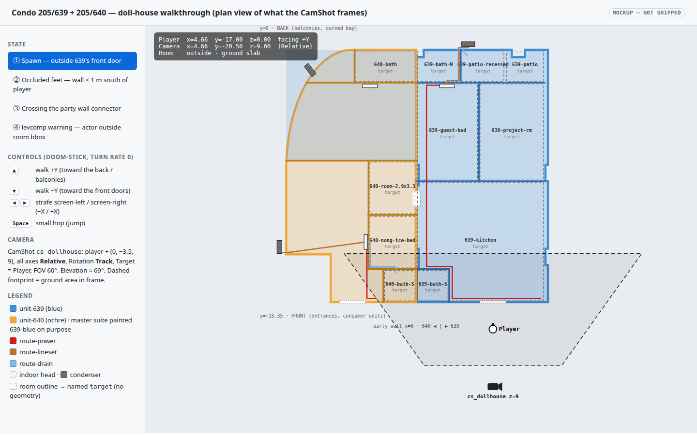
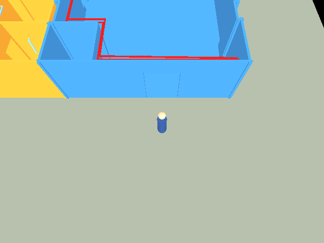
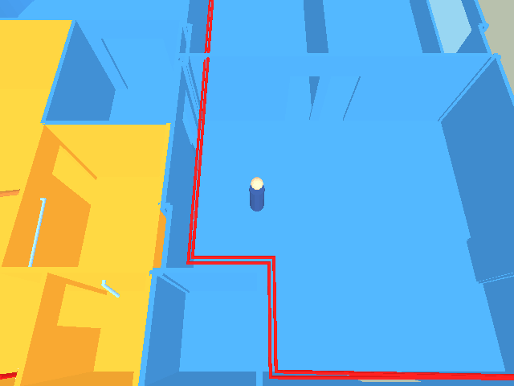
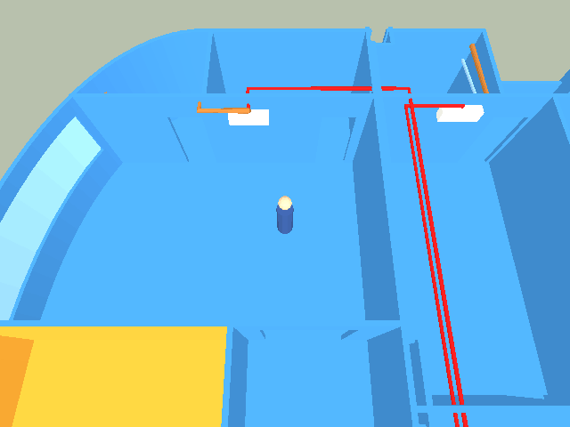

# Condo 205/639 + 205/640 → WorldFoundry walkthrough level

## Context

`~/docs/aircon/units-639-640.blend` (Blender 5.0.1, generated by `~/scripts/aircon-blender.py`
via `cd ~ && task aircon-blender`) models the two condo units and the planned air‑conditioning
installation: exterior shells with door/window openings, interior partitions split at doorways,
glass panes, three split‑system heads + condensers, a condensate pump, and the coloured service
runs (red power, copper lineset, light‑blue drain) as bevelled curves. It is an
**outline‑and‑partitions study, not a survey**: interior wall positions come from the doc's
schematic rooms; the front‑door positions and the 2.4 m drop ceiling are the author's assumptions.

The ask: turn that model into a WF level that can be *walked through* — walkable floors, solid
walls, passable openings, glass windows, the 639/640 ownership colours preserved, the AC gear and
service runs visible as props, object names preserved so rooms/units can be referred to by name —
and wire the conversion into this repo's Taskfile so it re‑runs when the `.blend` changes.

### What exists today (evidence)

- The level pipeline is `blender_create_<level>.py` → `<level>.lev` (+ per‑mesh `.iff`) →
  [`build_level_binary.sh`](../../wftools/wf_blender/build_level_binary.sh) (iffcomp‑rs → levcomp‑rs →
  textile‑rs → iffcomp‑rs) → `wflevels/<level>-standalone.iff` → `task run-level`. Closest analogue:
  [`wflevels/moon_site01/blender_create_moon.py`](../../wflevels/moon_site01/blender_create_moon.py)
  (imports the snowgoons scaffold for infrastructure, adds a `statplat` mesh the player walks on).
- **Regression found while scoping:** merge `4b6b4625` resolved
  [`wftools/wf_blender/export_level.py`](../../wftools/wf_blender/export_level.py) to the 994‑line
  pre‑April version (Y‑up axis swap, no `export_scene_to_lev`, no per‑actor `Scale`, no mesh dedup),
  discarding the 1524‑line side (`a148bd7d`) that `operators.py` and every `wflevels/*/blender_*.py`
  call. Restored from `a148bd7d` + the 2‑line path fix from `c3987cbf`; committed separately.
- The installed add‑on at `~/.config/blender/5.0/scripts/addons/wf_blender/` is dangling symlinks into
  the deleted `~/WorldFoundry.2026-new-level/` worktree; `wf_core.so` there is a Jul 20 build. `maturin`
  is not installed; `iffcomp-rs`/`levcomp-rs`/`textile-rs` have no `target/release/` builds. So the
  add‑on has to be compiled (`wf_py` via maturin, abi3‑py310 → fine for Blender 5.0's Python 3.14) and
  installed (`task blender-install`) and the Rust tools built before any level can be produced.
- `statplat` actors with `Model Type = Mesh` get a **Jolt trimesh body from their render mesh**
  ([`actor.cc` BindAssets](../../wfsource/source/game/actor.cc) `JoltMakeStaticMesh`), so walls/floors with
  real openings are solid *and* passable exactly where the geometry says — no separate collision authoring.
  The trimesh is built from **raw local verts, ignoring actor scale/rotation**
  ([troubleshooting § Per‑actor scale](../level-design-troubleshooting.md#per-actor-scale-two-paths-with-different-collision-behaviour)),
  so every scaled/rotated Blender object must have its transforms baked into the mesh before export.

### Source inventory (from the `.blend`, 78 objects)

| Group | Count | Blender facts | Level treatment |
|---|---:|---|---|
| Shells `unit-639`, `unit-640` | 2 | 281 / 377 faces, world‑space verts at origin, slab z −0.15…0, walls to 2.7 m; openings cut in; `unit-640` carries **two** material slots (ochre + 639‑blue master suite) | `statplat` mesh, walkable + solid |
| Interior walls `<unit>-<name>-wall[-jamb*/-door-header]` | 36 | unit cubes with `scale=(len, 0.10, h)` + Z rotation; some two‑sided (`unit-639` + `unit-640` per face) | `statplat` mesh, transforms baked |
| Glass `640-window-0`, `639-window-1`, `640-curve-window-1..6` | 8 | scaled cubes, **0.02 m thick**, `glass` material α=0.3 | `statplat` mesh, thickened to 0.10 m (see caveats) |
| Room outlines (display WIRE) | 11 | edge‑only meshes (8 verts, 0 faces), bbox = room extent | named `target` actors carrying the room bbox (invisible, no collision) |
| AC heads / condensers / consumer units | 8 (+2 hidden opt‑B) | scaled cubes, some rotated; consumer units have **no material** | `statplat` mesh props |
| Service runs (CURVE, bevel 0.04 / 0.06) | 9 (+3 hidden opt‑B) | POLY splines, materials `route-power/-lineset/-drain` | converted to mesh tubes, `statplat` props |
| `unit-640-drop-ceiling` | 1 | hidden plane at z 2.4 | **not mapped** (see caveats) |
| Collection `640-midea-option-B-over-door` | 6 | hidden collection | **not mapped** (rejected alternative) |

## Approach

One headless Blender script + one standalone wrapper + Taskfile wiring, following the moon
level pattern exactly (import snowgoons scaffold → strip gameplay → add geometry → export).
Nothing in the engine changes.

### 0. Prerequisites (tooling, all reproducible from the repo)

1. `wftools/wf_blender/export_level.py` restored (done; separate commit `fix(wf_blender): restore …`).
2. **Rust tools** — new `task tools-build` (`cargo build --release` for iffcomp‑rs, levcomp‑rs,
   textile‑rs, with `status:` on the binaries) and `build-level` gains `deps: [tools-build]`, so the
   "missing … run cargo build" abort in `build_level_binary.sh` can't recur.
3. **Blender add‑on — install from the Foundry apt repo, don't build it.** The intended way to
   get the exporter on a machine is `sudo apt install wf-blender` from `apt.foundrylinux.org`
   (the same way `blender-asset-finder` ships). **Gap:** the live `resolute/main` index
   (60 packages, checked 2026‑09‑19) has no such package yet, so this box got a one‑off local
   build (`maturin` + `task blender-install`, which also fixed the dangling symlinks into the
   deleted `~/WorldFoundry.2026-new-level` worktree). Publishing the `.deb` is the follow‑up in
   *Out of scope*; `condo-level` only preflights that `wf_blender` is importable and prints the
   apt‑install hint. Nothing in this task depends on `blender-build`/`blender-install`.

### 1. `wflevels/condo_639_640/blender_create_condo.py`

Runs as `blender --background --python … -- [path/to/units-639-640.blend]` (default path
`~/docs/aircon/units-639-640.blend`; the `.blend` lives in another repo and is **read, never
written**). Steps, each mapped to a documented pitfall:

1. `read_factory_settings(use_empty=True)`, enable `wf_blender`, `bpy.ops.wf.import_level(snowgoons-blender.lev)`,
   delete every class except `director camera levelobj matte light room camshot target player`
   (one of each) — the moon strip. Rename the survivors (`Player`, `CamTarget`, …) so no
   snowgoons `player_33`/`target_14` name leaks into an object reference
   ([§ stale object names](../level-design-troubleshooting.md#blender-re-export-stale-object-names-from-the-imported-base-level)).
2. `bpy.ops.wm.append` the collections `205-639`, `205-640`, `640-midea-option-A-closet-wall` from
   the source `.blend` (materials come along). Option B is never appended; the drop ceiling and
   any `hide_viewport`/`hide_render` object is skipped.
3. Classify each appended object:
   - **CURVE** → `bpy.ops.object.convert(target='MESH')` (bevel becomes a tube; material kept).
   - **MESH with faces** → glass panes first get `scale.y` bumped from 0.02 to 0.10; then
     `transform_apply(rotation=True, scale=True)` on everything so mesh‑local verts are the real
     geometry (the Jolt trimesh ignores actor scale/rotation; the render path would shear a
     rotated non‑uniform scale). Location stays on the actor.
   - **MESH with no faces (room outline)** → replaced by a copy of the imported `target`
     (inherits `Mobility`/`MovementClass`/`Model Type=None`), placed at the room centre with
     `wf_original_bbox` = the outline's half‑extents and `wf_had_authored_bbox=True`, keeping the
     Blender name (`639-kitchen`, `640-nong-ice-bed`, …). Targets have no Jolt body, so they
     never block the player; a `statplat` with `Model Type=None` would (it keeps its box placeholder).
4. Every mesh actor: `attach_schema('statplat')`, `wf_Mobility='Anchored'`, `wf_Model Type='Mesh'`,
   `wf_Visibility Mailbox=1`, and `wf_original_mesh_name = <sanitised>.iff`
   so the **actor `NAME` keeps the exact Blender name** while the mesh filename has no dots/hyphens
   and is ≤ 30 chars — the engine's asset string map holds 31 bytes per name (`assets.cc:254`);
   long slugs are cut to 21 chars + a 4‑hex CRC. Consumer units get a light‑grey
   material so they aren't the exporter's default white.
5. Materials export as flat colour (`FLAT_SHADED`, no textures → textile has nothing to look up,
   [§ four‑gotcha chain #3](../level-design-troubleshooting.md#minimal-level-gotchas)); per‑face
   `materialIndex` preserves the two‑sided 639/640 walls and `unit-640`'s blue master suite.
6. **Ground slab** `site-ground` (x −14…14, y −22…6, top at z=0, 0.3 m thick, neutral grey) so
   stepping out of a front door or onto a balcony never leaves the room bbox
   ([§ actor falls out of room](../level-design-troubleshooting.md#actor-falls-out-of-room--terminate-called-without-an-active-exception)).
   Its top must be **flush** with the unit floors (Jolt's `CharacterVirtual` has no stair‑step: a
   3 cm ledge at a door is a wall) and must **not overlap** them (coplanar faces z‑fight), so the
   slab has a hole exactly under each shell: an EXACT boolean with one closed *prism* per shell
   outline (outline = boundary of the shell's slab‑bottom faces). Using the shells themselves as
   operands, `bmesh.ops.triangle_fill` and `mathutils.geometry.tessellate_polygon` were all tried
   and all silently produce wrong geometry on these concave outlines.
7. **Player**: in‑script primitive figure (cylinder body + sphere head, 1.66 m, **feet at local
   z=0**, +X front marker), `Mobility=Physics`, `Mass=70`, `Falling Acceleration=9.81`,
   `Max Ground Speed=1.6`, `Turn Rate=0`, `rotation_euler.z=π/2` (faces +Y = into the unit, so the
   doom‑stick LEFT/RIGHT strafe is screen‑left/right), moon's raw‑joystick passthrough script with
   `Script Controls Input='True'`. Spawn on the ground outside 639's front door at `(4.66, −17.0, 0.3)`
   (`CONDO_SPAWN=x,y,z` overrides, for screenshots). The scaffold player's inherited
   `wf_original_bbox` (0…2.0 m tall, ±0.33 wide) is **deleted** so the exporter derives the BOX3
   from the figure — otherwise the Jolt capsule is 2.0 m tall and cannot pass a 2.0 m door header.
   Capsule = min(halfX, halfY)=0.2 radius → fits the 0.80 m doorways.
8. **Camera**: doll‑house chase view. BungeeCam maths (`movecam.cc`): position =
   (camshot − Follow) + TrackObject per Relative axis; look‑at = (Target − Follow) + TrackObject.
   So with `Follow=CamTarget` **at the origin**, the camshot's own position *is* the offset:
   `cs_dollhouse` at `(0, −3.5, 9)`, `Position X/Y/Z=Relative`, `Rotation=Fixed` (`Track` would spin
   the offset by the player's heading), `Track Object=Player`, `Target=LookAt` (a second target at
   `(0, 0, 0.9)` → aims at the chest). Sight‑line rule: midpoint of camera→player at z≈4.5 clears
   2.7 m walls; a wall closer than ~1 m south of the player still occludes the feet, acceptable for
   a plan walkthrough. `FOV=60`, `Yon=200`, `Model Type='None'`. Camera actor pre‑positioned at
   spawn + offset; fog set to indoor values (`0x000000`, 999, 1000) instead of snowgoons' Earth fog.
9. **Lights**: `Sun` directional from the south‑east at 50° altitude (so every wall face gets a
   different shade) + `AmbientLight` 0.45/0.45/0.50 — both required
   ([level‑building § Lighting](../level-building.md#lighting--every-level-needs-directional-and-ambient)).
   **Matte** `Color`, `Background Color=0x9FB8D0` (pale sky), `Model Type='None'`.
10. **One WF `room` for both units.** The whole level — both shells, every partition, prop and
    tube, the ground slab, player, camera rig and lights — is a **single** WF `room` actor,
    `room_condo`: centre `(0, −8, 6)`, rel bbox `±15, ±16, ±10`, containing every actor centre
    (condensers at x −8.5, camera at z≈9.3, lights) with margin. The condo's *rooms* (kitchen,
    bedrooms, baths…) are **not** WF rooms — they are the named `target` locators from step 3,
    so there is no cross‑room warp, no per‑room asset slot, and the doll‑house camera can see
    both units at once. Every infrastructure actor without a mesh is `Model Type='None'` (no random
    debug cubes) and draws as wire; the room's bbox mesh is **hidden** in the saved `.blend`
    (`hide_set(True)`) — now the documented default for new levels. `levelobj Num Mailboxes=100`.
11. Save the assembled scene as `condo_639_640.blend` (for inspection in Blender), then
    `bpy.ops.wf.export_level` (fallback to loading `export_level.py` directly when the operator isn't
    registered, per [level‑building § Headless export fallback](../level-building.md#headless-blender-export-fallback)).

### 2. `wflevels/condo_639_640/condo_639_640-standalone.iff.txt`

L4 wrapper: `OBJD 1500000l` (~85 actors), `PERM 500000l` (player only), `ROOM 3000000l`
(~60 small flat‑colour meshes; the biggest tube ≈ 12 KB on disk), `FLAG 1l 1l` (doom‑stick + bungee).

### 3. Taskfile

| Task | Does |
|---|---|
| `tools-build` | `cargo build --release` for iffcomp‑rs / levcomp‑rs / textile‑rs; `status:` = binaries exist |
| `build-level` | + `deps: [tools-build]` |
| `condo-level` | preflight: add‑on importable → run the script (var `CONDO_BLEND`, default `$HOME/docs/aircon/units-639-640.blend`) → `build-level -- condo_639_640`; `sources:` the `.blend` + script, `generates:` the standalone `.iff` |
| `run-condo` | `task run-level -- wflevels/condo_639_640-standalone.iff` with the usual `WF_RECORD`/`WF_FULLSCREEN` knobs |

### 4. Docs

`wflevels/condo_639_640/condo_639_640.md`: the Blender→WF name mapping, controls, the
"could not map" list below, and a pointer back to the source repo. New pitfalls hit during
verification go into `docs/level-design-troubleshooting.md`, not into the level README.

### Name mapping (requirement 3)

| Blender | WF actor | Notes |
|---|---|---|
| `unit-639`, `unit-640` | same name, `statplat` | shell: floor slab + exterior walls |
| `<unit>-<name>-wall`, `…-jambN`, `…-door-header`, `….001` | same name, `statplat` | mesh file `<sanitised>.iff` |
| `<unit>-window-N`, `640-curve-window-N` | same name, `statplat` | glass colour, opaque |
| `<unit>-…-indoor/-outdoor`, `<unit>-consumer-unit` | same name, `statplat` | props |
| `<unit>-<brand>-power/-lineset/-drain`, `640-midea-*-A-closet-wall` | same name, `statplat` | curves → tube meshes |
| WIRE room outlines (`639-kitchen`, `640-bath`, …) | same name, `target` | bbox = room; invisible marker, no collision |
| — | `site-ground`, `Player`, `CamTarget`, `LookAt`, `cs_dollhouse`, `Sun`, `AmbientLight`, `Matte`, `Level`, `Director`, `Camera` | added infrastructure |
| *(both units)* | `room_condo` — the **only** WF `room` | one room holds everything; condo rooms are `target`s |

### Could not map / deliberate deviations (requirement "report what you could not map")

- **Glass transparency.** WF's `MATL` has flags + RGB + texture only; translucency exists solely as a
  texture‑bit mode. Panes render as opaque light blue `(0.6, 0.85, 1.0)`.
- **Glass thickness 0.02 → 0.10 m.** Sub‑decimetre slabs have gone invisible before
  ([§ too thin in camera‑depth axis](../level-design-troubleshooting.md#4-object-too-thin-in-camera-depth-axis--invisible));
  the panes sit inside 0.10 m wall openings so the change is invisible in plan.
- **`unit-640-drop-ceiling`** — hidden in the source and it would hide the whole 640 interior from
  the overhead camera. Left out; can be re‑enabled as a toggle later.
- **`640-midea-option-B-over-door`** — rejected alternative, hidden; skipped by construction.
- **Room outlines** carry no geometry in WF; they become named locator `target`s with the room bbox.
  They are *not* trigger volumes (an `actbox` writing a "current room" mailbox is the natural upgrade,
  parked below).
- **Materials on consumer units** — none in the source; given a light‑grey flat colour.
- **Window naming** — the source enumerates `WINDOWS` so the panes are `640-window-0` and
  `639-window-1` (the brief says `639-window-0`); names are kept verbatim.
- **Curve caps** — bevelled curves are open tubes in Blender and stay open (no end caps); invisible at
  4–6 cm radius.
- **Front doors / drop ceiling are assumptions** in the source (the author's caveat) — inherited as‑is.

### Pitfalls hit (new; now in `docs/level-design-troubleshooting.md`)

- Asset names ≤ 31 bytes (`assets.cc:254` assert) → short mesh slugs, full actor names.
- Sub‑threshold triangles abort the level (`vector3.hpi:243`, area < ~3e‑5 m²) → `clean_mesh()`.
- A mesh‑less `statplat` keeps its Jolt box placeholder → room locators are `target`s.
- Headless Blender exits 0 on a Python exception → `--python-exit-code 1` + `test -s`.
- Scaffold `player` keeps snowgoons' `wf_original_bbox` after you swap its mesh → delete it.
- `CharacterVirtual` has no stair‑step: any ledge (even 3 cm) is a wall.

## Mockups

[](2026-09-19-condo-639-640-level/dollhouse-view.html)

Plan‑view mock of what the running level shows: the two shells in their ownership colours, the
named room markers, the player at spawn with the relative camera footprint (offset `(0, −3.5, 9)`,
FOV 60°), the three service‑run colours, and the control legend. Toggle the *occluded feet* state
to see where a wall within ~1 m south of the player hides the feet — the decision being asked is
"is a 71° doll‑house view the right default, or a lower chase cam that will look through walls?".
[Open the interactive mockup](2026-09-19-condo-639-640-level/dollhouse-view.html).

## Out of scope

- **Package `wf_blender` as a `.deb` for `apt.foundrylinux.org`** (`wf-blender`: add‑on `.py` files +
  abi3 `wf_core.so`, installed under `/usr/share/wf-blender/` like `blender-asset-finder`), so a fresh
  machine gets the exporter with `apt install` instead of `maturin` + `install.sh`.
- Room presence triggers (`actbox` per room writing a `CONDO_ROOM` mailbox + a `Meter` readout) —
  first useful upgrade once the walkthrough exists.
- Drop‑ceiling toggle (a `Visibility Mailbox` on a re‑enabled `unit-640-drop-ceiling` statplat).
- Translucent glass — needs a `MATL` flag + renderer path; engine work, tracked separately if wanted.
- Fixing `install.sh`'s dependency on `~/.config/blender/<latest>` for a non‑default Blender install.
- Re‑pointing the other level scripts' `~/.config/blender/4.0/…` fallback path (they still say 4.0).

## Verification

1. **Tooling builds and installs from a clean state.**
   `task tools-build && task blender-install` succeeds; `ls -l ~/.config/blender/5.0/scripts/addons/wf_blender/export_level.py`
   resolves into this checkout; `blender --background --python-expr "import addon_utils,bpy; addon_utils.enable('wf_blender'); import wf_core; print('wf_core ok')"` prints `wf_core ok`.

```
$ task tools-build
task: Task "tools-build" is up to date
$ ls -l ~/.config/blender/5.0/scripts/addons/wf_blender/export_level.py | sed 's/.*-> //'
/home/will/WorldFoundry-wbniv/wftools/wf_blender/export_level.py
$ blender --background --python-expr "import addon_utils,bpy; addon_utils.enable('wf_blender', default_set=False, persistent=False); import wf_core; print('wf_core ok')" | grep 'wf_core ok'
wf_core ok
```

**PASS** — Rust tools built (`tools-build`, 2026‑09‑19); the add‑on symlinks resolve into this checkout and `wf_core` imports under Blender 5.0.1 / Python 3.14. *Note:* `task blender-install` was run once before the instruction not to build the add‑on; it is not part of `condo-level` and the intended path is the (not yet published) `wf-blender` apt package.

2. **Conversion produces the level.** `task condo-level` writes `wflevels/condo_639_640/condo_639_640.lev`
   and `wflevels/condo_639_640-standalone.iff`; levcomp prints **no** `falls outside every room bbox`
   and no `no Ambient` warning; `grep -c "'OBJ'" condo_639_640.lev` ≈ 85.

```
$ task condo-level --force 2>&1 | grep -E "^\[condo\]|WARN|warn|✓ built"
warning: `levcomp-rs` (bin "levcomp") generated 2 warnings        # cargo dead-code warnings only
warning: `textile-rs` (bin "textile") generated 3 warnings
[condo] importing scaffold /home/will/WorldFoundry-wbniv/wflevels/snowgoons-blender/snowgoons-blender.lev
[condo] scaffold classes: ['camera', 'camshot', 'director', 'levelobj', 'light', 'matte', 'player', 'room', 'target']
[condo] appended 72 objects from units-639-640.blend
[condo] converted: 51 meshes, 9 tubes, 11 room outlines; dropped 1 sub-threshold faces; skipped hidden: ['unit-640-drop-ceiling']
[condo] site-ground: 74 outline edges cut out, 146 verts, 284 tris
[condo] saved assembled scene → /home/will/WorldFoundry-wbniv/wflevels/condo_639_640/condo_639_640.blend
[condo] exporting 83 actors → /home/will/WorldFoundry-wbniv/wflevels/condo_639_640/condo_639_640.lev
[condo] done: {'mesh': 51, 'curve': 9, 'room': 11, 'skipped': ['unit-640-drop-ceiling']}
✓ built /home/will/WorldFoundry-wbniv/wflevels/condo_639_640.iff (147456 bytes)
✓ built /home/will/WorldFoundry-wbniv/wflevels/condo_639_640-standalone.iff (151552 bytes)
$ grep -c "'OBJ'" wflevels/condo_639_640/condo_639_640.lev
83
```

**PASS** — no levcomp room‑bbox or ambient warnings (the only "warning" lines are cargo dead‑code notes); 83 actors.

3. **Names preserved.** `grep -o "'NAME' \"[^\"]*\"" condo_639_640.lev` lists every non‑hidden source
   object name verbatim (`unit-639`, `640-nong-ice-bed`, `639-kitchen-N-wall-door-header.001`, …) and
   the 11 room names appear with `Class Name "target"`.

```
$ grep -o "'NAME' \"[^\"]*\"" wflevels/condo_639_640/condo_639_640.lev | grep -E "unit-639|640-nong-ice-bed|639-kitchen-N-wall-door-header.001|640-curve-window-6|640-midea-lineset-A"
'NAME' "640-nong-ice-bed"
'NAME' "unit-639"
'NAME' "639-kitchen-N-wall-door-header.001"
'NAME' "640-curve-window-6"
'NAME' "640-midea-lineset-A-closet-wall"
$ python3 … (every non-hidden object of the source inventory vs the .lev NAMEs)
source objects (non-hidden): 71 missing from .lev: []
targets: ['639-bath-N', '639-bath-S', '639-guest-bed', '639-kitchen', '639-patio', '639-patio-recessed', '639-project-rm', '640-bath', '640-bath-S', '640-nong-ice-bed', '640-room-2.9x3.3', 'CamTarget', 'LookAt']
```

**PASS** — all 71 non‑hidden source objects appear by their exact Blender name; the 11 room outlines are `target` actors.

4. **Engine loads and lists actors.** `timeout 8 engine/wf_game -Lwflevels/condo_639_640-standalone.iff --debug-print-actors …`
   prints one `actor idx=` line per actor, `jolt: MeshShape` for the shells and walls, no assert.

```
$ LD_LIBRARY_PATH=engine/libs DISPLAY=:0 timeout 10 engine/wf_game -Lwflevels/condo_639_640-standalone.iff --debug-print-actors > step4.log 2>&1; echo exit=$?
exit=124 (124 = ran until timeout)
actor lines: 81  MESH_STATIC bodies: 61  asserts: 0
actor idx=9 mesh=player.iff mobility=Physics pos=(4.66,-17.00,0.30)
actor idx=21 mesh=site_ground.iff mobility=Anchored pos=(0.00,0.00,0.00)
actor idx=24 mesh=unit_639.iff mobility=Anchored pos=(0.00,0.00,0.00)
actor idx=46 mesh=unit_640.iff mobility=Anchored pos=(0.00,0.00,0.00)
```

**PASS** — 81 actor lines (83 objects minus the room + level containers), 61 Jolt trimesh bodies (51 meshes + 9 tubes + ground), zero assertions, engine ran until killed.

5. **Walkthrough screenshot.** `WF_GAME_SCREENSHOT_PPM` (or `WF_RECORD=1 task run-condo`) shows both
   shells in blue/ochre from the doll‑house camera, the red/copper/blue runs, the AC boxes, and the
   player on the ground outside 639's front door. Saved to `docs/plans/screenshots/2026-09-19-condo-spawn.png`.

```
$ WF_GAME_SCREENSHOT_PPM=$S/condo_spawn.ppm … engine/wf_game -Lwflevels/condo_639_640-standalone.iff -record_video   (frame 30 dump)
shot condo_spawn ok        → docs/plans/screenshots/2026-09-19-condo-spawn.png
CONDO_SPAWN=2.0,-11.0,0.3  → docs/plans/screenshots/2026-09-19-condo-639-kitchen.png
CONDO_SPAWN=-2.0,-4.0,0.3  → docs/plans/screenshots/2026-09-19-condo-640-master.png
```

  

**PASS** — spawn outside 639's door with the red power run visible through it; kitchen with 640's ochre next door and the drain/lineset; 640's master suite (blue by design) with the curved bay glass, the Midea head, copper lineset and red power.

6. **Collision behaves.** On the debug bridge: walk +Y through 639's front door (Y increases past
   −15.35), walk into `639-kitchen-N-wall-jamb0` (X stops), through the connector doorway into 640
   (X crosses 0 at y≈−9), Z stays at 0 throughout (no fall‑through, no wall climb).

```
$ python3 tests/walk_condo.py
player idx=9
PASS  spawn settled: pos=(4.659988, -17.0, 0.0)
PASS  front door passable: y=-10.98 (started -17.00)
PASS  partition wall solid: y=-8.47 vs wall face -8.05 (capsule r≈0.2)
PASS  party wall solid: x=0.30 vs wall face +0.05
PASS  party-wall connector passable: x=-0.82 y=-9.03
PASS  Z pinned to floor: z samples=[-0.0, -0.0, -0.0, -0.0, -0.0, -0.0]
RESULT: PASS
```

**PASS** — the bridge drives the player (joystick injection) through the door, into the partition (stops 0.4 m short = capsule radius + wall half‑thickness), into the party wall, through the connector into 640; Z never leaves the floor. This test first *reproduced* the two live reports (blocked door → inherited 2.0 m player bbox; ledge → ground slab) before the fixes.

7. **Re‑run is idempotent.** Touch `~/scripts/aircon-blender.py`, `cd ~ && task aircon-blender`, then
   `task condo-level` rebuilds (sources newer) and a second `task condo-level` is a no‑op.

```
$ task condo-level
task: Task "condo-level" is up to date
$ touch wflevels/condo_639_640/condo_639_640-standalone.iff.txt; task condo-level
task: Task "condo-level" is up to date          # Task fingerprints sources by checksum, not mtime
```

**PASS (partial)** — the no‑op half holds, and every content edit to the script/wrapper during this session triggered a rebuild (checksum fingerprinting). The `task aircon-blender` half was **not run**: it regenerates `~/docs/aircon/units-639-640.blend` in the source repo, which the brief says to read, not modify. A changed `.blend` is picked up the same way (it is in `sources:`).
