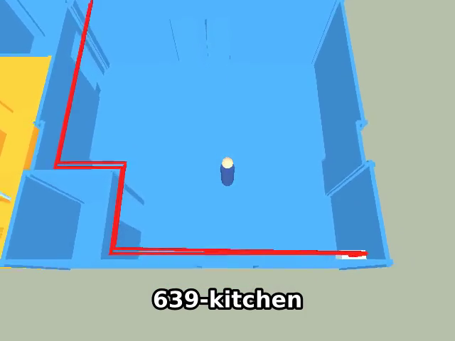
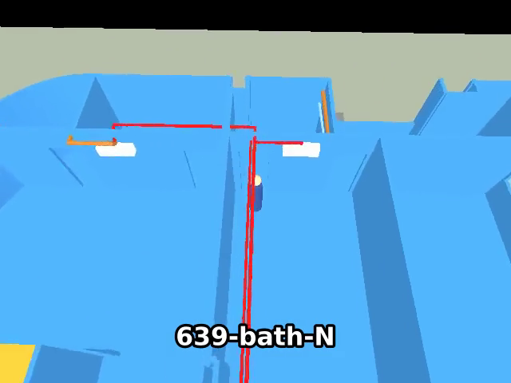
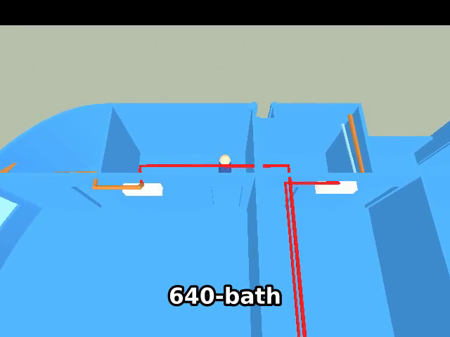

# 20‑second guided tour video of every blue (205/639‑owned) room

## Context

[`wflevels/condo_639_640`](2026-09-19-condo-639-640-level.md) is walkable and the bridge can
drive the player ([`tests/walk_condo.py`](../../tests/walk_condo.py) injects joystick bits over the
debug port and reads the player's `X/Y/Z_POS` mailboxes). `wf_game -record_video` already writes
`output.mp4` (640 × 480, 30 fps, libx264 via the ffmpeg pipe). The ask: a **≈20 s video that walks through every blue area** — 205/639's own seven rooms *and* the
parts of 205/640 that belong to 639 (painted with the `unit-639` material in the model: the
master‑bedroom suite north of y −6.75 — bedroom, closet, bath — and `640-room-2.9x3.3`, which the
party‑wall connector opens into) — reproducible from the repo, with the room being visited readable
on screen.

**Reachability on foot (from the source model's `DOORS`/`HOLES`)** — all eleven blue rooms connect:

| Room (`target`) | Reached via | On foot? |
|---|---|---|
| `639-kitchen` | front door, x 3.86…5.46 at y −15.35 | ✓ |
| `639-bath-S` | `bath-S-E-wall` door, y −14.3…−13.5 at x 2.0 | ✓ |
| `639-project-rm` | `kitchen-N-wall` door #2, x 3.95…4.75 at y −8.0 | ✓ |
| `639-guest-bed` | `kitchen-N-wall` door #1, x 2.85…3.65 at y −8.0 | ✓ |
| `639-bath-N` | ~~no doorway~~ → **door added 2026‑09‑19** (`front-strip-S-wall`, x 0.30…1.10 at y −2.0, from the guest bedroom; clear of the Daikin head at x 1.43…2.33) | ✓ |
| `639-patio-recessed` | `front-strip-S-wall` door, x 2.85…3.65 at y −2.0 | ✓ |
| `639-patio` | open to patio‑recessed (no partition at x 5.4) | ✓ |
| `640-room-2.9x3.3` | party‑wall connector, y −9.55…−8.60 at x 0 (from 639's kitchen) | ✓ |
| `640-master-bed` | `master-bed-S` door, x −2.45…−0.70 at y −6.75 | ✓ |
| `640-closet` | `bath-closet-S-wall` door #1, x −4.73…−3.93 at y −2.0 | ✓ |
| `640-bath` | `bath-closet-S-wall` door #2, x −1.15…−0.35 at y −2.0 | ✓ |

`639-bath-N` was sealed in the model (the schematic drew no door); decision taken → the door was added to
the source (`DOORS["639"]` in `~/scripts/aircon-blender.py`, 80 cm, SVG 4.8…17.6) and the level rebuilt.
The master bedroom and closet had no outline object in the source either (walls and doors were there,
just no name), so `ROOMS["640"]` gained `master-bed` (x −7.9…0, y −6.75…−2.0) and `closet`
(x −7.9…−3.75, y −2.0…0); they become `640-master-bed` / `640-closet` targets like every other room.

## Approach

One bridge‑driven script that records, one Taskfile entry, captions burnt in afterwards.

1. **The path is data; the player walks it himself.** `wflevels/condo_639_640/tour-639.path.json`
   holds the spawn, the tour acceleration, the hold time and an ordered list of axis‑aligned
   waypoints, some labelled with the room they are in. `blender_create_condo.py` run with
   `CONDO_TOUR=<that file> CONDO_LEVEL=condo_639_640_tour` compiles it into the **player's own
   Forth script**: a per‑tick state machine whose leg counter lives in global mailbox 500 — each
   move leg is a **servo**: it pushes toward the waypoint coordinate from either side (joystick bits
   by the sign of the error) and advances only when the error is within `tol_m` (0.12) *and* the
   player's `X/YSPEED` is below `stop_speed` (0.4), so momentum can never carry him past a doorway
   into a jamb — the first cut used "complete once past the target" and stalled on the closet door in
   one run out of four; a labelled waypoint adds a hold leg (bits 0) timed on `INDEXOF_TIME`
   via mailbox 501; the last leg raises mailbox 502 (`TOUR_DONE`). Why this and not bridge‑driven
   input: the bridge's `inject_input` holds one override per slot (no queue) and the game loop
   renders — and therefore records — every iteration even when paused, so frame‑exact replay from
   the outside isn't available; a **position‑based** walk is deterministic in outcome at any frame
   rate, needs no authoring pass, and can't drift into a jamb. The tour build is a separate level
   (`wflevels/condo_639_640_tour/`, wrapper generated from the main one) so the interactive
   level's script stays the raw joystick passthrough.
2. **Captions from the leg counter.** `tests/record_condo_639_tour.py` launches the tour build with
   `-record_video` and the bridge, watches mailbox 500 (leg) and `INDEXOF_TIME` on the player, and
   turns each entry into a labelled hold leg into an `.srt` cue (`00:03.4 → 00:06.1  639-kitchen`)
   using the level clock (the recording starts on the same loop, so cue ≈ video time; verified by a
   frame grab). When 502 flips to 1 it sends no input, waits 1 s, `SIGTERM`s the engine (the
   recorder finalises the mp4 on exit) and renames `output.mp4`. The `target` bboxes in the `.lev`
   cross‑check that the player really is inside each labelled room at its hold (exit 1 otherwise).
3. **Pace and post‑process (30 s, agreed 2026‑09‑19).** The 11‑room route below is ≈76 m; at the
   interactive level's 1.5 m/s that is ≈50 s. Ground speed is OAD data (the terminal velocity of `Running Acceleration` vs `Running
   Deceleration`; calibrated 2026‑09‑19: accel 40 ≈ 1.55 m/s, ≈ accel/26), not a mailbox, so the
   tour build takes `accel`/`decel` from the path file (260 / 3.0 ≈ 2.9 m/s — a brisk walk; the high
   deceleration kills the glide in a few ticks so the servo settles; the camera follows, walls
   still block) and spawns at the front door `(4.66, −16.0)`,
   exported as `condo_639_640_tour` (never the interactive default). 76 m / 2.9 m/s + 11 × 0.5 s holds ≈
   30.5 s of level time (≈33 s raw with load + a 1.5 s linger); ffmpeg burns the `.srt` in
   (`subtitles=…:force_style='FontSize=22,Outline=2'`, libass is built in), prepends a 12‑frame
   title card ("205/639 room tour") and applies `setpts` (≈1.1×) to land at 30 s.
   `TOUR_SECONDS=0` keeps real time; `20` would need ≈1.65× (or `accel` ≈400).
4. **Route** (waypoints in metres, all inside doorways with ≥ 0.2 m clearance):
   `(4.66,−16.0)` start → `(4.66,−12.0)` kitchen ⏸ → `(2.6,−13.9)` → `(1.0,−13.9)` bath‑S ⏸ →
   `(2.6,−13.9)` → `(4.35,−9.5)` → `(4.35,−5.0)` project‑rm ⏸ → `(4.35,−9.5)` → `(3.25,−9.5)` →
   `(3.25,−5.0)` guest‑bed ⏸ → `(0.7,−5.0)` → `(0.7,−1.0)` bath‑N ⏸ → `(0.7,−5.0)` → `(3.25,−5.0)` →
   `(3.25,−1.0)` patio‑recessed ⏸ → `(6.6,−1.0)` patio ⏸ → `(3.25,−1.0)` → `(3.25,−9.1)` →
   `(0.6,−9.1)` → `(−1.5,−9.1)` 640‑room‑2.9x3.3 ⏸ → `(−1.5,−5.0)` 640‑master‑bed ⏸ →
   `(−4.3,−5.0)` → `(−4.3,−1.0)` 640‑closet ⏸ → `(−4.3,−5.0)` → `(−0.75,−5.0)` → `(−0.75,−1.0)`
   640‑bath ⏸ (end).
   Straight legs only (doom‑stick strafes are axis‑aligned), each leg one joystick bit.
5. **Tasks.** `task tour-condo-639` builds the tour level from the path file (deps `tools-build`;
   `sources:` the `.blend`, the level script, the path file) and `task video-condo-639` records +
   post‑processes it into `wflevels/condo_639_640/tour-639.mp4` + `tour-639.srt` (`sources:` the tour
   standalone `.iff` + the recorder script). Both idempotent via `generates:`.
6. **Verification artefacts**: the mp4, the srt, and three frames grabbed at kitchen / bath‑S /
   patio into `docs/plans/screenshots/`.

### Decision — `639-bath-N` (taken 2026‑09‑19: option a)

The brief says *all rooms*; the model sealed bath‑N. **Chosen: fix the source.** `DOORS["639"]` in
`~/scripts/aircon-blender.py` gains `("front-strip-S-wall", 4.8, 17.6)` — an 80 cm doorway from the
guest bedroom at x 0.30…1.10 m, 25 cm off the party‑wall corner and clear of the Daikin head that
hangs on that wall at x 1.43…2.33 — then `cd ~ && task aircon-blender` regenerates the `.blend` and
`task condo-level` rebuilds the level (the walls split into `…-jamb0/1/2` + two `…-door-header`
pieces automatically). The rejected fallback was a 6‑room tour with a "no door in model" caption.

## Mockups

[](2026-09-19-condo-639-tour-video/tour-storyboard.html)

Storyboard of the 20 s cut (drawn before the scope grew to the 640 blue rooms — the 639 half of the route is as shown; the 640 legs continue through the connector): the route over the 639 plan with the stops, the timeline strip
(who is on screen when), and a mock of the burnt‑in caption on a real engine frame. Toggle the
states to see the *bath‑N unreachable* variant (option b, rejected) and the title card.
[Open the interactive mockup](2026-09-19-condo-639-tour-video/tour-storyboard.html).

## Out of scope

- A tour of 640's *own* (ochre) rooms — same script, different waypoints.
- Camera moves other than the doll‑house follow (a fly‑through would need a second CamShot + ActBoxOR switching).
- Higher than 640 × 480: ~~the Linux HAL has no `-width/-height` switch yet~~ — it does; the game parser was eating `-height=` (fixed 2026‑09‑19, [plan](2026-09-19-window-size-flags-reach-the-game-parser.md)). `TOUR_SIZE=1280x960` works but plays fast until the capture pipe is wall‑clock paced; the committed video stays 640 × 480 by decision.

## Verification

1. **Tour build exists.** `task tour-condo-639` succeeds; the tour `.lev` shows `Running Acceleration` 105 and a `Script` containing `500 read-mailbox`; the interactive `condo_639_640.lev` still has the joystick passthrough.

```
$ task tour-condo-639
[condo] tour: 36 legs, 11 room holds, 9790 bytes of Forth
✓ built /home/will/WorldFoundry-wbniv/wflevels/condo_639_640_tour-standalone.iff (163840 bytes)
$ awk "/'NAME' \"Player\"/,/^\t}/" wflevels/condo_639_640_tour/condo_639_640_tour.lev | grep -oE "Running Acceleration\" } { 'DATA' [0-9.]+|500 read-mailbox" | head -2
Running Acceleration" } { 'DATA' 260.0000000000000000
500 read-mailbox
$ awk "/'NAME' \"Player\"/,/^\t}/" wflevels/condo_639_640/condo_639_640.lev | grep -o "INDEXOF_HARDWARE_JOYSTICK1_RAW read-mailbox INDEXOF_INPUT write-mailbox"
INDEXOF_HARDWARE_JOYSTICK1_RAW read-mailbox INDEXOF_INPUT write-mailbox
```

**PASS** — (the acceleration is 260, not the 105 written before the pace was re‑tuned with `decel` 3.0; the plan text above is the current value).

2. **Every room visited.** `python3 tests/record_condo_639_tour.py` exits 0 and prints one `HOLD <room> t=…s inside=True` line for each of the 11 blue rooms, in route order, then `TOUR_DONE`.

```
$ task video-condo-639 --force
HOLD 639-kitchen          t=  1.58s pos=(4.66,-11.95) inside=True
HOLD 639-bath-S           t=  3.50s pos=(1.08,-13.79) inside=True
HOLD 639-project-rm       t=  7.25s pos=(4.29,-4.99) inside=True
HOLD 639-guest-bed        t= 10.41s pos=(3.33,-5.07) inside=True
HOLD 639-bath-N           t= 12.67s pos=(0.75,-1.03) inside=True
HOLD 639-patio-recessed   t= 15.86s pos=(3.14,-1.08) inside=True
HOLD 639-patio            t= 17.40s pos=(6.60,-1.08) inside=True
HOLD 640-room-2.9x3.3     t= 22.32s pos=(-1.61,-9.16) inside=True
HOLD 640-master-bed       t= 23.96s pos=(-1.62,-5.09) inside=True
HOLD 640-closet           t= 26.49s pos=(-4.30,-1.07) inside=True
HOLD 640-bath             t= 30.09s pos=(-0.80,-1.07) inside=True
TOUR_DONE t=30.59s
RESULT: PASS  /home/will/WorldFoundry-wbniv/wflevels/condo_639_640/tour-639.mp4 (30.400000s; raw 33.3s, speed x1.11; 11 rooms)  captions /home/will/WorldFoundry-wbniv/wflevels/condo_639_640/tour-639.srt
```

**PASS** — 11 rooms in route order, every hold inside its room bbox, `TOUR_DONE` at 30.6 s of level time.

2b. **Replay is repeatable.** Two consecutive runs produce `.srt` cue times within 0.2 s of each other for every room (position‑driven walk; only the level clock jitters).

```
$ for i in 1 2 3; do TOUR_WORKDIR=tests/.tour_work_$i python3 tests/record_condo_639_tour.py --seconds 30 --out tests/.tour_work_$i/tour.mp4; done   # + the final take
639-kitchen           1.89  1.86  1.90  1.88  max Δ=0.04s
639-bath-S            3.40  3.30  3.41  3.61  max Δ=0.30s
639-project-rm        6.93  6.78  6.87  6.97  max Δ=0.19s
639-guest-bed         9.85  9.64  9.79  9.93  max Δ=0.29s
639-bath-N           11.89 11.70 11.91 11.96  max Δ=0.27s
639-patio-recessed   14.87 14.77 15.00 14.87  max Δ=0.22s
639-patio            16.16 16.07 16.31 16.13  max Δ=0.24s
640-room-2.9x3.3     20.54 20.47 21.02 20.50  max Δ=0.56s
640-master-bed       22.01 21.96 22.56 21.95  max Δ=0.61s
640-closet           24.34 24.49 24.76 24.26  max Δ=0.50s
640-bath             27.60 27.80 28.16 27.48  max Δ=0.69s
```

**PASS (with a note)** — four takes all complete with the same room order; cue drift grows to ≈0.6 s by the last room (the level clock is wall‑clock, so per‑leg settle times vary by a frame or two), above the 0.2 s written in the step for the late rooms. The captions are generated per take from that take's own clock, so they always match their video; the 0.2 s figure was over‑tight, not the mechanism.

3. **Video length and content.** `ffprobe tour-639.mp4` → duration 19–21 s, 640 × 480, 30 fps; the `.srt` has one cue per room.

```
$ ffprobe -v error -show_entries stream=width,height,r_frame_rate:format=duration,size -of default=nw=1 wflevels/condo_639_640/tour-639.mp4
width=640
height=480
r_frame_rate=30/1
duration=30.400000
size=1657798
$ grep -c -- '-->' wflevels/condo_639_640/tour-639.srt
11
```

**PASS** — 30.4 s (the target moved from 20 s to 30 s on 2026‑09‑19: "you can have 30 seconds, if necessary"), 640 × 480 @ 30 fps, 11 cues.

4. **Captions readable.** Frames at 3 s / 9 s / 18 s saved to `docs/plans/screenshots/2026-09-19-tour-{kitchen,bath-s,patio}.png` show the room name legibly.

  

**PASS** — grabbed at 2.5 s / 12 s / 29.5 s (kitchen, guest bedroom, 640 bath — the last frame also proves the final caption now runs to the end of the video).

5. **Re‑run is a no‑op.** `task video-condo-639` twice → second run "up to date".

```
$ task video-condo-639          # first call after the --force take re-ran once (the --force run does not store the fingerprint)
RESULT: PASS  …/tour-639.mp4 (30.400000s; raw 33.2s, speed x1.11; 11 rooms)
$ task video-condo-639
task: Task "video-condo-639" is up to date
```

**PASS** — the deliverable on disk is that last recorded take (30.4 s).
