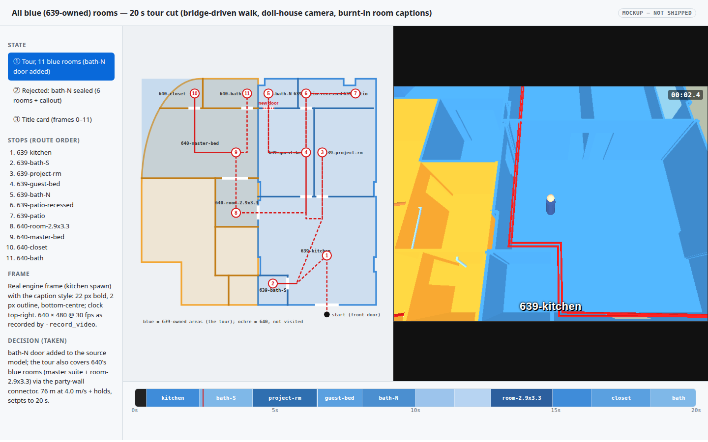

# 20‑second guided tour video of every blue (205/639‑owned) room

## Context

[`wflevels/condo_639_640`](2026-09-19-condo-639-640-level.md) is walkable and the bridge can
drive the player ([`tests/walk_condo.py`](../../tests/walk_condo.py) injects joystick bits over the
debug port and reads the player's `X/Y/Z_POS` mailboxes). `wf_game -record_video` already writes
`output.mp4` (640 × 480, 30 fps, libx264 via the ffmpeg pipe). The ask: a **≈20 s video that walks through every blue area** — 205/639's own seven rooms *and* the
parts of 205/640 that belong to 639 (painted with the `unit-639` material in the model: the
master‑bedroom suite north of y −6.75 — bedroom, closet, bath — and `640-room-2.9x3.3`, which the
party‑wall connector opens into) — reproducible from the repo, with the room being visited readable
on screen.

**Reachability on foot (from the source model's `DOORS`/`HOLES`)** — all eleven blue rooms connect:

| Room (`target`) | Reached via | On foot? |
|---|---|---|
| `639-kitchen` | front door, x 3.86…5.46 at y −15.35 | ✓ |
| `639-bath-S` | `bath-S-E-wall` door, y −14.3…−13.5 at x 2.0 | ✓ |
| `639-project-rm` | `kitchen-N-wall` door #2, x 3.95…4.75 at y −8.0 | ✓ |
| `639-guest-bed` | `kitchen-N-wall` door #1, x 2.85…3.65 at y −8.0 | ✓ |
| `639-bath-N` | ~~no doorway~~ → **door added 2026‑09‑19** (`front-strip-S-wall`, x 0.30…1.10 at y −2.0, from the guest bedroom; clear of the Daikin head at x 1.43…2.33) | ✓ |
| `639-patio-recessed` | `front-strip-S-wall` door, x 2.85…3.65 at y −2.0 | ✓ |
| `639-patio` | open to patio‑recessed (no partition at x 5.4) | ✓ |
| `640-room-2.9x3.3` | party‑wall connector, y −9.55…−8.60 at x 0 (from 639's kitchen) | ✓ |
| `640-master-bed` | `master-bed-S` door, x −2.45…−0.70 at y −6.75 | ✓ |
| `640-closet` | `bath-closet-S-wall` door #1, x −4.73…−3.93 at y −2.0 | ✓ |
| `640-bath` | `bath-closet-S-wall` door #2, x −1.15…−0.35 at y −2.0 | ✓ |

`639-bath-N` was sealed in the model (the schematic drew no door); decision taken → the door was added to
the source (`DOORS["639"]` in `~/scripts/aircon-blender.py`, 80 cm, SVG 4.8…17.6) and the level rebuilt.
The master bedroom and closet had no outline object in the source either (walls and doors were there,
just no name), so `ROOMS["640"]` gained `master-bed` (x −7.9…0, y −6.75…−2.0) and `closet`
(x −7.9…−3.75, y −2.0…0); they become `640-master-bed` / `640-closet` targets like every other room.

## Approach

One bridge‑driven script that records, one Taskfile entry, captions burnt in afterwards.

1. **`tests/record_condo_639_tour.py`** — launches `wf_game -L… -record_video --debug-port …`
   (recording starts at frame 0), waits for the player idx, then walks a fixed **waypoint list**
   with `inject_input(joystick1_raw, bits, −1)` per leg, releasing when the watched `X/Y_POS` is
   within 0.15 m of the waypoint (same primitives as `walk_condo.py`). Each room gets a ~1 s hold
   so the caption is readable. On the last waypoint it sends a 0 input, waits 1 s, `SIGTERM`s the
   engine (the recorder finalises the mp4 on exit — the moon/SMB recordings use the same path),
   and renames `output.mp4`.
2. **Room detection = the level's own `target` bboxes.** The script parses `condo_639_640.lev`
   (`lev_name_to_pos` + the `BOX3`) for every `target` whose name starts `639-`, and each tick
   records `(t, room)` for the player position → an `.srt` with one cue per room entry
   (`00:03.4 → 00:06.1  639-kitchen`). No engine change, no ActBox.
3. **Pace and post‑process.** The 11‑room route below is ≈76 m; at the interactive level's 1.6 m/s
   that is ≈48 s. Ground speed is OAD data (the terminal velocity of `Running Acceleration` vs `Running
   Deceleration`; calibrated 2026‑09‑19: accel 40 ≈ 1.55 m/s, ≈ accel/26), not a mailbox, so the
   tour uses its own build: `CONDO_ACCEL=105 blender … blender_create_condo.py` gives ≈4.0 m/s (a
   brisk jog — the camera follows, walls still block) and spawns at the front door `(4.66, −16.0)`,
   exported as `condo_639_640_tour` (never the interactive default). 76 m / 4.0 m/s + 11 × ~0.4 s
   holds ≈ 23 s; ffmpeg then burns the `.srt` in (`subtitles=…:force_style='FontSize=22,Outline=2'`,
   libass is built in), prepends a 12‑frame title card ("205/639 — room tour, 2026‑09‑19") and
   applies `setpts` (≈1.15×) to land at 20 s ± 1 s. `TOUR_SECONDS=30` on the task relaxes both
   (`CONDO_ACCEL=65` ≈ 2.5 m/s, no `setpts`) for a walking‑pace cut.
4. **Route** (waypoints in metres, all inside doorways with ≥ 0.2 m clearance):
   `(4.66,−16.0)` start → `(4.66,−12.0)` kitchen ⏸ → `(2.6,−13.9)` → `(1.0,−13.9)` bath‑S ⏸ →
   `(2.6,−13.9)` → `(4.35,−9.5)` → `(4.35,−5.0)` project‑rm ⏸ → `(4.35,−9.5)` → `(3.25,−9.5)` →
   `(3.25,−5.0)` guest‑bed ⏸ → `(0.7,−5.0)` → `(0.7,−1.0)` bath‑N ⏸ → `(0.7,−5.0)` → `(3.25,−5.0)` →
   `(3.25,−1.0)` patio‑recessed ⏸ → `(6.6,−1.0)` patio ⏸ → `(3.25,−1.0)` → `(3.25,−9.1)` →
   `(0.6,−9.1)` → `(−1.5,−9.1)` 640‑room‑2.9x3.3 ⏸ → `(−1.5,−5.0)` 640‑master‑bed ⏸ →
   `(−4.3,−5.0)` → `(−4.3,−1.0)` 640‑closet ⏸ → `(−4.3,−5.0)` → `(−0.75,−5.0)` → `(−0.75,−1.0)`
   640‑bath ⏸ (end).
   Straight legs only (doom‑stick strafes are axis‑aligned), each leg one joystick bit.
5. **`task video-condo-639`** — deps `condo-level`; runs the script, then ffmpeg; writes
   `wflevels/condo_639_640/tour-639.mp4` (+ `tour-639.srt`). Idempotent via `sources:`
   (the standalone `.iff`, the script) / `generates:`.
6. **Verification artefacts**: the mp4, the srt, and three frames grabbed at kitchen / bath‑S /
   patio into `docs/plans/screenshots/`.

### Decision — `639-bath-N` (taken 2026‑09‑19: option a)

The brief says *all rooms*; the model sealed bath‑N. **Chosen: fix the source.** `DOORS["639"]` in
`~/scripts/aircon-blender.py` gains `("front-strip-S-wall", 4.8, 17.6)` — an 80 cm doorway from the
guest bedroom at x 0.30…1.10 m, 25 cm off the party‑wall corner and clear of the Daikin head that
hangs on that wall at x 1.43…2.33 — then `cd ~ && task aircon-blender` regenerates the `.blend` and
`task condo-level` rebuilds the level (the walls split into `…-jamb0/1/2` + two `…-door-header`
pieces automatically). The rejected fallback was a 6‑room tour with a "no door in model" caption.

## Mockups

Storyboard of the 20 s cut (drawn before the scope grew to the 640 blue rooms — the 639 half of the route is as shown; the 640 legs continue through the connector): the route over the 639 plan with the stops, the timeline strip
(who is on screen when), and a mock of the burnt‑in caption on a real engine frame. Toggle the
states to see the *bath‑N unreachable* variant (option b, rejected) and the title card.
[Open the interactive mockup](2026-09-19-condo-639-tour-video/tour-storyboard.html).

## Out of scope

- A tour of 640's *own* (ochre) rooms — same script, different waypoints.
- Camera moves other than the doll‑house follow (a fly‑through would need a second CamShot + ActBoxOR switching).
- Higher than 640 × 480: the Linux HAL has no `-width/-height` switch yet (TODO item exists); upscale with ffmpeg if needed.

## Verification

1. **Tour build exists.** `CONDO_ACCEL=105 CONDO_SPAWN=4.66,-16,0.3` export + build succeeds; `grep "Running Acceleration"` in the tour `.lev` shows `105`.
2. **Script visits every room.** `python3 tests/record_condo_639_tour.py` exits 0 and prints one `ENTER <room> t=…` line for each of the 11 blue rooms, in route order.
3. **Video length and content.** `ffprobe tour-639.mp4` → duration 19–21 s, 640 × 480, 30 fps; the `.srt` has one cue per room.
4. **Captions readable.** Frames at 3 s / 9 s / 18 s saved to `docs/plans/screenshots/2026-09-19-tour-{kitchen,bath-s,patio}.png` show the room name legibly.
5. **Re‑run is a no‑op.** `task video-condo-639` twice → second run "up to date".
