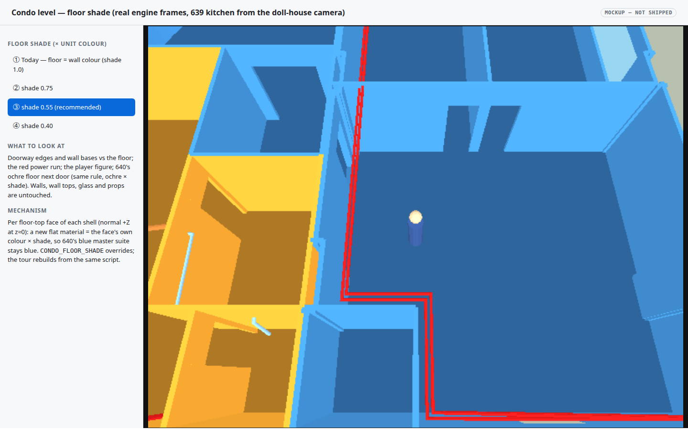
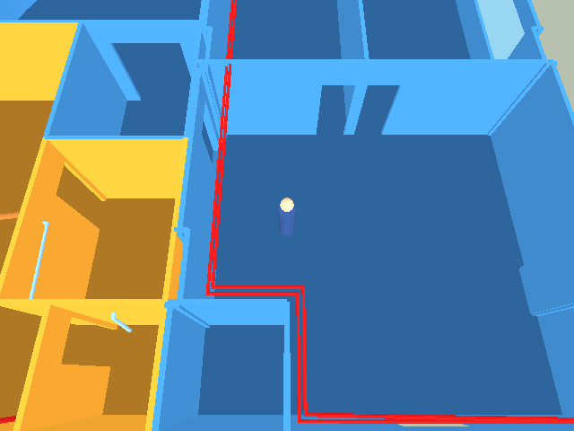
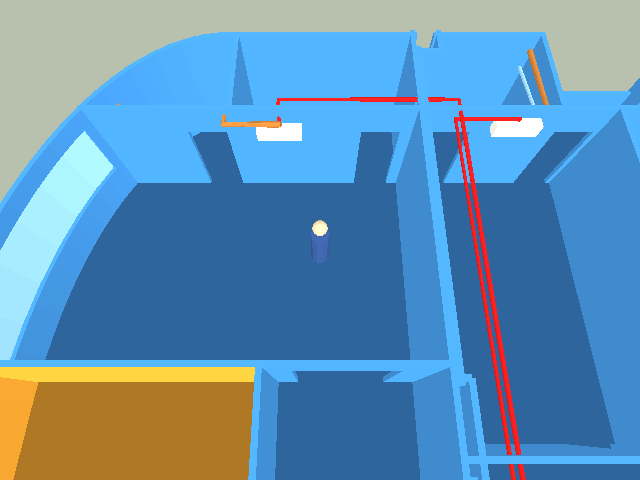

# Condo level — darker floors so walls read against them

## Context

In [`wflevels/condo_639_640`](2026-09-19-condo-639-640-level.md) each shell is one material — the
unit's ownership colour — for its floor slab *and* its exterior walls, and the interior partitions
use the same colours. From the doll‑house camera (69° down) the floor, the wall faces and the wall
tops therefore merge into one flat blue (or ochre) mass, and doorways only read where a shadow side
happens to fall; the [tour video](2026-09-19-condo-639-tour-video.md) made this obvious ("it's hard
to distinguish"). Flat shading with one directional + ambient light can't separate a horizontal
floor from a lit wall face of the same colour.

## Approach

Give the **floor‑top faces their own, darker material** — the owning colour scaled by a shade
factor — in `blender_create_condo.py` (level presentation, so the source `.blend` and its renders
stay as they are). Per face, keyed on the face's existing material, so `unit-640`'s 639‑blue
master suite gets a darker *blue* floor and the rest of 640 a darker ochre. Selection rule:
polygon normal ≈ +Z and centre z ≈ 0 (the slab top), which excludes wall tops at 2.7 m and the
window sills. Walls, wall tops, glass, props, tubes and the ground slab are untouched.

- Knob: `CONDO_FLOOR_SHADE` (default **0.55**, chosen from the renders below); the tour build
  inherits it since it runs the same script.
- Cost: two extra `MATL` entries per shell, no new actors, no geometry change (collision unchanged).
- Rejected: lightening the wall tops instead (adds a second edit and the floors would still merge
  with lit wall faces); a checker/texture floor (textile atlas + the transparent‑key pitfall for a
  presentation tweak).

## Mockups

[](2026-09-19-condo-darker-floors/floor-shade.html)

Real engine frames of the 639 kitchen at shade 1.0 (today), 0.75, 0.55 and 0.40 — toggle them.
Decision: which shade. 0.75 is still muddy at doorways; 0.40 makes the player and the drain run hard
to see; **0.55** keeps the red/copper/blue runs and the figure readable while every wall base and
doorway edge separates. [Open the interactive mockup](2026-09-19-condo-darker-floors/floor-shade.html).

## Out of scope

- Room‑by‑room floor colours (would need per‑room face selection from the `target` bboxes).
- Any change to the source model's materials.

## Verification

1. **Faces recoloured.** `task condo-level --force` prints `unit-639: N floor faces at shade 0.55` and `unit-640: M floor faces …` with N, M > 0; `unit_639.iff` has 2 `MATL` entries and `unit_640.iff` 4.

```
$ task condo-level --force
[condo] unit-639: 61 floor faces at shade 0.55
[condo] unit-640: 66 floor faces at shade 0.55
✓ built /home/will/WorldFoundry-wbniv/wflevels/condo_639_640-standalone.iff (155648 bytes)
$ python3 … (MATL chunk size / 264)
unit_639.iff MATL entries: 2
unit_640.iff MATL entries: 4
```

**PASS** — 61 + 66 floor faces; 639 gains one floor material, 640 gains two (ochre floor + blue master‑suite floor).

2. **Collision unchanged.** `python3 tests/walk_condo.py` → `RESULT: PASS`.

```
$ python3 tests/walk_condo.py | tail -1
RESULT: PASS
```

**PASS**.

3. **Looks right.** Kitchen and 640‑master frames at 0.55 saved to `docs/plans/screenshots/2026-09-19-condo-floor-{kitchen,640-master}.png`; floor visibly darker than walls, master suite floor still blue.

 

**PASS** — wall bases and doorways separate from the floor; 640's master suite floor is a darker blue, the rest of 640 a darker ochre.

4. **Tour re‑recorded.** `task video-condo-639` → `RESULT: PASS`, 11 rooms, 30.4 s; `tour-639.mp4` updated.

```
$ task video-condo-639 --force | grep RESULT
RESULT: PASS  /home/will/WorldFoundry-wbniv/wflevels/condo_639_640/tour-639.mp4 (30.400000s; raw 31.8s, speed x1.06; 11 rooms)
```

**PASS**.
