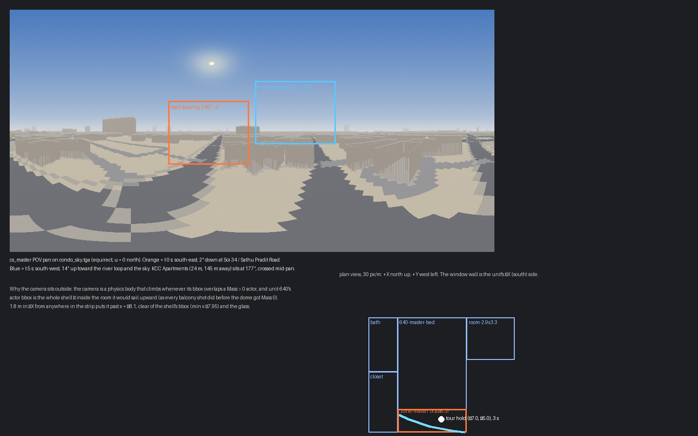
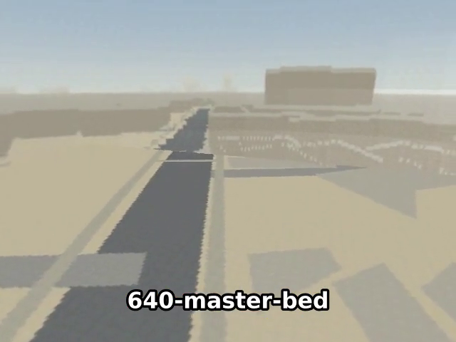

# Condo level: master‑bedroom window POV pan (+5 s in the tour)

## Context

[2026-09-19-condo-site-skybox.md](2026-09-19-condo-site-skybox.md) gave the condo level its
Bangkok skybox and a balcony POV camera that pans over the city when the player steps onto
639's patio. The second view worth having is from **640's master bedroom window**: the room
(x −7.9…0, y −6.75…−2) has a curved glass wall along its **−X side — compass south** —
running from (−7.9, −6.6) up into the corner at (−6.7, −2.1), 0.9–2.3 m above the floor.
From the 6th floor that window looks straight at KCC Apartments (24 m, 145 m away at 177°)
with the Chao Phraya's loop to the south‑south‑west beyond. Same mechanism as the balcony:
a first‑person camshot switched by a zone, a scripted look target that pans the skybox,
restore on leaving. The tour gets a 5 s stop at the window; the cut grows by 5 s (→ 40 s).

## Approach

All in `wflevels/condo_639_640/blender_create_condo.py` § 7b (the balcony block), reusing its
helpers (`add_zone`, the `platform` look‑target pattern, the Director multiplexer).

1. **`zone-master`** — `ActBoxOR`, the master‑bedroom outline clipped to the window strip
   `x ≤ −6.3` (1.6 m from the glass), y −6.75…−2.0, z −0.5…3.2; mailbox **95** →
   `cs_master`. It lies inside `zone-interior`; the Director reads 95 *last*, so the window
   shot wins while the player is in the strip and the doll‑house returns the tick they leave.
2. **`cs_master`** — POV, `Relative` offset **(−1.8, 0, 1.7)**: eye height, 1.8 m in −X.
   From anywhere in the strip that is x ≤ −8.1 — past the glass and past unit‑640's actor bbox
   (min x −7.95), in free air, so the physics camera never "collides" and climbs. `Fixed`,
   `Follow = CamTarget`, `Track Object = Player`, `Target = MasterLook`, pan time 0.7 s.
3. **`MasterLook`** — scripted `platform` (moon `launch_tracker` pattern), mailbox **96** =
   level time the strip was entered (Director sets/zeroes it like 97 for the balcony). Pans
   over `BALCONY_SWEEP_S` = 5 s from **(−9.5, −6.0, −0.3)** — south‑east, 2° down at Soi 34
   and Sathu Pradit Road — to **(−9.5, 6.0, 2.7)** — south‑west, 14° up at the river loop and
   the sky — crossing KCC mid‑pan. Offsets are relative to the camshot's authored point,
   i.e. world (−1.8 − 9.5, ±6, 17.45 + dz); animates Y and Z via `INDEXOF_Y_POS` / `Z_POS`.
4. **Director** — forwards 98 (interior), 99 (balcony), 95 (master) in that order, zeroing
   each; maintains 97 and 96.
5. **Tour** — waypoint 19 `(−1.5, −5.0)` loses its `room` (a corner now); new waypoint
   `(−7.0, −5.0)` `room: 640-master-bed`, `hold: 5.0` (inside the outline and the strip — a single stop has to carry the whole 5 s pan, unlike the balcony's two adjacent stops);
   the return leg `(−7.0, −5.0) → (−4.3, −5.0)` is the existing corner 20, so the closet route
   is unchanged. +5 s hold −0.5 s old hold + ≈2.8 s walking (5.5 m each way at 4 m/s) ≈ +7 s raw;
   `TOUR_SECONDS` default **40** — setpts compresses the raw ≈45 s to 40.4 s (×1.12), so on
   screen each 5 s pan runs ≈4.5 s.
6. **Docs** — level README "Balcony camera" section becomes "Window cameras" with both;
   plan index row; TODO done line.

No engine changes. Room bbox already covers the targets (x −15…15, y −26…10).

## Mockups

[](2026-09-19-condo-master-window-pov/master-window-pan.html)

Orange box = frame at t 0 s (bearing 148°, −2°), blue = t 5 s (212°, +14°) on the real
`condo_sky.tga`; the inset shows the strip zone along the curved glass, the tour hold and
the camera point outside the shell.

## Files

| File | Change |
|---|---|
| `wflevels/condo_639_640/blender_create_condo.py` | `zone-master`, `cs_master`, `MasterLook`, Director order + mailbox 96 |
| `wflevels/condo_639_640/tour-639.path.json` | window waypoint with `hold: 5.0` |
| `Taskfile.yml` | `TOUR_SECONDS` default 40 |
| `wflevels/condo_639_640/tour-639.mp4` (+ `.srt`) | regenerated |
| `wflevels/condo_639_640/condo_639_640.md`, `docs/plans/README.md`, `TODO.md` | docs |

## Verification

1. `CONDO_SPAWN=-7.0,-5.0,0.3 task condo-level --force` then record 8 s: the first frames
   look south‑east down at the road, the last frames south‑west up at the sky; no climb
   (the camera stays at eye height — the horizon sits in the upper half of the frame).

```
[condo] master POV camera: zone x -8.00…-6.30 y -6.85…-1.90, cs_master at (-1.8, 0.0, 1.7), look (-9.5, -6.0, -0.3) → (-9.5, 6.0, 2.7) over 5.0 s
```

Frames at ~2 s / ~8 s: Sathu Pradit Road and the KCC block to the south‑east, then the hazy
south‑west with the sky filling the top half; horizon above centre throughout. **PASS**

2. A one‑waypoint tour from the room centre `(−1.5, −5.0)` to `(−7.0, −5.0)`: the cut to
   POV happens after the walk (live switch, not init), and a second leg back to the centre
   restores the doll‑house.

```
[condo] tour: 4 legs, 2 room holds, 1121 bytes of Forth
```

Frame at 4 s: POV over the road; frame at 12 s: doll‑house with the player back at the
room centre. **PASS**

3. `task video-condo-639` → `RESULT: PASS`, 11 rooms; the `640-master-bed` cue shows the
   POV pan; length ≤ 40.4 s; captions coincide with the frames.

```
HOLD 640-master-bed       t= 31.95s wall= 33.09s pos=(-7.08,-5.08) inside=True
TOUR_DONE t=43.67s wall=44.82s
RESULT: PASS  wflevels/condo_639_640/tour-639.mp4 (40.400000s, 640x480; raw 45.2s, speed x1.13; 11 rooms)
00:00:28,671 --> 00:00:35,009   640-master-bed
```



**PASS** — the first cut with `hold: 3.0` only played 60 % of the pan (the doll‑house was
back by 34.5 s), hence the 5 s hold.

4. The balcony POV still works (cue `639-patio-recessed` in the same video).

```
HOLD 639-patio-recessed   t= 16.56s wall= 17.60s pos=(3.17,-1.10) inside=True
HOLD 639-patio            t= 20.78s wall= 21.82s pos=(6.63,-1.10) inside=True
```

**PASS** (same recording, POV visible at both patio cues).
