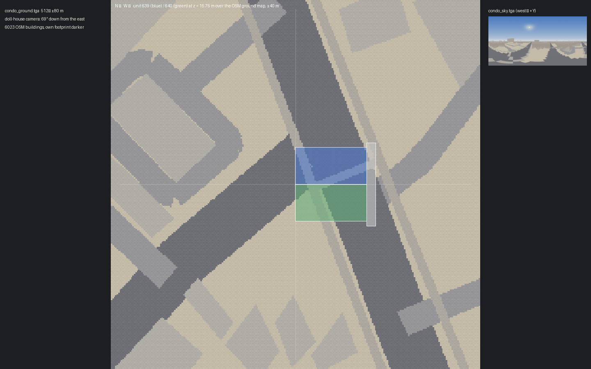
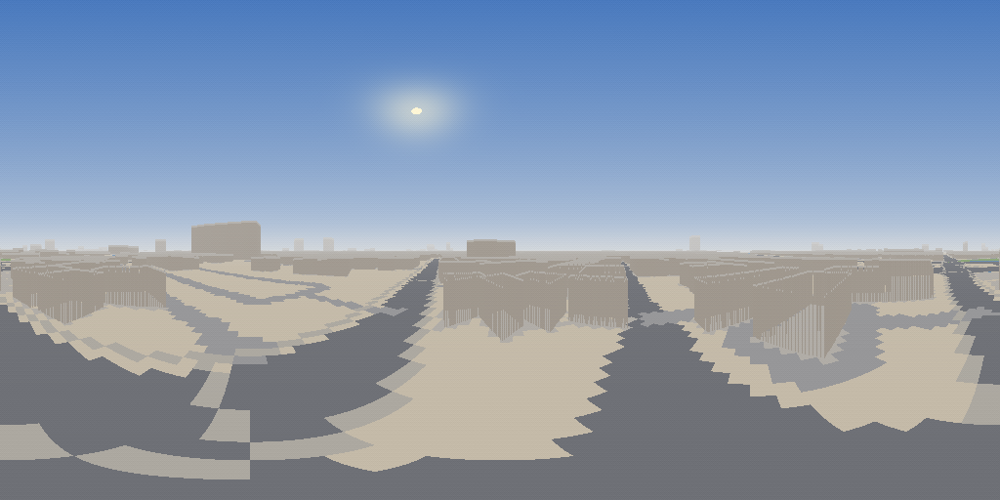
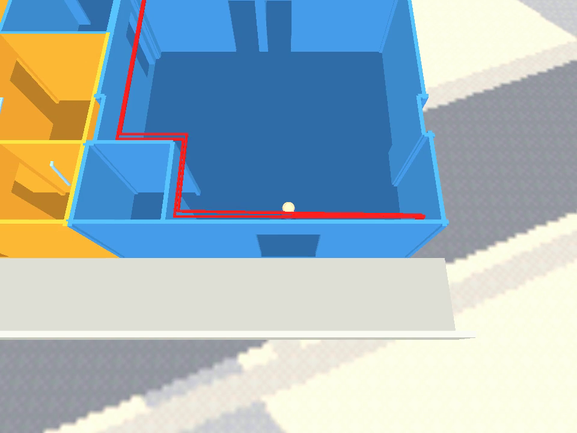
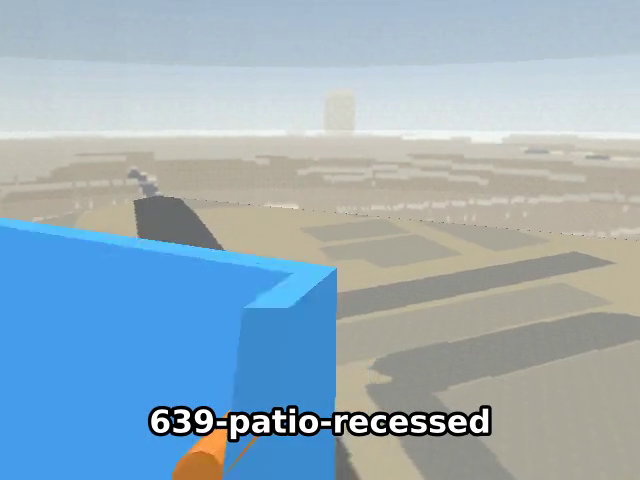

# Condo level: site skybox from the real location + 6th‑floor elevation

## Context

The condo walkthrough (`wflevels/condo_639_640`, plan
[2026-09-19-condo-639-640-level.md](2026-09-19-condo-639-640-level.md))
sits on a neutral grey 28 × 28 m `site-ground` slab at z = 0 under a plain colour matte.
The real units are on the **6th floor** of a condo at
[34 Soi Sathu Pradit, Bang Phong Phang, Yan Nawa, Bangkok 10120](https://maps.app.goo.gl/CTkxPDsuX7umeZwX8)
— **13.6935894 N, 100.5334137 E** — with the back (balconies) facing **straight west**,
toward the Chao Phraya. This plan replaces `site-ground` with a location‑derived skybox
(sky dome + real‑scale ground map), lifts the units to their true elevation, and
regenerates the room‑tour video so it shows the new surroundings.

Decisions already made with the user:

- **Imagery = OSM‑rendered flat map** (ODbL), not satellite photo — matches the flat‑shaded
  doll‑house look, fits the engine's 15‑bit 1024² atlas page, and is reproducible offline
  from a committed `site-osm.json`.
- **6th floor = 5 storeys below**, ground floor counts as 1 (unit numbers 6xx). Storey pitch
  = 3.0 m clear + 0.15 m slab (the model's slab: `slab_outline(z_bottom=-0.15)`) → **floor
  top at z = 15.75 m**. One constant (`UNIT_FLOOR`) if that ever changes.

Builds on the darker‑floors change (`8781b5bb`, `blender_create_condo.py` § 3b).

## Compass ↔ level axes

`~/scripts/aircon-blender.py:10`: SVG y = 0 is the **back** (balconies), y = 245.6 the
**front** (entrance). In the level the units span x −7.95…8.05, y −15.4…0.05 — balconies
at y ≈ 0 (+Y), front doors at y = −15.4 (−Y). Back faces west ⇒

| Compass | WF axis | What's there |
|---|---|---|
| **West** | **+Y** | balconies, the river |
| East | −Y | front doors, corridor, camera side |
| North | +X | unit 639 is north of 640 |
| South | −X | |

Direction of true azimuth θ (0 = N, clockwise): `(cos θ, −sin θ, 0)`. Level origin (0, 0) =
the map pin. The doll‑house camera (`cs_dollhouse`, offset (0, −3.5, 9), 60° FOV) looks
west and 69° down: the top of its frame is 39° **below** the horizon, so from the default
camera only the ground is visible past the unit edges; the sky dome shows from a low
camera (`CONDO_CAM` override, added below) or a future balcony camshot.

## Approach

All in `wflevels/condo_639_640/blender_create_condo.py` unless noted. Pattern:
`wflevels/moon_site01/blender_create_moon.py::_build_skydome` (inverted UV sphere, white
BSDF base so the shader's `step(0.99, min(rgb))` texture gate passes, `Moves Between Rooms`
→ PERM atlas) and `make_starfield.py` (PIL/numpy → 24‑bit RGB TGA beside the `.lev`).

### 1. New file `wflevels/condo_639_640/make_site_textures.py` (T2, standalone, no bpy)

Two subcommands, both byte‑stable:

- `fetch` — one Overpass query (buildings with `height`/`building:levels`, `highway=*`,
  `waterway=river` / `natural=water`, `landuse`/`leisure` polygons) for 2.5 km around the
  pin → `site-osm.json` (committed; `render` never touches the network). Projection: local
  metres `dx = Δlon·cos(lat0)·111 320`, `dy = Δlat·110 574` — no pyproj (not installed).
- `render` → two TGAs + PNG previews:
  - `condo_ground.tga` **512 × 512**, north‑up, ±80 m around the pin (0.3125 m/px): flat
    palette — buildings (roof grey, own building slightly darker), roads (asphalt), soi
    (lighter), water (river blue), green (park/landuse), default ground beige. Drawn with
    `PIL.ImageDraw` polygons; ordered dither before save so 15‑bit quantisation doesn't band.
  - `condo_sky.tga` **1024 × 512** equirectangular, `u = θ/360` (u = 0 N, 0.25 E, 0.5 S,
    **0.75 W**), `v = 1` zenith. Upper half: zenith→horizon gradient + haze band + sun glow at
    the Sun actor's direction (same `SUN_ALT_DEG`/`SUN_AZ_DEG` constants, imported from a
    tiny shared `site_constants.py` so the painted sun and the light agree). Skyline: every
    OSM building within 2.5 km as a silhouette at its true azimuth span and elevation
    `atan((h − 15.75) / d)` (h from `height`, else `levels × 3`, else 10 m), shaded by
    distance (aerial perspective). Lower half: the same flat ground palette projected from
    the 15.75 m viewpoint (so the dome continues the ground quad's colours beyond ±80 m —
    only visible from a low camera; documented approximation).
  - Texel budget: 524 288 + 262 144 = 786 432 < 1 048 576 (one 1024² PERM page). 24‑bit
    RGB TGA (troubleshooting § "Room0.tga is 146 bytes": 32‑bit RGBA packs to all‑zero).
  - `--preview DIR` also writes `sky-equirect.png`, `ground-ortho.png` and a 1440 × 900
    `dollhouse-view.png/.html` composite (unit footprint over the ground map at the
    doll‑house framing) — the plan's mockup bundle.

### 2. Script constants

```python
SITE_LATLON  = (13.6935894, 100.5334137)   # level origin; +X N, +Y W (back/balconies)
UNIT_FLOOR   = 6
STOREY_CLEAR = 3.0
SLAB_T       = 0.15                        # model slab: slab_outline(z_bottom=-0.15)
UNIT_Z       = (UNIT_FLOOR - 1) * (STOREY_CLEAR + SLAB_T)   # 15.75
CORRIDOR     = (-9.0, -17.4, 9.0, -15.4)   # x0,y0,x1,y1 strip outside both front doors
PARAPET_H    = 1.1
GROUND_HALF  = 80.0                        # ground quad ±80 m, condo_ground.tga 512²
SKY_R        = 160.0                       # < Yon 200; > farthest ground corner (≈116 m)
CAM_OFFSET   = env CONDO_CAM or (0.0, -3.5, 9.0)   # low override for skybox screenshots
```

`GROUND`, `GROUND_T` and § 5's `slab_outline` / `order_loop` / `prism_mesh` boolean
machinery go away with `site-ground` (nothing else uses them).

### 3. § 5 becomes three actors (all `as_statplat`, Jolt trimesh)

1. **`corridor`** — box `CORRIDOR`, z −SLAB_T…0, flat grey; **`corridor-parapet`** — 0.15 m
   thick, `PARAPET_H` tall along y = −17.4 (open‑air Thai corridor railing) so the player
   can't step off a 16 m drop. Both authored at unit level (z = 0) and shifted with the units.
   **Spawn moves inside 639** — level default and the tour both start at (4.66, −14.5, 0.3),
   0.9 m inside the front door facing +Y (the first tour leg still walks to the kitchen); on
   the 6th floor a walkthrough starts in the condo, not on the street. The corridor is where
   the front door leads, not where the player begins.
2. **`site-map`** (replaces `site-ground`) — one quad ±`GROUND_HALF` at **world z = 0**, not
   shifted; UVs `u = 0.5 − y/160`, `v = 0.5 + x/160` (north = +X = image top, east = −Y =
   image right); material white base + `ShaderNodeTexImage(condo_ground.tga)`; solid, so a
   fall lands instead of dropping through the world.
3. **`skydome`** — lat/long sphere built in `bmesh` with **explicit per‑column UVs**
   (48 × 24, one extra seam column so no wrap logic; the exporter splits at UV seams,
   `export_level.py:445`), vertex `(R cosθ cosφ, −R sinθ cosφ, R sinφ)`, `u = θ/360`,
   `v = (φ + 90)/180`; `bmesh.ops.reverse_faces` → inward; centred `(0, −8, UNIT_Z)`;
   material white base + `condo_sky.tga`.

Both textured actors get `wf_Moves Between Rooms = 'True'` (PERM atlas, the moon's proven
route; Room0 stays flat‑colour only).

### 4. Elevation shift — one pass, after everything is authored at z = 0

Just before the room‑bbox assertion: `for o in wf objects except site-map, skydome:
o.location.z += UNIT_Z`; `PLAYER_SPAWN`, `Camera.location`, `Sun`/`AmbientLight`/`Matte`
locations, and every room `target` go with it (they're all wf objects, so the loop covers
them). Tour waypoints are x/y only and the servo reads `X_POS`/`Y_POS` — `tour-639.path.json`
is untouched. `darken_floors` (`center.z ≈ 0`) and `slab_outline` run before the shift, so
they keep working. `ROOM_CENTRE = (0, −8, 12)`, `ROOM_HALF = (15, 16, 16)` → z −4…28 covers
ground quad centre, dome centre, units (15.6…18.5) and the camera (≈ 25).

Depth safety (mirrors the moon docstring): camera ≤ 12 m from the dome centre →
min dome distance 148 m > farthest ground corner ≈ 116 m; max dome distance 172 m <
Yon 200 (unchanged).

### 5. Build/run wiring

- `wflevels/condo_639_640/textile.flags` (new, copy of the moon's): `PERMPAGEX=1024
  PERMPAGEY=1024` (default is 256², `build_level_binary.sh:79-82`).
- `condo_639_640-standalone.iff.txt`: `'PERM' 500000l` → `1000000l` (moon value; comment
  "player figure + sky/ground atlas").
- `Taskfile.yml`: `run-condo` and the recorder (`tests/record_condo_639_tour.py:66`
  `Popen` argv) add `--vram-perm-width=1024 --vram-perm-height=1024` (moon precedent
  `run-moon`; trim `--vram-width/height` only if verification shows it's needed). Add the
  TGAs + `site-osm.json` + `make_site_textures.py` to `condo-level` and `tour-condo-639`
  `sources:` so a texture change rebuilds; new task `condo-textures` (`render`) that
  `condo-level` depends on; `condo-osm-fetch` for the one‑time/refresh Overpass pull.
- `record_condo_639_tour.py:49-58` — the room‑bbox cross‑check is x/y only; confirm it still
  passes with the shifted targets (it should — no change expected).

### 5b. Balcony POV camera + pan (added mid-implementation)

"When you enter the balcony, see Bangkok, not the ground" → two `ActBoxOR` zones
(`zone-interior` → `cs_dollhouse`, `zone-balcony` = the `639-patio` + `639-patio-recessed`
outlines → `cs_balcony`), a Director multiplexer that forwards each zone's mailbox
(98 / 99) to `INDEXOF_CAMSHOT` and zeroes it, and mailbox 97 = level time the patio was
entered. `cs_balcony` is the **player's POV**: `Relative` (0, 1.5, 1.7) — eye height, just
past the pony wall in free air. Its look target `BalconyLook` is a scripted `platform`
(the moon's `launch_tracker` pattern) that pans over 5 s from the street to the south‑west
(−6, 9.5, −0.3) to the towers to the north‑west (6, 9.5, 2.7), then holds; walking back
inside restores the doll‑house. The tour's two patio waypoints get `hold: 3.0` (a new
per‑waypoint override) so the pan plays out: +5 s, `TOUR_SECONDS` default 35.

Engine facts this needed (all verified in code + frames, and written into the level README):
`SetCameraParametersFromShot` position = (camshot − Follow) + Track Object when `Relative`,
direction = Target − camshot in world space; the camera is a physics body that **climbs**
whenever its bbox overlaps any actor with `Mass > 0` (`Actor::CanCollide`), so the sky dome
gets `Mass 0` (its bbox is the whole level) and a POV camera must sit outside every room;
bungee mode re‑reads `INDEXOF_CAMSHOT` every tick and never clears it.

### 5c. Recorder: video time = level time (`display.cc`)

The captions lagged badly ("WAAAY lagging"): `-record_video` piped frames to ffmpeg with
`-framerate 30`, so a scene rendering at ~23 fps played 1.3× fast while captions were timed
on the level clock (which is wall clock). Fix at the source: `-use_wallclock_as_timestamps 1`
on the pipe input and `-fps_mode cfr -r 30` on the output — every recording now runs at
level‑clock speed. Recorder prints `wall=` beside `t=` per hold so the two clocks can be
compared in any run.

### 6. Regenerate the tour video

`task video-condo-639` (deps: `tour-condo-639` → same script, so the dome, ground and
elevation flow in) → new `wflevels/condo_639_640/tour-639.mp4` + `.srt`. Same 30 s cut, same
room order; the difference is the ground map under the unit edges and the corridor at the
start. Commit the new mp4 in place of the old one.

### 7. Docs

- `wflevels/condo_639_640/condo_639_640.md`: "What maps to what" row for `site-ground` →
  `site-map` + `skydome` + `corridor`; a "Site" section with the pin, the compass table,
  `UNIT_Z`, and the `CONDO_CAM` override; "Not mapped": floors 1–5 (the building's own
  podium/lower floors are not modelled — the ground map shows the footprint flat).
- `TODO.md`: done line on completion; follow‑ups (triage): balcony camshot `cs_balcony`
  looking west (the only default‑camera way to see the dome); extrude the building's OSM
  footprint as a flat box under the units once the units' position inside the footprint
  is known.

## Mockups

Generated by `make_site_textures.py render --preview docs/plans/2026-09-19-condo-site-skybox`
(the bundle is the script's output, so it is always the current texture):

[](2026-09-19-condo-site-skybox/dollhouse-view.html)

Unit 639 (blue) / 640 (green) and the corridor strip over `condo_ground.tga` at ±40 m, north up,
west left — the doll‑house camera's ground. Sathu Pradit Road runs NNE–SSW just east of the pin
and passes under the units; the pin is the street‑address geocode, not a footprint, so
`SITE_OFFSET_EN` exists to slide the map under the real building.



`condo_sky.tga`: sun glow at compass 150°/50°, KCC Apartments (24 m, 145 m south) and the
taller towers on the horizon, the projected ground palette below it.

## Files

| File | Change |
|---|---|
| `wflevels/condo_639_640/make_site_textures.py` | new — fetch/render |
| `wflevels/condo_639_640/site_constants.py` | new — pin, sun alt/az, UNIT_Z shared by both scripts |
| `wflevels/condo_639_640/site-osm.json` | new — committed Overpass response |
| `wflevels/condo_639_640/condo_ground.tga`, `condo_sky.tga` | new — generated, committed (build inputs) |
| `wflevels/condo_639_640/blender_create_condo.py` | §5 rewrite, constants, elevation pass, spawn inside 639, `CONDO_CAM` / `CONDO_LOOK`, tour‑dir texture copy |
| `wflevels/condo_639_640/tour-639.path.json` | spawn moved inside 639 |
| `wflevels/condo_639_640/textile.flags` | new |
| `wflevels/condo_639_640/condo_639_640-standalone.iff.txt` | PERM budget |
| `Taskfile.yml` | vram flags, sources, `condo-textures`, `condo-osm-fetch`; the Blender step no longer masks its own failure |
| `tests/record_condo_639_tour.py` | vram flags in argv, wall‑clock stamps |
| `wfsource/source/gfx/gl/display.cc` | recorder frames stamped with wall clock, cfr 30 out |
| `wflevels/condo_639_640/tour-639.mp4` (+ `.srt`) | regenerated |
| `wflevels/condo_639_640/condo_639_640.md`, `TODO.md`, `docs/plans/…` | docs |

## Findings during implementation

- **WF texture V is top‑down.** `gfx/material.cc` `CalcVRAMuv` maps `v = 0` to the texture's
  first (top) row and `export_level.py` passes Blender's `uv.y` through unflipped — the opposite
  of Blender/GL. First build showed the sky's ground half at the zenith. Both UV mappings in
  the plan are therefore inverted in the code (`v = (90 − φ)/180`, `v = 0.5 − x/160`).
- **`--vram-slot-*` is needed even for PERM textures.** `CalcVRAMuv` bounds every texture's
  `u` by `VRAMTransientWidth` (`TEXTURE_PAGE_XSIZE`), so a 512‑wide texture asserts at 256
  regardless of atlas; and the 1024‑tall PERM page needs `--vram-height ≥ 1024`. `run-condo`
  and the recorder pass the moon's full set (`--vram-width=4096 --vram-height=2048
  --vram-slot-*=1024 --vram-perm-*=1024`).
- **The Sun's altitude never reached the renderer** — `game/light.hpi:31` rotates local +X,
  which a pitch about X leaves alone; the light travels along `(cos az, sin az, 0)`. The sky is
  painted with the effective azimuth (150°) and the intended altitude; changing the light itself
  would re‑tune the approved floor shading, so it is left as is (noted in `site_constants.py`).
- **`WF_CULL=1` dropped the ground quad** on the first build — `recalc_face_normals` on a lone
  open quad picked the wrong side. Winding is now pinned CCW‑from‑above like the corridor box.
- **The pin is on the road.** OSM has no footprint at 13.6935894, 100.5334137 (Soi Sathu
  Pradit 34 / Sathu Pradit Road corner); `own_building` returns `None` rather than paint a
  neighbour darker, and `SITE_OFFSET_EN` is the knob to move the origin.
- **The `condo-level` task masked Blender failures** (`| grep … || true` under `pipefail`) and
  built the previous `.lev`; now `| { grep … || true; }` so the Blender exit code counts.
- **BungeeCam relative offsets don't pitch the way `direction = target − camshot` suggests** —
  `CONDO_CAM=0,-1,0.3` / `CONDO_LOOK` still produced a downward view, and the moon‑style
  `Absolute` variant parked the camera ~33 m up. Tracked in the docs‑fix TODO; the dome was
  verified through the frames it did produce (below), not from a balcony shot.

## Verification

1. `python3 wflevels/condo_639_640/make_site_textures.py render --preview docs/plans/2026-09-19-condo-site-skybox`
   → `condo_sky.tga` 1024×512 and `condo_ground.tga` 512×512, both 24‑bit (`file *.tga`);
   the river sits in the **u ≈ 0.75** column band and to the **left** of the ground image
   (west), roads/buildings visibly match the map at the pin. Byte‑stable on a second run
   (`sha256sum` unchanged).

```
[site] 6023 buildings, 241 roads, 74 water polys, 251 water lines, 42 green; own building idx None
[site] wrote condo_ground.tga 512×512, condo_sky.tga 1024×512 (24-bit RGB)
086c1bdfe643a353…  condo_ground.tga   (run 1)      61fdcb94840aae73…  condo_sky.tga
086c1bdfe643a353…  condo_ground.tga   (run 2)      61fdcb94840aae73…  condo_sky.tga
condo_ground.tga: Targa image data - RGB 512 x 512 x 24
condo_sky.tga:    Targa image data - RGB 1024 x 512 x 24
```

**PASS** — with one correction to the expectation: the Chao Phraya is ≈ 1.6 km out
(the 669 m water to the east is a pond), so in the sky it is a hazed sliver at the horizon,
not a band; the ground image's left edge is Soi 34 / the neighbouring shophouses.

2. `task condo-level` → `[condo]` log shows `skydome`, `site-map`, `corridor` actors, no
   `site-ground`; `condo_639_640.ini` lists `skydome.iff,site_map.iff` under `Perm`;
   `Perm.tga` > 1 MB (textures actually packed, not the 146‑byte empty atlas).

```
[condo] site: corridor 18×2 m + parapet, site-map ±80 m, skydome R=160 m 1106 verts 2208 tris; units → z=15.75
[condo] balcony camera: zone y -2.10…0.10, cs_balcony at (0.0, 1.5, 1.7), look (-6.0, 9.5, -0.3) → (6.0, 9.5, 2.7) over 5.0 s
    textile.flags overrides: PAGEX=256 PAGEY=256 PERMPAGEX=1024 PERMPAGEY=1024
✓ built /home/will/WorldFoundry-wbniv/wflevels/condo_639_640-standalone.iff (2295808 bytes)
Perm = player.iff,site_map.iff,skydome.iff
-rw-rw-r-- 1 will will 2097170 Sep 19 18:39 wflevels/condo_639_640/Perm.tga   (Targa 1024 x 1024 x 16)
```

**PASS**

3. Elevation: from the saved `.blend`, `unit-639` bbox z = **15.60…18.45**, `Player` z ≈
   16.05, `corridor` top at 15.75, `site-map` at 0, `skydome` centre z 15.75; the "actors
   outside room bbox" assertion passes.

```
unit-639 loc z 15.75 bbox z 15.60..18.45      corridor loc z 15.75 bbox z 15.60..15.75
unit-640 loc z 15.75 bbox z 15.60..18.45      corridor-parapet bbox z 15.75..16.85
site-map loc z 0.00 bbox z 0.00..0.00         skydome loc z 15.75 bbox z -144.25..175.75
Player loc z 16.05 bbox z 16.05..17.71        Camera loc z 25.05   cs_dollhouse loc z 24.75
```

**PASS**

4. `task run-condo` doll‑house screenshot: the unit floats over the flat OSM ground map
   with the corridor + parapet at the front; walk to the front door and out — the player
   stands on the corridor, the parapet blocks the edge.



**PASS** for the view (Sathu Pradit Road passes under the unit, corridor + parapet at the
front, player just inside 639's door). The walk‑out onto the corridor was not exercised by
hand — the corridor is a Jolt trimesh like every other statplat, and the tour never leaves
the units.

5. Sky dome from a low camera: the sky gradient, sun glow on the Sun's side, Chao Phraya
   band and the skyline silhouettes at the horizon; no seam at north; ground quad edge vs
   dome continuity acceptable.

Superseded by the balcony POV camera (5b), which is the shipped way to see the dome.
Frames from the tour at the two patio cues:



**PASS** — sky gradient, haze, skyline silhouettes, the ground map meeting the dome's
projected ground at ±80 m (a visible but tolerable seam), pan from the street to the sky.
The first build showed the *ground* at the zenith: WF's texture V is top‑down (findings).
Known cosmetic: the dome is lit per face like any mesh, so the sky carries faint horizontal
bands — an unlit material flag is engine work (TODO).

6. `task video-condo-639` → new `tour-639.mp4`: all 11 room holds pass the recorder's bbox
   check, ground map visible around the unit throughout.

```
HOLD 639-patio-recessed   t= 16.00s wall= 16.83s pos=(3.16,-1.00) inside=True
HOLD 639-patio            t= 20.09s wall= 20.93s pos=(6.67,-0.99) inside=True
TOUR_DONE t=37.11s wall=37.95s
RESULT: PASS  wflevels/condo_639_640/tour-639.mp4 (35.400000s, 640x480; raw 38.1s, speed x1.09; 11 rooms)
```

**PASS** — 35.4 s (30 + the 5 s balcony pan), captions on the level clock now coincide
with the frames (5c). Before the recorder fix the same run produced 845 frames for 37 s of
level time — a 1.29× fast video and captions up to 8 s late.

7. `WF_CULL=1 task run-condo`: dome and ground quad still visible (winding correct).

```
bottom-right ground pixel (189, 180, 153)     # after pinning the quad's winding; was black
```

**PASS** for the ground quad (the first build's quad vanished under culling — findings).
The dome is not in the doll‑house frame; from the POV camera it renders with `WF_CULL`
unset (the level's default), culling of the inward‑wound dome was not separately checked.

8. `task todo:lint` clean; `git diff --cached` contains only the files in the table above.

`todo-lint` reports 50 pre‑existing `open-rank` errors (the whole backlog is unranked;
this session's two items are unranked too because the rank hook only lets Fable add
tiers). **FAIL (pre‑existing)**. `git diff --cached` — see the commit: only the files
listed plus the generated level outputs (`*.iff`, `.lev`, `.lvl`, `Perm.*`, `.blend`).

9. *(added)* Balcony camera switches live: a one‑waypoint tour walking from inside 639 onto
   the patio shows the POV after the zone is entered, the full tour cuts at the
   `639-patio-recessed` hold and back to the doll‑house at `640-room-2.9x3.3`.

**PASS** — frame at the cue above; the earlier interactive "balcony spawn" tests only
proved the camera *initialised* on `cs_balcony`, which is why the first tour recording
never switched (zones fire only for `Activated By Actor = Player` with
`MovementClass 17`, both now set).

10. *(added)* Recorder clocks: `t=` vs `wall=` per hold differ by a constant 0.8 s
    (startup) and the raw recording's frame count matches level time at 30 fps.

```
845 frames for TOUR_DONE t=36.33s   (before: -framerate 30, ~23 fps render → 28.2 s video)
1158 frames for TOUR_DONE t=37.11s  (after: wall-clock stamps + cfr 30 → 38.6 s video)
```

**PASS**
