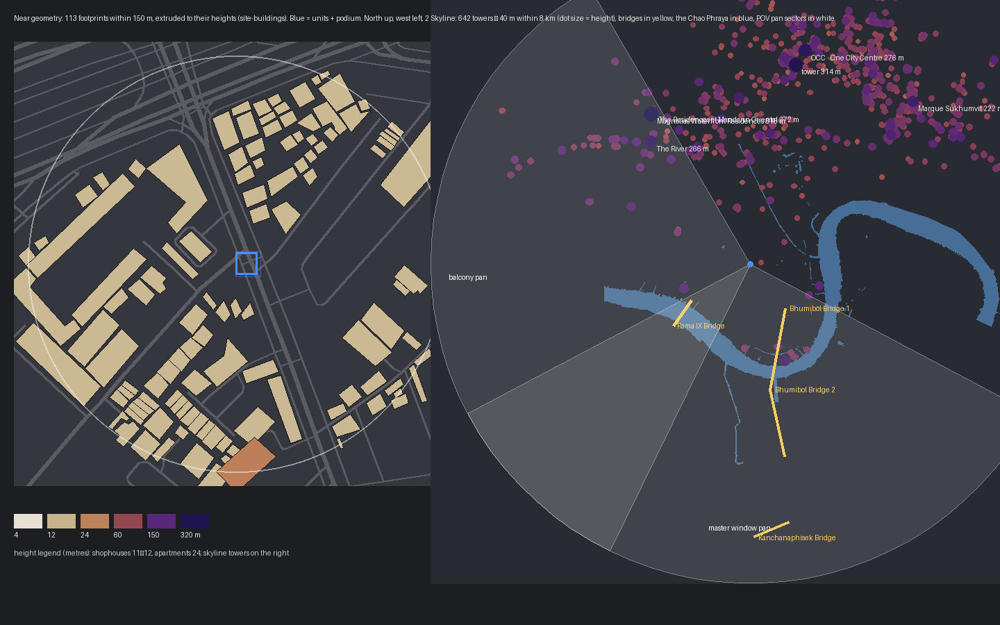
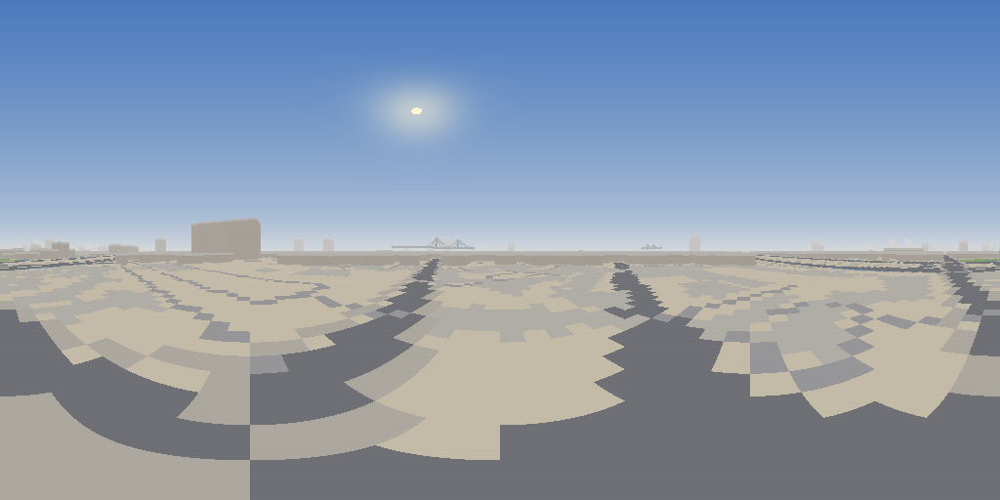
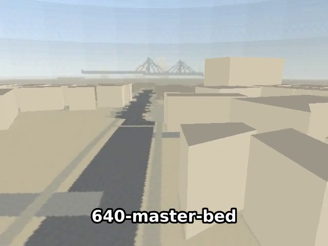

# Condo level: the surroundings — near buildings, the Bangkok skyline, the bridges

## Context

[The site skybox](2026-09-19-condo-site-skybox.md) paints every neighbour flat on the ground
map and takes its skyline from OSM buildings within 2.5 km that carry a height tag — around
Sathu Pradit that is almost none, so from the [balcony](2026-09-19-condo-site-skybox.md) and
[master‑window](2026-09-19-condo-master-window-pov.md) POV pans the city reads as an empty
plain with a few blocks: no buildings around the condo, no Bangkok skyline, and none of the
bridges that are actually in view from the master bedroom (Rama IX to the south‑west,
Bhumibol 1 to the south‑south‑east). This plan fills all three from the same OSM extract:

- **Near buildings as geometry** — every footprint within 150 m extruded to a height (by
  building type; nothing near the pin is tagged) into one merged mesh, plus a **podium** under
  the units so the doll‑house reads as the 6th floor of a building rather than a flying slab.
- **The skyline** — the Overpass fetch reaches 8 km for towers ≥ 40 m / ≥ 15 levels: 642 of
  them, MahaNakhon and the Sathorn cluster to the north, ICONSIAM/Magnolias and The River to
  the north‑west, StarView to the west‑south‑west, a 220 m tower south‑south‑east.
- **The bridges** — `man_made=bridge` outlines give the names and the deck lines, a small
  table gives the published pylon/deck heights (OSM has none): Rama IX (87 m), Bhumibol 1
  (173 m), Bhumibol 2 (164 m), Kanchanaphisek (187 m). Deck band + two pylons + stay cables
  as silhouettes.
- **A catalog** (`site-catalog.md`, generated) of what the level now contains and which POV
  sees it, and an **overview mockup** of buildings and heights — both regenerated by
  `make_site_textures.py render --preview`, so they never drift from the textures.

## Approach

### 1. Data — `make_site_textures.py`

- `fetch`: towers to 8 km with regex filters (`height ≥ 40` or `building:levels ≥ 15`,
  ways + relations), `man_made=bridge` outlines with names, cable‑stayed `bridge=yes` ways;
  the near query (700 m, everything) is unchanged. `site-osm.json` stays ≈1.3 MB.
- `render`: buildings within `GEOM_R = 150 m` are written to **`site-buildings.json`**
  (level‑space footprints + heights) and left out of the sky raster; towers beyond are painted
  as before; **bridges** drawn on the panorama (`draw_bridges`); the far ground raster grows
  to ±3 km so the Chao Phraya's loop appears below the horizon; `TYPE_HEIGHT` gives untagged
  footprints a height by `building=*` (shophouse country: 11–12 m, apartments 24 m).
- `write_catalog` → `site-catalog.md`; `write_overview` → the mockup below.

### 2. Geometry — `blender_create_condo.py` § 5

- **`site-buildings`** — one `statplat` mesh actor built from `site-buildings.json`: each
  footprint a closed prism z 0…h (bottom, top, side quads; `recalc_face_normals` → Blender‑
  outward, which is what `WF_CULL` keeps), all merged; two flat materials (walls, roofs);
  `Mass 0` so the physics camera ignores it; world‑space (not lifted); `Moves Between Rooms`
  off (flat colour, no texture). Footprints that fail to triangulate are skipped and counted.
- **`site-podium`** — a box x −9…9, y −17.55…0.05, z 0…UNIT_Z − SLAB_T under the units and
  corridor, wall‑grey, `Mass 0`, world‑space.
- Both inside the dome (R 160 m) and the room bbox; the near ground map (±80 m) stays 512².

### 3. Everything else stays

Zones, POV cameras, pans and the tour are untouched; the video is regenerated because the
frames change (no timing change).

## Mockups

[](2026-09-19-condo-site-surroundings/site-overview.html)

Left: the 113 footprints within 150 m coloured by assigned height (legend in metres), the units
and podium in blue over Sathu Pradit Road. Right: the 642 towers within 8 km as dots sized by
height, the four bridges in yellow, the river's loop round Bang Krachao, and the two POV pan
sectors — the master‑window sector holds both Rama IX and Bhumibol 1.



The regenerated `condo_sky.tga`: Bhumibol 1's pylons and cables left of centre (161°),
Rama IX (234°), the north‑west river towers at the right edge; near buildings removed (they
are geometry now).

The likely real footprint of the condo is the large L‑shaped block 65 m north‑west of the pin
(bearing 319°, 65 × 44 m) — the units still hover over the road until `SITE_OFFSET_EN` is set
(open TODO).

## Inventory / catalog

Generated into `wflevels/condo_639_640/site-catalog.md`; this copy is from the same run.


### Near buildings — level geometry (`site-buildings`, ≤ 150 m)

113 footprints, heights 11–26 m (untagged → by type: yes 112, apartments 1). No footprint in OSM carries a height here; `TYPE_HEIGHT` in the script assigns them.

| Name | Type | Height | Bearing | Distance |
|---|---|---|---|---|
| KCC Apartments | apartments | 26 m | 177° | 145 m |

### Skyline towers ≥ 100 m (painted silhouettes, 150 m – 8 km)

244 towers; the 40 tallest:

| Tower | Height | Bearing | Distance | Seen from |
|---|---|---|---|---|
| Magnolias Waterfront Residences | 318 m | 327° | 4.5 km | balcony |
| (unnamed) | 314 m | 13° | 5.1 km | — |
| OCC - One City Centre | 276 m | 15° | 5.5 km | — |
| The Residences at Mandarin Oriental | 272 m | 327° | 4.5 km | balcony |
| The River | 266 m | 321° | 4.0 km | balcony |
| Marque Sukhumvit | 222 m | 45° | 5.8 km | — |
| (unnamed) | 220 m | 160° | 2.6 km | master window |
| Ashton Chula–Silom | 206 m | 356° | 4.2 km | — |
| The Lumpini 24 | 188 m | 48° | 4.8 km | — |
| Supalai Icon Sathon | 182 m | 8° | 3.3 km | — |
| (unnamed) | 181 m | 349° | 3.7 km | — |
| StarView | 179 m | 250° | 1.8 km | balcony |
| Sathorn House | 174 m | 336° | 3.2 km | — |
| Hansar Hotel | 173 m | 9° | 5.2 km | — |
| Menam Residences | 173 m | 296° | 3.3 km | balcony |
| (unnamed) | 173 m | 11° | 4.7 km | — |
| Interchange 21 Building | 165 m | 33° | 5.7 km | — |
| Tower 2 | 163 m | 45° | 5.0 km | — |
| Tower 5 | 163 m | 46° | 4.9 km | — |
| Fullerton | 163 m | 59° | 6.2 km | — |
| (unnamed) | 160 m | 16° | 5.8 km | — |
| (unnamed) | 160 m | 16° | 5.8 km | — |
| Ashton Asoke | 160 m | 31° | 5.8 km | — |
| (unnamed) | 160 m | 50° | 8.0 km | — |
| (unnamed) | 159 m | 11° | 5.2 km | — |
| (unnamed) | 158 m | 11° | 5.2 km | — |
| (unnamed) | 158 m | 11° | 5.1 km | — |
| Sathorn Unique Tower | 157 m | 323° | 3.3 km | balcony |
| Kimpton Maa-Lai | 156 m | 13° | 5.0 km | — |
| Urbano Absolute Sathon–Taksin | 151 m | 317° | 4.2 km | balcony |
| Villa Sathorn | 151 m | 314° | 4.4 km | balcony |
| (unnamed) | 151 m | 332° | 3.8 km | — |
| Knightsbridge Prime Onnut | 150 m | 77° | 7.7 km | — |
| Skywalk Condominium | 150 m | 71° | 6.9 km | — |
| Skywalk Condominium | 150 m | 70° | 6.9 km | — |
| The Tower | 150 m | 11° | 6.0 km | — |
| T-One Building | 150 m | 58° | 6.0 km | — |
| (unnamed) | 150 m | 26° | 7.5 km | — |
| (unnamed) | 150 m | 108° | 1.8 km | — |
| Ideo-Q | 150 m | 57° | 5.5 km | — |

### Bridges (deck + pylons + stay cables)

| Bridge | Pylons | Deck | Bearing | Distance | Seen from |
|---|---|---|---|---|---|
| Bhumibol Bridge 1 | 173 m | 50 m | 162° | 1.4 km | master window |
| Rama IX Bridge | 87 m | 41 m | 234° | 1.7 km | balcony, master window |
| Bhumibol Bridge 2 | 164 m | 50 m | 170° | 3.2 km | master window |
| Kanchanaphisek Bridge | 187 m | 50 m | 175° | 6.6 km | master window |

### Water

- polygon of 1650 vertices, nearest 1.7 km at 85° (the Chao Phraya's loop round Bang Krachao lies south-west to south)
- polygon of 843 vertices, nearest 1.8 km at 216° (the Chao Phraya's loop round Bang Krachao lies south-west to south)
- polygon of 137 vertices, nearest 2.6 km at 194° (the Chao Phraya's loop round Bang Krachao lies south-west to south)


## Files

| File | Change |
|---|---|
| `wflevels/condo_639_640/make_site_textures.py` | 8 km towers, bridges, `site-buildings.json`, catalog, overview |
| `wflevels/condo_639_640/site-osm.json`, `site-buildings.json`, `site-catalog.md` | regenerated / new |
| `wflevels/condo_639_640/condo_sky.tga`, `condo_ground.tga` | regenerated |
| `wflevels/condo_639_640/blender_create_condo.py` | `site-buildings` mesh, `site-podium` |
| `wflevels/condo_639_640/tour-639.mp4` (+ `.srt`) | regenerated |
| `wflevels/condo_639_640/condo_639_640.md`, `docs/plans/README.md`, `TODO.md` | docs |

## Findings during implementation

- **WF winds faces the opposite hand to Blender.** `(v2−v0)×(v1−v0)` is the engine's face
  normal, so Blender‑outward is WF‑inward: under `WF_CULL=1` the prism walls vanished and the
  roofs stayed, and with culling off the one‑sided lighting lit the wrong side, which made
  walls and roofs one flat tone. Exterior geometry is now `recalc_face_normals` +
  `reverse_faces`; the dome is Blender‑outward. (The earlier "the corridor box survives culling"
  inference was its inner faces — corrected in the skybox plan.)
- **A global `remove_doubles` across prisms breaks the recalc**: adjacent shophouses share OSM
  nodes, welding them made rows non‑manifold and the recalc flipped walls at random. Normals
  are computed per prism before merging.
- **"Flicker where the buildings meet the ground"** (reported by the user) — the prisms'
  bottom faces were coplanar with the ground quad and shared its base edge; along that edge
  the depth test alternated between ground texture and wall colour. Prisms have no bottom
  face now; the podium (bottom on the ground, east face on the parapet's plane, top on the
  slab bottoms) is inset 5 cm from all three.
- **levcomp places an actor by its mesh‑bbox centre**, not its origin: the merged mesh's centre
  (−16.9, 0.4) fell outside the ±15 m room and the actor was dropped — and the engine then
  dereferenced a null actor on frame 2. Room half‑size is 170 m (the moon uses 505 m).
- The named bridges are `man_made=bridge` **outlines** (Rama IX, Bhumibol 1/2), not `bridge=*`
  ways; the cable‑stayed structure tags live on the expressway carriageway ways. Merged by
  proximity; heights from `BRIDGES`.

## Verification

1. `task condo-textures` → `[site]` log lists the four bridges with their pylon heights,
   `113 buildings within 150 m`, `642 towers ≥ 40 m`; `site-catalog.md` regenerates
   byte‑identically on a second run.

```
[site] bridges: Kanchanaphisek Bridge (6555 m, pylons 187 m), Bhumibol Bridge 2 (3198 m, pylons 164 m), Bhumibol Bridge 1 (1431 m, pylons 173 m), Rama IX Bridge (1730 m, pylons 87 m)
[site] catalog → site-catalog.md: 113 near, 244 towers, 4 bridges
[site] 113 buildings within 150 m → site-buildings.json (heights 11–26 m); 642 towers ≥ 40 m in the sky
```

**PASS**

2. `task condo-level` → `[condo] site-buildings: N prisms, T tris (skipped K)`; the level
   builds; `WF_CULL=1` keeps the buildings visible from the doll‑house.

```
[condo] site-buildings: 113 prisms, 1203 tris (skipped 0)
✓ built /home/will/WorldFoundry-wbniv/wflevels/condo_639_640-standalone.iff (2330624 bytes)
```

**PASS** after the winding fix (first build: walls culled, roofs kept; then room bbox
drop → null actor; both in findings).

3. Doll‑house screenshot: neighbouring shophouses stand at 11–12 m around the unit, the
   KCC block at 26 m to the south, the podium under the units.

**PASS** — podium visible under the corridor from the doll‑house; the neighbours are 30 m+
out and show from the POV cameras (4).

4. Master‑window POV frames from `task video-condo-639`: the pan crosses Bhumibol 1's
   pylons (SSE) and ends on Rama IX (SW) with the 220 m tower and the river in between;
   balcony frames show StarView and the north‑west towers.



**PASS** — shophouse rows below the window with lit walls and darker roofs, Bhumibol 1's
pylons and cables straight ahead at the start, Rama IX at the end; no flicker along the
building feet after the bottom faces went.

5. `RESULT: PASS`, 11 rooms, ≤ 40.4 s.

```
RESULT: PASS  wflevels/condo_639_640/tour-639.mp4 (40.400000s, 640x480; raw 45.6s, speed x1.14; 11 rooms)
```

**PASS**
