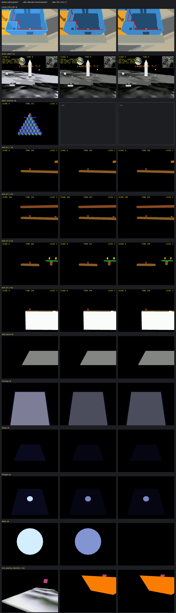

# Exporter: flip the face hand so Blender‑outward is WF‑outward

## Context

WF computes a face normal as `(v2−v0)×(v1−v0)` (`gfx/face.hpi:34`, "kts reversed 12/3/2001
for our handedness"). Blender — and every right‑handed tool — uses `(v1−v0)×(v2−v0)`. The Blender
add‑on's exporter (`wftools/wf_blender/export_level.py`) writes each face's loop order unchanged
and the importer reads it unchanged, so **every mesh that looks right in Blender is inside‑out
in the engine**: culled from outside under `WF_CULL=1`, and lit by the one‑sided lighting from
the far side. Nobody noticed because culling is off by default and inverted lighting still
produces *some* shading; it surfaced building the condo neighbourhood
([surroundings plan](2026-09-19-condo-site-surroundings.md)), where walls and roofs came out
as one flat mass until the script reversed them by hand.

The right place to reconcile the two conventions is the adapter — the exporter/importer — not
every level script. This plan flips the hand there, rebuilds every Blender‑built level, and
records before/after renders so any level whose look depended on the inversion is caught.

## Approach

### 1. The flip (`wftools/wf_blender/export_level.py`)

- Export: write faces as `(tri[2], tri[1], tri[0])` (line 471) — Blender's loop order reversed.
- Import: build faces as `(v3, v2, v1)` (line 373) — so a native `.lev` imported into Blender
  shows correct normals, and import → export is still byte‑identical (the canonical face sort
  happens after the reversal on both sides).
- Module note explaining the hand; nothing else in the exporter changes (UV split, vertex
  canonicalisation, materials are per‑vertex/per‑face and order‑independent).

### 2. Level scripts that compensated by hand

| Script | Now | After the flip |
|---|---|---|
| `condo_639_640/blender_create_condo.py` `box_mesh`, `prism` | `recalc` + `reverse_faces` | `recalc` only |
| … `build_skydome` | `recalc` only (Blender‑outward = WF‑inward) | `recalc` + `reverse_faces` (Blender‑inward) |
| … `site-map` quad | pinned `(0, 3, 2, 1)` (Blender −Z) | `(0, 1, 2, 3)` (Blender +Z) |
| `moon_site01/blender_create_moon.py` `_build_skydome` | `reverse_faces` (Blender‑inward, so currently WF‑outward — culled from inside) | unchanged: becomes WF‑inward, i.e. correct |
| the 14 scripts with the hand box list `[(0,3,2,1),(4,5,6,7),…]` | Blender‑outward (the docs called it "inside‑out under WF's hand") | unchanged: becomes WF‑outward |
| `qbert_practice` cylinder caps / "reversed → normal +Y" | reasoned in Blender's hand | unchanged: now true in WF too |

Rule going forward: **author for Blender** — if `recalc_face_normals` / "Recalculate Outside"
looks right in the viewport, it is right in the engine; a dome the player stands inside is the
only thing that gets `reverse_faces`.

### 3. Tests

- `tests/fixtures/qbert_practice-golden.lev` regenerated (run the test and `cp` the printed output — the regen script the old docstring named never existed)
  — the expected, documented kind of format change.
- New regression guard in `tests/test_blender_addon_export.py`: parse the golden's first box
  mesh and assert its top face's **WF** normal `(v2−v0)×(v1−v0)` points +Z. Pins the hand so a
  future "cleanup" can't quietly undo it.

### 4. The sweep — rebuild every Blender‑built level, render before and after

`scripts/sweep_blender_levels.py` (new): for each level in the table below, capture a frame of
the **current** standalone `.iff` (before), run the level's Blender script + `build_level_binary.sh`,
capture again (after), and write a contact sheet to the plan bundle. Levels whose script needs an
input this machine lacks (a ROM, an external `.blend`) are reported as skipped, not silently
passed. Capture = `wf_game -record_video` for 5 s, last frame (the recorder now runs at level‑clock
speed), with the level's `--vram-*` flags where its run task has them (moon, condo).

| Level | Script | Run task / flags | Notes |
|---|---|---|---|
| condo_639_640 (+ tour) | `blender_create_condo.py` | `run-condo` vram flags | needs `~/docs/aircon/units-639-640.blend` |
| moon_site01 | `blender_create_moon.py` | `run-moon` vram flags | terrain texture, starfield committed |
| qbert_practice | `blender_create_qbert.py` | `run-qbert` | golden source |
| smb_w1_1 … w1_4 | `blender_create_smb*.py` | `run-smb` | in `cd.iff` → `task build-cd-iff` after |
| snowgoons‑blender | round‑trip of the native level | `run-snowgoons` | import→export must stay byte‑identical |
| mm_practice, mm_practice_blender(_rt) | `blender_create_mm_practice.py`, `blender_roundtrip_…` | `run-level` | round‑trip byte check |
| marble‑madness (6 variants) | `blender_mm_*.py` | — | box lists; `rom_to_blender` needs the ROM → skip if absent |
| pilot_demo | `blender_create_pilot_demo.py` | — | |
| treemap, filesys, filelight, dome | `blender_treemap.py` … | `run-treemap` … | box lists; `dome` is an interior — check it survives `WF_CULL=1` |

Judgement per level from the contact sheet: exterior geometry should read *better* (lit from
the camera side); anything that got darker or vanished is a script that had compensated by
hand and needs the table‑2 treatment. Native levels (`snowgoons`, `marble-madness-2`,
text‑authored `.iff`) don't go through the exporter and are untouched.

### 5. Docs

`docs/level-building.md` § winding and `docs/level-design-troubleshooting.md` § backface
culling: replace the 2026‑09‑19 "Blender builds the opposite hand … recalc then reverse" advice
and the "reverse every tuple of the box list" advice with the new rule (author for Blender; the
exporter adapts; `WF_CULL=1` is the check). Keep the engine formula as a footnote for anyone
hand‑writing `.iff` text.

## Mockups

No new visible surface of its own — the change is the correctness of existing surfaces. The
before/after contact sheet the sweep produces is the reviewable artefact:
`docs/plans/2026-09-19-exporter-face-hand/contact-sheet.png` (one row per level, before | after,
plus a `WF_CULL=1` after‑column for the interiors).

## Files

| File | Change |
|---|---|
| `wftools/wf_blender/export_level.py` | reverse loop order on export, on import |
| `wflevels/condo_639_640/blender_create_condo.py` | drop the hand reversals, reverse the dome, `(0,1,2,3)` quad |
| `tests/test_blender_addon_export.py`, `tests/fixtures/qbert_practice-golden.lev` | hand regression test; golden regenerated |
| `scripts/sweep_blender_levels.py` | new — rebuild + before/after capture |
| every Blender‑built level's `.lev`, `*.iff`, `-standalone.iff`, `cd.iff` | regenerated |
| `docs/level-building.md`, `docs/level-design-troubleshooting.md` | winding rule rewritten |
| `docs/plans/2026-09-19-exporter-face-hand/` | contact sheet |

## Findings during the sweep

- **The golden `.lev` never covered face order** (meshes are separate `.iff` files) and was
  already failing on Blender 5.0.1 before this change — the 48 differing lines are float noise in
  `slopeA–D` / a bbox from the 4.0.2 that produced it. Regenerated; the new
  `test_exported_faces_are_wf_outward` is the guard that actually pins the hand.
- **`slope` fields flip sign for imported native meshes** (they are the mean of Blender's
  polygon normals, which now agree with the engine's) — the only `.lev` bytes the importer
  reversal changes; mesh `.iff` files round‑trip byte‑identical.
- **Two committed levels no longer reproduce from their scripts — with either exporter:**
  `qbert_practice` (camshot `Target` exports as the scaffold's `target_14` instead of the renamed
  `Target02` → levcomp can't resolve it → `movecam.cc:310` assert on load; 379 changed lines
  from schema/field drift) and `mm_practice_blender_rt` (zero `slope`, no texture atlas). Both
  restored from HEAD, still in the old hand, filed in TODO. Root cause is ObjRef resolution in the
  restored exporter (`8db74292`), not winding.
- **Re‑light is real on the flat‑table levels:** `treemap`, `filelight`, `dome` and `filesys`
  come out darker — their cells are now lit from the camera‑facing side, which is away from the
  scaffold sun. Correct, but the look changed; tuning their light direction is a follow‑up if
  wanted.

## Verification

1. `pytest tests/test_blender_addon_export.py` — golden matches after regen; the new hand test
   passes and **fails** if the export reversal is commented out.

```
BLENDER_BIN=$(which blender) python3 -m pytest tests/test_blender_addon_export.py -q
2 passed in 3.94s
# with the exporter change stashed:
AssertionError: cube.iff: face (0,1,3) has its WF normal pointing INTO the box (dot -4) — the exporter's hand reversal is missing
1 failed, 1 deselected in 3.65s
```

**PASS**

2. Round trips are byte‑identical: import → export of `snowgoons-blender` with and without the
   reversal produces the same mesh files.

```
identical house.iff / player.iff / quadpatch01.iff / tree02.iff / tree03.iff
DIFFERS .lev   (only slopeA–D, sign-flipped: -0.0248… → +0.0248…)
```

**PASS** (the `.lev` slope sign is the expected consequence — findings).

3. `WF_CULL=1` on the condo: the units' walls, the corridor box, the neighbourhood prisms and
   the podium stay visible from the doll‑house and from both POV cameras; the dome stays
   visible from inside. Same on `dome` (interior) and `qbert_practice` (exterior boxes).

Contact sheet third column (`after, WF_CULL=1`): condo doll‑house intact (before the flip the
same view lost every wall under culling); `dome` intact; `qbert` not rebuilt (findings).

**PASS** for the condo and `dome`; qbert **not run** (stale level).

4. Contact sheet: every level renders after the sweep; exteriors are lit from the camera side;
   list any level that needed a script change beyond table 2.



```
condo_639_640 ok   moon_site01 ok   qbert_practice (after: n/a — assert, see findings)
smb_w1_1..4 ok     pilot_demo ok    treemap ok   filesys ok   filelight ok   dome ok
mm_practice_blender_rt ok (build) — rendered without its texture (see findings)
```

**PASS with two exceptions** (qbert, rt — restored, TODO). No level needed a script change
beyond table 2; the condo's compensations were removed as planned.

5. `task video-condo-639` → `RESULT: PASS`; `task build-cd-iff` succeeds with the rebuilt SMB
   levels.

```
RESULT: PASS  wflevels/condo_639_640/tour-639.mp4 (40.400000s, 640x480; raw 44.6s, speed x1.12; 11 rooms)
  L4: 167936 bytes at sector 281 (snowgoons-standalone.iff)
  L5: 366592 bytes at sector 363 (qbert_practice-standalone.iff)
```

**PASS**
