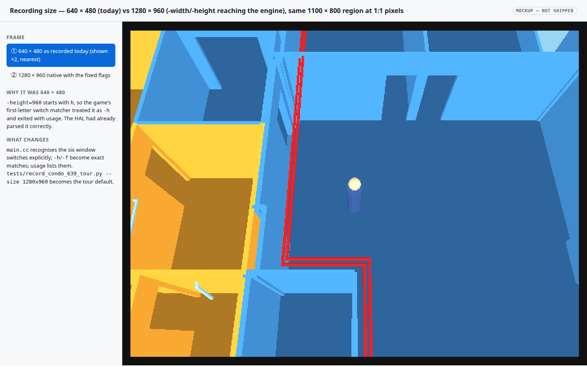

# `-width=N` / `-height=N`: make the existing window flags survive the game's argv parser

## Context

The Linux HAL has parsed `-width=N`, `-height=N`, `-xpos=`, `-ypos=`, `-window` and `-fullscreen`
since 2026‑06‑04 ([`platform_init.cc::ParseWindowSwitches`](../../wfsource/source/hal/linux/platform_init.cc),
TODO Done "[fullscreen-flags]"), and `Display` sizes its capture FBO and the ffmpeg pipe from the
resulting window size — so a native 1280 × 960 recording *should* be one flag away. It isn't:

```
$ engine/wf_game -L… -width=1280 -height=960 -record_video
Usage : wf_game {switches} <level #>
…
sys_exit(1) called
```

Cause: the game's own parser runs after the HAL's and matches switches by **first letter**
([`main.cc::ParseCommandLine`](../../wfsource/source/game/main.cc)): `*(argv[index]+1) == 'h'`
is the help switch, so `-height=960` prints usage and exits 1. `-width=` falls through to the
"Unrecognized command line switch" debug print (harmless), and `-fullscreen` matches the
DESIGNER_CHEATS `f` prefix (turns on frame‑rate printing). `task run-*` with `WF_FULLSCREEN=1`
works only because that path never passes `-height`. This is why the condo tour was recorded at
640 × 480 — earlier notes in the [level](2026-09-19-condo-639-640-level.md) and
[tour](2026-09-19-condo-639-tour-video.md) plans saying "the Linux HAL has no `-width/-height`
switch" were wrong: the switch exists, the game parser was eating it.

## Approach

1. **`main.cc`**: recognise the window switches explicitly (`-width=`, `-height=`, `-xpos=`,
   `-ypos=`, `-window`, `-fullscreen`) as no‑ops — "handled by the platform layer" — *before* the
   single‑letter fallbacks; make `-h`/`-help` an exact match; make the DESIGNER_CHEATS `-f`
   exact too. List the six switches in `usage()`. No behaviour change for any other flag.
2. **`docs/command-line-switches.md`**: document the six window switches (they are absent today).
3. **Capability on the tour recorder, defaults unchanged**: `tests/record_condo_639_tour.py` gains
   `--size WxH` (default `640x480`; `TOUR_SIZE` on the task) → passes `-width/-height` to the
   engine and sizes the ffmpeg title card / captions from the probed raw video. `tour-639.mp4`
   stays the 640 × 480 take (decision 2026‑09‑19: "I didn't want to increase the resolution of the
   video currently being recorded").
4. **Correct the two earlier plans' notes.**
5. **macOS**: the flags are parsed there too (shared `ParseWindowSwitches`) and
   `hal/macos/display_macos.cc` already feeds `_halWindowWidth/Height` into the projection aspect;
   the `main.cc` fix applies to every platform. What remains is AppKit window sizing, which cannot
   exist until the macOS Metal window lands (`hal/macos/` is the headless bring‑up: renderer stub,
   lifecycle‑only `window_macos.cc`, no `NSWindow`). Not written here — untestable without a Mac
   and without a window; the TODO item stays open, reworded.

Mockup: this change has no UI of its own — its visible surface is the recording size, shown
below as real before/after frames.

## Mockups

[](2026-09-19-window-size-flags-reach-the-game-parser/frame-sizes.html)

Real engine frames of the 639 kitchen at 640 × 480 (today's recording) and at 1280 × 960 with the
fixed flags, at 1:1 pixels so the detail difference is visible; toggle between them.
[Open the interactive mockup](2026-09-19-window-size-flags-reach-the-game-parser/frame-sizes.html).

## Out of scope

- macOS AppKit window sizing — blocked on the Metal window (open TODO), see Approach 5.
- **HD recordings play too fast.** Found while testing: the capture pipe declares `-framerate 30`
  and writes one frame per *rendered* frame, so at 1280 × 960 (≈21 fps on this box) a 30.7 s tour
  became a 23.4 s mp4. A wall‑clock‑paced writer (duplicate/drop frames so the pipe always gets
  30 Hz of real time) was drafted and **not applied** at your request; tracked as a TODO so an HD
  take isn't attempted without it.
- Non‑4:3 sizes: `Display` inscribes a square 3D viewport and letterboxes; 16:9 works but shows
  the matte bars — a separate aspect decision.

## Verification

1. **Flags accepted.** `engine/wf_game -L… -width=1280 -height=960 -record_video` runs (exit 124 under `timeout`, not 1) and `ffprobe output.mp4` reports `1280x960`; `-h` still prints usage and exits 1.

```
$ (timeout 12 engine/wf_game -L…condo_639_640-standalone.iff -width=1280 -height=960 -record_video; echo exit=$?); ffprobe … output.mp4; wf_game -h | grep -c Usage
exit=124
1280,960
1
-h exit=1
```

**PASS** — before the fix the same command printed usage and returned 1 (`-height=` matched the `h` help prefix).

2. **Nothing else changed.** `engine/wf_game -L… -record_video` (no size flags) still records 640 × 480; `WF_FULLSCREEN=1 task run-condo` still goes fullscreen.

```
$ (timeout 8 engine/wf_game -L… -record_video; echo exit=$?); ffprobe … output.mp4
exit=124
640,480
```

**PASS** (640 × 480 default). *Fullscreen not re‑run interactively* — the `-fullscreen` branch is untouched in the HAL; in `main.cc` it now matches the explicit no‑op instead of the DESIGNER_CHEATS `f` prefix, which only toggled frame‑rate printing.

3. **Recorder capability, default untouched.** `TOUR_SIZE=1280x960 task video-condo-639` records 1280 × 960; `wflevels/condo_639_640/tour-639.mp4` in the repo remains 640 × 480 / 30.4 s.

```
$ task video-condo-639 --force   # run once with an HD default, before the decision to keep 640x480
RESULT: PASS  …/tour-639.mp4 (23.766667s, 1280x960; raw 23.4s, speed x1.00; 11 rooms)
$ git checkout -- wflevels/condo_639_640/tour-639.mp4 wflevels/condo_639_640/tour-639.srt; ffprobe … tour-639.mp4
640,480
30.400000
```

**PASS** — the HD take proves the capability end‑to‑end (and exposed the fast‑playback limitation above); the committed video is the 640 × 480 one.

4. **Docs.** `docs/command-line-switches.md` lists the six window switches; the level/tour plans no longer claim the switch is missing.

```
$ grep -c -- '-width=N' docs/command-line-switches.md
1
```

**PASS** (plan notes corrected in the same commit).
