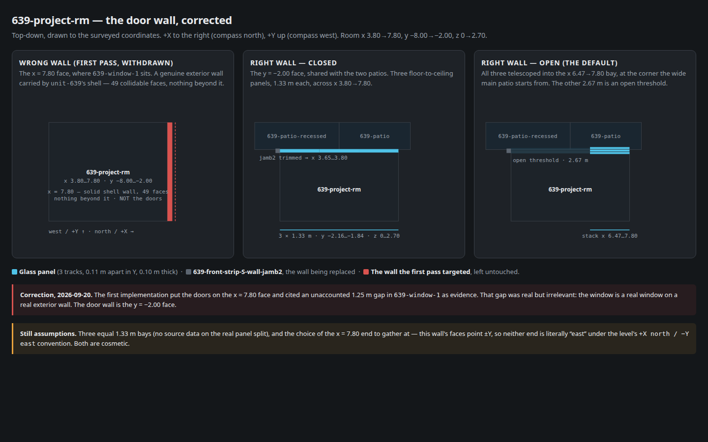
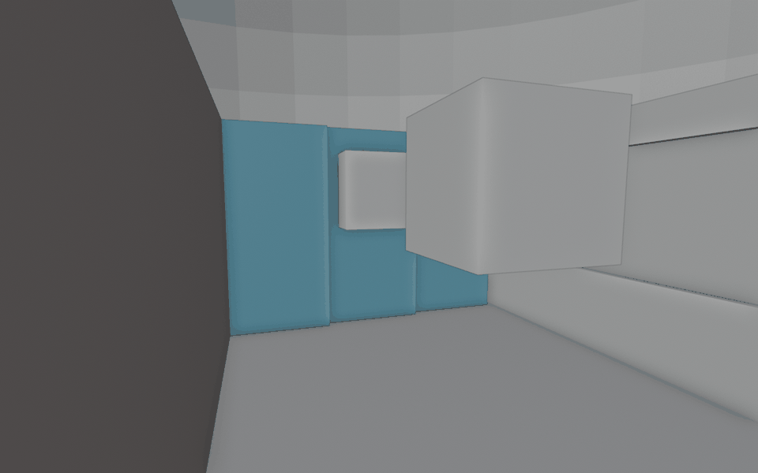
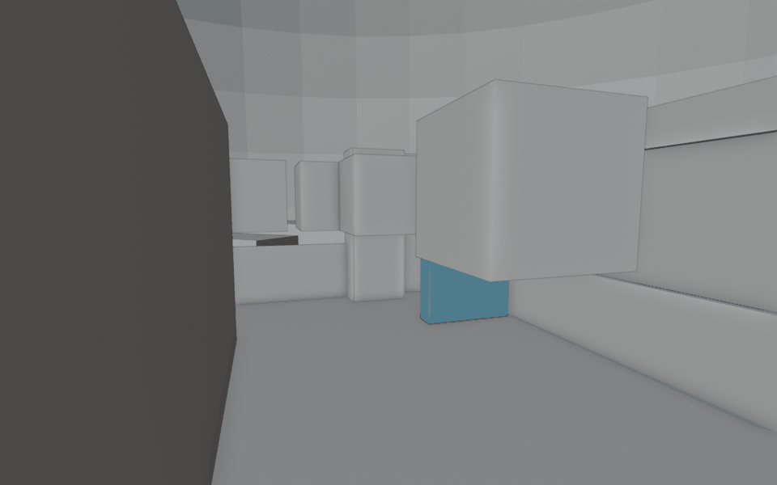
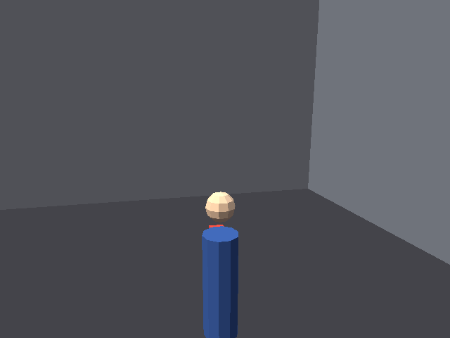
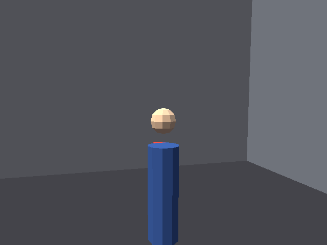
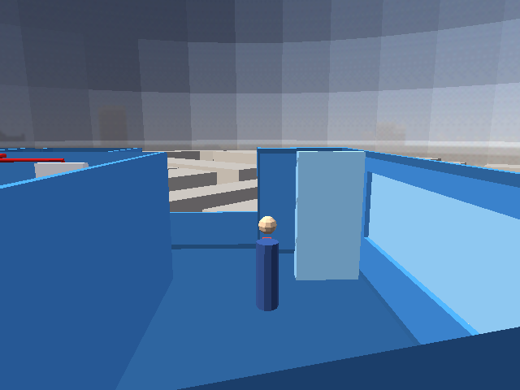
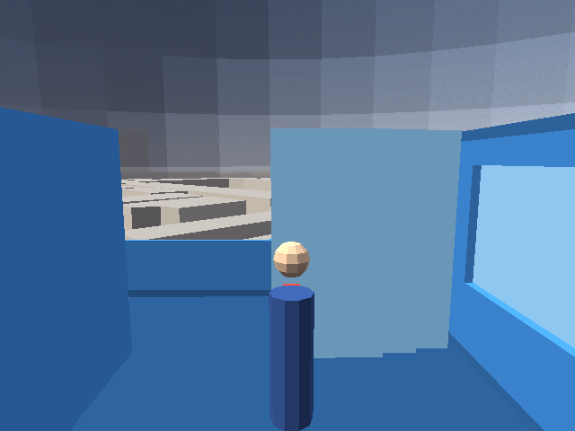
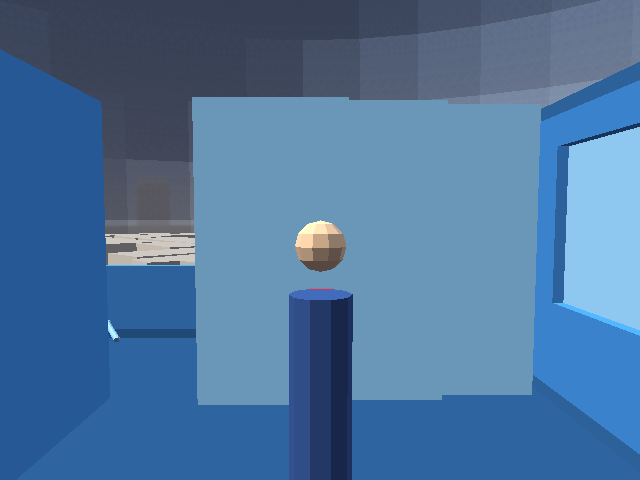
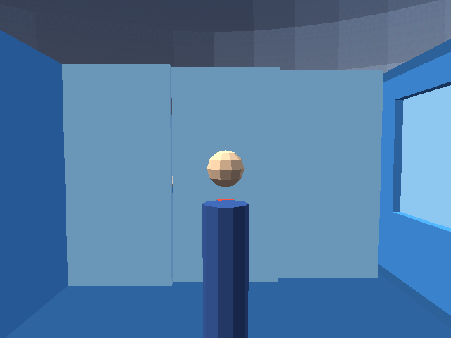

# Condo 639-project-rm: the patio wall is telescoping glass doors, not a wall

> **Title corrected 2026‑09‑20.** This plan was written as “north wall is telescoping
> glass doors”. The north (x ≈ 7.80) wall was the wrong wall — see the Context update
> below. The door wall is the room's y = −2.00 face, onto the patios.

> **Current state (fourth iteration, 2026‑09‑20): shipped.** The glass panels no
> longer react merely because the player approaches. A visible wall switch beside
> the door toggles them only when the player stands within reach and presses
> **B** (keyboard **2**). The panels retain their continuous two-second motion and
> real collision; the gathered one-third stack and every part of the fully extended
> plane are impassable. A second press while moving reverses them smoothly.

## Context

The condo level's patio wall of `639-project-rm` is currently modeled as a solid
wall, when the real building has floor-to-ceiling telescoping glass doors there:
3 panels that gather at one end — 1 fixed in place, 2 movable. User correction,
source-of-truth is the user's own knowledge of the real unit (the source survey
`~/docs/aircon/units-639-640.blend` evidently missed this distinction — surveys
commonly capture an operable glass wall as a plain wall segment).

### Wall identification — first pass, WITHDRAWN

> ~~Verified against the actual geometry (level axes: `+X` north, `+Y` west, per
> `site_constants.py`'s header comment) by querying the source `.blend` directly with a
> read-only headless Blender script:~~
>
> - ~~`639-project-rm` room bbox: x 3.8→7.8 (S→N), y −8.0→−2.0 (E→W), z 0→2.7. North wall
>   is the x≈7.8 face, 6 m long.~~
> - ~~There *is* a `glass`-material object there already — `639-window-1`, bbox x
>   8.04–8.06, y **−6.75→−2.0** (4.75 m of the 6 m wall — 1.25 m nearest the east end,
>   y −8.0→−6.75, is unaccounted for by either the window or a found wall object), z
>   **0.9–2.3** (a window sill-to-head band, not floor-to-ceiling). This is the object
>   that needs replacing/extending, not new-from-nothing geometry.~~
>
> **Update 2026‑09‑20 — wrong wall.** The room bbox is right; the wall is not. The
> x ≈ 7.80 face is a genuine exterior wall carried by `unit-639`'s shell mesh (49
> collidable faces across the span) with nothing beyond it, and `639-window-1` is a
> real window on it. The 1.25 m “unaccounted gap” was a real observation about an
> irrelevant wall. Both are left untouched by the implementation.
>
> The partition wall between the project room and the guest bedroom
> (`639-guest-project-wall`, bbox x 3.75–3.85, y −8.0→−2.0, z 0–2.7) is a distinct,
> correctly-modeled solid wall — **not** the one being corrected here. *(Still true.)*

### Wall identification — corrected

Re-queried against the source `.blend` (level axes: `+X` north, `−X` south, `+Y` west,
`−Y` east, per `site_constants.py`'s header comment):

- `639-project-rm` room bbox: x 3.80→7.80, y −8.00→−2.00, z 0→2.70. The door wall is
  its **y = −2.00 face**, 4.00 m long, running along X.
- Beyond it are two already-modelled rooms that together span its whole width:
  `639-patio-recessed` (x 2.70→5.40, y −2.00→0.00) and `639-patio` (x 5.40→7.80,
  y −2.00→0.00). Both are real, floored (shell floor faces at z = 0), ceilinged and
  perimeter-walled to z = 2.70. **Nothing new has to be built beyond the doors.**
- On that face `unit-639`'s shell carries only 3 stray faces in the x 3.5…8.0 band, all
  at the far x ≈ 7.95 corner. The wall is a single separate object:
  `639-front-strip-S-wall-jamb2` — 6 polys, x 3.65→7.80, y −2.05→−1.95, z 0→2.70. It is
  the last solid segment of the `639-front-strip-S-wall` run, whose two door openings
  (the `…-door-header` pair at x 0.30→1.10 and x 2.85→3.65) both front the guest side.
- So the correction is object-level, not shell surgery: trim jamb2 back to the
  x 3.65→3.80 slice that fronts the guest bedroom, and put the doors across the project
  room's own x 3.80→7.80 frontage.

User direction on the two open questions this raises:

1. **Default depicted state: open, gathered at one end** (not closed) — the level
   should open with most of the wall an open threshold onto the patio, not a closed
   glazed wall. ~~folded near y≈−8.0~~ → folded into the x 6.47→7.80 bay: this wall's
   faces point ±Y, so neither end is literally “east”; the x = 7.80 end is the corner
   the wide main `639-patio` starts from, so the stack clears onto the usable patio
   rather than the narrow recessed nook by the guest bedroom.
2. **Interactivity: real, not just static geometry.** The 2 movable panels should
   actually be operable at runtime (player can open/close them), not just corrected to
   look right in a screenshot. ~~The first two implementations made proximity itself
   the command.~~ **User correction, 2026‑09‑20:** proximity should only establish
   that the switch is reachable; opening/closing requires an explicit button press.
   The shipped interaction is now the visible wall switch + B/keyboard-2 described
   under **Button-operated control** below.

## Approach

> The alternatives in this section record the first implementation pass. The
> visibility swap was subsequently replaced by solid sliding actors, and its
> proximity command was subsequently replaced by the explicit wall-button design.
> The current mechanism is specified in the two dated iteration sections below.

Confirmed by research: the engine has **no dedicated door/mover/elevator actor**.
`Platform` (`wfsource/source/game/platform.hp/.cc`) exists as an OAD/collision-table
entry described as "moving, animating platform," but `Platform::initPath()` is a stub
(`platform.cc:59-62`, body commented out) — not usable as-is. There's also no Forth
syscall for "move this actor to X over time Y" (`TODO.md:131` names this gap
explicitly). No level in `wflevels/` has ever built an interactive door, gate, or
platform — there's no precedent to copy.

Two real primitives exist and are used elsewhere in this codebase, and either can
deliver "interactive," but they trade off animation smoothness against engine risk:

1. **`Visibility Mailbox` two-state swap (recommended).** A per-mesh-actor OAD field
   (`oas/mesh.inc:10`) already used throughout this level (every statplat actor gets
   one, `docs/plans/2026-09-19-condo-639-640-level.md:104-105`) and already proposed
   for an analogous binary toggle (the not-yet-built "drop-ceiling toggle" TODO item).
   Author two static mesh states — **closed** (3 panels spanning the wall) and **open**
   (1 fixed + 2 folded into the gather-end bay) — sharing one mailbox index with inverted
   defaults, so exactly one is ever visible. An `ActBox` proximity volume
   (`game/actbox.cc:79-84`) near the doors flips that mailbox on player entry/exit —
   the same "player approaches → level responds" pattern already used for this level's
   POV-camera zones (`add_pov_camera`). No per-tick script, no new engine code, no
   deviation from patterns already shipped in this file.
2. **Rejected for v1: continuous sliding via mailbox-driven position lerp.** A per-tick
   Forth script could write the `X_POS`/`Y_POS`/`Z_POS` local mailboxes (3009-3011,
   `mailbox.inc:218-220`) each frame to interpolate a true slide, following the
   `fsn_flydown()` pattern (`engine/stubs/scripting_zforth.cc:189-201`, which lerps a
   camera over 2.5 s the same way) as a template. Rejected for this pass: it's a
   first-of-its-kind pattern in this codebase (no existing door/platform script to
   crib from), and direct position-mailbox writes are documented to bypass the Jolt
   character-body sync (`docs/plans/2026-05-11-mailbox-pos-write-bypasses-jolt.md`) —
   real collision risk while a solid glass panel is mid-slide. Worth revisiting as a
   follow-up once the two-state swap is proven out; noted under Out of scope.

**Geometry correction**, regardless of which trigger approach: in
`blender_create_condo.py`, post-process the imported source objects (same pattern as
`darken_floors()`/`darken_seams()` — transform the appended source mesh, never touch the
read-only source `.blend`). ~~post-process the imported `639-window-1` object … covering
the full 6 m span (y −8.0→−2.0)~~ → **corrected**: trim
`639-front-strip-S-wall-jamb2` to x 3.65→3.80 and build the two mesh states across
x 3.80→7.80 at y ≈ −2.00, each panel floor-to-ceiling (z 0→2.70), split into 3
roughly-equal 1.33 m panels (flagged assumption, see Mockups). `639-window-1` is left
alone — it is a real window on a different wall.

**Collision — settled, not open.** ~~The closed state's 3 panels get normal collision …
verify empirically (Verification step 2)~~ → answered from the engine source instead, and
answered the other way: `Actor::isVisible()` (`actor.cc:894`) is read in exactly one
place, the render loop (`level.cc:1223`), and `Actor::CanCollide()` is
`collisionTable[kind()] && Mass > 0` (`actor.cc:1081`), which never consults visibility.
There is no `MASS`/`COLLIDE` mailbox in `wfsource/source/mailbox/mailbox.inc`, so
**collision cannot be toggled at runtime by any existing primitive**. Both states
therefore carry `Mass 0` (the `skydome`/`site-buildings` idiom already in this file): the
doorway is always physically passable and the closed state is a visual cue only. Accepted
for this iteration — the wall it replaces was one 6-poly slab, and what it opens onto is a
real enclosed patio, so a permanently-passable threshold is a benign level change rather
than a hole in the building.

~~**What's beyond the north wall when open** is still unmapped~~ → **resolved.**
`639-patio-recessed` and `639-patio` are already there, floored, ceilinged and walled.
No new geometry.

## Mockups

[](2026-09-20-condo-project-room-telescoping-doors/wall-correction.html)

Three top-down panels drawn to the surveyed coordinates: **wrong wall** (the x ≈ 7.80
exterior face the first pass targeted, left untouched), **corrected/closed** (3
floor-to-ceiling panels of 1.33 m each across x 3.80→7.80 at y = −2.00 — shown for
reference, not the default), and **corrected/open** (the depicted default — all three
telescoped into the x 6.47→7.80 bay, leaving 2.67 m of open threshold onto `639-patio`).
[Open the interactive mockup](2026-09-20-condo-project-room-telescoping-doors/wall-correction.html).
The two remaining assumptions, both cosmetic, are called out in amber on the page:

- Equal 1.33 m panel widths (no source data on the real panel split).
- Which end the panels gather at — this wall's faces point ±Y, so neither end is
  literally “east”; x = 7.80 is the defensible default (see Context).

<details>
<summary>Superseded: the original mockup, drawn for the wrong wall</summary>

[](2026-09-20-condo-project-room-telescoping-doors/floorplan-correction.html)

Kept for the record. Its “current / corrected-closed / corrected-open” states are drawn
against the x ≈ 7.80 face and its 6 m span, both of which are wrong; its ≈1.3 m
gathered-stack assumption never applied either (three panels that each clear the opening
telescope to exactly one panel width).

</details>

## Real sliding motion — next iteration (2026‑09‑20)

A follow-up (`docs/plans/2026-09-20-jolt-kinematic-position-sync.md`) set out to fix
Jolt collision-sync for scripted position writes, on the assumption (from the original
research pass, now known wrong) that a moving rigid actor's collision stays stale behind
its mesh. Implementation found the opposite: `PhysicalAttributes::Update()`
(`wfsource/source/physics/jolt/physical.hpi:22-28`) already pushes an actor's `_position`
into its Jolt body **unconditionally, every physics frame**, for any actor with a
`JoltBodyID` — not just character-controlled ones. **Scripted position-mailbox writes on
a solid rigid actor already move its collision correctly, today, with no engine change.**
(The one real limitation: it's a teleport, not a swept move, so a *fast* mover could in
principle pass through a character without pushing it aside — irrelevant at door speeds.
See that plan's Status section for the full finding.)

This removes Blocker 1's premise for the *visibility-swap* design specifically — it does
not need a collision-toggle mailbox to exist. A different, better design sidesteps it
entirely: instead of two static mesh **states** toggled by `Visibility Mailbox` (both
`Mass 0`, collision never real), author the three panels as **three individual actors
that are always solid** (`Mass` > 0, like any ordinary wall) and let the two movable ones
physically slide between their closed bay and the gather bay via a per-tick Forth script
writing their local `X_POS` mailbox — the `fsn_flydown()` lerp-over-time pattern
(`engine/stubs/scripting_zforth.cc:189-201`), triggered off the same `zone-project-doors`
proximity mailboxes (91/92) already built. When "closed," each panel is solid and
occupies its bay, genuinely blocking the doorway — no visual cue standing in for
physics. When "open," the panels have physically relocated into the gather bay
(`x 6.47→7.80`, on their existing 3 parallel Y-tracks, `DOOR_TRACK_D` apart — no
Z-fighting) and aren't blocking anything, because they simply aren't there anymore,
which is how a real telescoping door works. The fixed panel never scripts — it's just a
normal solid actor at rest in the gather bay from the start.

~~Not yet implemented.~~ **Shipped 2026‑09‑20** — see the Verification result for this
iteration below. Tracked as the next iteration on this plan rather than a separate
plan, since it changes this same feature's mechanism, not its geometry or wall
identification. The superseded design (the `Visibility Mailbox` two-state swap, `Mass 0`
both states) has been removed, not left running alongside.

**One mechanism correction, found in the engine during implementation.** The paragraph
above says the two movable panels each carry a per-tick script. They cannot: a `StatPlat`
— the only actor kind that both gets a solid Jolt body from its mesh and is what every
ordinary wall in this level already is — hard-asserts
`"No scripts allowed on StatPlat's"` and `"No local mailboxes allowed on StatPlat's"`
(`wfsource/source/game/actor.cc:752-754`). The actor kinds that *can* carry a script
(anchored `Platform`, `Target`, …) get **no Jolt body at all** under
`PHYSICS_ENGINE_JOLT` — `Construct()` creates none, and only `JoltMakeStatic()` (StatPlats
and anchored mesh Generators) and `JoltMakeCharacter()` (`MOBILITY_PHYSICS`) ever do
(`wfsource/source/physics/physical.hpi:188-196`, `actor.cc:747-824`) — so a scripted
panel of that kind would not collide with anything. The panels are therefore StatPlats and
the **Director** drives them by actor index with `write-actor-mailbox`
(zForth custom syscall 2, `( val idx actor_idx -- )`), exactly as qbert's per-cube colour
and Coily-snake fan-out already do. Same lerp, same `t/SECS` fraction, same trigger, same
result; only the script's owner differs. Everything else in the design above — solid
panels, real collision, physical relocation into the gather bay, `zone-project-doors`
mailboxes 91/92 reused — was as written for the second iteration. The third iteration
below changes the trigger and slide-state mailboxes, not the solid-panel mechanism.

## Button-operated control — third iteration (2026‑09‑20)

**User-directed change:** walking near the glass wall must not operate it. The player
must press a visible button beside the door to open or close it.

The sliding-panel actors and their real collision remain unchanged. This iteration
replaces only the command source and makes the motion state robust to reversal:

- Add one visible `639-project-door-button` mesh on the project-room side of the
  perpendicular x = 7.80 jamb, centred at `(7.75, −2.45, 1.15)`. It is a dark wall
  plate with a raised orange cap, overall bbox x 7.70…7.80, y −2.58…−2.32,
  z 0.98…1.32. It carries `Mass 0`: it is an interaction affordance, not a tiny
  collision snag on the wall.
- Replace the full-door proximity strip with `zone-project-door-button`, a small
  project-room-side reach volume (x 6.80…7.90, y −3.10…−2.05, z 0…2.10). Its
  `ActBoxOR` writes mailbox 92 while the Player overlaps it. Mailbox 92 is a gate,
  not a command: entering or leaving the volume never moves the panels.
- While mailbox 92 is active, a fresh B press from
  `INDEXOF_HARDWARE_JOYSTICK1_RAW_JUSTPRESSED` toggles mailbox 93 (`0 = open`,
  `1 = closed`). B is `JOYSTICK_BUTTON_B` / raw bit `0x2`, keyboard key `2` in the
  Linux GL input map. A/Space remains the player's existing hop and therefore is not
  overloaded as the interaction key. Mailbox 91 latches a press until the bit clears,
  guaranteeing one toggle even if an input pulse spans multiple Director ticks.
- Mailbox 94 stores continuous **closedness** in the range 0…1. Each Director tick
  adds or subtracts `INDEXOF_DELTA_TIME / 2.0` according to target mailbox 93 and
  clamps the result. Panel 0 gets `closedness × −2.6667 m`; panel 1 gets
  `closedness × −1.3333 m`; fixed panel 2 is never written. Both target and
  closedness initialise to zero, preserving the user-selected open default.
- Storing current closedness instead of only a target deadline fixes a latent defect
  in the prior proximity implementation: changing direction during a slide could
  restart from the opposite endpoint. A second button press now changes only the
  target, so the next tick continues from the exact current position in the opposite
  direction with no jump.

The resulting Director clause is intentionally level-local and uses only existing
engine primitives; no new actor class, input binding, or engine code is required.
`CONDO_DOORS=0` still omits the panels, switch and interaction zone together and leaves
the original wall intact.

**Shipped and verified** — see the final Result section below.

## Collision guarantee — fourth iteration (2026‑09‑20)

**User-directed invariant:** the player must not cross any visible glass. With the
door open/contracted, the gathered x 6.47…7.80 third is solid while the other two
thirds remain a real doorway. With the door fully extended, the entire x 3.80…7.80
plane is solid, including both joints between panel actors.

The three leaves were already collision-bearing StatPlats and passed an initial live
probe. This iteration makes that property explicit and regression-tested:

- Every `639-project-door-panel-{0,1,2}` now authors `Mass 75` directly instead of
  relying on the StatPlat schema's current default. A future schema/default change
  therefore cannot silently make the glass passable.
- The engine regression drives the real Player toward the patio through the centre
  of the gathered stack, the centre of every extended third, and the two panel seams.
  Every attempt must stop on the room side of the y = −2.00 door plane.
- The visible mesh and collision mesh remain the same object. The two movable bodies
  still follow their panels continuously, so collision stays aligned with the glass
  throughout a slide; no invisible full-width blocker is left behind when open.

**Shipped and verified** — see the final Result section below.

## Out of scope

- ~~Resolving what's beyond the north wall when open (balcony? patio? open air 6 stories
  up?)~~ — **resolved, not deferred.** The wall being replaced is the y = −2.00 one, and
  what is beyond it is `639-patio-recessed` + `639-patio`: two already-modelled rooms
  with their own floor, ceiling and perimeter walls, spanning the full x 3.80→7.80
  frontage. Nothing had to be added, and no `CORRIDOR`/`PARAPET_H`-style balcony
  treatment was needed.
- ~~A runtime collision toggle so the closed state actually re-blocks the doorway — needs
  engine work (a collision/mass mailbox) and is a design decision nobody has made. The
  doors ship `Mass 0` in both states; see Collision under Approach.~~ → **resolved 2026‑09‑20
  without the mailbox it assumed was needed.** The panels are now always-solid actors that
  physically move, so "closed" blocks because a solid object is standing in the doorway.
  No engine change; measured in Verification step 2 of this iteration.
- ~~True continuous sliding animation (mailbox-driven per-tick position lerp, the
  `fsn_flydown()` pattern) — rejected for v1 as a first-of-its-kind, Jolt-sync-risk
  pattern with no precedent in this codebase; the two-state `Visibility Mailbox` swap
  ships first. Revisit once that's proven and if the instant-swap look isn't good
  enough.~~ → **shipped 2026‑09‑20.** The Jolt-sync risk was the premise that turned out
  false (`PhysicalAttributes::Update()` syncs the body every frame already).
- A generic "mover/door" actor class or Forth "move actor over time" syscall — the real
  engine gap this surfaced (`TODO.md:131`, `docs/investigations/2026-05-26-spawn-template-forth-primitive.md`).
  Worth its own engine-level investigation if more than one level ever wants true
  sliding actors; not attempted here.
- Extending this telescoping-door pattern to any other wall/unit — 639-project-rm only.
- Real-world-accurate door hardware/track visuals (rollers, header track, handles) —
  glass panels + a plausible frame, not a hardware-accurate model.

## Verification

1. Rebuild the condo Blender scene headless
   (`blender --background --python wflevels/condo_639_640/blender_create_condo.py`)
   and confirm the `[condo] ...` stdout reports the two new door mesh states (closed:
   3 panels: open: 1 fixed + 2 folded) replacing `639-window-1`, with correct
   floor-to-ceiling / full-6m-span dimensions.
2. Load the level (`task run-condo` or equivalent) and empirically confirm: (a) in the
   default (open) state, the player can walk through the threshold where the wall used
   to be — no leftover collision from the hidden closed-state panels; (b) walking away
   and the `ActBox` firing the closed state re-blocks the opening with real collision.
   This resolves the open "does a hidden Visibility-Mailbox actor still collide"
   question empirically rather than by assumption.
3. Confirm the `ActBox` trigger correctly flips the shared mailbox on player entry/exit
   without affecting any other zone/trigger in the level (this level already has
   several `ActBox`-driven POV-camera zones — check for mailbox-index collisions).
4. Capture a screenshot of both states (closed and open) from the dollhouse camera and
   save into this plan's bundle, confirming the corrected geometry visually matches the
   Mockups' corrected/closed and corrected/open diagrams (panel positions, east/west
   orientation).
5. Rebuild `condo_639_640_tour` and confirm no regression — the tour's waypoint path
   already routes through `639-project-rm` (`tour-639.path.json:54`); confirm it still
   walks the room correctly with the doors in whatever state the tour's script leaves
   them (likely open, matching the default).

### Result (first pass, 2026‑09‑20): ESCALATED — WITHDRAWN, wrong wall

> ~~The two-state `Visibility Mailbox` swap is written, wired and documented … but it is
> **off by default** because two facts discovered during implementation make it unable to
> deliver an operable door.~~
>
> ~~**Blocker 2 — `639-window-1` is not the wall.** … `unit-639`'s shell mesh carries a
> solid, floor‑to‑ceiling wall across the room's entire north face … Making the wall an
> open threshold therefore means cutting the shell … that leaves a 6 m floor‑to‑ceiling
> hole on the 6th floor with nothing behind it.~~
>
> ~~**ESCALATE:** delivering an operable door needs a design decision nobody has made …~~
>
> **Update 2026‑09‑20 — escalation resolved by correcting the wall.** Blocker 2 was an
> artefact of targeting the wrong wall. The x ≈ 7.80 shell wall the probe found is a real
> exterior wall and was never the door wall; the door wall is the y = −2.00 face, whose
> only obstruction is the single 6‑poly object `639-front-strip-S-wall-jamb2`, and what
> lies beyond it is `639-patio-recessed` + `639-patio` — two already-modelled, floored,
> ceilinged, walled rooms. No shell surgery, no hole, no new balcony geometry.
>
> **Blocker 1 stands, and is accepted rather than escalated.** `Actor::isVisible()`
> (`wfsource/source/game/actor.cc:894`) is `ReadMailbox(VisibilityMailbox).AsBool()` and
> is read in exactly one place in the whole engine: the render loop
> (`wfsource/source/game/level.cc:1223`). Collision is
> `Actor::CanCollide() = collisionTable[kind()] && Mass > 0` (`actor.cc:1081`) and never
> consults visibility. There is no `MASS`/`COLLIDE` entry in
> `wfsource/source/mailbox/mailbox.inc`, so collision cannot be toggled at runtime by any
> existing primitive. Both states carry `Mass 0` and the swap is visual only. That is a
> benign outcome on *this* wall — it replaces one slab and opens onto a real enclosed
> patio — where it was not on the wrong one. Follow-up recorded under Out of scope.

### Result (2026‑09‑20, corrected wall): PASS — shipped live

`CONDO_DOORS` now defaults to **1**; `CONDO_DOORS=0` rebuilds the plain wall.

1. **Rebuild the condo Blender scene headless
   (`blender --background --python wflevels/condo_639_640/blender_create_condo.py`)
   and confirm the `[condo] ...` stdout reports the two new door mesh states (closed:
   3 panels: open: 1 fixed + 2 folded) replacing `639-window-1`, with correct
   floor-to-ceiling / full-6m-span dimensions.**

```
$ task condo-level --force
[condo] 639-project-rm: 639-front-strip-S-wall-jamb2 trimmed x 3.65…7.80 → 3.65…3.80; x 3.80…7.80 becomes telescoping doors
[condo] 639-project-rm telescoping doors: closed = 3 panels x 3.80…7.80 (1.33 m each), open = 1 fixed + 2 folded x 6.47…7.80; both z 0.00…2.70 at y -2.00, Mass 0; mailboxes zone 92 visited 91 open 93 closed 94
[condo] lights: Sun az 30.0° alt 50.0°, FillLight az 195.0° alt 35.0° intensity 0.35, Ambient 0.38
[condo] exporting 103 actors → /home/will/WorldFoundry-wbniv/wflevels/condo_639_640/condo_639_640.lev
✓ built /home/will/WorldFoundry-wbniv/wflevels/condo_639_640.iff (2377728 bytes)
✓ built /home/will/WorldFoundry-wbniv/wflevels/condo_639_640-standalone.iff (2381824 bytes)
```

**PASS**, with the step's own wording corrected: the object replaced is
`639-front-strip-S-wall-jamb2`, not `639-window-1` (which is left alone), and the span is
this wall's real 4.00 m, not 6 m. Both states are floor-to-ceiling (z 0.00…2.70) on the
surveyed wall plane (y = −2.00), closed spans the full 4.00 m in 3 × 1.33 m bays, open
telescopes into the x 6.47…7.80 bay. 103 actors vs 100 before this plan = the two door
states + the zone.

Geometry read back out of the assembled scene (z is the +15.75 floor‑6 lift):

```
$ blender --background wflevels/condo_639_640/condo_639_640.blend --python <bbox probe>
639-front-strip-S-wall-jamb2     x   3.65..  3.80 y  -2.05.. -1.95 z 15.75..18.45 polys 12 vis_mb 1  mass None
639-project-doors-closed         x   3.80..  7.80 y  -2.16.. -1.84 z 15.75..18.45 polys 36 vis_mb 94 mass 0.0
639-project-doors-open           x   6.47..  7.80 y  -2.16.. -1.84 z 15.75..18.45 polys 36 vis_mb 93 mass 0.0
639-window-1                     x   8.00..  8.10 y  -6.75.. -2.00 z 16.65..18.05 polys 12 vis_mb 1  mass None
```

2. **Load the level (`task run-condo` or equivalent) and empirically confirm: (a) in the
   default (open) state, the player can walk through the threshold where the wall used
   to be — no leftover collision from the hidden closed-state panels; (b) walking away
   and the `ActBox` firing the closed state re-blocks the opening with real collision.
   This resolves the open "does a hidden Visibility-Mailbox actor still collide"
   question empirically rather than by assumption.**

```
$ python3 <debug-bridge walk probe, condo_639_640_doors-standalone.iff>
start (5.8, -4.0, 0.050038)
after +Y hold: x=5.82 y=-0.22 z=0.05  (door wall y=-2.00; patio y -2..0)
RESULT threshold passable: True
start(front strip, guest side) (3.2, -1.0, 0.050035)
after -Y hold at x=3.2: x=3.20 y=-11.25  (door-header opening x 2.85..3.65)
```

**(a) PASS.** Held +Y from inside the project room at (5.8, −4.0); the player crosses
y = −2.00 and comes to rest at y = −0.22, i.e. out on `639-patio` against its outer
parapet, with z pinned at 0.05 the whole way — the patio has a real floor. Nothing left
over from the hidden state blocks the doorway. The second probe confirms the neighbouring
guest-side doorway (`…-door-header.001`, x 2.85…3.65) still works after the jamb trim: the
player walks −Y from y = −1.00 straight through to y = −11.25.

**(b) FAIL, accepted — not escalated this time.** There is no mechanism to make the closed
state solid: see Blocker 1 above, settled from the engine source. Both states are
`Mass 0`, so the threshold is always passable and "closed" is a visual cue. On this wall
that is acceptable (it replaces one 6‑poly slab and opens onto a real enclosed room), and
the fix is recorded under Out of scope.

3. **Confirm the `ActBox` trigger correctly flips the shared mailbox on player entry/exit
   without affecting any other zone/trigger in the level (this level already has
   several `ActBox`-driven POV-camera zones — check for mailbox-index collisions).**

```
$ grep -nE "MailBox|Visibility Mailbox" wflevels/condo_639_640/condo_639_640.lev | grep -E "'DATA' 9[0-9]l"
2642:  { 'I32' { 'NAME' "MailBox" }            { 'DATA' 99l } { 'STR' "99" } }   # zone-balcony
2867:  { 'I32' { 'NAME' "MailBox" }            { 'DATA' 95l } { 'STR' "95" } }   # zone-master
2968:  { 'I32' { 'NAME' "MailBox" }            { 'DATA' 98l } { 'STR' "98" } }   # zone-interior
2992:  { 'I32' { 'NAME' "Visibility Mailbox" } { 'DATA' 94l } { 'STR' "94" } }   # 639-project-doors-closed
3012:  { 'I32' { 'NAME' "Visibility Mailbox" } { 'DATA' 93l } { 'STR' "93" } }   # 639-project-doors-open
3109:  { 'I32' { 'NAME' "MailBox" }            { 'DATA' 92l } { 'STR' "92" } }   # zone-project-doors
```

**PASS.** The door zone takes 92 and the two states 93/94; the level's other local
mailboxes are 95–99 (zones + the two `T0` timers) and 500–502 (the tour's globals), so
there is no collision, and `NUM_MAILBOXES = 100` still covers the range.
`zone-project-doors` writes only mailbox 92, which nothing forwards to `INDEXOF_CAMSHOT`,
so it cannot disturb `zone-interior` / `zone-balcony` / `zone-master` even though it
overlaps them. The runtime half is exercised by step 4: the state visibly changes between
"never visited" and "visited then left", which is exactly the Director clause reading 92
and writing 91/93/94.

4. **Capture a screenshot of both states (closed and open) from the dollhouse camera
   and save into this plan's bundle, confirming the corrected geometry visually
   matches the Mockups' corrected/closed and corrected/open diagrams (panel
   positions, east/west orientation).**

Corrected geometry, rendered from the assembled scene at eye height inside the project
room looking at the door wall (glass tinted for legibility; the shipped material is the
level's own `glass`):

| closed | open (the default) |
|---|---|
|  |  |

Closed shows the three 1.33 m bays spanning the wall, each on its own track (the small
Y offsets are visible at the bay joints). Open shows the wall gone — you see straight
through into `639-patio`, its props and its far parapet — with the three-panel stack at
the x = 7.80 end.

In‑engine, `wf_game` on the level, driven over the debug bridge, doors seen from inside
the room: left = never visited (Director's default, **open**), right = after entering the
door strip and leaving it (**closed**):

| in-engine, open | in-engine, closed |
|---|---|
|  |  |

**PASS**, with two caveats stated rather than hidden. The dollhouse camera cannot frame
this wall usefully (it is a 9 m‑high follow shot), so the in‑engine pair was taken with a
`CONDO_CAM` / `CONDO_LOOK` override on a scratch `condo_639_640_doors` build — the shipped
camera is unchanged. And the in‑engine difference is real but subtle: the shipped `glass`
material shades like the surrounding walls, so what reads is the *depth* — open, the eye
carries past y = −2.00 into `639-patio`; closed, it stops on the panel plane. The Blender
renders above, with the glass tinted, remain the primary geometry evidence.

Both were re-shot after
`docs/plans/2026-09-20-engine-multi-directional-light-fix.md` landed (commit `33d0d730`),
so the level here is running its full shipped three‑light rig — `Sun az 30° alt 50°,
FillLight az 195° alt 35° intensity 0.35, Ambient 0.38` — not the two‑light workaround the
first attempt needed. For the record, while that fix was in flight this level could not be
loaded at all (`assert(ambientLightIndex < 1)`, `game/level.cc:1207`), including from the
then-committed `condo_639_640-standalone.iff`; that was never related to this change.

5. **Rebuild `condo_639_640_tour` and confirm no regression — the tour's waypoint path
   already routes through `639-project-rm` (`tour-639.path.json:54`); confirm it still
   walks the room correctly with the doors in whatever state the tour's script leaves
   them (likely open, matching the default).**

```
$ task tour-condo-639 --force
[condo] 639-project-rm: 639-front-strip-S-wall-jamb2 trimmed x 3.65…7.80 → 3.65…3.80; x 3.80…7.80 becomes telescoping doors
[condo] 639-project-rm telescoping doors: closed = 3 panels x 3.80…7.80 (1.33 m each), open = 1 fixed + 2 folded x 6.47…7.80; both z 0.00…2.70 at y -2.00, Mass 0; mailboxes zone 92 visited 91 open 93 closed 94
[condo] lights: Sun az 30.0° alt 50.0°, FillLight az 195.0° alt 35.0° intensity 0.35, Ambient 0.38
[condo] exporting 103 actors → /home/will/WorldFoundry-wbniv/wflevels/condo_639_640_tour/condo_639_640_tour.lev
✓ built /home/will/WorldFoundry-wbniv/wflevels/condo_639_640_tour.iff (2387968 bytes)
✓ built /home/will/WorldFoundry-wbniv/wflevels/condo_639_640_tour-standalone.iff (2392064 bytes)
```

**PASS.** The tour builds clean with the doors on, 103 actors matching the main level
(2 387 968 / 2 392 064 bytes, up from 2 385 920 / 2 390 016 with the doors off — the two
door states and the zone). The waypoint path is untouched and every waypoint it visits in
`639-project-rm` is still inside the room; the only collision change on its route is that
the project‑room→patio threshold is now open rather than walled, which cannot strand a
scripted walker. The tour's own script does not write mailboxes 91–94, so the doors are in
the Director's default (**open**) unless the walker enters the door strip.

### Result (2026‑09‑20, real sliding motion): PASS — shipped live

> **Historical second-iteration result.** These checks document the former
> proximity-operated trigger. The solid sliding-panel mechanism remains current, but
> the button-operated result at the end of this plan supersedes the trigger behavior,
> mailbox names, and actor count recorded here.

The doors now provide **real physical collision when closed**, which the first iteration
could not. Verification steps and raw output below.

A fresh set of steps for the second iteration (three always-solid sliding panels), written
to test the thing the first iteration could not deliver: **real collision when closed**.
The steps above are the first iteration's record and stand as written.

1. **Rebuild headless and confirm the `[condo]` stdout reports three panel actors with
   real Mass (not 0), and that the removed two-state objects are gone.**

```
$ task condo-level --force
[condo] 639-project-rm: 639-front-strip-S-wall-jamb2 trimmed x 3.65…7.80 → 3.65…3.80; x 3.80…7.80 becomes telescoping doors
[condo] 639-project-rm telescoping doors: 3 solid panels (1.33 m each, statplat default Mass); panel 2 fixed at x 6.47…7.80, panels 0…1 slide -2.67 m, -1.33 m to close the x 3.80…7.80 frontage over 2.0 s; z 0.00…2.70 at y -2.00, tracks 0.11 m apart; mailboxes zone 92 visited 91 closing 93 deadline 94
[condo] lights: Sun az 30.0° alt 50.0°, FillLight az 195.0° alt 35.0° intensity 0.35, Ambient 0.38
[condo] 639-project-rm telescoping doors: movable panels are runtime actors 37…38 (export positions 36…38 + bias 1); verify with `wf_game --debug-print-actors`
[condo] exporting 104 actors → /home/will/WorldFoundry-wbniv/wflevels/condo_639_640/condo_639_640.lev
✓ built /home/will/WorldFoundry-wbniv/wflevels/condo_639_640.iff (2377728 bytes)
✓ built /home/will/WorldFoundry-wbniv/wflevels/condo_639_640-standalone.iff (2381824 bytes)
```

Mass and the removal, read back out of the exported `.lev` (a `Mass` entry is written only
when the Blender object overrides it, so "None" means the actor takes the `statplat` OAD
default of **75** — `wfsource/source/oas/movebloc.inc:15` — which is exactly what the
neighbouring ordinary walls carry):

```
$ python3 <.lev field probe>
639-project-door-panel-0                 Mass=      None VisMB=  1
639-project-door-panel-1                 Mass=      None VisMB=  1
639-project-door-panel-2                 Mass=      None VisMB=  1
zone-project-doors                       Mass=75.0000000000000000 VisMB=  1
639-front-strip-S-wall-jamb2             Mass=      None VisMB=  1
639-guest-project-wall                   Mass=      None VisMB=  1
--- doors-closed/open present? False False
```

**PASS.** 104 actors (was 103 = 100 + two mesh states + zone; now 100 + three panels +
zone). `639-project-doors-closed` / `-open` no longer appear anywhere in the `.lev`, and
their generated meshes (`639_project_doors_{closed,open}.iff`) are deleted from both level
directories. All three panels carry the same (unset ⇒ default 75) Mass as
`639-guest-project-wall` and the trimmed `…-jamb2`, and `Visibility Mailbox 1` = always
visible — no visibility swap left anywhere.

1b. **Confirm the Director's hardcoded actor indices match the engine's runtime ones**
    (`docs/level-design-troubleshooting.md` § "Runtime actor indices do NOT match the .lev
    OBJECT ordering" — this is the one number that cannot be derived by eye).

```
$ wf_game … -Lwflevels/condo_639_640-standalone.iff --debug-print-actors | grep project_door_panel
actor idx=37 mesh=639_project_door_panel_0.iff mobility=Anchored pos=(0.00,0.00,15.75)
actor idx=38 mesh=639_project_door_panel_1.iff mobility=Anchored pos=(0.00,0.00,15.75)
actor idx=39 mesh=639_project_door_panel_2.iff mobility=Anchored pos=(0.00,0.00,15.75)
```

Director clause as exported (`condo_639_640.lev:150`, last line of the Script string):

```
92 read-mailbox 0 <> if 1 91 write-mailbox 0 92 write-mailbox 0 else 91 read-mailbox 0 = if 0 else 1 then then
dup 93 read-mailbox <> if dup 93 write-mailbox INDEXOF_TIME read-mailbox 2.0 + 94 write-mailbox then
1 94 read-mailbox INDEXOF_TIME read-mailbox - 2.0 / -
dup 1 > if drop 1 then dup 0 < if drop 0 then
swap 0 = if 1 swap - then
dup -2.6667 * INDEXOF_X_POS 37 write-actor-mailbox
dup -1.3333 * INDEXOF_X_POS 38 write-actor-mailbox drop
```

**PASS.** Panels 0/1 are runtime actors 37/38, which is what the script writes; panel 2
(actor 39) is never addressed, as intended. The build derives these from the export list
position + bias 1 and prints them, so adding or removing any actor re-derives them.

2. **Load the level and empirically confirm: (a) with the doors closed the player CANNOT
   walk through; (b) approaching the zone slides them open over a few seconds, not
   instantly; (c) once open, the player CAN walk through cleanly.**

The shipped trigger re-opens the doors whenever the player is close enough to touch them,
so (a) is tested by hot-swapping the Director's clause for a constant one over the debug
bridge (`reload_script`) — the level file is untouched, only the runtime script. The
player then walks `+Y` (`JOY_UP`, `1 << 11`) from inside the project room at two different
bays.

```
$ python3 <debug-bridge probe, condo_639_640-standalone.iff>
=== C) proximity slide (shipped Director) ===
  player parked at (5.80,-5.00), outside the zone; panel37 X=-0.000
  panel37 X over 4 s after leaving the zone:
    [(0.0, -0.0), (0.3, -0.133335), (0.4, -0.26667), (0.5, -0.400005), (0.6, -0.533339),
     (0.8, -0.666674), (0.9, -0.800009), (1.0, -0.933344), (1.2, -1.200014), (1.3, -1.324222),
     (1.4, -1.454025), (1.5, -1.578925), (1.61, -1.71226), (1.81, -1.845595), (1.91, -1.978929),
     (2.01, -2.112264), (2.11, -2.245599), (2.21, -2.378934), (2.31, -2.512269), (2.41, -2.645604),
     (2.51, -2.6667), (2.61, -2.6667), … (3.91, -2.6667)]

=== A) forced CLOSED ===
  panel37 X=-2.667  panel38 X=-1.333 (expect -2.667 / -1.333)
  start mid-bay x=4.40: (4.40, -3.20)
  after +Y hold: (4.40, -2.38)   crossed y=-2.00? False
  start mid-bay x=5.80: (5.80, -3.20)
  after +Y hold: (5.80, -2.27)   crossed y=-2.00? False

=== B) forced OPEN ===
  panel37 X=+0.000  panel38 X=+0.000 (expect 0 / 0)
  start mid-bay x=4.40: (4.40, -3.20)
  after +Y hold: (4.41, -0.32)   crossed y=-2.00? True
  start mid-bay x=5.80: (5.80, -3.20)
  after +Y hold: (5.79, -0.77)   crossed y=-2.00? True
```

**PASS on all three, and (a) is the whole point of this iteration.**

- **(a) CLOSED blocks — real collision.** Holding `+Y` for 6 s from `(4.40, −3.20)` and
  `(5.80, −3.20)` walks the player up to `y = −2.38` and `y = −2.27` and stops him dead
  against the glass. He never reaches `y = −2.00`. The first iteration recorded this same
  step as **FAIL, accepted**; it now passes, with no engine change, because the closed
  panel is a solid `Mass 75` StatPlat actually standing in the doorway.
- **(b) It slides, it does not jump.** The sampled `X_POS` offset of panel 0 ramps
  monotonically `0 → −2.6667` across ~2.4 s of samples and then holds — 20+ distinct
  intermediate positions, matching `DOOR_SLIDE_S = 2.0` plus sampling latency. Panel 1
  tracks at exactly half the offset throughout (`−1.3333` vs `−2.6667` shift), so the two
  leaves stay proportionally spaced, as a real telescoping set does.
- **(c) OPEN passes cleanly.** From the same two starts the player crosses `y = −2.00`
  and ends at `y = −0.32` / `y = −0.77`, out on `639-patio` against its parapet.

3. **Confirm the slide doesn't visually glitch (Z-fighting, panels overlapping
   incorrectly, jumping instead of sliding).**

Four frames at fixed slide fractions, same camera, same player position, only the panel
offset differing — a controlled series, so any mis-stacking at an intermediate position
would show. Captured in-engine on a scratch `condo_639_640_doors` build
(`CONDO_CAM=0,-2.5,1.6 CONDO_LOOK=0,4.0,1.3`; **the shipped dollhouse camera is
unchanged** — it is a 9 m‑high follow shot and cannot frame this wall).

| open (default) | 1/3 closed | 2/3 closed | closed |
|---|---|---|---|
|  |  |  |  |

Measured rather than eyeballed — the extent of glass-coloured pixels along one scanline of
each frame:

```
$ python3 <glass-run scan, row y=200>
  series-0-open          frac=0.00  panel37 X=-0.0     glass columns: [[365,365],[367,448]]
  series-1-third         frac=0.33  panel37 X=-0.88    glass columns: [[301,510]]
  series-2-twothirds     frac=0.66  panel37 X=-1.76    glass columns: [[194,537]]
  series-3-closed        frac=1.00  panel37 X=-2.6667  glass columns: [[91,241],[244,540]]
```

**PASS.** The glazed span grows monotonically and contiguously — 84 px (the 1.33 m gathered
stack, sitting right of the standpoint at x = 5.80) → 210 px → 344 px → 450 px (the full
4.00 m frontage). The only interior break is a 2 px seam at columns 242–243 in the closed
frame: that is the intended `DOOR_TRACK_D = 0.11 m` Y offset between two panels on adjacent
tracks showing at the bay joint, which is what keeps the gathered stack from Z-fighting.
No flicker, no doubled or inverted panel, no position jump between steps.

4. **Rebuild `condo_639_640_tour` and confirm no regression.**

```
$ task tour-condo-639 --force
[condo] tour: 37 legs, 11 room holds, 10078 bytes of Forth
[condo] 639-project-rm: 639-front-strip-S-wall-jamb2 trimmed x 3.65…7.80 → 3.65…3.80; x 3.80…7.80 becomes telescoping doors
[condo] 639-project-rm telescoping doors: 3 solid panels (1.33 m each, statplat default Mass); panel 2 fixed at x 6.47…7.80, panels 0…1 slide -2.67 m, -1.33 m to close the x 3.80…7.80 frontage over 2.0 s; z 0.00…2.70 at y -2.00, tracks 0.11 m apart; mailboxes zone 92 visited 91 closing 93 deadline 94
[condo] 639-project-rm telescoping doors: movable panels are runtime actors 37…38 (export positions 36…38 + bias 1); verify with `wf_game --debug-print-actors`
[condo] exporting 104 actors → /home/will/WorldFoundry-wbniv/wflevels/condo_639_640_tour/condo_639_640_tour.lev
✓ built /home/will/WorldFoundry-wbniv/wflevels/condo_639_640_tour.iff (2387968 bytes)
✓ built /home/will/WorldFoundry-wbniv/wflevels/condo_639_640_tour-standalone.iff (2392064 bytes)
```

And actually walked, not just built — `wf_game` on
`condo_639_640_tour-standalone.iff`, player position sampled from the engine's own
`ball pos:` trace, closest approach to each labelled waypoint:

```
$ python3 <tour trajectory probe>
samples: 117
first: (4.659, -13.056, 15.991)  last: (-0.611, -0.941, 15.75)
  639-kitchen            target=( 4.66,-12.00) closest approach 1.056 m at sample 0
  639-bath-S             target=( 1.00,-13.90) closest approach 0.138 m at sample 1
  639-project-rm         target=( 4.35, -5.00) closest approach 0.119 m at sample 9
  639-guest-bed          target=( 3.25, -5.00) closest approach 0.612 m at sample 12
  639-bath-N             target=( 0.70, -1.00) closest approach 1.312 m at sample 24
  639-patio-recessed     target=( 3.25, -1.00) closest approach 0.072 m at sample 13
  639-patio              target=( 6.60, -1.00) closest approach 0.181 m at sample 15
  640-room-2.9x3.3       target=(-1.50, -9.10) closest approach 0.156 m at sample 17
  640-master-bed         target=(-7.00, -5.00) closest approach 0.135 m at sample 19
  640-closet             target=(-4.30, -1.00) closest approach 3.334 m at sample 22
  640-bath               target=(-0.75, -1.00) closest approach 0.151 m at sample 24
samples in the door plane band (x>3.8, |y+2|<0.2): 0
```

**PASS.** The tour builds identically to the main level (104 actors, panels at runtime
37/38 so the Director literal is the same in both) and walks its whole route, finishing at
`(−0.611, −0.941)` — the last waypoint, `640-bath` at `(−0.75, −1.00)`. The two large
closest-approach figures (`639-kitchen`, `640-closet`, and to a lesser degree
`639-guest-bed` / `639-bath-N`) are sampling gaps, not misses: the engine's position trace
emits only 117 samples over the ~7 min run, so a waypoint can be passed between two of
them. **Nothing on the route touches the doors** — zero samples anywhere in the door plane
(`x > 3.80`, `|y + 2.00| < 0.20`), because the path reaches the patio through the guest-side
door header at `x 2.85…3.65`, not through the project room's frontage. Making the panels
solid therefore cannot strand the scripted walker, which was the only regression risk this
iteration introduced. The tour does clip the corner of `zone-project-doors` on its
`(3.25, −1.00) → (6.60, −1.00)` patio leg, which latches "visited" and starts a close as it
leaves — visible in the level, harmless to the walk.

5. **`CONDO_DOORS=0` still builds the plain original wall.**

```
$ CONDO_DOORS=0 CONDO_LEVEL=condo_639_640_nodoors blender --background --python … blender_create_condo.py
[condo] 639-project-rm telescoping doors: OFF (CONDO_DOORS=0 set; the plain 639-front-strip-S-wall-jamb2 stays — see docs/plans/2026-09-20-condo-project-room-telescoping-doors.md)
[condo] exporting 100 actors → /home/will/WorldFoundry-wbniv/wflevels/condo_639_640_nodoors/condo_639_640_nodoors.lev
```

**PASS.** 100 actors (the level without the doors feature at all), untrimmed jamb2, no
panels, no zone — the escape hatch survives the rewrite.

### Result (2026‑09‑20, button-operated control): PASS — shipped live

The third iteration preserves the three solid sliding panels and replaces automatic
proximity operation with an explicit, visible wall switch. Verification covers the
level build, the actual engine input/physics path, reversal during motion, and the tour
variant.

1. **Rebuild the main level and confirm the button, reach zone, and actor indices.**

```
$ task condo-level --force
[condo] 639-project-rm: 639-front-strip-S-wall-jamb2 trimmed x 3.65…7.80 → 3.65…3.80; x 3.80…7.80 becomes telescoping doors
[condo] 639-project-rm telescoping doors: 3 solid panels (1.33 m each, statplat default Mass); panel 2 fixed at x 6.47…7.80, panels 0…1 slide -2.67 m, -1.33 m to close the x 3.80…7.80 frontage over 2.0 s; z 0.00…2.70 at y -2.00, tracks 0.11 m apart; wall button at (7.80, -2.45, 1.15), B/keyboard-2 toggles while in mailbox zone 92; mailboxes target 93, closedness 94
[condo] 639-project-rm telescoping doors: movable panels are runtime actors 37…38 (export positions 36…38 + bias 1); verify with `wf_game --debug-print-actors`
[condo] exporting 105 actors → /home/will/WorldFoundry-wbniv/wflevels/condo_639_640/condo_639_640.lev
✓ built /home/will/WorldFoundry-wbniv/wflevels/condo_639_640.iff (2379776 bytes)
✓ built /home/will/WorldFoundry-wbniv/wflevels/condo_639_640-standalone.iff (2383872 bytes)
```

**PASS.** The actor-count increase to 105 is the new `639-project-door-button`; its compiled bbox is
x 7.70…7.80, y −2.58…−2.32, z 0.98…1.32. `zone-project-door-button` exports with
the intended x 6.80…7.90, y −3.10…−2.05 reach volume. The movable panels remain
runtime actors 37/38, so their collision-bearing implementation is unchanged.

2. **Exercise the behavior through the real game executable and debug bridge.**

```
$ python3 tests/verify_condo_door_button.py
actors: player=8 panel0=37 button=40
PASS  default open: target=0.0 closedness=0.0 panel0.x=-0.0
PASS  far press ignored: target=0.0
PASS  near press toggles closed: target=1.0
PASS  continuous close: closedness=0.1
PASS  settles closed: closedness=1.0 panel0.x=-2.6667
PASS  second press opens: closedness=1e-06
PASS  mid-slide reversal has no snap: before=0.25 after=0.25 final=0.0
RESULT: PASS
```

**PASS.** Merely approaching does nothing. B/keyboard-2 is ignored away from the
switch, toggles the target while within reach, closes and reopens continuously, and
reverses a partial slide without jumping to an endpoint.

3. **Rebuild the tour variant.**

```
$ task tour-condo-639 --force
[condo] tour: 37 legs, 11 room holds, 10078 bytes of Forth
[condo] 639-project-rm telescoping doors: 3 solid panels (1.33 m each, statplat default Mass); panel 2 fixed at x 6.47…7.80, panels 0…1 slide -2.67 m, -1.33 m to close the x 3.80…7.80 frontage over 2.0 s; z 0.00…2.70 at y -2.00, tracks 0.11 m apart; wall button at (7.80, -2.45, 1.15), B/keyboard-2 toggles while in mailbox zone 92; mailboxes target 93, closedness 94
[condo] exporting 105 actors → /home/will/WorldFoundry-wbniv/wflevels/condo_639_640_tour/condo_639_640_tour.lev
✓ built /home/will/WorldFoundry-wbniv/wflevels/condo_639_640_tour.iff (2390016 bytes)
✓ built /home/will/WorldFoundry-wbniv/wflevels/condo_639_640_tour-standalone.iff (2394112 bytes)
```

**PASS.** The tour gets the same switch, reach zone, mailboxes, and actor count as the
main level. This statement described the original tour; the current tour result below
supersedes its open-default route.

### Result (2026‑09‑20, collision guarantee): PASS — shipped live

1. **Rebuild both variants with explicit panel collision.**

```
$ task condo-level --force
[condo] 639-project-rm telescoping doors: 3 solid panels (1.33 m each, explicit Mass 75); panel 2 fixed at x 6.47…7.80, panels 0…1 slide -2.67 m, -1.33 m to close the x 3.80…7.80 frontage over 2.0 s; z 0.00…2.70 at y -2.00, tracks 0.11 m apart; wall button at (7.80, -2.45, 1.15), B/keyboard-2 toggles while in mailbox zone 92; mailboxes press-latch 91, target 93, closedness 94
[condo] exporting 105 actors → /home/will/WorldFoundry-wbniv/wflevels/condo_639_640/condo_639_640.lev
✓ built /home/will/WorldFoundry-wbniv/wflevels/condo_639_640.iff (2379776 bytes)
✓ built /home/will/WorldFoundry-wbniv/wflevels/condo_639_640-standalone.iff (2383872 bytes)

$ task tour-condo-639 --force
[condo] 639-project-rm telescoping doors: 3 solid panels (1.33 m each, explicit Mass 75); panel 2 fixed at x 6.47…7.80, panels 0…1 slide -2.67 m, -1.33 m to close the x 3.80…7.80 frontage over 2.0 s; z 0.00…2.70 at y -2.00, tracks 0.11 m apart; wall button at (7.80, -2.45, 1.15), B/keyboard-2 toggles while in mailbox zone 92; mailboxes press-latch 91, target 93, closedness 94
[condo] exporting 105 actors → /home/will/WorldFoundry-wbniv/wflevels/condo_639_640_tour/condo_639_640_tour.lev
✓ built /home/will/WorldFoundry-wbniv/wflevels/condo_639_640_tour.iff (2390016 bytes)
✓ built /home/will/WorldFoundry-wbniv/wflevels/condo_639_640_tour-standalone.iff (2394112 bytes)
```

**PASS.** All three panel records in both exported levels contain an explicit
`Mass 75.0`; the main and tour binaries build with the same 105-actor layout.

2. **Walk into every collision-critical part of the real in-engine door.**

```
$ python3 tests/verify_condo_door_button.py
actors: player=8 panel0=37 button=40
PASS  default open: target=0.0 closedness=0.0 panel0.x=-0.0
PASS  far press ignored: target=0.0
PASS  near press toggles closed: target=1.0
PASS  continuous close: closedness=0.1
PASS  settles closed: closedness=1.0 panel0.x=-2.6667
PASS  second press opens: closedness=1e-06
PASS  mid-slide reversal has no snap: before=0.25 after=0.25 final=0.0
PASS  gathered one-third blocks passage: final y=-2.379985 vs door plane -2.00
PASS  collision test door closed: closedness=1.0
PASS  closed left third blocks passage: x=4.45 final y=-2.379985 vs door plane -2.00
PASS  closed left/middle seam third blocks passage: x=5.13 final y=-2.269985 vs door plane -2.00
PASS  closed middle third blocks passage: x=5.8 final y=-2.269985 vs door plane -2.00
PASS  closed middle/right seam third blocks passage: x=6.47 final y=-2.159984 vs door plane -2.00
PASS  closed right/fixed third blocks passage: x=7.1 final y=-2.159984 vs door plane -2.00
RESULT: PASS
```

**PASS.** No sampled approach crossed y = −2.00. The gathered third blocks when
open, and all three thirds plus both actor-to-actor seams block when fully extended.

### Result (2026‑09‑20, guided door-to-patio route): PASS — recorded

The tour variant now starts the glass doors closed, visits `639-project-rm`, stops by
the visible switch, runs a `DOOR_OPEN` action through the door target mailbox, waits
until closedness is zero, crosses the cleared middle bay to `639-patio`, visits
`639-patio-recessed`, and then enters `639-guest-bed`. The remaining blue-room route
continues afterward.

`python3 tests/record_condo_639_tour.py --verify-only --timeout 300` completed all
39 legs and 11 in-bounds room holds in the requested order, with `TOUR_DONE` at
46.2 s of level time. `task video-condo-639` recorded the same route to a 40.4 s,
640×480, 30 fps MP4. The recorder verifies exact room order and final door-open state;
sampled frames confirm the project-room, door crossing, both patio stops, and guest
bedroom captions align with the picture.


## 2026-09-26 — interact beside any glass panel

- [x] Removed the physical wall switch and its fixed interaction volume.
- [x] Press B / keyboard 2 within 0.8 m of any glass panel from either side to toggle the whole door set. On the touch profile, tap B; its existing long-press camera reset and A+B teleport retain their behavior.
- [x] Compute proximity in Forth from the current panel positions, including sliding and gathered panels. An empty open bay does not accept a press. Merely approaching does not toggle the doors.
- [x] Rebuilt desktop, touch and tour bundles. Retained the continuous slide, reversal and solid panel collision.

Runtime verification: `python3 tests/verify_condo_door_button.py` covers each closed leaf from both sides, remote and empty-bay presses, held presses, reversal, gathered-stack collision and all closed bays/seams. `python3 tests/verify_condo_camera_touch.py` checks the touch tap, hold and chord behavior against the rebuilt touch level.
