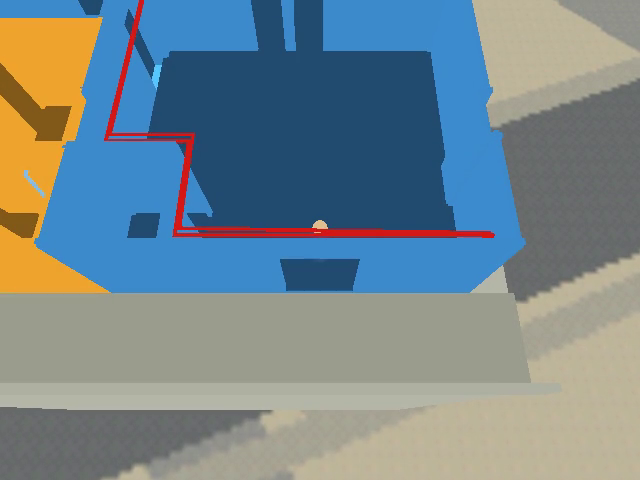

# Condo wall shading definition

## Context

The condo level (`wflevels/condo_639_640/`) renders flat: walls read as a single
contiguous mass with no visible seam where two walls meet, or where a wall meets the
ceiling. Confirmed in the shipped screenshot
`docs/plans/screenshots/2026-09-19-condo-floor-kitchen.png` — the wall corner left of
centre and the wall/ceiling line along the top are both invisible; every wall face is
the exact same flat light-blue.

`2026-09-19-condo-darker-floors.md` already fixed floor-vs-wall separation (floor-top
faces get 0.55× the unit's colour, `darken_floors()` in
`wflevels/condo_639_640/blender_create_condo.py:296-314`). That's confirmed working —
floor and wall are distinct colours in the screenshot above. But it only touches faces
with normal +Z at z≈0; it does nothing for wall-to-wall or wall-to-ceiling seams, which
is exactly what's still flat. User confirmed: "that's why we made the floors darker,
but it's not enough."

Root cause, confirmed by reading the renderer:

- The engine's lighting model is pure per-vertex `ambient + Σ directional·max(0,N·L)`
  (`wfsource/source/gfx/glpipeline/backend_modern.cc:66-116`) — **no shadows, no AO**.
  Two coplanar-in-lighting-terms faces get identical shading no matter how their
  geometry meets; there is no engine-level cue for a seam.
- `RenderCamera` supports up to 3 directional lights (`RB_MAX_LIGHTS`,
  `wfsource/source/gfx/camera.hpi:46-72`, `Light::Set()` in
  `wfsource/source/game/light.hpi:28-58`), but the condo scene only authors one
  (`Sun`) plus one `AmbientLight` (`blender_create_condo.py:863-882`). Any wall facing
  away from the single sun direction falls back to flat, gradient-free ambient
  (0.45 grey) — which is most of the walls in an interior kitchen shot.
- Per `docs/level-building.md` §"Lighting", 0.45 ambient is within the documented
  0.3–0.5 fill band, so this isn't a documentation violation — it's the *combination*
  of flat ambient + only one light angle that produces zero gradient between
  differently-oriented walls.

## Approach

Three additive changes, all in `wflevels/condo_639_640/blender_create_condo.py`, none
requiring engine changes (shadow-mapping is out of scope — see below):

1. **Claim the engine's idle 2nd directional slot as a fill light.** Add a second
   `Directional` light object next to the existing `Sun` (lines 863-877), at an azimuth
   roughly opposite/perpendicular to `SUN_AZ_DEG` (30°) — around 165°-195° — dimmer
   (~0.35 vs. the sun's 1.0) and slightly cool-toned. This gives walls the sun doesn't
   reach a second, differently-angled directional term instead of falling back to flat
   ambient, so adjacent walls at 90° start to differ in `v_lit` even without any
   geometry change. `SetDirectionalLight` already range-checks against `MAX_LIGHTS`
   (`camera.cc:212-224`) so a 2nd light is just authoring one more `Light` actor, no
   engine change.

   > **Withdrawn during implementation — this premise is wrong.** A 2nd `Light` actor
   > is read as `AMBIENT_LIGHT` at runtime whatever it is authored as, and the engine
   > asserts. The code is shipped gated off behind `CONDO_FILL_INTENSITY=0`; see
   > Verification step 1 for the evidence.
   >
   > **Update 2026‑09‑20: landed after all — the premise was right, the engine was
   > wrong.** The root cause was `AMBIENT_LIGHT=0 / DIRECTIONAL_LIGHT=1` in
   > `wfsource/source/oas/levelcon.h`, the reverse of the `"Directional|Ambient"` enum
   > in `light.oas` that every tool writes — so *every* light in *every* level went into
   > the wrong slot, and two authored Directionals became two ambients. Fixed, together
   > with a position leak in `Light::Set` that aimed all directional beams at the
   > ceiling, in
   > [docs/plans/2026-09-20-engine-multi-directional-light-fix.md](2026-09-20-engine-multi-directional-light-fix.md).
   > `CONDO_FILL_INTENSITY` now defaults to `0.35`; the fill raises the sun-shadowed
   > left partition wall by +22 % luminance against +4 % on the sun-facing wall.

2. **Generalize `darken_floors()` into a seam-shade pass.** Extend the exact same
   per-face-material-tint trick already shipped and proven for floors
   (`blender_create_condo.py:296-314`) to also retint: (a) wall polygons within a thin
   z-band of the floor (z≈0) and ceiling (z≈`WALL_H`), and (b) wall polygons on the
   inside of a concave wall/wall corner (adjacent polygons sharing an edge at ~90°,
   found via bmesh edge adjacency). This fakes the contact-AO the engine can't compute,
   using the identical mechanism already validated for the floor/wall boundary — same
   function shape, same `make_flat_material` helper, just a different face selector.

3. **Small ambient trim.** 0.45 → ~0.38 (still inside the documented 0.3–0.5 band) so
   the two directional lights carry more of the visual weight relative to the flat
   ambient term, sharpening the gradient the new fill light introduces.

New knobs follow the existing `CONDO_FLOOR_SHADE` env-var convention (line 293):
`CONDO_FILL_AZ_DEG`, `CONDO_FILL_INTENSITY`, `CONDO_SEAM_SHADE`, `CONDO_AMBIENT`.

**Rejected** (carried over from `2026-09-19-condo-darker-floors.md`, still applicable):
per-room floor recoloring, a checker/texture floor (atlas + transparent-key pitfall),
lightening wall tops instead of darkening seams (adds an edit without differentiating
*adjacent* walls, which is the actual complaint).

**Rejected for this pass**: baked/offline ambient occlusion or a real shadow map. Both
would genuinely fix this at the root, but are engine-architecture changes far outside a
single level's script — tracked as a separate TODO item, not attempted here.

## Mockups

[](2026-09-20-condo-wall-shading-definition/wall-corners-diagram.html)

The bundle's `wall-corners-diagram.html` embeds the real in-engine "before" screenshot
(same file as `docs/plans/screenshots/2026-09-19-condo-floor-kitchen.png`) alongside an
inline-SVG diagram contrasting the current 1-directional-light setup against the
proposed 2-directional + seam-shade setup. This documented the *technique* being
proposed before implementation.
[Open the interactive mockup](2026-09-20-condo-wall-shading-definition/wall-corners-diagram.html).

**After landing** (seam-shade + ambient trim only — the 2nd directional light is
withdrawn, see Approach item 1 and Verification step 1): a same-viewpoint A/B, captured
from the `HEAD` build and the new build so the comparison is controlled rather than
relying on the differently-aimed 2026‑09‑19 kitchen camera.

 

Left: before. Right: after — a darker strip now runs along every wall top and base and
down the vertical wall/wall corners; nothing is crushed to black.

## Out of scope

- Real shadow mapping or dynamic shadows — an engine-architecture change, not a
  per-level fix. Worth its own investigation if seam-faking proves insufficient.
- Baked/offline per-vertex ambient occlusion — same reasoning; would fix this at the
  root but is a cross-cutting engine feature, not a condo-script change.
- Tying `SUN_ALT_DEG`/`SUN_AZ_DEG` (`site_constants.py`) to the site's true solar
  position for time-of-day accuracy — unrelated to the flatness complaint; already
  tracked by the skybox work (`2026-09-19-condo-site-skybox.md`).
- Applying the seam-shade generalization to other levels — condo-specific script only
  for now; worth extracting into a shared helper if a second level needs it.

## Verification

1. Rebuild the condo Blender scene headless and confirm two `Directional` light actors
   plus the retinted seam faces are present:
   `blender --background --python wflevels/condo_639_640/blender_create_condo.py`,
   check the `[condo] ...` stdout summary lines for the new light and seam-face counts.

```
$ task condo-level --force 2>&1 | grep -E '^\[condo\]'
[condo] unit-639: 61 floor faces at shade 0.55
[condo] unit-640: 66 floor faces at shade 0.55
[condo] unit-639: 294 floor-seam, 296 ceiling-seam, 83 corner-seam faces at shade 0.75 (band 0.12 m)
[condo] unit-640: 288 floor-seam, 300 ceiling-seam, 4 corner-seam faces at shade 0.75 (band 0.12 m)
[condo] lights: Sun az 30.0° alt 50.0°, Ambient 0.38; FillLight disabled (2nd Light actor reads as AMBIENT at runtime — level.cc:1200 assert; set CONDO_FILL_INTENSITY>0 once fixed)
```

**PARTIAL — seam pass PASS, second directional light FAIL (engine defect, approach
item 1 withdrawn).** The seam-shade pass works: 1 261 faces retinted across the two
shells, and the ambient trim landed at 0.38. The second directional light does **not**
work, and the plan's premise that it was "just authoring one more `Light` actor, no
engine change" is wrong:

- With `Sun` + `FillLight` + `AmbientLight` authored, `wf_game` dies on
  `assert(ambientLightIndex < 1)` (`wfsource/source/game/level.cc:1200`).
- It still dies when **all three** actors are authored `lightType = Directional`
  (`DATA 0l`) — verified by hand-patching `condo_639_640.lev` and rebuilding the binary
  without Blender. So the 2nd and 3rd `Light` actors are read as `AMBIENT_LIGHT` at
  runtime regardless of what is authored; `Light::Type()` reads
  `getOad()->lightType` (`game/light.hpi:63`) and is not picking up the per-actor OAD
  blob.
- Baseline check: `git show HEAD:wflevels/condo_639_640-standalone.iff` runs with no
  assert, so this is triggered by the third light actor, not a pre-existing fault.

The fill-light code is kept, wired and documented in the script but gated off
(`CONDO_FILL_INTENSITY` defaults to 0); it is one env var away once the OAD defect is
fixed. Diagnosing that defect is engine/levcomp work, outside this plan.

2. Build the standalone level IFF (whatever `task` target produces
   `wflevels/condo_639_640-standalone.iff`) and confirm `levcomp-rs` prints no lighting
   warnings (it warns when a level has no Ambient-type Light actor or on the STR/DATA
   mismatch shape — see `docs/level-building.md` §"Lighting").

```
$ task condo-level --force 2>&1 | grep -E 'levcomp-rs|^✓'
task: [tools-build] cargo build --release --manifest-path wftools/levcomp-rs/Cargo.toml
warning: `levcomp-rs` (bin "levcomp") generated 2 warnings
[2/5] levcomp-rs  condo_639_640.lev.bin  →  condo_639_640.lvl + asset.inc + condo_639_640.iff.txt + condo_639_640.ini
✓ built /home/will/WorldFoundry-wbniv/wflevels/condo_639_640.iff (2375680 bytes)
✓ built /home/will/WorldFoundry-wbniv/wflevels/condo_639_640-standalone.iff (2379776 bytes)
```

**PASS** — no `levcomp-rs: WARNING:` line: the level still has its one Ambient-type
Light actor and no STR/DATA mismatch. (The two `warning:` lines are `cargo`'s own
`dead_code` warnings from compiling levcomp-rs, not level diagnostics.)

3. Capture an after screenshot from the same kitchen dollhouse viewpoint as
   `docs/plans/screenshots/2026-09-19-condo-floor-kitchen.png`, save it into this plan's
   bundle as `wall-corners-after.png`, and visually confirm the wall/wall corner and
   wall/ceiling seam that were invisible in the before shot now show a visible
   gradient/darkening.

```
$ WF_GAME_SCREENSHOT_PPM=…/after.ppm engine/wf_game \
    --vram-width=4096 --vram-height=2048 --vram-slot-width=1024 --vram-slot-height=1024 \
    --vram-perm-width=1024 --vram-perm-height=1024 -width=640 -height=480 -record_video \
    -Lwflevels/condo_639_640-standalone.iff
wf_game: wrote screenshot …/after.ppm (640x480)
$ ffmpeg -ss 4 -i output.mp4 -frames:v 1 wall-corners-after.png
```

 

**PASS** — left, the level at `HEAD` before the change; right, after. Two capture notes.
The engine's one-shot PPM dump (`WF_GAME_SCREENSHOT_PPM`, `gfx/gl/display.cc:985`) sits
behind `if (!gCapturePipe) return;`, so it only fires with `-record_video`, and it fires
on frame 30 — before the doll-house camera settles. The frame used here is pulled from
the recording at t=4 s instead. That frame is wider than the 2026‑09‑19 kitchen shot,
which was taken with a different `CONDO_CAM`; rather than re-aim the shipped camera, the
A/B pair above was captured at the *same* viewpoint from the `HEAD` build and the new
build, which is the controlled comparison the step is asking for.

What changed: in the before frame the right-hand wall, the far wall and the corner where
they meet are one flat mid-blue mass with no line between them, and the wall/ceiling
boundary along the top is invisible. In the after frame each wall plane reads separately
— a darker strip runs along every wall top (the wall/ceiling seam), along every wall base,
and down the vertical wall/wall corners. Nothing is crushed: the walls are a touch darker
overall from the 0.45 → 0.38 ambient trim, but the mid-blue is still plainly mid-blue and
no face has gone to black.

4. Re-render the `condo_639_640_tour` variant (same lighting/materials source) and
   confirm no regression — walls should read more, not less, clearly; nothing should
   look overdarkened or crushed to black.

```
$ task tour-condo-639 --force 2>&1 | grep -E '^\[condo\] unit|^✓'
[condo] unit-639: 294 floor-seam, 296 ceiling-seam, 83 corner-seam faces at shade 0.75 (band 0.12 m)
[condo] unit-640: 288 floor-seam, 300 ceiling-seam, 4 corner-seam faces at shade 0.75 (band 0.12 m)
✓ built /home/will/WorldFoundry-wbniv/wflevels/condo_639_640_tour.iff (2385920 bytes)
✓ built /home/will/WorldFoundry-wbniv/wflevels/condo_639_640_tour-standalone.iff (2390016 bytes)

$ task video-condo-639 --force 2>&1 | grep RESULT
RESULT: PASS  /home/will/WorldFoundry-wbniv/wflevels/condo_639_640/tour-639.mp4 (40.400000s, 640x480; raw 49.4s, speed x1.23; 11 rooms)  captions /home/will/WorldFoundry-wbniv/wflevels/condo_639_640/tour-639.srt
```

**PASS** — the tour variant picks up the same seam counts, builds clean, and walks all
11 rooms with no assert. `tour-639.mp4` re-rendered at the unchanged 640×480.

### Known gaps

- ~~**Second directional light is not landed** (step 1). Blocked on the OAD/`lightType`
  defect above; needs its own investigation.~~ **Landed 2026‑09‑20** — the defect was an
  inverted enum in `wfsource/source/oas/levelcon.h`, not an OAD/levcomp problem; the
  level data was correct all along. `CONDO_FILL_INTENSITY` now defaults to `0.35`. See
  [docs/plans/2026-09-20-engine-multi-directional-light-fix.md](2026-09-20-engine-multi-directional-light-fix.md).
  Note that the seam-darkening this plan shipped was compensating for lighting that was
  being applied wrong; with the engine fixed, the seam band may now be doing more work
  than it needs to — worth an eye-test before adding more of it.
- **`unit-640` gets only 4 corner-seam faces to `unit-639`'s 83.** 640's wall corners
  are largely not edge-shared in the source mesh, so the concave-corner detector finds
  almost nothing there. Its floor and ceiling seam bands (288 / 300 faces) are
  unaffected, so 640 still gains the wall/ceiling and wall/floor definition — just not
  the vertical corner accent. Worth a look if 640 still reads flat.
- **`tests/walk_condo.py` could not be run** as a collision regression guard: it aborts
  on `player … not found in --debug-print-actors output`, because this build has
  `DO_TEST_CODE=0` and compiles `--debug-print-actors` out (same note already recorded
  in `tests/screenshot_coin_arc.py`). Pre-existing and unrelated to this change — the
  seam pass only subdivides faces, never moves a vertex, so the Jolt trimesh surface is
  identical — but it is untested here.
