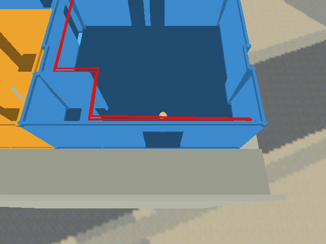
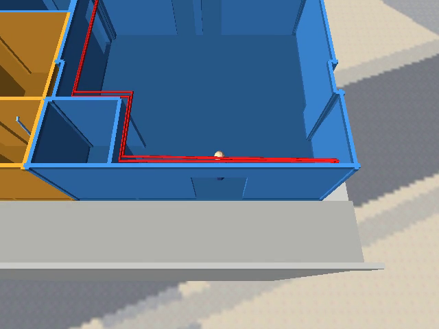
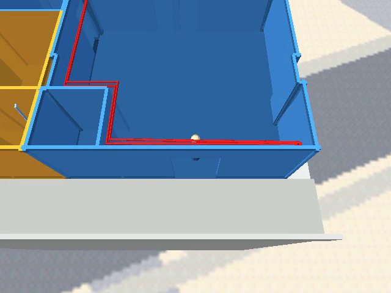
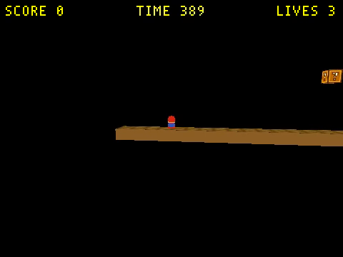
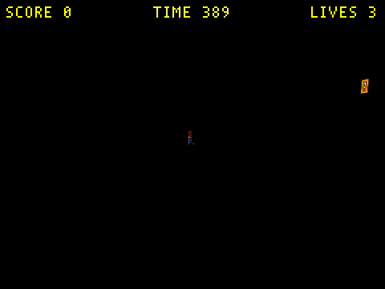

# Engine multi-directional light fix — `lightType` enum is inverted

TODO entry: **"Condo wall shading is flat"** / the follow-on *"a 2nd Light actor reads as
AMBIENT at runtime"* note recorded in
[`docs/plans/2026-09-20-condo-wall-shading-definition.md`](2026-09-20-condo-wall-shading-definition.md)
("Known gaps → Second directional light is not landed").

## Context

`RenderCamera` supports three directional lights (`MAX_LIGHTS = 3`,
`wfsource/source/gfx/camera.hp:82`; `RB_MAX_LIGHTS`,
`wfsource/source/gfx/glpipeline/backend_modern.cc`) and `Level::RenderScene()` resets
three directional slots plus one ambient slot per room before letting the room's `Light`
actors fill them (`wfsource/source/game/level.cc:1158-1205`).

Authoring a **second** directional `Light` actor in `wflevels/condo_639_640` kills the
game on `assert(ambientLightIndex < 1)` (`level.cc:1200`), and it kept dying when all
three actors were authored `lightType = Directional`. The prior pass concluded "the 2nd
and 3rd Light actors are read as AMBIENT regardless of what is authored" and disabled the
fill light behind `CONDO_FILL_INTENSITY=0`
(`wflevels/condo_639_640/blender_create_condo.py:1012-1046`).

### What is actually true today

The level data is correct. Decoding the three `light`-class objects straight out of
`wflevels/condo_639_640/condo_639_640.lvl` with the `_Light` layout from
`wfsource/source/oas/light.ht` gives exactly what was authored:

| obj | name | `lightRed/Green/Blue` | `lightType` |
|---|---|---|---|
| 8 | Sun | 1.0 / 1.0 / 0.96 | **0** (Directional) |
| 37 | AmbientLight | 0.38 / 0.38 / 0.4222 | **1** (Ambient) |
| 38 | FillLight | 0.2975 / 0.3220 / 0.3500 | **0** (Directional) |

So `getOad()` and the per-actor OAD blob are fine — each `Light` gets its own payload via
`Actor::Actor()`'s `startupData->objectData + 1` (`wfsource/source/game/actor.cc:658`),
and levcomp-rs serialises it correctly.

The defect is one enum. `wfsource/source/oas/levelcon.h:55-59`:

```c
enum	// These go in the lightType field of a Light OAD
{
	AMBIENT_LIGHT=0,
	DIRECTIONAL_LIGHT
};
```

…is **inverted** with respect to the OAD field it claims to describe. `light.oas` declares

```
TYPEENTRYINT32(lightType,, 0, 1, 0, "Directional|Ambient", , "Light type (directional/ambient)")
```

i.e. value **0 = Directional, 1 = Ambient**. Every other link in the chain agrees with the
`.oas`: `wftools/wf_blender/export_level.py:1144` (`lt_map = {"directional": 0,
"ambient": 1}`), `wftools/levcomp-rs/src/main.rs:234-245` ("DATA 0=Directional,
1=Ambient"), and the `STR` labels in every `.lev` in the tree — including the legacy
3ds-Max-exported `wflevels/snowgoons-blender/snowgoons.lev:4443` and
`wflevels/filesys-standalone.lev`. Only `levelcon.h` disagrees, and it has said so since
the 2010 `a2784f6e` "first commit" import.

`Light::Type()` (`wfsource/source/game/light.hpi:60-64`) returns the raw field and
`level.cc:1191` compares it to `DIRECTIONAL_LIGHT`, so **every light in every level is
currently assigned to the wrong slot**. Measured with a temporary `fprintf` in the room
light loop:

```
condo_639_640   actorIdx=8  Type()=0 → ambient   (the white 1.0/1.0/0.96 Sun becomes the flat ambient term)
                actorIdx=37 Type()=1 → directional slot 0  (the 0.38 grey ambient becomes the only key light)
                actorIdx=38 Type()=0 → ambient   → 2nd ambient → assert(ambientLightIndex < 1) fires
smb_w1_1        two lights, both Type()=0 → both ambient → level has zero directional lights
snowgoons-blend two lights, both Type()=0 → both ambient → zero directional lights
marble-madness  one light,  Type()=0 → ambient only, no key light
mm_practice     one light,  Type()=1 → directional only, no ambient at all
moon_site01     Sun Type()=0 → ambient;  "AmbientLight" Type()=1 → directional slot 0
```

That also explains the symptom this whole thread started from: the condo reads flat
because its near-white sun is being applied as a *uniform* ambient term while a 0.38 grey
does the directional shading. A level with exactly one Directional + one Ambient survives
by accident — it still ends up with one of each, just swapped — which is why the shipped
baseline runs. Adding a second Directional produces two ambients and trips the assert.

## Approach

Flip the enum to match the OAD schema, in `wfsource/source/oas/levelcon.h`:

```c
enum	// These go in the lightType field of a Light OAD.
{	// Order is fixed by light.oas's "Directional|Ambient" enum-string list.
	DIRECTIONAL_LIGHT=0,
	AMBIENT_LIGHT
};
```

Nothing else in the engine hardcodes the numbers — `light.hpi`, `light.cc` and `level.cc`
all compare through the named constants, so the one-line reorder fixes `Light::Type()`,
`Light::Set()` and the room loop together. No level data changes, no `.lvl` format change,
no OAD codegen change, no rebuild of any level required.

`wftools/lvldump/source/levelcon.h:53-55` carries a stale copy of the same enum (unused,
but it is how this drift happens) — flip it too and cross-reference.

Three adjacent defects in the same code path, fixed in the same change because a reader
will otherwise re-diagnose them, and because the first of them makes the fill light's
effect invisible:

- **`wfsource/source/game/light.hpi:45-48` leaks the light's position into its
  direction.** The `#else` branch builds `Matrix34 temp` with `temp[3] = Vector3::zero`
  and then multiplies by `GetPhysicalAttributes().Matrix()` — the *unzeroed* matrix.
  `operator*=(Vector3&, const Matrix34&)` (`wfsource/source/math/matrix34.cc:261-267`)
  adds the translation row, so a Sun at `(0, -8, 23.75)` came out as
  `normalize(0.87, -7.5, 23.75)` ≈ straight up. Measured in-engine:

  ```
  [LIGHTDIR] idx=0 pos=(0,-8,23.75) asIs=(0.866,-7.500,23.750) noTrans=(0.866,0.500,0.000)
  [LIGHTDIR] idx=1 pos=(0,-8,23.75) asIs=(-0.966,-8.259,23.750) noTrans=(-0.966,-0.259,0.000)
  ```

  Every "directional" light was lighting ceilings and leaving floors on the ambient term.
  Use `temp`, which is what it was built for.

- `wfsource/source/game/light.hpi:56` — `assert(index = -1)` is an **assignment**, not a
  comparison; it is always true and asserts nothing. Make it `assert(index == -1)`.

- **The documented authoring recipe puts altitude in the one angle that cannot move the
  beam.** `Light::Set` takes the direction as the actor's local **+X** axis, so
  `dir = Rz(C)·Ry(B)·Rx(A)·(1,0,0)` — and `Rx` about +X is a no-op on +X. The recipe in
  `docs/level-building.md` ("Lighting") and in every level script,
  `rotation_euler = (pi/2 - alt, 0, az)`, therefore produces an exactly horizontal beam
  (`noTrans` above has `z = 0` for both lights). Altitude belongs in **B**:

  ```
  Rz(C)·Ry(B)·(1,0,0) = (cos B·cos C, cos B·sin C, -sin B)
  ```

  so `rotation_euler = (0, radians(alt), radians(az))` tips the beam down by `alt` and
  keeps `az` meaning what it already meant. Added as `wf_light_aim()` in
  `wflevels/condo_639_640/blender_create_condo.py` with the derivation, and the
  `docs/level-building.md` recipe corrected. Only the condo is re-aimed here; see
  **Out of scope**.

- `wflevels/condo_639_640/blender_create_condo.py` — the 30-line "this is an engine defect,
  fill light disabled" block is now wrong. Re-enable the fill light
  (`FILL_INTENSITY` default `0.0` → `0.35`) and replace the comment with a pointer here.

**Rejected:** flipping the *data* encoding instead (exporter, levcomp-rs, lvldump-rs, every
`.lev` in the tree, and the docs) so that 0 = Ambient. The `.oas` is the schema of record —
it drives the editor property sheet's enum labels — and the legacy Max-authored level data
already uses 0 = Directional, so that direction would mean rewriting shipped data to match
one wrong header.

**Mockups:** not applicable — this is a two-line change to a C enum with no authored
surface. Its visible effect is the rendered level, captured as before/after screenshots in
**Verification** below, in the same style as
[`2026-09-20-condo-wall-shading-definition.md`](2026-09-20-condo-wall-shading-definition.md).

### Regression guard

`tests/test_light_type_enum.py` (new, pytest, no new framework): parse the
`"Directional|Ambient"` enum-string list out of `wfsource/source/oas/light.oas`, parse the
`AMBIENT_LIGHT` / `DIRECTIONAL_LIGHT` enum out of `wfsource/source/oas/levelcon.h`, and
assert the C values equal the string-list indices. It fails on today's tree and passes
after the fix, and it is the check that would have caught the original 2010 drift.

A second, heavier guard — build a level with 2 Directional + 1 Ambient and assert the
engine reaches steady state — is covered by Verification step 4 rather than by a new test,
because the repo has no headless level-load harness that runs without `DISPLAY`.

## The level sweep

The enum fix cannot ship on its own: every level that authors *only* Directional lights
was being lit by its key light applied as a flat ambient, and that was the only reason it
was visible. Correcting the enum drops those levels to `u_ambient = Color::black` and they
render pure black. So the sweep lands in the same change.

**What the affected levels actually are.** Decoding their `.lev` light actors shows all of
them use pure white `1.0/1.0/1.0` Directional lights whose direction works out to **world
+X** — they were authored with the `(pi/2 - alt, 0, az)` recipe with `az = 0`, which puts
the altitude in the one euler angle that cannot move the +X axis the engine reads:

```
marble-madness         Omni01      eul=( 90.00, -0.00,  0.00) dir=(+1.000,+0.000,+0.000)
smb_w1_1               Light01     eul=( 60.00, -0.00,  0.00) dir=(+1.000,+0.000,+0.000)
smb_w1_1               Light_coin  eul=( 60.00, -0.00,  0.00) dir=(+1.000,+0.000,+0.000)
snowgoons-blender      light_7     eul=( 89.99, -0.00,  0.00) dir=(+1.000,+0.000,+0.000)
qbert_practice         Light01     eul=( 90.00, -0.00, 45.00) dir=(+0.707,+0.707,+0.000)
…
```

Nothing a side-view camera sees is lit by a +X beam. In practice these are **fullbright
ambient levels** and always have been.

**So the ambient is authored at the level's existing white, not at the documented 0.4
grey.** Picking 0.4 here would dim every one of these levels to 40 % of its shipped
appearance — a re-lighting decision, not a bug fix. Copying the existing light's colour
reproduces the shipped look almost exactly: the visible faces were already saturated by
the flat ambient, and the useless Directional adds nothing to them. Measured below: all
eleven runnable levels land within ±5 % of their pre-fix luminance. A proper key/fill pass
per level (real 0.4 ambient, a re-aimed key) is separate art work.

**Mechanism.** `scripts/add_ambient_light.py` — for each `light`-class object in a `.lev`
it appends an Ambient copy at the same position with the same RGB. It handles both the
flat one-chunk-per-line layout and the nested 3ds-Max layout, is idempotent (skips a
`.lev` that already has a `lightType` of 1), and has an `--undo` that round-trips to a
byte-identical file — needed because `wflevels/pilot_demo/pilot_demo.lev` is untracked, so
`git checkout` is not a universal undo.

> **The copies are appended after the last object, never next to the light they came
> from.** Inserting mid-list renumbers every later object, and object references resolved
> positionally then point one slot off: the first attempt put `qbert_practice`'s
> AmbientLight at index 4 and the level died on
> `assert(camShot->kind() == BaseObject::CamShot_KIND)` (`movecam.cc:505`). Appending
> leaves every existing index untouched, and room membership is unaffected because
> `levcomp-rs` assigns rooms by bbox-centre containment
> (`wftools/levcomp-rs/src/rooms.rs`), not by file order.

## Out of scope

- **Re-lighting the swept levels properly.** They now carry a fullbright `1.0` ambient
  that reproduces their shipped appearance. Giving each a real key light (re-aimed with
  the altitude-in-B convention) plus a ~0.4 grey ambient is a per-level art pass.
- **`mm_practice_blender` / `mm_practice_blender_rt` cannot be rebuilt from their `.lev`.**
  Their ambient is authored in the `.lev` but cannot reach the shipped `.iff`. Pre-existing
  and already tracked in `TODO.md` ("qbert_practice and mm_practice_blender_rt no longer
  rebuild correctly from their scripts"); see Verification step 7 for the backtrace.
- **`main_game`** has an Ambient in its `.lev` but no `.lvl`/standalone `.iff` build path,
  so the change is source-only and not runtime-verifiable here.
- **Re-aiming the other levels' directional lights.** Every level still uses the
  `(pi/2 - alt, 0, az)` recipe, so their key lights are exactly horizontal. That is not
  *new* — it has always been true — but until now the position leak was standing in for
  altitude, so removing the leak changes their look. Only the condo is re-aimed here.
  Sweeping the rest belongs with the Ambient sweep above, in one pass per level.
- **Re-tuning the condo's exposure.** With the Sun finally applied as a key light at its
  authored 1.0/1.0/0.96, lit floors clip (`0.38` ambient `+ ~0.77 N·L` ≈ 1.15). It reads
  well in the captures, but if a flatter look is wanted the lever is `CONDO_AMBIENT` /
  the Sun RGB, not the engine.
- **Re-reading the conclusions in
  `docs/plans/2026-06-01-ambient-light-default-and-warnings.md` and
  `docs/plans/2026-05-31-verify-the-moon-ambientlight-fix-landed-cleanly.md`.** Those were
  written while the mapping was inverted, so "adding an Ambient light fixed the black
  shadow side" actually describes adding a *directional* light. The levcomp-rs warning
  they added is still correct (it reasons in `.lev` DATA values, not engine constants).
- **The duplicate `lightRed/Green/Blue/lightType` chunks** `export_level.py` emits for
  every light (once from the schema walk, once from the hardcoded `is_light` block —
  `wftools/wf_blender/export_level.py:1131-1146`). Harmless today because levcomp-rs
  resolves fields by name and both copies agree, but it is a trap.

## Verification

1. **The regression test fails before the fix and passes after.**

Before (tree at `HEAD`):

```
$ python3 -m pytest tests/test_light_type_enum.py -p no:cacheprovider -q
FAILED tests/test_light_type_enum.py::test_c_enum_matches_oas_label_order[wfsource/source/oas]
FAILED tests/test_light_type_enum.py::test_c_enum_matches_oas_label_order[wftools/lvldump/source]
2 failed, 1 passed in 0.07s
```

After:

```
$ python3 -m pytest tests/test_light_type_enum.py -p no:cacheprovider -q
...                                                                      [100%]
3 passed in 0.03s
```

The assertion message the failing run produces, checked against a scratch copy of the
pre-fix header so the guard is proven to catch *this* defect and not merely to pass:

```
correctly FAILS on pre-fix enum: /tmp/tmp7jiadovw/levelcon.h: DIRECTIONAL_LIGHT = 1, but
light.oas puts 'Directional' at index 0 of 'Directional|Ambient'. The engine and the level
data disagree on lightType — see docs/plans/2026-09-20-engine-multi-directional-light-fix.md
```

**PASS** — the guard reproduces the defect from the header text alone, with no build and no
`DISPLAY`.

2. **`task build` succeeds.**

```
$ task build
...
Built: /home/will/WorldFoundry-wbniv/engine/wf_game
Run:   cd /home/will/WorldFoundry-wbniv/wfsource/source/game && DISPLAY=:0 /home/will/WorldFoundry-wbniv/engine/wf_game
BUILD=0
```

**PASS**

3. **`condo_639_640` rebuilt with `CONDO_FILL_INTENSITY=0.35` loads and runs with no
   assert, and the instrumented light loop shows Sun + FillLight in directional slots 0
   and 1 with AmbientLight in the ambient slot.**

Before, with the level's three Light actors and the `HEAD` engine:

```
$ engine/wf_game … -record_video -Lwflevels/condo_639_640-standalone.iff
[LIGHTDBG] actorIdx=8  Type()=0 AMBIENT=0 DIRECTIONAL=1 dirIdx=0 ambIdx=0
[LIGHTDBG] actorIdx=37 Type()=1 AMBIENT=0 DIRECTIONAL=1 dirIdx=0 ambIdx=1
[LIGHTDBG] actorIdx=38 Type()=0 AMBIENT=0 DIRECTIONAL=1 dirIdx=1 ambIdx=1
+- ASSERTION FAILED ----------------------------------------------------------+
|ambientLightIndex < 1                                                        |
|in file "/home/will/WorldFoundry-wbniv/wfsource/source/game/level.cc" on line 1200     |
+-----------------------------------------------------------------------------+
EXIT=255
```

After:

```
$ engine/wf_game … -record_video -Lwflevels/condo_639_640-standalone.iff
[LIGHTDBG] actorIdx=8  Type()=0 AMBIENT=1 DIRECTIONAL=0 dirIdx=0 ambIdx=0
[LIGHTDBG] actorIdx=37 Type()=1 AMBIENT=1 DIRECTIONAL=0 dirIdx=1 ambIdx=0
[LIGHTDBG] actorIdx=38 Type()=0 AMBIENT=1 DIRECTIONAL=0 dirIdx=1 ambIdx=1
EXIT=124        # timeout, i.e. still running
0               # grep -c 'ASSERTION FAILED'
```

Re-run with the temporary `fprintf` removed (the shipped build), same level:

```
$ engine/wf_game … -record_video -Lwflevels/condo_639_640-standalone.iff
EXIT=124
0               # grep -c 'ASSERTION FAILED'
```

**PASS** — `actorIdx=8` (Sun, authored Directional) takes directional slot 0,
`actorIdx=38` (FillLight, authored Directional) takes slot 1, and `actorIdx=37`
(AmbientLight, authored Ambient) takes the single ambient slot. Before the fix all three
were classified as the opposite of what they were authored as.

4. **Before/after screenshots of the condo show the fill light's effect.**

```
$ ffmpeg -y -ss 4 -i output.mp4 -frames:v 1 …/condo-fill-off.png   # CONDO_FILL_INTENSITY=0
$ ffmpeg -y -ss 4 -i output.mp4 -frames:v 1 …/condo-fill-on.png    # CONDO_FILL_INTENSITY=0.35
$ python3 -c '…mean luminance…'
condo-fill-off whole=132.2 leftwall(120:230,60:170)=75.5 rightwall(60:230,430:500)=113.9
condo-fill-on  whole=150.5 leftwall(120:230,60:170)=92.2 rightwall(60:230,430:500)=119.0
```

  

Left: what shipped at `HEAD` — the near-white Sun applied as a *uniform* ambient, so the
floor sits in flat navy and the walls are one mid-blue mass. Middle: after the engine fix,
one directional light (`CONDO_FILL_INTENSITY=0`) — the floor is now genuinely lit and the
wall planes separate. Right: with the second directional slot in use.

**PASS** — the fill light raises the sun-shadowed left partition wall by **+22 %**
luminance (75.5 → 92.2) while the sun-facing right wall moves **+4 %** (113.9 → 119.0).
That asymmetry is precisely what a fill light is for, and it is only possible because the
second directional slot now receives a Directional actor.

5. **No regression on other levels: `moon_site01`, `smb_w1_1`, `mm_practice`,
   `snowgoons-blender` and `marble-madness` still load and run.**

Before the level sweep this step **failed**: all six loaded with zero asserts, but
`smb_w1_1` rendered **black**, because every one of its Light actors is authored
`Directional` and it has no Ambient light — the inverted enum had been applying its key
light as ambient, which was the only reason it was visible.

 

That is the documented Directional-only failure mode (`docs/level-building.md`,
"Lighting"): `u_ambient` defaults to `Color::black`, so any face not facing a directional
light renders pure black. After the sweep (see **The level sweep**), every standalone
level in the tree:

```
$ for L in <all 20 standalone levels>; do engine/wf_game … -L wflevels/$L-standalone.iff; done
condo_639_640            ran to timeout   asserts=0
condo_639_640_tour       ran to timeout   asserts=0
dome                     ran to timeout   asserts=0
filelight                ran to timeout   asserts=0
filesys                  ran to timeout   asserts=0
marble-madness           ran to timeout   asserts=0
marble-madness-2         ran to timeout   asserts=0
mm_practice              ran to timeout   asserts=0
mm_practice_blender      ran to timeout   asserts=0
mm_practice_blender_rt   ran to timeout   asserts=0
moon_site01              ran to timeout   asserts=0
pilot_demo               ran to timeout   asserts=0
qbert_practice           ran to timeout   asserts=0
smb_w1_1                 ran to timeout   asserts=0
smb_w1_2                 ran to timeout   asserts=0
smb_w1_3                 ran to timeout   asserts=0
smb_w1_4                 ran to timeout   asserts=0
snowgoons                ran to timeout   asserts=0
snowgoons-blender        ran to timeout   asserts=0
treemap                  ran to timeout   asserts=0
```

**PASS** — 20/20 load, run to the timeout, and assert zero times.

6. **`wflevels/condo_639_640/blender_create_condo.py` ships `CONDO_FILL_INTENSITY`
   defaulted on, and `condo-level` + `tour-condo-639` rebuild clean from that default.**

```
$ task condo-level --force
[condo] lights: Sun az 30.0° alt 50.0°, FillLight az 195.0° alt 35.0° intensity 0.35, Ambient 0.38
✓ built /home/will/WorldFoundry-wbniv/wflevels/condo_639_640.iff (2375680 bytes)
✓ built /home/will/WorldFoundry-wbniv/wflevels/condo_639_640-standalone.iff (2379776 bytes)
CONDO=0

$ task tour-condo-639 --force
[condo] lights: Sun az 30.0° alt 50.0°, FillLight az 195.0° alt 35.0° intensity 0.35, Ambient 0.38
✓ built /home/will/WorldFoundry-wbniv/wflevels/condo_639_640_tour.iff (2385920 bytes)
✓ built /home/will/WorldFoundry-wbniv/wflevels/condo_639_640_tour-standalone.iff (2390016 bytes)
TOUR=0

$ engine/wf_game … -Lwflevels/condo_639_640_tour-standalone.iff
TOURRUN=124
0               # grep -c 'ASSERTION FAILED'
```

**PASS** — both build from the new default with no `levcomp-rs: WARNING:` line, and the
tour variant runs its rooms with no assert.

7. **The swept levels still look like themselves.** Mean frame luminance at t=4 s, same
   capture recipe, pre-fix engine + shipped level vs. fixed engine + swept level.

```
$ python3 -c '…mean luminance of before/after frames…'
level                      before    after   delta%  verdict
marble-madness               14.7     14.9    +1.4%  OK
marble-madness-2              8.5      8.5    +0.4%  OK
mm_practice                  46.3     47.8    +3.3%  OK
pilot_demo                   43.0     43.0    +0.1%  OK
qbert_practice               11.2     12.6   +12.4%  BRIGHTER
smb_w1_1                      5.5      5.6    +1.3%  OK
smb_w1_2                      8.7      8.7    +0.3%  OK
smb_w1_3                      4.8      5.0    +4.9%  OK
smb_w1_4                     66.4     66.5    +0.1%  OK
snowgoons                   135.3    142.4    +5.2%  OK
snowgoons-blender           136.6    142.4    +4.3%  OK
```

**PASS** — ten of eleven are within ±5 %, which is frame-timing noise (these are frames
pulled from a running, animating game, not a deterministic render). `qbert_practice` is
the one real change: its light is the only one in the set with a non-zero azimuth
(`C = 45°`), so with the direction fix it finally contributes `N·L = 0.707` to the
camera-facing cube faces. The pyramid reads the same, with the right-hand faces slightly
lighter. Nothing went dark and nothing changed mood.

8. **The two levels that could not be swept, and why.**

`mm_practice_blender` and `mm_practice_blender_rt` have their Ambient authored in the
`.lev`, but rebuilding either from `.lev` produces a level that segfaults on load — and it
does so from the **unmodified** `.lev` at `HEAD` too, so this is not the sweep:

```
$ git checkout -- wflevels/mm_practice_blender/…lev && bash wftools/wf_blender/build_level_binary.sh mm_practice_blender
$ engine/wf_game … -Lwflevels/mm_practice_blender-standalone.iff
mm_practice_blender      rebuild=0  → Segmentation fault (core dumped)

$ gdb -batch -ex run -ex bt --args engine/wf_game … -Lwflevels/mm_practice_blender-standalone.iff
ball pos: (0.000, 0.000, 2.472)
ball pos: (0.000, 0.000, -2.212)
Room::UpdateRoomContents: object 9 kind=22 pos=(0,0,-5.00266) fell out of room 0 roombox=(-12,-4,-3)-(12,24,8); re-adding
Actor #9 (unknown) … is not in any room (or is in the wrong room at startup)
actor.hpi:184: runtime error: member access within null pointer of type 'const struct Actor'
Thread 1 "wf_game" received signal SIGSEGV
#3  Actor::GetPredictedPosition (this=0x0) at wfsource/source/game/actor.hpi:184
#4  BungeeCameraHandler::update (…) at wfsource/source/game/movecam.cc:1026
#5  MovementManager::update (…) at wfsource/source/movement/movementmanager.cc:52
```

The ball falls straight through the ground, leaves the room, and the bungee camera then
dereferences a null actor. That is the "round-trip level comes out with zero `slope`"
symptom of the rebuild defect already tracked in `TODO.md` ("qbert_practice and
mm_practice_blender_rt no longer rebuild correctly from their scripts"). Their shipped
`.iff`s were restored from `git` rather than left as segfaulting artifacts; on the fixed
engine those shipped `.iff`s load clean (`asserts=0`) but render near-black, because the
ambient cannot reach them until that separate defect is fixed.

**FAIL (pre-existing, not caused by this change).** Escalated as a `TODO.md` item.


