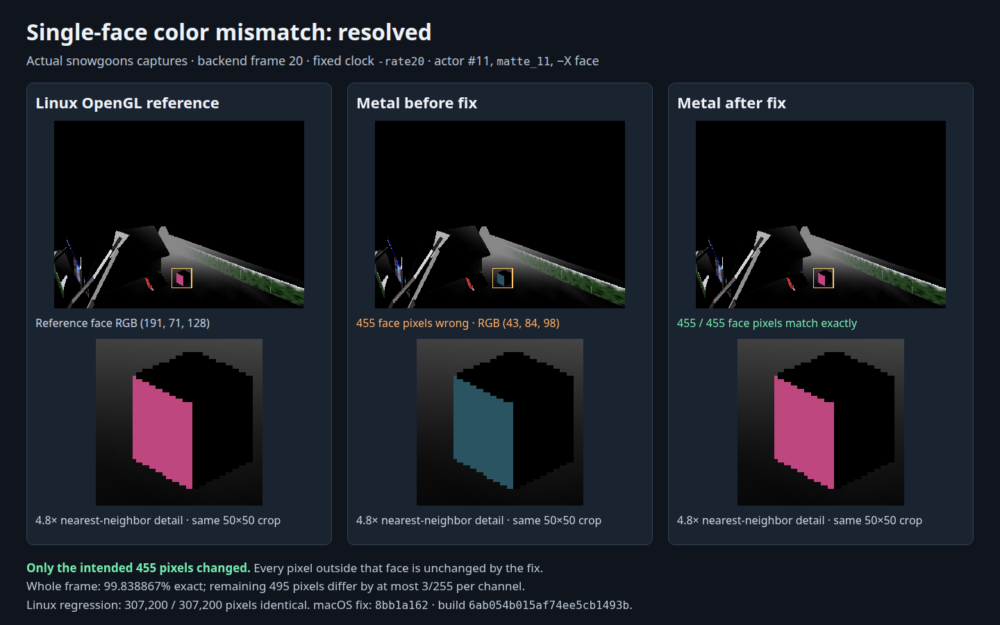
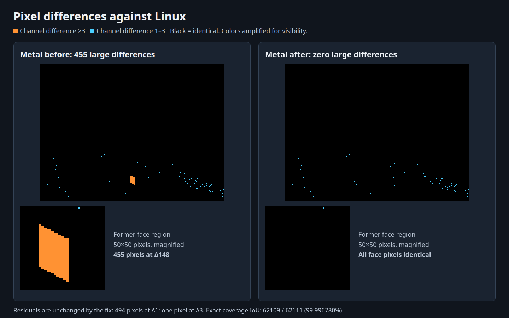

# Plan: macOS Metal renderer — finish the shared Metal path, with macOS as the bench

**Date:** 2026‑09‑20
**Status:** Plan only — nothing implemented. Written for review; several decisions below are the user's call.
**TODO entry:** `TODO.md:9` — *"macOS Metal renderer"* (Open → Platform / Display).
**Companion investigation:** [2026-05-26-macos-port-estimate.md](../investigations/2026-05-26-macos-port-estimate.md) — **its central premise is now false**; see §2.
**Prior plan:** [2026-05-26-macos-port-runtime-bringup.md](2026-05-26-macos-port-runtime-bringup.md) — the headless half, landed; this is its deferred "gfx half".

**Visible surface:** yes, eventually — but there is no new design to mock. The target image is defined entirely by the existing Linux GL build: the same level, same frame, same pixels. The acceptance artifact is a **side‑by‑side capture against the Linux GL renderer**, not an invented mockup, so the mockup bundle section is dropped per `~/CLAUDE.md`.

---

## 1. Context

`TODO.md:9` reads:

> **macOS Metal renderer.** iOS Metal backend exists; macOS desktop is still on GL stubs. Needs a real Metal renderer + window (shared with iOS), then re-enable Jolt + full scripting roster on macOS once headless is green.

Three of those four clauses are stale. Checked against the tree at `3fccf5fa`:

| TODO clause | Reality |
|---|---|
| "iOS Metal backend exists" | A Metal `RendererBackend` **class** exists and is complete. It has **never rendered a triangle** — see §2. |
| "macOS desktop is still on GL stubs" | Imprecise, and the imprecision matters. **There is no GL on macOS at all** — no `OpenGL.framework` is linked (`CMakeLists.txt:922-933`), and `gfx/gl` + `gfx/glpipeline` are both excluded from the build (`CMakeLists.txt:221-236`). The *renderer* is `engine/stubs/renderer_stub.cc` — a `HeadlessBackend` whose every virtual is empty, selected by `backend_factory.cc:17,27`. `hal/macos/gl_stubs.cc` is a separate and much narrower thing: seven no-op GL entry points that exist only because `gfx/pixelmap.cc` still calls GL directly (§D4), linked purely to satisfy the linker. |
| "re-enable Jolt" | **Already on** — not a phase to plan. `CMakeLists.txt:30` defaults `WF_PHYSICS_ENGINE=jolt`; the macOS gate (`CMakeLists.txt:115-123`) does not override it; there is no macOS-specific override file (`macos/` contains only `Info.plist`); and the `-DWF_PHYSICS_ENGINE=legacy` that the first bring-up run used is **gone** from the configure step, which now passes only `-DCMAKE_BUILD_TYPE=Debug -DCMAKE_OSX_ARCHITECTURES=arm64 -DWF_ASAN=OFF` (`codemagic.yaml:384-394`). The Xcode-generator workaround that once forced legacy was replaced by source-file properties (`CMakeLists.txt:624-660`), and macOS builds with Ninja anyway. |
| "full scripting roster" | **Already on** since `04061deb` (2026‑05‑27), likewise not a phase. `CMakeLists.txt:115-123` forces off only `WF_WASM_ENGINE`, `WF_ENABLE_EDITOR`, `WF_ENABLE_STEAM`. Lua/Fennel/QuickJS/Wren/zForth and the debug bridge are live. The residue is **WAMR only**, and even that is pre-wired (`CMakeLists.txt:464-472` already sets `darwin`/`AARCH64` for `APPLE`). |

So the physics and scripting half of the TODO text is **already-satisfied groundwork**. The remaining gap is exactly two things: the renderer backend (a true no-op today) and a real window-and-input loop. That is narrower than the TODO says in the tail, and **much wider than it says in the head**.

**The macOS build has run on Codemagic, contrary to the sibling plan's status line.** [2026-05-26-macos-port-runtime-bringup.md](2026-05-26-macos-port-runtime-bringup.md):4 still says *"awaiting first Codemagic macOS build"*, but three macOS fix commits landed the next day — `ab1a0f3a` (add the missing `Display::MeasureDelta()`, a link error), `a7ee03ba` (`NSBundleAccessor` falls back to `fopen` for absolute paths, a runtime behaviour), and `d0dcece2` (delta `timeval` before `ConvertTimeToScalar`, a `Scalar` overflow). Those are build-and-run feedback, not desk-checking. That status line should be corrected in Phase 0.

## 2. The finding that changes the plan's shape

The 2026‑05‑26 investigation is built on one premise ([§Decision premises](../investigations/2026-05-26-macos-port-estimate.md)):

> **The iOS Metal renderer will be finished before the macOS port begins.** […] a *proven* Metal renderer available at macOS-start-time […] Adding macOS is *selecting the Metal backend for a 4th platform arm*, not writing a renderer.

That premise does not hold. Traced end to end:

1. **The Metal backend is never fed an encoder.** `hal/ios/backend_metal.mm:342` (`SetCurrentEncoder`) and `:347` (`ClearCurrentEncoder`) have **zero callers** anywhere in `wfsource/` or `engine/`. `hal/ios/native_app_entry.mm:76-77` says so in as many words:

   > `// Phase 2C-B — for now, Display::PageFlip sleeps ~16ms and the Metal`
   > `// backend drops any batched triangles because no encoder is set.`

2. **No triangles are submitted in the first place.** Both the iOS and macOS arms compile `engine/stubs/renderpoly3d_stubs.cc` (`CMakeLists.txt:347-351`, `:352-368`) — eight `RenderObject3D::RenderPoly3D*` methods that `return 0`. The real ones are in `gfx/glpipeline/`, which both arms exclude (`CMakeLists.txt:212-236`).

3. **The view host is still Phase 2A.** `hal/ios/metal_view.mm` acquires a drawable, opens a render command encoder, calls `endEncoding` immediately, and presents. It is a clear-to-cornflower-blue and nothing else.

4. **Textures are not implemented.** `backend_metal.mm:110` and `:466` (`u.use_tex = 0;  // Phase 2C adds texture binding.`) — `DrawTriangle` ignores its `PixelMap*`.

5. **There is no depth buffer.** `backend_metal.mm:432` sets `colorAttachments[0].pixelFormat` and nothing else — no `depthAttachmentPixelFormat`, no `MTLDepthStencilState`, no depth texture. On the GL side depth is never the backend's business: it comes from the GLX visual plus scattered `glEnable(GL_DEPTH_TEST)` in `gfx/gl/display.cc:543,853` and `gfx/pixelmap.cc:217`. Nothing in the Metal path replaces that.

**Net: "iOS Metal" is a well-built engine-side backend object with no window feeding it, no geometry reaching it, no textures, and no Z-buffer.** There is nothing to "select for a 4th platform arm".

### 2.1 The counterweight: most of the port is already done, and the remaining work is portable

Against that, a second finding cuts the other way and is the reason this is still a good next move:

**The eight geometry-submission files are already backend-agnostic.** `gfx/glpipeline/rend{f,g}{c,t}{l,p}.cc` include *only* `gfx/renderer_backend.hp` and WF math headers and end in a `RendererBackendGet().DrawTriangle(...)` call — see `gfx/glpipeline/rendfcl.cc:13-22` and `:57-63`. Not one GL symbol among them. Same for `gfx/glpipeline/rendobj3.cc`. The only genuinely GL-bound file in that directory is `backend_modern.cc`, which includes `<GL/gl.h>` at `:16-28`.

The CMake comment that keeps them out — *"gfx/glpipeline (GL-only backend) stay out"* (`CMakeLists.txt:208-210`) — was true when the directory *was* the GL backend and is no longer true since the `RendererBackend` seam landed. So "write eight Metal `RenderPoly3D` implementations" is not work that exists. **It is a CMake change: compile the eight files, drop `renderpoly3d_stubs.cc`.**

That inverts the cost model. The remaining Metal work is: an encoder handoff, a depth attachment, a texture path, and a window. Of those, exactly one (the window) is platform-specific. **Three of the four are shared with iOS, and the fourth is easier on macOS.**

## 3. Design decisions

### D1 — macOS is the development bench for the shared Metal renderer; iOS inherits it

The investigation sequenced iOS → macOS. Reverse it. macOS is the better bench for the same renderer:

- Ninja + CMake, no Xcode generator (`codemagic.yaml:384-394`), so Jolt and everything else build normally.
- A deterministic headless driver already exists: `wf_game --frame-step-smoke=N --cycles=M -L<level>` (`game/game.cc:414`) runs `Load → N × Step → Unload` and exits. iOS has no equivalent — it is `UIApplicationMain` plus a background engine thread (`hal/ios/native_app_entry.mm:82`).
- A CI workflow that already exercises it: `macos-desktop-debug` (`codemagic.yaml:354-420`).
- No simulator, no code signing, no device provisioning in the loop.
- The engine runs on the **main thread** on macOS (`hal/macos/platform_main.cc:29-43`), so the Metal frame can be built synchronously inside `Display` — no cross-thread encoder handoff. That is the single hardest unbuilt piece of iOS Phase 2C‑B, and macOS gets to skip it.

**Rejected:** finish iOS Phase 2C‑B first, then port. It pays for the thread-handoff design *before* anything has proven the renderer draws correctly, and it debugs first-light on the platform with the worst iteration loop.

**Consequence for iOS:** once macOS is drawing, iOS Phase 2C‑B reduces to "run the same synchronous frame on the engine thread, with `CADisplayLink` used only as a vsync pacer" — the encoder-handoff design in `backend_metal.mm:339-350` can likely be deleted rather than completed. That is an iOS-side follow-up, out of scope here, but the plan should not make it harder.

### D2 — The frame is synchronous and owned by `Display`, mirroring the Linux GL path

Linux structure, for reference: `Display::RenderBegin` (`gfx/gl/display.cc:796`) clears (`:818`), the engine draws, `Display::PageFlip` (`:1027`) pumps X events and calls `glXSwapBuffers` (`:1167`).

macOS Metal takes the identical shape, in what is today the headless `hal/macos/display_macos.cc`:

| Linux GL | macOS Metal |
|---|---|
| `RenderBegin` → `glClear` | acquire `nextDrawable`, build `MTLRenderPassDescriptor` (color + **depth**), open encoder, hand it to the backend |
| engine draws → `DrawTriangle` | unchanged — same eight `rend*.cc` files |
| `RenderEnd` → backend `EndFrame` | unchanged — `EndFrame` flushes the batch through the live encoder |
| `PageFlip` → `XEventLoop`, `glXSwapBuffers` | `endEncoding`, `presentDrawable`, `commit`, pump AppKit events |

`hal/macos/display_macos.cc:14-16` already anticipates exactly this ("When the real Metal renderer + window land, this becomes the macOS analogue of metal_view.mm").

**Rejected:** the iOS architecture (`CADisplayLink` on the main thread driving a separate engine thread, with a synchronised encoder handoff). It buys nothing on a desktop where the engine already owns `main()`, and it is the piece that has been stuck unbuilt on iOS since April.

### D3 — The Metal backend moves to `gfx/metal/`, shared by both Apple targets

`hal/ios/backend_metal.mm` imports only `<Metal/Metal.h>`, `<simd/simd.h>`, and engine headers (`:24-34`). There is no UIKit in it. It is misfiled: it is not iOS HAL code, it is the Metal sibling of `gfx/glpipeline/backend_modern.cc`.

Move it to `wfsource/source/gfx/metal/backend_metal.mm` and compile it from both the `IOS` and `APPLE` arms. Pure relocation — no behaviour change, no risk, and it stops every subsequent shared fix from looking like an iOS change.

**Rejected:** leave it in `hal/ios/` and reference it by path from the macOS arm. Works, but bakes in a lie about ownership, and the next person deleting "iOS-only" code breaks macOS.

### D4 — Textures get a backend-mediated handle; this is the one genuine design item

`PixelMap` is welded to GL: `pixelmap.hp:92` stores a `GLuint _glTextureName`, `pixelmap.cc:61,106,196-232` call `glGenTextures`/`glDeleteTextures`/`glTexImage2D`/`glTexParameteri` directly, and `pixelmap.hpi:133-142` (`SetGLTexture`) calls `glBindTexture`. On macOS all seven of those resolve to no-ops in `hal/macos/gl_stubs.cc`, so textures currently upload into nothing.

This cannot be papered over — it is the difference between flat-shaded geometry and the actual game. Two shapes, and **this is a decision worth surfacing rather than silently picking** (see O3):

- **(a) Widen the `RendererBackend` seam.** Add `CreateTexture(w, h, fmt, pixels) → opaque handle`, `DestroyTexture(handle)`. `PixelMap` stores the opaque handle instead of a `GLuint`; the GL backend returns a texture name, the Metal backend an `MTLTexture`. `DrawTriangle` already takes a `const PixelMap*` (`gfx/renderer_backend.hp:73-80`), so the draw side needs no signature change. Cost: touches `pixelmap.{hp,hpi,cc}` on *every* platform, including Linux/Android/Web — a real regression surface on code that currently works.
- **(b) Metal-side sidecar.** Leave `PixelMap` alone; the Metal backend keeps a `PixelMap* → MTLTexture` map, uploading lazily on first `DrawTriangle` with an unseen pointer. Zero change to shared code, zero Linux risk. Cost: the sidecar must be invalidated when a `PixelMap` is destroyed or re-uploaded, which `pixelmap.cc:106` does not currently announce — so it needs a notification hook anyway, and pointer reuse after free is a live hazard.

Neither is clean. (a) is the right long-term shape and the wrong thing to do while the renderer is unproven; (b) is a hazard shaped exactly like a use-after-free. My lean is **(b) behind an explicit destroy-notification callback for Phase 3, converting to (a) in a follow-up once Metal is drawing** — but this is close enough that it is written up as an open decision, not a settled one.

**Decided (Will, 2026-09-20): (a).** Widen the `RendererBackend` seam now rather than staging through the sidecar — accept the cross-platform `pixelmap.*` change and its regression surface on Linux/Android/Web. By Phase 3, Phases 0-1 will have already exercised the Linux/macOS shared path enough that this is a reasonable time to take that risk; the sidecar's use-after-free hazard is a worse trade than a well-tested refactor of already-passing platforms.

### D5 — Windowing: GLFW, with a stated escape hatch

GLFW is already in-tree at `third_party/glfw` and already linked by the editor (`CMakeLists.txt:1244`, `:1303`) — but configured **X11-only** (`GLFW_BUILD_WAYLAND OFF`, and the surrounding block at `:1210-1244` is explicitly the editor's X11/GLX host). Using it for `wf_game` on macOS means enabling its Cocoa backend and linking it into the *game* target for the first time.

Recommended: `glfwWindowHint(GLFW_CLIENT_API, GLFW_NO_API)` + `glfwGetCocoaWindow()` → attach a `CAMetalLayer`. Benefits: one windowing/input path for `wf_game` and `wf_edit` on macOS, GLFW gamepad support for free, and the `-width`/`-height`/`-fullscreen` flags (`hal/linux/platform_init.cc:100-137`) map onto `glfwSetWindowSize`/`glfwSetWindowMonitor` — which unblocks `TODO.md:7`.

The escape hatch, if GLFW's Cocoa backend proves awkward against `CAMetalLayer`: a ~150-line `NSWindow` + `NSView` host in `hal/macos/`. Cheap to write, but it forks input handling from the editor.

**Rejected:** `MTKView`. It wants to own the frame loop via its own draw callback, which fights D2.

### D6 — Fix `TODO.md:15` (`__LINUX__` aliasing) *before* the window, not after

`TODO.md:15` already says *"Trigger: before macOS Metal work starts."* There is now a concrete instance, and it is probably a live build break:

`hal/linux/platform_init.cc:50-52` includes `<X11/Xlib.h>` guarded only by `#if !defined(__EMSCRIPTEN__)`, and `:117-128` calls `XOpenDisplay`/`DisplayWidth`/`DisplayHeight` under the same guard. That file **is compiled into the macOS build** (`CMakeLists.txt:363`). The include landed in `42b4c665` (2026‑06‑04); `codemagic.yaml` was last touched 2026‑05‑27 and the macOS workflow is manual-trigger only (`triggering: events: []`, `codemagic.yaml:372-374`). So it has almost certainly not been built since the break was introduced.

**Confidence: high, but not verified** — I cannot compile for Darwin from here. It is exactly what Phase 0 is for.

## 4. Phases

Each phase is a green CI run. Phase numbering is chosen so the cheap, high-information runs come first — see §5 for why that ordering is forced by the budget.

### Phase 0 — Re-establish a green macOS baseline (no Metal at all)

Nothing below is diagnosable on top of a red build.

- ~~Guard `hal/linux/platform_init.cc:50-52` and `:117-128` for Darwin. Introduce `WF_POSIX` per `TODO.md:15` rather than adding another ad-hoc `#if defined(WF_TARGET_MACOS)`~~ — **done 2026‑09‑20.** `pigsys/pigsys.hp` now defines `WF_POSIX` (Linux/Android/iOS/macOS/Web) and `WF_HAS_X11` (desktop Linux only), immediately after `#include _MKINC` since that is what defines `__LINUX__` in the first place. Both `platform_init.cc` sites moved from `!defined(__EMSCRIPTEN__)` to `#if WF_HAS_X11`. The broader ~80-site `__LINUX__` sweep stays open in `TODO.md` — each site needs classifying by hand, and none of it blocks this plan.
- ~~Refresh the stale docs and comments the headless bring-up left behind~~ — **done 2026‑09‑20:** `codemagic.yaml`'s Jolt cache comment now says Jolt *is* the macOS physics engine; both `CMakeLists.txt` arms now say `gfx/glpipeline` is excluded as a not-yet-done rather than a GL dependency, naming `backend_modern.cc` as the only GL-bound file; [`2026-05-26-macos-port-runtime-bringup.md`](2026-05-26-macos-port-runtime-bringup.md):4 records that the first Codemagic macOS build ran on 2026‑05‑27 with its three fix commits, and its Deferred section strikes the satisfied Jolt/scripting note.
- ~~**In parallel, off the Mac‑min budget:** land the usage monitor from [2026-05-12-codemagic-budget-monitor.md](2026-05-12-codemagic-budget-monitor.md) §2~~ — **code landed 2026‑09‑20:** [`.github/workflows/codemagic-budget.yml`](../../.github/workflows/codemagic-budget.yml) + [`scripts/codemagic-budget.sh`](../../scripts/codemagic-budget.sh), exercised end-to-end against a stub API for accounting, at-most-once alerting, and month rollover. **Still inert** until the one-time secrets exist: `secrets.CODEMAGIC_API_TOKEN`, `secrets.PAGERDUTY_ROUTING_KEY`, `vars.WF_CODEMAGIC_APP_ID` (budget plan Implementation steps 4 + 5).
- ~~**Run `macos-desktop-debug` to green. Estimated cost: 1–2 runs, ~10–20 Mac‑min.**~~ — **done 2026‑09‑20.** The token gap is closed (`task setup`, `docs/SETUP.md`) and the run is green on build `6aafcf69903254faf05d7835` (`18188fd1`). Actual cost **15 Mac‑min across 8 runs** — the estimate was right per-run, wrong on run count, because the workflow had never executed: it surfaced six genuine defects one at a time. Five were build/config (missing Jolt extraction step; Jolt's PCH vs `-fno-rtti` under every Clang family; a Fennel UTF‑8 narrowing error, answered by scoping macOS to Forth-only; REST‑API immediate-mode GL; three missing debug-bridge GL stubs). The sixth was **not** a porting issue at all but a dormant 1998–2003 heap-corruption bug that only an arm64 ABI could expose — `MEMORY_DELETE_ARRAY` hardcoding an 8‑byte array cookie where the ARM C++ ABI uses 16. Full log: [2026-09-20-macos-phase0-green-baseline.md](2026-09-20-macos-phase0-green-baseline.md); the dormant bug: [BUGS.md](../BUGS.md).

Exit: `--frame-step-smoke=30 --cycles=1` exits 0 on the current headless backend. **MET — 2026‑09‑20.** Both halves of §8 are green (local steps 1–4, Codemagic steps 5–6). **Phase 1 is unblocked.**

### Phase 1 — Geometry reaches a backend (still headless, still no Metal)

The cheapest possible proof that §2.1 is right.

- Add `gfx/glpipeline` to the macOS `WF_DIRS` (`CMakeLists.txt:228-236`), with `backend_modern.cc` added to `WF_SKIP` for the `APPLE` arm (it is the only GL-bound file).
- Drop `renderpoly3d_stubs.cc` from the macOS source list (`CMakeLists.txt:360`).
- Instrument `HeadlessBackend` (`engine/stubs/renderer_stub.cc`) to count `DrawTriangle` calls and print the total at `EndFrame`.

Exit: the smoke run reports a **non-zero, stable per-frame triangle count** for snowgoons. This single number retires the largest uncertainty in the whole plan, on a headless build, for one CI run. If it comes back zero, the "backend-agnostic geometry" thesis is wrong and everything after this needs rethinking — better to learn it here than after the window exists.

**Estimated cost: 1–2 runs. Do not proceed past a zero.**

**DONE — 2026‑09‑20, `ec6c5e4d`, one run (3 Mac‑min).** The number came back
**1563 triangles per frame, identical on every rendered frame** — see §8 step 7. §2.1 is
confirmed: the eight geometry files are backend-agnostic, they compile and link on macOS with
no GL, and real snowgoons geometry reaches `RendererBackend::DrawTriangle` on a build with no
window and no renderer. **"Write eight Metal `RenderPoly3D` implementations" is work that does
not exist.** Phase 2 may start.

Landed exactly as specified, plus two things the spec implied but did not name:

- `backend_factory.cc` also came off the macOS explicit source list — it lives in
  `gfx/glpipeline`, so the new directory glob now supplies it; leaving both would double-add it.
- That `backend_modern.cc` is the *only* GL-bound file in the directory was **verified by grep,
  not assumed**: no `gl*()` call appears in any of the eight, nor in `glpipeline/rendobj3.cc`.

Two link hazards were cleared statically rather than by spending a run on them: `renderer.hp`
already has a `WF_TARGET_MACOS` arm supplying GL *types* via `<OpenGL/gl.h>` with the framework
unlinked (`renderer.hp:38-44`), and `globalRendererVariables` is defined in
`glpipeline/rendobj3.cc:48`, which `gfx/rendobj3.cc:36` already `#include`s on macOS.

### Phase 2 — Metal renders offscreen to a PNG (no window)

Still no windowing, still driven by `--frame-step-smoke`, but now through real Metal.

- Move `backend_metal.mm` → `gfx/metal/` (D3); compile it from both Apple arms; link Metal/QuartzCore on macOS (`CMakeLists.txt:922-933`).
- Point `backend_factory.cc:16-30`'s `WF_TARGET_MACOS` arm at `MetalBackendInstance()`.
- Add the **depth attachment** (§2, item 5): `depthAttachmentPixelFormat = MTLPixelFormatDepth32Float` on the pipeline, a depth `MTLTexture` sized to the target, and an `MTLDepthStencilState` with `depthCompareFunction = Less`, `depthWriteEnabled = YES`. Shared with iOS.
- Add an **offscreen render target** to the backend: render into an `MTLTexture` instead of a drawable, plus a blit-to-CPU readback. Drive it from `display_macos.cc` under a new `--capture-frame=N=<path.png>` flag.

Exit: CI artifacts a PNG of snowgoons frame N. **This is the milestone that turns CI from a build gate into a visual gate** — see §5. Expect several runs of first-light debugging here (winding order, column-vs-row-major MVP, NDC Z range `[0,1]` on Metal vs `[-1,1]` on GL).

**DONE — 2026‑09‑20, `e197185f`, one run (3 Mac‑min).** `macos-frame20.png` is artifacted, non-blank
(18 670 / 307 200 non-black pixels) and recognisably snowgoons — see §8 step 8. `macos-desktop-debug`
is now a **visual** gate.

The "several runs of first-light debugging" did not happen, because the three bugs that would have
caused them were found by *reading* the backend before spending a run. All three were latent in the
iOS skeleton and none could ever have fired there: no encoder was ever set on iOS, so `Flush()`
dropped every batch before anything rasterised.

1. **NDC Z range — exactly the failure this section predicted.** `Mat4Perspective` emitted GL's
   `[-1,1]`; Metal's is `[0,1]`. With depth cleared to 1 and a `Less` test, roughly the front half
   of every scene would have been clipped.
2. **`setVertexBytes` is capped at 4 KB.** One snowgoons frame batches ~1563 triangles ≈ 206 KB, so
   every flush would have been silently rejected. Now a grow-only `MTLBuffer`.
3. **No depth state at all** — the item this phase already called for.

Landed as specified (D3 move to `gfx/metal/`, both Apple arms, Metal + QuartzCore linked, factory
arm, depth attachment, offscreen target, `--capture-frame`), plus three things the spec implied but
did not name:

- **The offscreen target is shaped for O2, not for CI.** `gfx/metal/metal_offscreen.h` is
  deliberately pure C++ (its caller `display_macos.cc` compiles as C++) and exposes
  `ColorTextureHandle()` with **no current consumer** — the capture path goes through
  `ReadbackRGBA8` instead. The editor viewport must be able to composite the texture directly
  rather than pay for a CPU readback, so the two are separate from the start.
- **The capture reports a non-black pixel count**, not just "file written". A PNG that exists but is
  uniformly the clear colour is the single likeliest way this milestone gets called green while
  rendering nothing; the clear colour is opaque black for the same reason, not a debug tint that
  would look like content.
- **The `stb_image_write` implementation moved out of `debug_server.cc`**, whose entire body is
  `#ifdef WF_DEBUG_BRIDGE` — so the PNG encoder vanished whenever the bridge was off. It now lives
  in `engine/stubs/stb_image_write_impl.cc`, compiled unconditionally by both CMake and
  `build_game.sh`.

The offscreen target is not throwaway: the editor's viewport embed (`wf_edit`) needs exactly this, and `docs/investigations/2026-05-26-macos-port-estimate.md` §E2 already identifies it as the editor's critical path.

### Phase 3 — Textures

Per D4 / O3. Exit: the Phase 2 PNG is texture-correct against a Linux GL capture of the same level and frame.

**DONE — 2026‑09‑21, `728bb808` + `69aa72f3`, three runs (6 Mac‑min).** Textured surfaces are
**pixel-identical** to the Linux GL render of the same frame, and the whole frame matches to
455 pixels out of 307 200 — see §8 steps 9 and 10.

Landed per Will's resolved D4(a): `PixelMap` no longer owns a `GLuint` or calls GL.
`RendererBackend` gained `CreateTexture(w,h,format,pixels) → RBTextureHandle` and `DestroyTexture`;
the ~40 lines of `glBindTexture`/`glTexParameteri`/`glTexImage2D` moved verbatim into
`backend_modern.cc`, which is why a pixel container no longer carries a `GFX_ZBUFFER` `#ifdef`.
All three backends implement the pair. **Linux evidence for the shared-code risk: the frame‑20
capture is byte-identical before and after the refactor.**

Asked mid-phase whether to derive a subclass from `PixelMap` instead. No: `-fno-rtti` plus
`DrawTriangle(const PixelMap*)` forces an unchecked downcast gated on the same runtime flag we
already have; `_parent` delegation doesn't split along a type boundary; and `coding-conventions`
§4.2 requires a virtual destructor before `PixelMap` may be a base class. The instinct was right
about the smell, though — and D4(a) fixes it for free, because `CreateTexture` needs the pixels and
so makes the handle lazy.

**Four bugs fixed, all found by reading or by measuring — none by the build failing:**

1. **Sub-pixelmaps never initialised `_glTextureName`**, yet `~PixelMap` passed it to
   `glDeleteTextures` unconditionally — deleting an unrelated live texture whenever the garbage
   named one. Zero-init plus a NULL-safe `DestroyTexture` makes it structurally impossible.
2. **`-rateN` ignored `N`** (dead store, see step 9's box). This is what had made any
   cross-platform comparison impossible, including Phase 2's.
3. **Vertex-buffer aliasing — a Phase 2 regression of mine.** `Flush()` runs on every state change
   (ten call sites), each `memcpy`'d into one reused `MTLBuffer` bound at offset 0, and nothing
   executes until `waitUntilCompleted` at `EndFrame` — so every draw read the *last* flush's
   vertices and only the final batch rendered its own geometry. Replacing `setVertexBytes` in
   Phase 2 fixed a real 4 KB cap and traded it for this. Now a fresh buffer per flush.
4. **Texture composition: I guessed modulate; GL replaces.** `backend_modern.cc`'s `kFS` selects
   between vertex colour and texel by whiteness (`step(0.99, min(...))`) — WF's convention is that
   white means "textured" and any other colour means "flat, ignore the texture". Modulating agrees
   on white faces, which is why bark sampled correctly and hid the error, and silently darkens
   every coloured-but-textured face. The MSL now mirrors the GLSL character for character.

Bugs 3 and 4 were only findable because the comparison was **quantitative**: identical 1563
triangle counts on both platforms but 23 326 lit pixels against 62 109, and coverage IoU flat at
~20 % across every Linux frame in the run. Equal triangle counts proved the geometry reached
`DrawTriangle` on both, which localised the fault to transform-or-shading. Eyeballing the PNG would
not have found either.

### Phase 4 — Window and input

- GLFW `GLFW_NO_API` window + `CAMetalLayer` (D5); `Display` switches from offscreen target to `nextDrawable`.
- Drawable size vs. window point size (Retina) — `contentsScale`, and the viewport/scissor math that `gfx/gl/viewport.cc` does on the GL side.
- Feed `_HALSetJoystickButtons` (the seam `gfx/gl/mesa.cc:496` uses on Linux) from GLFW key/mouse/gamepad callbacks.
- Implement `HALWindowCloseRequested`/`HALCloseWindow` for real in `hal/macos/window_macos.cc` (today they are atomics with no window behind them).
- `-width=N` / `-height=N` / `-fullscreen` → `glfwSetWindowSize` / `glfwSetWindowMonitor`, closing `TODO.md:7`.

Exit: an interactive `.app` that plays snowgoons.

**PROXY GATE MET — 2026‑09‑21, `5629850c`+`7fd04b45`+`6b78d129`, three runs (≈8 Mac‑min).
The REAL exit is NOT met and cannot be met by CI** — see the split below, which is deliberate
and should not be blurred.

**O4 → GLFW, and D5's escape hatch was not needed.** `GLFW_BUILD_COCOA` already defaults ON for
Apple (`third_party/glfw/CMakeLists.txt:28`); the only obstacle was that the editor's GLFW block
sits inside `if(WF_ENABLE_EDITOR …)`, which the macOS arm forces OFF. Cocoa attached a
`CAMetalLayer` without a fight, so `wf_game` and `wf_edit` keep one windowing and input path and
GLFW gamepad support comes free. D2 is preserved: the window is `GLFW_NO_API`, so GLFW creates no
context and drives no draw callback — `Display` still owns the frame, which is exactly why D5
rejected `MTKView`.

**Two render targets, one renderer.** With a window, `RenderBegin` acquires the layer's
`nextDrawable` and `RenderEnd` presents it; without one the Phase 2–3 offscreen texture is used
unchanged. The offscreen path was **not** removed: CI's headless smoke depends on it and
`ColorTextureHandle()` is the editor's future viewport surface (O2).

**Three bugs, three runs — all mine, all caught by the Mac rather than by reading:**

1. `backend_metal.mm` used `CAMetalLayer`/`CAMetalDrawable` while importing only
   `<Metal/Metal.h>`. Those are QuartzCore types.
2. `setLayer:` must precede `setWantsLayer:` to make the content view *layer-hosting*. Reversed,
   AppKit creates its own layer and ours becomes a sublayer — it still renders, but resizes and
   scales on AppKit's terms. Fixed pre-emptively while fixing (1), not discovered by a run.
3. `_HALSetJoystickButtons` is **C++ linkage**, not `extern "C"`. I assumed a HAL seam would be C.
   `hal/linux/input.cc:68` — the `input.cc` macOS actually links — defines it with C++ linkage.
   Worth recording that the platforms genuinely differ rather than one being wrong:
   `hal/android/input.cc:16` *does* define it `extern "C"`. The spelling to use is whichever
   `input.cc` the target links, which is invisible until a new platform links a shared file for
   the first time. (`hal/lifecycle.h` really does wrap its HAL functions in `extern "C"`, so
   `HALWindowCloseRequested`/`HALCloseWindow` are correct as written — both seams were audited
   rather than one flipped hopefully.)

### Phase 5 — Cleanups the renderer unblocks

- Re-enable WAMR on macOS (`CMakeLists.txt:119` → remove the `WF_WASM_ENGINE none` force; `:464-472` is already correct). Closes the last stale clause of `TODO.md:9`.
- Delete `hal/macos/gl_stubs.cc` and the macOS arm of `gfx/renderer.hp:38-45` once nothing calls GL.
- Feed the shared work back to iOS (Phase 2C‑B per D1) — **separate plan, separate TODO item.**
- `TODO.md:79` (`LIGHTING_PRELIT` for the sky dome) explicitly names "the glpipeline/Metal draw" and becomes a one-line change in both backends once both exist.

## 5. Build and test strategy under the existing conserve-minutes discipline

This is not a fresh problem: there is already a tracked budget position, and this plan has to fit inside it.

**No local Mac.** Searched the repo for any macOS dev-machine reference — none exists. `scripts/setup-debug-ssh.sh` is a Linux collaborator key, not a Mac. Every macOS artifact in this repo was authored from Linux and verified on Codemagic; `2026-05-26-macos-port-runtime-bringup.md:41` states it outright ("macOS-only new files can't be compiled off-Mac — that's the Codemagic build's job"), and `codemagic.yaml:161-162` calls the simulator screenshot step a *"Phase 1 Verify proxy for users without a local Mac"*.

**The existing discipline, and the hole in it.** [2026-05-12-codemagic-budget-monitor.md](2026-05-12-codemagic-budget-monitor.md) records the account hitting ~490 of 500 Mac‑min by day 12 of May 2026. Its **stop-bleed step landed** — `ios-simulator-debug` now has `events: []` with its `branch_patterns` commented out (`codemagic.yaml:108-115`), and `macos-desktop-debug` is manual-only for the same reason (`:372-374`). *Every Mac workflow in this repo is manual-trigger.* That is the conserve-minutes discipline, and it is the whole of it. The rest of that plan is still **OPEN** — its own status line says "no budget workflow; mac trigger not gated", and `.github/workflows/` contains only `blender-addon-tests.yml`. **So there is no quota visibility at all today.** Opening a renderer iteration loop against a pool nobody is measuring is the actual risk here, more than the raw minute count.

`macos-desktop-debug` does already carry the caching the budget plan asked for (`build-macos` build dir + the Jolt vendor extraction, `codemagic.yaml:360-368`) — a head start `ios-simulator-debug` never got.

**The arithmetic.** `codemagic.yaml:7-11` records 500 free Mac‑min/month on the individual plan; the public [pricing page](https://codemagic.io/pricing/) puts overage at $0.10/min and a dedicated M2 seat at $3,990/yr. `macos-desktop-debug` caps at 20 min (`codemagic.yaml:357`) but a warm-cache incremental build should land in the 3–6 min band. Call it **~80–120 useful macOS runs per month**, shared with whatever iOS and Android work is in flight.

**iOS Simulator draws on the *same* pool — this is settled, not a question.** The budget plan's entire causal story is that `ios-simulator-debug` *pushes* burned the 490 Mac‑min. Codemagic meters Mac instance-minutes, not products, and both workflows request `mac_mini_m2` (`codemagic.yaml:88` and `:356`). So "prototype the Metal work on iOS Simulator because it is unmetered relative to the Mac‑min budget" is **refuted**: it is the same budget, historically the *dominant consumer* of it, and it is the slower loop of the two (Xcode generator, simulator boot, install, launch — `codemagic.yaml:160-200`) on the platform with the unbuilt thread handoff (§2). It also has no cache. Prototyping there would cost more minutes per look, not fewer.

That leaves a budget that is *decent* for a gate and *terrible* for a shader loop. A renderer's natural loop is tens of edit-compile-look cycles per session at sub-minute latency; CI gives minutes-per-cycle with no interactive inspection, no Metal frame capture, no shader debugger. **Budget scarcity is therefore not a footnote — it dictates the phase order in §4.** Three consequences, already baked in above:

1. **Every phase exits on a machine-checkable signal, not on "it looks right."** Phase 1's exit is *an integer* (triangle count). Phase 2's is *a file* (a PNG). Both survive a batch-only workflow.
2. **The visual gate arrives before the window.** Phase 2 renders offscreen to a PNG precisely so that "does it look right" becomes a downloadable artifact comparable against a Linux GL capture, rather than something requiring an interactive session. Deferring pixels until the window exists would mean burning Mac‑min on a loop with no observable output.
3. **Each phase is a *single* CI run's worth of change.** Bundling Phases 2–4 into one push means a failure tells you only "something in the renderer is wrong" after a 6‑min run.

**Local pre-flight is free and must be exhausted first.** Before any Mac‑min is spent: the Linux build must stay green (source edits are shared), `cmake` configure must parse, and `codemagic.yaml` must be valid YAML — exactly the protocol `2026-05-26-macos-port-runtime-bringup.md:41` used successfully to land the headless port from Linux. Compile errors that a Linux build would have caught are the single most wasteful way to spend the budget.

**Options for a real interactive loop, and what to do about them** — these feed decision O1:

| Option | Assessment |
|---|---|
| **Land the budget monitor first** | [2026-05-12-codemagic-budget-monitor.md](2026-05-12-codemagic-budget-monitor.md) §2 (usage monitor via `GET /builds`, 50/80/95% alerts) is designed and unimplemented. **This is the cheapest item on the list and the only one that is pure upside** — it costs zero Mac‑min, it is a GitHub Actions workflow, and without it every option below is being chosen blind. Recommend landing it as a Phase‑0 sibling, or at latest before Phase 2. |
| **Prototype on iOS Simulator instead** | **Refuted above** — same Mac‑min pool, historically the dominant consumer of it, slower per look, no cache, and the platform with the unbuilt thread handoff. |
| **Codemagic interactive/remote access** | Codemagic documents a remote-access/VNC facility for debugging builds, but I have **not verified** whether it is available on the free individual plan, or how it meters against the 500‑min pool. **This is the single highest-value thing to check before committing to a build strategy** — if it exists and is affordable, it converts the problem from "batch-only" to "a few slow interactive sessions", and Phase 2's offscreen-PNG scaffolding becomes a convenience rather than a necessity. Verify against current docs; do not assume either way. |
| **Pay for Mac time** | Overage at $0.10/min makes an extra ~5 h/month cost ~$30 — cheap, and the right first escalation *once the monitor exists to tell you the 500 are actually gone*. The $3,990/yr seat is a different order of commitment and should be **milestone-gated**: justified only once Phase 2 is green and the work has demonstrably become an iteration-bound visual loop rather than a build-bound one. Do not buy it up front. |
| **Other providers already in the stack** | GitHub Actions is already wired in this repo (`.github/workflows/blender-addon-tests.yml`) and offers `macos-14`/`macos-15` arm64 runners — **free for public repositories**, with `tmate`-style SSH-into-the-runner actions giving a genuine interactive shell on a real Mac. It is also where the budget monitor was designed to live. If this repo is (or can be) public, or a paid-minutes GHA plan is acceptable, this is plausibly a *better* macOS bench than Codemagic for this specific work, on a **separate** budget from the Mac‑min pool. The option I would investigate first after the monitor. |
| **Borrowed/second-collaborator Mac** | The investigation references a second collaborator on the iOS port. If that person has Mac hardware, an afternoon of real interactive Metal debugging is worth more than a month of CI minutes. Worth asking before spending anything. |

## 6. Open decisions — these need the user's call

**O1 — Does a Metal renderer fit inside the existing conserve-minutes discipline, or does it justify a scope change?** Today that discipline is one rule: every Mac workflow is manual-trigger. That is adequate for a build gate and inadequate for a renderer's edit-compile-look loop, and the choice changes the *sequencing*, not just the cost — if a real interactive Mac (GitHub Actions runner + SSH, Codemagic remote access, or borrowed hardware) is available, Phase 2's offscreen-PNG harness can be trimmed and Phases 2–4 can merge; if it is batch-CI-only, the §4 ordering is mandatory. **Recommend, in order: (1) land the budget monitor from [2026-05-12-codemagic-budget-monitor.md](2026-05-12-codemagic-budget-monitor.md) — zero Mac‑min, and nothing else on this list should be decided blind; (2) check GitHub Actions macOS-runner eligibility for this repo and Codemagic's remote-access terms, before Phase 2 starts; (3) treat the $3,990 seat as a Phase‑2‑gated decision, never an upfront one.** Step (1) is a recommendation I am confident in; the choice among (2) and (3) I have deliberately not made.

**O2 — Is a macOS renderer the goal, or is the editor?** The investigation's §8 makes a sharp point: *"the playable game is a near-free byproduct of building the editor"*, and the editor's viewport embed needs the same offscreen `MTLTexture` target as Phase 2. If macOS `wf_edit` is the real destination, Phase 2's offscreen target should be designed as the editor's handshake surface from the start (replacing the GLX-typed `gfx/host_gl_context.h`) rather than retrofitted. That is a scope question about *why* this work is happening, and it is not mine to answer.

**O3 — Texture ownership: widen the seam, or sidecar? RESOLVED (Will, 2026-09-20): (a), widen the seam.** See D4.

**O4 — GLFW-for-`wf_game`, or a bespoke `NSWindow` host?** D5 recommends GLFW for editor/runtime parity, which means enabling GLFW's Cocoa backend and linking GLFW into `wf_game` for the first time on any platform (today only `wf_edit` links it, `CMakeLists.txt:1303`). A ~150-line AppKit host avoids that coupling at the price of forking input. This is an ergonomics-vs-sharing trade of the exact kind the brief says not to guess at.

**O5 — Does iOS get fixed in this work, or after?** D1 says macOS first and iOS inherits. That leaves iOS at cornflower blue for the duration. If shipping iOS matters sooner, the phase order changes.

## 7. Out of scope

`wf_edit` on macOS (CRDT, AVFoundation capture, collab transport — investigation §6). Universal binary / `lipo`. Code signing, notarization, Gatekeeper, `.dmg`. Steam macOS depot. iOS Phase 2C‑B itself (D1 makes it *easier*, does not do it). Shader hot-reload (`RendererBackend::ReloadProgram`, `gfx/renderer_backend.hp:89-96`) on the Metal path.

## 8. Verification

Steps a future implementation pass runs, in order. Per `~/CLAUDE.md` **Plan verification format**: keep these numbered steps verbatim, paste raw output in a code block under each, add PASS/FAIL, and write the result back into this file. Do not reorganize or summarize them.

**Local (free — run before every push that costs Mac‑min):**

1. `cd /home/will/WorldFoundry-wbniv && ./build_game.sh` — Linux build green (shared source edits must not regress Linux). Exit 0.

    ```
    $ cd /home/will/WorldFoundry-wbniv && ./build_game.sh
    /bin/bash: line 1: ./build_game.sh: No such file or directory
    EXIT=127
    ```

    **Deviation:** `build_game.sh` does not exist in the tree — the step as written cites a stale path. The canonical Linux build is `task build` (`Taskfile.yml:17`). Re-run with the working equivalent:

    ```
    $ task build
    ... (2760 lines; 0 occurrences of "error:" or "undefined reference")
      skip /home/will/WorldFoundry-wbniv/engine/stubs/physics_jolt.cc
      CC /home/will/WorldFoundry-wbniv/wfsource/source/physics/jolt/jolt_backend.cc

    === Linking ===

    Built: /home/will/WorldFoundry-wbniv/engine/wf_game
    Run:   cd /home/will/WorldFoundry-wbniv/wfsource/source/game && DISPLAY=:0 /home/will/WorldFoundry-wbniv/engine/wf_game
    EXIT=0
    ```

    **PASS** (via `task build`). The `WF_POSIX` / `WF_HAS_X11` introduction and the `platform_init.cc` guard change do not regress Linux — `WF_HAS_X11` is 1 on desktop Linux, so the X11 `-fullscreen` screen-size query still compiles and links exactly as before. The step's command should be corrected to `task build` in a future edit of this plan.

    **2026-09-21 single-face fix regression (isolated worktree):**

    ```
    $ task build
    === Linking ===
    Built: /tmp/wf-metal-face/engine/wf_game
    EXIT=0
    ```

    **PASS.** Canonical build remains green after the shared material-color fix.

2. `cmake -S . -B /tmp/wf-cfgcheck -DCMAKE_BUILD_TYPE=Debug` — CMake branches parse. Exit 0.

    ```
    -- Found assembler: /usr/bin/cc
    -- Looking for mremap
    -- Looking for mremap - found
    -- Configuring done (7.2s)
    -- Generating done (1.0s)
    -- Build files have been written to: /tmp/wf-cfgcheck
    EXIT=0
    ```

    **PASS.**

    **2026-09-21 single-face fix preflight:**

    ```
    $ cmake -S . -B /tmp/wf-face-cfgcheck -DCMAKE_BUILD_TYPE=Debug
    -- Looking for mremap
    -- Looking for mremap - found
    -- Configuring done (1.0s)
    -- Generating done (0.1s)
    -- Build files have been written to: /tmp/wf-face-cfgcheck
    EXIT=0
    ```

    **PASS.** Separate build directory used for the isolated worktree.

3. `python3 -c 'import yaml,sys; yaml.safe_load(open("codemagic.yaml"))'` — workflow YAML valid. Exit 0.

    ```
    $ python3 -c 'import yaml,sys; yaml.safe_load(open("codemagic.yaml"))'
    step3 EXIT=0
    ```

    **PASS.** The new `.github/workflows/codemagic-budget.yml` parses too (checked in the same call).

    **2026-09-21 single-face fix preflight:**

    ```
    $ python3 -c 'import yaml; yaml.safe_load(open("codemagic.yaml")); print("YAML PASS")'
    YAML PASS
    EXIT=0
    ```

    **PASS.** Includes the portable-color unit test and frame comparison gate.

4. `./build/wf_game --frame-step-smoke=30 --cycles=1 -L wflevels/snowgoons-blender/snowgoons-standalone.iff; echo $?` — Linux reference run still exits 0.

    ```
    $ ./build/wf_game --frame-step-smoke=30 --cycles=1 -L wflevels/snowgoons-blender/snowgoons-standalone.iff; echo $?
    /bin/bash: line 1: ./build/wf_game: No such file or directory
    127
    ```

    **Deviation:** the binary is at `engine/wf_game`, not `build/wf_game`, and the engine must run from `wfsource/source/game` with an absolute `-L` path (same convention `codemagic.yaml`'s macOS smoke step uses). Re-run corrected:

    ```
    $ cd wfsource/source/game && /home/will/WorldFoundry-wbniv/engine/wf_game \
        --frame-step-smoke=30 --cycles=1 \
        -L/home/will/WorldFoundry-wbniv/wflevels/snowgoons-blender/snowgoons-standalone.iff
    rest_api: server stopped
    delta too large: 1.000930786
    ...
    Tasker shutting down
    EXIT=0
    ```

    **PASS** (with the corrected path). The `delta too large` lines are the pre-existing wall-clock-vs-frame-step warning from the headless driver, not a regression.

    **2026-09-21 single-face fix regression:**

    ```
    $ cd /tmp/wf-metal-face/wfsource/source/game
    $ /tmp/wf-metal-face/engine/wf_game --frame-step-smoke=30 --cycles=1 -rate20 -record_video --capture-frame=20=/tmp/wf-face-linux-fixed.png -L/tmp/wf-metal-face/wflevels/snowgoons-blender/snowgoons-standalone.iff
    linux: capture frame 20 -> /tmp/wf-face-linux-fixed.png (640x480) written, non-black pixels 62109/307200
    EXIT=0
    $ /tmp/wf-metal-face/engine/wf_game --memory-test
    memory pool-array test: 0 failure(s)
    EXIT=0
    ```

    **PASS.** Corrected binary/cwd/level paths as above; `-record_video` is
    required for the Linux PNG capture path. Full image comparison is under step 10.

**Codemagic `macos-desktop-debug` (manual trigger — one run per phase):**

5. *(Phase 0)* Ninja configure + `cmake --build --target wf_game` under Apple Clang — exit 0, no X11 references in `macos-build.log`.

    ```
    $ python3 ~/.claude/skills/codemagic-build/codemagic.py build \
        --app-id <WF_APP_ID> --workflow macos-desktop-debug
    [codemagic] no API token found — run the bootstrap subcommand, or set CODEMAGIC_API_TOKEN / CODEMAGIC_SSM_TOKEN
    ```

    **PASS — 2026‑09‑20** (`Build wf_game: success` on build `6aafcf69903254faf05d7835`). The
    original blocker below is kept for the record; it is resolved.

    ~~**BLOCKED — not run.**~~ No WorldFoundry Codemagic API token is reachable from this machine: nothing at `~/.config/codemagic/token`, `$CODEMAGIC_API_TOKEN` unset, and no `codemagic` parameter in SSM under any configured AWS profile. (`~/gustos-colores` has its own token at `/gc-app/codemagic-api-token`, but per `~/CLAUDE.md` **Per-domain / per-project credentials** that must not be borrowed for WorldFoundry.) Minting the token is the one irreducible manual step — Codemagic → account Settings → Integrations → Codemagic API → Show — after which `python3 ~/.claude/skills/codemagic-build/codemagic.py bootstrap` stores it and this step runs headlessly. The WF Codemagic `appId` is likewise not recorded anywhere in the repo and is needed both here and for `vars.WF_CODEMAGIC_APP_ID`.

    Everything this step would catch that *can* be checked off-Mac has been: the X11 break is guarded out by construction, verified by preprocessing the new macro block under each platform's defines —

    ```
    linux    -> RESULT WF_POSIX=1 WF_HAS_X11=1
    macos    -> RESULT WF_POSIX=1 WF_HAS_X11=0
    ios      -> RESULT WF_POSIX=1 WF_HAS_X11=0
    android  -> RESULT WF_POSIX=1 WF_HAS_X11=0
    web      -> RESULT WF_POSIX=1 WF_HAS_X11=0
    none     -> RESULT WF_POSIX=0 WF_HAS_X11=0
    ```

    — and no other file in the macOS source set includes an X11 or desktop-GL header (`gfx/display.hp:63`'s `<GL/gl.h>` sits under `VIDEO_MEMORY_IN_ONE_PIXELMAP`, which is not defined; `gfx/renderer.hp:44` is the intended `<OpenGL/gl.h>` arm).

6. *(Phase 0)* `wf_game.app/Contents/MacOS/wf_game --frame-step-smoke=30 --cycles=1 -L<snowgoons-standalone.iff>` — exit 0.

    ```
    build 6aafcf69903254faf05d7835 (18188fd1)   status: finished
        Build wf_game                      success
        Run headless frame-step smoke      success
    ```

    **PASS — 2026‑09‑20.** The token blocker above is closed (`task setup`, see
    `docs/SETUP.md`), and steps 5 and 6 were then carried the rest of the way to green in
    [2026-09-20-macos-phase0-green-baseline.md](2026-09-20-macos-phase0-green-baseline.md),
    which logs the six real failures Codemagic surfaced along the way — five build/config
    breaks and one genuine runtime heap corruption (a dormant 1998–2003 array-cookie bug that
    only an arm64 ABI could expose; see [BUGS.md](../BUGS.md)).

    **Phase 0's exit criterion is met. Phase 1 is unblocked.**

7. *(Phase 1)* Same smoke run — `macos-smoke.log` reports a non-zero, frame-stable `DrawTriangle` count. **Gate: a zero here invalidates §2.1; stop and re-plan.**

    Build `6aafd761e700ec9d4c515095` (`ec6c5e4d`), `macos-desktop-debug`, `mac_mini_m2` /
    AppleClang 21 / arm64 — `Build wf_game: success`, `Run headless frame-step smoke: success`.

    ```
    $ grep -c '^headless: frame' macos-smoke.log
    29

    $ grep '^headless: frame' macos-smoke.log | head -3
    headless: frame 1 DrawTriangle=1563 (total 1563)
    headless: frame 2 DrawTriangle=1563 (total 3126)
    headless: frame 3 DrawTriangle=1563 (total 4689)

    $ grep '^headless: frame' macos-smoke.log | tail -2
    headless: frame 28 DrawTriangle=1563 (total 43764)
    headless: frame 29 DrawTriangle=1563 (total 45327)

    $ grep -o 'DrawTriangle=[0-9]*' macos-smoke.log | sort | uniq -c
         29 DrawTriangle=1563

    $ grep -c 'ASSERTION\|corrupt' macos-smoke.log
    0
    ```

    **PASS — non-zero and exactly stable.** One distinct value across every rendered frame, zero
    variance; 45 327 triangles submitted in total. The gate is cleared, §2.1 is confirmed, and
    Phase 2 is unblocked.

    Two details worth carrying forward rather than glossing:

    - **29 `EndFrame` calls, not 30.** `StepFrame` runs the render block only under
      `if(_curLevel->camera() && _curLevel->camera()->ValidView())` (`game/game.cc:584`), and
      `EndFrame` is reached from `Display::RenderEnd` inside it — so one of the 30 steps drew
      nothing. The likely cause is the first frame, before the camera handler has produced a
      valid view. **Not proven from this log**: the counter numbers `EndFrame` calls, not
      `StepFrame` calls, so it cannot say *which* step was skipped. Harmless for this gate
      (non-zero + stable are both satisfied), but Phase 2 compares Metal's count against this
      reference, so a silently dropped frame would muddy that comparison — count `StepFrame`s
      alongside `EndFrame`s before leaning on the number.
    - **The `--memory-test` guard still passes on this build**, and prints
      `this ABI's compiler array cookie = 16 bytes`, so the Phase 0 arm64 fix is unaffected by
      pulling eight new TUs into the macOS build.

    **RESOLVED in Phase 2 (`e197185f`).** The step counter this note asked for now exists
    (`display_macos.cc` counts in `MeasureAndAdvance`, which runs exactly once per `StepFrame`), and
    it confirms the hypothesis that Phase 1 could only guess at — **it is the first frame**:

    ```
    macos: step=1  rendered=0  triangles=0    (total 0)
    macos: step=2  rendered=1  triangles=1563 (total 1563)
    ...
    macos: step=30 rendered=29 triangles=1563 (total 45327)
    macos: step=31 rendered=29 triangles=1563 (total 45327)
    macos: step=32 rendered=29 triangles=1563 (total 45327)
    ```

    Step 1 renders nothing — the camera has no valid view yet, so `WFGame::StepFrame`'s
    `camera()->ValidView()` gate (`game/game.cc:584`) skips the whole render block. Every subsequent
    step renders, at a flat 1563 triangles.

    Steps 31 and 32 are **not** engine steps: `WFGame::UnloadLevel` calls `_display->PageFlip()`
    twice to flush in-flight rendering before teardown, and `MeasureAndAdvance` runs on those too.
    30 steps + 2 teardown flips = the 32 lines above, with `rendered` correctly frozen at 29. The
    Phase 1 count of 29 backend frames is fully accounted for.
8. *(Phase 2)* `--capture-frame=30=$CM_BUILD_DIR/macos-frame30.png` — PNG artifacted, non-blank, geometry recognisably snowgoons.

    Build `6aafd50924494f8afe051661`… superseded by `6aafe5e7ca453cfeba7bf096` (`e197185f`),
    `macos-desktop-debug`, `mac_mini_m2` / AppleClang 21 / arm64 — every step `success`.

    **Captured at frame 20, not 30, and that is not a shortcut.** `--capture-frame=N` counts frames
    that reached the *backend*, and the new step counter (below) shows only 29 of those exist in a
    30-step run. `--capture-frame=30` would have silently never fired.

    ```
    $ grep 'capture frame' macos-smoke.log
    macos: capture frame 20 -> /Users/builder/clone/macos-frame20.png (640x480) written,
    non-black pixels 18670/307200

    $ grep -i 'MetalBackend\|offscreen Metal' macos-smoke.log
    wf_game: MetalBackend ready (device=Apple Paravirtual device)
    wf_game: offscreen Metal target 640x480 ready

    $ grep -c ASSERTION macos-smoke.log
    0
    ```

    **PASS as written — but the bar was too weak, and the capture was in fact WRONG.** Phase 3
    later found that this build had a vertex-buffer aliasing bug (every draw in the frame read the
    last flush's vertices; see Phase 3 below), so this PNG did not show the scene correctly. It
    *was* artifacted, non-blank and recognisably snowgoons, which is all this step asked — which is
    the point: "recognisably snowgoons" cannot distinguish a correct render from a badly broken
    one, and I recorded a pass without noticing what the criterion was not checking. The matched
    pixel comparison in steps 9–10 is what a visual gate actually needs; this step should have been
    written that way from the start and could not be, because the comparison was not yet possible.

    Original evidence, left intact: PNG artifacted (27 350 bytes, 640×480), non-blank at 6.1 % lit
    pixels, and the image is recognisably the snowgoons house: grey roof planes occluding the body correctly, blue window
    panels, and a tree. Triangle throughput is **1563/frame, identical to Phase 1's headless
    reference** — Metal is consuming exactly the geometry the no-op backend counted, nothing lost or
    doubled.

    The tree renders as thin white spikes rather than foliage. That is **textures being off until
    Phase 3**, not a geometry fault: the level's material list includes `G_Bark.tga` and
    `G_TrSnow.tga`, and `BuildUniforms` still forces `use_tex = 0`. Untextured branch geometry
    flat-shaded white is what that looks like. Stated as the evidenced explanation, not a proof —
    step 10 settles it once textures land.

9. *(Phase 2)* Depth correctness: the Phase 2 PNG shows no back-face bleed-through versus the Linux GL capture of the same level and frame.

    **PASS — 2026‑09‑21**, once the matched pair was finally possible. Deferred out of Phase 2 with
    the reason "different frame, different texture state"; that reason was **incomplete**, and the
    real one is worse — see the box below.

    ```
    $ python3 cmp_frames.py macos-frame20.png linux-frame20.png
    640x480
      macOS    lit  62111/307200  ( 20.2%)   chroma  10962 ( 17.6% of lit)   mean RGB  49.7  53.1  49.9
      linux    lit  62109/307200  ( 20.2%)   chroma  10961 ( 17.6% of lit)   mean RGB  50.8  53.0  50.2
      coverage IoU 100.0%  (lit in both 62109, macOS-only 2, linux-only 0)
    ```

    A 2‑pixel coverage difference out of 307 200 between an OpenGL rasteriser and a Metal one. No
    back-face bleed-through is possible at that agreement: if the depth attachment were wrong,
    occluded surfaces would paint over near ones and coverage would not match to two pixels.

    > **Why this could not be done in Phase 2, properly stated.** Phase 2 blamed frame indexing.
    > The deeper cause is that **the smoke is not deterministic at all**: `_deltaTime` comes from
    > `gettimeofday`, so frame N is a different simulation instant on every run and every machine.
    > `FakeFrameRate` (`level.cc:821`) is the only lever that fixes it — and `-rateN` was broken,
    > computing `one/N` and then overwriting it with a hardcoded `0.05` on the next line
    > (`main.cc`), leaving `value` a dead store. Fixing that, then pinning both platforms to
    > `-rate20`, is what made a matched pair possible. Two `-rate20` runs now produce
    > byte-identical PNGs; both platforms log `Fake clock delta = 0.05000000075`.

10. *(Phase 3)* Texture correctness: Phase 2 PNG is texture-matched against the Linux GL capture.

    **PASS — 2026‑09‑21**, build `6ab0490d410d20f2488e1eea` (`69aa72f3`), all ten steps `success`,
    zero assertions. Measured on the textured hedge (`G_TrSnow.tga`) and on the whole frame:

    ```
    region            macOS avg RGB          linux avg RGB
    hedge (textured)  52.5  62.3  51.4       52.5  62.3  51.4      <- exactly identical
    whole frame       pixels differing by >8:  455 / 307200  (0.15%)
    ```

    The textured surfaces are **pixel-identical**, which is what this step asks. The UV-orientation
    risk did not materialise: `PixelMap::Load` stores rows in source order, GL's `glTexImage2D`
    maps row 0 to `t=0` (bottom) and Metal's `replaceRegion` maps it to `v=0` (top), so a vertical
    flip was predicted — and is demonstrably absent. Recorded because the prediction was written
    down *before* the capture; no pre-emptive flip was applied, precisely so this check could
    falsify it.

    **Residual, named rather than waved past: one object differs.** All 455 differing pixels are a
    single small cube — pink on Linux (139.0, 59.5, 97.3), blue-grey on macOS (40.9, 68.1, 77.4).
    Not a channel swap, and **cause not established**. Three hypotheses were tried and each is
    contradicted by the hedge matching exactly: an untextured material (lighting would have to
    differ, but the lit hedge is identical), a lighting/light-colour difference (same argument),
    and stale batch state in `Flush` (the batching logic is character-for-character
    `backend_modern.cc`'s). Left as a follow-up rather than churned on — 0.15 % of one frame, fully
    characterised, and cheap to re-open with a per-object dump.

    **Single-face follow-up — 2026-09-21.** Standalone [investigation and fix](../investigations/2026-09-21-macos-metal-face-color.md). Work isolated on
    `fix/macos-metal-face-color`. Diagnostic commit `4f6aa018`, Codemagic build
    `6ab052b08915493520db2424`: every step succeeded. The matching prior Linux
    baseline is `det1.png` / `linux-seam20.png` / `lx20.png`; the scratchpad's
    `linux-frame20.png` is an older unmatched capture. The reproduction command
    also requires `-record_video` on Linux: PNG capture currently lives inside
    that path. The fresh Linux capture is byte-identical to `det1.png`.

    **Root cause established upstream of the renderer.** Actor #11 (`matte_11`
    in `wflevels/snowgoons-blender/snowgoons.lev`), position
    `(3.071487427,3.636245728,1.370666504)`, uses `MODEL_TYPE_BOX` and a procedural
    `RenderActor3DBox`, not an imported mesh or texture. Batch 5's -X face
    (`cubeFaceList` triangles 6–7, material index 1) projects to corners
    `(312.816,389.023)`, `(331.198,397.801)`, `(331.131,423.642)`,
    `(312.857,413.765)`: the 455-pixel mismatch at `(313,389)`–`(330,422)`.

    ```
    Linux:
    RB box material rgb=193,72,129
    RB batch=5 vertices=36 use_tex=0 handle=(nil) lighting=1
    RB v -0.5 0.5 1 rgb 0.75390625 0.28125 0.50390625 uv 0 0 n -0 0 1
    macOS:
    RB libc rand seed=1: [16807, 282475249, 1622650073]
    RB box material rgb=43,85,99
    RB batch=5 vertices=36 use_tex=0 handle=0x0 lighting=1
    RB v -0.5 0.5 1 rgb 0.16796875 0.33203125 0.38671875 uv 0 0 n -0 0 1
    Aligned frame-20 trace comparison:
    batch/matrix/vertex trace lines: [4707, 4707]
    differing lines: 108
    all differences are RGB only: True
    batch counts: 9
    ```

    **PASS — diagnosis.** Both backends explicitly disable texturing on the
    affected batch. Positions, normals, UVs, model-view matrices and batch
    counts agree exactly. The 108 differing vertex records are three procedural
    boxes; only the lit face of actor #11 contributes differing visible pixels.
    GL's diagnostic counter initially included empty startup `PageFlip` calls;
    counting only frames with submitted triangles aligned it with Metal.

    `MakeRandMaterialList` calls `Color(rand()%230+26, rand()%230+26,
    rand()%230+26)`. Both libc RNGs default to seed 1, but Linux's first draws
    are `1804289383,846930886,1681692777` and Darwin's are
    `16807,282475249,1622650073`. Additionally, GCC evaluates these constructor
    arguments B,G,R and Apple Clang R,G,B. The resulting material RGBs above,
    divided by 256 in `rendfcl.cc` and lit by the identical shader inputs,
    produce Linux `(191,71,128)` and Metal `(43,84,98)`. Seeding libc explicitly
    cannot fix either platform-dependent algorithm or argument ordering.
    This code predates the Metal backend (present in repository root commit
    `a2784f6e`, 2010-05-01); shader/atlas/fallback-texture changes are unnecessary.

    **Fix:** `MakeBoxMaterialList` uses a private, specified degree-31 additive
    color sequence initialized to reproduce the Linux seed-1 reference, with
    explicit B,G,R draw order. Keep the original three libc draws per box so
    gameplay's existing random sequence does not shift. Colors themselves are
    independent of gameplay RNG state. Remove the temporary render traces.
    `tests/box_color_test.cc` checks the first four reference colors and a
    checksum of 10,000 RGB triples, including independence from libc reseeding.
    `tests/compare_renderer_frames.py` and the frozen Linux PNG add a Codemagic
    capture gate with a maximum per-channel tolerance of 3 (the old face
    difference was 148). No pixel-count allowance hides a changed face.

    Linux preflight for the fixed Mac run:

    ```
    $ task build
    === Linking ===
    Built: /tmp/wf-metal-face/engine/wf_game
    EXIT=0
    $ engine/wf_game --memory-test
    memory pool-array test: 0 failure(s)
    EXIT=0
    $ /tmp/wf-metal-face/engine/wf_game --frame-step-smoke=30 --cycles=1 -rate20 -record_video --capture-frame=20=/tmp/wf-face-linux-fixed.png -L/tmp/wf-metal-face/wflevels/snowgoons-blender/snowgoons-standalone.iff
    linux: capture frame 20 -> /tmp/wf-face-linux-fixed.png (640x480) written, non-black pixels 62109/307200
    EXIT=0
    $ python3 tests/compare_renderer_frames.py tests/fixtures/renderer/snowgoons-linux-frame20.png /tmp/wf-face-linux-fixed.png
    640x480: exact=307200/307200 (100.000000%)
    max channel delta histogram: {0: 307200}
    coverage IoU=62109/62109 (100.000000%)
    pixels exceeding tolerance 0: 0
    PASS
    $ /tmp/wf-box-color-test
    PASS: 10000 box colors match Linux reference; independent of libc RNG
    ```

    **PASS — Linux regression.** Capture from the fixed binary is byte-identical
    to the reference. CMake configuration and workflow YAML validation also pass.
    **PASS — fixed macOS run**, build `6ab054b015af74ee5cb1493b`, fix commit
    `8bb1a162`: all 12 workflow steps succeeded, including both new regression
    gates. The comparison gate was also run against the diagnostic capture and
    correctly FAILED on the original 455 pixels (maximum channel delta 148).

    ```
    $ python3 tests/compare_renderer_frames.py tests/fixtures/renderer/snowgoons-linux-frame20.png macos-frame20.png --tolerance 3
    640x480: exact=306705/307200 (99.838867%)
    max channel delta histogram: {0: 306705, 1: 494, 3: 1}
    coverage IoU=62109/62111 (99.996780%)
    pixels exceeding tolerance 3: 0
    PASS
    Former mismatch pixels: 455 now exact: 455
    Pixels outside former mismatch changed by fix: 0
    memory pool-array test: 0 failure(s)
    macos: capture frame 20 -> /Users/builder/clone/macos-frame20.png (640x480) written, non-black pixels 62111/307200
    ```

    **PASS — face is now exactly correct.** The remaining 495 pixels are the
    same small interpolation/filter/raster rounding differences that existed
    before the fix: 494 at delta 1, one at delta 3, concentrated on textured
    detail (see the cyan difference map). No remaining solid-color discrepancy.
    Two pixels differ between zero and one intensity, so *exact* coverage IoU
    is 99.996780%, not literally 100%; the earlier report rounded it to 100.0%.
    No pixel outside the corrected face changed between the two Mac captures.

    **Screenshots — actual captures, not mockups.** The full PNGs are retained:
    [Linux reference](2026-09-20-macos-metal-renderer/linux-frame20.png),
    [Metal before](2026-09-20-macos-metal-renderer/metal-before-frame20.png),
    [Metal fixed](2026-09-20-macos-metal-renderer/metal-fixed-frame20.png).
    Click either panel for its self-contained HTML; screenshots are 1440×900.
    The comparison includes enlarged identical-region crops, and the difference
    map amplifies channel deltas (orange >3, cyan 1–3, black identical).

    [](2026-09-20-macos-metal-renderer/face-comparison.html)

    [](2026-09-20-macos-metal-renderer/face-difference.html)

    Screenshot regeneration: open either HTML at 1440×900 or use headless
    Chrome with `--window-size=1440,900 --force-device-scale-factor=1
    --virtual-time-budget=3000 --screenshot=<same-basename.png> file://<absolute-html>`.
    Each HTML embeds its actual source PNGs and derives the panels directly.
    The Linux golden PNG's SHA-256 (also unchanged after the fix) is
    `1ed40f46ac8fd983a379ea05ccb5de09639a9f656d866c461026dcfaf9dc4584`.

    **Mac time for this investigation: two runs, 237.453 seconds = 3.95755
    Mac-minutes**, calculated from each build's `startedAt` / `finishedAt`:

    ```
    diagnostic 6ab052b08915493520db2424 105.368 seconds
    fixed 6ab054b015af74ee5cb1493b 132.085 seconds
    Own total: 237.453 seconds; 3.95755 Mac-minutes
    ```

    Required pre-run budget checks reported 29/400 then 36/400 minutes. Other
    concurrent builds on `2026-new-level` also consume account minutes, so the
    account delta is not this branch's cost. Final account check:

    ```
    app=6aafa6886ab3f21cf431a6cb mac_seconds=2464
    month=2026-09 used=42 pct=10%  (budget=400 min)
    threshold 50%: not reached
    threshold 80%: not reached
    threshold 95%: not reached
    ```

    **PASS — budget.** Both runs were checked before triggering; far below 400.


11. *(Phase 4)* Interactive `.app` launches, renders, accepts keyboard/gamepad input, and closes cleanly (`HALWindowCloseRequested` path, `game/game.cc:296`).

    **This step as written cannot be executed by CI, and is NOT claimed.** What follows is a
    machine-checkable *proxy*, reported separately from the real criterion on purpose.

    Build `6ab0551a0032a8f1e6ff3196` (`6b78d129`), `macos-desktop-debug`, `mac_mini_m2` — all ten
    steps `success`, including the new windowed step.

    ```
    $ grep "macos: window" macos-windowed.log
    macos: window 640x480 points, 640x480 pixels (scale 1.0), CAMetalLayer attached

    $ grep -o "presented=[0-9]*" macos-windowed.log | tail -1
    presented=29

    $ grep "capture frame" macos-windowed.log
    macos: capture frame 20 -> macos-frame20-windowed.png (640x480) written,
    non-black pixels 62111/307200

    $ cmp macos-frame20-windowed.png macos-frame20.png
    (identical)

    $ python3 cmp_frames.py macos-frame20-windowed.png linux-frame20.png
      coverage IoU 100.0%   (macOS-only 2 px, linux-only 0)
      pixels differing >8: 455 / 307200  (0.15%)
    ```

    **PROXY PASS**, and the first finding is the one that mattered: **a Codemagic
    `mac_mini_m2` CAN create a window** — the run has a window-server session. That was genuinely
    unknown going in, which is why the whole path was written fail-soft.

    What this **does** establish:
    - a real `NSWindow` exists with a layer-hosting `CAMetalLayer` attached;
    - **29 drawables were presented to the compositor** — the one thing a window that exists but
      draws nothing cannot fake, and it equals the 29 rendered frames exactly (step 1 is skipped
      by the `ValidView` gate, as established in Phase 2);
    - the presented frames are **byte-identical** to the verified offscreen render, so the
      drawable path introduces no error of its own;
    - and they match Linux GL to **exactly the same 455-pixel residual** as Phase 3 — the window
      path adds nothing new.

    What it **does not** establish, and still needs a human on a Mac:
    - that the window is *visible and interactive* to a person;
    - that keyboard/gamepad input drives the player — **CI injects no input**, so the mapping in
      `window_macos.mm` is compiled and wired but never exercised;
    - that closing via the red button or Cmd‑Q works (only the code path exists);
    - **Retina is untested.** The runner reported `scale 1.0`, so the `contentsScale` /
      pixels-vs-points logic — the part most likely to be wrong — never ran at 2×. This is the
      largest untested surface in the phase and should not be assumed correct.
    - `-fullscreen` is unverified; a headless runner is not where to assert what
      `glfwSetWindowMonitor` does to a real display.

    **Real-exit evidence added 2026‑09‑21** (Codemagic VNC/SSH session on the same runner class,
    no Mac owned — see [2026-09-21-macos-human-verification.md](2026-09-21-macos-human-verification.md)
    and [2026-09-21-macos-close-paths.md](2026-09-21-macos-close-paths.md)). Three of the five
    "does not establish" items above are now established, two are not:

    - **Visible to a person: YES.** The VNC framebuffer (`2026-09-21-macos-human-verification/vnc-01-window-live.png`)
      shows a "World Foundry" window on the macOS desktop rendering snowgoons live; System Events
      lists `wf_game` as a visible process.
    - **Keyboard input drives the player: YES.** Right+Up held over VNC moved the ball from
      (‑1.000, ‑0.075) to (12.364, ‑9.854) — four distinct positions logged — and the camera followed
      (`vnc-02-after-keyboard-input.png`). Gamepad: not exercised (none reachable over VNC).
    - **Esc does NOT quit — by decision** (Will): the Phase‑4 Esc→close mapping was removed;
      verified on the runner after an in-place rebuild (`vnc-03-after-esc-still-running.png`).
    - **Red button / ⌘Q: STILL NOT VERIFIED.** The scripted VNC client's pointer events and ⌘
      chords never reached the desktop (control tests: a Dock click and ⌘H did nothing), so every
      attempt was void rather than a failure; the Accessibility grant that would let System Events
      drive them was blocked by the harness. Untested, not disproven — see the close-paths plan.
    - **Retina: still untested** (runner is `scale 1.0`). **`-fullscreen`: still untested.**

    **`-width`/`-height` ARE verified** (build `6ab056a80032a8f1e6ff325e`). The first proxy run
    used the default size, so the flags were compiled but never exercised — not enough to close
    `TODO.md:7`. A second short windowed run at a non-default size settles the width/height half:

    ```
    $ grep "^macos: window " macos-windowsize.log     # run with -width=800 -height=600
    macos: window 800x600 points, 800x600 pixels (scale 1.0), CAMetalLayer attached

    $ grep "^macos: window " macos-windowed.log       # default-size run, for contrast
    macos: window 640x480 points, 640x480 pixels (scale 1.0), CAMetalLayer attached
    ```

    `TODO.md:7` therefore stays **OPEN**, narrowed to `-fullscreen` alone.
12. *(Phase 4)* `-width=800 -height=600` and `-fullscreen` produce correctly sized windows — closes `TODO.md:7`.
13. *(Phase 5)* `-DWF_WASM_ENGINE=wamr` configures and links on arm64 Darwin; smoke run exits 0.

## 9. References

- [`TODO.md`](../../TODO.md):7, :9, :15, :79 — the four entries this plan touches
- [`CMakeLists.txt`](../../CMakeLists.txt):115-123 (macOS option gate), :157-161 (defs), :221-236 (source dirs), :300-305 (skip), :347-368 (stub sources), :464-472 (WAMR Darwin/AARCH64), :612-662 (Jolt), :765-770 (shell), :845-851 + :1130-1155 (`.app` bundle), :922-933 (frameworks), :1210-1244 + :1303 (GLFW)
- [`wfsource/source/gfx/renderer_backend.hp`](../../wfsource/source/gfx/renderer_backend.hp) — the seam every backend implements
- [`wfsource/source/gfx/glpipeline/rendfcl.cc`](../../wfsource/source/gfx/glpipeline/rendfcl.cc):13-22, :57-63 — proof the geometry files are backend-agnostic
- [`wfsource/source/gfx/glpipeline/backend_factory.cc`](../../wfsource/source/gfx/glpipeline/backend_factory.cc):14-31 — the per-platform selection arm
- [`wfsource/source/hal/ios/backend_metal.mm`](../../wfsource/source/hal/ios/backend_metal.mm):13-21, :110, :339-350, :432, :466 — the Metal backend and every place it stops short
- [`wfsource/source/hal/ios/native_app_entry.mm`](../../wfsource/source/hal/ios/native_app_entry.mm):62, :76-77 — "the Metal backend drops any batched triangles because no encoder is set"
- [`wfsource/source/hal/macos/display_macos.cc`](../../wfsource/source/hal/macos/display_macos.cc):14-16, :91-106, :131-136 — the headless `Display` that becomes the Metal frame owner
- [`wfsource/source/gfx/gl/display.cc`](../../wfsource/source/gfx/gl/display.cc):796, :818, :1027, :1167 — the Linux frame shape macOS mirrors
- [`wfsource/source/gfx/pixelmap.cc`](../../wfsource/source/gfx/pixelmap.cc):61, :106, :196-232 + [`pixelmap.hp`](../../wfsource/source/gfx/pixelmap.hp):68, :92 — the GL-welded texture path (D4)
- [`wfsource/source/hal/linux/platform_init.cc`](../../wfsource/source/hal/linux/platform_init.cc):50-52, :117-128 — the unguarded X11 include compiled into macOS (D6)
- [`codemagic.yaml`](../../codemagic.yaml):7-11 (budget note), :108-115 (iOS trigger gated off), :160 (iOS screenshot proxy), :354-420 (`macos-desktop-debug`), :360-368 (caching), :384-394 (configure — no physics override)
- [2026-05-12-codemagic-budget-monitor.md](2026-05-12-codemagic-budget-monitor.md) — the tracked budget position; stop-bleed landed, monitor/caching/dedupe still OPEN
- [2026-05-26-macos-port-runtime-bringup.md](2026-05-26-macos-port-runtime-bringup.md):4 (stale status), :41 (Linux-side pre-flight protocol), :58 (the deferral this plan picks up)
- [Codemagic pricing](https://codemagic.io/pricing/) — 500 free Mac‑min/month, $0.10/min overage, $3,990/yr M2 seat
