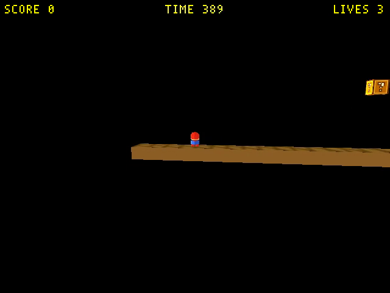
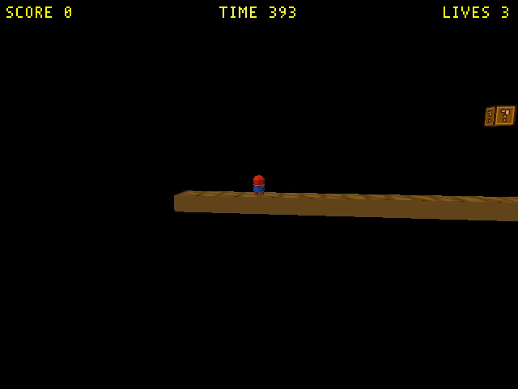
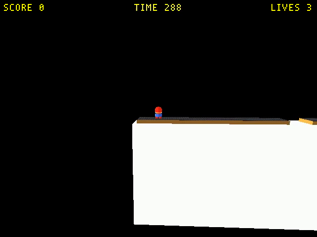
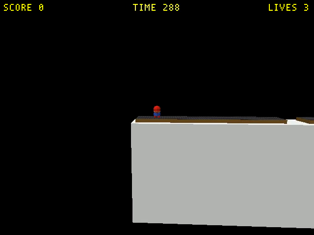
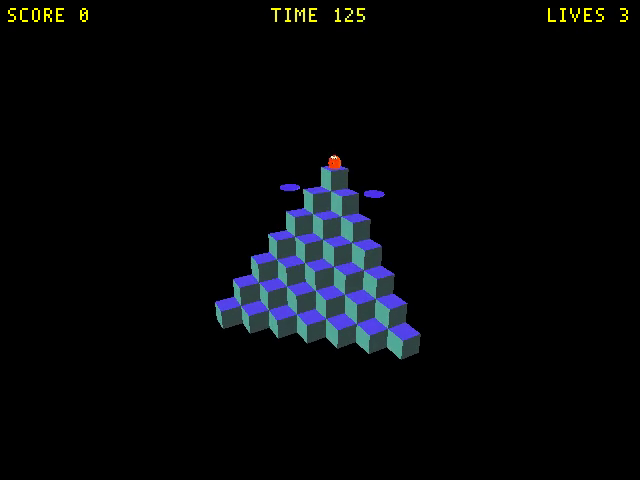
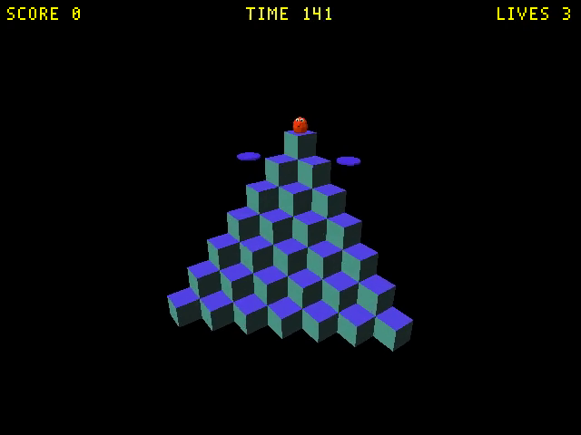
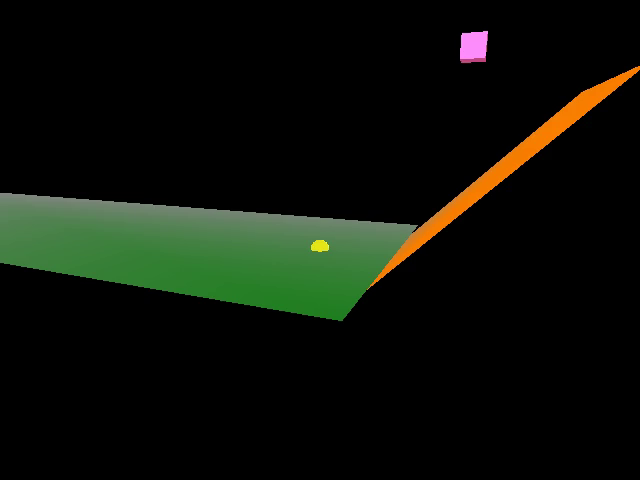
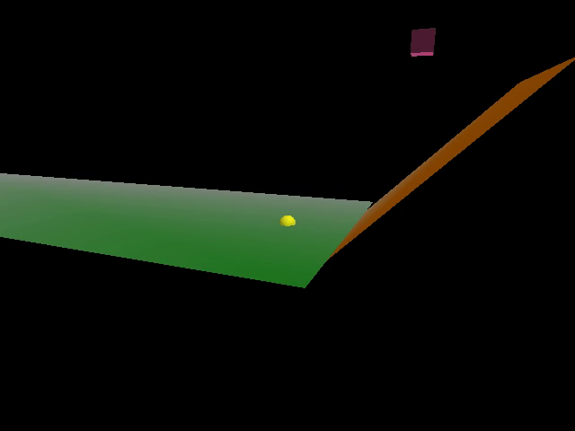
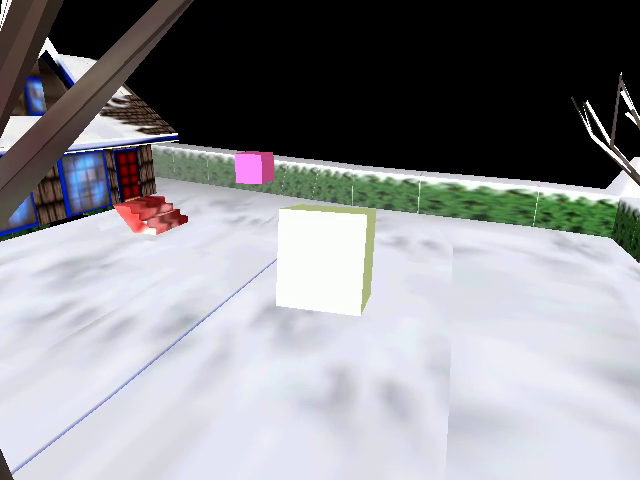
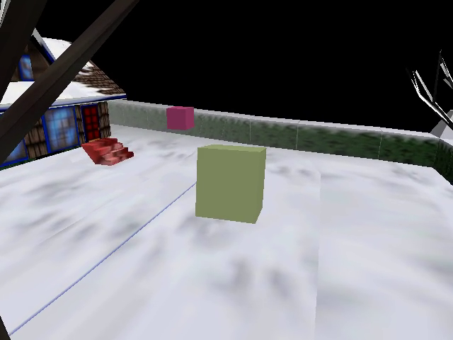

# Give the swept levels real key lighting instead of a fullbright ambient

TODO entry: **"Give the swept levels real key lighting instead of a fullbright ambient"** —
the named follow-up in
[`2026-09-20-engine-multi-directional-light-fix.md`](2026-09-20-engine-multi-directional-light-fix.md)
§ *Out of scope* → "Re-lighting the swept levels properly".

## Context

The engine fix corrected an inverted `lightType` enum. Eleven levels that authored only
Directional lights would have gone pure black, so the same change swept them with an
Ambient light **at their own fullbright `1.0` white** — a crutch that reproduces each
level's old (buggy) appearance rather than lighting it. Every one of those key lights was
also still authored with the old `(pi/2 - alt, 0, az)` recipe, which puts the altitude in
the one euler angle that cannot move the local +X axis `Light::Set` reads the direction
from, so the beam was exactly horizontal and lit nothing the camera saw.

This pass re-aims each key light and drops each ambient toward the documented ~0.4 grey.

## What the earlier write-up got wrong about the sign

`docs/level-building.md` said *"B = altitude tips the beam down by that many degrees"*,
treating the vector as the direction the light **travels**. It is not. `Light::Set` passes
the actor's local +X axis to `RenderCamera::SetDirectionalLight`
([`gfx/camera.hpi:68`](../../wfsource/source/gfx/camera.hpi)), which stores it unchanged,
and the vertex shader uses it as **L**:

```glsl
lit += u_light_color[i] * max(0.0, dot(N, u_light_dir[i]));   // backend_modern.cc:86
```

Nothing anywhere negates it. So `dir = Rz(C)·Ry(B)·(1,0,0) = (cos B·cos C, cos B·sin C,
-sin B)` is the vector pointing **toward** the light, and a face is lit when its normal
aligns with it. A light meant to sit `alt` degrees above the horizon therefore needs
`Lz > 0`, i.e. `B = -radians(alt)`.

**And then winding decides the sign in practice.** Much of the shipped content is wound
**inward** — the faces the camera sees carry `-Z` / `+Y` normals, the case already
documented in [`level-design-troubleshooting.md`](../level-design-troubleshooting.md)
("Mesh face normals & backface culling", the reason `WF_CULL` is opt-in). Those levels need
the *mirrored* aim to read as "lit from above". Measured, one level at a time, by building
with `ambient = 0, key = 1.0` and capturing — an aim pointed the wrong way puts **every**
visible face at exactly the ambient term:

| Level family | Winding | Aim that lights the visible faces |
|---|---|---|
| `qbert_practice`, `marble-madness{,-2}` | outward | `alt = +52°`, `az = 235°` |
| `smb_w1_*`, `snowgoons{,-blender}`, `pilot_demo` | inward | `alt = -57°/-52°`, `az = 56°/55°` |

`smb_w1_1` with `alt = +45°`: ground top **0.0**, ground front **0.0** (pure ambient).
Mirrored: top **46.6**, front **89.4** with zero ambient. `snowgoons-blender` with the
outward aim: mean frame luminance **3.7** (near-black); mirrored: **109.9**.

This is a property of the *assets*, not a second engine bug, and it is why the aim per
level is recorded here rather than derived from a formula.

## Approach

`scripts/relight_level.py` (new) — the counterpart to the sweep's
`scripts/add_ambient_light.py`. For a `.lev` it rewrites every Directional light's
`Orientation` euler to `(0, -radians(alt), radians(az))` and its RGB, and every Ambient
light's RGB. It handles both `.lev` layouts in the tree (the flat exporter form and the
nested 3ds-Max form) and has a read-only `--show`.

Levels with a Blender generator (`smb_w1_1..4`, `qbert_practice`, `pilot_demo`) get the
same values written into the generator too, via a local `wf_light_aim()` helper carrying
the derivation — so a regeneration does not silently undo the pass. `marble-madness`,
`marble-madness-2` and `snowgoons` have no generator for their shipped `.lev` and are
`.lev`-only, as in the sweep.

`snowgoons` has no `build_level_binary.sh` entry (its `.lev` lives in
`wflevels/snowgoons-blender/` under a different name), so it was rebuilt with the four
documented stages from
[`../investigations/2026-04-19-snowgoons-build-pipeline.md`](../investigations/2026-04-19-snowgoons-build-pipeline.md);
`levcomp-rs` re-emitted `snowgoons.iff.txt` byte-identically, so the padded zForth script
slots are intact.

## Per-level values

| Level | alt / az | key | ambient | The look |
|---|---|---|---|---|
| `smb_w1_1` | −57° / 56° | 0.65 | 0.42 | Sun from above-ahead: ground/block **tops** hold their old brightness, the camera-facing front faces drop to ~0.71 — the slab finally reads as a solid with a lit top edge. |
| `smb_w1_2` | −57° / 56° | 0.65 | 0.42 | Same recipe, same family. |
| `smb_w1_3` | −57° / 56° | 0.65 | 0.42 | Same recipe, same family. |
| `smb_w1_4` | −57° / 56° | 0.65 | 0.42 | Same recipe; the castle's big white wall comes off its clipped pure-white and reads as a grey plane. |
| `qbert_practice` | +52° / 235° | 0.60 | 0.50 | Classic isometric three-tone: blue top faces brightest, the two side faces at distinct mid values. Ambient held above 0.4 because the pyramid is the only thing on screen. |
| `marble-madness` | +52° / 235° | 0.65 | 0.40 | Green course floor keeps its brightness while the orange ramp turns to a shaded plane — the first time the two read as different surfaces. |
| `marble-madness-2` | +52° / 235° | 0.65 | 0.40 | Same recipe. Honest caveat: the opening view is one horizontal plane seen from above, so it looks all but identical; the lighting only pays off where the course has walls. |
| `snowgoons` | −52° / 55° | 0.65 | 0.40 | Snow stays bright, the crate/hedge/house pick up face-to-face shading — the crate was a blown-out white block before. |
| `snowgoons-blender` | −52° / 55° | 0.65 | 0.40 | Same recipe (same scene, Blender-rebuilt variant). |
| `pilot_demo` | −52° / 55° | 0.65 | 0.40 | Inherits snowgoons' scaffold light; ground plane lands within ~3 % of its shipped brightness with a real 0.40 ambient underneath it. |

## Screenshots

`smb_w1_1` — before (fullbright ambient) / after:

 

`smb_w1_4` — the castle wall comes off pure white:

 

`qbert_practice`:

 

`marble-madness`:

 

`snowgoons`:

 

## Out of scope

- **The condo** (`condo_639_640{,_tour}`) — already re-aimed by the engine-fix change, and
  explicitly excluded here. Note for whoever touches it next: its `wf_light_aim()`
  docstring still describes B as "tips the beam **down**". The condo looks right because
  its geometry is inward-wound, not because that sentence is true; the numbers need no
  change, the comment does.
- **`mm_practice_blender{,_rt}`** — still blocked on the pre-existing rebuild defect
  recorded in the engine-fix plan's Verification step 8.
- **`main_game`** — no runtime-verifiable build path here, same as in the sweep.
- **Making the inward-wound levels culling-correct.** Re-winding those meshes would flip
  every aim in the table above; it is the real fix and a separate effort (it is what
  `WF_CULL=1` is waiting on).

## Verification

1. **Every relit level still loads, runs to the timeout, and asserts zero times**, and its
   mean frame luminance at t=4 s is compared against the same capture from the `HEAD`
   (pre-relight) `.iff`.

```
level                before                after
marble-madness       asserts=0 lum=14.3    asserts=0 lum=12.3
marble-madness-2     asserts=0 lum=8.5     asserts=0 lum=8.4
pilot_demo           asserts=0 lum=42.3    asserts=0 lum=41.0
qbert_practice       asserts=0 lum=1.9     asserts=0 lum=1.6
smb_w1_1             asserts=0 lum=5.0     asserts=0 lum=3.8
smb_w1_2             asserts=0 lum=8.2     asserts=0 lum=6.1
smb_w1_3             asserts=0 lum=4.3     asserts=0 lum=3.1
smb_w1_4             asserts=0 lum=65.8    asserts=0 lum=47.1
snowgoons            asserts=0 lum=142.5   asserts=0 lum=122.8
snowgoons-blender    asserts=0 lum=142.5   asserts=0 lum=122.8
```

**PASS** — 10/10 load, run to the timeout, and assert zero times. Whole-frame means drop,
which is the point: a flat `1.0` ambient saturates every visible face, and a key light plus
a 0.4 fill does not. Nothing went dark — on the two levels that fill the frame
(`snowgoons`, `smb_w1_4`) the drop is 14 % and 28 %, and the 28 % is the castle's
blown-out white wall coming back into range. The three sub-10 numbers (`qbert`,
`smb_w1_1/3`) are frames that are ~90 % black sky, so a small absolute change reads as a
large percentage; measured on lit pixels only at the matched t=10 s framing below, `qbert`
lands at 0.86 of its old value (97.1 → 83.8) and `marble-madness`'s course floor is
unchanged.

`qbert_practice` at t=4 s is captured while its intro camera is still pulling back, so the
pair above is not framed identically; the screenshots below are the matched t=10 s pair.

2. **`scripts/relight_level.py --show` round-trips both `.lev` layouts.**

```
$ python3 scripts/relight_level.py --show wflevels/smb_w1_1/smb_w1_1.lev \
    wflevels/snowgoons-blender/snowgoons.lev wflevels/qbert_practice/qbert_practice.lev
wflevels/smb_w1_1/smb_w1_1.lev
  Light01              Directional  eul_deg=[0.0, 57.0, 56.0] rgb=[0.65, 0.65, 0.65]
  Light_coin           Directional  eul_deg=[0.0, 57.0, 56.0] rgb=[0.65, 0.65, 0.65]
  AmbientLight00       Ambient      eul_deg=[60.0, -0.0, 0.0] rgb=[0.42, 0.42, 0.42]
  AmbientLight01       Ambient      eul_deg=[60.0, -0.0, 0.0] rgb=[0.42, 0.42, 0.42]
wflevels/snowgoons-blender/snowgoons.lev          # nested 3ds-Max layout
  light_7              Directional  eul_deg=[0.0, 52.0, 55.0] rgb=[0.65, 0.65, 0.65]
  light_18             Directional  eul_deg=[0.0, 52.0, 55.0] rgb=[0.65, 0.65, 0.65]
  AmbientLight00       Ambient      eul_deg=[89.99, 0.0, 0.0] rgb=[0.4, 0.4, 0.4]
  AmbientLight01       Ambient      eul_deg=[89.99, 0.0, 0.0] rgb=[0.4, 0.4, 0.4]
wflevels/qbert_practice/qbert_practice.lev
  Light01              Directional  eul_deg=[0.0, -52.0, 235.0] rgb=[0.6, 0.6, 0.6]
  AmbientLight         Ambient      eul_deg=[90.0, -0.0, 45.0] rgb=[0.5, 0.5, 0.5]
```

**PASS** — B reads back as `-alt` in both layouts (the Ambient actors keep their inherited
euler; it is unused for an Ambient light).

3. **Every edited generator script still compiles.**

```
$ for f in wflevels/*/blender_create_*.py scripts/relight_level.py; do python3 -m py_compile "$f"; done
OK wflevels/smb_w1_1/blender_create_smb.py
OK wflevels/smb_w1_2/blender_create_smb_w1_2.py
OK wflevels/smb_w1_3/blender_create_smb_w1_3.py
OK wflevels/smb_w1_4/blender_create_smb_w1_4.py
OK wflevels/qbert_practice/blender_create_qbert.py
OK wflevels/pilot_demo/blender_create_pilot_demo.py
OK scripts/relight_level.py
```

**PASS.** Not yet re-run under Blender — the generators are kept in sync with the `.lev`
by hand here, exactly as the preceding sweep did.

4. **Only the intended files are staged** — the condo work in flight on this tree is left
   unstaged.
