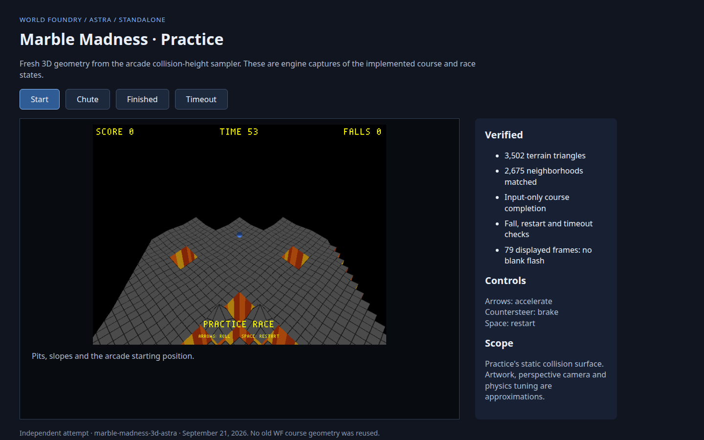

# Add Astra Marble Madness to cd.iff

**Status:** Complete — Astra is bundled as level 6 in the main and Astra checkouts

Will requested that the completed Astra course be added to `cd.iff`. This explicitly supersedes the original attempt's standalone-only restriction. The main checkout is the user's launch location; update its canonical bundle and the Astra worktree's bundle recipe.

- [x] Append the verified Astra standalone at level 6, retaining the original six indices and default SMB boot.
- [x] Bring the Astra HUD and live screenshot presentation fix into the main engine so the bundled course retains its race feedback.
- [x] Make `task run-marble-3d-astra` load index 6 from local `cd.iff`; pass numeric selection through `task run -- 6`.
- [x] Rebuild both bundles and the main engine; verify all six old level payloads remain identical.
- [x] Run and complete level 6 from the main bundle on a private display, smoke-test the default boot, and record results below.

The main bundle source is `wflevels/marble-madness-3d-astra-standalone.iff`. Authoring sources and their detailed fidelity notes remain on branch `marble-madness-3d-astra` under `wflevels/marble-madness-3d/`. The existing standalone launcher script remains available there. The Android asset is already a symlink to the canonical `wfsource/source/game/cd.iff`; Android runtime is not tested in this change.

[](2026-09-21-add-marble-astra-to-cd-iff/practice-review.html)

The review illustrates the same course now being packaged. Its original verification counters describe the standalone run; the bundled-run results are recorded below.

## Verification

1. Build the engine and both `cd.iff` bundles.

```text
$ task build

=== Linking ===

Built: /home/will/WorldFoundry-wbniv/engine/wf_game
Run:   cd /home/will/WorldFoundry-wbniv/wfsource/source/game && DISPLAY=:0 /home/will/WorldFoundry-wbniv/engine/wf_game

$ task build-cd-iff  # main checkout
cdpack: wrote 1384448 bytes to wfsource/source/game/cd.iff
  SHEL: 98 bytes (sector 1)
  L0: 149504 bytes at sector 2 (smb_w1_1-standalone.iff)
  L1: 163840 bytes at sector 75 (smb_w1_2-standalone.iff)
  L2: 133120 bytes at sector 155 (smb_w1_3-standalone.iff)
  L3: 126976 bytes at sector 220 (smb_w1_4-standalone.iff)
  L4: 167936 bytes at sector 282 (snowgoons-standalone.iff)
  L5: 366592 bytes at sector 364 (qbert_practice-standalone.iff)
  L6: 272384 bytes at sector 543 (marble-madness-3d-astra-standalone.iff)

$ task build-cd-iff  # Astra worktree
cdpack: wrote 1384448 bytes to wfsource/source/game/cd.iff
  SHEL: 98 bytes (sector 1)
  L0: 149504 bytes at sector 2 (smb_w1_1-standalone.iff)
  L1: 163840 bytes at sector 75 (smb_w1_2-standalone.iff)
  L2: 133120 bytes at sector 155 (smb_w1_3-standalone.iff)
  L3: 126976 bytes at sector 220 (smb_w1_4-standalone.iff)
  L4: 167936 bytes at sector 282 (snowgoons-standalone.iff)
  L5: 366592 bytes at sector 364 (qbert_practice-standalone.iff)
  L6: 272384 bytes at sector 543 (marble-madness-3d-standalone.iff)
```

PASS. Main engine built; both canonical bundles were rebuilt. Android's existing asset symlink resolves to the updated canonical file, but Android execution was not tested.

2. Verify the seven-entry level table, unchanged shell/default boot, byte-identical original six payloads, and exact Astra payload.

```text
PASS: shell/default boot unchanged (98 bytes)
PASS: existing level 0 unchanged (149504 bytes)
PASS: existing level 1 unchanged (163840 bytes)
PASS: existing level 2 unchanged (133120 bytes)
PASS: existing level 3 unchanged (126976 bytes)
PASS: existing level 4 unchanged (167936 bytes)
PASS: existing level 5 unchanged (366592 bytes)
PASS: Astra appended at level 6, sector 543, 272384 bytes; exact standalone payload
PASS: main and Astra bundles identical, 7 levels, 1384448 bytes
SHA-256: d6e82c87e0b54510d99d90267db49351df68a8432d802c948569e4bbbc6fd996
```

PASS. Seven level entries plus SHEL. All original indices, offsets and payloads remain unchanged; Astra is an exact copy of the verified standalone input.

3. Boot the main bundle normally, then complete bundled level 6 using directional input and confirm the race HUD.

```text
PASS: default cd.iff boot reached rendered frame 45
PASS: task run-marble-3d-astra loaded bundled level 6 with active race HUD
t=0 waypoint=0 xyz=-0.00,0.00,0.48 race=1 falls=0 time=59.8
t=1 waypoint=0 xyz=2.32,2.33,0.43 race=1 falls=0 time=58.8
t=2 waypoint=1 xyz=3.57,5.90,-0.44 race=1 falls=0 time=57.9
t=3 waypoint=1 xyz=3.98,9.62,-0.85 race=1 falls=0 time=56.8
t=4 waypoint=3 xyz=4.47,13.14,-1.24 race=1 falls=0 time=55.8
t=5 waypoint=4 xyz=5.75,16.25,-1.81 race=1 falls=0 time=54.8
t=6 waypoint=5 xyz=8.23,19.05,-2.01 race=1 falls=0 time=53.8
t=7 waypoint=5 xyz=12.56,19.08,-2.89 race=1 falls=0 time=52.8
t=8 waypoint=5 xyz=17.08,19.28,-3.17 race=1 falls=0 time=51.8
t=9 waypoint=6 xyz=20.46,20.72,-3.19 race=1 falls=0 time=50.8
t=10 waypoint=6 xyz=23.28,23.46,-3.19 race=1 falls=0 time=49.8
t=11 waypoint=6 xyz=26.16,26.19,-3.15 race=1 falls=0 time=48.8
t=12 waypoint=6 xyz=29.16,28.96,-3.80 race=1 falls=0 time=47.8
t=13 waypoint=6 xyz=31.85,31.87,-3.17 race=1 falls=0 time=46.8
t=14 waypoint=8 xyz=34.84,32.62,-3.49 race=1 falls=0 time=45.9
t=15 waypoint=8 xyz=37.70,34.75,-4.05 race=1 falls=0 time=44.9
t=16 waypoint=9 xyz=38.93,38.29,-4.07 race=1 falls=0 time=43.8
t=17 waypoint=10 xyz=39.04,41.55,-4.08 race=1 falls=0 time=42.8
t=18 waypoint=11 xyz=42.12,43.48,-3.93 race=1 falls=0 time=41.8
t=19 waypoint=12 xyz=45.88,43.66,-3.98 race=1 falls=0 time=40.8
t=20 waypoint=13 xyz=48.56,45.67,-4.03 race=1 falls=0 time=39.8
t=21 waypoint=13 xyz=48.88,49.69,-4.05 race=1 falls=0 time=38.8
t=22 waypoint=14 xyz=48.79,53.93,-4.02 race=1 falls=0 time=37.8
PASS: bundled Astra completed using directional input only; zero falls; 37.34s remaining
PASS: no AddressSanitizer or script compilation errors
```

PASS. The actual main-checkout Task launcher loaded bundled level 6 and completed it with zero falls and 37.34 seconds remaining. Default boot still renders SMB. The run used a private X display and did not disturb the visible game window.

4. Verify Task launch commands and stage only this integration's files.

```text
task: Task "ensure-build" is up to date
task: [run-marble-3d-astra] LD_LIBRARY_PATH=../../../engine/libs DISPLAY=${DISPLAY:-:0} ../../../engine/wf_game  6
task: Task "ensure-build" is up to date
task: [run] LD_LIBRARY_PATH=../../../engine/libs DISPLAY=:0 ../../../engine/wf_game 6
```

PASS. Named and numeric launch commands resolve correctly. Only Taskfile, the integration plan/TODO/evidence, Astra bundle input, canonical cd.iff, and the three already-verified HUD/presentation engine files are staged in the main checkout. Pre-existing memory, transcript and pilot screenshot changes are excluded.

[Default SMB boot](2026-09-21-add-marble-astra-to-cd-iff/default-boot.png) · [Bundled Astra start](2026-09-21-add-marble-astra-to-cd-iff/astra-start.png) · [Bundled Astra finish](2026-09-21-add-marble-astra-to-cd-iff/astra-finish.png).
