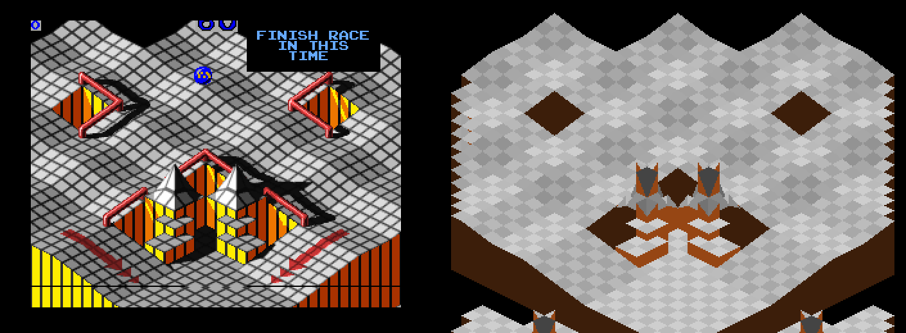
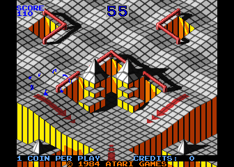
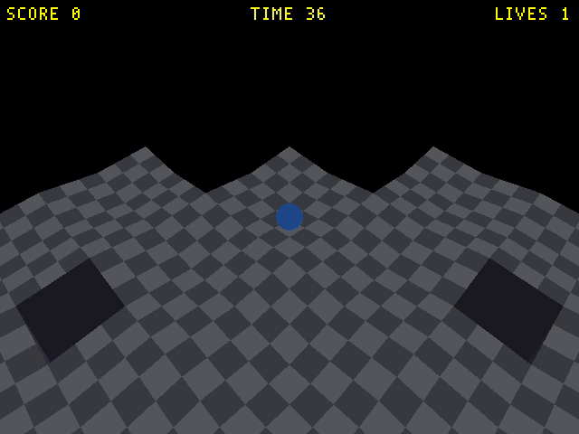
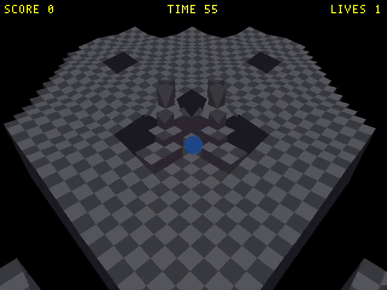
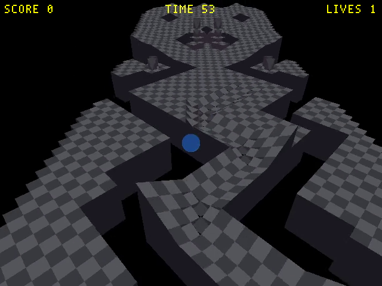
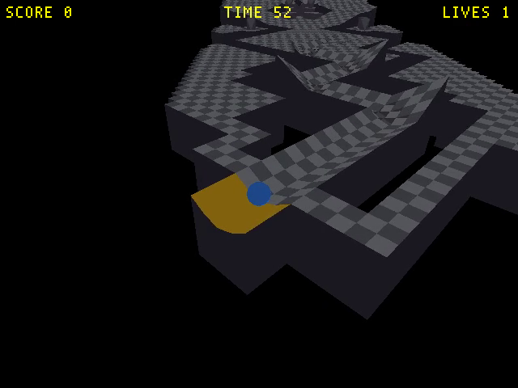
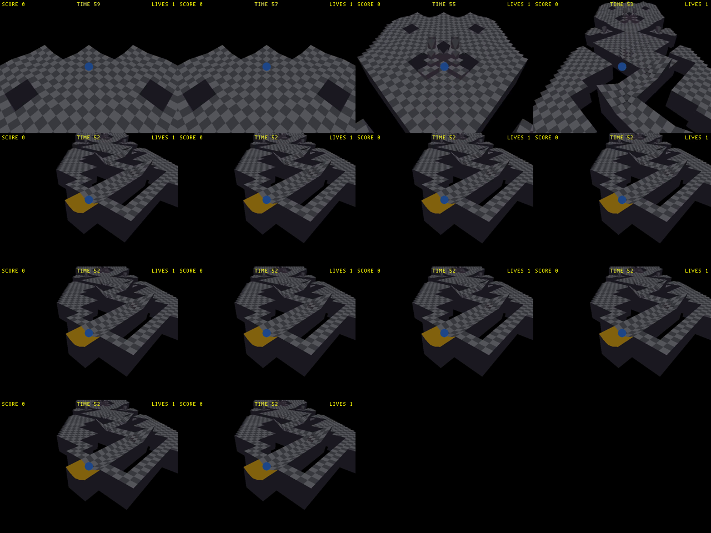

# Plan: Marble Madness — true-3D reimplementation (independent attempt)

**Date:** 2026-09-21
**Status:** In progress 2026‑09‑22 — real course geometry recovered from the arcade (see Approach); WF pipeline being built
**Goal:** A faithful, true-3D reimplementation of arcade Marble Madness's courses in WorldFoundry, built fresh — not by extending the existing stalled implementation. This is one of **two independent, parallel attempts** (this one, on branch `marble-madness-3d-fable`; a second on branch `marble-madness-3d-astra`, built by a different AI tool in a separate worktree). Will is comparing the two approaches; they must not share code or coordinate with each other.

## Why "start fresh" — read this first

WorldFoundry already has a Marble Madness recreation effort at `wflevels/marble-madness/` (see `docs/marble-madness/README.md`), and separately the currently-shipped `marble-madness`/`marble-madness-2` levels in `wflevels/`. **Will's explicit instruction: ignore both existing implementations. Do not read, reuse, extend, or build on top of their `.lev`/`.iff`/Blender-script files.** The existing effort's own verdict on the shipped levels was that they were never accurate arcade conversions (physics/ball-movement was fine, course geometry was not), and the ROM-faithful effort stalled part-way (M3 of 5, see `docs/plans/2026-05-01-marble-madness-faithful.md` for what that means if you're curious about *why* it stalled, but do not treat its implementation choices as a starting point).

**What you SHOULD use freely — all the prior research, none of the prior implementation:**

- `docs/investigations/2026-05-01-marble-madness-rom-level-data.md` — how the arcade ROM's level data was located and decoded. This is the ground truth for accurate course geometry: real arcade level layouts, not guesses.
- `docs/investigations/2026-05-01-mm-level-elevations.md` — elevation/height-field data for the courses, with MAME reference screenshots for cross-checking.
- `wflevels/marble-madness/decode_levels.py` and `wflevels/marble-madness/levels.json` (already-decoded output) — **you may run/read the decoder and use its output data**, but do not reuse `rom_to_blender.py` or any of the Blender scene scripts that consume it; write your own geometry pipeline.
- `assets/arcade-roms/marble.zip` — the vendored ROM the decoder reads, if you need to re-derive anything the decoder doesn't already expose.
- `docs/plans/2026-05-02-level-recreation-workflow.md` — process notes on how the previous effort approached level recreation (useful context on pitfalls, not a spec to follow).
- `docs/plans/2026-05-01-marble-madness-faithful.md` — the previous effort's full milestone breakdown (M1–M5+), physics/camera notes (isometric camera math, camera-relative input, fixed-point angle format gotchas), and its 42-test coverage target table. Read this for the *domain knowledge* (what an accurate camera/physics/course setup needs to get right) — the specific files it produced are what you're not reusing.
- `docs/plans/2026-04-28-marble-player-sphere.md`, `docs/plans/2026-04-28-replace-player-mesh-with-sphere-marble-in-marble.md`, `docs/plans/2026-04-30-duplicate-marble-madness-level-for-physics-motion-co.md` — smaller prior investigations into ball/physics representation, same rule: read for findings, don't reuse the artifacts.
- General engine docs: `docs/level-building.md`, `docs/level-design-troubleshooting.md`, `docs/level-layouts.md`, `~/WorldFoundry-wbniv/CLAUDE.md` (coordinate systems, Euler angle conventions — read carefully, there's a documented bug in a code comment vs. the actual implementation, noted there).

## What "true 3D" means here

The shipped `marble-madness`/`marble-madness-2` levels are simplified/inaccurate course geometry riding on the engine's existing 3D renderer and (per the recent backface-culling effort) correctly-wound meshes — but the *courses themselves* don't match the arcade original's layout. "True 3D reimplementation" means: use the engine's real 3D physics (Jolt, already integrated — see `wfsource/source/physics/jolt/`) and real 3D course geometry derived from the decoded ROM data, so the marble actually rolls on accurately-shaped 3D terrain (slopes, chutes, ramps, gaps) matching the arcade courses' real elevation/layout data, viewed from an isometric-style camera as the original used.

## Scope

Pick your own implementation path, but the deliverable should be:

1. At least one fully accurate, playable course (Practice and/or Beginner are the natural starting points — smallest courses, per the ROM data). Judge "accurate" against the decoded level data and the MAME reference screenshots in the elevations investigation, not against the existing WF implementation.
2. A clear write-up of your approach: how you turned the decoded ROM data into WF level geometry, what your camera/physics setup is, what's faithful vs. approximated and why, and how far you got (which of the 6 arcade courses — Practice, Beginner, Intermediate, Aerial/Advanced, Silly, Ultimate — are complete vs. not attempted).
3. If you have time/budget after a first accurate course, extend to more courses — but a single genuinely accurate course beats a rough pass at all six.

## Where to put it

New level(s) under `wflevels/marble-madness-3d/` (or similar — your call), **not** inside the existing `wflevels/marble-madness/` directory, so there's no risk of colliding with or accidentally modifying the existing implementation. Don't touch `wflevels/marble-madness/`, `wflevels/marble-madness-2/`, or the shipped `cd.iff` bundle list — this is a standalone, non-shipped level for now, run directly via `wf_game -L<path>`, same as the existing effort's levels are.

## Process

Follow this repo's normal conventions: plan-first (this doc, update it as you go), commit at natural checkpoints on your branch (`marble-madness-3d-fable`), don't touch files outside your remit. `task build` must stay green throughout. Write up verification the way this repo does it elsewhere (numbered steps + raw output + PASS/FAIL) rather than prose claims.

---

## Approach (Fable attempt) — added 2026‑09‑22

**Ground truth first.** The decoded `levels.json` from the May effort is *not* the course geometry: Practice decodes there to 13 segments with one 27° bend, Intermediate to 4 — while the arcade Practice is a plateau with pits and a multi‑hairpin chute. So this attempt reverse‑engineered the surface code in the running ROM instead. Full write‑up: [2026‑09‑22 surface algorithm investigation](../investigations/2026-09-22-marble-madness-surface-algorithm.md). In one paragraph: the arcade stores no height map; the game reads the isometric *tile art* under the marble from playfield VRAM, maps the tile through a per‑level tile→surface table, and gets four height words per 8×8‑unit cell that describe one lattice vertex from its four neighbours (cliffs = differing words, void = 0). A Python re‑implementation of the two 68000 routines, driven by MAME memory dumps, reproduces the game's own ground height exactly along the attract‑mode demo.

**Pipeline (all under `wflevels/marble-madness-3d/`):**

1. `extract_course.sh` → runs MAME headless with `scripts/research/mame/mm/mm_demo_sweep.lua` (dumps RAM + VRAM every 50 frames while the attract demo plays the course), then `mm_merge_course.py` (the decoder, merging the scrolling VRAM window across dumps) → `course-practice.json` (1729 solid cells, arcade units).
2. `mm_course_to_level.py` → `course.json` in the generator's contract: 1 arcade unit = 0.1 m (cell = 0.8 m, marble radius 0.5 m), height unit = 0.08165 m (2:1 iso ⇒ 30° elevation ⇒ Z = 0.8165·h), course point‑mirrored so the WF camera at (−d,−d,+h) looking toward +X+Y reproduces the arcade view (screen‑right = Y−X).
3. `gen_course.py` (headless Blender) → `.lev` → `task build-mm3d` → `wflevels/marble-madness-3d-standalone.iff`; `task run-mm3d`.

**Faithful vs approximated:**

| aspect | status |
|---|---|
| course floor geometry (Practice) | faithful — every walkable cell's four corner heights are the game's own values |
| cliffs / drops | faithful (vertex‑per‑side data) |
| decorative lower terraces (−58/−84 levels, non‑walkable) | omitted for now |
| camera | SW iso follow camera; perspective, not the arcade's orthographic 2:1 |
| physics | Jolt + MarbleHandler; tuned by feel, not the arcade's fixed‑point integrator |
| hazards, checkpoints, timer HUD, sounds | not attempted |

**Courses:** Practice — geometry done, level build in progress. Beginner … Ultimate — not attempted (the sweep captures Beginner too; courses taller than 128 iso rows need the VRAM wrap handled, see investigation "Limitations").

## Screenshots

**Arcade vs decoded geometry** — 31 MAME captures stitched by scroll register (left) against the decoded heightfield rendered in the arcade's own 2:1 projection (right):


**Start plateau, enlarged** — the two gate pits, the central pyramid pit with its two spike cones and stepped bowl, and the side ramps line up:



**In engine** — arcade start screen (MAME) next to the WF level at spawn, then the central pit, the chute, and the goal trough (amber) during the scripted traversal:

 

 



## Verification

1. `bash wflevels/marble-madness-3d/extract_course.sh --out-dir /tmp/mm3d-sweep` regenerates `course-practice.json` with 1729 cells.

    ```
    2026-09-22T12:06:15Z ROM=/home/will/Downloads/marble.zip level=0 out=…/verify-sweep
    31 usable dumps for level 0
    wrote 1729 cells, extent [7, 7, 80, 83], 48 conflicts -> wflevels/marble-madness-3d/course-practice.json
    1729 cells, cell_size=0.8 m, spawn=[-13.997, -14.0, 0.55], goal={'min': [-64.8, -54.4, -4.17], 'max': [-61.6, -51.2, 0.06]}, kill_z=-6.25
    2026-09-22T12:06:33Z done
    ```
    **PASS** (the 48 "conflicts" are the 4 animated goal‑gate cells seen in 12 dumps each).

2. `python3 wflevels/marble-madness-3d/mm_surface.py … --cell 60 62` on the frame‑1000 demo dump prints `16342 ×4 | 16339 ×8 | 16342 ×4`, matching the game's words at `0x401C28`.

    ```
    level 0: struct=02BEE2 tile_tbl=081874 nrows=160
    cell (60,62) iso=(102, 12) -> 16342 16342 16342 16342 | 16339 16339 16339 16339 | 16339 16339 16339 16339 | 16342 16342 16342 16342
    ```
    Game (MAME Lua, frame 1000): `heights: 3FD6 3FD6 3FD6 3FD6 3FD3 3FD3 3FD3 3FD3 3FD3 3FD3 3FD3 3FD3 3FD6 3FD6 3FD6 3FD6` = 16342/16339. **PASS**

3. `task build-mm3d -- wflevels/marble-madness-3d/course.json` succeeds and `task run-mm3d` runs ≥ 10 s without assert.

    ```
    [5/5] iffcomp-rs  marble-madness-3d-standalone.iff.txt  →  ../marble-madness-3d-standalone.iff
    ✓ built /home/will/WorldFoundry-wbniv-mm3d-fable/wflevels/marble-madness-3d-standalone.iff (147456 bytes)
    $ WF_RECORD=… timeout 25 task run-mm3d; grep -cE 'AssertMsg|zforth compile|fell out of room|ignoring zone body|terminate called' log
    0
    EXIT=124   (killed by the 25 s timeout — it survived; recording 24.5 s)
    ```
    **PASS** — frame at 24 s is `engine-spawn.png` above.

4. A recorded frame shows the Practice plateau and chute from the iso camera; the marble rolls down the start slope with no input.

    First half PASS (frames above). Second half **N/A → replaced**: the arcade Practice start is flat (`h = 0` across cells 16–18), so the marble correctly stays put without input — the arcade also needs the joystick here. Replaced by step 5.

5. `tests/verify_mm3d_traversal.py` drives the marble with injected joystick input over the debug bridge (DOWN 8 s, DOWN+LEFT 8 s, DOWN+RIGHT 8 s) and parses the engine's `ball pos:` trace.

    ```
    19:24:39 hold DOWN (0x1000) for 8s
    19:24:47 hold DOWN+LEFT (0x5000) for 8s
    19:24:55 hold DOWN+RIGHT (0x3000) for 8s
    39 ball-pos samples; 0 bad log lines
      ball pos: (-14.00, -14.00, 0.50)
      ball pos: (-26.54, -26.80, -1.14)
      ball pos: (-57.59, -50.32, -1.73)
      ball pos: (-61.81, -52.93, -3.11)
      ball pos: (-61.80, -52.80, -3.15)   ← at rest in the goal AABB, FINISH freeze
    max horizontal travel 61.76 m; z from 0.50 to min -3.15
    video -> tests/screenshots/mm3d_traversal.mp4
    PASS
    ```
    **PASS with a caveat.** The marble rolls on the real terrain, drops into the chute and stops in the goal trough at `floor(−3.6) + radius 0.5`. But it got there in ~8 s by dropping off ledges (start plateau → central pit → chute): there is no fall‑death rule yet, so the course can be shortcut. Contact sheet (2 s per frame):

    

## Next

- Fall‑death: shatter/respawn when the marble lands after a drop taller than the arcade's threshold (needs peak‑Z tracking in the player script). Until then the course is traversable but not *enforced*.
- Decorative lower terraces (−58/−84 levels) as non‑walkable geometry.
- Beginner: sweep already captures it; handle the VRAM row wrap for courses taller than 128 iso rows.
- Physics constant (`Running Deceleration = 0.004`) is by feel; calibrate against the MAME demo trajectory (`scripts/research/mame/mm/mm_demo_dump_validate.lua` logs X,Y,Z per frame).
