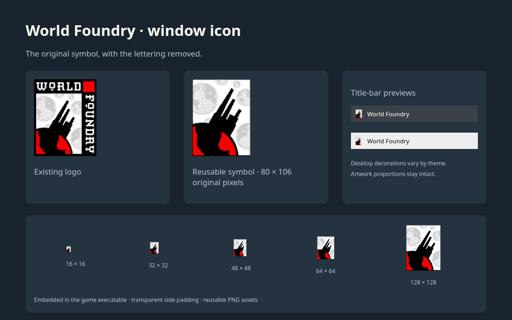

# World Foundry window icon

**Status:** Complete — main and Astra builds verified

Will requested the World Foundry symbol in the Linux game window's top-left corner. The current X11 creation path (`wfsource/source/gfx/gl/mesa.cc`) sets the window title but supplies no icon, so the desktop displays its generic X symbol.

## Approach

Extract the artwork rectangle from `wflogo.png`, removing the top WORLD text, right FOUNDRY text, and top-right red square. Preserve the original artwork pixels in a reusable `assets/branding/world-foundry-mark.png`. Generate square, transparent-padded sizes without stretching the rectangular mark, plus a checked-in C++ header containing X11 ARGB icon data. Embed it in the executable so launch directories and missing loose assets cannot affect the title-bar icon. Set `_NET_WM_ICON` before mapping the native Linux game window.

Apply the same icon files and change to the Astra worktree used in this session. Existing level controls stay unchanged: Will explicitly declined the proposed F10 binding.

- [x] Extract and document the reusable mark; generate icon sizes and embedded data.
- [x] Set the icon during X11 window creation in both checkouts.
- [x] Build and verify the published window property against the assets; inspect the desktop decoration.

## Review

[](2026-09-21-world-foundry-window-icon/mockup.html)

The review shows the original artwork, extracted symbol, light/dark title bars, and icon sizes. Only an existing native X11 window's branding changes.

## Verification

1. Regenerate the icon assets twice and verify identical output, original crop pixels, square dimensions, and preserved aspect ratio.

```text
Generated 80x106 mark; icons (16, 32, 48, 64, 128); 24074 X11 CARDINALs
PASS: regeneration is byte-identical
PASS: mark preserves the exact 80x106 source crop
PASS: 16x16 RGBA, centered 12x16 mark, transparent side padding
PASS: 32x32 RGBA, centered 24x32 mark, transparent side padding
PASS: 48x48 RGBA, centered 36x48 mark, transparent side padding
PASS: 64x64 RGBA, centered 48x64 mark, transparent side padding
PASS: 128x128 RGBA, centered 97x128 mark, transparent side padding
```

PASS. Regeneration is deterministic; the master matches the original crop and each icon preserves its aspect ratio with transparent padding.

2. Build the Linux game engine with the embedded icon.

```text
$ task build  # main checkout
=== Linking ===

Built: /home/will/WorldFoundry-wbniv/engine/wf_game
Run:   cd /home/will/WorldFoundry-wbniv/wfsource/source/game && DISPLAY=:0 /home/will/WorldFoundry-wbniv/engine/wf_game

$ task build  # Astra checkout
=== Linking ===

Built: /home/will/WorldFoundry-wbniv-mm3d-astra/engine/wf_game
Run:   cd /home/will/WorldFoundry-wbniv-mm3d-astra/wfsource/source/game && DISPLAY=:0 /home/will/WorldFoundry-wbniv-mm3d-astra/engine/wf_game
```

PASS. Both executables rebuilt. The first sandboxed build could not update submodule metadata; rerunning with filesystem authorization succeeded.

3. Launch bundled Astra and verify the live `_NET_WM_ICON` property matches every generated icon; capture the visible window decoration.

```text
PASS: live _NET_WM_ICON type CARDINAL, format 32
PASS: live 16x16 icon exactly matches PNG pixels
PASS: live 32x32 icon exactly matches PNG pixels
PASS: live 48x48 icon exactly matches PNG pixels
PASS: live 64x64 icon exactly matches PNG pixels
PASS: live 128x128 icon exactly matches PNG pixels
PASS: all 24074 CARDINALs verified, including dimensions, channels and alpha
PASS: Spectacle captured the active game window with compositor decorations
```

PASS. All five live icons match the PNGs. The captured KDE title bar visibly uses the World Foundry mark. Xlib property reads were normalized to their low 32 bits before comparison; X11 capture alone omits the Wayland compositor decoration, so the final screenshot uses Spectacle.

4. Confirm both checkouts contain identical icon changes and that no F10 or level-navigation code was added.

```text
PASS: 10 branding/source files identical in main and Astra checkouts
PASS: X11 keyboard/event handlers unchanged
PASS: game level selection and TOC code unchanged; no F10 binding
PASS: review HTML and PNG files fit plan bundle limits
```

PASS. Shared icon assets and code are identical. Will’s declined F10 proposal was not implemented.

[Live window with the new title-bar icon](2026-09-21-world-foundry-window-icon/live-window.png).
