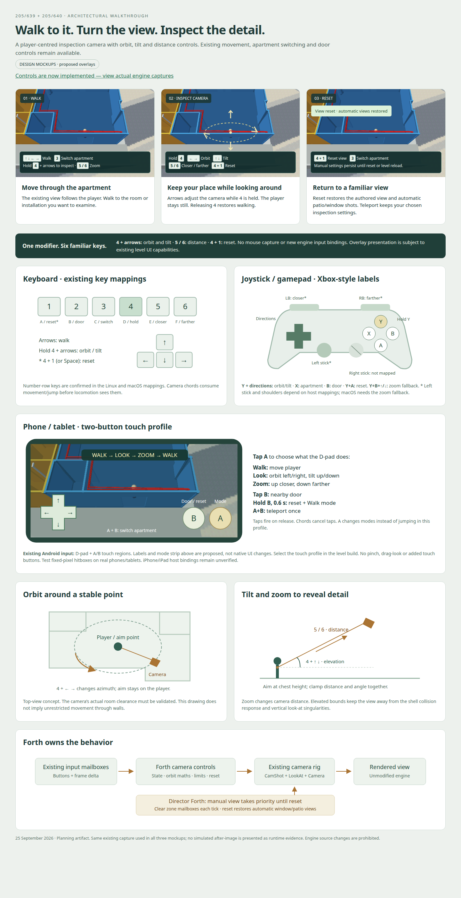

# Condo architectural walkthrough camera controls

Status: implemented and verified in the existing desktop engine. Physical-device
validation remains open; no engine source changes were made.

- [x] Inspect existing camera, input and Forth integration points.
- [x] Write the implementation plan and keyboard/gamepad/touch mappings.
- [x] Render and visually inspect the mockups and diagrams.

Will requested architectural walkthrough camera controls implemented entirely in
Forth, with no engine changes. Start with a player-centred inspection camera:
walk to a room or installation, orbit to inspect it, adjust elevation and distance,
then resume walking. This works with the existing apartment switching and avoids
making an independent free-flying camera the first interaction users must learn.

## Mockups and diagrams

[Open the proposed controls and camera diagrams](2026-09-25-condo-camera-controls/mockups.html).
The mockups use a captured condo walkthrough as their background. Controls and
annotations are proposed; the background is not evidence of implemented orbiting.
The diagrams show the intended geometry and script ownership.

## Controls

| Input | Action |
|---|---|
| Arrows | Walk, as today |
| Hold **4** + Left / Right | Orbit around the player |
| Hold **4** + Up / Down | Raise / lower the viewing angle |
| Hold **5** / **6** | Move the camera closer / farther away |
| Hold **4** + **1** (or Space) | Reset view and return to automatic camera selection |
| **3** | Switch 639 / 640, preserving the camera settings |
| **2** | Existing nearby project-room door button |

These use existing logical buttons D, E, F, A, C and B. Linux currently maps
4/5/6 to D/E/F; no new keyboard, mouse or controller bindings are needed. Mouse
look and a detached free-fly mode are outside this first increment.

Holding 4 consumes movement and jump input and clears horizontal momentum so the
player stays put while inspecting. Releasing it restores walking. Zoom can be
used while walking. Reset wins over simultaneous camera adjustment, and fires
once per press. Teleport remains available and cancels movement for that frame.

Changing orbit, tilt or zoom selects the manual inspection view. It remains
active after releasing the keys, including near window/patio camera zones.
Reset restores the authored doll-house offset and automatic window/patio views.
Merely holding 4, without changing the view, need not change camera selection.

## Joystick and gamepad mapping

The visual guide includes a controller diagram and keyboard map. Physical labels
below use Xbox-style positions; the Forth script reads logical button bits.
A PlayStation-style controller uses Cross / Circle / Square / Triangle in the
same south / east / west / north positions when its host mapping follows that
layout. Do not assume printed labels on every controller correspond to WF bits.

| Physical input | WF input | Proposed action |
|---|---|---|
| D-pad or mapped left stick | Directions | Walk |
| Hold Y (north) + directions | D + directions | Orbit / tilt |
| LB / RB, where mapped | E / F | Closer / farther |
| Hold Y + B + Up / Down | D + B + directions | Closer / farther fallback |
| Y + A | D + A | Reset camera |
| X (west) | C | Teleport between apartments |
| B (east), without modifier | B | Nearby door |

The zoom fallback consumes B so it cannot also operate a door. Y+A reset has
priority over other camera chords. Native macOS currently maps the D-pad/left
stick and A/B/X/Y, but not shoulders; the fallback is therefore required. Android
maps controller L1/R1 to E/F. Linux physical joystick mapping must be verified on
the actual device; its numeric keyboard mapping is confirmed in `gfx/gl/mesa.cc`.
The right stick is not exposed by these inspected mappings. Do not label it as
mouse-look or add an engine binding for it. Analogue sticks currently become
digital directions, so rates come from Forth and elapsed time, not stick travel.

## Phone and tablet mapping

Android's existing `HitTestTouch` exposes a bottom-left D-pad and bottom-right
A/B regions, including simultaneous touches. It does not expose touch C/D/E/F,
raw drag deltas or pinch gestures to this script. Use those existing controls
with a Forth-only touch profile:

| Touch input | Proposed action |
|---|---|
| Tap A | Cycle **Walk → Look → Zoom → Walk** |
| D-pad in Walk | Move player |
| D-pad in Look | Left/right orbit; up/down tilt; player stays still |
| D-pad in Zoom | Up closer; down farther; left/right ignored |
| Tap B | Operate the nearby door |
| Hold B for 0.6 s | Reset view, return to Walk and restore automatic views |
| A+B together | Teleport once, preserving view and mode |

Process A/B taps on release. Recognising a chord cancels both pending taps and
long-press actions until **both** buttons are released, preventing mode cycling,
door operation or a late reset after teleport. Long B suppresses the short B
action. Consume locomotion/jump in Look and Zoom and clear horizontal momentum
on entering them. A cycles modes instead of jumping in this architectural touch
profile. No three-finger chord is required.

Select the touch profile explicitly through a level-build setting supplied to
Forth (for example `CONDO_CAMERA_PROFILE=touch`). Do not infer the device from
A/B input or add engine platform detection. The ordinary keyboard/controller
profile remains the default. A phone with an external controller can use the
controller profile if its host exposes those logical buttons.

The phone/tablet mockup illustrates semantic labels and hit regions; it is not
a promise to change native touch layout, scaling, safe areas or gesture handling.
Android's current hitboxes use fixed pixels. Verify reachability in landscape
on an actual phone and tablet, including multi-touch release/cancellation.
If existing Forth-accessible presentation cannot display the active mode, provide
a level-authored indicator using existing supported actors/materials or keep the
touch profile experimental until it is intelligible. No host UI edits are allowed.

The iOS input shim accepts injected button bits, but its comment referring to
Swift touch/GCController UI is not proof of the shipped bindings. Locate and
verify that host before claiming iPhone/iPad compatibility. The A/B profile is
portable wherever the existing host supplies directions and simultaneous A/B;
missing host capabilities must be reported, not implemented in engine code.

## Camera geometry and limits

Use the existing look-at point near the player's chest as the orbit centre.
Keep the view aimed at that point while changing azimuth, elevation and distance.
Zoom is a physical change in distance, not a field-of-view change. Reset derives
its values from the authored `CONDO_CAM` and `CONDO_LOOK` offsets so custom builds
retain their intended initial view.

Proposed rates: 60 degrees/second orbit, 30 degrees/second tilt and 3 m/second
zoom. Use `INDEXOF_DELTA_TIME` and clamp a single update to 0.05 seconds to avoid
large jumps after a stall. Wrap azimuth and clamp elevation away from straight
up/down, where the look-at direction becomes degenerate.

The engine's existing bungee camera can climb when its bounding box overlaps the
condo shell. Therefore low eye-level inspection must not be promised before a
runtime prototype. Begin with an elevated orbit, roughly 35–80 degrees, and a
4–12 m distance range. Enforce a combined distance/elevation floor clearance,
not just independent limits, and keep the camera inside the room's vertical
bounds. Determine the final limits with actual camera-position observations and
captures in both units. If collision response overrides the requested view,
constrain the available orbit in Forth and document the limit; do not alter the
engine. This increment does not promise wall occlusion removal or unrestricted
first-person movement.

## Forth implementation

- [x] Add `wflevels/condo_639_640/camera_controls.fth` as the source of all
  camera input, state, maths, limits and reset behavior. Use namespaced words.
- [x] Integrate it through `blender_create_condo.py`. Python only packages the
  Forth source and supplies resolved actor indices and authored constants;
  it performs no runtime camera behavior.
- [x] Implement the explicit touch profile, tap/hold/chord arbitration, and
  controller zoom fallback entirely in Forth, including a usable mode indicator.
- [x] Allocate and document unused state mailboxes after checking the existing
  80–99 teleport, door and camera-zone allocation. Increase the level's mailbox
  count if needed, without changing engine mailbox definitions.
- [x] Implement orbit maths using the available Forth arithmetic. Verify the
  installed vocabulary first; supply any missing trig/normalisation in Forth.
  Check cardinal angles, wrapping, numerical stability and bounded stack use.
- [x] Place word definitions before the per-frame call body: the zForth loader
  splits definitions at the last semicolon and caches them. Do not append
  definitions after the existing teleport script's executing body.
- [x] Compose Player input handling so camera inspection consumes arrows/jump
  before they reach locomotion, without interfering with C teleport or B doors.
- [x] Update the doll-house CamShot position through `write-actor-mailbox`,
  preserving the relationship to CamTarget and LookAt and the `UNIT_Z` lift.
  Resolve indices using the existing final export-order pass, never literals.
- [x] Extend the Director's Forth camera selection: when manual mode is active,
  select the inspection shot after processing and clearing zone mailboxes.
  Reset returns control to the existing zone selection on the next update.
- [x] Update teleport's camera placement to use the current inspection offset
  when active, preventing a one-frame jump to the original camera position.
- [x] Initialise on level load and reset defaults on reload. Keep prerecorded
  tour scripting unchanged unless explicitly opting into manual controls.

The CamShot transform is read each camera update in `movecam.cc`; the existing
Forth mailbox interfaces can modify it. Reading engine source to understand
behavior is allowed; edits to `engine/` or `wfsource/` are not part of this plan.

## Discoverability

The mockups propose a compact bottom strip and a temporary “Inspect camera”
indicator while holding 4. Before implementing an in-game overlay, verify that
existing level assets or script-accessible presentation can support it. Do not
add an engine UI primitive. Ship an accurate control reference in the level
README and the visual guide regardless. If the existing presentation cannot
show the strip, retain it as a guide mockup and explicitly record that limitation.

## Validation and deliverables

- [x] Prototype the script against the existing engine binary, capturing default,
  rotated, tilted and zoomed views of 640's aircon installation and a 639 room.
- [x] Add a debug-bridge regression for both orbit directions, both tilt directions,
  zoom directions, limits, angle wrapping, held input and reset/reload defaults.
- [x] Verify actual camera actor motion as well as state mailboxes: input changes
  alone do not prove that the renderer follows the new shot.
- [x] Confirm holding 4 + arrows does not translate the player, releasing 4
  restores walking, and 4 + 1 does not jump. Opposing inputs cancel each other.
- [x] Verify manual mode survives entering window/patio zones; reset restores
  automatic selection; repeat adjustments after returning indoors.
- [x] Run apartment-teleport regression with an adjusted view and exercise the
  project-door control. Confirm neither key sequence triggers the other feature.
- [x] Exercise touch-mode cycling, all D-pad modes, B tap versus hold, A/B
  chord ordering, staggered releases and cancellation. Verify no accidental
  jump, door operation, reset or duplicate teleport, using injected input.
- [ ] Validate actual Android phone/tablet touch input and external-controller
  mappings. Confirm the iPhone/iPad host before claiming support there.
- [x] Check comparable movement over equal elapsed time at different frame rates,
  and no zForth errors, stack growth or camera runaway during sustained input.
- [x] Rebuild the interactive level and smoke-load both interactive and tour
  packages. Inspect `git diff` to confirm no engine source changes.
- [x] Replace proposed screenshots with actual evidence where appropriate;
  document final keys, bounds and any presentation limitations in the README.

Implementation is complete when the controls work in the existing engine, the
regressions pass, and actual captures demonstrate useful inspection in both
apartments. The diagrams and UI mockups alone do not satisfy those criteria.

## Implementation result

All runtime camera policy lives in `camera_controls.fth`. Blender packages the
script, resolves indices and creates ordinary text/plate meshes for the touch
mode indicator. Desktop controls use the documented reference rather than the
proposed screen-space overlay. `task condo-touch` builds a separate touch bundle;
`task condo-level` remains the keyboard/controller build. The tour is unchanged
in behavior. Task dependencies now include the Forth source.

[Actual engine captures and controls](2026-09-25-condo-camera-controls/runtime.html)
show the inspected 640 aircon, orbiting in 639, and the touch mode indicator.
Mockups above remain labelled as design references.

Validation passed: both camera input profiles, rendered camera motion, manual
zone priority/reset, coupled limits, angle wrapping, sustained orbit, apartment
teleport, door input isolation and reload defaults. The existing full door regression also
passed, including slide reversal and collision across all panels and seams. The Forth VM test exercised
10,082 frames with a balanced data stack, matching one-second orbit at 20/60 Hz,
cardinal sine values, stall-step limiting and safe entry from a low authored
camera angle. Interactive, touch and tour packages built successfully. No engine
or platform source was changed. Physical devices were not connected/tested.

## Clarification: Forth line comments

The missing backslash comment word is a shared runtime/bootstrap limitation,
not a camera-level responsibility. The vendored zForth primitives support
parenthesised comments, but WF’s `kCoreBootstrap` does not define backslash
line comments. The initial `\ wf` line works because `RunScript` strips it
before evaluation; it does not demonstrate support for comments in the body.

The camera packager strips backslash comments as a local workaround under the
explicit no-engine-changes constraint. This is not a general Forth lexer and
must not be applied unchanged to sources containing backslashes in strings.
The earlier explanation that “this level doesn’t define Forth line comments”
misplaced responsibility. Consistent comment support belongs in the shared
Forth runtime/library initialization. The loader’s separate raw last-semicolon
scan is also not comment-aware. Neither engine behavior was changed here.

The shared runtime fix is now implemented separately under the
[reduced Forth loading plan](2026-09-25-forth-comments-and-script-loading.md).
It supersedes the workaround above: the camera builder and VM test now preserve
comments unchanged. The camera behavior remains entirely in Forth.
