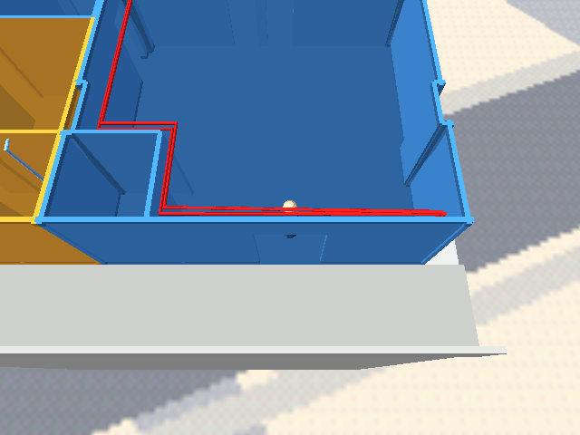

# Remembered-position button between 639 and 640

Press C (keyboard 3) to switch between the two apartments. Initially both
destinations are just inside their front doors: 639 at `(4.65625, −14.5, 0.3)` and
640 at `(−3.875, −14.5, 0.3)`, relative to the condo floor. While walking inside a
unit, remember its last position. A held button switches once; release enables
the next switch. Stop momentum on arrival and move the camera with the player.

Use the model's ownership: the master suite and the room joined to 639 count as
639. The outside corridor does not replace either remembered indoor position;
the button there switches away from the last unit visited. Positions reset on
level reload. The automatic tour retains its waypoint script.

## Implementation

- [x] Generate the interactive player's zForth position tracking and C-button
  handling in `blender_create_condo.py`, using named Python mailbox constants.
- [x] Resolve camera actor references in the existing export-order pass and
  reset the camera to the destination's doll-house view on teleport.
- [x] Rebuild the interactive and tour assets and document the control.
- [x] Exercise the button through the engine's debug bridge and capture both units.

## Visual evidence

The button uses the existing input scheme, with no new HUD. The actual engine
views show arrival just inside each set of front doors.

| 639 | 640 |
|---|---|
|  |  |

## Verification

1. Build both levels and confirm the tour retains its waypoint script.

    ```text
    task condo-level
    [condo] C / keyboard 3: switch apartments, remembering each indoor position
    ✓ built /home/will/WorldFoundry-wbniv/wflevels/condo_639_640-standalone.iff (2387968 bytes)
    task tour-condo-639
    [condo] tour: 39 legs, 11 room holds, 10495 bytes of Forth
    ✓ built /home/will/WorldFoundry-wbniv/wflevels/condo_639_640_tour-standalone.iff (2396160 bytes)
    ```

    PASS — both rebuilt using the canonical aircon source. C handling is generated
    only for the interactive player. The tour's Player script matches HEAD.

2. In the engine, check the initial destinations, one switch per press, remembered
   positions after movement in both units, velocity reset, joined-room ownership,
   and preservation of remembered indoor positions while outside in the corridor.

    ```text
    PASS: 639 starts inside front doors (4.65625, -14.5, 15.75)
    PASS: unvisited 640 seeded inside front doors 
    PASS: held C switches once to 640 
    PASS: 640 can walk after teleport (-3.876646, -13.682166, 15.75)
    PASS: return restores 639 position 
    PASS: return restores moved 640 position 
    PASS: return restores moved 639 position 
    PASS: teleport stops horizontal momentum 
    PASS: joined master suite counts as 639 
    PASS: joined-room position remembered 
    PASS: entering 640 updates active unit 
    PASS: corridor preserves indoor position 
    PASS: return from corridor lands indoors 
    ```

    PASS — `python3 tests/verify_condo_unit_teleport.py` drives the running engine,
    observes position/speed mailboxes and exercises real button input.

3. Verify A/B remain separate controls, capture the destination camera views, and
   reload to confirm both remembered positions reset to their front doors.

    ```text
    PASS: A does not teleport 
    PASS: B does not teleport 
    PASS: C does not toggle project doors 
    PASS: switch script health 
    PASS: reload resets 639 entry 
    PASS: reload resets 640 entry 
    PASS: reload script health 
    RESULT: PASS
    ```

    PASS — inspected both destination screenshots above. The first harness run
    incorrectly matched the normal `DO_ASSERTIONS = 1` banner as an error; narrowed
    the error matcher and reran the complete check successfully.
