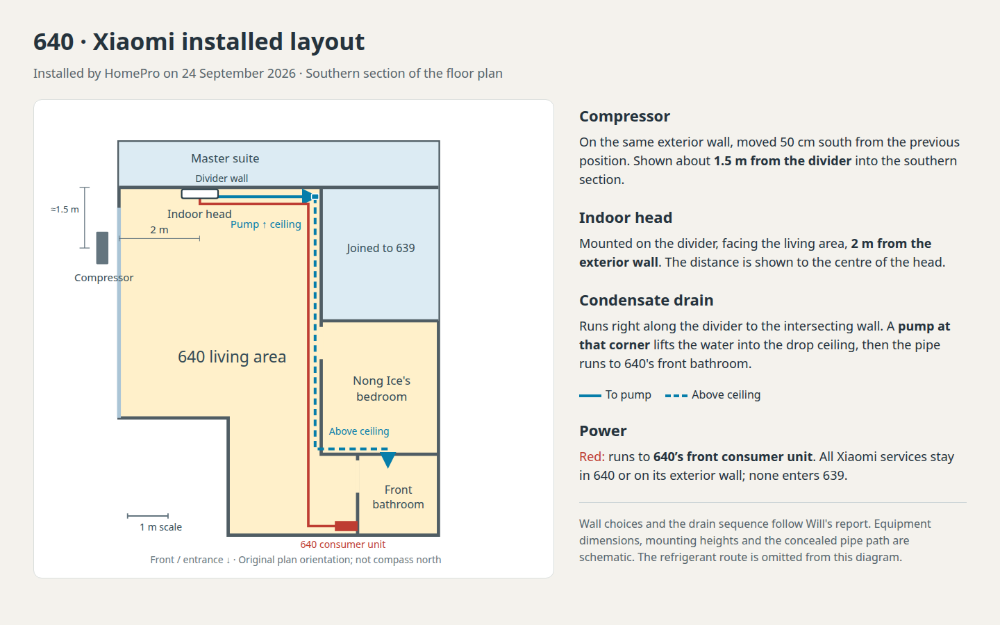

# 640 Xiaomi installation locations

HomePro installed the Xiaomi on 2026-09-24. Will confirmed its placement on
2026-09-25. Move the compressor
along the same exterior wall toward the divider, approximately 1.5 m into the southern
section. Move the indoor head to the southern face of that divider. Its condensate
drain runs right along the divider to the intersecting wall, enters a pump, rises into
the drop ceiling, then runs to 640's front bathroom.

The divider is `640-master-bed-S-wall-W` (plan y = 108). Direction words here follow
the original floor-plan convention, not the later real-world compass mapping. The
compressor centre is represented at plan y = 132, 1.5 m from the divider, after Will’s
follow-up to move it 50 cm farther south. Will
specified that the head is 2 m from the exterior wall along the divider; this is
represented by the head centre at plan x = −94.4. Power connects to the front
consumer unit in 640. All Xiaomi wiring and pipework stay within 640 or on its
exterior wall; none enters 639 or its joined rooms. Heights, pump dimensions and
the exact ceiling/power/refrigerant paths remain schematic. The Midea and Daikin
installations are unchanged.

## Implementation

- [x] Update the canonical generator `~/scripts/aircon-blender.py`, keeping existing
  Xiaomi object names stable and adding a visible condensate pump.
- [x] Update the installation record and regenerate the source Blender model and
  top/oblique reference images.
- [x] Rebuild the interactive and tour WorldFoundry levels from the updated source.
- [x] Inspect the generated geometry and renders; document confirmed versus
  approximate placement in the level README.

## Visual reference

[](2026-09-25-condo-xiaomi-installed/layout.html)

The source-model top and oblique renders were regenerated in `~/docs/aircon/`. The
top-view camera now includes the compressor that the old framing clipped.

## Verification

1. Build the source model; inspect Xiaomi transforms and drain points. Verify that
   the compressor retains its exterior-wall offset and rotation, the head is on the
   divider's southern face, and the only drain rise occurs at the pump. Compare all
   non-Xiaomi source objects with the previous model.

    ```text
    PASS: 77 non-Xiaomi objects unchanged
    PASS: compressor same wall and rotation, centre 1.0 m from divider
    PASS: indoor head on living-area face of divider, centre 2.0 m from exterior wall
    PASS: drain right to pump; only upward leg at pump; ceiling route ends in front bathroom
    ```

    PASS — compared transforms and geometry with vertex/face order normalised and
    coordinates rounded to 0.00001 m. Blender's regenerated `unit-640` shell differs
    in raw ordering/float representation, but its rounded spatial geometry is unchanged.

2. Rebuild both WorldFoundry levels. Confirm the new pump and relocated Xiaomi
   objects are exported and the build completes without errors.

    ```text
    task condo-level CONDO_BLEND=/tmp/condo-xiaomi-installed/units-639-640.blend
    ✓ built /home/will/WorldFoundry-wbniv/wflevels/condo_639_640.iff (2381824 bytes)
    ✓ built /home/will/WorldFoundry-wbniv/wflevels/condo_639_640-standalone.iff (2385920 bytes)
    task tour-condo-639 CONDO_BLEND=/tmp/condo-xiaomi-installed/units-639-640.blend
    ✓ built /home/will/WorldFoundry-wbniv/wflevels/condo_639_640_tour.iff (2392064 bytes)
    ✓ built /home/will/WorldFoundry-wbniv/wflevels/condo_639_640_tour-standalone.iff (2396160 bytes)
    ```

    PASS — both exports include `640-xiaomi-condensate-pump` and the relocated head
    and compressor. The checked source model was copied to the canonical
    `~/docs/aircon/units-639-640.blend`, alongside the updated generator and renders.

3. Inspect the updated plan and oblique render, then smoke-load both engine levels.

    ```text
    PASS: condo_639_640: exit 0, rendered frame 20, 640x480, no assertion
    PASS: condo_639_640_tour: exit 0, rendered frame 20, 640x480, no assertion
    ```

    PASS — inspected the source top/oblique renders and the labelled 1440×900 layout.
    Smoke runs used `--frame-step-smoke=30 --cycles=1 -rate20`, the condo's normal
    VRAM flags and `--capture-frame=20=...`. This verifies loading/rendering; the
    full walking tour video was not regenerated.

## Follow-up: compressor 50 cm farther south

Will requested a further 50 cm move south along the same exterior wall. The centre
moves from plan y = 124 to y = 132 (Blender Y −7.75 to −8.25 m), now 1.5 m from
the divider. The refrigerant endpoint follows the compressor. The head, pump,
drain, power and all other equipment retain their positions. The initial 1.0 m
verification above records the earlier revision.

- [x] Rebuild source, renders and both walkthroughs; verify the 0.50 m delta.

```text
PASS: compressor delta (0.00, -0.50, 0.00) m; rotation and exterior-wall offset unchanged
PASS: refrigerant endpoint follows by 0.50 m
PASS: all 81 other objects unchanged, including head, pump, drain and power
PASS: compressor centre now 1.50 m from divider
PASS: condo_639_640: exit 0, rendered frame 20, 640x480, no assertion
PASS: condo_639_640_tour: exit 0, rendered frame 20, 640x480, no assertion
```

Both levels rebuilt successfully. Refreshed the source model, top/oblique renders
and labelled diagram. Also corrected the installation record and diagram caption:
**installed by HomePro on 2026-09-24**; placement reported by Will on 2026-09-25.
