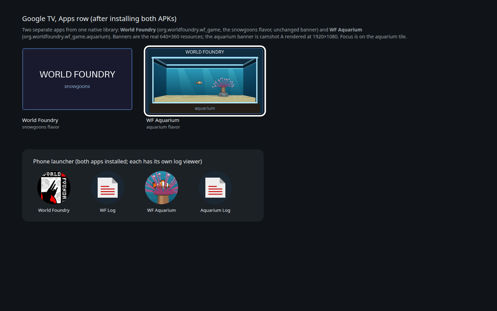
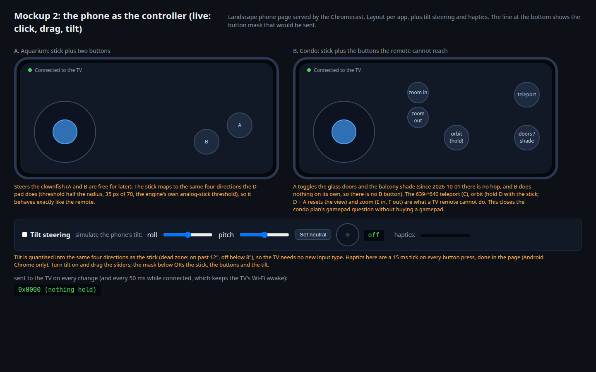
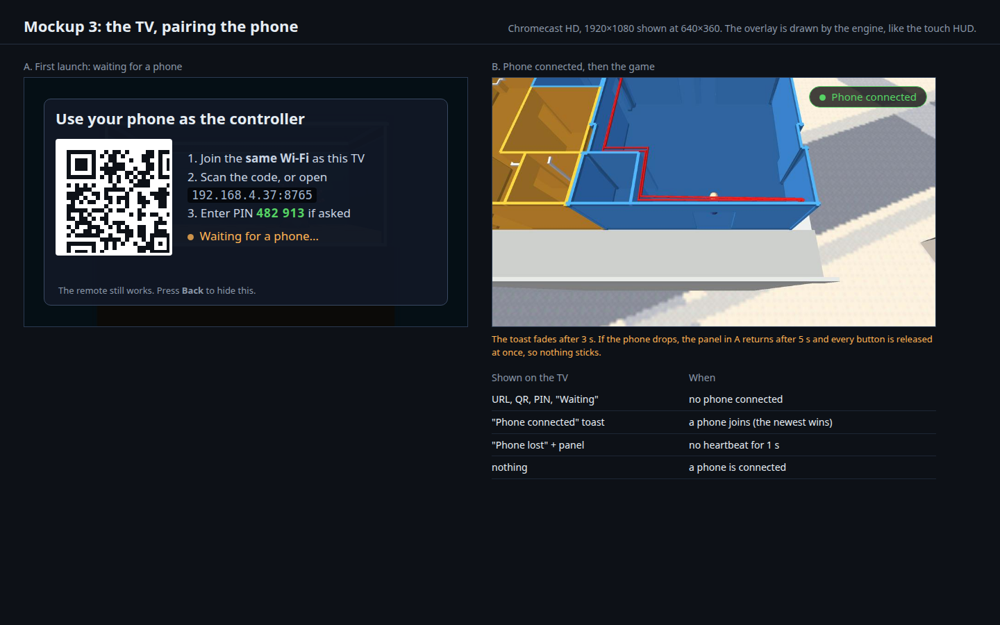
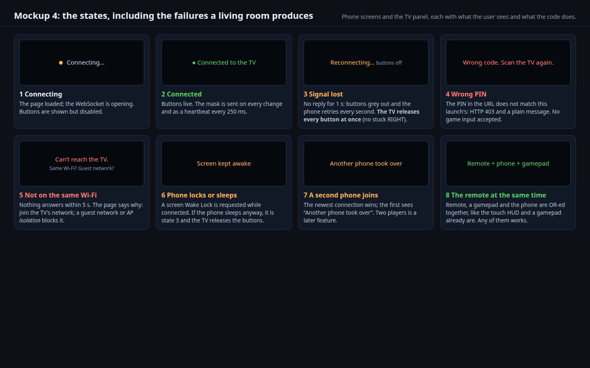

**Sub-steps, in order:** **E0 the spike** (before building anything else): serve a tiny page over http and over https-with-a-self-signed-certificate from the Chromecast and open both on the user's phone (Android or iPhone, to be told), reading `isSecureContext`, whether orientation events fire, whether `navigator.vibrate` and the Wake Lock exist (step 19). It decides how tilt ships. E1 server, protocol, mask merge and the page, tested on Linux with a headless client (no device needed); E2 Android build, manifest, the TV overlay with the URL and PIN; E3 the QR code; E4 device run on the Chromecast with a real phone, aquarium and condo; E5 the failure states of mockup 4 (lost signal, wrong PIN, other network, second phone, tilt needs https, no haptics on iPhone); **E6 tilt** (the https listener and TLS, the quantiser, neutral calibration); **E7 haptics** (local ticks first, then the `h:` message on sound slots).

# The aquarium as its own app on a Chromecast with Google TV

Status: **done on a real Chromecast HD** (2026‑10‑01); **Phase D (audio) and Phase E (the phone as a gamepad, designed) are open**. Written 2026‑10‑01 09:55 (+07) = 02:55 UTC, **after the fact**. The agent that was to write this
plan alongside the Android work was stopped on 2026‑09‑30 (out of tokens) before it wrote the file, so four documents linked to a plan that did not exist
([the aquarium-on-every-platform plan](2026-09-30-aquarium-platforms.md), [the Chromecast plan](2026-04-23-chromecast-googletv-port.md),
[the condo plan](2026-10-01-condo-chromecast.md) and a second copy of the Chromecast plan); my own earlier statement that results had been appended to it was wrong. Everything below is
rebuilt from the commits and the evidence folders under `~/tmp/android-device-run/`, which are named next to each result; nothing is remembered.

- [x] Phase A: the aquarium as a separate Android app (Gradle flavor, `cd.iff`, art), builds for both ABIs
- [x] Phase B: installs and runs on a real Chromecast HD; D-pad moves the fish
- [x] Phase C: release frame rate (60 fps) and the faults the device exposed (32-bit ABI, pool alignment, TV sleep, resume)
- [ ] Phase D: **audio**: the aquarium and condo apps bundle no music or soundfont, so they play nothing (the Android audio code itself is real, not a stub); not started
- [ ] Phase E: **the phone as a gamepad**: a web controller served by the TV app over the local Wi-Fi, zero install, with stick, buttons, **tilt steering and haptics** (designed below, mockups 2 to 4; not started)
- [ ] Phase F: a hardware gamepad (needs one paired to the Chromecast)

## Context

The user's goal: run the aquarium level on a Chromecast. Decisions made on the way:

- **Separate apps, not a level menu** (the user: "they should each be separate apps anyway, no?"). The aquarium is its own app with its own id, name, icon, TV
  banner and `cd.iff`, built from the same native library as the original game.
- **Free tier only** for CI (Codemagic's free Mac minutes); device runs happen on this PC against the Chromecast over wireless `adb`.

What the device turned out to be (all verified, see the evidence below): a **Chromecast HD** (Amlogic S805X2, Android 14, 1920×1080), and it is
**32-bit only** (the device script reports its ABIs as `armeabi-v7a,armeabi`). The earlier Chromecast plan assumed the HD model takes `arm64-v8a`; that was wrong (the 4K
model is arm64). An arm64-only APK cannot even be installed there.

## Approach

1. **Gradle product flavors** in `android/app/build.gradle.kts`: `snowgoons` (the original app, unchanged id and banner) and `aquarium`
   (`applicationIdSuffix ".aquarium"`, label "WF Aquarium", its own `src/aquarium/assets/cd.iff`, round launcher icons and a 640×360 TV banner generated from real
   captures by `scripts/gen-aquarium-android-art.py`). One native library serves every flavor, so CMake runs once per build type.
2. **`task build-cd-iff-aquarium`**: `cdpack-rs` with `shell.fth` and the one aquarium level, giving the tracked `wflevels/aquarium-cd.iff` (about 186 KB). `shell.fth` boots
   level 0, so there is no `-L` and no menu. `tests/test_aquarium_android.py` checks the bundle against the level.
3. **Both ABIs**: `abiFilters += arm64-v8a, armeabi-v7a` (commit `29889afc`).
4. **`scripts/android-device-run.sh --app aquarium [--release] [--build] [--poke] [--resume]`**: checks the APK's ABIs against the device's, installs, wakes the TV,
   launches, waits, then reports liveness, EGL, crash lines, a screenshot, frame pacing from SurfaceFlinger's real drawing layer, and memory. It is the evidence source
   for every step below.
5. **Judge on a release build.** The debug build (`-O0`) is not a valid performance measurement on this chip.

**Rejected:** one APK with a level menu (the user decided against it); an Android emulator as proof (a Chromecast is the target, and the emulator ran at about 0.4 s per
frame under software graphics, which says nothing about the device); paid Codemagic services.

### Mockups

The art and launcher were mocked before the device existed; the final art is generated from real captures by the script above.

[](2026-09-30-aquarium-chromecast/launcher-tiles.html)

**1. The launcher.** The Google TV Apps row with the snowgoons tile and the WF Aquarium tile focused (the banner is "camshot A": the whole tank at 1920×1080), and the
phone launcher with each app's icon (the round icon is "camshot B": the anemone and fish close-up) and its own log viewer.
[Open the interactive mockup](2026-09-30-aquarium-chromecast/launcher-tiles.html). The camshots are `frame-a-*.png` and `frame-b-1920x1080.png` in the same folder.
They are Linux renders, used only as art sources; they are **not** Chromecast screenshots (those are in the porting status page).

There is no other visible surface: the app is the game, full screen. Its on-screen states (loading, running, slow, suspended, failed) were first drawn for the condo, in
[its mockup 3](2026-10-01-condo-chromecast.md), and apply unchanged here.

## Phase D: audio

**Why.** The two Chromecast apps have no music to play (nobody has listened on the device, so "silent" is an inference from the bundle). That is a gap in what they ship, **not a stub in the code** (this plan used to say "silent stub", which was wrong):
[`hal/android/audio.cc`](../../wfsource/source/hal/android/audio.cc) starts the same miniaudio `SoundDevice` and MIDI `MusicPlayer` as Linux, and the build compiles `audio/linux` for Android.
What is missing is data. Only the `snowgoons` flavor bundles `level0.mid` and `florestan-subset.sf2` (`android/app/src/snowgoons/assets/`); the `aquarium` and `condo` flavors bundle only `cd.iff`, so the
music player has nothing to load.

**Known and unknown.**

- Known: the code path exists; the missing music and soundfont files in the two flavors (checked in the source tree).
- **Correction (2026‑10‑01 11:30): the soundfont is not in this checkout.** `android/app/src/snowgoons/assets/florestan-subset.sf2` is a symlink to `wfsource/source/game/florestan-subset.sf2`, which is **gitignored (`wfsource/source/game/.gitignore:4`) and absent on disk**, so the link dangles and `./gradlew :app:assembleSnowgoonsRelease` fails in `lintVitalAnalyzeSnowgoonsRelease` (`Couldn't read file content: …/florestan-subset.sf2`). The debug flavor builds (CI does), but its APK has no soundfont. So "the snowgoons build bundles music and soundfont" is true of the source layout, not of what a clean checkout can build; the soundfont has to be obtained or regenerated before any flavor can play MIDI music, and where it comes from is a question for this phase.
  **Resolved 2026‑10‑01 17:15 (the user has no copy of the original):** [`scripts/make-soundfont-subset.py`](../../scripts/make-soundfont-subset.py) (`task soundfont`) builds `florestan-subset.sf2` reproducibly from FluidR3_GM (MIT, pinned by SHA-256), keeping only what `level0.mid` uses: Acoustic Grand Piano, 7.6 MB from 145 MB, rendering identically to the full base in TinySoundFont (the same RMS, 0.206552, for middle C). The filename is historical. With it in place `assembleSnowgoonsRelease` builds and bundles the soundfont, and on the Chromecast the snowgoons release app logs `soundfont loaded (florestan-subset.sf2, 7842132 B)` and `playing level0.mid`, and Android's audio service lists its AAudio stream as `started` on the output device (heard by nobody: the Chromecast is on a monitor with no speakers). The output stays gitignored: **open decision for the user, MIT is not in `wflevels/licence_policy.toml` (only CC0 is accepted)**, so whether to accept MIT, and whether to commit the 7.6 MB file or generate it in every build (CI included), is theirs.
- Not checked: that the TV outputs sound from the snowgoons build over HDMI (nobody has listened on the Chromecast), and what the engine does when a level's `.mid` is absent (read from `audio/linux/music.cc:171-198`, not yet seen on a device: it logs `audio: MusicPlayer — soundfont not found` or `MIDI not found` and returns false, with no crash).
- Sound effects: the trigger is engine-neutral (a script writes mailbox 3017, `actor.cc:1694`), so Lua is not needed. The [iOS port plan](2026-04-21-ios-port-codemagic.md) said otherwise and was stale.
  What a level cannot do is carry its own sounds; that is [its own plan](2026-10-01-sfx-without-lua.md). Only music control (`play_music` and friends) is still Lua-only.
- The lasting fix is the "Audio assets from IFF" item in `TODO.md` ([plan](2026-04-18-audio-assets-from-iff.md): music and soundfont inside `cd.iff`); a stopgap is to bundle the loose files per flavor, as `snowgoons` does.

There is no visible surface: the change is what the TV speakers do, so there are no mockups. Verification step 18 is its check.

### How Phase D connects to the sound-effects plan

[`2026-10-01-sfx-without-lua.md`](2026-10-01-sfx-without-lua.md) and this phase are the two halves of the "Audio assets from IFF" item, split by what the data is:

| | This phase (music) | The SFX plan (sound effects) |
|---|---|---|
| What | the MIDI file and the soundfont (`level0.mid`, `florestan-subset.sf2`) | short `.wav` clips played by slot number |
| How a script triggers it | the engine starts level music itself; `play_music` and friends stay Lua-only | any engine writes mailbox 3017 (already works, `actor.cc:1694`) |
| What is missing | the aquarium and condo flavors bundle neither file | a level cannot carry its own sounds, so the seven loads in `game.cc:345-351` are hardcoded Q\*bert wavs |
| Stopgap | copy the existing `snowgoons` loose-file pattern into the two flavors | none: straight into the IFF (the SFX plan rejects a manifest) |
| Lasting home | music and soundfont inside `cd.iff` (the rest of Audio assets from IFF) | the per-level sound bank in the IFF (its Phase B) |

Four consequences, decided here so the two plans do not collide:

1. **Do one device listen, not two.** This plan's step 18 and the SFX plan's step 8 are the same session on the Chromecast. **The free first check is not the `snowgoons` flavor** (this plan first said it was): run on the Chromecast on 2026‑10‑01 it is silent, and its log says why: `audio: MusicPlayer — soundfont not found: florestan-subset.sf2` and `audio: sfx[0] not found: wflevels/qbert_practice/sfx/qbert_hop.wav` through `sfx[6]` (the seven hardcoded Q\*bert loads, which resolve to nothing on Android). To check the physical audio chain use any app that makes sound (YouTube on the Chromecast): if it is audible, the route is fine and the remaining work is only data; if not, both plans are blocked on the chain, not on data.
2. **Is the display chain able to carry audio? Measured 2026‑10‑01, and the answer is mostly yes, but the user's monitor has no speakers.** The Chromecast routes `STREAM_MUSIC` to `hdmi(400)` at volume 25 of 25, unmuted (`dumpsys audio`), and the monitor's EDID lists an audio block (`{format 1 (LPCM), 2 channels}`), although it still identifies as a DVI device with a corrupted product name. So the software side is not the problem. The Chromecast is plugged into a **monitor, not a TV, so nothing speaks**: hearing audio is a hardware question (the monitor's headphone jack if it has one, Bluetooth headphones or a speaker paired to the Chromecast, or an HDMI audio extractor between them), not a game or engine one.
3. **The stopgap must not become a second pipeline.** The SFX plan rejects a loose-file manifest because "Audio assets from IFF" exists to delete it. For music this phase copies only the files `snowgoons` already ships, by the same per-flavor symlinks, and adds no new loader or manifest; it is deleted when music moves into the IFF.
4. **One list of events feeds both the speakers and the phone.** The SFX plan's Phase D (which sounds the aquarium and condo get; the user's call, and a licence decision) is the same list that haptics need (Phase E, design item 7): the condo's door, teleport and hop; the aquarium's turns. Author it once; a sound slot may carry an optional vibration pattern. Whether to attach haptic patterns to sound slots (no new mailbox, one script write) or to give haptics their own write-only mailbox is a decision for the user; **the recommendation is the slots**, because the SFX plan is already adding a positional mailbox and a second near-identical one is more surface for no gain. (If a separate haptic mailbox is wanted, `3023` is the SFX plan's, `3024` is taken by `INPUT`, so it would need a free number checked in `mailbox.inc`.)

## Phase E: the phone as a gamepad

**Why.** The Chromecast remote has a D-pad and OK only. The aquarium needs just the D-pad, but the condo needs doors (B), the 639⇄640 teleport (C), orbit (hold D) and zoom (E/F), which the
remote cannot reach ([the condo plan](2026-10-01-condo-chromecast.md), mockup 2, and its Verification 9). A phone in the hand is the gamepad everyone already has, so Phase E replaces
"buy and pair a Bluetooth gamepad" as the way to play those buttons.

**Design, in one sentence:** the TV app serves a one-page web controller over the local Wi-Fi; the phone opens it by scanning a QR code on the TV (no app to install, works on any phone, iPhone
included) and streams a button bitmask over a WebSocket; the engine ORs that mask into the input it already merges from the gamepad and the touch HUD.

How it fits the existing code (read from `wfsource/source/hal/android/native_app_entry.cc`, not assumed): input is already one `joystickButtonsF` bitmask, merged in `Emit()` as
`_HALSetJoystickButtons(gGamepadButtons | gTouchButtons)`, and the analog stick is already quantised to LEFT/RIGHT/UP/DOWN with a threshold. The phone adds a third source, `gPhoneButtons`, to that
`|`. Nothing about the game, the level scripts or the engine's input model changes.

1. **Protocol** (portable C++, so it builds and tests on Linux without a Chromecast): HTTP `GET /` serves the controller page, `GET /layout.json` the per-app layout, and `/ws` upgrades to a
   WebSocket. The phone sends the 16-bit mask on every change and as a **250 ms heartbeat**; the TV **releases every button if no frame arrives for 1 s** (a locked phone or a dropped Wi-Fi must never
   leave RIGHT stuck). Frames are tiny text, so a bug is readable in a log: phone to TV `b:01a0` (the mask) and `t:<ms>` (a timestamp the TV echoes, for the latency measurement); TV to phone `h:<ms,ms,…>` (a vibration pattern, for game-driven haptics, below).
2. **Pairing and safety:** the server listens only while the app is resumed and only on the Wi-Fi interface; every launch picks a fresh random PIN carried in the QR URL (`/?k=482913`), checked on the page
   request and on the WebSocket; the newest phone wins. LAN only: no cloud, no relay, nothing reachable from the internet.
3. **The page** (`assets/controller.html`, inline CSS and JS, one file in the APK): pointer events with multi-touch and pointer capture, a virtual stick (same threshold the engine uses) and buttons from
   the layout (aquarium: stick, A, B; condo: stick, A hop, B doors, C teleport, D orbit-hold, E/F zoom), `touch-action: none`, a "rotate your phone" hint in portrait, and the screen kept awake while connected. **Correction:** this plan first said "a screen Wake Lock", but the Wake Lock API is secure-context only: Chrome on a plain `http://<LAN IP>` page shows `navigator.wakeLock` absent (measured, below). The plain page therefore needs the silent-looping-video trick and the https page can use the real API; both are checked on the phone in step 19.
4. **The TV overlay:** drawn by the engine like the touch HUD: URL, QR, PIN and "Waiting for a phone…" until a phone connects, then a 3 s "Phone connected" toast; the panel returns if the phone drops.
   The QR is generated at run time (the URL holds the IP and a per-launch PIN, so it cannot be pre-rendered): a small vendored encoder (for example Nayuki's MIT-licensed QR Code generator).
   **Step E1 ships the text URL and PIN first; the QR is E3**, so the feature is usable before the encoder lands.
5. **Android plumbing:** the manifest has **no `INTERNET` permission today** (checked: `AndroidManifest.xml` has no `uses-permission`), and opening a listening socket needs it, so this phase adds
   `android.permission.INTERNET`. It is the first network capability these apps have, which is why the PIN and the LAN-only rule above are not optional.
6. **Tilt steering** (included in this phase at the user's request). The page reads the phone's orientation (`deviceorientation`, mapped through `screen.orientation.angle`), measures it against a **neutral** set when tilt is switched on (and by a "Set neutral" button), and turns it into LEFT/RIGHT/UP/DOWN with a dead zone and hysteresis (on past 12°, off below 8°, as in mockup 2). It is the same
   four-direction mask as the stick, so for tilt **no protocol change is needed** (my earlier line "tilt and haptics need no protocol change" was only true of this half). Proportional steering is out of scope: the engine's input is the digital `joystickButtonsF` mask (`hal/_input.h`), and its own analog stick is already quantised the same way.
7. **Haptics** (also included). Two parts. **Local:** a short tick on every button press, done in the page with `navigator.vibrate`, no TV involvement and no protocol change. **Game-driven:** the TV tells the phone to buzz (a door toggles, a teleport, a hard landing) with `h:<pattern>`. **That is a protocol addition and an engine hook, which my earlier "without protocol changes" claim missed.** The hook should reuse the sound-effect trigger rather than add
   a second one: a level script already plays sound slot *n* by writing mailbox 3017 (`actor.cc:1694`), so when slot *n* plays the engine can also send the phone pattern *n* (a small per-level table, default none). One script write then gives a sound on the TV and a buzz in the hand, and the event list is authored once ([the SFX plan](2026-10-01-sfx-without-lua.md), Phase D). Phone support: Android Chrome has `navigator.vibrate`; **iPhone Safari has no Vibration API** (documented, to be confirmed on the phone), so the toggle is hidden there and the page says so.
8. **A secure context for tilt (the constraint that shapes the build).** Browsers expose motion sensors only to secure contexts. Measured with Chrome on this PC against a plain `http://192.168.4.21` page: `isSecureContext: false`, `DeviceOrientationEvent` and `DeviceMotionEvent` **undefined**, the Generic Sensor classes undefined, `navigator.wakeLock` **absent**, while `navigator.vibrate` and `WebSocket` are present. (A control run on a secure origin, to prove the gating rather than headless desktop having no sensors, did not complete here; iOS Safari additionally wants `DeviceMotionEvent.requestPermission()` from a user gesture. Both are checked in step 19.) So tilt cannot come from the plain http page that sticks and buttons use. The only zero-install route is **https from the TV with a self-signed certificate**: the page offers "Enable tilt", reloads over https from the TV (a second port), and the phone asks once whether to trust the certificate; the WebSocket on that page must then be `wss://` because browsers block `ws://` from an https page. That needs a small TLS library in the app (for example BearSSL, MIT, or mbedTLS) and a certificate shipped with the app, so **anyone on the same Wi-Fi who can read this repository holds the certificate's key**: acceptable for a game controller behind the PIN, and written down here so it is a choice, not a surprise. If step 19 shows the route does not work on the user's phone, tilt falls back to a native companion app (rejected above for the sticks and buttons, but the only way to read sensors without https), which is a decision for the user.

**Sub-steps, in order:** E1 server, protocol, mask merge and the page, tested on Linux with a headless client (no device needed); E2 Android build, manifest, the TV overlay with the URL and PIN;
E3 the QR code; E4 device run on the Chromecast with a real phone (the user's), aquarium and condo; E5 the failure states of mockup 4 (lost signal, wrong PIN, other network, second phone).

**Rejected:**
- **Google's TV remote protocol:** it is the same D-pad and OK as the physical remote, so it cannot reach B, C, D, E or F.
- **The phone as a Bluetooth HID gamepad:** Android's `BluetoothHidDevice` needs a phone app per phone, and an iPhone cannot do it at all.
- **Google Cast:** it needs a receiver app and Google registration for a game that is not a media stream.
- **A native companion app:** every phone would have to install it first, which is one more manual step than scanning a code.

**Risks, each with a verification step:**

| Risk | Why | Step |
|---|---|---|
| Wi-Fi **AP isolation** or a guest network | the phone cannot reach the TV at all; common on home routers | 15 |
| Latency over Wi-Fi | a laggy stick is worse than no stick; target median under 100 ms from touch to frame | 14 |
| A stuck button | phone locks, Wi-Fi drops, tab is backgrounded | 15 |
| A new network surface in a game app | anyone on the LAN could send buttons without the PIN | 15 |
| The Chromecast's address changes | a bookmarked URL stops working; the QR is shown every launch | 13 |
| **Tilt and Wake Lock need a secure page** | measured: an http LAN page has no orientation events and no `wakeLock`; the https route needs TLS in the app and a certificate prompt | 19 |
| Tilt feel | drift, a wrong neutral, or flicker at the threshold makes steering unusable; the dead zone, hysteresis and "Set neutral" are the controls | 20 |
| Haptics are not on every phone | iPhone Safari has no Vibration API; buzzing needs a user gesture on Android | 21 |

### Mockups for Phase E

[](2026-09-30-aquarium-chromecast/phone-controller.html)

**2. The phone as the controller (live: click and drag the controls).** Landscape page, layout per app; the line under the phones shows the exact button mask that would be sent.
**Decided by the user on 2026‑10‑01 ("sure"):** the condo layout is right (doors B, teleport C, orbit-hold D, zoom E/F) and a plain digital stick (the engine's existing four directions) is enough for v1. The strip under the phones adds tilt (drag the sliders; the dead zone and hysteresis are live) and shows the haptic tick.
[Open the interactive mockup](2026-09-30-aquarium-chromecast/phone-controller.html).

[](2026-09-30-aquarium-chromecast/phone-pairing-tv.html)

**3. The TV, pairing the phone.** The overlay with a real QR code (of an example URL), the address and the PIN, then the "Phone connected" toast over the condo. The pictures are the real Chromecast
screenshots; the overlay is a drawing. [Open the interactive mockup](2026-09-30-aquarium-chromecast/phone-pairing-tv.html).

[](2026-09-30-aquarium-chromecast/phone-states.html)

**4. The states.** Connecting, connected, signal lost, wrong PIN, not on the same Wi-Fi, phone locks, a second phone, tilt needing a secure page, no haptics on an iPhone, and remote plus phone together.
[Open the interactive mockup](2026-09-30-aquarium-chromecast/phone-states.html). All three are regenerated by [`make_phone_mockups.py`](2026-09-30-aquarium-chromecast/make_phone_mockups.py).

## Out of scope

- A hardware gamepad profile beyond the existing key mapping, until one is paired (Phase F). Two phones as two players, and any internet or cloud play.
- Phone and tablet devices, iPhone and iPad (separate items in the porting status).
- Play Store or any distribution beyond `adb` sideload.

## Verification

Numbered, runnable steps; each shows its raw output with PASS or FAIL. Times in 24-hour form. Evidence folders are under `~/tmp/android-device-run/`.

1. `task build-cd-iff-aquarium` twice, `cmp` the outputs, `python3 -m pytest tests/test_aquarium_android.py -q`. Expected: byte-identical `wflevels/aquarium-cd.iff`, tests pass.

    ```
    $ python3 -m pytest tests/test_condo_android.py tests/test_aquarium_android.py -q   (run 2026-10-01 03:02 with the merged branch)
    15 passed, 3 skipped
    ```

    **PASS** (the byte-identity check was run for the condo's identical recipe, not repeated for the aquarium today).

2. `./gradlew :app:assembleAquariumRelease` and `assembleAquariumDebug`, both ABIs. Expected: BUILD SUCCESSFUL; the APK has `lib/arm64-v8a/` and `lib/armeabi-v7a/` and the aquarium `assets/cd.iff`.

    ```
    BUILD SUCCESSFUL in 15s   (aquarium release, 2026-10-01 09:44; the native build was cached from the condo's, as designed)
    Codemagic android-apk-debug, commit 74797e2b (build 6abd6b03): BUILD SUCCESSFUL in 3m 55s, artifacts worldfoundry-aquarium-debug.apk, -condo-, -snowgoons-
    ```

    **PASS**

3. The first device run, with the arm64-only APK. Expected on a 32-bit device: a clear failure, not a hang.

    ```
    FAIL  the APK has no native ABI this device supports (APK: arm64-v8a; device: armeabi-v7a)
    ```

    (The message as the install script worded it, as recorded in the condo plan's mockup 3; the raw output of that very first run was not kept, so treat this line as a record, not a paste.)

    **FAIL, then fixed**: the Chromecast HD is 32-bit; `abiFilters` now carries both ABIs (`29889afc`), and the script checks the APK's `lib/<abi>` against the device's instead of assuming arm64.

4. `scripts/android-device-run.sh --app aquarium --seconds 25`, first run of the 32-bit build (evidence `aquarium-20260930T191152Z/`). Expected: alive after 25 s.

    ```
    PASS  installed org.worldfoundry.wf_game.aquarium
    PASS  launched (TotalTime: 1732 ms)
    FAIL  process not running after 25 s (crashed or exited; see logcat-wf.txt)
    wf.log: AssertMsg:MemPool entry size must be a multiple of 8 bytes, got 20
            in file ".../wfsource/source/hal/mempool.cc" on line 32
            !!! wf_game crashed: signal=6
    ```

    **FAIL, then fixed.** The cause is a regression from our own 64-bit work, not a 32-bit limit. The 2010 original asserted `(size % 4) == 0`; the 2026‑05‑19 pointer-size pass
    (`292af662`) changed it to `WF_POINTER_ALIGN`, and its 32-bit ARM carve-out set that to 8, which the 20-byte `SMsg` fails. First fix (`47be054a`): round the entry size up to 8.
    Corrected fix (`fd281a7e`, on the user's review: "just 4 byte alignment required"): round to a free-list node's alignment, **4 on 32-bit ARM, 8 on 64-bit** (a no-op on
    64-bit), with a `static_assert` at each pool that its stored type needs no more. The `armeabi-v7a` build compiles with it; re-running on the device with this last change is
    **PENDING** (the Chromecast was off the network on 2026‑10‑01 09:45).

5. Same command after the first fix (evidence `aquarium-20260930T191435Z/`, debug build, 30 s). Expected: alive, EGL up, no crash lines.

    ```
    PASS  installed org.worldfoundry.wf_game.aquarium
    PASS  launched (TotalTime: 1106 ms)
    PASS  process alive after 30 s (pid 11699)
    PASS  screenshot .../screen.png (1019 1920x1080 distinct colours at 160x90)
    PASS  no crash lines in logcat
    INFO  TV mode detected (android_main: uiMode=4 (tv=1)): the touch HUD is hidden
    PASS  EGL context up (android_main: EGL ready)
    ```

    **PASS**

6. Open `screen.png` (`Read`). Expected: the aquarium, recognisable, full 1920×1080 with no cut-off. Result: the tank, the fish, the anemone and the sand floor in a 16:9 frame, as in
    [`porting-status/chromecast-hd-aquarium.png`](../porting-status/chromecast-hd-aquarium.png). **PASS**

7. `--poke` (D-pad RIGHT held, then UP). Expected: the fish moves.

    ```
    fish position before: (-1.600, 2.400)    after: (-0.725, 2.526)     (engine log "ball pos", the fish is the player)
    ```

    **PASS** (screenshots: [`porting-status/chromecast-hd-aquarium-after-dpad.png`](../porting-status/chromecast-hd-aquarium-after-dpad.png))

8. Frame pace and memory on a **release** build (evidence `aquarium-20260930T200028Z/`, 45 s, on the merged branch). Expected: numbers recorded; "playable" is about 15 fps or better.

    ```
    PASS  process alive after 45 s (pid 16150)
    INFO  memory: TOTAL PSS 31457 KB
    INFO  frame pacing (org.worldfoundry.wf_game.aquarium/android.app.NativeActivity#445): 127 frames: min 16.7 ms, median 16.7 ms (59.9 fps), p90 16.7 ms, worst 16.7 ms; display refresh 16.68 ms
    ```

    **PASS**, locked to the TV's refresh. The same level in the debug build draws at about 0.4 s per frame (about 2.5 fps); that is `-O0` on this chip, not a defect.

9. Home, then reopen the app. Expected: no crash.

    ```
    before the fix:  running pid 17179; after HOME + reopen pid: none
                     wf.log: GL error: 1286 / ASSERTION FAILED display.cc line 866 / signal=6
    after the fix (79f0728f): PASS  alive and drawing after Home + reopen (pid 17886, 1017 colours; screen-after-resume.png)
    ```

    **FAIL, then fixed.** After Home and reopen, `APP_CMD_RESUME` arrives about 120 ms before `APP_CMD_INIT_WINDOW`, so the loop drew into no EGL surface. `HALIsSuspended()` now stays true until
    the window is back (`WFAndroidHasWindow()`); the guard is `--resume` plus a static test.

10. The TV's screensaver and the frame-pace probe. Two separate faults. (a) After about 5 minutes idle the Chromecast starts its Dream and the app stops drawing; the device script now sends `KEYCODE_WAKEUP`
    before launching. (b) The early frame-pace lines read `too few frames` because the script picked the wrong SurfaceFlinger layer:

    ```
    INFO  frame pacing (646184 ActivityRecordInputSink org.worldfoundry.wf_game.aquarium/android.app.NativeActivity#334): too few frames ()
    ```

    It now selects `^<package>/android\.app\.NativeActivity#[0-9]+$`, the layer that actually carries the app's buffers, which gives the 59.9 fps line in step 8. **PASS**

11. The portable server and protocol, on this PC (Phase E1). `python3 -m pytest tests/test_phone_controller.py -q`: WebSocket handshake and framing, the mask-to-buttons mapping, the 1 s timeout releasing every button,
    wrong PIN rejected, newest phone wins, plus the tilt quantiser (dead zone, hysteresis, neutral) and the `h:` message encoding. Expected: all pass. **PENDING (Phase E not started)**

12. The page and a real engine on Linux. Run the engine with the phone controller enabled, open the page in headless Chrome (screenshot compared with mockup 2), then a headless client holds RIGHT for 1.5 s.
    Expected: the engine log's `ball pos` changes, and stops moving when the client disconnects. **PENDING**

13. The Android build. `./gradlew :app:assembleAquariumRelease :app:assembleCondoRelease`. Expected: BUILD SUCCESSFUL for both ABIs; the APK has `assets/controller.html`; the merged manifest has
    `android.permission.INTERNET` and nothing else new. **PENDING**

14. On the Chromecast with a real phone (the user's): scan the QR on the TV, hold the stick. Expected: the TV shows the toast; the aquarium fish moves; in the condo the player moves, A hops, B toggles a glass door, C
    teleports; the median touch-to-frame latency is **under 100 ms** (the page timestamps each message; the engine logs the frame it took effect in). Evidence: screenshots of the TV and the phone, the latency
    numbers. **PENDING**

15. Failure states on the device. Lock the phone, turn its Wi-Fi off, join a guest network, use a wrong PIN, connect a second phone. Expected: mockup 4's behaviour for each, and **no stuck button after any of
    them** (read the engine's button mask after each). **PENDING**

16. Codemagic `android-apk-debug` on the merged branch; macOS and iOS workflows unaffected. Expected: green. **PENDING**

17. A hardware gamepad moves the fish; B/C buttons (Phase F). **PENDING (no gamepad paired)**.

18. Audio on the Chromecast (Phase D). Run the aquarium and the condo with the music and soundfont bundled. Expected: music is audible from the TV, and `adb logcat` shows no audio-device error from
    the app. Evidence: the logcat excerpt and a note of what was heard. **PENDING (Phase D not started)**


19. The E0 spike, on the user's phone (say which: Android or iPhone). Serve a one-page diagnostic from this PC or the Chromecast over http and over https with a self-signed certificate, and open each on the phone. It prints `isSecureContext`, whether `deviceorientation` events arrive (and a live reading), whether `DeviceMotionEvent.requestPermission` is needed, `'wakeLock' in navigator`, `typeof navigator.vibrate`, and whether a WebSocket opens (`ws://` from the http page, `wss://` from the https one). Expected: http: no tilt, no wakeLock, WebSocket and vibrate (Android) work; https after one certificate prompt: tilt and wakeLock work. Evidence: a screenshot of the diagnostic on the phone for each. The desktop-Chrome half is already measured (design item 8); the secure-origin control and everything on a phone are **PENDING**

20. Tilt steering on the Chromecast (Phase E6). With tilt on, the aquarium fish steers left, right, up and down by tilting the phone; "Set neutral" re-zeros it; holding the phone still produces no steering; the stick and tilt together do not fight. Expected: no stuck direction after switching tilt off or locking the phone. Evidence: the TV's engine log with the tilt-driven `ball pos` changes and a short note of how it felt. **PENDING**

21. Haptics (Phase E7). Android Chrome: a tick on every button press; in the condo, a door toggle (B) or a teleport (C) buzzes the phone through the sound slot's pattern. iPhone: the toggle is hidden and the page says why. Expected: the buzz matches the event within 100 ms. Evidence: the TV's `h:` log lines and a note of what was felt. **PENDING**
## Result on a real Chromecast

On a Chromecast HD (Amlogic S805X2, Android 14, 1920×1080, 32-bit only) the aquarium runs as its own app, installs in about a second, draws the full 16:9 tank, responds to the remote's D-pad,
presents at **59.9 fps** on a release build (31 MB total memory), and survives Home and reopen. Two bugs were found by this run and fixed: the 32-bit pool-alignment assertion (a regression
from our own 64-bit work, fixed twice, the second time narrowed to the original 4-byte rule on the user's review) and the resume abort. The condo reuses this recipe unchanged
([its plan](2026-10-01-condo-chromecast.md)).

## Cost

None: local Gradle builds and device runs, plus the free Mac-minutes of the Codemagic `android-apk-debug` workflow (about 6 per run). No paid Codemagic service, by decision.

## Delegation

| Work | Tier | Why |
|---|---|---|
| Flavors, `cd.iff` task, art script, device script | T4 | a new pattern (separate apps from one native library) and the first 32-bit run, with an unknown fault list |
| Reading screenshots and numbers, the alignment decision | T5 | needed the whole session's judgement |
| Phase E: protocol, server, input merge, TV overlay, manifest | T4 | cross-cutting (engine input path, a first network surface, Android permission) where a wrong turn is a security or stuck-input bug; recommended rank, to be set in `TODO.md` by a Fable session |
| Phase E: the controller page and the QR vendoring | T2 | one self-contained file against the settled protocol, and a vendored library |
| Phase E: TLS and the https listener, tilt and haptics hooks (E6, E7) | T4 | a TLS library and certificate in a game app, and an engine hook shared with the sound path; a wrong turn is a security or input bug |
| Phase E0: the spike on the user's phone | T5 | needs the user's phone and a judgement about the result |
