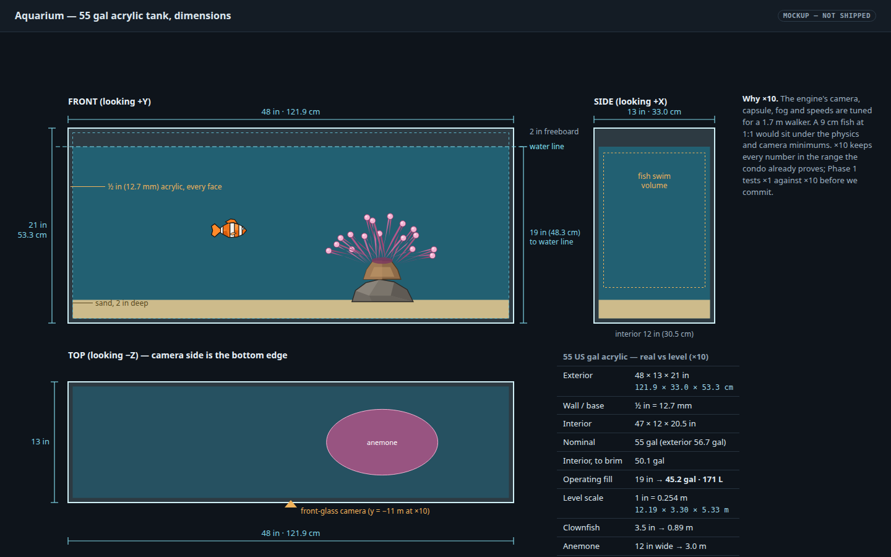
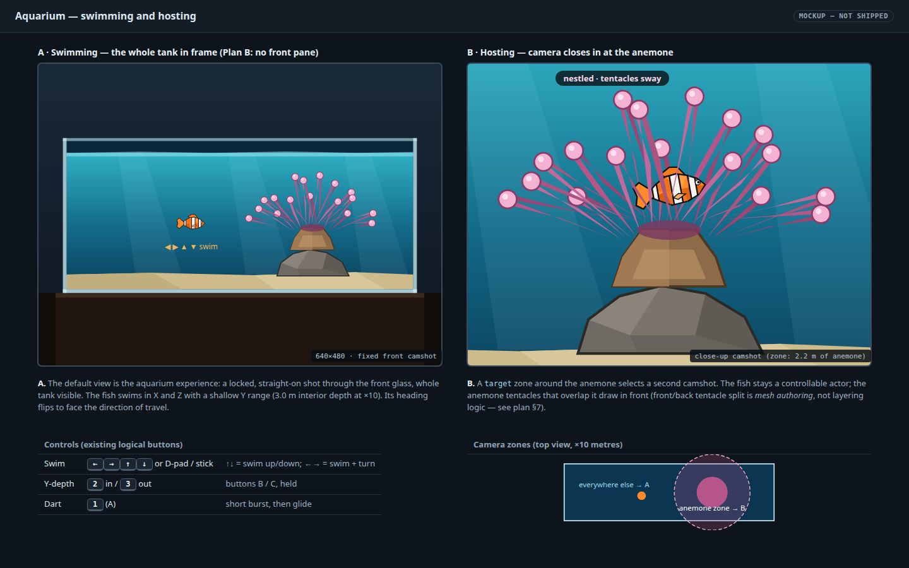
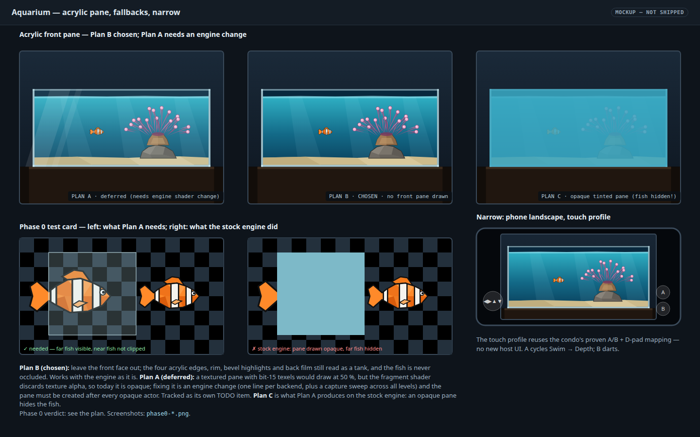
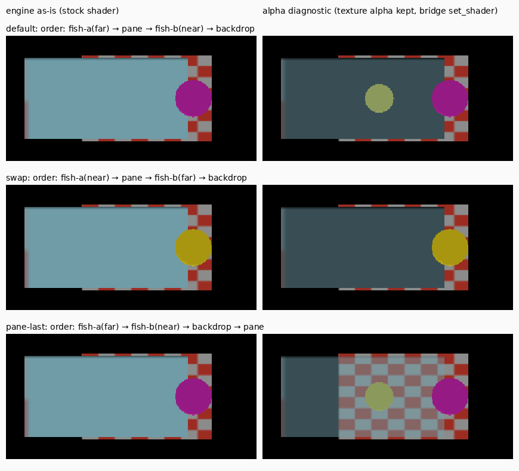
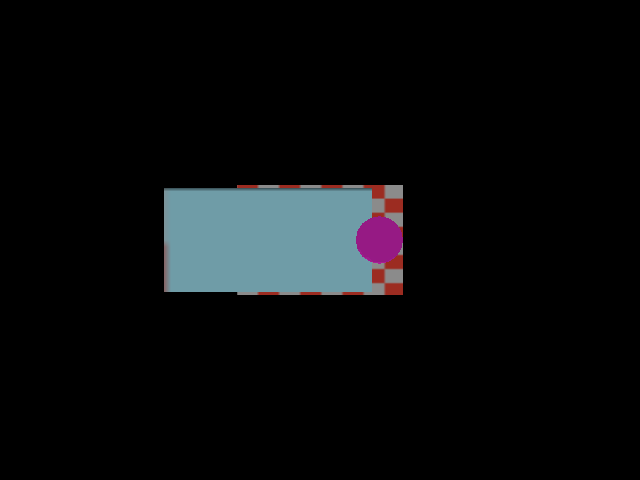
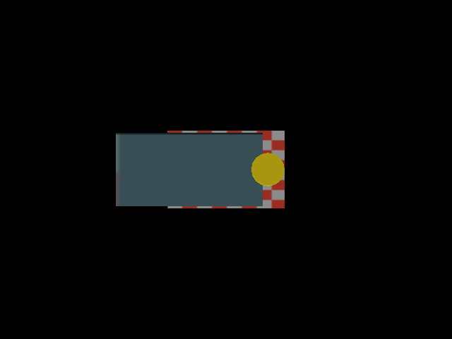

# Aquarium level — 55 gal acrylic tank, one clownfish, one anemone

Status: **Phase 0 run 2026‑09‑30 — the engine as it is cannot draw a translucent pane, so the level
goes ahead on Plan B** (no front face). **Will chose Plan B on 2026‑09‑30**; Plan A (translucent pane) is deferred to its own TODO item because it needs an engine shader change. See [§ Phase 0 verdict](#phase-0-verdict).
Phases 1–4 not started.

Will asked for an aquarium level: a **55 gallon acrylic tank**, **an anemone and a clownfish**, planned in
`docs/plans/` with mockups. The condo walkthrough went through the Blender → `.lev` → `.iff` pipeline first try, so this
plan reuses that pipeline unchanged and spends its risk budget on the three things a fish tank has that a condo does not:
**see-through walls, a player that swims, and a very small world.**

- [x] Phase 0 — translucency spike (does an acrylic pane work?) — **no, not without an engine change; Plan B**
- [ ] Phase 1 — swim and scale spike (does a gravity-free fish work, at ×1 or ×10?)
- [ ] Phase 2 — tank, sand, rock, anemone, lighting, fog
- [ ] Phase 3 — integrate the idle-spike clownfish (not a new mesh), controls, camera zones
- [ ] Phase 4 — anemone sway (optional), docs, tasks, regression test

## Mockups

All three are 1440×900 live HTML with a same-name PNG. They are **proposals**, drawn in the engine's flat-shaded low-poly
style; none of it is a screenshot of a running build.

[](2026-09-30-aquarium-level/tank-dimensions.html)

[](2026-09-30-aquarium-level/gameplay-states.html)

[](2026-09-30-aquarium-level/pane-fallbacks.html)

The pages are generated by [`2026-09-30-aquarium-level-mockups.py`](2026-09-30-aquarium-level-mockups.py) (`--help` for the PNG render command), so the fish, anemone and tank dimensions stay consistent across them; edit the script, not the HTML.

States shown: default view, anemone close-up, three pane options (one deliberately rejected), the Phase 0 pass and fail
test cards, and a narrow phone-landscape layout. There is no empty or error state because the level has no UI to be empty.

## What the repo already tells us (evidence)

| # | Finding | Source |
|---|---|---|
| E1 | Level pipeline is `blender_create_<level>.py` → `<level>.lev` → `build_level_binary.sh` → `wflevels/<level>-standalone.iff`; `task run-level` runs it. Condo is the closest working template. | [`condo_639_640.md`](../../wflevels/condo_639_640/condo_639_640.md), `Taskfile.yml` `condo-level` |
| E2 | `statplat` actors with `Model Type = Mesh` get a **Jolt trimesh body from their render mesh**, built from raw local verts (bake scale and rotation into the mesh first). So a tank shell with an open interior is solid on the outside and hollow inside for free. | [condo plan](2026-09-19-condo-639-640-level.md) |
| E3 | Actors that can run scripts (anchored `Platform`/`Target`, `Physics`) do **not** get a trimesh; StatPlats cannot have scripts. The condo therefore moves its door panels from the Director with `write-actor-mailbox`. | `blender_create_condo.py` §7c |
| E4 | Mailboxes `X_POS/Y_POS/Z_POS`, `ROTATION_A/B/C`, `XSPEED/YSPEED/ZSPEED`, `INPUT`, `CAMSHOT` exist. The condo already writes speeds and `CAMSHOT` from Forth. | [`mailbox.inc`](../../wfsource/source/mailbox/mailbox.inc) |
| E5 | **Fog is per-level** (`camera` actor's three fog fields). A water tint is a fog setting, and the snowgoons default (`0x888888`, 20→30 m) must be overridden. | [level-building § Fog](../level-building.md) |
| E6 | Jolt's character capsule is sized from the mesh's `ColSpace` box, so a small fish mesh yields a small capsule. Whether Jolt behaves at 9 cm is untested. | `jolt_backend.cc:613` |
| E7 | **Correction:** the condo doc said "`MATL` has no alpha; glass must be opaque". Half true. Flat-colour materials have no alpha, but **textured** materials do support translucency: a 16-bit BGR555 TGA texel with bit 15 set becomes alpha 128 (`pixelmap.cc:190`), `material.cc:124` flags the material `TEXTURE_TRANSLUCENCY_HALF_BACK_HALF_PRIMITIVE`, and `display.cc:669` enables `GL_BLEND`. Fixed in [`condo_639_640.md`](../../wflevels/condo_639_640/condo_639_640.md) on 2026‑09‑30. **Read from code, not yet run.** **Run in Phase 0 — mostly wrong:** the texel does reach the GPU with alpha 128, but the fragment shader writes alpha `1.0` for every fragment (`backend_modern.cc:117`, same in `backend_metal.mm:179`, since `23e632ec` on 2026‑05‑21), so the pane draws **opaque**; and `textile-rs` never sets `bTranslucent` for a truecolour texture, so `material.cc:124` never fires either (harmless on GL, which ignores that flag). | [§ Phase 0 verdict](#phase-0-verdict) |
| E8 | 32-bit RGBA TGAs are a trap (`rgba_555` maps opaque to `0x0000`, "fully transparent"). Author 16-bit BGR555 directly, or 24-bit RGB for opaque textures. | [troubleshooting](../level-design-troubleshooting.md) |

## The tank, exactly

A "55 gallon" tank is a nominal size. The standard footprint is 48 × 13 × 21 in (exterior). Acrylic 55s use ½ in walls;
the numbers below are computed, not looked up, so the level and the docs can share one set of constants.

| Quantity | Value |
|---|---|
| Exterior | 48 × 13 × 21 in = 121.9 × 33.0 × 53.3 cm |
| Acrylic thickness (all faces) | 0.5 in = 12.7 mm |
| Interior | 47 × 12 × 20.5 in = 119.4 × 30.5 × 52.1 cm |
| Volume, exterior | 13 104 in³ = **56.7 gal** (the "55") |
| Volume, interior to the brim | 11 562 in³ = 50.1 gal |
| Operating fill, water 19 in above the outer base (2 in freeboard) | 47 × 12 × 18.5 = 10 434 in³ = **45.2 gal = 171 L** |
| Sand | 2 in deep, top at 2.5 in above the outer base (displaces roughly 3 gal; not modelled) |

Anemone: bubble-tip (*Entacmaea quadricolor*), about 7 in across. Clownfish: ocellaris (*Amphiprion ocellaris*), about
3.5 in, orange with three white bands edged in black (head, mid, tail base) and black-edged fins. Ocellaris hosting in a
bubble-tip is the natural pairing, and it is what the second camera zone dramatises.

## Scale decision: author at ×10, verify against ×1 first

One WF unit is one metre and the engine is tuned for a 1.7 m walker: camera clip, capsule, fog ranges, speeds, the
condo's proven `Running Acceleration` calibration. A 9 cm fish at 1:1 sits below all of that.

**Decision:** a single `WORLD_SCALE = 10` constant in the Blender script. At ×10 the tank is 12.19 × 3.30 × 5.33 m, the
fish 0.89 m, the anemone 1.8 m. Every derived number (fog, camera offsets, speeds) is written as a multiple of it, so the
choice is one line, not a rewrite. **Phase 1 tests ×1 and ×10 before Phase 2 depends on either.** If ×1 turns out to
work, the plan switches to ×1 with no other change.

Coordinates (X right, Y depth, Z up, per the project convention). Origin is the centre of the tank's floor footprint:

| Thing | ×10 position (m) |
|---|---|
| Tank exterior | x ±6.096, y ±1.651, z 0 → 5.334 |
| Interior floor / walls | z 0.127 up; x ±5.969; y ±1.524 |
| Sand top | z 0.635 |
| Water line | z 4.826 |
| Rock | base on sand at x +2.5, y 0 |
| Anemone | on the rock, x +2.5, y 0 (base at local z = 0) |
| Fish spawn | x −1.6, y 0, z 2.4 |
| Front-glass camera | y ≈ −11, aimed at the tank centre (tuned in Phase 3) |

## Approach

### 1. Files

| File | Purpose |
|---|---|
| `wflevels/aquarium/blender_create_aquarium.py` | Headless Blender build, same shape as `blender_create_moon.py` / `blender_create_condo.py`: import the snowgoons scaffold, strip to one of each infrastructure class, add geometry, export. |
| `wflevels/aquarium/clownfish.py` | **The canonical clownfish**: its Blender mesh builder, part split, materials and scale constant, plus the idle-animation Forth. Written by the idle-animation spike (plan [2026-09-30-clownfish-idle-animation](2026-09-30-clownfish-idle-animation.md)), then imported by `blender_create_aquarium.py`. One definition, so the level cannot drift from the animated model. |
| `wflevels/aquarium/aquarium_constants.py` | The table above as code: inches, `WORLD_SCALE`, derived metres. Imported by the build script **and** the regression test, so the docs, the level and the test cannot drift. |
| `wflevels/aquarium/make_pane_texture.py` | Writes the pane's 16-bit BGR555 TGA (bit 15 set) deterministically. |
| `wflevels/aquarium/aquarium.md` | Level README: build/run, controls, what is and is not modelled. |
| `Taskfile.yml` | `aquarium-level` and `run-aquarium`, cloned from the condo entries, with `deps` on the tool build and the texture task so nothing needs a manual pre-step. |
| `tests/test_aquarium_level.py` | Regression guard (see § Regression guard). |
| `wflevels/aquarium_spike/` | **Exists (Phase 0).** The translucency test card and `run_spike.py` (build, capture, bridge alpha diagnostic, pixel samples). Re-run it after any engine change to the shader or draw order. |

### 2. Actors

| Actor name | Class / mobility | Mesh | Notes |
|---|---|---|---|
| `Player` (clownfish body) | `Physics` | body part of the canonical clownfish (§ 4, *Model ownership*) | Gravity 0, script-driven speeds, see § 4 |
| `clownfish-*` parts (tail, fins…) | anchored, Mesh | remaining parts of the canonical clownfish | **Only if the idle spike ends up multi-part.** Moved from the Director each frame relative to the body (no parent/child hierarchy), as the condo doors are |
| `tank-shell` | `statplat`, Mesh | bottom, back wall and two end walls; open at the front and top | Trimesh body keeps the fish inside. Acrylic faces, flat pale cyan |
| `tank-front-pane` | `statplat`, Mesh | one quad, thin | **Translucent, textured.** No collision needed, but it gets one from E2; the shell's own front lip stops the fish first |
| `tank-rim` | `statplat`, Mesh | top perimeter bevel | Reads as a tank edge even if the pane fails (Plan B) |
| `sand`, `rock` | `statplat`, Mesh | flat-shaded low poly | Rock base at local z = 0 (mesh-origin rule) |
| `anemone` | `statplat`, Mesh | base, column, tentacles | Static in v1, see § 5 |
| `anemone-zone` | `target` | none | Invisible; carries the zone bbox (condo room-outline pattern) |
| `water-surface` | `statplat`, Mesh | one quad at the water line | Translucent, prelit |
| `room-backdrop`, `stand` | `statplat`, Mesh | dark quads | So the camera never sees the void |
| `Director`, `camera`, `levelobj`, `matte`, `light`s, `room`, `camshot`s | scaffold classes | | One of each; **rename the survivors** so no snowgoons `player_33`/`target_14` name leaks into an object reference |

### 3. The acrylic — the fallback ladder

The pane is the level's identity, so it is decided by measurement, not hope:

1. **Plan A (deferred — needs an engine change; own TODO item):** `tank-front-pane` carries a small textured material whose texels have bit 15 set, so it draws at
   about 50 %. The pane is tinted very slightly blue to double as "the water". End and back faces are the same material.
2. **Plan B (chosen 2026‑09‑30):** leave the front face out entirely. The four acrylic edges, the rim, the bevel highlights and a blue back film
   still read as a tank, and the fish is never occluded. Fully within the engine as it is today.
3. **Plan C (rejected, shown in the mockup so nobody reinvents it):** an opaque tinted pane hides the fish and the anemone.
   It survives only for the side and back faces, which the camera never looks through.

Plan A's risk is not that translucency is missing (E7) but that translucent polygons are drawn **with depth writes and in
scene order**, so a pane drawn before the fish would hide it. Phase 0 tests exactly that, and tests the fix (draw order
by actor order in the `.lev`) before any modelling is invested.

**Phase 0 result:** both risks are real, and the first one was not the one we expected. Translucency *is* missing at
runtime: the shader discards texture alpha, so today the pane is opaque (Plan C by accident). With the alpha restored
(tested in the running engine only, over the debug bridge), the depth-write risk is confirmed and the actor-order fix
works: pane created **after** every opaque actor → exact 50 % blend. **Plan B is the plan** until someone approves the
engine change; Plan A is then "one shader line + pane last in actor order". Details in
[§ Phase 0 verdict](#phase-0-verdict).

### 4. The clownfish (player)

**Model ownership (decided 2026‑09‑30).** The idle-animation spike's fish *is* the real clownfish. It is authored from the
approved mockup outline (flat-shaded, three white bands, black-edged fins) at 0.89 m, and what the animation needs
decides how it is split into parts. Phase 3 **consumes** that model from `wflevels/aquarium/clownfish.py` and does not
draw its own. The Phase 1 fish (a stretched sphere with a wedge tail) and the Phase 0 test-card fish are throwaway
placeholders and are never promoted. Consequence: the Phase 1 control values were measured on a **single-actor** fish, so
they are a starting point, and Phase 3 re-validates hover, speed, wall contact and heading on the real, possibly
multi-part, fish. That is what verification step 15 covers.

A `Physics` actor: it is the one class that both scripts and collides. It is a kinematic Jolt `CharacterVirtual`, so the
tank shell's trimesh contains it without any extra collision authoring.

| Field | Value | Reason |
|---|---|---|
| `Falling Acceleration` | 0 | Neutral buoyancy. Phase 1 must confirm the character controller then holds altitude |
| `Script Controls Input` | True | As the condo: the script owns `INPUT` and the speed mailboxes |
| `Turn Rate` | 0 | Heading is set by the script, not by the joystick |
| `Mass` | ~1 (scaled) | Irrelevant to a kinematic character; kept small |
| `wf_original_bbox` | **deleted** | Otherwise the imported snowgoons 2 m capsule wins (condo hit exactly this) |

Controls reuse the existing logical buttons; **no engine or host change** (same rule the condo camera plan set):

| Input | Action |
|---|---|
| Arrows / D-pad | Swim left/right and up/down; heading turns to face travel |
| B (`2`) / C (`3`) held | Swim toward / away from the glass (Y) |
| A (`1`) | Dart: a short speed burst, then glide |

Each frame the script reads `JOYSTICK1_RAW`, maps directions to `XSPEED` / `ZSPEED` (and `YSPEED` on B/C), damps toward
zero for the glide, writes `ROTATION_C` to face the direction of travel, and clamps `Z` under the water line so the fish
cannot leave the water. Phase 1 confirms that `ROTATION_C` writes take effect on a `Physics` actor.

### 5. The anemone

Static mesh in v1: a flat-shaded base, a column, and ~17 tentacles, each a two-tone tapered strip with a bulb tip (the
"bubble tip"). Two authoring rules for the hosting shot: tentacles are **split into a back set and a front set** in the
mesh so the fish, sitting between them, is naturally overlapped — no engine layering; and every tentacle keeps its base at
the local origin plane.

**Optional v2 (Phase 4):** swaying tentacles. Tentacle clumps become separate anchored actors moved from the Director with
`write-actor-mailbox`, like the condo doors, on a sine of level time. Ships only if it costs no framerate and the clumps
do not shear against the base.

### 6. Camera

Two camshots, same mechanism the condo uses for its window/patio zones (Director reads the fish's `X_POS/Y_POS/Z_POS`
and writes `CAMSHOT`):

- **A — front glass (default):** locked, straight-on, whole tank in frame.
- **B — anemone close-up:** selected inside `anemone-zone` (radius about 2.2 m at ×10).

Both cameras sit **outside** the tank, looking through the front. That avoids the bungee camera's habit of climbing when its
box overlaps a shell (recorded in the condo camera plan), and it is why Plan B (no front pane) costs nothing to the camera.
Distances are starting values, tuned in Phase 3 from captured frames.

### 7. Lighting and water

Every level needs a Directional **and** an Ambient light. Overhead directional, cool ambient. Fog is the water: teal,
`FoggingColor ≈ 0x0d5f7a`, start about 6 m, complete about 40 m at ×10 (both scale with `WORLD_SCALE`). Fog is by distance,
not by medium, so it also tints the dark room slightly; that is accepted, and the room is dark enough not to care.
`FoggingCompleteDistance` past 1000 m would disable fog, which is not what is wanted here.

## Verification

Steps are the spec; the output is the evidence. Each is filled in when run: raw output in a block, then PASS/FAIL.

**Phase 0 — translucency**

Run 2026‑09‑30 on Linux (engine `engine/wf_game` built 2026‑09‑25, newer than the last `wfsource/` commit) in a
throwaway worktree. Test card: [`wflevels/aquarium_spike/`](../../wflevels/aquarium_spike/) — build script
`blender_create_aquarium_spike.py`, texture writer `make_pane_texture.py` (pane texel `0xD39E` = bit 15 | light cyan
160/224/240), and `run_spike.py`, which does steps 1–4 for three actor orders and prints the samples below. Camera parked
at (0, −12, 2) looking +Y; backdrop at y = 3, pane at y = 0 (its left 1.5 m overhangs the backdrop onto the black
background), far fish (yellow or magenta) at y = 1.5, near fish at y = −1.5. Fog off; Ambient 0.7 + Directional 0.3.

Two columns in every result: **stock** is the real engine as it ships. **Alpha diagnostic** is the same build with
the fragment shader hot-swapped over the debug bridge (`set_shader`, TCP 7777) for a copy of the stock one that keeps
the texture alpha — the one-line difference `23e632ec` removed. No engine file was changed; the diagnostic only answers
"what would the draw order do if alpha reached the blender?".



1. Build the test card: two `statplat` quads (checkerboard backdrop and a bit‑15 pane), one fish-shaped mesh behind the pane and one in front. Expected: level builds, `textile` log lists the pane texture with `Translucent = yes`.

    ```
    $ python3 wflevels/aquarium_spike/make_pane_texture.py && python3 wflevels/aquarium_spike/make_pane_texture.py --check
    wrote wflevels/aquarium_spike/pane.tga (texel 0xD39E) and wflevels/aquarium_spike/checker.tga
    ok: pane texel 0xD39E (bit 15 set), 16-bit; checker 24-bit
    $ blender --background --python-exit-code 1 --python wflevels/aquarium_spike/blender_create_aquarium_spike.py 2>&1 | grep -E "^\[aquarium_spike\]|^Info: Exported"
    [aquarium_spike] scaffold classes: ['camera', 'camshot', 'director', 'levelobj', 'light', 'matte', 'player', 'room', 'target']
    [aquarium_spike] swap=False pane_last=False: fish-a at (-1.0, 1.5, 2.0), fish-b at (1.5, -1.5, 2.0)
    [aquarium_spike] exporting wflevels/aquarium_spike/aquarium_spike.lev
    Info: Exported 14 objects to wflevels/aquarium_spike/aquarium_spike.lev
    [aquarium_spike] done
    $ bash wftools/wf_blender/build_level_binary.sh aquarium_spike 2>&1 | grep -v "^  "
    [1/5] iffcomp-rs  aquarium_spike.lev  →  aquarium_spike.lev.bin
    [2/5] levcomp-rs  aquarium_spike.lev.bin  →  aquarium_spike.lvl + asset.inc + aquarium_spike.iff.txt + aquarium_spike.ini
    levcomp v0.1.0
    [3/5] textile-rs  -ini=aquarium_spike.ini  →  palN.tga / RoomN.{tga,ruv,cyc} / Perm.{tga,ruv,cyc}
    [4/5] iffcomp-rs  aquarium_spike.iff.txt  →  ../aquarium_spike.iff

    ✓ built wflevels/aquarium_spike.iff (43008 bytes)

    [5/5] iffcomp-rs  aquarium_spike-standalone.iff.txt  →  ../aquarium_spike-standalone.iff
    ✓ built wflevels/aquarium_spike-standalone.iff (47104 bytes)
    $ grep pane.tga wflevels/aquarium_spike/textile.log.htm
    <tr><td>2</td><td><a href="pane.tga">pane.tga</a></td><td>16x16x65536</td><td></td><td>no</td></tr>
    $ # the bit-15 texels do survive into the atlas:
    Room0.tga texel histogram: {'0x7106': 2048, '0x6739': 2048, '0x0': 768, '0xd39e': 256}
    $ grep -a 'material: texture="pane' ~/tmp/aquarium-spike/phase0-default.log     # engine load log
    material: texture="pane.tga"  bTranslucent=0  bitdepth=15  flags_in=0x2
    ```

    **FAIL (half).** The level builds, and all 256 pane texels reach `Room0.tga` as `0xD39E` with bit 15 intact, but
    textile reports `Translucent = no` and the engine loads the material with `bTranslucent=0`. The cause is in
    `textile-rs`: `has_transparent` is only computed by `calculate_palette_info()` (`bitmap.rs:287`), which neither
    truecolour loader calls (`Bitmap::load`, `try_load_tga_bgr555`), so it is `false` for every 16/24‑bit texture. On GL
    this flag has no effect anyway (next steps); it matters only for the PSX-era `setSemiTrans` path.

2. Run with `-rate20 --capture-frame=30` and open the PNG. Expected: the far fish is visible through the pane at about 50 %; the near fish is not clipped.

    ```
    $ wf_game --frame-step-smoke=40 --cycles=1 -rate20 -record_video --capture-frame=30=~/tmp/aquarium-spike/phase0-default.png -L wflevels/aquarium_spike-standalone.iff
    linux: capture frame 30 -> ~/tmp/aquarium-spike/phase0-default.png
    actor order in .lev: fish-a → pane → fish-b → backdrop          (fish-a = far, yellow; fish-b = near, magenta)
    sample                   stock (engine as-is)       alpha diagnostic
    pane/void                     (111, 156, 167)           (56, 78, 84)
    far-fish centre               (111, 156, 167)         (139, 153, 92)
    near-fish centre               (150, 26, 132)         (150, 26, 132)
    ```

    

    **FAIL.** Stock: the pane is **opaque** — its pixel is the lit pane colour exactly (160/224/240 × 0.70 ambient =
    111/156/167) over the checkerboard, over the far fish and over the black background alike; the far fish is
    invisible. The near fish is not clipped. Cause: `kFS` in `gfx/glpipeline/backend_modern.cc:117` builds the output as
    `vec4(... .rgb * v_lit, 1.0)` — texture alpha is dropped for every fragment. It used to be `c * texture(u_tex, v_uv)`,
    which kept it; `23e632ec` ("make SetMaterialColor override texture…", 2026‑05‑21) changed it to add the
    white/non-white colour switch and lost `.a` on the way. The Metal shader has the same line (`backend_metal.mm:179`).
    Blending itself is on (`GL_BLEND`, `SRC_ALPHA, ONE_MINUS_SRC_ALPHA`, `display.cc:669`); it just never sees an alpha
    below 1. Alpha diagnostic ([image](2026-09-30-aquarium-level/phase0-default-alphadiag.png)): the far fish shows
    through at exactly the mean of fish and pane — (139, 153, 92) = ½(168, 150, 17) + ½(111, 156, 167).

3. Swap the two fish's order in the `.lev` and re-run. Expected: the result tells us whether draw order matters. If a fish is hidden or clipped in either order, record which, and pick Plan B.

    ```
    [aquarium_spike] swap=True pane_last=False: fish-a at (1.5, -1.5, 2.0), fish-b at (-1.0, 1.5, 2.0)
    actor order in .lev: fish-a → pane → fish-b → backdrop          (fish-a = near, yellow; fish-b = far, magenta)
    sample                   stock (engine as-is)       alpha diagnostic
    pane/void                     (111, 156, 167)           (56, 78, 84)
    far-fish centre               (111, 156, 167)           (56, 78, 84)
    near-fish centre               (168, 150, 17)         (168, 150, 17)

    [aquarium_spike] swap=False pane_last=True: fish-a at (-1.0, 1.5, 2.0), fish-b at (1.5, -1.5, 2.0)
    actor order in .lev: fish-a → fish-b → backdrop → pane          (the proposed fix: pane last)
    sample                   stock (engine as-is)       alpha diagnostic
    pane/void                     (111, 156, 167)           (56, 78, 84)
    far-fish centre               (111, 156, 167)         (139, 153, 92)
    near-fish centre               (150, 26, 132)         (150, 26, 132)
    ```

    

    **FAIL — recorded; Plan B per this step.** Stock: the far fish is hidden in **both** orders (the pane is opaque).
    Alpha diagnostic: draw order decides everything. The far fish drawn *before* the pane (default) shows through; drawn
    *after* it (swap) it is hidden completely — the pane already wrote depth, so the fish fails the default `GL_LESS` depth test behind it and
    what shows is the pane blended over the **black clear colour** (56, 78, 84) ≈ ½·(111, 156, 167). The backdrop, which
    is after the pane in both of those orders, is hidden the same way. The near fish is never clipped. Why: `Level::RenderScene`
    (`game/level.cc:1224`) draws each room's `ROOM_OBJECT_LIST_RENDER` in actor order, the modern backend submits
    triangles immediately in that order, depth test and depth writes are always on (no `glDepthMask` or `glDepthFunc` call anywhere under
    `wfsource/`), and there is no translucent pass or sort. With the pane created **last** (third capture in the grid) the
    diagnostic is correct everywhere.

4. Sample a pixel where the pane overlaps the checkerboard. Expected: the value is the arithmetic mean of pane and background colour within ±8 per channel.

    ```
    lit pane P = (111, 156, 167); lit checker cells A = (156, 44, 33), B = (139, 139, 139)
    ## default
      stock             pane/checker(1,1)  got (111, 156, 167) want mean(P, bg=(139, 139, 139)) = (125, 148, 153)  max|Δ| = 14
      stock             pane/checker(2,1)  got (111, 156, 167) want mean(P, bg=(156, 44, 33)) = (134, 100, 100)  max|Δ| = 67
      stock: worst channel error 67 (step 4 tolerance ±8) → FAIL
      alpha diagnostic  pane/checker(1,1)  got (56, 78, 84) want mean(P, bg=(139, 139, 139)) = (125, 148, 153)  max|Δ| = 70
      alpha diagnostic  pane/checker(2,1)  got (56, 78, 84) want mean(P, bg=(156, 44, 33)) = (134, 100, 100)  max|Δ| = 78
      alpha diagnostic: worst channel error 78 (step 4 tolerance ±8) → FAIL
    ## pane-last
      stock: worst channel error 67 (step 4 tolerance ±8) → FAIL
      alpha diagnostic  pane/checker(1,1)  got (125, 148, 153) want mean(P, bg=(139, 139, 139)) = (125, 148, 153)  max|Δ| = 0
      alpha diagnostic  pane/checker(2,1)  got (133, 100, 100) want mean(P, bg=(156, 44, 33)) = (134, 100, 100)  max|Δ| = 1
      alpha diagnostic  pane/checker(1,6)  got (133, 100, 100) want mean(P, bg=(156, 44, 33)) = (134, 100, 100)  max|Δ| = 1
      alpha diagnostic  pane/checker(2,6)  got (125, 148, 153) want mean(P, bg=(139, 139, 139)) = (125, 148, 153)  max|Δ| = 0
      alpha diagnostic  pane/checker(4,2)  got (125, 148, 153) want mean(P, bg=(139, 139, 139)) = (125, 148, 153)  max|Δ| = 0
      alpha diagnostic  pane/checker(4,5)  got (133, 100, 100) want mean(P, bg=(156, 44, 33)) = (134, 100, 100)  max|Δ| = 1
      alpha diagnostic  pane/checker(5,1)  got (125, 148, 153) want mean(P, bg=(139, 139, 139)) = (125, 148, 153)  max|Δ| = 0
      alpha diagnostic  pane/checker(5,6)  got (133, 100, 100) want mean(P, bg=(156, 44, 33)) = (134, 100, 100)  max|Δ| = 1
      alpha diagnostic: worst channel error 1 (step 4 tolerance ±8) → PASS
    ```

    (Excerpt; the full per-sample table for all three orders is what `run_spike.py` prints. "P" is read off the
    stock capture, where the pane is opaque and so its pixel *is* the lit pane colour.)

    **FAIL on the engine as-is** (off by up to 67 per channel: the pane is opaque). With texture alpha restored *and*
    the pane last in actor order it is exact (max |Δ| = 1, i.e. alpha 128/255 = 0.502). With alpha restored but the
    pane before the backdrop it fails again (78): the pane blends with black, not the backdrop.

#### Phase 0 verdict

**Must fall back to Plan B** — with the engine as it is, a bit‑15 pane draws opaque and hides the fish in either
actor order. Plan A needs an engine change, and the no-engine-change rule of this plan says stop there, so that is
escalated rather than done (below).

What the spike established:

| # | Finding | Evidence |
|---|---|---|
| P0‑1 | Texture alpha never reaches the blender: `kFS` outputs alpha `1.0` (`backend_modern.cc:117`; Metal `backend_metal.mm:179`). Lost in `23e632ec` (2026‑05‑21), which replaced `c * texture(u_tex, v_uv)` with an `.rgb`-only mix. So **cut-outs (`0x0000`) are broken too**, not just translucency — engine-wide, on every GL and Metal target. | Steps 2 and 4, stock column |
| P0‑2 | Given alpha, the pane blends exactly 50 % (alpha 128/255) — the pixelmap → texture → `GL_BLEND` chain is otherwise correct. | Step 4, pane-last diagnostic, max \|Δ\| = 1 |
| P0‑3 | Draw order = actor creation order within a room; depth test **and depth writes** are on for everything; no translucent pass, no sort. Anything created after the pane and behind it disappears where the pane covers it. **Pane last in actor order fixes it.** | Step 3; `level.cc:1224`; no `glDepthMask`/`glDepthFunc` in `wfsource/` |
| P0‑4 | `textile-rs` never flags a truecolour texture translucent (`has_transparent` is only set by `calculate_palette_info`, which the 16/24‑bit loaders never call), so step 1's `Translucent = yes` cannot happen and `material.cc:124` never fires. Harmless on GL/Metal, which ignore that flag; wrong in the log. | Step 1 |
| P0‑5 | Bit 15 survives the whole tool chain: 256 × `0xD39E` in `Room0.tga`. Authoring rule E8 (16‑bit BGR555 by hand) is correct. | Step 1 |

If the engine change is approved, Plan A becomes:

- **Engine (one line per backend):** keep texture alpha for textured, white-vertex fragments —
  `vec4 t = texture(u_tex, v_uv); c = vec4(mix(v_color, t.rgb, is_white) * v_lit, mix(1.0, t.a, is_white));` — the
  exact shader the diagnostic ran. Same change in `backend_metal.mm`. **Blast radius:** it re-enables every cut-out
  in shipped content. With `-transparent=0,0,0` (`build_level_binary.sh`), textile turns every *pure black* texel of a
  24‑bit texture into `0x0000`, i.e. fully transparent — the April "invisible roof" symptom (`11cbca78`) comes back
  wherever a texture has true black. Needs a 20‑level capture sweep before/after, like the `WF_CULL` flip
  (`tests/test_backface_cull_invariant.py` is the template), and a regression test that renders a bit‑15 texel and a
  `0x0000` texel.
- **Level:** create `tank-front-pane` (and `water-surface`, and any other translucent face) **after** every opaque
  actor in `blender_create_aquarium.py`, and — because translucent faces also write depth — order translucent actors
  back to front as seen from the camera (water surface before front pane), and keep them in one room.
- **Texture:** the pane's left and top edges pick up the neighbouring atlas texels (a red fringe from the checker,
  a dark line from the empty atlas) because `GFX_ZBUFFER` uploads with `GL_LINEAR` and textile packs with no gutter.
  Use UVs inset by half a texel, or a pane texture large enough that the fringe is sub-pixel.

Two things the spike taught that are not about glass (fixed in the docs, used by Phase 2–3):

- **Bungee cameras aim at `Target − Follow + Track Object`**, not at `Target`. The first capture was black because
  `Track Object = Player` (behind the camera) turned the parked camera round. `BungeeCameraHandler::update`
  (`movecam.cc` ≈ line 1020) adds the track object's position; `docs/level-building.md` § CamShot said `Track Object`
  is irrelevant for the vista rig, which is only true in normal (non-bungee) mode. A parked camera in a bungee level
  needs `Follow = Target = Track Object`.
- The snowgoons scaffold's `Matte` is a `Box` model parked at (3.07, 3.64, 1.37) — it rendered as a magenta block
  beside the card until given `Model Type = None` and moved, as `blender_create_moon.py` already does.

**Phase 1 — swim and scale**

5. Minimal level: an open box (statplat mesh), one `Physics` fish, `Falling Acceleration` 0. Expected: with no input the fish holds altitude for 10 s (Z changes < 1 % of tank height).
6. Drive `ZSPEED` from Forth. Expected: the fish rises and stops at a Z clamp under the water line; it does not pass through the sand or the walls.
7. Write `ROTATION_C` from Forth. Expected: the mesh's heading changes on screen. If not, the recorded fallback is `Turn Rate` > 0.
8. Repeat 5–7 at ×1 and at ×10. Expected: ×10 passes all three; record what ×1 does. The winner becomes `WORLD_SCALE`.

**Phase 2–3 — level**

9. `task aquarium-level` from a clean checkout. Expected: builds with no manual pre-step, and is a no-op on the second run.
10. `python3 -m pytest tests/test_aquarium_level.py`. Expected: pass (see § Regression guard).
11. `task run-aquarium`; capture frame A. Expected: the whole tank in frame, fish visible, no z-fighting on the acrylic rims, water colour in the range of mockup A.
12. Swim into the anemone zone; capture frame B. Expected: the close-up camshot engages, and the fish is partly overlapped by front tentacles.
13. Hold each direction into every wall for 5 s. Expected: the fish never leaves the tank volume.
14. Run on a phone-landscape build with the touch profile. Expected: swim and dart reachable with existing A/B + D-pad regions. **Unverified on hardware; report, do not claim.**
15. Re-run Phase 1 steps 5–7 (hover, scripted speeds and clamps, heading) on the **canonical clownfish** from `clownfish.py`, idle animation running. Expected: same results as the Phase 1 placeholder; idle motion is net-zero, and every part stays attached to the body through turns and wall contact.

## Regression guard

`tests/test_aquarium_level.py`, in the same commit as the level, reading `aquarium_constants.py`:

- the exported shell's bounding box is 48 × 13 × 21 in at the current `WORLD_SCALE`;
- water-line volume computed from the constants is 45.2 gal ±1 % (so a stray edit to a dimension is caught);
- the pane texture's texels have bit 15 set and the file is 16-bit (E8: a 32-bit RGBA save would silently turn every texel into a cut-out);
- exactly one `Player`, one `anemone`, one `anemone-zone`; no snowgoons-derived actor names remain.

## Risks and open questions

| Risk | Consequence | Mitigation |
|---|---|---|
| Translucent draw order (§ 3) | Pane hides the fish | **Happened (Phase 0):** opaque today (shader drops alpha), order-dependent once alpha is restored. Plan B unless the engine change is approved |
| Gravity-free `CharacterVirtual` drifts or sticks | Fish sinks or floats | Phase 1 step 5; script writes speeds every frame as the condo does |
| Tiny capsule misbehaves at ×1 | Jitter or tunnelling | ×10 authoring, ×1 compared first |
| `ROTATION_C` writes ignored | Fish swims backwards | Phase 1 step 7; `Turn Rate` fallback |
| Anemone sway shears or costs frames | Visual glitch | It is Phase 4 and optional; v1 is static |
| Real fish is multi-part but Phase 1 tuned a single actor | Parts lag or shear against the body; controls feel different | Phase 3 re-validates on the real fish (step 15); parts are driven from one place with the body's own heading |
| Any of the above needs an engine change | Scope grows | **Stop and escalate**; do not patch the engine inside this plan |

**Assumed, not asked (say so if wrong):** the player *is* the clownfish, rather than a fixed viewer; both are scripted from
existing controls; acrylic is a pale cyan edge tint, not a specific brand's look.

**Out of scope:** more fish, feeding, audio, bubble particles, a lid or a stand model, and photoreal caustics. Cost
breakdown: none — no infrastructure or paid service is involved.

## Delegation

| Phase | Tier | Why |
|---|---|---|
| 0, 1 | T4 | Unknown root outcomes; a wrong turn costs a redesign |
| 2, 3 | T3 | Multi-file against this plan once 0 and 1 have settled it. Phase 3 also needs the idle-animation spike (canonical fish) merged first |
| 4 | T2 | Bounded, optional |
| Final integration and review | T5 | Whole-session judgment |
