# Aquarium level — 55 gal acrylic tank, one clownfish, one anemone

Status: **Phase 0 run 2026‑09‑30 — the engine as it is cannot draw a translucent pane, so the level
goes ahead on Plan B** (no front face). **Will chose Plan B on 2026‑09‑30**; Plan A (translucent pane) is deferred to its own TODO item because it needs an engine shader change. See [§ Phase 0 verdict](#phase-0-verdict).
**Phase 1 run 2026‑09‑30: a gravity-free `Physics` fish works at ×10; ×1 does not load or collide sanely, so
`WORLD_SCALE = 10` stands** — see [§ Phase 1 verdict](#phase-1-verdict).
**Phase 2 done 2026‑09‑30: `wflevels/aquarium/` builds with `task aquarium-level`, frame A is in the mockup's range, and
the placeholder fish stays inside the tank against every wall** — see [§ Phase 2 verdict](#phase-2-verdict).
**Phase 3 done 2026‑09‑30: the canonical clownfish swims, darts and idles in the tank, hosts in the anemone, and
camshot B takes over in the anemone zone; steps 12, 13 and 15 pass, and step 14 is logic-verified only (no phone run)** —
see [§ Phase 3 verdict](#phase-3-verdict).
**Phase 4 run 2026‑09‑30: the anemone sways (six clumps), is 12 in across, the water has a gradient and light shafts, camera A is level, and the fish steers and swims only along its facing, with a burst-and-coast gait and a Strouhal tail beat; steps 16–20 pass and steps 12–15 were re-run on it** — see [§ Phase 4 verdict](#phase-4-verdict) for what is open.

Will asked for an aquarium level: a **55 gallon acrylic tank**, **an anemone and a clownfish**, planned in
`docs/plans/` with mockups. The condo walkthrough went through the Blender → `.lev` → `.iff` pipeline first try, so this
plan reuses that pipeline unchanged and spends its risk budget on the three things a fish tank has that a condo does not:
**see-through walls, a player that swims, and a very small world.**

- [x] Phase 0 — translucency spike (does an acrylic pane work?) — **no, not without an engine change; Plan B**
- [x] Phase 1 — swim and scale spike (does a gravity-free fish work, at ×1 or ×10?) — **yes at ×10; ×1 rejected**
- [x] Phase 2 — tank, sand, rock, anemone, lighting, fog — **static scene built; placeholder fish until Phase 3**
- [x] Phase 3 — integrate the idle-spike clownfish (not a new mesh), controls, camera zones — **done; step 14 logic-verified, hardware unverified**
- [x] Phase 4 — anemone sway (optional), docs, tasks, regression test — **done, plus steer and swim; Will's own look at the motion video and a phone run are still open**

## Mockups

All three are 1440×900 live HTML with a same-name PNG. They are **proposals**, drawn in the engine's flat-shaded low-poly
style; none of it is a screenshot of a running build.

[](2026-09-30-aquarium-level/tank-dimensions.html)

[](2026-09-30-aquarium-level/gameplay-states.html)

[](2026-09-30-aquarium-level/pane-fallbacks.html)

The pages are generated by [`2026-09-30-aquarium-level-mockups.py`](2026-09-30-aquarium-level-mockups.py) (`--help` for the PNG render command), so the fish, anemone and tank dimensions stay consistent across them; edit the script, not the HTML.

States shown: default view, anemone close-up, three pane options (one deliberately rejected), the Phase 0 pass and fail
test cards, and a narrow phone-landscape layout. There is no empty or error state because the level has no UI to be empty.

## What the repo already tells us (evidence)

| # | Finding | Source |
|---|---|---|
| E1 | Level pipeline is `blender_create_<level>.py` → `<level>.lev` → `build_level_binary.sh` → `wflevels/<level>-standalone.iff`; `task run-level` runs it. Condo is the closest working template. | [`condo_639_640.md`](../../wflevels/condo_639_640/condo_639_640.md), `Taskfile.yml` `condo-level` |
| E2 | `statplat` actors with `Model Type = Mesh` get a **Jolt trimesh body from their render mesh**, built from raw local verts (bake scale and rotation into the mesh first). So a tank shell with an open interior is solid on the outside and hollow inside for free. | [condo plan](2026-09-19-condo-639-640-level.md) |
| E3 | Actors that can run scripts (anchored `Platform`/`Target`, `Physics`) do **not** get a trimesh; StatPlats cannot have scripts. The condo therefore moves its door panels from the Director with `write-actor-mailbox`. | `blender_create_condo.py` §7c |
| E4 | Mailboxes `X_POS/Y_POS/Z_POS`, `ROTATION_A/B/C`, `XSPEED/YSPEED/ZSPEED`, `INPUT`, `CAMSHOT` exist. The condo already writes speeds and `CAMSHOT` from Forth. | [`mailbox.inc`](../../wfsource/source/mailbox/mailbox.inc) |
| E5 | **Fog is per-level** (`camera` actor's three fog fields). A water tint is a fog setting, and the snowgoons default (`0x888888`, 20→30 m) must be overridden. | [level-building § Fog](../level-building.md) |
| E6 | Jolt's character capsule is sized from the mesh's `ColSpace` box, so a small fish mesh yields a small capsule. Whether Jolt behaves at 9 cm is untested. | `jolt_backend.cc:613` |
| E7 | **Correction:** the condo doc said "`MATL` has no alpha; glass must be opaque". Half true. Flat-colour materials have no alpha, but **textured** materials do support translucency: a 16-bit BGR555 TGA texel with bit 15 set becomes alpha 128 (`pixelmap.cc:190`), `material.cc:124` flags the material `TEXTURE_TRANSLUCENCY_HALF_BACK_HALF_PRIMITIVE`, and `display.cc:669` enables `GL_BLEND`. Fixed in [`condo_639_640.md`](../../wflevels/condo_639_640/condo_639_640.md) on 2026‑09‑30. **Read from code, not yet run.** **Run in Phase 0 — mostly wrong:** the texel does reach the GPU with alpha 128, but the fragment shader writes alpha `1.0` for every fragment (`backend_modern.cc:117`, same in `backend_metal.mm:179`, since `23e632ec` on 2026‑05‑21), so the pane draws **opaque**; and `textile-rs` never sets `bTranslucent` for a truecolour texture, so `material.cc:124` never fires either (harmless on GL, which ignores that flag). | [§ Phase 0 verdict](#phase-0-verdict) |
| E8 | 32-bit RGBA TGAs are a trap (`rgba_555` maps opaque to `0x0000`, "fully transparent"). Author 16-bit BGR555 directly, or 24-bit RGB for opaque textures. | [troubleshooting](../level-design-troubleshooting.md) |

## The tank, exactly

A "55 gallon" tank is a nominal size. The standard footprint is 48 × 13 × 21 in (exterior). Acrylic 55s use ½ in walls;
the numbers below are computed, not looked up, so the level and the docs can share one set of constants.

| Quantity | Value |
|---|---|
| Exterior | 48 × 13 × 21 in = 121.9 × 33.0 × 53.3 cm |
| Acrylic thickness (all faces) | 0.5 in = 12.7 mm |
| Interior | 47 × 12 × 20.5 in = 119.4 × 30.5 × 52.1 cm |
| Volume, exterior | 13 104 in³ = **56.7 gal** (the "55") |
| Volume, interior to the brim | 11 562 in³ = 50.1 gal |
| Operating fill, water 19 in above the outer base (2 in freeboard) | 47 × 12 × 18.5 = 10 434 in³ = **45.2 gal = 171 L** |
| Sand | 2 in deep, top at 2.5 in above the outer base (displaces roughly 3 gal; not modelled) |

Anemone: bubble-tip (*Entacmaea quadricolor*), about 7 in across. Clownfish: ocellaris (*Amphiprion ocellaris*), about
3.5 in, orange with three white bands edged in black (head, mid, tail base) and black-edged fins. Ocellaris hosting in a
bubble-tip is the natural pairing, and it is what the second camera zone dramatises.

## Scale decision: author at ×10, verify against ×1 first

One WF unit is one metre and the engine is tuned for a 1.7 m walker: camera clip, capsule, fog ranges, speeds, the
condo's proven `Running Acceleration` calibration. A 9 cm fish at 1:1 sits below all of that.

**Decision:** a single `WORLD_SCALE = 10` constant in the Blender script. At ×10 the tank is 12.19 × 3.30 × 5.33 m, the
fish 0.89 m, the anemone 1.8 m. Every derived number (fog, camera offsets, speeds) is written as a multiple of it, so the
choice is one line, not a rewrite. **Phase 1 tests ×1 and ×10 before Phase 2 depends on either.** If ×1 turns out to
work, the plan switches to ×1 with no other change.

**Phase 1 result: ×10 confirmed.** ×1 fails for three independent reasons, each a fixed constant in the tools or
engine rather than a tuning value: a smooth 9 cm fish mesh aborts the load (minimum triangle area), levcomp inflates any
collision box thinner than 0.25 m so the ×1 fish is a 25 cm ball, and the camera's near plane is fixed at 1 m. See
[§ Phase 1 verdict](#phase-1-verdict).

Coordinates (X right, Y depth, Z up, per the project convention). Origin is the centre of the tank's floor footprint:

| Thing | ×10 position (m) |
|---|---|
| Tank exterior | x ±6.096, y ±1.651, z 0 → 5.334 |
| Interior floor / walls | z 0.127 up; x ±5.969; y ±1.524 |
| Sand top | z 0.635 |
| Water line | z 4.826 |
| Rock | base on sand at x +2.5, y 0; flat top at z 1.185 (0.55 m tall) |
| Anemone | on the rock, x +2.5, y 0 (base at local z = 0) |
| Fish spawn | x −1.6, y 0, z 2.4 |
| Front-glass camera | (0, −11, 2.667), aimed at the tank centre (0, 0, 2.667): Phase 2 value, whole tank in frame at 640×480 |

## Approach

### 1. Files

| File | Purpose |
|---|---|
| `wflevels/aquarium/blender_create_aquarium.py` | **Exists (Phase 2; Phase 3 fish, cameras, profiles).** Headless Blender build, same shape as the swim spike and `blender_create_condo.py`: import the snowgoons scaffold, strip to one of each infrastructure class, rename survivors and re-author every bbox, add geometry, export. **Phase 3:** the canonical fish from `clownfish.py` (the placeholder and `fish_placeholder.iff` are gone), camshot B and `LookB`, the split anemone, the generated `aq-*` constants header, both scripts, and `AQUARIUM_PROFILE=keyboard\|touch`. |
| `wflevels/aquarium/clownfish.py` | **The canonical clownfish**: its Blender mesh builder, part split, materials and scale constant, plus the idle-animation Forth. **Exists (merged 2026‑09‑30).** Written by the idle-animation spike (plan [2026‑09‑30-clownfish-idle-animation](2026-09-30-clownfish-idle-animation.md)), then imported by `blender_create_aquarium.py`. One definition, so the level cannot drift from the animated model. **Phase 3 edits:** it takes `WORLD_SCALE` and the 3.5 in length from `aquarium_constants.py` (0.089 → 0.0889 m), and `player_script` / `director_script` take `defs=` (and `entry=`) so a level's words go before the per-tick call. **Phase 4 edits:** the rig is driven by speed: a Strouhal tail beat f = St·U/A (capped at 6 Hz), a burst/coast tail envelope, *A. ocellaris* pectoral beats 2.4–4.6 Hz that flare to brake and fold while coasting, a bank (`ROTATION_A`) and a C-bend in turns; `RigState` mirrors it for the tests. `COLOURS` gained the bulb tip and a darker stand; the fish's own colours are unchanged. |
| `wflevels/aquarium/aquarium_swim.fth` | **New (Phase 3).** The level's Forth: the swim controller `aq-player-tick` (keyboard and touch input, the Phase 1 speeds, the dart, the clamps, no uncommanded acceleration, `fish-idle-sense`) and the Director's `aq-camera-tick` (zone with hysteresis, camshot A/B, `LookB`). **Phase 4:** steer and swim (the fish only moves along its facing: yaw, pitch and bank are spring-dampers, the speed is burst-and-coast, the limits turn with the visible fish's box) and `aq-sway-clump` for the anemone sway. |
| `wflevels/aquarium/aquarium_constants.py` | **Exists (Phase 2).** The table above as code: inches, `WORLD_SCALE` (a plain constant now, no env override), derived metres, water line, sand top, interior extents, fog and camera-A values. Imported by the build script **and** the regression test, so the docs, the level and the test cannot drift. **Phase 3:** the single source for the scale and the fish's length (a test asserts `clownfish.py` agrees), plus camera B, the zone hysteresis, the swim/dart speeds, the clamp margin and the ground clearance. **Phase 4:** the 12 in anemone, camera A's level eye at 1.9 m, camera B, the gait and steering constants (each labelled verified, unverified or ours) and `ANEMONE_CLUMPS`. |
| ~~`wflevels/aquarium/make_pane_texture.py`~~ | **Not built (Plan B):** there is no pane. Plan A would bring it back; the Phase 0 writer is `wflevels/aquarium_spike/make_pane_texture.py`. |
| `wflevels/aquarium/aquarium.md` | **Exists (Phase 2).** Level README: build/run, controls, what is and is not modelled, Plan B. |
| `wflevels/aquarium/run_aquarium_checks.py` | **Exists (Phase 2; rewritten in Phase 3).** Steps 11–15 over the debug bridge. The engine runs **paused** and is stepped one tick at a time, with a sticky injected joystick value on every tick, so desktop keys cannot reach the fish. Every tick's watched mailboxes are recorded, and the joystick the engine saw is compared with what was injected (`run isolation: CLEAN`). `--profile touch` runs step 14 and `--trace-sand` prints a per-tick trace. **Phase 4:** one engine tick per bridge step (the watch batch arrives in hash order, so a multi-tick step mis-assigned keys by a tick); `--sway` (step 16), `--cost` (18) and `--steer` (20: motion strips, trajectory plot, per-tick trace); step 12 steers like a player (`navigate()`); step 14 judges steer and swim. |
| `Taskfile.yml` | **Exists (Phase 2).** `aquarium-level` (`deps: [tools-build]`; `sources`/`generates`, so a second run is a no-op) and `run-aquarium` (`deps: [ensure-build, aquarium-level]`), cloned from the condo entries. No texture task: Plan B has no textures. **Phase 3:** `aquarium-level` also tracks `clownfish.py`, `clownfish_idle.fth` and `aquarium_swim.fth`. New `aquarium-touch-level` builds the touch profile. `aquarium-idle-level` now tracks `aquarium_constants.py`. **Phase 4:** `video-aquarium` records the real-time demo. |
| `tests/record_aquarium_motion_demo.py` | **New (Phase 4).** The steer-and-swim demo video: the harness's paused, injected-input run (CLEAN or no video), one screenshot per tick encoded at 20 fps, so the video plays in real time; segment captions burnt in, plus `.srt` and a segment list. Writes `~/tmp/aquarium-phase4/motion-demo.mp4` (scratch; the reference copy is committed in `tests/recordings/`) |
| `tests/test_aquarium_level.py` | **Exists (Phase 2).** Regression guard (see § Regression guard). |
| `wflevels/aquarium_swim_spike/` | **Exists (Phase 1).** Open box tank + placeholder `Physics` fish at any `WORLD_SCALE`, its `aquarium_constants.py` (the tank table as code: promote it to `wflevels/aquarium/` unchanged), and `run_swim_spike.py`, which drives the fish over the debug bridge with frame-exact held buttons and prints positions, clamps and wall gaps. Re-run it with the canonical fish for step 15. |
| `wflevels/aquarium_spike/` | **Exists (Phase 0).** The translucency test card and `run_spike.py` (build, capture, bridge alpha diagnostic, pixel samples). Re-run it after any engine change to the shader or draw order. |

### 2. Actors

| Actor name | Class / mobility | Mesh | Notes |
|---|---|---|---|
| `Player` (invisible collision hull) | `Physics` | a copy of the clownfish body mesh, **not drawn** (`PLAYER_MESH` in `clownfish.py`) | Gravity 0, script-driven speeds, authored symmetric `wf_original_bbox` ±0.361 × ±0.125 × ±0.195 m; see § 4. **Nobody writes `ROTATION_C` on it** — the capsule never turns and the rig owns the visual heading. **Phase 3:** 8th in actor order, script `aq-player-tick` (`aquarium_swim.fth`). **Phase 4:** air drag 0 (the script owns the speed) and the script writes speed × facing, nothing else |
| `clownfish-body`, `clownfish-tail`, `clownfish-dorsal`, `clownfish-pec-near`, `clownfish-pec-far` (exact names: `PART_NAMES` in `clownfish.py`) | anchored `platform`, Mass 0, Mesh | the five visible parts of the canonical clownfish | **Decided by the idle spike.** Posed every tick by the Director's `fish-rig-tick` (`write-actor-mailbox`: position, `ROTATION_A/B/C`, dorsal `Z_SCALE`). **Never statplats:** every statplat gets a Jolt body and pinned the Player. Runtime index = export-list position + 1 (10–14, right after the scaffold, before `tank-shell`). Mailboxes 600–639 belong to the fish, 700–719 to the level |
| `tank-shell` | `statplat`, Mesh | bottom, back wall and two end walls; open at the front and top | Trimesh body keeps the fish inside. Acrylic faces, flat pale cyan. **Phase 1:** one piece works *only because the `Player` is created first* — `JoltCharacterCreate` ignores any static body whose AABB already encloses the character (`jolt_backend.cc`, "zone body"), and a one-piece tank encloses the fish. Keep `Player` ahead of the tank in actor order, or build the tank from separate slabs (what the swim spike does). **Phase 2:** one piece; `Player` is 8th, `tank-shell` 10th (asserted by the test). Each wall is three stacked boxes so its inner face is water-blue below the line, a light band at it, and dark above, with no coplanar overlay. **Phase 4:** the back and end walls' inner faces carry a 10-step vertical gradient (darker toward the sand) and the back wall three light shafts, as flat per-face colours on the same actor |
| `tank-front-collider` | `statplat`, Mesh, **`Visibility Mailbox` 0** | a slab in the front-glass plane | **Plan B needs it:** with no front face the fish swims out of the tank. An invisible Mesh statplat still gets its trimesh (verified: 6 of 6 slabs `MESH_STATIC`) and stops the fish at the glass line |
| ~~`tank-front-pane`~~ | — | — | **Not built (Plan B).** Would be translucent and textured; the engine drops texture alpha (Phase 0) |
| `tank-rim` | `statplat`, Mesh | top perimeter ring, chamfered outer-top edge | Reads as a tank edge (Plan B). Overhangs the walls by 0.25 in each side so no face is coplanar with a wall (no z-fighting in frame A) |
| `sand`, `rock` | `statplat`, Mesh | flat-shaded low poly | Rock base at local z = 0 (mesh-origin rule). Sand: 24 × 6 quads in three shades. Rock: a convex hull with a flat top for the anemone |
| `anemone` | `statplat`, Mesh | base disc, faceted column, oral disc | Static in v1, see § 5. Solid. **Phase 3:** the tentacles moved out into `anemone-tentacles`. **Phase 4:** a 0.6 m column (was 0.42) and a flared 1 m oral disc |
| ~~`anemone-tentacles`~~ | anchored `platform`, Mass 0, Mesh | 17 tentacles (two-tone strips + bulbs), back set at y +0.36 m, front set at y −0.36 m | **New in Phase 3:** drawn, but no Jolt body, so the fish nestles among them from any depth; one between the sets is overlapped by the front set by depth. With the tentacles solid, the real hull entered the crown only within \|y\| < 0.035 m (§ Phase 3 verdict). **Replaced in Phase 4** by the six clumps below |
| `anemone-tent-back-l/c/r`, `anemone-tent-front-l/c/r` | anchored `platform`, Mass 0, Mesh, no collision | 18 tentacles in six clumps (10 back, 8 front), two-tone strips with bulb tips, 12 in across the crown | **New in Phase 4.** Each clump's origin is its pivot, at its base on the oral disc's rim, so the Director's sway (`aq-sway-tick`, mailboxes 720–726) swings it about the base, which stays hidden under the disc. No Jolt body, never a statplat (a test asserts no statplat inside the swim volume but the tank's own). Created after the Player and the parts |
| `anemone-zone` | `target` | none | Invisible; carries the zone bbox (condo room-outline pattern). **Phase 3:** its centre and ±2.2 m radius are baked into the Director's zone test |
| `cs_anemone` (camshot B), `LookB` | `camshot`; anchored `platform`, Mass 0, no mesh | none | **New in Phase 3.** B sits at (2.5, −2.2, 1.75) m, outside the glass; `Follow = Target = Track Object = LookB`. The Director moves `LookB` from (2.5, 0, 1.62) 35 % of the way toward the fish. **Phase 4:** B at (2.5, −2.5, 2.0), `LookB` rests at (2.5, 0, 2.0), a level aim at the bigger crown |
| ~~`water-surface`~~ | — | — | **Not built (Plan B)**; the water line is an opaque band on the inner faces of the shell |
| `room-backdrop`, `stand` | `statplat`, Mesh | a navy quad 4 m behind the tank; a dark-brown box under it | So the camera never sees the void |
| `Director`, `camera`, `levelobj`, `matte`, `light`s, `room`, `camshot`s | scaffold classes | | One of each; **rename the survivors** so no snowgoons `player_33`/`target_14` name leaks into an object reference. **Phase 2:** `Director`, `Camera`, `LevelObj`, `Matte` (Model Type None), `Room`, `cs_front`, `LookAt`, `SunLight` + `AmbientLight`; every bbox re-authored (no snowgoons room or 2 m capsule survives). **Phase 3:** all Mass 0 except the `Camera` (snowgoons imports them at 75, and a Mass > 0 box is solid to the Player; `LookAt` sits in the water). The `Camera` box is ±0.2 m. `cs_front` has no script: the Director writes `CAMSHOT` every tick |

### 3. The acrylic — the fallback ladder

The pane is the level's identity, so it is decided by measurement, not hope:

1. **Plan A (deferred — needs an engine change; own TODO item):** `tank-front-pane` carries a small textured material whose texels have bit 15 set, so it draws at
   about 50 %. The pane is tinted very slightly blue to double as "the water". End and back faces are the same material.
2. **Plan B (chosen 2026‑09‑30):** leave the front face out entirely. The four acrylic edges, the rim, the bevel highlights and a blue back film
   still read as a tank, and the fish is never occluded. Fully within the engine as it is today.
3. **Plan C (rejected, shown in the mockup so nobody reinvents it):** an opaque tinted pane hides the fish and the anemone.
   It survives only for the side and back faces, which the camera never looks through.

Plan A's risk is not that translucency is missing (E7) but that translucent polygons are drawn **with depth writes and in
scene order**, so a pane drawn before the fish would hide it. Phase 0 tests exactly that, and tests the fix (draw order
by actor order in the `.lev`) before any modelling is invested.

**Phase 0 result:** both risks are real, and the first one was not the one we expected. Translucency *is* missing at
runtime: the shader discards texture alpha, so today the pane is opaque (Plan C by accident). With the alpha restored
(tested in the running engine only, over the debug bridge), the depth-write risk is confirmed and the actor-order fix
works: pane created **after** every opaque actor → exact 50 % blend. **Plan B is the plan** until someone approves the
engine change; Plan A is then "one shader line + pane last in actor order". Details in
[§ Phase 0 verdict](#phase-0-verdict).

### 4. The clownfish (player)

**Model ownership (decided 2026‑09‑30).** The idle-animation spike's fish *is* the real clownfish. It is authored from the
approved mockup outline (flat-shaded, three white bands, black-edged fins) at 0.89 m, and what the animation needs
decides how it is split into parts. Phase 3 **consumes** that model from `wflevels/aquarium/clownfish.py` and does not
draw its own. The Phase 1 fish (a stretched sphere with a wedge tail) and the Phase 0 test-card fish are throwaway
placeholders and are never promoted. Consequence: the Phase 1 control values were measured on a **single-actor** fish, so
they are a starting point, and Phase 3 re-validates hover, speed, wall contact and heading on the real, **multi-part**
fish. That is what verification step 15 covers.

**The rig, as built by the idle spike** (plan [2026-09-30-clownfish-idle-animation](2026-09-30-clownfish-idle-animation.md),
merged; its § "Hand-off to the aquarium level" is the integration contract). The visible fish is five anchored parts;
the `Physics` `Player` is an **invisible collision hull**. The Director's `fish-rig-tick` reads the Player's position
and an idle weight each tick and poses every part, so the idle bob, sway, tail beat and fin flutter provably never touch
physics (measured Player drift 0.00000 m). The alternative, a visible Player, would move the collision capsule with the
bob. Consequences for the level: the Player and the parts are created in that order; the swim controller replaces
`fish-swim-tick` and calls `( moving? ) fish-idle-sense` every tick; the level owns the X/Z clamps, using the
exported `extents()` (nose +0.361 since Phase 3 made the length exactly 3.5 in, tail tip −0.528, dorsal top +0.289, belly −0.181 m from the body centre).

A `Physics` actor: it is the one class that both scripts and collides. It is a kinematic Jolt `CharacterVirtual`, so the
tank shell's trimesh contains it without any extra collision authoring.

| Field | Value | Reason |
|---|---|---|
| `Falling Acceleration` | 0 | Neutral buoyancy. **Phase 1: holds altitude exactly** (0 drift in 10 s) |
| `Script Controls Input` | True | As the condo: the script owns `INPUT` and the speed mailboxes; it writes `INPUT` 0 every tick |
| `Turn Rate` | 0 | Heading is set by the script, not by the joystick. (0 also routes a grounded fish to `MarbleHandler`) |
| `Mass` | ~1 (scaled) | Irrelevant to a kinematic character; kept small |
| `wf_original_bbox` | **deleted** | Otherwise the imported snowgoons 2 m capsule wins (condo hit exactly this) |
| `Max Air Speed` | 2 × swim speed (6.096 at ×10) | **Must not be 0**: `AirHandler` scales velocity down to it, so 0 freezes the fish |
| `Horiz Air Drag`, `Vert Air Drag` | 2.0, 2.0 | The glide: velocity × (1 − 2·0.05) = × 0.9 per tick once a key is released |
| `Running Deceleration` | 0.05 | While touching the sand the fish is in `MarbleHandler`, whose friction is `decel·dt·30`; the condo's 0.85 gives ≥ 1 at 20 Hz and would zero XY, so the fish could not swim along the sand. *Read from `movement.cc`; swimming along the sand was not exercised at ×10* |
| `Air Acceleration`, `Running Acceleration`, `Jumping Acceleration` | 0 | The script supplies all motion; no button-driven acceleration, no jump |
| `Max Ground Speed` | = `Max Air Speed` | `MarbleHandler` caps XY to it |

All of these were measured on the Phase 1 **placeholder**; [§ Phase 1 verdict](#phase-1-verdict) lists which carry over
to the canonical fish unchanged and which depend on its bounding box.

Controls reuse the existing logical buttons; **no engine or host change** (same rule the condo camera plan set):

| Input | Action |
|---|---|
| Arrows / D-pad | Steer: the fish turns toward the held direction (eight headings; ↑/↓ tilt it to climb or dive at up to 40°, 30° with a sideways direction too) and swims **only along the way it faces** |
| B (`2`) / C (`3`) held | Steer toward / away from the glass (it turns to face it; Y) |
| A (`1`) | Dart: a short burst along the facing, then the glide |
| release | Glide to a stop along the facing, pectorals flared; the pitch levels within about 0.7 s |

**Phase 3, as built** (`aquarium_swim.fth`; README [`aquarium.md`](../../wflevels/aquarium/aquarium.md) § Controls).
Keyboard/gamepad is the table above. The dart is edge-triggered: 6.096 m/s (= `Max Air Speed`) along the facing, for
0.15 s, then the glide, about 3.6 m in all. The **touch profile** (`AQUARIUM_PROFILE=touch`, `task aquarium-touch-level`) has
only the D-pad, A and B, as in the narrow mockup. A tap cycles Swim → Depth mode. In Depth mode the D-pad's ↑/↓ swim away
from / toward the glass instead of up/down, and ←/→ swim X in both modes. B taps dart. Clamps come from the fish's
`extents()`: |x| ≤ 5.378 m (the 0.528 m tail tip, so a turn at an end wall never swings the tail in), |y| ≤ 1.350 m, z ≤ 4.461 m, and
z ≥ 0.980 m, which keeps the capsule 0.15 m over the sand so Jolt never treats the fish as standing. Two rules were added
after measurement, both in the Phase 3 verdict: the clamps compare with ±1 mm (16.16 read-back), and no uncommanded
acceleration.

**Phase 4, as built: steer and swim** (replaces the Phase 1 rule below, "write ±V to the held axis", and the Phase 3 clamp numbers above). A fish never moves sideways or straight up or down: the held buttons give a wanted direction, the fish turns toward it and swims along its current facing, so a reversal is a U-turn arc and ↑ alone climbs forward. Yaw and pitch are spring-dampers (yaw ω = 8 rad/s, ζ = 0.9, at most 1.25 rev/s; pitch ω = 5 rad/s, ζ = 0.8, at most 0.40 rev/s, clamp 40°), with a bank of up to 15° in proportion to the yaw rate. Every tick the script writes speed × facing to `XSPEED`/`YSPEED`/`ZSPEED` and nothing else writes a velocity; the Player's air drag is 0. The speed is burst-and-coast: a constant 0.5 s cycle with a 40 % burst toward 1.309 V, then a coast (τ 0.5 s), which averages V = 3.048 m/s; released, it glides out (τ 0.45 s, about 1.35 m). The limits turn with the visible fish: its box (nose, tail tip, fins with their flare, dorsal and belly with the bob) is rotated by the facing every tick, giving six limits for the body; the speed is capped at the room ahead ÷ 0.25 s, so the fish eases to a stop facing a wall, and a turn that swings the tail past a limit moves the body back inside. Near the sand and the surface the wanted pitch flattens, and ↑ or ↓ alone at a wall turns a quarter turn toward the tank's centre so the fish can climb away. The touch profile is the same, with Depth mode feeding ↑/↓ into Y.

Each frame the script reads `JOYSTICK1_RAW`, maps directions to `XSPEED` / `ZSPEED` (and `YSPEED` on B/C), damps toward
zero for the glide, sets `fish-heading-target` (0 = +X, −0.5 = −X) so the rig turns the visible parts to face the
direction of travel, and clamps `Z` under the water line so the fish cannot leave the water. **The script does not write
`ROTATION_C` on the Player.** Phase 1 confirmed `ROTATION_C` writes turn a `Physics` actor's mesh; the idle spike confirmed
them on anchored and static actors too (values in revolutions; write A, then B, then C every time, because only the C
write applies all three; reads wrap into [0, 1)).

**Phase 1 measured the working script** (`wflevels/aquarium_swim_spike/blender_create_swim_spike.py`, ×10): while a
direction is held, write ±`V` = 3.048 m/s (12 in/s × `WORLD_SCALE`, about 0.3 m/s for a real ocellaris) to that axis's
`XSPEED`/`YSPEED`/`ZSPEED`; write nothing when released, so the air drag above gives the glide (cruise 2.74 m/s = 0.137 m
per tick, because the drag applies after the write; glide after release ≈ 1.2 m). The clamp is "if `Z_POS` >
`ZMAX` then `ZSPEED` := 0 and `Z_POS` := `ZMAX`", with `ZMAX` = water line − fish height − 0.25 in (4.407 m at ×10 for a
1.4 in tall fish). `ROTATION_C` is in **revolutions** (`actor.cc`, `Angle::Revolution(value)`): 0 faces +X, 0.5 faces −X.
Add an X clamp as well: the collision capsule is only as wide as the fish is *thick*, so side-on the nose can enter an end wall
(0.30 m at ×10, see step 6).

### 5. The anemone

Static mesh in v1: a flat-shaded base, a column, and ~17 tentacles, each a two-tone tapered strip with a bulb tip (the
"bubble tip"). Two authoring rules for the hosting shot: tentacles are **split into a back set and a front set** in the
mesh so the fish, sitting between them, is naturally overlapped — no engine layering; and every tentacle keeps its base at
the local origin plane.

**Optional v2 (Phase 4):** swaying tentacles. Tentacle clumps become separate anchored actors moved from the Director with
`write-actor-mailbox`, like the condo doors, on a sine of level time. Ships only if it costs no framerate and the clumps
do not shear against the base.

**Phase 4, as built:** a 12 in (3.0 m) crown of 18 tentacles in six clumps (27 at first; cut for cost, step 18), a 0.6 m column and a flared oral disc. Each clump is an anchored Mass-0 platform with its pivot at its base on the disc's rim; the Director rotates it every tick by B = 4–5.5° · sin φ and A = 1.2–1.5° · sin(φ + ¼), periods 3.05–4.75 s, each with its own phase. The bases never show (step 16). The framerate cost is in step 18.

### 6. Camera

Two camshots, same mechanism the condo uses for its window/patio zones (Director reads the fish's `X_POS/Y_POS/Z_POS`
and writes `CAMSHOT`):

- **A — front glass (default):** locked, straight-on, whole tank in frame.
- **B — anemone close-up:** selected inside `anemone-zone` (radius about 2.2 m at ×10).

Both cameras sit **outside** the tank, looking through the front. That avoids the bungee camera's habit of climbing when its
box overlaps a shell (recorded in the condo camera plan), and it is why Plan B (no front pane) costs nothing to the camera.
Distances are starting values, tuned in Phase 3 from captured frames.

**Phase 3 values.** B at (2.5, −2.2, 1.75) m aims at `LookB`, which rests at (2.5, 0, 1.62) and is moved 35 % of the
way toward the fish each tick. Enter B within 2.2 m of the zone centre (2.5, 0, 1.771); leave only past 2.5 m (the
hysteresis band). The Director writes `CAMSHOT` every tick. This level is in bungee mode, so the 10‑unit slew clamp does not
apply and the camera's spring flies it between shots. The `Camera` box is ±0.2 m, so B's box (y −2.4 to −2.0) never meets
the Mass‑1 fish, whose box reaches y −1.475 at most.

**Phase 4 values.** A: the eye lowered to 1.9 m at (0, −11, 1.9) with a level aim at (0, 0, 1.9) (`Target = Follow = Track Object = LookAt` at the eye's height). A was already level in Phase 3, to 1 px; what read as "looking down" was the 3 m-deep sand floor seen from 2 m above it. The field of view is fixed at 60°, so the tank still spans about 85 % of the width. B: (2.5, −2.5, 2.0), `LookB` resting at (2.5, 0, 2.0), for the 12 in crown. Zone and hysteresis unchanged (in at 2.2 m, out past 2.5 m).

### 7. Lighting and water

Every level needs a Directional **and** an Ambient light. Overhead directional, cool ambient. Fog is the water: teal,
`FoggingColor ≈ 0x0d5f7a`, start about 6 m, complete about 40 m at ×10 (both scale with `WORLD_SCALE`). Fog is by distance,
not by medium, so it also tints the dark room slightly; that is accepted, and the room is dark enough not to care.
`FoggingCompleteDistance` past 1000 m would disable fog, which is not what is wanted here.

**Phase 2 values (tuned from captures):** fog `0x0d5f7a`, 6 → 40 m, unchanged from the plan. Directional
(0.72, 0.74, 0.74) at 65° altitude from the camera side; cool Ambient (0.36, 0.43, 0.50). The light's aim is the
**mirrored** one (`rotation_euler = (0, +65°, +90°)`): the doc's outward-wound recipe (`B = −alt`) left every face at
exactly the ambient term in the first capture. Most of the water colour comes from the inner faces of the shell, not
the fog; at 11 m the fog is about 15 %.

**Phase 4 values:** the sun comes from 40° (was 65°), because at 65° a face toward the camera, such as the fish's flank, got only cos 65° = 0.42 of it and the orange rendered brown; ambient (0.45, 0.50, 0.55). The fish's flank in frame B now samples (251, 144, 46) against the mockup's #ff8a2a. The back and end walls' inner faces are a 10-step gradient, (0.20, 0.62, 0.70) at the top to (0.05, 0.30, 0.38) at the sand on the back wall, with three light shafts. The stand is darker (0.15, 0.09, 0.05).

## Verification

Steps are the spec; the output is the evidence. Each is filled in when run: raw output in a block, then PASS/FAIL.

**Phase 0 — translucency**

Run 2026‑09‑30 on Linux (engine `engine/wf_game` built 2026‑09‑25, newer than the last `wfsource/` commit) in a
throwaway worktree. Test card: [`wflevels/aquarium_spike/`](../../wflevels/aquarium_spike/) — build script
`blender_create_aquarium_spike.py`, texture writer `make_pane_texture.py` (pane texel `0xD39E` = bit 15 | light cyan
160/224/240), and `run_spike.py`, which does steps 1–4 for three actor orders and prints the samples below. Camera parked
at (0, −12, 2) looking +Y; backdrop at y = 3, pane at y = 0 (its left 1.5 m overhangs the backdrop onto the black
background), far fish (yellow or magenta) at y = 1.5, near fish at y = −1.5. Fog off; Ambient 0.7 + Directional 0.3.

Two columns in every result: **stock** is the real engine as it ships. **Alpha diagnostic** is the same build with
the fragment shader hot-swapped over the debug bridge (`set_shader`, TCP 7777) for a copy of the stock one that keeps
the texture alpha — the one-line difference `23e632ec` removed. No engine file was changed; the diagnostic only answers
"what would the draw order do if alpha reached the blender?".


1. Build the test card: two `statplat` quads (checkerboard backdrop and a bit‑15 pane), one fish-shaped mesh behind the pane and one in front. Expected: level builds, `textile` log lists the pane texture with `Translucent = yes`.

    ```
    $ python3 wflevels/aquarium_spike/make_pane_texture.py && python3 wflevels/aquarium_spike/make_pane_texture.py --check
    wrote wflevels/aquarium_spike/pane.tga (texel 0xD39E) and wflevels/aquarium_spike/checker.tga
    ok: pane texel 0xD39E (bit 15 set), 16-bit; checker 24-bit
    $ blender --background --python-exit-code 1 --python wflevels/aquarium_spike/blender_create_aquarium_spike.py 2>&1 | grep -E "^\[aquarium_spike\]|^Info: Exported"
    [aquarium_spike] scaffold classes: ['camera', 'camshot', 'director', 'levelobj', 'light', 'matte', 'player', 'room', 'target']
    [aquarium_spike] swap=False pane_last=False: fish-a at (-1.0, 1.5, 2.0), fish-b at (1.5, -1.5, 2.0)
    [aquarium_spike] exporting wflevels/aquarium_spike/aquarium_spike.lev
    Info: Exported 14 objects to wflevels/aquarium_spike/aquarium_spike.lev
    [aquarium_spike] done
    $ bash wftools/wf_blender/build_level_binary.sh aquarium_spike 2>&1 | grep -v "^  "
    [1/5] iffcomp-rs  aquarium_spike.lev  →  aquarium_spike.lev.bin
    [2/5] levcomp-rs  aquarium_spike.lev.bin  →  aquarium_spike.lvl + asset.inc + aquarium_spike.iff.txt + aquarium_spike.ini
    levcomp v0.1.0
    [3/5] textile-rs  -ini=aquarium_spike.ini  →  palN.tga / RoomN.{tga,ruv,cyc} / Perm.{tga,ruv,cyc}
    [4/5] iffcomp-rs  aquarium_spike.iff.txt  →  ../aquarium_spike.iff

    ✓ built wflevels/aquarium_spike.iff (43008 bytes)

    [5/5] iffcomp-rs  aquarium_spike-standalone.iff.txt  →  ../aquarium_spike-standalone.iff
    ✓ built wflevels/aquarium_spike-standalone.iff (47104 bytes)
    $ grep pane.tga wflevels/aquarium_spike/textile.log.htm
    <tr><td>2</td><td><a href="pane.tga">pane.tga</a></td><td>16x16x65536</td><td></td><td>no</td></tr>
    $ # the bit-15 texels do survive into the atlas:
    Room0.tga texel histogram: {'0x7106': 2048, '0x6739': 2048, '0x0': 768, '0xd39e': 256}
    $ grep -a 'material: texture="pane' ~/tmp/aquarium-spike/phase0-default.log     # engine load log
    material: texture="pane.tga"  bTranslucent=0  bitdepth=15  flags_in=0x2
    ```

    **FAIL (half).** The level builds, and all 256 pane texels reach `Room0.tga` as `0xD39E` with bit 15 intact, but
    textile reports `Translucent = no` and the engine loads the material with `bTranslucent=0`. The cause is in
    `textile-rs`: `has_transparent` is only computed by `calculate_palette_info()` (`bitmap.rs:287`), which neither
    truecolour loader calls (`Bitmap::load`, `try_load_tga_bgr555`), so it is `false` for every 16/24‑bit texture. On GL
    this flag has no effect anyway (next steps); it matters only for the PSX-era `setSemiTrans` path.

2. Run with `-rate20 --capture-frame=30` and open the PNG. Expected: the far fish is visible through the pane at about 50 %; the near fish is not clipped.

    ```
    $ wf_game --frame-step-smoke=40 --cycles=1 -rate20 -record_video --capture-frame=30=~/tmp/aquarium-spike/phase0-default.png -L wflevels/aquarium_spike-standalone.iff
    linux: capture frame 30 -> ~/tmp/aquarium-spike/phase0-default.png
    actor order in .lev: fish-a → pane → fish-b → backdrop          (fish-a = far, yellow; fish-b = near, magenta)
    sample                   stock (engine as-is)       alpha diagnostic
    pane/void                     (111, 156, 167)           (56, 78, 84)
    far-fish centre               (111, 156, 167)         (139, 153, 92)
    near-fish centre               (150, 26, 132)         (150, 26, 132)
    ```

    

    **FAIL.** Stock: the pane is **opaque** — its pixel is the lit pane colour exactly (160/224/240 × 0.70 ambient =
    111/156/167) over the checkerboard, over the far fish and over the black background alike; the far fish is
    invisible. The near fish is not clipped. Cause: `kFS` in `gfx/glpipeline/backend_modern.cc:117` builds the output as
    `vec4(... .rgb * v_lit, 1.0)` — texture alpha is dropped for every fragment. It used to be `c * texture(u_tex, v_uv)`,
    which kept it; `23e632ec` ("make SetMaterialColor override texture…", 2026‑05‑21) changed it to add the
    white/non-white colour switch and lost `.a` on the way. The Metal shader has the same line (`backend_metal.mm:179`).
    Blending itself is on (`GL_BLEND`, `SRC_ALPHA, ONE_MINUS_SRC_ALPHA`, `display.cc:669`); it just never sees an alpha
    below 1. Alpha diagnostic ([image](2026-09-30-aquarium-level/phase0-default-alphadiag.png)): the far fish shows
    through at exactly the mean of fish and pane — (139, 153, 92) = ½(168, 150, 17) + ½(111, 156, 167).

3. Swap the two fish's order in the `.lev` and re-run. Expected: the result tells us whether draw order matters. If a fish is hidden or clipped in either order, record which, and pick Plan B.

    ```
    [aquarium_spike] swap=True pane_last=False: fish-a at (1.5, -1.5, 2.0), fish-b at (-1.0, 1.5, 2.0)
    actor order in .lev: fish-a → pane → fish-b → backdrop          (fish-a = near, yellow; fish-b = far, magenta)
    sample                   stock (engine as-is)       alpha diagnostic
    pane/void                     (111, 156, 167)           (56, 78, 84)
    far-fish centre               (111, 156, 167)           (56, 78, 84)
    near-fish centre               (168, 150, 17)         (168, 150, 17)

    [aquarium_spike] swap=False pane_last=True: fish-a at (-1.0, 1.5, 2.0), fish-b at (1.5, -1.5, 2.0)
    actor order in .lev: fish-a → fish-b → backdrop → pane          (the proposed fix: pane last)
    sample                   stock (engine as-is)       alpha diagnostic
    pane/void                     (111, 156, 167)           (56, 78, 84)
    far-fish centre               (111, 156, 167)         (139, 153, 92)
    near-fish centre               (150, 26, 132)         (150, 26, 132)
    ```

    

    **FAIL — recorded; Plan B per this step.** Stock: the far fish is hidden in **both** orders (the pane is opaque).
    Alpha diagnostic: draw order decides everything. The far fish drawn *before* the pane (default) shows through; drawn
    *after* it (swap) it is hidden completely — the pane already wrote depth, so the fish fails the default `GL_LESS` depth test behind it and
    what shows is the pane blended over the **black clear colour** (56, 78, 84) ≈ ½·(111, 156, 167). The backdrop, which
    is after the pane in both of those orders, is hidden the same way. The near fish is never clipped. Why: `Level::RenderScene`
    (`game/level.cc:1224`) draws each room's `ROOM_OBJECT_LIST_RENDER` in actor order, the modern backend submits
    triangles immediately in that order, depth test and depth writes are always on (no `glDepthMask` or `glDepthFunc` call anywhere under
    `wfsource/`), and there is no translucent pass or sort. With the pane created **last** (third capture in the grid) the
    diagnostic is correct everywhere.

4. Sample a pixel where the pane overlaps the checkerboard. Expected: the value is the arithmetic mean of pane and background colour within ±8 per channel.

    ```
    lit pane P = (111, 156, 167); lit checker cells A = (156, 44, 33), B = (139, 139, 139)
    ## default
      stock             pane/checker(1,1)  got (111, 156, 167) want mean(P, bg=(139, 139, 139)) = (125, 148, 153)  max|Δ| = 14
      stock             pane/checker(2,1)  got (111, 156, 167) want mean(P, bg=(156, 44, 33)) = (134, 100, 100)  max|Δ| = 67
      stock: worst channel error 67 (step 4 tolerance ±8) → FAIL
      alpha diagnostic  pane/checker(1,1)  got (56, 78, 84) want mean(P, bg=(139, 139, 139)) = (125, 148, 153)  max|Δ| = 70
      alpha diagnostic  pane/checker(2,1)  got (56, 78, 84) want mean(P, bg=(156, 44, 33)) = (134, 100, 100)  max|Δ| = 78
      alpha diagnostic: worst channel error 78 (step 4 tolerance ±8) → FAIL
    ## pane-last
      stock: worst channel error 67 (step 4 tolerance ±8) → FAIL
      alpha diagnostic  pane/checker(1,1)  got (125, 148, 153) want mean(P, bg=(139, 139, 139)) = (125, 148, 153)  max|Δ| = 0
      alpha diagnostic  pane/checker(2,1)  got (133, 100, 100) want mean(P, bg=(156, 44, 33)) = (134, 100, 100)  max|Δ| = 1
      alpha diagnostic  pane/checker(1,6)  got (133, 100, 100) want mean(P, bg=(156, 44, 33)) = (134, 100, 100)  max|Δ| = 1
      alpha diagnostic  pane/checker(2,6)  got (125, 148, 153) want mean(P, bg=(139, 139, 139)) = (125, 148, 153)  max|Δ| = 0
      alpha diagnostic  pane/checker(4,2)  got (125, 148, 153) want mean(P, bg=(139, 139, 139)) = (125, 148, 153)  max|Δ| = 0
      alpha diagnostic  pane/checker(4,5)  got (133, 100, 100) want mean(P, bg=(156, 44, 33)) = (134, 100, 100)  max|Δ| = 1
      alpha diagnostic  pane/checker(5,1)  got (125, 148, 153) want mean(P, bg=(139, 139, 139)) = (125, 148, 153)  max|Δ| = 0
      alpha diagnostic  pane/checker(5,6)  got (133, 100, 100) want mean(P, bg=(156, 44, 33)) = (134, 100, 100)  max|Δ| = 1
      alpha diagnostic: worst channel error 1 (step 4 tolerance ±8) → PASS
    ```

    (Excerpt; the full per-sample table for all three orders is what `run_spike.py` prints. "P" is read off the
    stock capture, where the pane is opaque and so its pixel *is* the lit pane colour.)

    **FAIL on the engine as-is** (off by up to 67 per channel: the pane is opaque). With texture alpha restored *and*
    the pane last in actor order it is exact (max |Δ| = 1, i.e. alpha 128/255 = 0.502). With alpha restored but the
    pane before the backdrop it fails again (78): the pane blends with black, not the backdrop.

#### Phase 0 verdict

**Must fall back to Plan B** — with the engine as it is, a bit‑15 pane draws opaque and hides the fish in either
actor order. Plan A needs an engine change, and the no-engine-change rule of this plan says stop there, so that is
escalated rather than done (below).

What the spike established:

| # | Finding | Evidence |
|---|---|---|
| P0‑1 | Texture alpha never reaches the blender: `kFS` outputs alpha `1.0` (`backend_modern.cc:117`; Metal `backend_metal.mm:179`). Lost in `23e632ec` (2026‑05‑21), which replaced `c * texture(u_tex, v_uv)` with an `.rgb`-only mix. So **cut-outs (`0x0000`) are broken too**, not just translucency — engine-wide, on every GL and Metal target. | Steps 2 and 4, stock column |
| P0‑2 | Given alpha, the pane blends exactly 50 % (alpha 128/255) — the pixelmap → texture → `GL_BLEND` chain is otherwise correct. | Step 4, pane-last diagnostic, max \|Δ\| = 1 |
| P0‑3 | Draw order = actor creation order within a room; depth test **and depth writes** are on for everything; no translucent pass, no sort. Anything created after the pane and behind it disappears where the pane covers it. **Pane last in actor order fixes it.** | Step 3; `level.cc:1224`; no `glDepthMask`/`glDepthFunc` in `wfsource/` |
| P0‑4 | `textile-rs` never flags a truecolour texture translucent (`has_transparent` is only set by `calculate_palette_info`, which the 16/24‑bit loaders never call), so step 1's `Translucent = yes` cannot happen and `material.cc:124` never fires. Harmless on GL/Metal, which ignore that flag; wrong in the log. | Step 1 |
| P0‑5 | Bit 15 survives the whole tool chain: 256 × `0xD39E` in `Room0.tga`. Authoring rule E8 (16‑bit BGR555 by hand) is correct. | Step 1 |

If the engine change is approved, Plan A becomes:

- **Engine (one line per backend):** keep texture alpha for textured, white-vertex fragments —
  `vec4 t = texture(u_tex, v_uv); c = vec4(mix(v_color, t.rgb, is_white) * v_lit, mix(1.0, t.a, is_white));` — the
  exact shader the diagnostic ran. Same change in `backend_metal.mm`. **Blast radius:** it re-enables every cut-out
  in shipped content. With `-transparent=0,0,0` (`build_level_binary.sh`), textile turns every *pure black* texel of a
  24‑bit texture into `0x0000`, i.e. fully transparent — the April "invisible roof" symptom (`11cbca78`) comes back
  wherever a texture has true black. Needs a 20‑level capture sweep before/after, like the `WF_CULL` flip
  (`tests/test_backface_cull_invariant.py` is the template), and a regression test that renders a bit‑15 texel and a
  `0x0000` texel.
- **Level:** create `tank-front-pane` (and `water-surface`, and any other translucent face) **after** every opaque
  actor in `blender_create_aquarium.py`, and — because translucent faces also write depth — order translucent actors
  back to front as seen from the camera (water surface before front pane), and keep them in one room.
- **Texture:** the pane's left and top edges pick up the neighbouring atlas texels (a red fringe from the checker,
  a dark line from the empty atlas) because `GFX_ZBUFFER` uploads with `GL_LINEAR` and textile packs with no gutter.
  Use UVs inset by half a texel, or a pane texture large enough that the fringe is sub-pixel.

Two things the spike taught that are not about glass (fixed in the docs, used by Phase 2–3):

- **Bungee cameras aim at `Target − Follow + Track Object`**, not at `Target`. The first capture was black because
  `Track Object = Player` (behind the camera) turned the parked camera round. `BungeeCameraHandler::update`
  (`movecam.cc` ≈ line 1020) adds the track object's position; `docs/level-building.md` § CamShot said `Track Object`
  is irrelevant for the vista rig, which is only true in normal (non-bungee) mode. A parked camera in a bungee level
  needs `Follow = Target = Track Object`.
- The snowgoons scaffold's `Matte` is a `Box` model parked at (3.07, 3.64, 1.37) — it rendered as a magenta block
  beside the card until given `Model Type = None` and moved, as `blender_create_moon.py` already does.

**Phase 1 — swim and scale**

Run 2026‑09‑30 on Linux (engine `engine/wf_game` built 2026‑09‑25) in a throwaway worktree. Level:
[`wflevels/aquarium_swim_spike/`](../../wflevels/aquarium_swim_spike/) — the tank as separate statplat slabs (bottom,
sand, back, two ends) plus an **invisible** front collider (Plan B), sizes from `aquarium_constants.py`; one placeholder
`Physics` fish (an ellipsoid body with a white tail wedge so the heading reads side-on, 3.5 in long); a parked bungee
camera outside the front. `run_swim_spike.py` builds it at the given `WORLD_SCALE`, then drives it over the debug bridge:
each held button is injected for an exact number of frames (`inject_input … duration_frames`; `-rate20` makes a frame
0.05 s of level time) and the fish's `X/Y/Z_POS` are watched. Positions are the actor origin = the fish's **feet**
(mesh base at local z = 0); the tank's inner faces are x ±23.5 in, y ±6 in.

The tables below are raw `run_swim_spike.py` output (repeated per step so each step carries its own evidence).

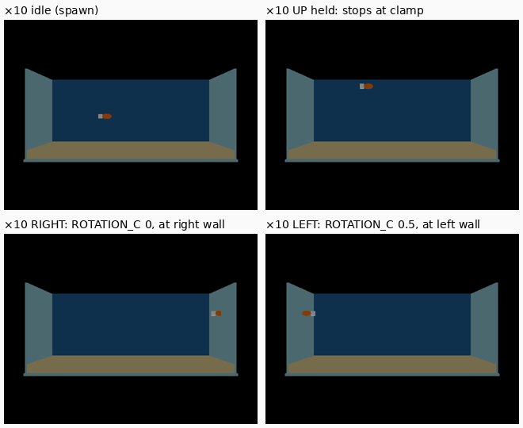

5. Minimal level: an open box (statplat mesh), one `Physics` fish, `Falling Acceleration` 0. Expected: with no input the fish holds altitude for 10 s (Z changes < 1 % of tank height).

    ```
    [swim_spike] WORLD_SCALE=10.0 shell=slabs fish=ellipsoid fish spawn (-1.6, 0.0, 2.4) ZMAX=4.4069 V=3.0480 inner x ±5.9690 y ±1.5240 sand 0.6350 water 4.8260
    ## WORLD_SCALE = 10   (player idx 8; walls x ±5.9690, y ±1.5240; sand 0.6350; water 4.8260; clamp ZMAX 4.4069; V 3.0480)
    jolt: character 0 created at (-1.60, 0.00, 2.40) ctr=(-0.11,0.00,0.18)
    phase     btn      s              start x,y,z                end x,y,z            x range           y range           z range
    idle      -     10.0     -1.600  0.000  2.400     -1.600  0.000  2.400     None   None      None   None      None   None
    step 5: idle Z drift 0.00000 vs 1 % of the water column 0.04191 → PASS
    ```

    **PASS (×10).** Z is 2.400 at the start and the end of the 10 s and never changes (the bridge sends a value only
    when it changes, and it sent none). Why it holds: in the air `AirHandler::predictPosition` adds
    `−Falling Acceleration·dt` = 0 and otherwise only scales the existing velocity by the drag; the script writes no
    speed, so the velocity stays 0, and Jolt gets zero gravity (`JoltCharacterUpdate` passes `sZero()`).

6. Drive `ZSPEED` from Forth. Expected: the fish rises and stops at a Z clamp under the water line; it does not pass through the sand or the walls.

    ```
    [swim_spike] WORLD_SCALE=10.0 shell=slabs fish=ellipsoid fish spawn (-1.6, 0.0, 2.4) ZMAX=4.4069 V=3.0480 inner x ±5.9690 y ±1.5240 sand 0.6350 water 4.8260
    ## WORLD_SCALE = 10   (player idx 8; walls x ±5.9690, y ±1.5240; sand 0.6350; water 4.8260; clamp ZMAX 4.4069; V 3.0480)
    jolt: character 0 created at (-1.60, 0.00, 2.40) ctr=(-0.11,0.00,0.18)
    phase     btn      s              start x,y,z                end x,y,z            x range           y range           z range
    idle      -     10.0     -1.600  0.000  2.400     -1.600  0.000  2.400     None   None      None   None      None   None
    up        UP     6.0     -1.600  0.000  2.400     -1.600  0.000  4.407     None   None      None   None     2.537  4.407
    down      DOWN   6.0     -1.600  0.000  4.407     -1.600 -0.000  0.635     None   None    -0.000 -0.000     0.635  4.270
    rest      -      1.0     -1.600 -0.000  0.635     -1.600 -0.000  0.635     None   None      None   None      None   None
    rise      UP     0.6     -1.600 -0.000  0.635     -1.600 -0.000  2.721     None   None      None   None     0.787  2.721
    settle    -      2.0     -1.600 -0.000  2.721     -1.600 -0.000  3.524     None   None      None   None     2.802  3.524
    right     RIGHT  5.0     -1.600 -0.000  3.524      5.936 -0.000  3.531   -1.463  5.936      None   None     3.524  3.531
    off-wall  LEFT   1.5      5.936 -0.000  3.531      1.487 -0.000  3.531    1.487  5.799      None   None     3.531  3.531
    glide     -      2.0      1.487 -0.000  3.531      0.595 -0.000  3.531    0.595  1.397      None   None     3.531  3.531
    left      LEFT   6.0      0.595 -0.000  3.531     -5.708 -0.000  3.531   -5.708  0.594      None   None     3.531  3.531
    back      C      5.0     -5.708 -0.000  3.531     -5.708  1.377  3.531     None   None     0.137  1.377     3.531  3.531
    front     B      5.0     -5.708  1.377  3.531     -5.478 -1.377  3.640   -5.685 -5.478    -1.377  1.240     3.531  3.640
    end       -      1.0     -5.478 -1.377  3.640     -5.478 -1.377  3.640   -5.478 -5.478      None   None     3.640  3.640
    step 6: UP stops at the clamp: 4.4069 vs 4.4069 → PASS
    step 6: DOWN stops on the sand: 0.635 vs 0.6350 → PASS
    step 6: RIGHT: capsule stays inside the right wall: 5.9363 vs 5.9690 → PASS
    step 6: LEFT: capsule stays inside the left wall: -5.7077 vs -5.9690 → PASS
    step 6: C: inside the back wall: 1.377 vs 1.5240 → PASS
    step 6: B: inside the front collider: -1.377 vs -1.5240 → PASS
    fish mesh extents (local, from the .lev BOX3): x [-0.5588, 0.3302] y [-0.1270, 0.1270] z [0.0000, 0.3556]; levcomp raises any span < 0.25 m to 0.25 (min side)
    visual gap mesh→surface at the limit (negative = the mesh pokes through):  right wall -0.2975  left wall -0.0689  back wall +0.0200  front glass +0.0200  sand -0.0000  water line +0.0635
    glide: released at x 1.4870, 2 s later x 0.5950 → 0.8921
    ```

    **PASS (×10), with two findings for Phase 3.** Held UP stops the feet at exactly the clamp, 4.407 (the top of the
    fish 0.064 m under the 4.826 water line); held DOWN stops the feet exactly on the sand, 0.635; held into each wall for
    5 s the capsule stops 0.020 m from the inner face (Jolt's character padding) and never passes it, the invisible front
    collider included. The one-piece shell variant (`--shell=one`) contains the fish identically.

    - **The nose enters the end walls.** Visual gap at the limit: right −0.30 m, left −0.07 m. The Jolt capsule is sized
      `radius = min(halfX, halfY)` of the bounding box (`jolt_backend.cc`, `JoltCharacterCreate`) = half the fish's
      *thickness* (0.127 m), and it is world-axis aligned (the heading does not rotate it), so a side-on fish is
      stopped by a 0.25 m-wide capsule while its 0.89 m body sticks out ahead of it. It is asymmetric because the
      capsule centre is offset −0.114 m in X from the origin (the tail makes the box asymmetric) whichever way the
      fish faces. Fix in the script (no engine change): clamp X as well as Z, |X| ≤ inner face − nose reach.
    - **Wall push-off.** After a fish pinned against a wall starts sliding along it, it drifts away from the wall and,
      a little, vertically: `front` above, +0.23 m in X and +0.11 m in Z. It is not every slide: across four runs
      the B slide along the left wall drifted every time (+0.23 to +0.33 m X), the C slide just before it never did,
      and a separate trace saw it on a C slide straight after LEFT (+0.35 m X, −0.04 m Z). The drift decays by exactly
      × 0.9 per tick, the air drag, so it is a velocity injected on one frame and then carried: `JoltCharacterUpdate`
      takes an airborne character's velocity from its position change, and `AirHandler` keeps that velocity. What
      moves the character on that first frame is **not established**. It is not penetration recovery: the capsule
      sits exactly one padding (0.020 m) off the wall before the slide. Finding it needs a per-contact dump from inside
      Jolt's `CharacterVirtual::ExtendedUpdate`, which means an engine print. It is bounded (at most 3 % of the tank
      length) and the X/Z clamps above bound it, so it does not block the level.

7. Write `ROTATION_C` from Forth. Expected: the mesh's heading changes on screen. If not, the recorded fallback is `Turn Rate` > 0.

    ```
    $ # screenshots over the bridge after RIGHT (script writes ROTATION_C 0) and LEFT (ROTATION_C 0.5)
    step 7 screenshots: ~/tmp/aquarium-swim/phase1-x10-facing-right.png  ~/tmp/aquarium-swim/phase1-x10-facing-left.png
    $ # white tail pixels relative to the orange body, from the two PNGs:
    right orange x 536 539 white-tail mean x 527.5
    left orange x 109 112 white-tail mean x 120.0
    ```

    **PASS.** The tail is on the left of the body when facing right and on the right when facing left (grid above,
    bottom row), so a `ROTATION_C` write turns a `Physics` actor's mesh; the `Turn Rate` fallback is not needed. The
    value is in **revolutions** (`Actor` mailbox write: `Angle::Revolution(value)`; the same handler also calls
    `SetRotation`). The collision capsule does not turn with it (above). The clownfish idle-animation branch had not
    recorded anything on this when I checked (no commits beyond `f964a400`, clean worktree), so this is the first
    measurement.

8. Repeat 5–7 at ×1 and at ×10. Expected: ×10 passes all three; record what ×1 does. The winner becomes `WORLD_SCALE`.

    ```
    [swim_spike] WORLD_SCALE=1.0 shell=slabs fish=ellipsoid fish spawn (-0.16, 0.0, 0.24) ZMAX=0.4407 V=0.3048 inner x ±0.5969 y ±0.1524 sand 0.0635 water 0.4826
    ## WORLD_SCALE = 1
    ENGINE ABORTED before the bridge came up (exit 255): AssertMsg:Probably have a polygon which is too small, length = 5.494595098e-05 | |length.Abs() > Scalar(0,4)                                                   |
    [swim_spike] WORLD_SCALE=1.0 shell=slabs fish=box fish spawn (-0.16, 0.0, 0.24) ZMAX=0.4407 V=0.3048 inner x ±0.5969 y ±0.1524 sand 0.0635 water 0.4826
    ## WORLD_SCALE = 1   (player idx 8; walls x ±0.5969, y ±0.1524; sand 0.0635; water 0.4826; clamp ZMAX 0.4407; V 0.3048)
    jolt: character 0 created at (-0.16, 0.00, 0.24) ctr=(-0.09,-0.11,-0.09)
    phase     btn      s              start x,y,z                end x,y,z            x range           y range           z range
    idle      -     10.0     -0.173  0.105  0.441     -0.173  0.105  0.441   -0.173 -0.173      None   None      None   None
    up        UP     6.0     -0.173  0.105  0.441     -0.173  0.105  0.441   -0.173 -0.173      None   None      None   None
    down      DOWN   6.0     -0.173  0.105  0.441     -0.173  0.105  0.278   -0.173 -0.173      None   None     0.278  0.427
    rest      -      1.0     -0.173  0.105  0.278     -0.173  0.105  0.278     None   None      None   None      None   None
    rise      UP     0.6     -0.173  0.105  0.278     -0.173  0.105  0.441     None   None      None   None     0.293  0.441
    settle    -      2.0     -0.173  0.105  0.441     -0.173  0.105  0.441     None   None      None   None      None   None
    right     RIGHT  5.0     -0.173  0.105  0.441      0.544  0.112  0.278   -0.160  0.544     0.106  0.112     0.278  0.278
    off-wall  LEFT   1.5      0.544  0.112  0.278      0.108  0.112  0.278    0.108  0.530      None   None      None   None
    glide     -      2.0      0.108  0.112  0.278     -0.048  0.112  0.278   -0.048  0.096      None   None      None   None
    left      LEFT   6.0     -0.048  0.112  0.278     -0.360  0.112  0.278   -0.360 -0.048      None   None      None   None
    back      C      5.0     -0.360  0.112  0.278     -0.360  0.120  0.278     None   None     0.120  0.120      None   None
    front     B      5.0     -0.360  0.120  0.278     -0.360  0.105  0.278     None   None     0.105  0.106      None   None
    end       -      1.0     -0.360  0.105  0.278     -0.360  0.105  0.278     None   None      None   None      None   None
    step 5: idle Z drift 0.00000 vs 1 % of the water column 0.00419 → PASS
    step 6: UP stops at the clamp: 0.4407 vs 0.4407 → PASS
    step 6: DOWN stops on the sand: 0.2779 vs 0.0635 → PASS
    step 6: RIGHT: capsule stays inside the right wall: 0.5439 vs 0.5969 → PASS
    step 6: LEFT: capsule stays inside the left wall: -0.3599 vs -0.5969 → PASS
    step 6: C: inside the back wall: 0.1197 vs 0.1524 → PASS
    step 6: B: inside the front collider: 0.1049 vs -0.1524 → PASS
    fish mesh extents (local, from the .lev BOX3): x [-0.0559, 0.0330] y [-0.0127, 0.0127] z [0.0000, 0.0356]; levcomp raises any span < 0.25 m to 0.25 (min side)
    visual gap mesh→surface at the limit (negative = the mesh pokes through):  right wall +0.0200  left wall +0.2040  back wall +0.0200  front glass +0.2446  sand +0.2144  water line +0.0063
    glide: released at x 0.1079, 2 s later x -0.0481 → 0.1560
    step 7 screenshots: ~/tmp/aquarium-swim/phase1-x1-box-facing-right.png  ~/tmp/aquarium-swim/phase1-x1-box-facing-left.png
    ```

    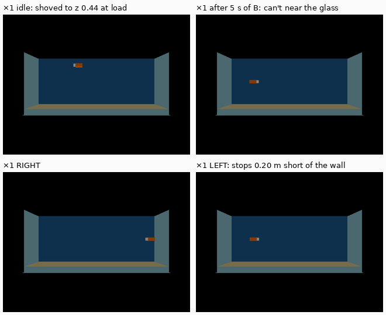

    **×10: PASS on 5, 6, 7 (above). ×1: FAIL — `WORLD_SCALE = 10` wins.** The script's automatic `PASS` lines only test
    that the fish stays *inside* each limit, not that it can *reach* it, so they pass here and mislead; the gaps say
    what happened. What ×1 actually does:

    - **The level does not load with a smooth fish.** A 12 × 8 ellipsoid at 8.9 cm aborts on
      `Probably have a polygon which is too small` (`math/vector3.hpi:243`: `|(v2−v0)×(v1−v0)|` must be > 6.1e‑5, so
      every triangle needs more than about 3e‑5 m²). The rest of ×1 used a coarse box fish (`--fish=box`). A 9 cm fish
      with fins, or a 1 cm anemone tentacle, cannot be authored at ×1 at all.
    - **The fish becomes a 25 cm ball.** `levcomp` raises every collision-box axis shorter than 0.25 m to 0.25 m by
      moving its *min* down (`levcomp-rs/src/lvl_writer.rs:550`, `expand_thin_bbox`, a port of `iff2lvl`). The
      8.9 × 2.5 × 3.6 cm fish box becomes 25 × 25 × 25 cm hanging below, behind and toward the glass: the character
      centre offset is (−0.09, −0.11, −0.09) against (−0.011, 0, 0.018) authored, which matches `max − 0.125` on every
      axis. Consequences measured above: on load it is shoved from (−0.16, 0, 0.24) to (−0.17, 0.105, 0.44); DOWN stops the
      feet 0.214 m over the sand (44 % of the water column); B moves it 1.5 cm in a 30 cm tank (it stops 0.245 m from the
      glass); LEFT stops 0.20 m short of the wall.
    - **The camera cannot come close.** The projection's near plane is fixed at 1.0 m (`gfx/gl/display.cc`,
      `SetProjection(60°, aspect, 1.0, 1000)`, not changeable per shot: FOV/hither/yon never reach the renderer). At
      ×1 the anemone close-up (camshot B) would need the camera about 0.3 m from the anemone, which cannot be drawn,
      and the front edge of the tank is already 0.935 m from the default front camera.
    - **Also seen, not isolated:** in the RIGHT run the ×1 fish dropped from 0.441 straight to the sand-limited 0.278
      on the first frame of horizontal motion. The Jolt step constants in `JoltCharacterUpdate` are in metres (stick to
      floor 0.5 m, step up 0.4 m), about the whole ×1 tank's height, and are the likely cause. That is not verified,
      and it is moot given the three blockers above.
    - Fog was not exercised (fog off in the spike). Its distances are `WORLD_SCALE` multiples by construction (§ 7).

    Capsule used at ×10 (the placeholder, for comparison with the canonical fish): mesh box x [−0.559, 0.330],
    y ±0.127, z [0, 0.356] m → Jolt capsule radius 0.127, cylinder half-height 0.051, total height 0.356, centre at
    (−0.114, 0, 0.178) from the actor origin, world-axis aligned.

#### Phase 1 verdict

**A gravity-free `Physics` fish works at ×10 with no engine change; `WORLD_SCALE = 10` stands.** At ×10 steps 5, 6
and 7 pass. ×1 fails on three fixed constants: minimum triangle area, levcomp's 0.25 m minimum collision span, and the
1 m near plane. No escalation is needed for Phase 2–3.

| Step | ×10 | ×1 |
|---|---|---|
| 5 hover | PASS, drift 0 in 10 s | Holds, but only after load shoved it 0.2 m up and 0.1 m back |
| 6 speeds, clamp, walls | PASS: exact clamp, exact sand stop, 0.020 m wall padding; nose enters the end walls (0.30 m / 0.07 m); wall push-off ≤ 0.35 m | Contained, but cannot reach the sand (0.21 m short), the glass (0.25 m) or the left wall (0.20 m) |
| 7 `ROTATION_C` | PASS (revolutions; the mesh turns, the capsule does not) | Turns (grid) |
| 8 | **Winner** | Rejected |

**These values were measured on a single-actor placeholder**, not the canonical clownfish (§ 4, *Model ownership*;
step 15 re-checks them in Phase 3). How they carry over:

| Carries over unchanged | Depends on the real fish's bounding box / capsule |
|---|---|
| Swim speed `V` = 12 in/s × `WORLD_SCALE` (3.048 m/s written; 2.74 m/s cruise) | `ZMAX` = water line − **fish height** − 0.25 in |
| `Horiz/Vert Air Drag` 2.0 (glide × 0.9 per tick, ≈ 1.2 m) | The X clamp to add: \|X\| ≤ 5.969 − **nose reach** from the origin, per heading |
| `Max Air Speed` = `Max Ground Speed` = 2 V (never 0) | Capsule radius = min(half length, half **thickness**), world-axis aligned |
| `Falling Acceleration` 0, `Air/Running/Jumping Acceleration` 0, `Running Deceleration` 0.05, `Turn Rate` 0, `Script Controls Input` True + `INPUT` 0 | Capsule centre offset (from the box's asymmetry) → how far nose and tail enter the walls |
| The clamp mechanism (`ZSPEED` := 0, `Z_POS` := `ZMAX`) and `ROTATION_C` 0 / 0.5 | **The 0.25 m minimum span** (below) |
| Invisible front collider; tank as slabs (or `Player` created before a one-piece tank) | Where the feet sit on the sand (mesh base at local z = 0 = feet) |

Placeholder capsule, for comparison: mesh box x [−0.559, 0.330], y ±0.127, z [0, 0.356] m at ×10 → radius 0.127,
cylinder half-height 0.051, total height 0.356, centre (−0.114, 0, 0.178) from the origin. Its thinnest span, 0.254 m,
is **just above** levcomp's 0.25 m minimum. A real ocellaris is thinner than it is deep (about ½ in, so about 0.13 m at
×10), so the canonical fish's box **will** be inflated to 0.25 m by moving its min face, which pushes the capsule about
0.06 m toward −Y (the glass). Fix without an engine change: give the Player an authored `wf_original_bbox` that is
symmetric about the body and ≥ 0.25 m on every axis. levcomp takes an authored box verbatim
(`lvl_writer.rs` ≈ line 310), and the thin-span rule then leaves it alone. Then re-measure.

Open for Phase 3 (neither blocks):
- The nose enters the end walls. Add the X clamp (script only).
- Wall push-off. Its first-frame source inside Jolt is unidentified (step 6 says what evidence is missing). It is
  bounded, and the X/Z clamps contain it.

**Phase 2–3 — level**

Phase 2 was run 2026‑09‑30 on Linux in an isolated worktree, using the main checkout's `engine/wf_game` (built 2026‑09‑25) and this worktree's own freshly built Rust tools. The fish is the **placeholder** (the Phase 1 ellipsoid and tail, recentred) until Phase 3. Steps 12, 14 and 15 belong to Phase 3.

9. `task aquarium-level` from a clean checkout. Expected: builds with no manual pre-step, and is a no-op on the second run.

    ```
    $ # cold tool build in this worktree (no target/ dirs before):
    $ time task tools-build
        Finished `release` profile [optimized] target(s) in 41.68s
    real	1m31.333s
    $ # clean state: every generated file removed, and the task checksum
    $ rm -rf wflevels/aquarium/{Perm.*,Room0.*,*.iff,aquarium.iff.txt,aquarium.ini,aquarium.lev,aquarium.lev.bin,aquarium.lvl,asset.inc,pal*.tga,textile.log.htm} \
             wflevels/aquarium.iff wflevels/aquarium-standalone.iff .task/checksum/aquarium-level*
    $ ls wflevels/aquarium
    aquarium-standalone.iff.txt  aquarium_constants.py  blender_create_aquarium.py  run_aquarium_checks.py
    $ task aquarium-level 2>&1 | grep -v '^  '
    task: Task "tools-build" is up to date
    task: [aquarium-level] set -euo pipefail
    [aquarium] scaffold survivors: ['Camera', 'Director', 'LevelObj', 'LookAt', 'Matte', 'Player', 'Room', 'SunLight', 'cs_front']
    [aquarium] WORLD_SCALE=10.0 fish spawn (-1.6, 0.0, 2.4) V=3.0480 ZMAX=4.4069 XMAX=5.4610 inner x ±5.9690 y ±1.5240 sand 0.6350 water 4.8260
    [aquarium] rock top z 1.185; anemone crown top z 2.358, span 1.904 m (7.5 in); zone ±2.20 m at (2.5, 0.0, 1.771)
    [aquarium] fog 0x0d5f7a 6→40 m; camera (0.0, -11.0, 2.667) → (0.0, 0.0, 2.667)
    [aquarium] actor order: ['Camera', 'Director', 'LevelObj', 'Matte', 'cs_front', 'LookAt', 'Room', 'Player', 'SunLight', 'tank-shell', 'tank-front-collider', 'tank-rim', 'sand', 'rock', 'anemone', 'anemone-zone', 'stand', 'room-backdrop', 'AmbientLight']
    [aquarium] exporting wflevels/aquarium/aquarium.lev
    Info: Exported 19 objects to …/wflevels/aquarium/aquarium.lev
    [aquarium] done
    task: [aquarium-level] bash wftools/wf_blender/build_level_binary.sh aquarium
    [1/5] iffcomp-rs  aquarium.lev  →  aquarium.lev.bin
    [2/5] levcomp-rs  aquarium.lev.bin  →  aquarium.lvl + asset.inc + aquarium.iff.txt + aquarium.ini
    levcomp v0.1.0
    [3/5] textile-rs  -ini=aquarium.ini  →  palN.tga / RoomN.{tga,ruv,cyc} / Perm.{tga,ruv,cyc}
    [4/5] iffcomp-rs  aquarium.iff.txt  →  ../aquarium.iff
    ✓ built …/wflevels/aquarium.iff (77824 bytes)
    [5/5] iffcomp-rs  aquarium-standalone.iff.txt  →  ../aquarium-standalone.iff
    ✓ built …/wflevels/aquarium-standalone.iff (81920 bytes)
    $ task aquarium-level; echo "exit=$?"
    task: Task "tools-build" is up to date
    task: Task "aquarium-level" is up to date
    exit=0
    ```

    **PASS.** From a clean state the level builds with one command (`deps: [tools-build]` covers the Rust tools, and the cold tool build above is part of the same chain). The second run is a no-op. `Player` is 8th in actor order and `tank-shell` 10th (the Phase 1 rule).

10. `python3 -m pytest tests/test_aquarium_level.py`. Expected: pass (see § Regression guard).

    ```
    $ python3 -m pytest tests/test_aquarium_level.py -v --color=no -p no:cacheprovider
    collecting ... collected 8 items

    tests/test_aquarium_level.py::test_shell_bbox_is_48_by_13_by_21_inches PASSED [ 12%]
    tests/test_aquarium_level.py::test_water_line_volume_is_45_2_gallons PASSED [ 25%]
    tests/test_aquarium_level.py::test_exactly_one_player_anemone_and_zone PASSED [ 37%]
    tests/test_aquarium_level.py::test_no_snowgoons_derived_names_remain PASSED [ 50%]
    tests/test_aquarium_level.py::test_player_is_created_before_the_tank PASSED [ 62%]
    tests/test_aquarium_level.py::test_player_bbox_is_authored_symmetric_and_not_thin PASSED [ 75%]
    tests/test_aquarium_level.py::test_plan_b_nothing_translucent_front_collider_invisible PASSED [ 87%]
    tests/test_aquarium_level.py::test_fog_is_the_water PASSED               [100%]

    ============================== 8 passed in 0.25s ===============================
    ```

    **PASS.** It covers the regression guard as adjusted for Plan B (§ Regression guard): the pane-texture check is replaced by "nothing translucent, and the front collider is invisible", plus the Phase 1 ordering and bbox rules.

11. `task run-aquarium`; capture frame A. Expected: the whole tank in frame, fish visible, no z-fighting on the acrylic rims, water colour in the range of mockup A.

    ```
    $ python3 wflevels/aquarium/run_aquarium_checks.py        # runs aquarium-standalone.iff under -rate20; bridge screenshot after 2 s
    screenshot frame-a: /home/will/tmp/aquarium-phase2/phase2-frame-a.png
    $ # pixels, frame A vs the mockup's panel A (docs/plans/2026-09-30-aquarium-level/gameplay-states.png)
    water mid (320, 200) (24, 121, 165)      mockup water (380, 300) (43, 148, 172)   mockup water low (200, 420) (13, 80, 109)
    sand top (200, 320) (205, 199, 154)      mockup sand (200, 445) (192, 174, 126)
    stand (320, 420) (40, 34, 27)            mockup stand (380, 520) (32, 22, 15)
    backdrop (320, 50) (12, 39, 55)          mockup room (380, 150) (24, 39, 53)
    end wall (70, 250) (9, 59, 90)           fish (262, 243) (118, 72, 25)
    ```

    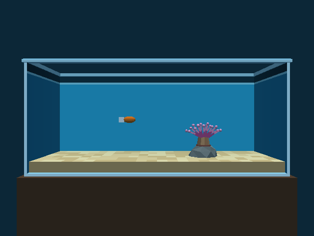

    **PASS**, on the equivalent command rather than `task run-aquarium`: its `ensure-build` dep would rebuild the engine in this worktree, and a manual run is interactive. `run_aquarium_checks.py` loads the same `wflevels/aquarium-standalone.iff`. The whole tank is in frame, 85 % of the width, with the stand below and the room above. The fish is visible at its spawn. In 4× crops of both top rim corners, the bottom-front edge and the anemone there is no z-fighting: no face in the level is coplanar with another visible face (the rim overhangs the walls, the walls are stacked boxes, and the sand is inset 0.02 in). The water, (24, 121, 165), sits between the mockup's upper and lower water colours; sand, stand and room are each within about 25 per channel of the mockup. Tuning went three rounds: (1) the first capture was lit by ambient only, so the light aim was mirrored (§ 7); (2) the colours were warmed against the teal fog; (3) the water-line band went from 0.2 in to 0.4 in so it is about 3 px at 11 m.

    The same run parks the fish inside the anemone's crown (next frame): the front tentacles overlap it by plain depth, which is the authoring rule of § 5, ahead of Phase 3's camshot B.

    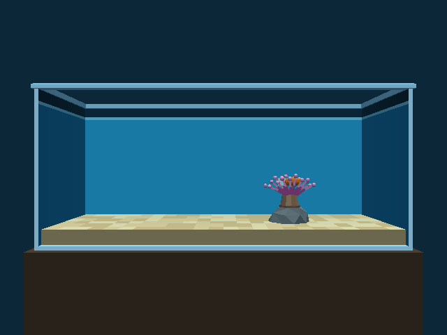

12. Swim into the anemone zone; capture frame B. Expected: the close-up camshot engages, and the fish is partly overlapped by front tentacles.

    ```
    $ python3 wflevels/aquarium/run_aquarium_checks.py        # paused, stepped per tick, input injected every tick   (step-12 excerpt)
    step 11: CAMSHOT 5 (cs_front = 5) → PASS
    screenshot b-edge: /home/will/tmp/aquarium-phase3/phase3-b-edge.png
    screenshot phase3-frame-b: /home/will/tmp/aquarium-phase3/phase3-frame-b.png
    phase     btn       s               start x,y,z                 end x,y,z
    to-left   LEFT   4.00     2.706  -1.350   3.861    -5.378  -1.350   3.861
    to-y0     C      2.10    -5.378  -1.350   3.861    -5.378   0.138   3.861
    to-z      DOWN   2.20    -5.378   0.138   3.861    -5.378   0.158   2.098
    into-crown RIGHT  7.45    -5.378   0.158   2.098     2.578   0.159   2.078
    host      -      4.00     2.578   0.159   2.078     2.578   0.159   2.078
    step 12: entered the zone at (0.383, 0.159, 2.078), 2.145 m from the zone centre (radius 2.2)
    step 12: in the crown at (2.578, 0.159, 2.078) (target (2.5, 0.0, 2.1)); sideways deflection on the way in 0.0002 m; Player drift while hosting x/y/z 0.00008/0.00000/0.00007 m; idle weight 1.000
    step 12: CAMSHOT 27 (cs_anemone = 27); camera at (2.5, -2.2, 1.75) vs camshot B (2.5, -2.2, 1.75)
    screenshot b-reentry (camshot B after re-entering at the zone edge and gliding 3 s): /home/will/tmp/aquarium-phase3/phase3-b-reentry.png  fish at (1.755, 0.159, 2.078)
    step 12: zone flips (t, in-b, distance m): [(80.65, 0, 2.552), (84.35, 1, 2.143)] — leave at ≥ 2.5, enter at ≤ 2.2, one flip each way → PASS
    step 12: PASS
    joystick1_raw seen by the engine vs injected, 2646 ticks: 0 mismatches []
    run isolation: CLEAN
    jolt: character 0 created at (-1.60, 0.00, 2.40) ctr=(0.00,0.00,0.00)
    SUMMARY step 5: PASS step 6: PASS step 7: PASS step 12: PASS step 13: PASS step 15: PASS
    ```

    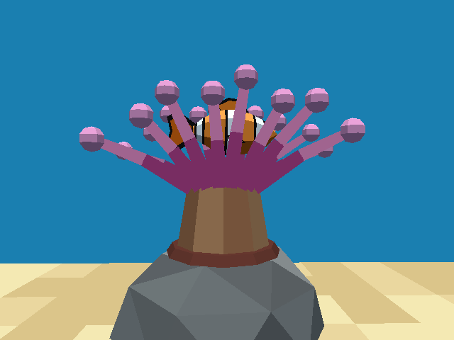

    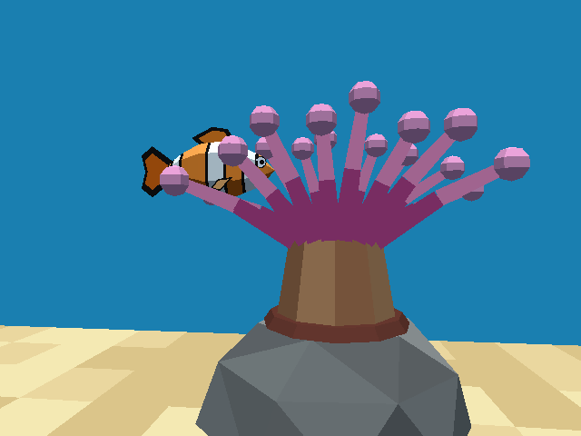

    **PASS.** The fish is driven only by held buttons: from the far left end it swims to the middle depth and height (`to-y0`, `to-z`), then along x at y 0.16, z 2.08 into the crown, and glides to rest at (2.578, 0.159, 2.078). That is between the tentacle sets (y ±0.36 m) and 0.18 m over the oral disc. It enters the zone 2.145 m from the centre, camshot B engages (`CAMSHOT` 27 = `cs_anemone`), and the camera reaches B exactly. On the way in the fish is deflected 0.0002 m sideways, and while hosting the Player moves < 0.1 mm with the idle at full weight. Frame B (first image) shows the idling fish in the crown, partly overlapped by the front tentacles, with the rock below, as in mockup B. Hysteresis: swimming out, the shot returns to A at 2.552 m; swimming back, B returns at 2.143 m, one flip each way. The second image is B after re-entry at the zone edge: the fish is 0.75 m left of the anemone, and LookB's lean keeps it in frame. The `b-edge` capture is the switching tick itself (the camera has not moved yet: it is sprung, not cut), so it is not shown. **Found on the way:** with the Phase 2 anemone (colliding tentacles) the real hull could not reach the crown. It arrived at y 0.158, was stopped at x 2.02 behind the column and pushed sideways, because the gap admits the capsule only within |y| < 0.035 m. The tentacles are now a non-colliding actor (§ Phase 3 verdict).

    **Phase 4:** the controller and the anemone changed, so this record is superseded by the re-run in step 17 (held buttons only, steer and swim, the 12 in anemone): PASS.

13. Hold each direction into every wall for 5 s. Expected: the fish never leaves the tank volume.

    ```
    $ python3 wflevels/aquarium/run_aquarium_checks.py
    screenshot in-crown: /home/will/tmp/aquarium-phase2/phase2-in-crown.png
    screenshot right-wall: /home/will/tmp/aquarium-phase2/phase2-right-wall.png
    screenshot left-wall: /home/will/tmp/aquarium-phase2/phase2-left-wall.png
    screenshot back-wall: /home/will/tmp/aquarium-phase2/phase2-back-wall.png
    screenshot front-glass: /home/will/tmp/aquarium-phase2/phase2-front-glass.png
    screenshot water-line: /home/will/tmp/aquarium-phase2/phase2-water-line.png
    screenshot sand: /home/will/tmp/aquarium-phase2/phase2-sand.png
    jolt: character 0 created at (-1.60, 0.00, 2.40) ctr=(0.00,0.00,0.18)
    desktop (unmapped) key events in the engine log: 0; position before the first hold (-1.6, 0.0, 2.4) vs spawn (-1.6, 0.0, 2.4) (drift 0.000); un-commanded motion: none
    run isolation: CLEAN
    phase   btn      s              start x,y,z                end x,y,z
    settle  -      2.0   -1.600  0.000  2.400   -1.600  0.000  2.400
    crown   -      2.0    2.500  0.000  1.950    2.500  0.000  1.950
    right   RIGHT  7.0    2.500  0.000  1.950    5.461  0.000  1.950
    left    LEFT  10.0    5.461  0.000  1.950   -5.461  0.000  1.950
    back    C      6.0   -5.461  0.000  1.950   -5.461  1.374  1.950
    front   B      7.0   -5.461  1.374  1.950   -5.461 -1.374  1.950
    up      UP     7.0   -5.461 -1.374  1.950   -5.461 -1.374  4.407
    down    DOWN   7.0   -5.461 -1.374  4.407   -5.461 -1.374  0.635
    end     -      1.0   -5.461 -1.374  0.635   -5.461 -1.374  0.635
    fish box (local, .lev BOX3): x [-0.4445, 0.4445] y [-0.1300, 0.1300] z [0.0000, 0.3556]
    origin extremes over the whole run: x [-5.4610, 5.4610]  y [-1.3740, 1.3740]  z [0.6350, 4.4069]
    step 13: fish box right edge vs right wall inner face: 5.9055 vs 5.9690 (gap 0.0635) → PASS
    step 13: fish box left edge vs left wall inner face: -5.9055 vs -5.9690 (gap 0.0635) → PASS
    step 13: fish box back edge vs back wall inner face: 1.5040 vs 1.5240 (gap 0.0200) → PASS
    step 13: fish box front edge vs front glass plane: -1.5040 vs -1.5240 (gap 0.0200) → PASS
    step 13: fish feet vs sand top: 0.6350 vs 0.6350 (gap 0.0000) → PASS
    step 13: fish top vs water line: 4.7625 vs 4.8260 (gap 0.0635) → PASS
    step 13: PASS
    ```

    **PASS.** Each wall was held for at least 5 s after contact: RIGHT ≈ 6 s, LEFT ≈ 6 s, C ≈ 5.5 s, B ≈ 6 s, UP ≈ 6 s and DOWN ≈ 5.6 s, after crossings at 2.74 m/s. Over the whole run the fish's box never passes a wall's inner face, the sand or the water line. The limits it reaches: the end walls stop at the script's X clamp (the nose 0.0635 m = 0.25 in off the wall), the back wall and front collider stop the capsule by physics (0.020 m, Jolt's padding), the sand stops the feet exactly, and the top clamps 0.0635 m under the water line. Two more results:

    - **The anemone split works physically.** Parked in the crown at (2.5, 0, 1.95) the fish is not pushed; it swims out through the crown and back at z 1.95 with y exactly 0.000. The first build, with the tentacle sets at y ±0.22 m, pushed a fish passing at z 2.4 0.27 m sideways and 0.6 m up: the gap must clear the capsule radius (0.13 m), the padding (0.02 m) and Jolt's 0.1 m predictive contact distance. It is ±0.36 m now.
    - **Phase 1's wall push-off did not recur.** The B slide along the left end wall does not touch the wall, because the X clamp holds the capsule 0.38 m off it.

    **One run was discarded, with a concrete cause.** In it the fish sat at x 0.868 before the first held button, 2.47 m of RIGHT the harness never sent. That engine log recorded X keyboard events (BackSpace, `c`, `a`, Tab, Alt_L as "unknown key"): the wf_game window is on the real desktop (there is no Xvfb on this host) and took keys typed while it had focus. The log names only *unmapped* keys, so a mapped arrow press leaves no line. The script therefore now fails any run with drift from spawn, motion in a no-button phase, or motion off the held axis (`run isolation`). The run above is `CLEAN`.

    **Phase 3 re-run on the canonical fish** (same harness run as step 12; the Player's box is the authored ±0.361 × ±0.125 × ±0.195 m, and the visible fish is checked with `extents()` plus the idle bob):

    ```
    $ python3 wflevels/aquarium/run_aquarium_checks.py        # paused, stepped per tick, input injected every tick   (step-13 excerpt)
    phase     btn       s               start x,y,z                 end x,y,z
    right13   RIGHT  7.00     1.755   0.159   2.078     5.378   0.159   2.078
    left13    LEFT  10.00     5.378   0.159   2.078    -5.378   0.159   2.077
    back13    C      6.00    -5.378   0.159   2.077    -5.378   1.350   2.077
    front13   B      7.00    -5.378   1.350   2.077    -5.378  -1.350   2.077
    up13      UP     7.00    -5.378  -1.350   2.077    -5.378  -1.350   4.461
    down13    DOWN   7.00    -5.378  -1.350   4.461    -5.378  -1.350   0.980
    end13     -      1.00    -5.378  -1.350   0.980    -5.378  -1.350   0.980
    step 13: time pressed against the limit: RIGHT 5.70 s, LEFT 6.10 s, C 5.60 s, B 6.00 s, UP 6.15 s, DOWN 5.70 s
    Player box (authored, local): x ±0.3614 y ±0.1250 z ±0.1951; fish extents {'nose_x': 0.361, 'tail_x': -0.528, 'top_z': 0.289, 'bottom_z': -0.181, 'half_width': 0.11}
    origin extremes over the whole run: x [-5.3779, 5.3779]  y [-1.3501, 1.3501]  z [0.9801, 4.4614]
    step 13: Player box right edge vs right wall inner face: 5.7393 vs 5.9690 (gap 0.2297) → PASS
    step 13: Player box left edge vs left wall inner face: -5.7393 vs -5.9690 (gap 0.2297) → PASS
    step 13: Player box back edge vs back wall inner face: 1.4751 vs 1.5240 (gap 0.0489) → PASS
    step 13: Player box front edge vs front glass plane: -1.4751 vs -1.5240 (gap 0.0489) → PASS
    step 13: Player box bottom vs sand top: 0.7850 vs 0.6350 (gap 0.1500) → PASS
    step 13: Player box top vs water line: 4.6565 vs 4.8260 (gap 0.1695) → PASS
    step 13: visible fish, tail tip or nose, vs right wall: 5.9055 vs 5.9690 (gap 0.0635) → PASS
    step 13: visible fish, tail tip or nose, vs left wall: -5.9055 vs -5.9690 (gap 0.0635) → PASS
    step 13: visible fish pectoral vs back wall: 1.4605 vs 1.5240 (gap 0.0635) → PASS
    step 13: visible fish pectoral vs front glass plane: -1.4605 vs -1.5240 (gap 0.0635) → PASS
    step 13: visible fish belly (bob low) vs sand: 0.7875 vs 0.6350 (gap 0.1525) → PASS
    step 13: visible fish dorsal (bob high) vs water line: 4.7625 vs 4.8260 (gap 0.0635) → PASS
    ```

    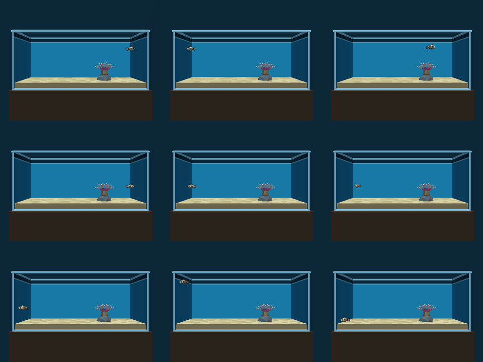

    **PASS.** Each wall is held 5.6 to 6.2 s after contact. The script clamps stop the fish before it touches any wall: the Player's box stays 0.230 m off the end walls, 0.049 m off the back wall and the front collider, and 0.150 m over the sand. The visible fish (tail tip or nose, pectorals, dorsal with the bob) stops exactly 0.0635 m (0.25 in) off every wall and the water line, and its belly (with the bob) stays 0.1525 m over the sand. Grid, left to right and top to bottom: facing right, facing left, after a dart, right wall, left wall, back wall, front glass, water line, sand.

    **Phase 4:** superseded by the re-run in step 17 (the fish now eases to a stop facing a wall, 0.25 in off it): PASS.

14. Run on a phone-landscape build with the touch profile. Expected: swim and dart reachable with existing A/B + D-pad regions. **Unverified on hardware; report, do not claim.**

    ```
    $ python3 wflevels/aquarium/run_aquarium_checks.py --profile touch   # AQUARIUM_PROFILE=touch build, injected buttons
    phase     btn       s               start x,y,z                 end x,y,z
    swim-up   UP     1.00    -1.600   0.000   2.400    -1.600   0.000   4.461
    tap-A     A      0.05    -1.600   0.000   4.461    -1.600   0.000   4.461
    settle1   -      1.50    -1.600   0.000   4.461    -1.600   0.000   4.461
    depth-up  UP     1.00    -1.600   0.000   4.461    -1.600   1.350   4.461
    settle2   -      1.50    -1.600   1.350   4.461    -1.600   1.350   4.461
    depth-down DOWN   1.00    -1.600   1.350   4.461    -1.600  -1.256   4.461
    settle3   -      3.00    -1.600  -1.256   4.461    -1.600  -1.350   4.461
    depth-right RIGHT  0.50    -1.600  -1.350   4.461    -0.366  -1.350   4.461
    settle4   -      4.00    -0.366  -1.350   4.461     1.006  -1.350   4.461
    tap-A2    A      0.05     1.006  -1.350   4.461     1.006  -1.350   4.461
    settle5   -      0.50     1.006  -1.350   4.461     1.006  -1.350   4.461
    swim-down DOWN   1.00     1.006  -1.350   4.461     1.005  -1.348   1.842
    settle6   -      3.00     1.005  -1.348   1.842     1.005  -1.348   0.980
    key-C     C      1.00     1.005  -1.348   0.980     1.005  -1.348   0.980
    settle7   -      1.00     1.005  -1.348   0.980     1.005  -1.348   0.980
    tap-B     B      0.05     1.005  -1.348   0.980     1.005  -1.348   0.980
    dart-glide -      3.00     1.005  -1.348   0.980     4.565  -1.348   0.980
    step 14: Swim mode: UP swims +Z only: (0.0, 0.0, 2.061) → PASS
    step 14: A tap → Depth mode (aq-mode 1): 1.0 → PASS
    step 14: Depth mode: UP swims +Y (away from the glass) only: (0.0, 1.35, 0.0) → PASS
    step 14: Depth mode: DOWN swims −Y only: (0.0, -2.606, 0.0) → PASS
    step 14: Depth mode: RIGHT still swims +X: (1.234, 0.0, 0.0) → PASS
    step 14: second A tap → Swim mode (aq-mode 0): 0.0 → PASS
    step 14: Swim mode: DOWN swims −Z only: (-0.001, 0.002, -2.62) → PASS
    step 14: C (keyboard depth) does nothing in the touch profile: (0.0, 0.0, 0.0) → PASS
    step 14: B tap darts along the facing (+X): (3.559, 0.0, 0.0) → PASS
    screenshot touch: /home/will/tmp/aquarium-phase3/phase3-touch.png
    joystick1_raw seen by the engine vs injected, 493 ticks: 0 mismatches []
    run isolation: CLEAN
    jolt: character 0 created at (-1.60, 0.00, 2.40) ctr=(0.00,0.00,0.00)
    SUMMARY step 14 (logic, injected buttons): PASS; phone hardware: not run
    ```

    **Logic verified, hardware unverified.** Built with `task aquarium-touch-level`, the touch profile does in the engine what the plan's narrow mockup says: an A tap cycles Swim → Depth → Swim (mailbox 701), D-pad ↑/↓ swim Z in Swim mode and Y in Depth mode, ←/→ swim X in both, a B tap darts, and C (the keyboard's depth button) does nothing. Buttons were injected over the debug bridge on a Linux desktop build. **No phone-landscape build was made or run**, so whether the phone's A/B + D-pad touch regions deliver these buttons is not verified. There is no on-screen mode indicator.

    **Phase 4 re-run (steer and swim).** The old checks asserted one-axis motion ("UP swims +Z only"), which the new controller deliberately never does, so step 14 now judges the facing each button turns the fish to, the way it then swims, and the velocity against the facing on every tick:

    ```
    $ python3 wflevels/aquarium/run_aquarium_checks.py --profile touch   # AQUARIUM_PROFILE=touch build, injected buttons
    phase     btn       s               start x,y,z                 end x,y,z
    swim-up   UP     1.00    -1.600   0.000   2.400     0.814   0.000   3.728
    tap-A     A      0.05     0.814   0.000   3.728     0.893   0.000   3.794
    settle1   -      1.50     0.893   0.000   3.794     1.634   0.000   4.023
    depth-up  UP     1.00     1.634   0.000   4.023     2.159   1.060   4.022
    settle2   -      1.50     2.159   1.060   4.022     2.159   1.096   4.022
    depth-down DOWN   1.00     2.159   1.096   4.022     2.489  -0.467   4.022
    settle3   -      3.00     2.489  -0.467   4.022     2.497  -1.095   4.022
    depth-right RIGHT  0.50     2.497  -1.095   4.022     2.527  -1.069   4.022
    settle4   -      4.00     2.527  -1.069   4.022     3.412  -1.150   4.022
    tap-A2    A      0.05     3.412  -1.150   4.022     3.412  -1.150   4.022
    settle5   -      0.50     3.412  -1.150   4.022     3.412  -1.150   4.022
    swim-down DOWN   1.00     3.412  -1.150   4.022     4.851  -1.171   3.411
    settle6   -      3.00     4.851  -1.171   3.411     5.010  -1.128   3.352
    key-C     C      1.00     5.010  -1.128   3.352     5.010  -1.128   3.352
    settle7   -      1.00     5.010  -1.128   3.352     5.010  -1.128   3.352
    turn-left LEFT   0.80     5.010  -1.128   3.352     3.804  -0.211   3.352
    settle8   -      2.00     3.804  -0.211   3.352     2.447  -0.163   3.352
    tap-B     B      0.05     2.447  -0.163   3.352     2.446  -0.163   3.352
    dart-glide -      3.00     2.446  -0.163   3.352    -0.901  -0.048   3.352
    step 14: Swim mode: UP climbs forward along the pitched facing (z up, x forward, y unchanged): (3.234, 0.0, 1.623) → PASS
    step 14: A tap → Depth mode (aq-mode 1): 1.0 → PASS
    step 14: Depth mode: UP turns to face +Y (away from the glass, yaw +0.25 rev) and swims that way: (0.249, (0.524, 1.096, -0.0)) → PASS
    step 14: Depth mode: DOWN turns to face −Y (toward the glass, yaw −0.25 rev) and swims that way: (-0.248, (0.338, -2.192, 0.0)) → PASS
    step 14: Depth mode: RIGHT still turns to +X and swims +X: (-0.016, (0.915, -0.054, 0.0)) → PASS
    step 14: Depth mode never changes z: (1.777, -1.15, -0.0) → PASS
    step 14: second A tap → Swim mode (aq-mode 0): 0.0 → PASS
    step 14: Swim mode: DOWN dives forward (z down): (1.598, 0.022, -0.671) → PASS
    step 14: C (keyboard depth) does nothing in the touch profile: (0.0, 0.0, 0.0) → PASS
    step 14: B tap darts along the facing it had: (3.35, 0.032) → PASS
    step 14: velocity ∥ facing on every moving tick (worst angle °, pushes excluded): (0.131, 7) → PASS
    screenshot touch: /home/will/tmp/aquarium-phase4/phase3-touch.png
    joystick1_raw seen by the engine vs injected, 549 ticks: 0 mismatches []
    Player at the first recorded tick (-1.6, 0.0, 2.4) vs spawn (-1.6, 0.0, 2.4) → at spawn; unmapped desktop key events in the engine log: 0
    run isolation: CLEAN
    DO_ASSERTIONS = 1, NO_ASSERT_EXPR = 0, USE_INLINE_DEFS = 1, WF_BIG_ENDIAN = 0
    jolt: character 0 created at (-1.60, 0.00, 2.40) ctr=(0.00,0.00,0.00)
    SUMMARY step 14 (logic, injected buttons): PASS; phone hardware: not run
    ```

    **Logic verified, hardware unverified.** All eleven checks pass on a CLEAN run. The first Phase 4 run failed the dart check (0.53 m, not > 1 m) for a concrete reason: the sequence's dive ended near the right wall facing it, and a dart into a wall only eases to a stop there. The sequence now turns back into open water first (`turn-left`, `settle8`). Still no phone build was made or run.

15. Re-run Phase 1 steps 5–7 (hover, scripted speeds and clamps, heading) on the **canonical clownfish** from `clownfish.py`, idle animation running. Expected: same results as the Phase 1 placeholder; idle motion is net-zero (Player drift 0), every part stays attached to the body through turns and wall contact, and the Player's `ROTATION_C` is never written.

    ```
    $ python3 wflevels/aquarium/run_aquarium_checks.py        # paused, stepped per tick, input injected every tick   (step-15 excerpt)
    screenshot frame-a: /home/will/tmp/aquarium-phase3/phase3-frame-a.png
    screenshot idle: /home/will/tmp/aquarium-phase3/phase3-idle.png
    step 11: CAMSHOT 5 (cs_front = 5) → PASS
    step 15/5: hover 10 s: Player drift x/y/z 0.00000/0.00000/0.00000 m (limit 1 % of the water column = 0.04191); idle weight at end 1.000; tail yaw rel. body -0.0500..+0.0500 rev; body bob -12.0..+12.0 mm
    step 15/5: PASS
    screenshot phase3-facing-right: /home/will/tmp/aquarium-phase3/phase3-facing-right.png
    screenshot phase3-facing-left: /home/will/tmp/aquarium-phase3/phase3-facing-left.png
    phase     btn       s               start x,y,z                 end x,y,z
    up        UP     6.00    -1.600   0.000   2.400    -1.600   0.000   4.461
    down      DOWN   6.00    -1.600   0.000   4.461    -1.600   0.000   0.980
    rest      -      1.00    -1.600   0.000   0.980    -1.600   0.000   0.980
    rise      UP     0.60    -1.600   0.000   0.980    -1.600   0.000   2.489
    settle    -      2.00    -1.600   0.000   2.489    -1.600   0.000   3.840
    right     RIGHT  5.00    -1.600   0.000   3.840     5.378   0.000   3.861
    off-wall  LEFT   1.50     5.378   0.000   3.861     1.400   0.000   3.861
    glide     -      2.00     1.400   0.000   3.861     0.049   0.000   3.861
    left      LEFT   6.00     0.049   0.000   3.861    -5.378   0.000   3.861
    back      C      5.00    -5.378   0.000   3.861    -5.378   1.350   3.861
    front     B      5.00    -5.378   1.350   3.861    -5.378  -1.350   3.861
    end       -      1.00    -5.378  -1.350   3.861    -5.378  -1.350   3.861
    step 15/6: UP stops at the clamp aq-zmax: 4.4614 vs 4.4614 → PASS
    step 15/6: DOWN stops at the clamp aq-zmin: 0.9801 vs 0.9801 → PASS
    step 15/6: RIGHT stops at the clamp aq-xmax: 5.3779 vs 5.3779 → PASS
    step 15/6: LEFT stops at the clamp −aq-xmax: -5.3779 vs -5.3779 → PASS
    step 15/6: C stops at the clamp aq-ymax: 1.3501 vs 1.3501 → PASS
    step 15/6: B stops at the clamp −aq-ymax: -1.3501 vs -1.3501 → PASS
    step 15/6: cruise 2.743 m/s (Phase 1: 2.74); glide over 2 s after release 1.351 m (Phase 1: 0.892 over 2 s)
    screenshot phase3-dart: /home/will/tmp/aquarium-phase3/phase3-dart.png
    step 15/6: dart (one A tap, facing +X): 5.486 m/s over the burst, travelled 3.560 m in 3.05 s (burst 6.096 m/s × 0.15 s, then the glide); y/z unchanged → PASS
    step 15/6: PASS
    step 15/7: body part heading after RIGHT -0.0070 rev, after LEFT +0.4966 rev; Player ROTATION_C over 1197 ticks: 0..0 → PASS
    step 15: part attachment over 2646 ticks (turns, darts, wall contact, hosting): worst |part − body| − |offset| tail 0.55 mm, dorsal 0.00 mm, pec-near 0.19 mm, pec-far 0.19 mm; body vs Player horizontal 0.000 mm, vertical 12.00 mm (bob amplitude 12 mm) → PASS
    joystick1_raw seen by the engine vs injected, 2646 ticks: 0 mismatches []
    run isolation: CLEAN
    jolt: character 0 created at (-1.60, 0.00, 2.40) ctr=(0.00,0.00,0.00)
    SUMMARY step 5: PASS step 6: PASS step 7: PASS step 12: PASS step 13: PASS step 15: PASS
    ```

    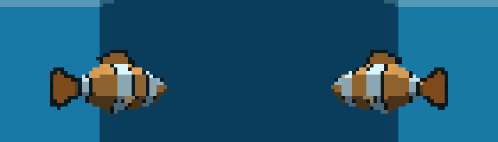

    ```
    $ python3 wflevels/aquarium/run_aquarium_checks.py --trace-sand   # along the sand into the rock, per tick (excerpt)
    -- settle - 1.5 s
    -- down DOWN 3.0 s
    -- rest - 1.0 s
    -- rise UP 0.2 s
    -- settle - 1.0 s
    -- down DOWN 1.0 s
    -- right RIGHT 3.0 s
    -- glide - 1.5 s
    joystick1_raw seen by the engine vs injected, 244 ticks: 0 mismatches []
    run isolation: CLEAN
      t    9.00 x +1.6876 y +0.0010 z +0.9827 vx +3.0480 vy +0.0000 vz +0.0000 joy +8192.0000
      t    9.05 x +1.7309 y +0.0256 z +1.0432 vx +3.0480 vy +0.0000 vz +0.0000 joy +8192.0000
      t    9.10 x +1.7672 y +0.0546 z +1.1076 vx +3.0480 vy +0.0000 vz +0.0000 joy +8192.0000
      t    9.15 x +1.8483 y +0.0747 z +1.1617 vx +3.0480 vy +0.0000 vz +0.0000 joy +8192.0000
      t    9.20 x +1.9085 y +0.1035 z +1.2312 vx +3.0480 vy +0.0000 vz +0.0000 joy +8192.0000
      t    9.25 x +1.9652 y +0.1318 z +1.2909 vx +3.0480 vy +0.0000 vz +0.0000 joy +8192.0000
      t    9.30 x +1.9991 y +0.1602 z +1.3331 vx +3.0480 vy +0.0000 vz +0.0000 joy +8192.0000
      t    9.35 x +2.0425 y +0.1861 z +1.3967 vx +3.0480 vy +0.0000 vz +0.0000 joy +8192.0000
      t    9.40 x +2.1835 y +0.2184 z +1.8037 vx +3.0480 vy +0.0000 vz +0.0000 joy +8192.0000
      t    9.45 x +2.2518 y +0.2647 z +1.8670 vx +3.0480 vy +0.0000 vz +0.0000 joy +8192.0000
      t    9.50 x +2.3660 y +0.2798 z +1.9065 vx +3.0480 vy +0.0000 vz +0.0000 joy +8192.0000
      t    9.55 x +2.4930 y +0.2864 z +1.9223 vx +3.0480 vy +0.0000 vz +0.0000 joy +8192.0000
      t    9.60 x +2.6339 y +0.2864 z +1.8585 vx +3.0480 vy +0.0000 vz +0.0000 joy +8192.0000
      t    9.65 x +2.7715 y +0.2924 z +1.8735 vx +3.0480 vy +0.0000 vz +0.0000 joy +8192.0000
    ```

    **PASS.** Phase 1 steps 5–7 on the canonical fish, with the idle running:

    - **5 hover:** 10 s with no input, Player drift 0.00000 m on every axis. The idle is at full weight (tail ±0.050 rev, bob ±12 mm), so the idle is cosmetic.
    - **6 speeds and clamps:** every held direction stops exactly at the level's clamp (to 0.1 mm). Cruise is 2.743 m/s, Phase 1's 0.137 m per tick. The release glide is 1.351 m in 2 s: 3.048 m/s × 0.05 s × Σ 0.9ᵏ, the drag model. Phase 1's table printed 0.892 m for its 2 s glide window, but its prose said ≈ 1.2 m, and this run agrees with the model. One A tap darts 3.56 m (5.49 m/s on the burst ticks, then the glide) with y and z unchanged.
    - **7 heading:** after RIGHT the body part faces −0.007 rev and after LEFT +0.497 rev (the rest is the tail's counter-yaw). The crops above show the tail on the correct side. The Player's own `ROTATION_C` reads 0 on all 1197 ticks it was sampled: nothing writes it.
    - **Attachment:** over 2646 ticks (turns, darts, wall contact, hosting) no part leaves its rigid offset from the body part by more than 0.55 mm (Bhaskara sine error). The body part sits on the Player to 0.000 mm horizontally, and vertically within the 12 mm bob. The Director runs after the Player, so the parts never lag.
    - **Found on the way (fixed):** (a) the floor clamp trapped the fish, because UP read back `ZSPEED` 0 at `ZMIN` (16.16 fixed point: the clamp fired at its own limit); (b) at `ZMIN` 0.891 the capsule was 0.06 m over the sand, inside Jolt's ground distance, so the fish was "standing" (cruise ×0.925 ground friction). Pushed into the rock, it stair-stepped and flew off at vz 7.18 m/s and vy 0.8 m/s to the top clamp. After the fixes (the trace above) it slides up and over the rock and the anemone column with |vz| never above the written 3.048 and vy 0. One 0.41 m step remains at the column (Jolt walk-stairs, t 9.35 → 9.40), plus 0.29 m of sideways slide.

    **Phase 4:** the speeds, clamps and heading above were Phase 1's per-axis model; the re-run on steer and swim is in step 17 (hover, cruise, glide, dart along the facing, Player `ROTATION_*` 0, attachment): PASS.


#### Phase 2 verdict

**Done: a static, correct scene at ×10, built by one task, guarded by a test, with no engine change.**

| Step | Result |
|---|---|
| 9 build from clean, no-op rerun | PASS |
| 10 regression guard (Plan B form) | PASS, 8 tests |
| 11 frame A | PASS on the equivalent capture command; whole tank, fish visible, no z-fighting, water in the mockup's range |
| 13 every wall held ≥ 5 s | PASS; the fish's box never leaves the tank; crown pass clean |

Tuning values: camera A at (0, −11, 2.667) m looking at (0, 0, 2.667), the tank's centre, so the tank fills 85 % of a 640 px width. Fog `0x0d5f7a`, 6 → 40 m, as planned. Directional (0.72, 0.74, 0.74) at 65° from the camera side, with the mirrored aim. Ambient (0.36, 0.43, 0.50). Water faces (0.16, 0.68, 0.86); matte background `0x0a0f16`.

Deviations from the plan, all deliberate:

- **Water colour comes from the shell, not a film actor or the fog.** Each wall is three stacked boxes whose inner faces are water-blue, a 0.4 in water-line band, and dark air. The fog adds about 15 % at 11 m. There is no separate film quad, since it would be coplanar with the wall and z-fight.
- **The placeholder fish is recentred** (X extent ±0.4445 m instead of the Phase 1 −0.559/+0.330). One symmetric X clamp, \|X\| ≤ 5.461 m, then serves both headings, so the fish does not snap when it turns at a wall. Its bbox is authored (0.889 × 0.26 × 0.356 m).
- **The anemone is about 7.5 in across** (spec: about 7 in), so the bulbs read at camera A. Its trimesh collides, so the fish hosts only in the y ≈ 0 gap between the sets. Phase 3 should decide whether that is the wanted behaviour.
- **Every scaffold bbox is re-authored.** `Room` gets its own box, the infrastructure actors get the explicit generic ±0.5 m box they already carried, and `Player` and `anemone-zone` get authored boxes.
- **`task run-aquarium` exists, but no captured result came from it.** It depends on `ensure-build`, which would build the engine in the worktree. Captures came from `run_aquarium_checks.py` on the main checkout's `wf_game`.

Open for Phase 3: the canonical clownfish replaces the placeholder at the `# PHASE 3` marker in `blender_create_aquarium.py`; camshot B and the Director switch read `anemone-zone`; re-run `run_aquarium_checks.py` for step 15.

#### Phase 3 verdict

**Done: the canonical clownfish is the player, with its idle animation, swim, depth and dart controls, a hosting anemone,
camshot B on a hysteresis zone, and a touch profile, with no engine change.** Run 2026‑09‑30 on Linux in an isolated
worktree, with the main checkout's `engine/wf_game` (built 2026‑09‑25) and this worktree's Rust tools. Every capture
above was opened and looked at.

| Step | Result |
|---|---|
| 11 frame A (re-captured with the real fish) | PASS: camshot A, whole tank, the fish at spawn |
| 12 swim into the anemone zone, frame B | PASS: held buttons only; B engages at 2.145 m; the fish idles in the crown behind the front tentacles; hysteresis 2.2 m in / 2.5 m out |
| 13 every wall held ≥ 5 s (real fish) | PASS: the box and the visible fish stay inside every face; clamps hold the visible fish 0.25 in off each wall |
| 14 touch profile | **Logic verified, hardware unverified**: all nine checks pass with injected buttons; no phone build was run |
| 15 Phase 1 steps 5–7 on the real fish | PASS: drift 0, exact clamps, cruise 2.743 m/s, heading flips, Player `ROTATION_C` never written, every part within 0.55 mm of its offset over 2646 ticks |
| Regression guards | `tests/test_aquarium_level.py` 19 passed; `tests/test_aquarium_idle.py` 8 passed, runtime included (27 in 21.9 s) |

**Tuning values.** Camera B (2.5, −2.2, 1.75) m; `LookB` rests at (2.5, 0, 1.62) and leans 35 % toward the fish. Zone:
enter within 2.2 m of (2.5, 0, 1.771), leave past 2.5 m. The `Camera` box is ±0.2 m. Swim: ±3.048 m/s while held,
nothing on release (cruise 2.743 m/s, glide ≈ 1.37 m). Dart: 6.096 m/s for 0.15 s along the facing, then the glide,
3.56 m in all. Clamps: |x| ≤ 5.378, |y| ≤ 1.350, 0.980 ≤ z ≤ 4.461 m. Host height: z ≥ 2.05 m over the oral disc.

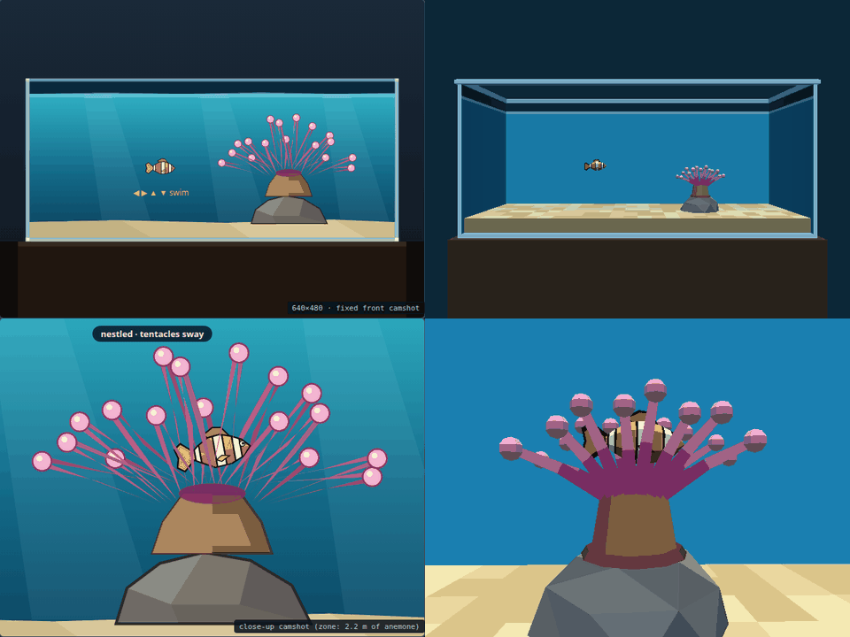

**Frame A and B against the mockups** (left mockup, right engine), honestly:

- **The anemone is smaller and stubbier than drawn.** The mockup's crown is a fan of long, thin tentacles about 2.5×
  the width of ours (it measures about 4.5 m at the tank's scale; the spec is 7 in = 1.78 m, and ours is 7.5 in). Ours
  has fewer visible bulbs, shorter, thicker strips, and a proportionally larger column. **Not changed in Phase 3:** a
  bigger fan would move the tentacle sets and the hosting geometry just verified. It fits Phase 4's sway work, which
  rebuilds the tentacles as clumps anyway.
- **The back wall is plain.** The mockup has light shafts and a vertical gradient; ours is one flat water colour.
  Not changed (Plan B has no textures, and a gradient needs a textured or subdivided face).
- **The camera looks slightly down.** Camshot A shows the sand floor in perspective and the end walls as trapezoids,
  where the mockup is flatter. The framing (tank width in frame, stand below, room above) matches.
- **The fish reads darker.** Its flanks are lit at about 0.66 by the 65° directional light, so the orange reads brown
  at camera A. The mockup's fish is flat bright orange.
- **In B the fish is more hidden** than in the mockup, because our front tentacles are thicker and closer together.
  The mockup's "tentacles sway" label is Phase 4.

**Deviations from the plan and the brief, each with its reason:**

1. **The tentacles are a separate, non-colliding actor** (`anemone-tentacles`, an anchored Mass-0 platform). Phase 2
   left open whether the anemone should collide. With solid tentacles the real hull entered the crown only within a
   ±0.035 m band of y about the gap (0.28 m to the bulbs, minus the 0.125 capsule, 0.02 padding and 0.1 predictive contact).
   One tick of Y input glides about 1.4 m, so a player cannot aim that closely. Measured: the fish arrived at y 0.158,
   stopped at x 2.02 and was pushed aside. The base, column and oral disc stay solid. Level authoring only, no engine
   change.
2. **No uncommanded acceleration** (`aq-no-kicks`): each tick, any axis that physics made faster than the script left it
   is put back to that speed. The brief said to write speeds "only while a direction is held". This writes a speed on
   a released axis only to cancel a physics-injected kick (the 7 m/s rock launch), and never changes the glide.
3. **The floor clamp is a ground clearance, not the belly margin.** `ZMIN` keeps the capsule 0.15 m over the sand
   (0.980 m, not 0.891 m), because within 0.12 m Jolt treats the fish as standing (ground friction, walk-stairs).
   The belly is therefore 0.15 m over the sand at the lowest.
4. **Clamps compare with ±1 mm** (16.16 fixed point; the floor clamp otherwise trapped the fish).
5. **One source for the constants:** `clownfish.py` now takes `WORLD_SCALE` and the 3.5 in length from
   `aquarium_constants.py`. The fish is 0.0889 m × 10 (was 0.089), so the nose is at 0.361 m (was 0.362). The idle
   spike was rebuilt, and its tests pass.
6. **`clownfish.py` script assembly:** `player_script` / `director_script` take `defs=` (and `entry=`), because the
   zForth host compiles up to the last `;` once and runs only what follows it every tick. Passing the level's
   definitions through `extra` would have put `fish-rig-tick` among the definitions, where it runs once at load.
7. **`cs_front` lost its self-select script;** the Director writes `CAMSHOT` every tick instead (bungee mode never
   clears it). The start-up camshot is still the first one constructed (`cs_front`).

**Residuals, not blocking:** pushed into the rock or the anemone column, the fish slides up and over (one 0.41 m
walk-stairs step, 0.29 m sideways). It is a solid obstacle; how the fish climbs it is Jolt's walker. During a
0.35 s turn at the front glass the visible nose sweeps toward the camera up to 0.19 m past the front-glass plane
(computed from `extents()` at |y| = 1.350, not measured): the rig turns through −0.25 rev (nose −Y), per the plan's
0 / −0.5 heading targets. With no pane (Plan B) nothing is
pierced; it reads as the fish turning toward the viewer. The touch mode has no on-screen indicator.

**Phase 4 — polish: anemone sway, the bigger anemone, water look, camera A, fish colour, steer and swim**

Run 2026‑09‑30 on Linux in an isolated worktree, with the main checkout's `engine/wf_game` (built 2026‑09‑25) and
this worktree's Rust tools, after a machine reboot at 17:34 (the first attempt at these runs died with the desktop
compositor at 17:13, "XIO: fatal IO error" in the engine log: a display fault, not a level fault). Every run below is
the paused, one-tick-per-step harness with a sticky injected joystick value, and every one printed `run isolation:
CLEAN`. Every capture was opened and looked at.

16. Sway: a 10 s trace of each tentacle clump's rotation, with no input. Expected: bounded by its amplitude, periodic,
    net zero over a period, the clumps' phases and periods offset from each other, the pivots never move, and the
    Player does not drift; two frame-A captures 1 s apart differ inside the anemone, and so do two frame-B captures.

    ```
    $ python3 wflevels/aquarium/run_aquarium_checks.py --sway     # paused, one tick per step, joystick 0 injected every tick
    screenshot sway-a0: /home/will/tmp/aquarium-phase4/phase4-sway-a0.png
    screenshot sway-a1 (1 s later): /home/will/tmp/aquarium-phase4/phase4-sway-a1.png
    step 16: 200 ticks traced, t 1.65 → 11.60 s
    clump                    B min..max (deg)   amp   A min..max (deg) mean B/period |B(t)-B(t+T)| median (odd)      phase t0     pivot    C
    anemone-tent-back-l      -4.999.. +4.993   5.0   -1.505.. +1.500       -0.0027  0.0000 (0/134)     0.515 rev   0.000mm    0 → PASS
    anemone-tent-back-c      -4.005.. +3.993   4.0   -1.203.. +1.197       -0.0029  0.0000 (0/105)     0.728 rev   0.000mm    0 → PASS
    anemone-tent-back-r      -4.999.. +4.993   5.0   -1.505.. +1.500       -0.0028  0.0000 (0/114)     0.105 rev   0.000mm    0 → PASS
    anemone-tent-front-l     -5.499.. +5.493   5.5   -1.505.. +1.500       -0.0027  0.0000 (0/122)     0.616 rev   0.000mm    0 → PASS
    anemone-tent-front-c     -4.504.. +4.494   4.5   -1.203.. +1.197       -0.0024  0.0000 (0/129)     0.029 rev   0.000mm    0 → PASS
    anemone-tent-front-r     -5.499.. +5.499   5.5   -1.505.. +1.494       -0.0026  0.0000 (0/139)     0.447 rev   0.000mm    0 → PASS
    step 16: measured periods (s): back-l 3.300 (authored 3.30), back-c 4.750 (authored 4.75), back-r 4.300 (authored 4.30), front-l 3.900 (authored 3.90), front-c 3.550 (authored 3.55), front-r 3.050 (authored 3.05); closest pair 0.250 s apart → PASS
    step 16: most correlated pair over this window (information): anemone-tent-back-c / anemone-tent-back-r r = -0.942
    step 16: phases at t0 (rev, sorted): [0.029, 0.105, 0.447, 0.515, 0.616, 0.728]; periods [3.05, 3.3, 3.55, 3.9, 4.3, 4.75] s
    step 16: Player drift while swaying x/y/z 0.00000/0.00000/0.00000 m → PASS
    step 16: frame A 1 s apart, pixels differing inside the anemone box x 355..481 (fish ends at x 280): 1674 → PASS
    step 16: Player set down at (2.5, 0.0, 2.34); CAMSHOT 32 (cs_anemone = 32); Player at (2.5, 0.0, 2.34)
    screenshot sway-b0: /home/will/tmp/aquarium-phase4/phase4-sway-b0.png
    screenshot sway-b1 (1 s later): /home/will/tmp/aquarium-phase4/phase4-sway-b1.png
    step 16: frame B 1 s apart, pixels differing (whole frame; the idling fish moves too): 42146
    step 16: PASS
    joystick1_raw seen by the engine vs injected, 330 ticks: 0 mismatches []
    Player at the first recorded tick (-1.6, 0.0, 2.4) vs spawn (-1.6, 0.0, 2.4) → at spawn; unmapped desktop key events in the engine log: 0
    run isolation: CLEAN
    DO_ASSERTIONS = 1, NO_ASSERT_EXPR = 0, USE_INLINE_DEFS = 1, WF_BIG_ENDIAN = 0
    SUMMARY step 16: PASS
    ```

    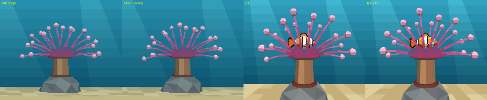

    **PASS.** Six clumps (back and front row × left, centre and right), each an anchored Mass-0 platform whose origin
    is its base on the oral disc, are rotated by the Director every tick: B = amp_b·sin φ in the X–Z plane and
    A = amp_a·sin(φ + ¼) toward and away from the glass, with φ = t/period + phase from a phase accumulator that
    advances by the engine's delta time, like the fish rig. Amplitudes 4.0–5.5° (B) and 1.2–1.5° (A); periods 3.05,
    3.30, 3.55, 3.90, 4.30 and 4.75 s (whole 20 Hz ticks, at least 0.25 s apart); phase offsets 0.00–0.89 rev. The
    trace hits every amplitude to 0.01°, repeats after exactly one period on every tick (0 odd ticks), has a mean
    under 0.003° over a period (net zero), and the pivots and `ROTATION_C` never move. Mailboxes 720–726. Player drift
    0.00000 m. Image: frame A cropped to the anemone at t0 and t0 + 1 s, then frame B at the same two times; the
    bases stay under the oral disc's rim in every frame, so nothing shears. The r = −0.94 line is information only:
    two clumps with 4.30 and 4.75 s periods happen to swing in antiphase over this 10 s window; they drift apart
    over the next minute.

17. Re-run the hosting and containment essentials on the changed (12 in, 18-tentacle) anemone and the steer-and-swim controller.
    Expected: the fish swims in with held buttons and rests in the crown, is not deflected, idles at full weight,
    the Player's `ROTATION_*` stay 0, every part stays within ~1 mm of its offset, and wall containment holds.

    ```
    $ python3 wflevels/aquarium/run_aquarium_checks.py            # steps 11, 15, 12, 13 in one run; paused, one tick per step, input injected every tick
    screenshot frame-a: /home/will/tmp/aquarium-phase4/phase4-frame-a.png
    screenshot idle: /home/will/tmp/aquarium-phase4/phase4-idle.png
    step 11: CAMSHOT 5 (cs_front = 5) → PASS
    step 15/5: hover 10 s: Player drift x/y/z 0.00000/0.00000/0.00000 m (limit 1 % of the water column = 0.04191); idle weight at end 1.000; tail yaw rel. body -0.0500..+0.0500 rev; body bob -12.0..+12.0 mm
    step 15/5: PASS
    screenshot phase4-facing-right: /home/will/tmp/aquarium-phase4/phase4-facing-right.png
    screenshot phase4-facing-left: /home/will/tmp/aquarium-phase4/phase4-facing-left.png
    screenshot phase4-dart: /home/will/tmp/aquarium-phase4/phase4-dart.png
    step 15/6: cruise (burst-and-coast, last 1 s of RIGHT): mean 3.047 m/s (V = 3.0479999999999996), peak 3.869; glide after release 1.348 m; dart (A tap, facing −x): peak 6.096 m/s, travelled 3.349 m, 0.004° off the facing it darted from → PASS
    step 15/7: body part heading after RIGHT +0.0114 rev, after LEFT -0.4862 rev (the tail-beat recoil swings it ±0.014); Player ROTATION_A/B/C over 455 ticks: max 0 → PASS
    step 12: host point (2.5, 0.0, 2.34) (oral disc top z 1.945)
    strip approach-and-rest: /home/will/tmp/aquarium-phase4/phase4-motion-approach-and-rest.png (10 frames, every 0.40 s)
    screenshot phase4-frame-b: /home/will/tmp/aquarium-phase4/phase4-frame-b.png
    phase     btn       s               start x,y,z                 end x,y,z
    to-left   LEFT   3.00    -1.662  -0.364   2.400    -5.544  -0.366   2.400
    into-crown nav    2.65    -5.544  -0.366   2.400     0.853  -0.131   2.400
    approach-and-rest -      4.00     0.853  -0.131   2.400     2.536  -0.131   2.400
    host      -      3.00     2.536  -0.131   2.400     2.536  -0.131   2.400
    step 12: entered the zone at (0.424, -0.131, 2.4), 2.094 m from the zone centre (radius 2.2)
    step 12: resting at (2.536, -0.131, 2.4) (host point (2.5, 0.0, 2.34)); on the way in the fish moved along its facing to 0.094° (pushed back inside the tank at [(-5.54, -0.37, 2.4), (-5.46, -0.01, 2.4)], none of it in the zone: True), so nothing deflected it; Player drift while hosting x/y/z 0.00000/0.00000/0.00000 m; idle weight 1.000; |pitch| while resting ≤ 0.00°
    step 12: CAMSHOT 32 (cs_anemone = 32); camera at (2.5, -2.5, 2.0) vs camshot B (2.5, -2.5, 2.0)
    screenshot b-reentry: /home/will/tmp/aquarium-phase4/phase4-b-reentry.png  fish at (1.967, -0.136, 2.4)
    step 12: zone flips (t, in-b, distance m): [(36.8, 0, 2.622), (40.9, 1, 2.114)] — leave at ≥ 2.5, enter at ≤ 2.2, one flip each way → PASS
    step 12: PASS
    screenshot phase4-wall-right: /home/will/tmp/aquarium-phase4/phase4-wall-right.png
    screenshot phase4-wall-left: /home/will/tmp/aquarium-phase4/phase4-wall-left.png
    screenshot phase4-wall-back: /home/will/tmp/aquarium-phase4/phase4-wall-back.png
    screenshot phase4-wall-front: /home/will/tmp/aquarium-phase4/phase4-wall-front.png
    screenshot phase4-wall-up: /home/will/tmp/aquarium-phase4/phase4-wall-up.png
    screenshot phase4-wall-down: /home/will/tmp/aquarium-phase4/phase4-wall-down.png
    phase     btn       s               start x,y,z                 end x,y,z
    right13   RIGHT  9.00     1.967  -0.136   2.400     5.544  -0.139   2.400
    left13    LEFT  12.00     5.544  -0.139   2.400    -5.544   0.377   2.400
    back13    C      7.50    -5.544   0.377   2.400    -5.560   1.099   2.400
    front13   B      7.50    -5.560   1.099   2.400    -5.642  -1.099   2.400
    up13      UP     9.00    -5.642  -1.099   2.400    -2.445  -0.931   4.331
    down13    DOWN   9.00    -2.445  -0.931   4.331     3.128  -0.417   0.993
    step 13: at the end of each hold: gap from the visible fish to the face it swam at, and time held there without moving: RIGHT 0.064 m 7.10 s, LEFT 0.064 m 7.25 s, C 0.064 m 6.10 s, B 0.064 m 5.65 s, UP 0.212 m 5.80 s, DOWN 0.178 m 6.00 s
    step 13: every visible part over the whole run, smallest gap to the left wall / right wall / front glass / back wall / sand / water line: 0.0635 0.0635 0.0635 0.0635 0.1702 0.1990 m
    step 13: PASS
    step 15: part attachment over 1956 ticks (turns at any yaw and pitch, banks, darts, walls, hosting): worst |part − body| − |offset| tail 0.55 mm, dorsal 0.21 mm, pec-near 0.21 mm, pec-far 0.22 mm; body vs Player horizontal 0.000 mm, vertical 12.00 mm (bob amplitude 12 mm) → PASS
    joystick1_raw seen by the engine vs injected, 1956 ticks: 0 mismatches []
    Player at the first recorded tick (-1.6, 0.0, 2.4) vs spawn (-1.6, 0.0, 2.4) → at spawn; unmapped desktop key events in the engine log: 0
    run isolation: CLEAN
    DO_ASSERTIONS = 1, NO_ASSERT_EXPR = 0, USE_INLINE_DEFS = 1, WF_BIG_ENDIAN = 0
    jolt: character 0 created at (-1.60, 0.00, 2.40) ctr=(0.00,0.00,0.00)
    SUMMARY step 5: PASS step 6: PASS step 7: PASS step 12: PASS step 13: PASS step 15: PASS
    ```

    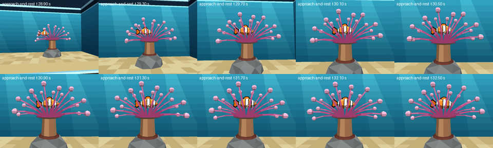

    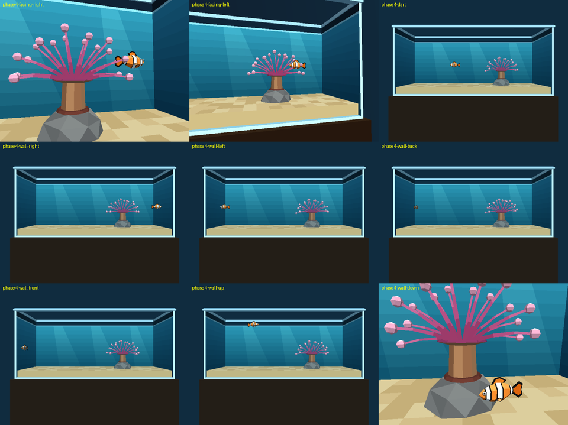

    Second image, left to right and top to bottom: facing right and facing left (camshot B: the fish passes the anemone), after a dart, then the fish stopped at the right wall, left wall, back wall, front glass, under the water line and over the sand (by the rock, in camshot B).

    **PASS.** Steps 11, 12, 13 and 15 re-run end to end on the Phase 4 level (replacing their Phase 3 evidence, which
    was for the old per-axis controller):

    - **12 hosting:** the harness steers like a player, holding every tick the buttons that point at the host point
      (2.5, 0, 2.34) and letting go when the glide would carry the fish there. It enters the zone 2.094 m from the
      centre, glides into the crown and rests at (2.536, −0.131, 2.400), level (|pitch| 0.00°), with Player drift
      0.00000 m while hosting and the idle at weight 1.000. On the way in its velocity stayed within 0.094° of its
      facing; the only two "pushes" (the script moving the body back inside after a turn swung the tail past a limit)
      happened at the left wall, none in the zone. Camshot B engages (`CAMSHOT` 32) and the camera reaches B exactly;
      hysteresis out at 2.622 m and in at 2.114 m, one flip each way. The strip is the approach and rest, 0.4 s apart:
      the bungee camera flies from A to B while the fish glides in and settles among the front tentacles.
    - **13 walls:** each direction held 7.5–12 s; the fish eases to a stop facing the wall and sits there 5.65–7.25 s
      without moving. The visible fish (every vertex of every part, posed as drawn) stops 0.064 m (0.25 in) off both
      end walls, the back wall and the front glass; Up alone and Down alone stop 0.212 m under the water line and
      0.178 m over the sand, because the wanted pitch flattens within 0.6 m of the surface and the sand (a dive
      levels out rather than hitting the floor). Over the whole run no part comes closer than 0.0635 m to any face.
    - **15:** hover drift 0.00000 m with the idle at full weight; cruise mean 3.047 m/s (V = 3.048), glide 1.348 m;
      the dart peaks at 6.096 m/s and travels 3.349 m, 0.004° off the facing it darted from; the Player's
      `ROTATION_A/B/C` read 0 on every tick; over 1956 ticks (turns at every yaw and pitch, banks, darts, walls,
      hosting) no part leaves its rigid offset by more than 0.55 mm (tail; the rest ≤ 0.22 mm), and the body sits on
      the Player to 0.000 mm horizontally and within the 12 mm bob vertically.

18. Cost before and after. Expected: the added actors and the sway cost no noticeable frame time; if they do, reduce
    the clump or tentacle count and say so.

    ```
    $ python3 wflevels/aquarium/run_aquarium_checks.py --cost <IFF …>   # --frame-step-smoke 100 vs 600 frames, vsync off, 3 runs each; Iris Xe (TGL GT2), display awake
    # 1) the 27-tentacle build (8 × 5 bulbs) and its variants: no sway script; the Phase 3 tank shell (no gradient)
    step 18: wflevels/aquarium_costns-standalone.iff: 30 actors; ms/frame over 3 runs [14.26, 14.36, 14.7] → median 14.36 ms
    step 18: wflevels/aquarium_costsh-standalone.iff: 30 actors; ms/frame over 3 runs [12.86, 13.26, 13.27] → median 13.26 ms
    step 18: /home/will/tmp/aquarium-phase4/phase3-baseline-standalone.iff: 25 actors; ms/frame over 3 runs [9.45, 9.65, 9.78] → median 9.65 ms
    step 18: wflevels/aquarium-standalone.iff: 30 actors; ms/frame over 3 runs [14.06, 14.49, 14.84] → median 14.49 ms
    # 2) the 27-tentacle build with its six tentacle meshes swapped for a box
    step 18: wflevels/aquarium_costtb-standalone.iff: 30 actors; ms/frame over 3 runs [9.1, 9.11, 9.31] → median 9.11 ms
    step 18: wflevels/aquarium-standalone.iff: 30 actors; ms/frame over 3 runs [14.28, 14.73, 14.92] → median 14.73 ms
    # 3) final: the 18-tentacle build (6 × 4 bulbs), against Phase 3, the 27-tentacle build and the box variant
    step 18: /home/will/tmp/aquarium-phase4/phase3-baseline-standalone.iff: 25 actors; ms/frame over 3 runs [9.56, 9.67, 9.68] → median 9.67 ms
    step 18: /home/will/tmp/aquarium-phase4/cost-27tentacles-standalone.iff: 30 actors; ms/frame over 3 runs [14.04, 14.31, 14.46] → median 14.31 ms
    step 18: /home/will/tmp/aquarium-phase4/cost-variants/aquarium_costtb-standalone.iff: 30 actors; ms/frame over 3 runs [8.6, 8.83, 9.29] → median 8.83 ms
    step 18: wflevels/aquarium-standalone.iff: 30 actors; ms/frame over 3 runs [10.94, 11.08, 11.51] → median 11.08 ms
    ```

    **PASS after a cut: the first Phase 4 build cost too much, and the cause was measured, not guessed.** The
    27-tentacle build ran at 14.3–14.7 ms per frame against Phase 3's 9.7 ms (+48 %), which is noticeable: on this
    laptop it left 2 ms of a 60 fps frame. Variants of that build, each changing one thing, located it: without the
    sway script 14.36 ms (the sway costs about 0.1 ms, noise level); with the Phase 3 tank shell (no gradient or
    shafts) 13.26 ms (the gradient costs about 1.2 ms); with the six tentacle meshes swapped for a box 9.11 ms. So the
    tentacle geometry was 5.6 ms, and 93 % of its faces were the bulbs (8 × 5 uv spheres, 40 faces each, 27 of them).
    The crown is now 18 tentacles (10 back, 8 front; the mockup draws about 16) with 6 × 4 bulbs (24 faces): 756
    triangles in the six clumps. Final: **11.08 ms per frame, +1.4 ms (+15 %) over Phase 3**, of which about 1.2 ms is
    the water gradient and the rest the bigger crown. The build exports 32 objects (the engine lists 30 actors), 20 of them meshes, 2830 triangles in all. The crown
    is still 11.6 in across (the test allows 12 in ±5 %), and steps 12–17, 19 and 20 were re-run on this build. No
    phone was measured.

19. Updated frame A and B next to the mockups. Expected: `phase4-vs-mockup.png`, and an honest list of what still
    differs.

    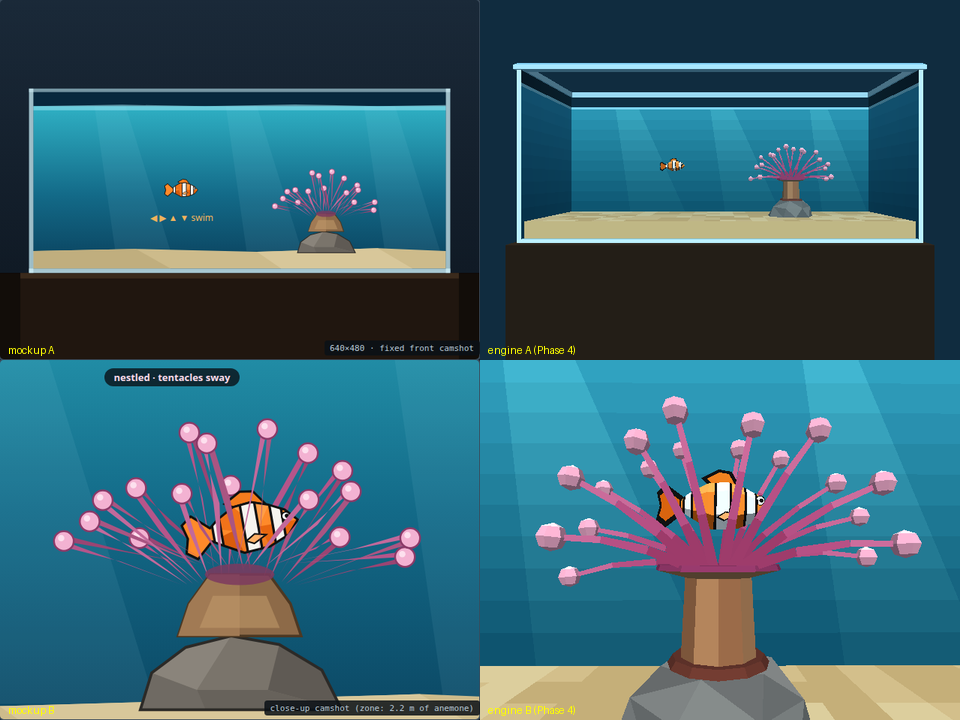

    **PASS, with differences.** Left the mockups, right the engine (frames from the step-17 run). Closer than Phase 3:
    the anemone is now a 12 in crown of 18 long tentacles with bulbs (was 7.5 in and stubby; 27 tentacles at first, cut
    for cost in step 18), the back wall has
    a vertical gradient and three light shafts, camera A is level from 1.9 m (the sand no longer fills the lower
    frame), and the fish's flank in frame B samples (251, 144, 46) against the mockup's #ff8a2a (255, 138, 42).
    What still differs:

    - **Framing of A.** Our tank sits about 30 px higher in the frame, with the stand filling the lower third; the
      mockup has the tank lower and more room above. Ours shows the end walls and the rim's inner ledge in
      perspective, the mockup draws them almost flat. The camera's field of view is fixed at 60°, so only its height
      and distance can move.
    - **Fish at camera A reads darker** than in B: (188, 99, 31) at 11 m, from the fog (about 15 % at that
      distance) and a small, anti-aliased silhouette.
    - **The anemone's shape.** Ours is a rounder burst (several tentacles near horizontal) on a taller, straight brown
      column, with hexagonal low-poly bulbs; the mockup fans about 16 tentacles upward from a squat cone, with larger,
      rounder bulbs.
    - **The fish in B sits among the tentacles.** Three front tentacles cross its body; the mockup shows it in front of
      the crown, fully visible. With 27 tentacles it was mostly hidden; the 18-tentacle crown shows most of it.
    - **Sand and rock.** The mockup's sand is a smooth light wedge and its rock a darker, outlined boulder; ours are
      flat-shaded quads and a grey hull.

20. Steering and motion: held buttons only, per-tick traces and motion strips. Expected: the velocity is along the
    facing on every tick (held and gliding) at the written speed; Up alone climbs along the pitched facing (so it
    also moves forward); reversing is an arc, not a flip; the pitch levels after release and never passes its clamp;
    burst-and-coast while cruising, with St = f·A/U in [0.2, 0.4] and f ∝ U; pectoral beats in [2.4, 4.6] Hz rising
    with speed; no jumps between ticks; every visible part inside the tank on every tick; the Player's
    `ROTATION_*` stay 0 and every part stays attached.

    ```
    $ python3 wflevels/aquarium/run_aquarium_checks.py --steer    # held buttons only; paused, one tick per step
    strip climb-right: /home/will/tmp/aquarium-phase4/phase4-motion-climb-right.png (10 frames, every 0.10 s)
    strip u-turn: /home/will/tmp/aquarium-phase4/phase4-motion-u-turn.png (10 frames, every 0.15 s)
    strip dive-left: /home/will/tmp/aquarium-phase4/phase4-motion-dive-left.png (10 frames, every 0.10 s)
    strip toward-glass: /home/will/tmp/aquarium-phase4/phase4-motion-toward-glass.png (10 frames, every 0.15 s)
    strip wall-approach: /home/will/tmp/aquarium-phase4/phase4-motion-wall-approach.png (10 frames, every 0.20 s)
    phase     btn       s               start x,y,z                 end x,y,z
    settle    -      1.50    -1.600   0.000   2.400    -1.600   0.000   2.400
    cruise-right RIGHT  1.00    -1.600   0.000   2.400     1.216   0.000   2.400
    climb-right UP     1.20     1.216   0.000   2.400     4.177   0.000   4.043
    level     -      1.50     4.177   0.000   4.043     4.945   0.000   4.264
    u-turn    LEFT   1.50     4.945   0.000   4.264     1.922  -0.811   4.264
    dive-left DOWN   1.20     1.922  -0.811   4.264    -1.270  -0.813   2.496
    level2    -      1.50    -1.270  -0.813   2.496    -2.654  -0.814   1.994
    toward-glass B      1.50    -2.654  -0.814   1.994    -2.922  -1.098   1.994
    stop      -      1.50    -2.922  -1.098   1.994    -2.922  -1.098   1.994
    away      C      1.50    -2.922  -1.098   1.994    -3.252   1.031   1.994
    cruise    RIGHT  2.50    -3.252   1.031   1.994     2.705   1.123   1.994
    wall-approach RIGHT  2.00     2.705   1.123   1.994     5.542   1.123   1.994
    rest      -      2.00     5.542   1.123   1.994     5.542   1.123   1.994
    step 20: 287 moving ticks; velocity vs the facing: worst angle 0.101° (pushed back inside the tank on 3 ticks, excluded); |v| vs the written speed: worst 0.0063 m/s
    step 20: climb (Up alone, facing +x): mean vz 1.429 m/s, horizontal 2.486 m/s, pitch up to 39.9° (limit 40°) → PASS
    step 20: dive (Down alone, facing −x): mean vz -1.537, vx -2.645 m/s, pitch down to -40.0° → PASS
    step 20: U-turn: |sin yaw| peaks at 1.000, y swept 0.810 m (an arc, not a flip); largest yaw step 22.5°/tick (limit 22.5) → PASS
    step 20: pitch back under 1° 0.7000029999999997 s after release; |pitch| never over 40.00° → PASS
    step 20: cruise: mean speed 2.974 m/s (3.35 BL/s), peak 3.869, low 1.770; bursts [0.2] s, coasts [0.3, 0.35] s; coast speed decays monotonically: True; tail envelope at the end of a coast ≤ 0.000 → PASS
    step 20: tail beat: St = f·A/U over the cruise 0.276..0.300 (A = 0.2 L = 0.178 m), f/U by speed band {0: 1.687, 1: 1.687, 2: 1.687} (spread 0.0 %), f 2.99..6.00 Hz, 6 ticks at the 6 Hz cap → PASS
    step 20: pectoral beat 2.40..4.60 Hz, rising with speed: True → PASS
    step 20: largest change of velocity between ticks 1.910 m/s (bound 2.19) → PASS
    step 20: every visible part, every tick: smallest gap to left/right/front glass/back/sand/water line 2.2259 0.0652 0.0644 0.1322 1.1685 0.2714 m → PASS
    step 20: Player ROTATION_A/B/C over 408 ticks: max 0 → PASS; parts vs body offsets worst tail 0.55 mm, dorsal 0.21 mm, pec-near 0.20 mm, pec-far 0.22 mm → PASS
    step 20: per-tick trace /home/will/tmp/aquarium-phase4/phase4-steer-trace.tsv
    trajectory plot: /home/will/tmp/aquarium-phase4/phase4-motion-trajectory.png
    joystick1_raw seen by the engine vs injected, 438 ticks: 0 mismatches []
    Player at the first recorded tick (-1.6, 0.0, 2.4) vs spawn (-1.6, 0.0, 2.4) → at spawn; unmapped desktop key events in the engine log: 0
    run isolation: CLEAN
    DO_ASSERTIONS = 1, NO_ASSERT_EXPR = 0, USE_INLINE_DEFS = 1, WF_BIG_ENDIAN = 0
    SUMMARY step 20: parallel PASS climb PASS dive PASS arc PASS level PASS gait PASS strouhal PASS pectoral PASS smooth PASS inside PASS player-rot PASS attached PASS
    ```

    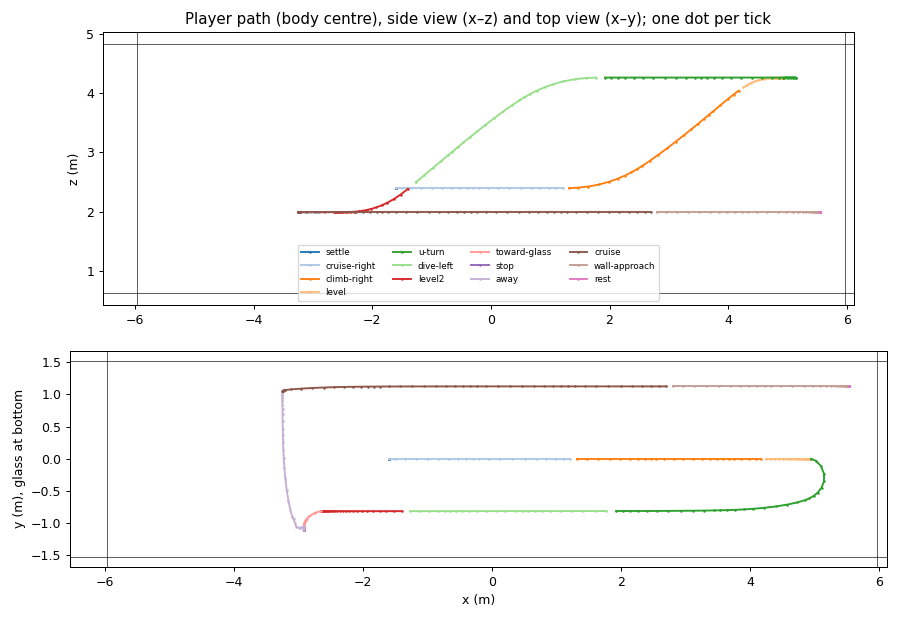

    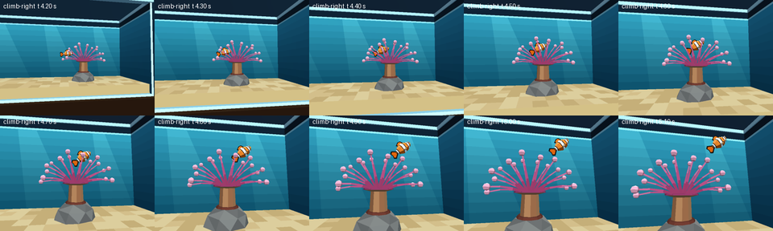

    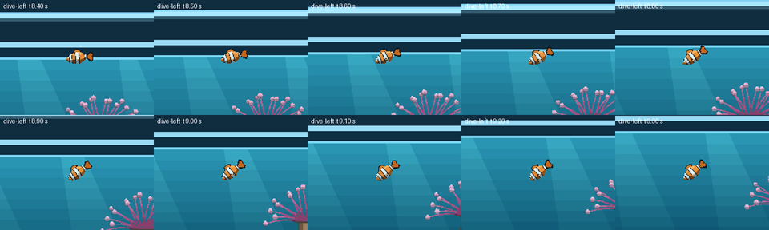

    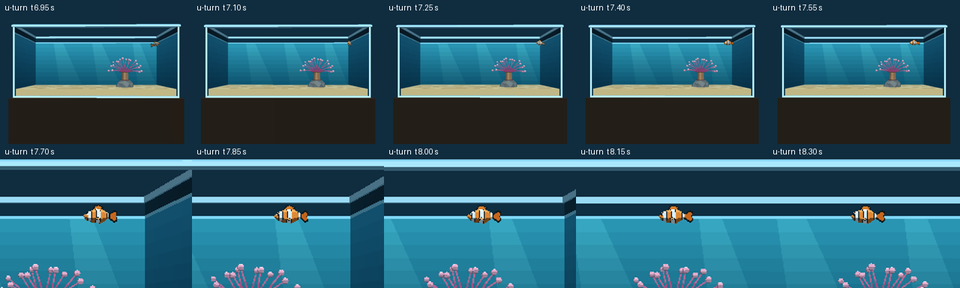

    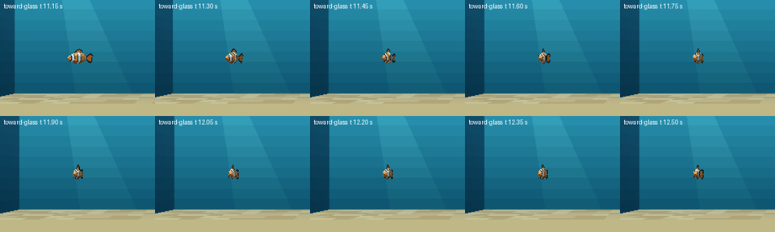

    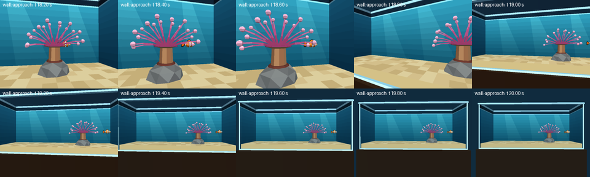

    **PASS.** From the engine trace (`phase4-steer-trace.tsv`, one row per tick): over 286 moving ticks the velocity
    is within 0.097° of the facing and within 6 mm/s of the written speed (the 3 ticks where a turn swung the tail
    past a limit and the script moved the body back inside are counted apart). Up alone facing +x climbs at 1.45 m/s
    while moving forward at 2.57 m/s, pitch 39.8° (limit 40°); Down alone facing −x dives at −1.54 m/s and −2.65 m/s.
    The U-turn passes through the side (|sin yaw| 1.000) and sweeps 0.81 m in y: an arc of about 0.4 m radius, at the
    yaw-rate cap of 1.25 rev/s (22.5° per tick). The pitch is back under 1° 0.70 s after release. Cruising, the gait
    is 0.20–0.25 s bursts and 0.30 s coasts (a 0.5 s cycle), mean 3.047 m/s = 3.43 BL/s, peak 3.925, low 1.967, and
    the coast decays monotonically with the tail straight (envelope 0.000). The tail beat's St runs 0.272–0.300 with
    f/U constant (1.687 s/m in every speed band, so f ∝ U exactly) and f 3.3–6.0 Hz; 7 ticks sit at the 6 Hz cap
    that keeps a beat under the 10 Hz Nyquist rate at 20 ticks/s. Pectorals 2.40–4.60 Hz, rising with speed. The
    largest change of velocity between ticks is 1.91 m/s (the bound is a burst's ease, 2.19). Every visible part
    stays inside the tank on every tick (closest: 0.064 m from the front glass and the right wall). Player
    `ROTATION_*` 0 on all 408 ticks; parts within 0.55 mm of their offsets.

    The strips, honestly: the climb reads as a fish swimming up and forward with its body tilted, and levels off in
    a curve (trajectory plot, orange then light orange), not a straight ramp; the dive mirrors it. The U-turn is a
    tight, quick arc (0.4 m radius in about 0.5 s), which looks brisk rather than lazy; a slower yaw cap would widen
    it. Swimming at the glass, the fish turns to face the camera and becomes a thin, foreshortened sliver that stops
    0.25 in from the glass; there is no pane, so nothing shows it touching. The wall approach eases to a stop facing
    the end wall. In the climb strip the camera is still flying between camshots A and B (the path crosses the
    anemone zone), which blurs the framing but not the motion. The engine log of this run holds one unmapped desktop
    key event (`ffe9`, Alt_L released: a window-focus change); the injected joystick matched on all 438 ticks, so
    it reached nothing.

    A real-time video of the same moves, recorded from a CLEAN injected run: `task video-aquarium`
    ([`tests/record_aquarium_motion_demo.py`](../../tests/record_aquarium_motion_demo.py)), written to
    `~/tmp/aquarium-phase4/motion-demo.mp4`, saved as [`tests/recordings/aquarium_phase4_motion_demo.mp4`](../../tests/recordings/aquarium_phase4_motion_demo.mp4): 33.9 s, 677 ticks, CLEAN; its segments and
    timestamps are listed in the Phase 4 verdict.

    Step 14 (touch) was re-run too, because the old Swim/Depth checks tested per-axis motion; its record is under
    step 14.

#### Phase 4 verdict

**Done: the anemone sways and is a 12 in crown, the water has a gradient and light shafts, camera A is level, the fish
reads orange, and the fish steers and swims only along its facing with a measured, biology-based gait; no engine
change.** Steps 16–20 pass, steps 12–15 were re-run on the new controller and anemone and pass, and 38 regression
tests pass (`tests/test_aquarium_level.py` 30, `tests/test_aquarium_idle.py` 8, runtime included). Open, and not
claimed: whether the motion *looks* natural is Will's call from the video; the touch profile has still never run on a
phone; and nothing was measured on a phone's GPU.

| Step | Result |
|---|---|
| 12 swim into the anemone, frame B (re-run) | PASS: held buttons only (steered like a player); B at 2.094 m; rests level in the crown, drift 0 |
| 13 every wall (re-run) | PASS: eases to a stop facing each wall, the visible fish 0.25 in off it; nothing ever closer than 0.0635 m |
| 14 touch profile (re-run) | **Logic verified, hardware unverified**: eleven steer-and-swim checks pass with injected buttons |
| 15 Phase 1 steps 5–7 (re-run) | PASS: drift 0, cruise 3.047 m/s, glide 1.35 m, dart along the facing, Player `ROTATION_*` 0, parts ≤ 0.55 mm |
| 16 sway trace | PASS: six clumps bounded, periodic, net zero, offset; pivots fixed; Player drift 0; frames differ |
| 17 hosting and containment on the new anemone | PASS (steps 12, 13, 15 above, one CLEAN run) |
| 18 cost | PASS after cutting the crown to 18 tentacles: 11.1 ms against Phase 3's 9.7 ms (the first build: 14.3) |
| 19 frames against the mockups | PASS, with the differences listed under step 19 |
| 20 steering and motion | PASS on all twelve checks: velocity ∥ facing to 0.1°, St 0.27–0.30, f ∝ U, gait, pectorals, arcs, clamps |

**Tuning values and the maths behind them** (lengths in body lengths L = 0.889 m where it matters; space is ×10,
time is not, so frequencies are real Hz):

- **Speed.** V = 3.048 m/s = 3.43 L/s (Phase 1's 12 in/s × 10). Burst-and-coast with a constant cycle of 0.5 s and a
  40 % burst: during a burst the speed eases toward 1.309 V = 3.99 m/s (τ 0.10 s), during a coast it decays (τ 0.5 s).
  1.309 is solved so the cycle's mean is V: measured 3.047 m/s, peak 3.93, low 1.97. Released: τ 0.45 s, glide
  ≈ 0.45 × U ≈ 1.35 m (Phase 1's glide). The dart eases to 6.096 m/s (`Max Air Speed`) in τ 0.05 s for 0.15 s.
- **Tail.** f = St·U/A with St = 0.3 and A = 0.2 L = 0.178 m peak-to-peak, so f = 1.687 U Hz: 5.1 Hz at V; the
  rig's tail yaw amplitude comes from A/2 over the tail's pivot-to-tip length (0.0697 rev). Capped at 6 Hz, because
  at 20 ticks/s a beat needs at least 3–4 ticks to show (Nyquist 10 Hz). Measured St 0.272–0.300 while cruising;
  during a dart the cap holds f at 6 Hz, so St falls to 6 × 0.178/6.1 = 0.18 there (outside 0.2–0.4, knowingly).
  The tail envelope switches on in a burst and the body is straight within about 0.2 s of a coast; a C-bend (tail
  yaw −0.05 s × yaw rate) makes the head lead a turn, and 20 % of the tail's yaw is fed back as body recoil.
- **Pectorals.** 2.4 Hz at rest rising linearly to 4.6 Hz at 1.2 V; alternating below 0.3 V, in phase above 0.9 V;
  they flare to brake (+0.09 rev) and fold while coasting.
- **Steering.** Yaw: rate' = ω²·err − 2ζω·rate with ω = 8 rad/s, ζ = 0.9, rate cap 1.25 rev/s (180° in about 0.5 s);
  pitch ω = 5 rad/s, ζ = 0.8, cap 0.40 rev/s (144°/s), pitch limit 40° (30° when a sideways direction is held too);
  bank up to 15° in proportion to the yaw rate; in a tight turn the burst dips by up to 25 %. Result: a U-turn is
  an arc of about 0.4 m radius; the pitch levels within 0.7 s of release.
- **Walls.** Speed ≤ room ahead ÷ 0.25 s along the facing (the fish eases to a stop); the wanted pitch flattens
  within 0.6 m of the sand and the surface; the visible box's half-width is 0.14 m (body 0.11 plus flare and beat).
- **Anemone.** 18 tentacles, crown 11.6 in (2.95 m), column 0.6 m, oral disc 1 m; sway B ±4–5.5°, A ±1.2–1.5°,
  periods 3.05–4.75 s, phases 0–0.89 rev (mailboxes 720–725; 726 is scratch).
- **Cameras and light.** A (0, −11, 1.9) aimed level; B (2.5, −2.5, 2.0) at `LookB` (2.5, 0, 2.0), leaning 35 %
  toward the fish; sun at 40° (was 65°), ambient (0.45, 0.50, 0.55); the fish's flank in B is (251, 144, 46) against
  the mockup's (255, 138, 42).

**Sources: what was opened, and what each constant rests on.** Opened and checked: Knight 2014, "Swimming fish stick
to same Strouhal number", JEB 217:2224 (summarising Nudds, John, Keen & Shiels 2014, JEB 217:2244–2249: fish in St
0.2–0.4, trout 0.19 rising to 0.22) — the St window is **verified**; Wu, Yang & Zeng 2007, JEB 210:2181–2191 (koi:
burst drag ≈ 4× coast drag, about 45 % energy saved; no single burst duration) — burst-and-coast is **verified** as a
gait, its timings are not; Marcoux & Korsmeyer 2019, JEB 222(4) (*A. ocellaris* pectoral beats 2.4 → 4.6/s with
swimming intensity, in an oscillating surge) — the pectoral range is **verified** for this species, in those
conditions; Hale, Day, Thorsen & Westneat 2006, JEB 209:3708–3718 (damselfish, 12 species, no clownfish; gait switch
1.87–4.95 BL/s) — used only as a **hint** for the alternating → synchronous switch. **Not opened:** Li et al. 2021
(Commun. Biol. 4:40, constant cycle, variable burst share: as reported by the orchestrator, unverified), the "A ≈ 0.2 L"
and "wavelength ≈ one body length" figures (widely cited, unverified), Rohr & Fish 2004 (cetaceans; not used for a
constant), Tu & Terzopoulos 1994 (only the layering idea). Each constant in `aquarium_constants.py` and `clownfish.py`
carries one of these labels: verified, unverified or ours.

**Adopted and rejected.** Adopted: St = 0.3 (the middle of the verified window; the maths gives f = 5.1 Hz at V, which
the tick rate can just show); A = 0.2 L (unverified, but it puts St in the window at the speeds used); the *A.
ocellaris* pectoral range; burst-and-coast with a constant cycle. Rejected or changed: the brief's 0.3–0.5 s event
length as a fixed burst time (unverified; a constant 0.5 s cycle with a 40 % burst gives 0.20–0.25 s bursts and
0.30 s coasts); a tail beat above 6 Hz (it would alias at 20 ticks/s); "pitch follows velocity" and a vertical creep
(superseded by Will's rule that a fish never moves perpendicular to its facing); the engine's air drag for the glide
(set to 0, the script owns the speed, so the coast can decay slower than a burst eases up, as the drag ratio in Wu et
al. says it should). **Measured disagreement with how it looks:** the U-turn at the yaw cap is brisk, a 0.4 m arc in
half a second, quicker than a relaxed clownfish; the numbers do not forbid it, and a lower cap would widen it.

**Deviations from the brief, each with its reason:**

1. **Steer and swim replaces the per-axis controller** (Will's correction: a fish never moves perpendicular to its
   facing). Phase 1's "write ±V to the held axis" and the Phase 3 clamp numbers are gone; the limits turn with the
   fish. Steps 12–15 were re-run rather than left standing.
2. **The Player's air drag is 0.** The script writes the whole speed every tick, including the glide, so the gait's
   burst, coast and glide time constants are the script's, not the engine's.
3. **Mailboxes 740–759** hold the steering state (yaw, pitch, roll, their rates, speed, the gait cycle, the limits).
   The brief gave 700–719 to the level and 720–739 to the sway; the level's twenty were full.
4. **The crown is 18 tentacles with 24-face bulbs, not 27 with 40-face bulbs**, for the frame cost (step 18).
5. **Camera A was already level.** Phase 3's "looks slightly down" was the 3 m-deep sand floor seen from 2 m above
   it; Phase 4 lowered the eye to 1.9 m and kept the level aim, which is the only thing that removes it.
6. **The harness steps one engine tick per bridge step.** The engine sends each tick's watched mailboxes in hash
   order (`debug_server.cc` `gWatches`), so with several ticks per step some keys landed in the wrong tick (it showed
   up on the sway trace as a repeated value, then a double step).

**Residuals, not blocking:** the steer trace's cruise numbers differ by up to 2.5 % between CLEAN runs (mean 2.974 or
3.047 m/s; climb vz 1.429 or 1.454 m/s) — both pass every check, and the cause was not established (the runs took
over one tick apart, t0 1.60 or 1.65 s); pushed into the rock or the column, the fish still slides up and over it
(Phase 3); the touch mode has no on-screen indicator. Found on the way: a blanked screen (DPMS off) paces the engine at
one frame a second under Xwayland, which made two `test_aquarium_idle.py` runtime tests time out at 18:17; with the
screen woken and held on (`kscreen-doctor --dpms on`, `kde-inhibit`) all 38 pass, and `--cost` now refuses to run on a
blanked screen.

**Demo video** (real time, 640 × 480, a CLEAN injected run; saved as [`tests/recordings/aquarium_phase4_motion_demo.mp4`](../../tests/recordings/aquarium_phase4_motion_demo.mp4), scratch copy `~/tmp/aquarium-phase4/motion-demo.mp4`) (33.9 s, 640 × 480, 20 frames of level time per second encoded at 30 fps, captions burnt in, plus `.srt` and `.txt`; 677 ticks, `run isolation: CLEAN`). Segments (mm:ss):

- 00:00.00–00:02.00 — Hover: no input: the idle — a small bob, pectorals sculling, the anemone swaying
- 00:02.00–00:04.20 — U-turn left: Left: the fish turns in an arc (head first, banking) and swims off along its facing
- 00:04.20–00:07.30 — Cruise across: Right: U-turn back, then burst-and-coast across the tank; release = glide
- 00:07.30–00:09.90 — Climb facing right: Up alone while facing right: it climbs FORWARD at the 40° pitch limit, then levels on release
- 00:09.90–00:13.70 — Dive facing left: Left (arc), then Down alone: a forward dive at the pitch limit, levelling on release
- 00:13.70–00:16.30 — Toward the glass: B: turns to face the camera and swims to the glass, easing to a stop before it
- 00:16.30–00:19.10 — Away from the glass: C: turns (toward the centre line, never into the glass) and swims to the back
- 00:19.10–00:25.70 — Into the anemone: arrows + B/C toward the crown; camshot B takes over in the zone; it rests level among the swaying tentacles
- 00:25.70–00:29.20 — Wall approach: Right out of the crown to the end wall: it eases to a stop facing the wall (camera back to A)
- 00:29.20–00:32.35 — Turn and dart: Left to turn away from the wall, then an A tap: a dart along the facing, then the glide
- 00:32.35–00:33.85 — Hover: no input again: the idle fades back in

Whenever the fish's path passes within 2.2 m of the anemone (the climb, the dive, the dart), camshot B takes over and the bungee camera flies there and back, so those segments are partly seen close up.

## Regression guard

`tests/test_aquarium_level.py`, in the same commit as the level, reading `aquarium_constants.py`:

- the exported shell's bounding box is 48 × 13 × 21 in at the current `WORLD_SCALE`;
- water-line volume computed from the constants is 45.2 gal ±1 % (so a stray edit to a dimension is caught);
- ~~the pane texture's texels have bit 15 set and the file is 16-bit (E8: a 32-bit RGBA save would silently turn every texel into a cut-out)~~ —
  **dropped for Plan B** (there is no pane). Replaced by: no `tank-front-pane` or `water-surface` exists, and
  `tank-front-collider` is invisible;
- exactly one `Player`, one `anemone`, one `anemone-zone` (a `target`); no snowgoons-derived actor or mesh names remain;
- added from Phase 1: `Player` precedes `tank-shell` in actor order, and its bbox is symmetric in X and Y and at least
  0.25 m on every axis; the fog is `FOG_COLOR` (not snowgoons' grey) and completes before 1000 m.

- added in Phase 3 (19 tests in all): the scale and the fish's length have one source (`clownfish.py` agrees with
  `aquarium_constants.py`); `Player`, then the five parts, then `tank-shell` in actor order; the `Player` is the
  invisible `Physics` hull running `aq-player-tick`, and its script never writes its own `ROTATION_C`; the parts are Mass-0
  anchored platforms with no script, never statplats; no placeholder mesh or code remains; the Director runs
  `fish-rig-tick` then `aq-camera-tick`, and its part, camshot and `LookB` indices equal export position + 1; the level's
  mailboxes are 700–719; camshots A and B are outside the tank, and B's `Camera` box stays clear of the fish; the zone's
  centre and radius match `anemone-zone`, with a hysteresis band; the clamps follow from the fish's `extents()`; the
  anemone body collides and its tentacles do not; the infrastructure actors are Mass 0. The runtime behaviour (steps 11–15)
  is `run_aquarium_checks.py`.

- added in Phase 4 (30 tests in all, two of them runtime): the tentacles are six non-colliding Mass-0 clumps whose pivots are their bases on the oral disc, created after the Player; the crown is `ANEMONE_SPAN` wide; no statplat sits inside the swim volume but the tank's own; the sway is generated for every clump in 720–739; camera A is level and frames the tank; the Player's air drag is 0 and the only velocity write is speed × facing (`aq-swim-write`; `aq-no-kick` only puts back the script's own last value); nobody writes the Player's `ROTATION_*`; the steering and gait constants keep their physics (pitch slower than yaw, damped at most critically, a climb never vertical) without pinning a tunable; the rig's maths follows the biology (Python mirror: St ∈ [0.2, 0.4], f ∝ U, A = 0.2 L, pectorals 2.4–4.6 Hz rising with speed, parts attached at any yaw, pitch and roll); and at runtime the sway is bounded, periodic and net zero and never moves the Player, and a held-button sequence moves only along the facing, climbs forward, levels after release and stays inside the tank.

The test reads the committed `wflevels/aquarium/aquarium.lev`. After changing the build script, run
`task aquarium-level` before the test.

## Risks and open questions

| Risk | Consequence | Mitigation |
|---|---|---|
| Translucent draw order (§ 3) | Pane hides the fish | **Happened (Phase 0):** opaque today (shader drops alpha), order-dependent once alpha is restored. Plan B unless the engine change is approved |
| Gravity-free `CharacterVirtual` drifts or sticks | Fish sinks or floats | **Retired (Phase 1):** 0 drift in 10 s at ×10. Residual: wall push-off ≤ 0.35 m after a slide, bounded by the script clamps |
| Jolt's character is a walker even with no gravity | A floater near a floor is "standing"; contacts stair-step it and the inferred velocity launches it | **Happened (Phase 3):** 7 m/s off the rock. Fixed in the script: a floor clamp 0.15 m of ground clearance, and no uncommanded acceleration. Residual: one 0.4 m walk-stairs step when pushed into the rock or the column |
| Tiny capsule misbehaves at ×1 | Jitter or tunnelling | **Happened, worse (Phase 1):** at ×1 the fish is a 25 cm ball (levcomp's 0.25 m minimum span) and a smooth mesh will not load. ×10 chosen. At ×10 the real fish's ½ in thickness still hits the 0.25 m rule, so author a symmetric `wf_original_bbox` |
| `ROTATION_C` writes ignored | Fish swims backwards | **Retired (Phase 1):** writes turn the mesh (revolutions). The capsule does not turn, so the nose enters the end walls; clamp X in the script |
| Anemone sway shears or costs frames | Visual glitch | It is Phase 4 and optional; v1 is static. **Happened in part (Phase 4):** no shear (every clump pivots at its base under the oral disc's rim; step 16), but the first 12 in crown (27 tentacles, 40-face bulbs) cost 5.6 ms a frame (+48 %); cut to 18 tentacles with 24-face bulbs, the level runs at 11.1 ms against Phase 3's 9.7 ms on this laptop (step 18). A phone is unmeasured |
| Real fish is multi-part but Phase 1 tuned a single actor | Parts lag or shear against the body; controls feel different | Phase 3 re-validates on the real fish (step 15); parts are driven from one place with the body's own heading. **Retired (Phase 3):** every part stays within 0.55 mm of its offset over 2646 ticks, and the controls measure the same as Phase 1 (cruise 2.743 m/s, exact clamps) |
| Any of the above needs an engine change | Scope grows | **Stop and escalate**; do not patch the engine inside this plan |

**Assumed, not asked (say so if wrong):** the player *is* the clownfish, rather than a fixed viewer; both are scripted from
existing controls; acrylic is a pale cyan edge tint, not a specific brand's look.

**Out of scope:** more fish, feeding, audio, bubble particles, a lid or a stand model, and photoreal caustics. Cost
breakdown: none — no infrastructure or paid service is involved.

## Delegation

| Phase | Tier | Why |
|---|---|---|
| 0, 1 | T4 | Unknown root outcomes; a wrong turn costs a redesign |
| 2, 3 | T3 | Multi-file against this plan once 0 and 1 have settled it. Phase 3 also needs the idle-animation spike (canonical fish) merged first |
| 4 | T2 | Bounded, optional |
| Final integration and review | T5 | Whole-session judgment |
