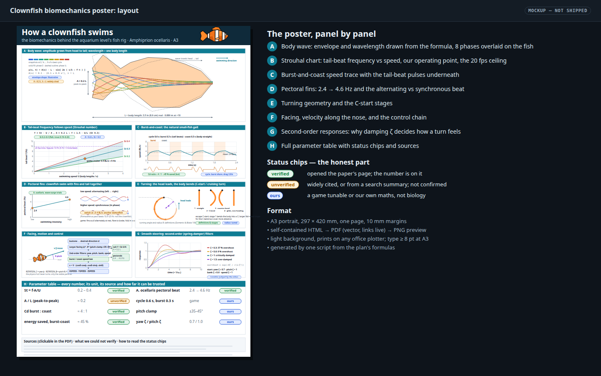
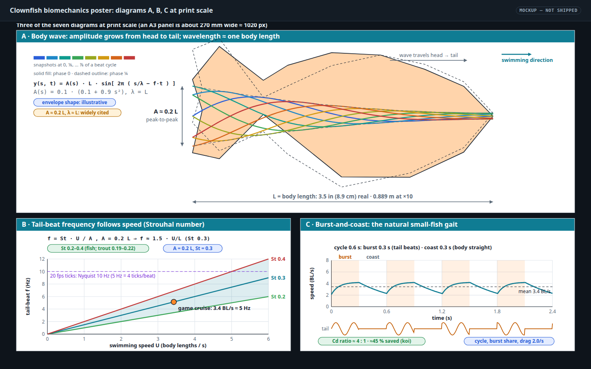

# Clownfish biomechanics poster (A3)

Status: **built (Phases A–D); verification steps 1–9 pass, step 10 (a print on paper) is not done.** The poster is in
[`docs/reference/clownfish-biomechanics-poster/`](../reference/clownfish-biomechanics-poster/poster.png) (`poster.pdf` is the
artifact; `task poster-clownfish-biomechanics` rebuilds it). The mockups below are the proposals it was built from and show the
**pre-Phase 4 gait** (0.6 s cycle, 0.08 s rise, 2.0 s⁻¹ decay): the built poster follows the merged code, which is the
authority, and this plan's numbers were corrected to match it on 2026‑09‑30.

Will asked for "all of this biomechanical fish data/parameters made into a poster (let's say A3-sized) along with diagrams".
The data is the research behind the aquarium level's swimming and steering (see
[the aquarium plan](2026-09-30-aquarium-level.md) § 4, and the Phase 4 motion work). The poster gathers it in one place, in
a form that can be printed, pinned up and argued with: numbers, formulas, diagrams, sources, and — most importantly — an
honest label on every number saying whether it was checked.

- [x] Phase A — data sheet: every number, unit, source and status, in one machine-readable file (`data.py`, resolved to `data.json`)
- [x] Phase B — generator: one script renders the seven diagrams and the table to A3 HTML (`make_poster.py`)
- [x] Phase C — print: PDF (one A3 page, live links) and PNG preview
- [x] Phase D — checks: page size, links, contrast, and the poster's numbers versus the game's constants (steps 1–9; the paper print, step 10, is still open)

## Mockups

Both are 1440×900 live HTML with a same-name PNG, generated by
[`2026-09-30-clownfish-biomechanics-poster-mockups.py`](2026-09-30-clownfish-biomechanics-poster-mockups.py) (`--help` for the PNG
render command). The curves (traveling wave, Strouhal lines, burst-and-coast trace, damped step responses) are computed, not
drawn.

[](2026-09-30-clownfish-biomechanics-poster/poster-layout.html)

[](2026-09-30-clownfish-biomechanics-poster/diagram-detail.html)

States shown: the full page, three diagrams at print scale, and the three status chips (verified, unverified, ours). Print
versus screen is one rendering: the poster is light on white and the mockup frames are dark only because they are mockups.

## What goes on the poster

| Panel | Content | Data it needs |
|---|---|---|
| **A** Body wave | Fish outline deformed by a traveling wave, eight phases overlaid, amplitude envelope, L, A, λ | `y(s,t) = A(s)·L·sin[2π(s/λ − f·t)]`, `A(s) = 0.1·(0.1 + 0.9 s²)`, λ = L |
| **B** Strouhal | Tail-beat frequency against speed for St 0.2, 0.3, 0.4; the game's operating point; the 20 fps ceiling | `f = St·U/A`, A = 0.2 L, so `f = 5·St·U/L` |
| **C** Burst-and-coast | Speed against time for four cycles, burst shading, mean line, tail-beat trace underneath (continuous and as the engine samples it at 20 ticks/s) | A mirror of `aq-gait` (`aquarium_swim.fth`) with the constants from `aquarium_constants.py`: constant 0.5 s cycle, 40 % burst, burst target 1.309·V (mean = V), burst τ 0.10 s, coast τ 0.5 s, glide τ 0.45 s; the tail from the rig's own `RigState` |
| **D** Pectoral fins | Beat frequency 2.4 → 4.6 Hz against the game's speed; alternating against synchronous traces; the damselfish switch range as a bar | *A. ocellaris* figure (in an oscillating surge); gait switch from another species; the game's 0.3 V and 0.9 V thresholds |
| **E** Turning | A cruising U-turn (radius R = V / 2π·ω, head leads) at the scale of one body length; the four C-start stages | Definitions only; R is a game measurement (≈ 0.4 m; 0.39 m from the constants), not biology |
| **F** Facing and control | Yaw, pitch, roll and velocity along the nose; the control chain from buttons to speed mailboxes | The game's `ROTATION_A/B/C` and speed mailboxes |
| **G** Damped steering | Step responses for ζ = 0.3, 0.6, 1.0, 1.5 (illustrations) and the game's own yaw ζ = 0.9 and pitch ζ = 0.8, with overshoot | Overshoot = `exp(−πζ/√(1−ζ²))`; yaw ω 8 rad/s, pitch ω 5 rad/s |
| **H** Table | Every quantity on the poster, with unit, value, source and status chip | The data sheet (Phase A) |
| Footer | Clickable sources; what could not be verified; how to read the chips | — |

Scale note printed on the poster: the level is ×10 in **space** and real in **time**, so every speed is written in body
lengths per second and every frequency in hertz. The fish is 3.5 in (8.9 cm) real, 0.889 m in the level, and the level's
cruise speed of 3.048 m/s is 3.4 body lengths per second.

## Provenance: what is verified, and what is not

The sources actually opened and checked (by the orchestrator, 2026‑09‑30) are exactly four: **Knight 2014** (summarising Nudds et
al. 2014), **Wu, Yang & Zeng 2007**, **Marcoux & Korsmeyer 2019** and **Hale et al. 2006**. Everything else is *unverified*, and
everything the game chose is *ours*. This table was corrected on 2026‑09‑30 against that list and against the code's own labels:
the first draft called Li et al. 2021, Domenici & Blake 1997, Tu & Terzopoulos 1994 and the Animal Diversity Web page
"verified", used Rohr & Fish 2004 (cetaceans) for a context row, and carried the pre-Phase 4 gait numbers. The build reads each
constant's label (verified / unverified / ours / hint) from its comment in `aquarium_constants.py` and `clownfish.py`, and the
test fails if a chip disagrees.

| Quantity | Value | Status | Source |
|---|---|---|---|
| Strouhal number in swimming fish | 0.2 – 0.4; rainbow trout 0.19 at the lowest speed rising to 0.22 | **verified** | Nudds, John, Keen & Shiels 2014, *JEB* 217:2244–2249, via [Knight's summary, *JEB* 217:2224](https://journals.biologists.com/jeb/article/217/13/2224/12210/Swimming-fish-stick-to-same-Strouhal-number). The primary paper has no URL in the repo: printed as text with a "link missing" marker |
| Tail excursion A ≈ 0.2 L, wavelength ≈ L | as stated | **unverified** | Widely cited; no primary source was identified or opened. The paper titled [Optimal Strouhal number for swimming animals](https://www.researchgate.net/publication/48199542_Optimal_Strouhal_number_for_swimming_animals) could not be opened (HTTP 403); its authors and year are unconfirmed, so the poster does not cite it |
| Drag during burst against coast | C<sub>d</sub>,burst 0.242 ≈ 4 × C<sub>d</sub>,coast 0.060 | **verified** (koi carp) | Wu, Yang & Zeng 2007, *JEB* 210(12):2181–2191, [Kinematics, hydrodynamics and energetic advantages of burst-and-coast swimming of koi carps](https://journals.biologists.com/jeb/article/210/12/2181/16867/Kinematics-hydrodynamics-and-energetic-advantages) |
| Energy saved by burst-and-coast against steady swimming | nearly 45 % | **verified** (koi carp) | same paper; it gives **no single burst duration**, so the game's timings are not verified |
| Cycle duration kept constant while the burst share sets the speed | qualitative | **unverified** | Li, Ashraf, François, Kolomenskiy, Lechenault, Godoy-Diana & Thiria, *Communications Biology* 4:40 (2021), [preprint](https://arxiv.org/abs/2002.09176): reported to the orchestrator, not opened |
| Length of a burst-and-coast event, "0.2–0.4 s" | — | **unverified** | A search summary; not used. The game's 0.5 s cycle and 40 % burst are **ours** |
| *A. ocellaris* pectoral beat frequency | 2.4 → 4.6 Hz as swimming intensity rose | **verified**, with a caveat | Marcoux & Korsmeyer 2019, *JEB* 222(4), [Energetics and behavior of coral reef fishes during oscillatory swimming in a simulated wave surge](https://journals.biologists.com/jeb/article/222/4/jeb191791/20856/Energetics-and-behavior-of-coral-reef-fishes): measured in an oscillating surge, not steady swimming; the poster's chip says so |
| Pectoral gait switch, alternating to synchronous | 1.87–4.95 BL/s across 12 species | **other species** | Hale, Day, Thorsen & Westneat 2006, *JEB* 209(19):3708–3718, [Pectoral fin coordination and gait transitions in steadily swimming juvenile reef fishes](https://journals.biologists.com/jeb/article/209/19/3708/16341/Pectoral-fin-coordination-and-gait-transitions-in). Damselfish; *A. ocellaris* was **not** studied there. Used only as a hint for the game's alternating → synchronous thresholds |
| Turning angle, turning radius, C-start and S-start | definitions and stages | **unverified** | Domenici & Blake 1997, [The kinematics and performance of fish fast-start swimming](https://www.researchgate.net/publication/13904905_The_Kinematics_and_Performance_of_Fish_Fast-Start_Swimming): not opened. No clownfish turn radius was found; the poster's radius is **ours** and is described as a game measurement |
| Layering of motor (kinematic wave) and steering (behaviour) | qualitative, the idea only | **unverified** | Tu & Terzopoulos 1994, [Artificial Fishes: Physics, Locomotion, Perception, Behavior](https://faculty.cc.gatech.edu/~turk/bio_sim/articles/fish_terzopoulos.pdf): not opened; never used for a number |
| Envelope shape, cycle 0.5 s, 40 % burst, burst target, τ burst / coast / glide, tail cap 6 Hz, pectoral speed range, yaw / pitch ω, ζ and rate caps, pitch limits, bank, wall easing, C-bend, recoil | game values | **ours** | Read from `aquarium_constants.py` and `clownfish.py`; the Phase 4 motion video is the judge, not this poster |

Not used: Rohr & Fish 2004 (cetaceans). The Animal Diversity Web page is not used either: the poster no longer states that
clownfish swim with fins and tail together.

**Rule for the poster:** a chip is printed next to every number. "Verified" means one of the four sources above was opened and the
number is on its page. Anything from a search summary, or from a source nobody opened, is "unverified"; anything measured in
another species is "other species"; anything the game chose is "ours". When unsure, "unverified".

## Format and production

- **Page:** A3 portrait, 297 × 420 mm, one page, 10 mm margins, `@page { size: A3 portrait; margin: 0 }`. Portrait is an
  assumption (Will said only "A3-sized"); landscape is a layout change, not a rewrite.
- **Look:** white paper, dark ink, the mockup's teal panel bars, print-safe colours. Body text at least 8 pt at A3, panel
  titles 12 pt, headline 36 pt. No dark mode: it is a printed object.
- **Diagrams:** inline SVG, generated, seven of them, in the same style as the mockups. Every curve is computed from the
  formulas above by the generator, so a changed constant redraws the picture.
- **Files** in `docs/reference/clownfish-biomechanics-poster/`: `make_poster.py` (generator), `data.py` (the data sheet:
  quantity, value, unit, source, status chip, and the code symbol an "ours" value is read from), `data.json` (the same sheet,
  resolved), `poster.html`, `poster.pdf`, `poster.png` (150 dpi). The HTML is self-contained. The PDF is rendered by
  `google-chrome --headless=new --no-sandbox --print-to-pdf --no-pdf-header-footer` from the same HTML, so text stays vector and
  every source is a live link. Tests: `tests/test_poster_clownfish_biomechanics.py` (`task test-poster-clownfish-biomechanics`).
  Chrome writes A3 as 841.92 × 1191.12 pt, not 841.89 × 1190.55 pt (it rounds the page to whole CSS pixels); `pdfinfo` still
  reports "A3" and the check allows 1 pt.
- **Task:** a `poster-clownfish-biomechanics` entry in `Taskfile.yml`, with `sources` and a `status` check, so the poster
  rebuilds when the data or the generator changes and is a no-op otherwise.
- **Writing rules from the repo guide:** times in 24-hour form; number-and-unit pairs and ISO dates kept unbreakable with
  non-breaking spaces and hyphens; no heading stranded at the foot of a page; every URL is a real link.
- **Tie to the game:** the "ours" values in panel H and the diagrams are **read from**
  `wflevels/aquarium/aquarium_constants.py` and `wflevels/aquarium/clownfish.py` (the gait, steering and scale constants live in
  the first, the tail, pectoral and tail-envelope tunables in the second; the tick rate is parsed from `run_aquarium_checks.py`),
  so the poster cannot drift from the fish it describes. If a constant there changes, the poster's table changes on the next
  build, and a test fails if the two disagree. Each constant carries a verified / unverified / ours / hint label in its comment;
  the chip in the data sheet must be one of the labels in that comment, and a doctored chip is reported (`label_problems`).

## Verification

Steps are the spec; the output is the evidence. Run 2026‑09‑30 in the worktree branch, Chrome 154, poppler 26.01, Task 3.53.

1. `task poster-clownfish-biomechanics` builds `poster.html`, `poster.pdf` and `poster.png` with no manual step, and is a no-op on the second run. Expected: exit 0, "up to date" the second time.

```
task: [poster-clownfish-biomechanics] python3 docs/reference/clownfish-biomechanics-poster/make_poster.py
wrote /home/will/WorldFoundry-wbniv/.claude/worktrees/agent-a5f6e991caf1f8c8c/docs/reference/clownfish-biomechanics-poster/poster.html (92 KB), 46 rows
wrote /home/will/WorldFoundry-wbniv/.claude/worktrees/agent-a5f6e991caf1f8c8c/docs/reference/clownfish-biomechanics-poster/poster.pdf, /home/will/WorldFoundry-wbniv/.claude/worktrees/agent-a5f6e991caf1f8c8c/docs/reference/clownfish-biomechanics-poster/poster.png
exit=0
--- second run
task: Task "poster-clownfish-biomechanics" is up to date
exit=0
```

   **PASS.** (The outputs were deleted before the first run.)

2. `pdfinfo poster.pdf`. Expected: one page, 841.9 × 1190.6 pt (A3 portrait, 297 × 420 mm).

```
Title:           How a clownfish swims: biomechanics poster (A3)
Creator:         Mozilla/5.0 (X11; Linux x86_64) AppleWebKit/537.36 (KHTML, like Gecko) HeadlessChrome/154.0.0.0 Safari/537.36
Producer:        Skia/PDF m154
CreationDate:    Wed Sep 30 19:17:24 2026 +07
ModDate:         Wed Sep 30 19:17:24 2026 +07
Custom Metadata: no
Metadata Stream: no
Tagged:          yes
UserProperties:  no
Suspects:        no
Form:            none
JavaScript:      no
Pages:           1
Encrypted:       no
Page size:       841.92 x 1191.12 pts (A3)
Page rot:        0
File size:       286530 bytes
Optimized:       no
PDF version:     1.4
```

   **PASS, with a 0.5 pt deviation.** One page, A3; Chrome makes the page 841.92 × 1191.12 pt (420.2 mm) whatever `@page` size is
   written (tried `A3 portrait`, `297mm 420mm`, `841.89pt 1190.55pt`, `1122.52px 1587.4px`: all give 1191.12), so the check allows 1 pt.

3. `pdffonts poster.pdf`. Expected: every font embedded; no bitmap text.

```
name                                 type              encoding         emb sub uni object ID
------------------------------------ ----------------- ---------------- --- --- --- ---------
AAAAAA+NotoSans-Bold                 CID TrueType      Identity-H       yes yes yes      4  0
BAAAAA+NotoSans-Regular              CID TrueType      Identity-H       yes yes yes      5  0
CAAAAA+NotoSans-Bold                 CID TrueType      Identity-H       yes yes yes      6  0
DAAAAA+NotoSans-Bold                 CID TrueType      Identity-H       yes yes yes     10  0
EAAAAA+DejaVuSans-Bold               CID TrueType      Identity-H       yes yes yes     11  0
FAAAAA+NotoSans-Bold                 CID TrueType      Identity-H       yes yes yes     15  0
GAAAAA+DejaVuSans                    CID TrueType      Identity-H       yes yes yes     17  0
HAAAAA+NotoSansMono-Bold             CID TrueType      Identity-H       yes yes yes     18  0
IAAAAA+NotoSansMono-Regular          CID TrueType      Identity-H       yes yes yes     19  0
JAAAAA+DejaVuSans-Bold               CID TrueType      Identity-H       yes yes yes     30  0
```

   **PASS.** Ten fonts, all `emb yes`, all CID TrueType subsets (Noto Sans, Noto Sans Mono; DejaVu Sans only for glyphs Noto lacks). No image fonts, no Type 3.

4. Count link annotations in the PDF (`pdftotext`-based or a small Python check). Expected: at least one live link per source in the footer, and none broken (each URL resolves to the same string as in the data sheet).

   Small Python check (`pypdf`, the `/Link` annotations of page 1 against `data.SOURCES`; also `test_pdf_links_are_the_sources_and_nothing_else`):

```
link annotations in the PDF: 7
  S1: 1 live link(s), URI == data sheet: True  https://journals.biologists.com/jeb/article/217/13/2224/12210/Swimming-fish-stick-to-same-Strouhal-number
  S3: 1 live link(s), URI == data sheet: True  https://journals.biologists.com/jeb/article/210/12/2181/16867/Kinematics-hydrodynamics-and-energetic-advantages
  S4: 1 live link(s), URI == data sheet: True  https://journals.biologists.com/jeb/article/222/4/jeb191791/20856/Energetics-and-behavior-of-coral-reef-fishes
  S5: 1 live link(s), URI == data sheet: True  https://journals.biologists.com/jeb/article/209/19/3708/16341/Pectoral-fin-coordination-and-gait-transitions-in
  S6: 1 live link(s), URI == data sheet: True  https://arxiv.org/abs/2002.09176
  S7: 1 live link(s), URI == data sheet: True  https://www.researchgate.net/publication/13904905_The_Kinematics_and_Performance_of_Fish_Fast-Start_Swimming
  S8: 1 live link(s), URI == data sheet: True  https://faculty.cc.gatech.edu/~turk/bio_sim/articles/fish_terzopoulos.pdf
links not in the data sheet: none
sources with no URL (rendered as text + "link missing"): ['S2', 'S9']
```

   **PASS.** Seven live links, one per source with a URL, each equal to the data sheet's URL. Two sources have no URL anywhere in the repo (S2, S9): they are printed as text with a "link missing" marker, and no other link exists.

5. Render the PDF to PNG at 150 dpi and open it. Expected: no clipped panel, no overlapping labels, no heading orphaned, every chip legible. Look at the whole page and at each panel at 100 %.

```
150 dpi render: (1754, 2482)
data-fit="ok" data-over="-9.9"
```

   **PASS.** I opened the whole page and each panel at 100 % (150 dpi crops: header + A, B and C, D and E, F and G, H, footer). Defects found on the way and fixed: the title wrapped and clipped; the table rows wrapped to two lines and the footer ran off the page (page fit is now measured in Chrome, `data-fit="ok"`, 9.9 px to spare); the panel A dimension label was crossed by its own arrow; the U-turn fish icons in E made a box (now the path of the body centre with heading arrows and a body-length bar at the same scale); labels overlapped in B (cruise and dart), C (mean), D ("4.6 Hz" and "synchronous", the R/L labels cut off) and E (stage labels over the description); the "link missing" marker collided with the line above. Final state: no clipped panel, no overlapping label, no heading at a page foot (one page), every chip legible. Not looked at: the poster on paper (step 10). **Orchestrator review (2026‑09‑30, after the merge) found one more defect and fixed it:** a hero fish icon placed after the header note overflowed the 277 mm header and left a 0.7 mm sliver of its nose (`#ff8a2a` and black, x 7000–7015 of 7016 px at 600 dpi) at the right edge of the PDF; the page-fit check could not see it because Chrome clips it. The icon was never visible, so it was removed from the header, and `test_pdf_page_edges_are_blank` (the outer 5 mm of the rendered PDF must be white; it flags the old PDF’s right edge) guards it. 35 tests pass.

6. Smallest type check. Expected: nothing under 8 pt at A3 (parse the SVG/HTML font sizes and convert).

```
text runs in the PDF by effective size (pt): 8.25 pt x337, 8.62 pt x34, 9.0 pt x23, 9.75 pt x4, 12.0 pt x20, 36.0 pt x1
smallest: 8.25 pt  (limit 8 pt)
HTML/SVG font sizes in px: [11.0, 11.5, 12.0, 13.0] -> smallest 11.0 px = 8.25 pt
```

   **PASS.** Smallest text in the PDF is 8.25 pt (11 px); the generator refuses to draw text under 11 px, and the SVGs are drawn at 1:1 CSS px (a test checks `width == viewBox`). Panel bars are 12 pt, the headline 36 pt.

7. Contrast check on chip and body text. Expected: WCAG AA (4.5 : 1) for all body text and chips, on white.

```
18 text colour pairs (foreground on background); lowest five:
  #0f7c93 on #ffffff: 4.86 : 1
  #ffffff on #0f7c93: 4.86 : 1
  #1c7a3c on #ffffff: 5.39 : 1
  #5c6b7a on #ffffff: 5.47 : 1
  #a84e00 on #ffffff: 5.59 : 1
minimum: 4.86 : 1  (AA needs 4.5)
```

   **PASS.** Every text colour used, on the background it is drawn on (chip text on its own tint, white bar text on teal), is at least 4.86 : 1. White on the teal bar (`#0f7c93`) is the tightest. The chip and label text colours are darker than the mockup's.

8. Data test: `python3 -m pytest tests/test_poster_clownfish_biomechanics.py`. Expected: every quantity in the poster table equals the data sheet; every "ours" value equals the matching constant in `clownfish.py`; every "verified" row has a source URL; no row without a status; the operating point in panel B equals `U/L` and `f` computed from the module.

```
rootdir: /home/will/WorldFoundry-wbniv/.claude/worktrees/agent-a5f6e991caf1f8c8c
plugins: typeguard-4.4.4
collecting ... collected 34 items

tests/test_poster_clownfish_biomechanics.py::test_every_row_has_a_status_and_a_source PASSED [  2%]
tests/test_poster_clownfish_biomechanics.py::test_verified_rows_rest_on_opened_sources_with_a_url PASSED [  5%]
tests/test_poster_clownfish_biomechanics.py::test_the_briefed_status_of_each_source PASSED [  8%]
tests/test_poster_clownfish_biomechanics.py::test_no_invented_urls PASSED [ 11%]
tests/test_poster_clownfish_biomechanics.py::test_chips_agree_with_the_code_comments PASSED [ 14%]
tests/test_poster_clownfish_biomechanics.py::test_the_label_check_has_teeth PASSED [ 17%]
tests/test_poster_clownfish_biomechanics.py::test_verified_is_never_inherited_from_a_neighbouring_line PASSED [ 20%]
tests/test_poster_clownfish_biomechanics.py::test_symbols_without_a_code_label_are_chipped_ours PASSED [ 23%]
tests/test_poster_clownfish_biomechanics.py::test_ours_values_equal_the_constants_they_are_read_from PASSED [ 26%]
tests/test_poster_clownfish_biomechanics.py::test_derived_values_recomputed_from_the_module PASSED [ 29%]
tests/test_poster_clownfish_biomechanics.py::test_pectoral_range_is_the_verified_one PASSED [ 32%]
tests/test_poster_clownfish_biomechanics.py::test_the_strouhal_window_is_verified_and_the_game_value_is_ours PASSED [ 35%]
tests/test_poster_clownfish_biomechanics.py::test_table_equals_the_data_sheet PASSED [ 38%]
tests/test_poster_clownfish_biomechanics.py::test_no_row_without_a_chip PASSED [ 41%]
tests/test_poster_clownfish_biomechanics.py::test_panel_b_slopes_and_operating_point PASSED [ 44%]
tests/test_poster_clownfish_biomechanics.py::test_panel_c_mean_speed_is_the_cruise_speed PASSED [ 47%]
tests/test_poster_clownfish_biomechanics.py::test_panel_d_end_points PASSED [ 50%]
tests/test_poster_clownfish_biomechanics.py::test_panel_g_overshoot_figures PASSED [ 52%]
tests/test_poster_clownfish_biomechanics.py::test_nothing_under_8pt PASSED [ 55%]
tests/test_poster_clownfish_biomechanics.py::test_svg_is_drawn_at_one_to_one_scale PASSED [ 58%]
tests/test_poster_clownfish_biomechanics.py::test_text_contrast_is_wcag_aa PASSED [ 61%]
tests/test_poster_clownfish_biomechanics.py::test_numbers_keep_their_unit PASSED [ 64%]
tests/test_poster_clownfish_biomechanics.py::test_iso_dates_use_non_breaking_hyphens PASSED [ 67%]
tests/test_poster_clownfish_biomechanics.py::test_no_12_hour_clock PASSED [ 70%]
tests/test_poster_clownfish_biomechanics.py::test_html_is_self_contained PASSED [ 73%]
tests/test_poster_clownfish_biomechanics.py::test_missing_links_are_marked PASSED [ 76%]
tests/test_poster_clownfish_biomechanics.py::test_hrefs_are_exactly_the_data_sheet_urls PASSED [ 79%]
tests/test_poster_clownfish_biomechanics.py::test_page_fits PASSED       [ 82%]
tests/test_poster_clownfish_biomechanics.py::test_committed_html_is_current PASSED [ 85%]
tests/test_poster_clownfish_biomechanics.py::test_pdf_is_one_a3_page PASSED [ 88%]
tests/test_poster_clownfish_biomechanics.py::test_pdf_fonts_are_embedded PASSED [ 91%]
tests/test_poster_clownfish_biomechanics.py::test_pdf_links_are_the_sources_and_nothing_else PASSED [ 94%]
tests/test_poster_clownfish_biomechanics.py::test_pdf_type_is_at_least_8pt PASSED [ 97%]
tests/test_poster_clownfish_biomechanics.py::test_png_preview_exists PASSED [100%]

============================= 34 passed in 10.13s ==============================
```

   **PASS.** 34 passed. "Ours" values are compared with `aquarium_constants.py` and `clownfish.py` (both: the plan named only the second), the chips with the code comments, and `test_the_label_check_has_teeth` shows a doctored chip is reported. The clownfish.py / aquarium_constants.py inputs were not edited.

9. Diagram check: recompute panel B's line slopes, panel C's mean speed (3.43 BL/s within 1 %), and panel G's overshoot figures from the formulas and compare with what the SVG draws. Expected: agree.

   The generated SVG is parsed back (each plot carries its axis mapping), so this is what is drawn, not what was computed:

```
B: St 0.2: drawn slope 1.0000 Hz per BL/s; formula St/(A/L) = 1.0000
B: St 0.3: drawn slope 1.5000 Hz per BL/s; formula St/(A/L) = 1.5000
B: St 0.4: drawn slope 2.0000 Hz per BL/s; formula St/(A/L) = 2.0000
B: operating point drawn (3.4286 BL/s, 5.1429 Hz); code: V/L = 3.4286, RigState.tail_hz() = 5.1429
C: mean of the last drawn cycle (10 ticks) = 3.4267 BL/s; V/L = 3.4286; difference 0.06 %
C: peak 3.869 m/s, low 2.056 m/s (burst target 3.990)
D: drawn end points [(0.0, 2.4), (4.114, 4.598)] ; code: 0 BL/s -> 2.4 Hz, 4.115 BL/s -> 4.6 Hz
G: zeta 0.3: drawn overshoot 37.234 %, formula 37.233 %
G: zeta 0.6: drawn overshoot 9.469 %, formula 9.478 %
G: zeta 1: drawn overshoot 0.000 %, formula 0.000 %
G: zeta 1.5: drawn overshoot 0.000 %, formula 0.000 %
G: zeta 0.9: drawn overshoot 0.156 %, formula 0.152 %
G: zeta 0.8: drawn overshoot 1.516 %, formula 1.516 %
```

   **PASS.** B's slopes are exact, the operating point is `U/L` = 3.4286 BL/s and 5.1429 Hz from `RigState.tail_hz()`; C's mean is 3.4267 BL/s against 3.4286 (0.06 %); G's overshoots agree with the formula (the ζ = 0.6 and 0.9 figures differ by 0.01 and 0.004 percentage points, from sampling the curve every 0.05 units); D's end points are 2.4 Hz at 0 and 4.6 Hz at 1.2 V. C's peak (3.87 m/s) and low (2.06 m/s) differ from the Phase 4 verdict's engine measurement (3.93 and 1.97) by 0.06 and 0.09 m/s while the means agree (3.046 against 3.047 m/s); the cause of that small difference was not established (the poster mirrors `aq-gait` tick by tick, the verdict's numbers are from the engine trace).

10. Print a test page on the A3 plotter (or scale to A4 and check legibility). **Not verifiable without a printer; report as unverified until Will prints it.**

   **NOT RUN — unverified.** Nothing was printed. Screen checks pass at 8.25 pt minimum type; legibility from arm's length is the open question.

## Risks and open points

| Risk | Consequence | Mitigation |
|---|---|---|
| A number is printed with the wrong status | The poster misleads | The status rule above; step 8 fails a row with no source; the orchestrator re-opens sources it has not seen |
| The clownfish figures come from other species or regimes | A reader takes damselfish or wave-surge numbers for steady clownfish swimming | Each such row says so in the table and on the chip |
| The Phase 4 agent adopts different constants | The "ours" column is stale | The poster reads them from `aquarium_constants.py` and `clownfish.py` at build time; the test fails on a mismatch, and a stale `poster.html` fails `test_committed_html_is_current` |
| Too dense for A3 | Unreadable from arm's length | Step 5 and 6; drop panel E's inset before dropping type size |
| Chrome's PDF differs between versions | Layout shift | The build pins nothing external; step 2–5 catch drift |
| Fonts differ on another machine | Reflow when someone else regenerates | Use the system UI stack, embed in the PDF, and treat the PDF as the artifact |

**Assumed, not asked (say so if wrong):** A3 **portrait**; English only; light background for print; the poster documents the
biology **and** the game's parameters, side by side, with different chips.

**Out of scope:** a poster for other species, a Thai version, an interactive web page, and any claim about a clownfish turn radius
that was not found in a source.

Cost: none — no infrastructure or paid service.

## Delegation

| Work | Tier | Why |
|---|---|---|
| Phase A–D build | T2 | One generator, a clear spec, bounded; judgment about *how*, not *what* |
| Source verification and chip assignment | T5 | Only the session knows what was actually opened |
| Final review of the printed page | T5 | Whole-session judgment |

Sequence: built after the Phase 4 aquarium work merged (2026‑09‑30), so panel H reads its final constants.
