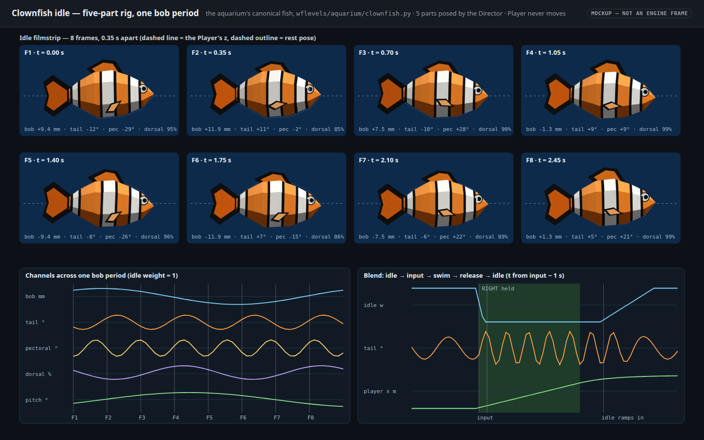
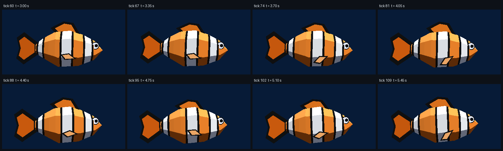
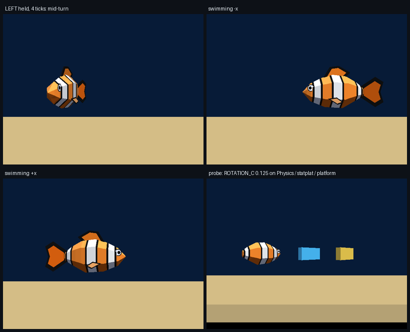

# Clownfish idle animation — the canonical aquarium clownfish, a five-part rig driven from Forth

Status: **built and verified on 2026‑09‑30** (see Verification). Spike level `wflevels/aquarium_idle/`. **This fish is the
aquarium level's clownfish** (Will, 2026‑09‑30; [aquarium plan](2026-09-30-aquarium-level.md) § 4 *Model ownership*):
one definition in [`wflevels/aquarium/clownfish.py`](../../wflevels/aquarium/clownfish.py) +
[`clownfish_idle.fth`](../../wflevels/aquarium/clownfish_idle.fth), imported by this spike, by the aquarium build (Phase 3),
by the mockup and by the test, so the level cannot drift from the animated model. TODO: the aquarium level's clownfish
idle-animation entry.

With no input the fish must not be a statue: a gentle hover with a slow body bob, some heading and pitch sway, a tail beat,
pectoral flutter and a dorsal ripple. Input must take over at once, with no snap and no stuck state, and the idle must never
fight the gravity-free physics: no drift, nothing pushed through sand or a wall.

## Mockup and engine captures

[](2026-09-30-clownfish-idle-animation/idle-cycle.html)

The mockup is drawn by [`make_idle_mockup.py`](../../wflevels/aquarium_idle/make_idle_mockup.py) from the same meshes,
pivots and tunables as the level, using a small side-on software projection. States: eight idle frames across one bob
period, the channel traces they sample, and the blend timeline (idle → input → swim → release → idle).

**Real engine frames** (`-rate20 --capture-frame=N`, eight ticks 0.35 s apart, drawn by
[`capture_idle_strip.py`](../../wflevels/aquarium_idle/capture_idle_strip.py)):



Turning, swimming, and the rotation probe (debug-bridge screenshots from `tests/test_aquarium_idle.py`):



## ROTATION_* writes — the finding the aquarium plan asked for (Phase 1 step 7)

Measured 2026‑09‑30 with `aquarium_idle_probe` (verification step 3). Each actor wrote A = 0, B = 0, C = 0.125 rev every tick.
After 20 ticks each read back exactly 0.125, and each is drawn turned 45° in the capture above:

| Actor kind | Who writes | Result |
|---|---|---|
| `Physics` Player (Jolt `CharacterVirtual`) | its own script, `write-mailbox` | **Works.** Nothing overwrites it: `Turn Rate` 0 never calls `AddRotation`, and Jolt syncs position only. The collision capsule does not turn (Phase 1 saw the same). |
| `statplat` | the Director, `write-actor-mailbox` | **Works** for rendering. But see F1: a statplat is always a Jolt collision body. |
| anchored `platform` (no Jolt body) | its own script | **Works.** The rig uses this kind. |

Three rules hold for every kind:

- **Always write A, then B, then C.** A and B go into a *function-static* `Euler` shared by every actor
  (`actor.cc:1416`), and only the C write commits all three.
- **Reads come back in [0, 1) rev.** A write of −0.01 reads back as 0.99, so wrap before comparing.
- **Units are revolutions.** Heading 0 faces +X and 0.5 (or −0.5) faces −X. Positive B tips the nose **down**
  (`matrix34.cc:106-114`).

## What the engine offers (evidence, read from code)

| # | Mechanism | Finding | Source |
|---|---|---|---|
| M1 | `ROTATION_A/B/C` | Works; see the section above for the shared static `Euler` | `game/actor.cc:1416`, `:1510-1536` |
| M2 | `X/Y/Z_POS` | Absolute position. On a Jolt character it also teleports the body, so writing it on the Physics fish would fight physics | `actor.cc:1458-1509` |
| M3 | `X/Y/Z_SCALE` | Render-only and per actor. Scales the local basis about the actor origin | `actor.cc:1622-1638`, `renderassets/rendacto.cc:486-488` |
| M4 | `KEYFRAME` (3015) | **Dead**: read and write are both `UNIMPLEMENTED` (= `assert(0)`) | `actor.cc:1313`, `:1562`; `hal/halbase.h:93` |
| M5 | Mesh vertex-animation cycles | Exist but are orphaned. `RenderActor3DAnimates` plays `CYMP`+`CANM` chunks, with an `IDLE` cycle chosen by movement state. **No tool in `wftools/` writes `CANM`** | `anim/animcycl.cc:48-91`, `anim/animmang.cc:117-263` |
| M6 | Visibility-mailbox pose swap | Works (qbert). Costs a whole actor and mesh per pose, and motion steps between poses | `docs/level-building.md` § Visibility mailbox |
| M7 | Parenting | None. A part must be re-placed every tick from the body's pose | — |
| M8 | zForth | Float cells, no `sin` (Bhaskara as the condo's `cc-sin`). Definitions compile once; the body after the last `;` runs every tick. Word names ≤ 31 chars | `condo_639_640/camera_controls.fth:7-11`, `zforth.h:74` |
| M9 | Tick order | Main-loop actors run physics then their script. **The Director runs last**, so parts it places never lag the body | `level.cc:977-988` |
| F1 | **Every `statplat` is a Jolt static body, whatever its `Mass`** | A box placeholder at construction, then a trimesh (`JoltMakeStaticMesh`). A Mass-0 statplat body part enclosed the Player's capsule, so `XSPEED` read back but `X_POS` never moved. Anchored `platform`s get no Jolt body. Found 2026‑09‑30 by trace; the first hypothesis (snowgoons Mass 75 on `CamTarget`, parked on the fish) was tested and refuted | `actor.cc:747-762`, `:543-593`; the `jolt: body` lines in step 2 |
| F2 | Bungee camera look-at | It aims at `Target − Follow + TrackObject`. With `Follow = Target` (the moon's "vista" rig) it looks at the **Track Object**, so `docs/level-building.md`'s "`Track Object` is irrelevant" is wrong in bungee mode. The spike parks the camera by tracking `CamTarget` | `game/movecam.cc:1021-1030` |
| F3 | Linux input | `JOYSTICK1_RAW` comes from X11 key events to the focused game window. A test that opens a window on a shared desktop must mask it (sticky `inject_input` 0) | `gfx/gl/mesa.cc:296-407` |

## Decision: separate part actors posed by the Director (mechanism c), purely visual

The visible fish is **five Mass-0 anchored `platform` mesh actors**: body, tail, dorsal, near pectoral and far pectoral.
The `Player` is the aquarium plan's `Physics` actor, but its own mesh (`clownfish-hull`, a copy of the body) is
**invisible** (`Visibility Mailbox` 0). It is only the collision proxy that swim code moves. Every tick the Director reads
the Player's position and the idle weight, computes the visual pose, and writes each part's `X/Y/Z_POS`,
`ROTATION_A/B/C` and (dorsal only) `Z_SCALE` with `write-actor-mailbox`.

Why the other mechanisms lost:

- **(a) Rotate or bob the single Physics mesh:** a rigid fish can sway but cannot beat a tail or flap a fin, and a bob
  done through `Z_POS`/`ZSPEED` moves the Jolt capsule.
- **(b) `KEYFRAME` or vertex cycles:** `KEYFRAME` asserts. Vertex cycles need a new `CANM` exporter for a 2003 decoder
  that has never been exercised in this fork, and the cycle is picked by movement state, not by a script. That is not an
  engine change, but it is the most expensive and least certain option.
- **(d) Visibility pose swap:** needs poses × parts actors, the motion is stepped, and it still needs (c) to move the fish.

**Rejected within (c): keep the visible body on the Physics `Player`.** That is what the aquarium plan's actor table says:
"`Player` (clownfish body)". It works, but the bob then moves the capsule and couples the idle to Jolt. With an invisible
hull the idle is provably cosmetic: step 4 measures the Player moving 0.00000 m while idling. The cost is one extra actor,
and the shape of the aquarium plan changes, so this is flagged to the orchestrator rather than silently applied (see
Hand-off).

### The rig, per tick

The idle weight `w` (0 = swimming, 1 = idle) is published by the Player script. It rises over `fish-idle-in` once there
has been no input for `fish-idle-delay`, and falls over `fish-idle-out` from the tick input arrives. It is applied
through smoothstep, so no channel snaps. All five phases are **accumulators** (`φ += f·Δt`, wrapped), so blending a
frequency between its idle and swim values never jumps the phase.

| Channel | Formula | Idle | Swim |
|---|---|---|---|
| Body bob (visual z) | `w·A·sin φbob` | 12 mm, 2.8 s period | 0 |
| Body heading C | `heading + w·Y·sin φsway − k·θtail` | ±0.010 rev | counter-yaw only (k = 0.2) |
| Body pitch B | `w·P·sin(φsway + ¼)` | ±0.006 rev | 0 |
| Tail yaw θ | `lerp(Aswim, Aidle, w)·sin φtail` | ±0.050 rev at 1.4 Hz | ±0.075 rev at 3.2 Hz |
| Pectoral swing | `lerp(…)·sin φpec`; the far fin mirrors it | ±0.080 rev at 2.2 Hz | ±0.020 rev at 3.0 Hz |
| Dorsal height | `1 − w·D·(½ − ½ cos φdorsal)` → `Z_SCALE` | 0.85 to 1.00 at 0.7 Hz | 1.00 |

Parts are placed at `pivot = body + Rz(C)·Ry(B)·offset`, in the engine's own Euler order. Tail orientation is
`(0, B, C + θ)`; pectorals are `(0, B ± φ, C ± flare)`. These equal the true composed rotation when B = 0 and differ by
less than the ±2.2° pitch sway otherwise.

The side-on view makes a lateral tail beat subtle, as on a real fish seen from the side: only the fin's width and shading
change. A hovering clownfish is propelled by its pectorals, so they carry the most visible motion.

## Hand-off to the aquarium level (Phase 3)

**Public names** in `wflevels/aquarium/clownfish.py`:

| Name | What |
|---|---|
| `Clownfish(world_scale=10)` | The model. `.parts()` → `[(actor name, Mesh, pivot offset m)]`; `.body_mesh(name)`; `.blender_mesh(bpy, mesh, materials)`; `.extents()`; `.collision_box()`; `.physics()`; `.min_triangle_area()`; `.apply_player_fields(player, visible=False)`; `.player_script(indices, player_idx, extra='')`; `.director_script(indices, player_idx, extra='')`; `.forth_header(...)`; `.T` (tunables) |
| `apply_part_actor_fields(obj)` | Makes a part an anchored `platform`, Mass 0, visible, with no script |
| `PART_NAMES`, `ROLES`, `PLAYER_MESH`, `mesh_file(name)` | Actor and mesh names |
| `ENTRY_PLAYER` = `fish-player-tick`, `ENTRY_DIRECTOR` = `fish-rig-tick` | The two Forth entry points |
| `TUNABLES`, `PHYSICS`, `MAILBOXES`/`MB` (600–627), `COLOURS` | Every number, as constants |
| `FISH_REAL_LENGTH_M` × `world_scale`, `DEFAULT_WORLD_SCALE` 10 | 0.889 m at ×10. Since aquarium Phase 3 both come from `aquarium_constants.py` (`FISH_LEN` 3.5 in × `IN`, `WORLD_SCALE`); the spike used 0.089 m |
| `MIN_COLLISION_SPAN_M` 0.25, `ENGINE_MIN_TRIANGLE_M2` 3.05e‑5 | Engine floors that the model is checked against |
| `RigState`, `part_poses`, `rot_matrix` | A Python mirror of the tick maths, for mockups and reasoning |

**Actor contract.** Create the Player, then the five parts. Compute runtime indices as export-list position + 1 (the
condo's bias, confirmed in step 2) and pass them to `player_script` and `director_script`. Append any other Director
clauses through `extra`. `fish-rig-tick` must run from the **Director**, because it runs after every main-loop actor. Parts
must be anchored `platform`s, never statplats (F1). No parent/child hierarchy exists: parts follow the body because their
offsets are rotated by the body heading every tick.

**Control assumptions the integrator must honour.** These are Phase 1's measured values, adopted as this fish's
defaults by `physics()` and `apply_player_fields()`:

- While a direction is held, write ±`fish-swim-speed` (3.048 m/s at ×10) to that axis's speed mailbox. Write nothing on
  release; the air drag of 2.0 gives the glide. Write `INPUT` 0 every tick. Use `Max Air Speed` = `Max Ground Speed` =
  6.096 (never 0), `Running Deceleration` 0.05, all accelerations 0, `Turn Rate` 0, `Script Controls Input` True and
  `Mass` 1.
- The real swim controller replaces `fish-swim-tick`. Every tick it calls `( moving? ) fish-idle-sense`, where moving
  means any swim input including B, C and A. It sets `fish-heading-target` to 0 for +X or −0.5 for −X and calls
  `fish-turn`.
- **Do not write `ROTATION_C` on the Player.** The rig owns the visual heading (`fish-heading`), and the capsule never
  turns anyway.
- The idle writes no speeds, positions or rotations on the Player, ever. It is net-zero by construction: step 4
  measured Player drift of 0.00000 m.
- Clamps are the level's job. `extents()` at ×10 gives nose x +0.361 (0.362 before aquarium Phase 3), tail tip −0.528, dorsal top z +0.289, belly
  −0.181 and half-width 0.110 (pectorals included), in metres from the body origin. Heading −0.5 mirrors x. The body
  origin is the **body centre**: a swimming fish is the documented exception to the base-at-z = 0 rule.
- `apply_player_fields()` sets the Player's box to `collision_box()` = ±0.361 × ±0.125 × ±0.195 m. It is authored and
  symmetric, and every side is ≥ 0.25 m, so levcomp's thin-span rule leaves it alone and the capsule is centred
  (`ctr=(0.00,0.00,0.00)` in step 2). The capsule radius is 0.125.
- The mesh is ×10 only. Its smallest triangle (the pupil) is 7.45e‑5 m², 2.4 × the engine floor. At ×1 it would be
  7.45e‑7 m², and the load would abort.
- Mailboxes 600–627 belong to the fish. Keep the aquarium's own mailboxes out of that range.

**Differences from the Phase 1 placeholder:**

- The body is 0.20 m thick. The brief asked for about 0.2 m; a real ocellaris at ×10 is about 0.13 m.
- The origin is at the body centre, not at the feet, so the Z clamp must use `extents()`.
- The collision box is authored rather than taken from the mesh.

## Files

| File | Purpose |
|---|---|
| `wflevels/aquarium/clownfish.py` | Canonical model: outline, parts, materials, scale, tunables, Phase 1 physics, Blender builder, Forth header and scripts, Python mirror |
| `wflevels/aquarium/clownfish_idle.fth` | Forth: math helpers, swim stub, idle sense, rig |
| `wflevels/aquarium_idle/blender_create_aquarium_idle.py` | Spike level build. With `IDLE_PROBE=1` it builds the rotation probe instead |
| `wflevels/aquarium_idle/aquarium_idle-standalone.iff.txt`, `.gitignore` | L4 wrapper; ignore rules for regenerable intermediates |
| `wflevels/aquarium_idle/aquarium_idle.lev`, `wflevels/aquarium_idle{,-standalone}.iff` | Built level, committed like the condo's so the test runs without Blender |
| `wflevels/aquarium_idle/make_idle_mockup.py`, `capture_idle_strip.py` | Mockup generator; engine filmstrip |
| `Taskfile.yml` | `aquarium-idle-level`, `aquarium-idle-probe-level`, `run-aquarium-idle`, `test-aquarium-idle` |
| `tests/test_aquarium_idle.py` | Regression guard |

## Verification

Steps are the spec; the output is the evidence. The runs are from 2026‑09‑30 in the worktree, with Rust tools built there
and `engine/wf_game` symlinked from the main checkout (built 2026‑09‑25).

1. `task aquarium-idle-level`. Expected: builds with no manual pre-step; the build log lists the five parts with their runtime actor indices.

    ```
    $ task aquarium-idle-level --force 2>&1 | grep -E '^\[aquarium_idle\]|^Info|^\[[0-9]/5\]|✓'   # cargo warnings elided
    [aquarium_idle] scaffold classes: ['camera', 'camshot', 'director', 'levelobj', 'light', 'matte', 'player', 'room', 'target']
    [aquarium_idle] clownfish ×10: 0.890 m, parts clownfish-body 190f, clownfish-tail 35f, clownfish-dorsal 30f, clownfish-pec-near 20f, clownfish-pec-far 20f
    [aquarium_idle] actor  1 = Camera (camera)
    [aquarium_idle] actor  2 = Director (director)
    [aquarium_idle] actor  3 = Level (levelobj)
    [aquarium_idle] actor  4 = Matte (matte)
    [aquarium_idle] actor  5 = cs_side (camshot)
    [aquarium_idle] actor  6 = CamTarget (target)
    [aquarium_idle] actor  7 = room_aquarium_idle (room)
    [aquarium_idle] actor  8 = Player (player)
    [aquarium_idle] actor  9 = Sun (light)
    [aquarium_idle] actor 10 = backdrop (statplat)
    [aquarium_idle] actor 11 = sand (statplat)
    [aquarium_idle] actor 12 = clownfish-body (platform)
    [aquarium_idle] actor 13 = clownfish-tail (platform)
    [aquarium_idle] actor 14 = clownfish-dorsal (platform)
    [aquarium_idle] actor 15 = clownfish-pec-near (platform)
    [aquarium_idle] actor 16 = clownfish-pec-far (platform)
    [aquarium_idle] actor 17 = AmbientLight (light)
    [aquarium_idle] exporting 17 actors → wflevels/aquarium_idle/aquarium_idle.lev
    Info: Exported 17 objects to wflevels/aquarium_idle/aquarium_idle.lev
    [aquarium_idle] done
    [1/5] iffcomp-rs  aquarium_idle.lev  →  aquarium_idle.lev.bin
    [2/5] levcomp-rs  aquarium_idle.lev.bin  →  aquarium_idle.lvl + asset.inc + aquarium_idle.iff.txt + aquarium_idle.ini
    [3/5] textile-rs  -ini=aquarium_idle.ini  →  palN.tga / RoomN.{tga,ruv,cyc} / Perm.{tga,ruv,cyc}
    [4/5] iffcomp-rs  aquarium_idle.iff.txt  →  ../aquarium_idle.iff
    ✓ built wflevels/aquarium_idle.iff (65536 bytes)
    [5/5] iffcomp-rs  aquarium_idle-standalone.iff.txt  →  ../aquarium_idle-standalone.iff
    ✓ built wflevels/aquarium_idle-standalone.iff (69632 bytes)
    exit=0
    ```

    **PASS.**

2. `engine/wf_game --debug-print-actors` on the level. Expected: the printed index of every part mesh equals the index baked into the Director header.

    ```
    $ wf_game --frame-step-smoke=5 --cycles=1 -rate20 --debug-print-actors -L../../../wflevels/aquarium_idle-standalone.iff 2>&1 | grep -E "actor idx=(8|1[2-6]) |jolt: character|jolt: body"
    actor idx=8 mesh=clownfish_hull.iff mobility=Physics pos=(0.00,0.00,1.00)
    jolt: character 0 created at (0.00, 0.00, 1.00) ctr=(0.00,0.00,0.00)
    jolt: body STATIC pos=(0.00,2.47,2.00) half=(6.00,0.12,3.00) id=8388608
    jolt: body STATIC pos=(0.00,0.80,0.17) half=(4.00,1.20,0.12) id=8388609
    actor idx=12 mesh=clownfish_body.iff mobility=Anchored pos=(0.00,0.00,1.00)
    actor idx=13 mesh=clownfish_tail.iff mobility=Anchored pos=(-0.32,0.00,1.00)
    actor idx=14 mesh=clownfish_dorsal.iff mobility=Anchored pos=(0.01,0.00,1.13)
    actor idx=15 mesh=clownfish_pec_near.iff mobility=Anchored pos=(0.06,-0.11,0.94)
    actor idx=16 mesh=clownfish_pec_far.iff mobility=Anchored pos=(0.06,0.11,0.94)
    jolt: body MESH_STATIC verts=8 faces=12 id=16777216
    jolt: body MESH_STATIC verts=8 faces=12 id=16777217
    $ grep -o ": fish-actor-[a-z-]* [0-9]* ;" wflevels/aquarium_idle/aquarium_idle.lev | sort -u
    : fish-actor-body 12 ;
    : fish-actor-dorsal 14 ;
    : fish-actor-pec-far 16 ;
    : fish-actor-pec-near 15 ;
    : fish-actor-player 8 ;
    : fish-actor-tail 13 ;
    ```

    **PASS.** The indices match. Only the backdrop and the sand have Jolt bodies (2 boxes, then 2 meshes); the five
    platform parts have none. The capsule is centred.

3. Rotation-write probe (`task aquarium-idle-probe-level`, then the probe test). Expected, recorded either way: (i) `ROTATION_C` written by a `Physics` actor's own script reads back and shows on screen; (ii) the same written by the Director into a `statplat` with `write-actor-mailbox`, and (iii) by an anchored `platform`'s own script.

    ```
    $ task aquarium-idle-probe-level 2>&1 | grep standalone.iff
    ✓ built wflevels/aquarium_idle_probe-standalone.iff (36864 bytes)
    $ python3 -m pytest tests/test_aquarium_idle.py -v -s -k rotation
    PROBE ROTATION_C read back after 20 ticks (wrote 0.125): {'physics': 0.125, 'statplat': 0.125, 'platform': 0.125}  A/B: [(0.0, 0.0), (0.0, 0.0), (0.0, 0.0)]
    PASSED
    ```

    **PASS** for all three kinds. On screen (the `engine-states.png` probe panel) the fish and both slabs are turned 45°.
    Recorded for the aquarium plan in § ROTATION_* writes.

4. Idle trace over the bridge, 6 s without input. Expected: `w` reaches 1; tail yaw, pectoral swing and dorsal scale all change; the body's visual z oscillates with peak-to-peak ≈ 2 × 12 mm about the Player's z; the Player's position moves < 1 mm.

    ```
    $ python3 -m pytest tests/test_aquarium_idle.py -v -s -k idle_moves      # warm-up 1.65 s, then a 3.2 s window
    IDLE  64 ticks: w 1.000..1.000  tail yaw -0.0500..+0.0500 rev  pectoral -0.0845..+0.0857 rev  dorsal Z_SCALE 0.850..1.000  bob -12.00..+12.00 mm (mean -1.43)  Player drift x/y/z 0.00000/0.00000/0.00000 m  frames 0.35 s apart differ in 10776 px
    ```

    **PASS.** The window was 3.2 s, not 6 s: 1.65 s of warm-up plus 3.2 s covers the whole ramp and more than one bob
    period. The mean bob of −1.43 mm is because 3.2 s is 1.14 periods, not a whole number.

5. Inject RIGHT for 1.5 s, then release. Expected: `w` falls to 0 within `fish-idle-out` + one tick; the Player moves +x; after release `w` returns to 1 within delay + ramp + 0.5 s. No channel jumps by more than its per-tick maximum at either transition.

    ```
    LEFT  w per tick [0.583, 0.167, 0.0, 0.0, 0.0]  x +0.000 -> -1.097 m in 9 ticks  body heading 0.508 rev  Player z range 0.00000 m
    BACK  w reached 1 after 22 ticks (1.10 s; delay+ramp = 1.15 s)  glide at window end 0.0127 m/s  pectoral swing over last 10 ticks 0.1588 rev
    RIGHT x -0.601 -> +0.496 m in 9 ticks  body heading 0.995 rev
    PASSED
    ```

    **PASS, run with LEFT and then RIGHT instead of RIGHT only.** LEFT exercises the half turn as well. The blend-out
    takes 3 ticks (1 → 0.583 → 0.167 → 0), which is a blend and not a snap. The swim uses Phase 1's controls: 9 ticks
    cover 1.10 m. The heading reaches 0.508 rev turning left and 0.995 (−0.005) turning right; the offsets are the tail
    counter-yaw. `w` is back to 1 after 1.10 s, with the pectorals moving again. The residual 0.013 m/s is the Phase 1
    glide still decaying (× 0.9 per tick); the idle writes no speeds. The camera is static, so the test teleports the
    fish back into frame for its pictures.

6. Engine captures at several frames of the idle cycle (`-rate20 --capture-frame=N`), opened and looked at. Expected: fish complete and correctly coloured; tail, fins and dorsal visibly differ between frames; the body stays put.

    ```
    $ python3 wflevels/aquarium_idle/capture_idle_strip.py
    frame 60: ~/tmp/aquarium-idle/strip/f060.png
    frame 67: ~/tmp/aquarium-idle/strip/f067.png
    frame 74: ~/tmp/aquarium-idle/strip/f074.png
    frame 81: ~/tmp/aquarium-idle/strip/f081.png
    frame 88: ~/tmp/aquarium-idle/strip/f088.png
    frame 95: ~/tmp/aquarium-idle/strip/f095.png
    frame 102: ~/tmp/aquarium-idle/strip/f102.png
    frame 109: ~/tmp/aquarium-idle/strip/f109.png
    wrote docs/plans/2026-09-30-clownfish-idle-animation/engine-idle-strip.png (31 KB)
    wrote docs/plans/2026-09-30-clownfish-idle-animation/engine-states.png (39 KB)
    ```

    **PASS.** All the captures were opened and looked at. The fish is complete: three white bands with black edging, a
    black-rimmed tail and dorsal, a pectoral and an eye. Between frames the pectoral swings clearly, the dorsal rises and
    lowers (ticks 60 and 67), and the bob is visible against the fixed horizon. Seen side-on, the tail beat shows only as
    small changes in the fin's width and shading. The turn, the swims and the probe are in `engine-states.png`.

7. `python3 -m pytest tests/test_aquarium_idle.py -v`. Expected: pass; and it fails when the rig call is removed from the Director (checked once by hand).

    ```
    $ python3 -m pytest tests/test_aquarium_idle.py -v -s
    tests/test_aquarium_idle.py::test_rig_parts_are_mass0_anchored_platforms PASSED
    tests/test_aquarium_idle.py::test_player_is_invisible_gravity_free_physics_hull PASSED
    tests/test_aquarium_idle.py::test_player_collision_box_is_authored_symmetric_and_not_thin PASSED
    tests/test_aquarium_idle.py::test_mesh_triangles_clear_the_engine_floor PASSED
    tests/test_aquarium_idle.py::test_director_runs_the_rig_with_the_right_indices PASSED
    tests/test_aquarium_idle.py::test_no_snowgoons_names_survive PASSED
    tests/test_aquarium_idle.py::test_idle_moves_parts_not_physics_and_blends_with_swimming PASSED
    tests/test_aquarium_idle.py::test_rotation_writes_reach_physics_statplat_and_platform PASSED
    ============================== 8 passed in 19.76s ==============================
    $ WF_IDLE_SABOTAGE=1 python3 -m pytest tests/test_aquarium_idle.py -q -k idle_moves    # Director hot-reloaded with an empty script
    E           AssertionError: tail barely moved: [0.009506000000000014, 0.009506000000000014, 0.009506000000000014, 0.009506000000000014, 0.009506000000000014, 0.009506000000000014]
    1 failed, 7 deselected in 8.36s
    ```

    **PASS.** The suite passes, and the guard fails when the rig is removed.

## Regression guard

`tests/test_aquarium_idle.py` (`task test-aquarium-idle` builds both levels first):

- **Static checks**, no display needed:
    - the `.lev` has the five rig parts as Mass-0 anchored `platform`s, and the Player is an invisible,
      gravity-free Physics hull running `fish-player-tick`;
    - the Player's box is authored, symmetric and ≥ 0.25 m on every side;
    - no triangle is under 2 × the engine floor;
    - the Director's header indices equal the export positions + 1, and no snowgoons names survive.
- **Runtime checks**, stepped over the debug bridge with keyboard input masked: steps 4 and 5, two screenshots that must
  differ, and the ROTATION probe (step 3).

Found while writing it: an earlier version compared raw `[0, 1)` rotation read-backs, and a wrap from 0.99 to 0.01 would
have faked a 1-rev swing. It now wraps every angle into [−0.5, 0.5). An earlier run also once saw `w` dip below 1 with
nothing injected. The only source for that is X11 key events reaching the focused window (F3); that run did not record
the joystick value, so it cannot be confirmed after the fact. The test now pins `joystick1_raw` to an injected 0 and
reports the joystick value if `w` ever dips.

## Risks and open points

| Risk | Consequence | Mitigation |
|---|---|---|
| The aquarium plan's actor table has "`Player` (clownfish body)"; this design uses an invisible hull plus a body part | Plan shape change | Flagged to the orchestrator; § Hand-off gives the contract |
| Shared static `Euler` in `WriteSystemMailbox` | A part inherits another actor's A or B | `fish-orient` always writes A, B, C |
| Runtime indices = export position + 1 | Parts frozen or scrambled if the bias changes | Checked at runtime by the test (step 2) |
| Tail approximation `Rz(C+θ)Ry(B)` | Tiny wobble at pitch | Pitch capped at ±2.2° |
| Phases before the bridge's `pause` depend on connection time | Screenshots differ run to run | Assertions are phase-independent |
| `engine/wf_game` predates the branch tip by one commit (`00978ee7`, Forth comments) | — | The `.fth` comments loaded with no `zforth` errors (log checked) |

**No engine change.** Cost: none — no infrastructure or paid service.
