# Condo 639: motorised zip screen on the back balcony

## Context

The back balcony of 639 is an open opening onto the west (Bangkok afternoon sun, monsoon rain, gusts, 6th floor ≈ 16 m up). Will wants a **motorised outdoor zip screen in a cassette, mounted under the concrete ledge (beam) of the opening**, with the **solar-strip motor option** (battery motor charged by a thin photovoltaic strip — no mains wiring to the balcony).

**What the shade is for** (Will, 2026‑09‑30): **the top priority is view and airflow when it is raised**, which is why it is a retractable shade and not a window; raised, the opening should hold nothing but the cassette and two slim guides. When it is down it must **stop rain** (at least 99 %, imperative, because the artificial grass now covering the recessed patio floor would go mouldy), keep **pigeons** out of the balcony and the project room behind it (the glass doors are usually open when Will is home), and cut heat and glare. It replaces the existing fixed awning, which does little against rain and which pigeons land on noisily. Retracting resolves the earlier worry about a sealed waterproof screen trapping heat and damp: raised, the grass dries in open air. What is left is the shower that catches it raised (Open question 8).

**The ledge is a façade element.** Will (2026‑09‑30): the 35 cm deep concrete ledge runs the **entire length of that west wall, in both 639 and 640**, not just over this opening. The level model therefore gets one continuous band along the west wall of both units (y −0.35…0, soffit 2.15 up to the model ceiling 2.70), not a local beam over the 2.68 m opening. This also means the cassette can hang from the same uniform soffit wherever it ends up, and the guides bolt to the jambs, not to the ledge.

Measured by Will (2026‑09‑30; the ledge depth vs. height and the datum were clarified the same day):

| Item | Value |
|---|---|
| Opening width | 268 cm |
| Opening height (pony-wall cap → beam soffit) | 111 cm |
| Pony wall height | 111 cm |
| Concrete ledge above the opening | **35 cm deep** (front-to-back), **about 64 cm tall** |
| Pony wall thickness | 10 cm |
| Patio width (`639-patio-recessed`) | 280 cm; the opening is centred in it |
| Ceiling | 3 m walls, no drop ceilings anywhere in 639 |
| Floor in front of the opening | recessed **7 cm** below the interior floor, across the whole recessed patio (glass-door threshold to pony wall, about 2 m) |
| Floor covering | **artificial grass** over the recessed patio floor; nominally 4 cm but it lies flat, **under 1 cm** thick |

**The level model does not match these numbers today** (queried read-only from `~/docs/aircon/units-639-640.blend`, `unit-639` shell, y = 0 plane):

- The patio rooms are `639-patio-recessed` (x 2.70–5.40) and `639-patio` (x 5.40–7.80), both floored at z = 0, ceilinged at z = 2.70.
- The open edge is a **1.00 m parapet** (x 2.65–5.85, y −0.10…0) with **nothing above it** up to the 2.70 m ceiling, i.e. a 1.70 m opening and no beam. A full-height wall starts at x 6.55.
- A full-height post stands at x 5.70–5.80, so the parapet run is 2.75–5.70 = 2.95 m clear, not 2.68 m.
- Real stack 111 + 111 + 64 = **286 cm** from the balcony floor, under a **300 cm** ceiling; the model's ceilings are 270 cm (an assumption in the source survey — see Open questions).
- The model's recessed patio is 270 cm wide; the real one is 280 cm.
- The Daikin outdoor unit hangs *outboard* of the parapet at x 2.76–3.56, y 0.19–0.49, z 0.30–0.85; its lineset and drain cross y = 0 at the left end, below the parapet cap.

So the plan has two halves: **(A) the real-world spec** Will can take to a supplier, and **(B) the level model** corrected to the measurements, with the shade built into it and operable.

## Approach

### A. Real-world spec

Product class: **outdoor zip screen, cassette (head box) on the soffit, inside-reveal mount, solar-strip battery motor with RF remote**.

| Parameter | Recommendation | Why |
|---|---|---|
| Order size | ≈ 267 × 111 cm **overall, cassette included** | 268 cm clear less ~5 mm per side; supplier deducts for guides. Measure the clear width at three heights and order to the smallest |
| Cassette | ≈ 10 × 10 cm, aluminium, under the soffit **flush with the pony wall's outer face**, so the bottom bar lands on the 10 cm cap. The 35 cm-deep ledge leaves 25 cm of soffit on the balcony side, which shades but does not obstruct | A 111 cm drop rolls to a small diameter; the cassette costs ≈ 10 cm of the opening, so the fabric drops ≈ 98 cm |
| Guides | zip tracks on both reveals, ≈ 5 cm wide each | Keep the fabric taut in gusts; fabric width ≈ 257 cm |
| Bottom bar | ≈ 3 cm, with rubber seal, lands on the pony-wall cap | Cap must be flat and level — a 0–10 mm error shows as a gap along 2.6 m |
| Fabric (rain) — **required** | **waterproof and see-through** fabric (clear or lightly tinted PVC or similar), full height, that stops **at least 99 % of rain** reaching the grass; side zips and bottom bar sealed against wind-driven rain | Rain protection is imperative and Will wants to see out when it is closed (2026‑09‑30). Clear-PVC zip screens exist. The trade-offs to ask shops about: it lets sun and heat through (tint or solar-control film, or a second roller in screen fabric for the hottest hours), how clear it stays over the years, creasing when rolled, and a thicker roll (a bigger cassette than the 10 cm assumed). An open-weave screen fabric passes most rain, so it cannot be the rain layer |
| Fabric (sun), optional | a second roller in 3–5 % openness screen fabric, light exterior colour, for the hottest hours | Only worth it if rain protection is kept; a clear PVC layer gives little shade, so this is the heat fix if tint or film is not enough |
| When raised | the bottom bar stows into the cassette, so nothing hangs in the opening; ask how many cm of the opening the cassette and each guide block | The view and airflow are the point of a retractable shade, so the raised opening must be as clear as the product allows |
| Wind | ask for the supplier's **EN 13561 class** and the **test size**; it must cover 2.67 × 1.11 m | A 6th-floor west face takes squall gusts; do not accept a class without the test size |
| Motor | battery tubular motor, **solar strip** on the cassette's west face, plus a **DC/USB charge port** | Monsoon weeks give little sun; a charge port is the fallback |
| Battery | ask for chemistry and **operating temperature** | The cassette sits in direct afternoon sun at 35 °C+ ambient; a cell that is only rated to 45–60 °C ages fast |
| Control | **RF remote (required)**; ask the RF frequency and protocol. Also ask whether a **Zigbee** version of the motor exists, or an RF-to-Zigbee bridge that works with it, and the price (not expected to be supplied; Will has a Zigbee bridge). Optional rain sensor so it closes by itself | With rain protection imperative, an open screen during a shower is the failure case; a Zigbee or sensor automation closes it. The bridge depends on the RF protocol, so ask for it |

**Solar strip placement.** The balcony faces due west, so a vertical strip on the cassette's outer face sees direct sun only from roughly midday on, and edge-on near solar noon (see the section mockup). Morning charge is diffuse. Ask the supplier for the strip's Wp, the battery's Wh, and the cycles per day it is rated for; a 111 cm drop is a small load, which is why this option is plausible here.

**Anchoring.** Side guides bolt into the concrete reveals (the vertical side faces of the opening); the cassette hangs from the soffit. Both need flat, plumb faces — see Open questions.

### B. Level model (`blender_create_condo.py`)

The source `.blend` is read-only, so all of this is a new section (**§ 7d**) in `wflevels/condo_639_640/blender_create_condo.py`, following the pattern of § 7c (telescoping glass doors) and gated by `CONDO_SHADE=0` to switch it off.

1. **Pin the opening.** Constants in metres, all derived from Will's numbers: `SHADE_W = 2.68`, `PONY_H = 1.11`, `PONY_T = 0.10`, `OPEN_H = 1.11`, `LEDGE_DEEP = 0.35`, `FLOOR_RECESS = 0.07`, `PATIO_W = 2.80`. The patio is widened from 2.70 to 2.80 m keeping its south edge on the south wall (x 2.75…5.55); the opening is **flush to the south wall**, x 2.75…5.43, and the remaining 12 cm to the north edge (x 5.43…5.55) is the north jamb stub (Will: 10 cm, plus about 2 cm of slack).
2. **Recess the floor 7 cm** across the whole recessed patio, from the glass-door threshold (y −2.0) to the pony wall (Will, 2026‑09‑30: the grass covers this area, and the step up is at the door, about 192 cm inboard of the pony wall's inner face). Earlier drafts, including the section mockup, drew the recess as a strip beside the opening; that was wrong. The shell floor is a single z = 0 face set inside `unit-639`, so this is a `bmesh` bisect of the top faces over the rectangle, dropping the cut region by 0.07 m and closing it with a step wall on the interior side. The player walks down 7 cm; Jolt's character step handles that. *As built:* the recess is x 2.75…5.55, y −1.95…−0.10, and the step riser sits flush under the door wall's patio face at y −1.95. The survey's door wall runs y −2.05…−1.95 about its −2.00 centreline, so a riser at −2.00 would open a 5 cm slot under the wall. At −1.95 no § 7c glass leaf floats either: tracks 0/1 end at −1.95, and the patio-side track carries only the fixed leaf at x ≥ 6.47, outside the recess. That puts the step 185 cm inboard of the pony wall's inner face, against the real ≈ 192 cm; the model patio is 2.00 m deep, not 2.02. Every boundary edge of the dropped region gets a riser, welded back to the upper floor, so there are no T‑junctions. Jolt's stair step (0.4 m up, 0.5 m down) handles the step both ways.
2b. **Artificial grass**: a flat green `statplat` slab (`GRASS_T = 0.01`; nominal pile 4 cm but it lies flat, under 1 cm) over that floor, so the walk-on top is at z −0.06 and the step from the project room is 6 cm. Added 2026‑09‑30 after the first build brief; the build agent was told by message. *As built:* `CONDO_GRASS=0` leaves bare concrete; the colour is a **darker green** (Will), `GRASS_RGB = (0.13, 0.29, 0.10)`; the Daikin drain's outlet eases down onto the grass top.
3. **Rebuild the opening** as solid geometry: parapet raised from 1.00 m to 1.11 m and 10 cm thick, flush with the outer face (y −0.10…0); a **ledge** 35 cm deep (y −0.35…0) with its soffit at the opening head (z 2.15) up to the model's 2.70 m ceiling, i.e. 55 cm tall against the real ≈ 64 cm; the 12 cm north jamb stub at x 5.43…5.55 and a solid pier from there to the model's existing post at x 5.70…5.80. The south jamb is the existing full wall (x 2.75 face), which needs no new geometry. *As built (façade band, 2026‑09‑30):* the ledge is one actor, `west-facade-ledge`, running the whole west façade from 640's rounded corner (x −4.21) to 639's north wall (x 7.90), soffit 2.15 to 2.70. It is built by an x-sweep. In each slab it has the 10 cm wall column (y −0.10…0); the 25 cm room-side overhang is added only where a floor lies behind it. The footprint of every wall top already at 2.70 is subtracted: the west wall itself, both posts, 639's north wall, `639-bath-N-E-wall` and `640-bath-closet-divider`. So there are no coplanar tops and no interpenetration. Over the opening it is the full 35 cm. Over 639's exterior service niche (x 5.80…6.55) it is only the 10 cm column, a lintel across the niche mouth. It bridges the 35 cm gap in the façade between the units (x 0.05…0.40). The build audits every mesh for vertices inside the band, and finds two: the **Daikin lineset** at x 2.59, z 2.25…2.35, which the survey routes through the wall 10–20 cm *above* the real soffit (on site the core hole must be below the beam; the model's lineset is not moved), and one vertex of 640's faceted corner wall at x −4.11, a sub‑centimetre graze. Nothing else on that wall is touched: the model has no windows or AC units on it, the Daikin outdoor unit hangs outboard at z ≤ 0.85, and the master-window camshot is on 640's south side (and off by default).
4. **Build the shade** as separate actors:
   - `639-balcony-shade-cassette` (static box with the solar strip as a second material on its west face, the strip length a placeholder);
   - two static guide boxes on the reveals;
   - the **fabric as N = 8 horizontal slats** (`statplat`, each ≈ 12 cm tall, 3 mm thick, 1 mm apart in Y to avoid coplanar z-fighting) plus the bottom bar riding the last slat.
5. **Motion.** Slat *i* is baked at the *closed* position; at closedness *c* the Director writes `INDEXOF_Z_POS` = `(1 − c) × (i + 1) × slat_h` upward, so at *c* = 0 all slats collapse into the cassette (hidden inside its closed box) and at *c* = 1 they tile the drop. This avoids per-vertex scale, which the engine does not support for a Jolt-backed mesh. It reuses the § 7c machinery: a closedness mailbox integrated by `DELTA_TIME`, a target toggled by **B / keyboard 2** when the player is within reach of the opening, `write-actor-mailbox` for each slat, and runtime actor indices resolved in § 9c the same way as the door panels (`DOOR_ACTOR_IDX_BIAS`). *As built*, the park offset is `(i + 1) × slat_h + BAR_H + 5 mm`, not `(i + 1) × slat_h`, for two reasons. The exact formula leaves every parked slat's bottom face coplanar with the cassette's bottom face. And the extra `BAR_H` lifts the bar, which rides the last slat, fully into the cassette, so when raised nothing hangs in the opening (part A, "When raised"). `Z_POS` on these world-baked meshes is an offset on the actor Position, which § 9b set to the 15.75 m lift, so the Director writes lift + offset.
6. **Collision.** Slats are ordinary statplats; the pony wall already blocks the player, so their collision is harmless. No engine change. *Found in Verification 6:* the collision is harmless for the player but not for the balcony POV camera, whose ±0.5 m physics bbox overlaps the ledge, cassette and fabric near the zone entry and makes it climb. `CONDO_SHADE_OVERHEAD_MASS=0` (one constant in § 7d) takes everything above the cap out of the camera's bbox pass. The build keeps the plan's statplat Mass until that is decided: Open question 10.
7. **Camera.** `BALCONY_CAM` sits 1.5 m ahead of the player at 1.7 m; with the parapet at 1.11 m and the shade closed the balcony POV is partly blocked, so the shot is checked closed and open (Verification 6). *Found:* the POV camera is always **outboard** of the fabric. The balcony zone starts at player y −1.55, so the camera is at y ≥ −0.05, and it looks away from the building. The shade is therefore never in the POV frame, open or closed. What it can do is lift the camera (item 6).

Rejected: a two-state visibility swap (open/closed with no travel) — cheap but it cannot show the roll, and the door interaction already proves a continuous version works.

## Mockups

[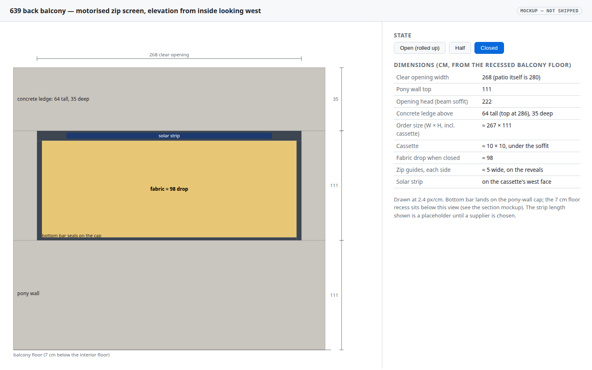](2026-09-30-condo-balcony-shade/elevation.html)

**Elevation** — the 268 × 111 cm opening with cassette, zip guides, solar strip, fabric and bottom bar; buttons switch open / half / closed. [Open the interactive mockup](2026-09-30-condo-balcony-shade/elevation.html).

[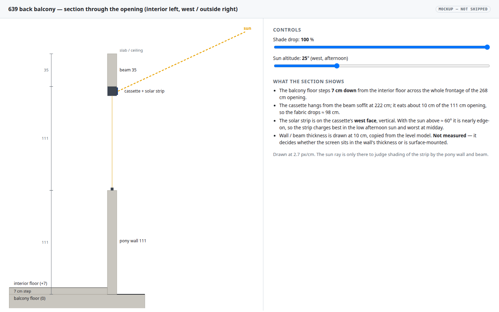](2026-09-30-condo-balcony-shade/section.html)

**Section** — the 7 cm floor step, pony wall, cassette under the soffit, beam, and a sun-altitude slider to judge what the west-facing strip sees. [Open the interactive mockup](2026-09-30-condo-balcony-shade/section.html).

The in-engine states are captured in Verification 5 and 6 (`-rate20 --capture-frame` on scratch builds of this level with a spawn / camera / start-closedness override; the shipped level loads open):

| open (raised) | half | closed |
|---|---|---|
| 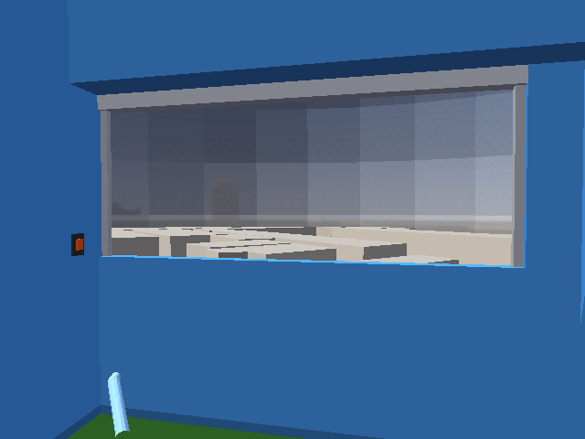 | 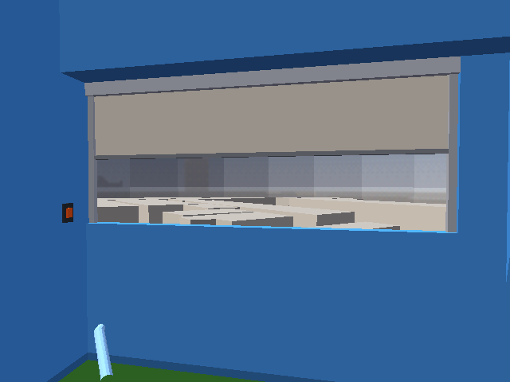 | 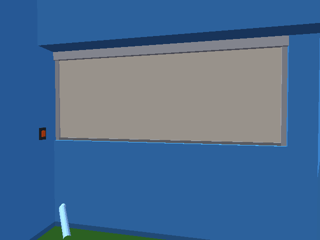 |

| grass and the 6 cm step, from the grass | the façade ledge over 640's west rooms | the ledge band, overview |
|---|---|---|
| 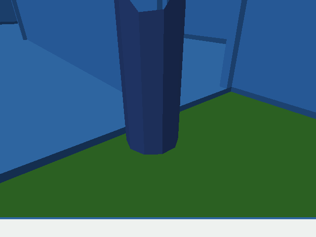 | 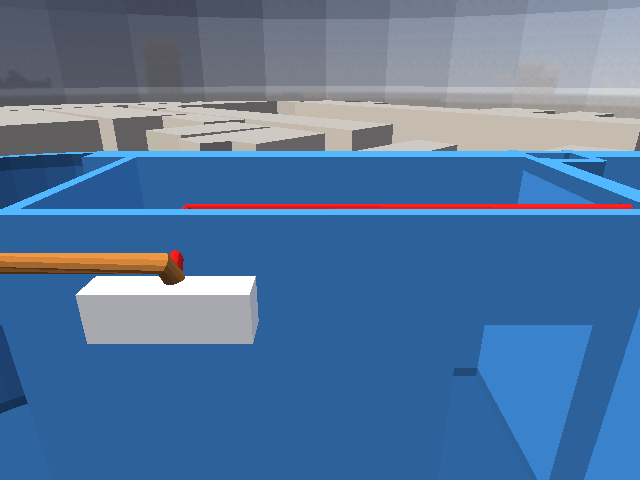 | 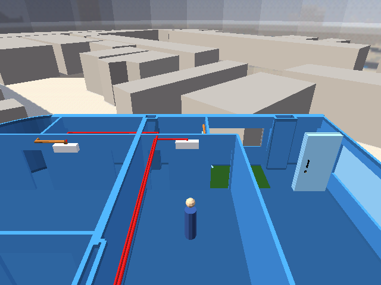 |

## Open questions

Answers of 2026‑09‑30 are folded in; what is left has a default that the build uses until corrected (constants at the top of § 7d).

1. ~~Datum for 111 / 111 / 35.~~ **Answered:** measured from the recessed balcony floor. The cap is 1.04 m and the soffit 2.15 m above the interior floor.
2. ~~Ceiling.~~ **Answered:** walls are 3 m, no drop ceilings in 639, and the ledge is 35 cm deep × ≈ 64 cm tall (my earlier reading of "35" as its height was wrong). The model's 2.70 m ceilings are therefore an assumption in the source survey, worse than assumed. **Not changed here** — raising every ceiling is a level-wide change to `~/scripts/aircon-blender.py`'s model; filed as its own TODO item. In this patio the ledge fills from the true soffit to the model ceiling (55 cm instead of 64).
3. ~~Where the 268 cm sits.~~ **Answered:** in the recessed patio, to the south of the main patio, which is 280 cm wide. Flush to the south wall (x 2.75…5.43); see question 5 for why it is not centred.
4. **Which face is the pony wall flush with, and which way does the ledge overhang?** The wall is 10 cm and the ledge 35 cm deep, so one face is flush and the ledge sticks out 25 cm on the other side. Default: both flush on the outer (west) face, ledge overhanging into the balcony. If it is the other way round, the cassette sits on the balcony side of the cap and the bottom bar needs a bar-to-cap check on site.
5. ~~Reveals~~ **Answered (2026‑09‑30):** the north jamb is a 10 cm wall; the south jamb is a full wall, 202 cm from the outside of the guest-bedroom wall to the outside edge of the pony wall. The 12 cm left over between the 280 cm patio and the 268 cm opening is read as that 10 cm north stub plus ≈ 2 cm slack, so the opening sits against the south wall — **inferred, please confirm**. The south guide gets a flat 2 m face; the north guide gets a 10 cm face, enough for a 5 cm guide but with little margin — check it is plumb on site. The model's patio depth is 2.00 m against the real 2.02 m; left at 2.00.

6. ~~Existing awning.~~ **Answered (2026‑09‑30):** the existing fixed awning (about 2.5 m wide, so it does not even cover the 2.68 m opening) is being **removed and replaced** by the shade; Will will have someone else remove it before any shade installation, so removal is not in the shops' quote. Everything then sits inside the line of the exterior wall, except possibly the small solar strip, whose position depends on the product chosen. The awning's shading of the strip therefore goes away; the strip's outward projection, if any, is what the juristic person (condo management) needs to approve. A draft LINE message is in the RFQ packet ([docs/rfq](../rfq/2026-09-30-639-balcony-zip-screen-rfq.pdf)). The photo also shows a thin cord or cable along the ledge face; check it does not obstruct the cassette. The level model does not include the awning, and now never needs to.

7. ~~Grass thickness.~~ **Answered:** nominally 4 cm but it lies flat, under 1 cm; the model uses 1 cm. **Also answered:** it covers the whole recessed patio floor wall to wall and turns up the edges a few cm; Will can trim it. The model uses one flat slab and ignores the upturn.
8. ~~Rain versus screen.~~ **Answered (2026‑09‑30):** stopping rain, at least 99 % of it, is imperative, so the rain layer is **waterproof fabric**; view and airflow are provided by retracting it, so they no longer pull against rain. The remaining failure case is a shower that arrives while it is raised (Will away, or not noticing): an automatic close on rain (sensor, or Zigbee automation on a forecast) covers it, and is why the RF and Zigbee question matters.
9. **RF and Zigbee.** The motor needs an RF remote at least, and it must be **fixed code**, not a **rolling-code (hopping-code)** remote: a universal RF-to-Zigbee bridge can learn and replay a fixed code, but a rolling code changes with every press, so a copied press stops working (Will, 2026‑09‑30; Bluetooth does not help). Ideal is a motor with Zigbee built in. Ask every shop for the frequency, the brand or protocol, and fixed vs rolling code. As I understand it, many cheap tubular-motor remotes at 433 MHz are fixed code and Somfy RTS is rolling code, but check each shop's actual remote; I have not verified any model.
10. **Level model: should the parts above the cap collide? (dormant: decide when a POV camera returns)** The ledge, cassette, guides, slats and bar are ordinary statplats (Mass 75), as B.6 says. The player can reach none of them, but the balcony POV camera can. At the zone entry (player y −1.50…−1.20) its bbox overlaps them and it climbs; in the 4 s probe it had not settled back in 4 of 8 samples at those two positions. Today's level (`CONDO_SHADE=0`) settles in every sample, and with `CONDO_SHADE_OVERHEAD_MASS=0` so does this one, 20 of 20 (Verification 6). Mass 0 is how this level already keeps the skydome, site buildings and podium out of the camera's way. **Default: statplat Mass, as written in B.6. Recommended: 0.** Since the automatic POV cameras are off by default (Verification 6), no shipped camera comes near these parts: the doll-house shot sits 9 m up, and the manual inspection camera stays at 35° or more and 4 m or more from the player, above 3.2 m. So the question only matters for the "something better later" POV.

## Out of scope

- Choosing a supplier or price; this plan fixes the spec, not the purchase.
- Shading the *interior* side or the other patio room (x 5.40–7.80, full-height wall).
- Weather in the level (rain, wind on the fabric).
- Adding the balcony's real slab thickness, drainage falls or waterproofing lip under the 7 cm recess.
- Raising the whole level to 3 m ceilings (filed separately).
- A solar-yield model tied to `SUN_ALT_DEG` / `SUN_AZ_DEG`; the existing sun-position item ([plan](2026-09-20-condo-sun-solar-position.md)) is the prerequisite.

## Verification

Run 2026‑09‑30 on the default build (shade on, grass on, `CONDO_POV_TRIGGERS` off), by one script in order 3 → 1 → 2 → 4/7 → 5/6, so the committed outputs are the step-1 build. Steps 4 and 7 use `tests/verify_condo_balcony_shade.py`: the real `wf_game` with `run-condo`'s flags, driven over the debug bridge (the player is teleported with `scene:set_transform`, and B is injected as `joystick1_raw_justpressed`). The frames in steps 5–6 spawn on the balcony with `CONDO_SPAWN`.

1. `CONDO_SHADE=1 task condo-level` completes and prints a `[condo] balcony shade:` line giving the span, cassette, slat count and mailboxes.

    ```
    $ CONDO_SHADE=1 task condo-level --force 2>&1 | grep -E "^\[condo\] (balcony|window POV|west|exporting)|built"
    [condo] window POV cameras: OFF — no automatic cuts, cs_dollhouse is the only automatic shot (CONDO_POV_TRIGGERS=1 restores cs_balcony / cs_master and their zones)
    [condo] west-façade ledge: west-facade-ledge along the façade x -4.21…8.05, built x -4.21…7.90 (cut at wall tops), z 2.15…2.70, 18 boxes (2 sub-1 cm dropped), full 35 cm depth only where a floor is behind it; intersects: 639-daikin-lineset (11 verts, x 2.53…2.65 z 2.24…2.36); unit-640 (1 verts, x -4.11…-4.11 z 2.58…2.58)
    [condo] west-façade ledge colours (from the wall at each x): x -4.21…-3.80 unit-639.001, x -3.70…-0.10 unit-639.001, x 0.05…0.25 unit-639.001, x 0.25…0.40 unit-639, x 0.55…2.65 unit-639, x 2.75…5.70 unit-639, x 5.80…6.55 unit-639, x 6.70…7.90 unit-639; across wall gaps, nearest wall's colour: x 0.05…0.25 unit-639.001, x 0.25…0.40 unit-639, x 2.75…5.43 unit-639, x 5.43…5.70 unit-639, x 5.80…6.55 unit-639
    [condo] balcony shade: 639-patio-recessed x 2.75…5.55 (2.80 m), 639-patio from x 5.55; floor recessed 7 cm over x 2.75…5.55 y -1.95…-0.10 (4 faces, 10 risers, 0 degenerate triangles dropped = 0.0e+00 m²; drain 24 verts eased); old parapet 20 faces removed; grass 1 cm over the recess, top z -0.06 → 6 cm step
    [condo] balcony shade: span x 2.75…5.43 (2.680 m), floor z -0.07, cap z 1.04 (10 cm pony wall), soffit z 2.15 (west-façade ledge y -0.35…0.00 to z 2.70); north jamb x 5.43…5.70; cassette 10×10 cm (solar strip 1.00 m on its west face); 2 guides; 8 slats × 12.23 cm + bar, all stowed in the cassette when raised; 2.0 s travel; B/keyboard-2 within 0.90 m (player y ≥ -1.00; door reach ends at y -1.04); wall switch on the south jamb at y -0.30, z 1.14; mailboxes init 60, press-latch 61, reach 62, target 63, closedness 64; overhead parts Mass statplat default
    [condo] balcony shade: slats + bar are runtime actors 40…48 (export positions 39…47 + bias 1); verify with `wf_game --debug-print-actors`
    [condo] exporting 115 actors → /home/will/WorldFoundry-wbniv/wflevels/condo_639_640/condo_639_640.lev
    ✓ built /home/will/WorldFoundry-wbniv/wflevels/condo_639_640.iff (2414592 bytes)
    ✓ built /home/will/WorldFoundry-wbniv/wflevels/condo_639_640-standalone.iff (2418688 bytes)
    [exit 0]
    ```

    **PASS.** The `[condo] balcony shade:` lines give the span (x 2.75…5.43, 2.680 m), the cassette (10 × 10 cm with the solar strip), 8 slats + bar, and mailboxes 60–64. The ledge line lists what it intersects: the Daikin lineset, which the survey routes through the wall above the real soffit, and a one-vertex graze of 640's faceted corner (B.3).

2. A headless read of the built `wflevels/condo_639_640/condo_639_640.blend` reports: floor z = −0.07 over the whole recessed patio, an artificial-grass slab on top of it (top at z −0.06), pony-wall cap z = 1.04, soffit z = 2.15, clear opening width 2.680 m, and 8 fabric slats plus the bar.

    ```
    $ blender --background wflevels/condo_639_640/condo_639_640.blend --python-exit-code 1 --python tests/verify_condo_balcony_shade_model.py -- on 2>&1 | grep -E "^(PASS|FAIL|RESULT)"
    PASS  floor over the frontage: z values [-0.07], area 5.1800 m² of 5.1800 (x 2.75…5.55, y -1.95…-0.1)
    PASS  step risers close the recess: riser area by side {'x1': 0.1295, 'y0': 0.196, 'y1': 0.196, 'x0': 0.1295}
    PASS  shell parapet cap at z 1.00: 0 cap faces (must be none)
    PASS  artificial grass covers the recess, top z −0.06: x 2.750…5.550 y -1.950…-0.100 z -0.070…-0.060 → step from the interior floor 6 cm
    PASS  all shade actors present: 15/15
    PASS  pony-wall cap z 1.04: cap z 1.040, y -0.100…0.000
    PASS  soffit z 2.15: west-facade-ledge z 2.150…2.700, y -0.350…0.000
    PASS  ledge runs the whole west façade, full depth over the opening: x -4.21…7.90 (640's rounded corner → 639's north wall); over the opening y -0.350…0.000; 214 tris
    PASS  ledge colour matches the wall it sits on (no ochre over blue): ledge materials ['unit-639', 'unit-639.001']; mismatches []
    PASS  clear opening width 2.680 m: south wall face x 2.750 → north jamb x 5.430 = 2.680 m
    PASS  8 slats + bar tile the drop (baked closed), overlapping at every seam: slat 0 top 2.052 (cassette bottom 2.050), seam overlaps [2.0, 4.0] mm, bar 1.042…1.072, slat y centres [-0.0535, -0.0525, -0.0515, -0.0505, -0.0495, -0.0485, -0.0475, -0.0465]
    PASS  wall switch on the south jamb beside the opening: x 2.750…2.775 y -0.345…-0.255 z 1.070…1.210, Mass 0.0
    PASS  cassette carries the solar-strip material: ['shade-cassette', 'shade-solar']
    RESULT: PASS
    [exit 0]
    ```

    Regression guard for Will's ledge-colour report (ochre over blue walls): the same check on a scratch build that used the old x-sign colour rule fails:

    ```
    $ blender --background wflevels/condo_colour_before/condo_colour_before.blend --python tests/verify_condo_balcony_shade_model.py -- on   # old x-sign colour rule
    FAIL  ledge colour matches the wall it sits on (no ochre over blue): ledge materials ['unit-639', 'unit-640']; mismatches [(-4.18, 'unit-640', 'unit-639.001'), (-4.18, 'unit-640', 'unit-639.001'), (-4.13, 'unit-640', 'unit-639.001'), (-4.13, 'unit-640', 'unit-639.001')] …
    RESULT: FAIL ['ledge colour matches the wall it sits on (no ochre over blue)']
    ```

    **PASS.** Floor z −0.07 over the whole recessed patio (5.18 m², closed by four risers), grass top z −0.06, cap 1.04, soffit 2.15 on a west-façade ledge x −4.21…7.90, clear width 2.680 m, 8 slats + bar tiling the drop, the wall switch, and the ledge coloured from the wall under it.

3. `CONDO_SHADE=0 task condo-level` reproduces today's level (same parapet, no beam, floor at 0).

    ```
    $ CONDO_SHADE=0 task condo-level --force 2>&1 | grep -E "^\[condo\] (balcony|window POV|west|exporting)|built"
    [condo] window POV cameras: OFF — no automatic cuts, cs_dollhouse is the only automatic shot (CONDO_POV_TRIGGERS=1 restores cs_balcony / cs_master and their zones)
    [condo] balcony shade: OFF (CONDO_SHADE=0 — shell parapet, no beam, flat floor; see docs/plans/2026-09-30-condo-balcony-shade.md)
    [condo] exporting 98 actors → /home/will/WorldFoundry-wbniv/wflevels/condo_639_640/condo_639_640.lev
    ✓ built /home/will/WorldFoundry-wbniv/wflevels/condo_639_640.iff (2394112 bytes)
    ✓ built /home/will/WorldFoundry-wbniv/wflevels/condo_639_640-standalone.iff (2398208 bytes)
    [exit 0]

    $ blender --background wflevels/condo_639_640/condo_639_640.blend --python-exit-code 1 --python tests/verify_condo_balcony_shade_model.py -- off 2>&1 | grep -E "^(PASS|FAIL|RESULT)"
    PASS  floor over the frontage: z values [0.0] over 4 faces overlapping the frontage
    PASS  step risers close the recess: riser area by side {}
    PASS  shell parapet cap at z 1.00: 2 cap faces (expected)
    PASS  no grass: absent
    PASS  no shade / beam actors: present: []
    RESULT: PASS
    [exit 0]

    $ CONDO_SHADE=0 CONDO_POV_TRIGGERS=1 task condo-level --force 2>&1 | grep -E "^\[condo\] (balcony shade|exporting)|built"; git diff --quiet HEAD -- wflevels/condo_639_640-standalone.iff && echo "standalone .iff: byte-identical to HEAD"; git diff -w --quiet HEAD -- wflevels/condo_639_640/condo_639_640.lev && echo ".lev: identical to HEAD ignoring whitespace ($(git diff --numstat HEAD -- wflevels/condo_639_640/condo_639_640.lev | cut -f1) lines differ only in trailing blanks)"
    [condo] balcony shade: OFF (CONDO_SHADE=0 — shell parapet, no beam, flat floor; see docs/plans/2026-09-30-condo-balcony-shade.md)
    [condo] exporting 105 actors → /home/will/WorldFoundry-wbniv/wflevels/condo_639_640/condo_639_640.lev
    ✓ built /home/will/WorldFoundry-wbniv/wflevels/condo_639_640.iff (2396160 bytes)
    ✓ built /home/will/WorldFoundry-wbniv/wflevels/condo_639_640-standalone.iff (2400256 bytes)
    standalone .iff: byte-identical to HEAD
    .lev: identical to HEAD ignoring whitespace (106 lines differ only in trailing blanks)
    [exit 0]
    ```

    **PASS.** `CONDO_SHADE=0` gives the 1.00 m shell parapet, no beam, no grass and a flat floor. The POV cameras are now a separate gate, off by default, so the full "today's level" also needs `CONDO_POV_TRIGGERS=1`; with it, the standalone `.iff` is byte-identical to HEAD, and the `.lev` differs only in trailing blanks (the commit hook strips them).

4. `task run-condo`, spawn on the balcony (`CONDO_SPAWN`): stepping down onto the balcony works, and the player cannot walk through the pony wall or the guides.

    ```
    $ python3 tests/verify_condo_balcony_shade.py
    PASS  steps down 6 cm onto the grass: project room (4.400, -3.200, 15.750) → balcony (4.409, -0.645, 15.690), drop 6.0 cm
    PASS  pony wall stops the player mid-span: held +Y from the balcony: (4.409, -0.320, 15.690) (pony wall inner face y −0.10)
    PASS  steps back up 6 cm into the project room: (4.392, -3.091, 15.750) vs room z 15.750
    PASS  south guide blocks: x=2.97: (3.314, -0.320, 15.690)
    PASS  north guide blocks: x=5.22: (5.219, -0.320, 15.690)
    PASS  north jamb blocks: x=5.52: (5.363, -0.320, 15.690)
    RESULT: PASS
    (lines from the step-7 run below)
    ```

    **PASS.** The player steps down 6 cm (7 cm recess under 1 cm of grass) and back up 6 cm into the project room. The pony wall stops them at y −0.32 (inner face −0.10, capsule radius 0.2), including at both guides and the north jamb. Spawning on the balcony with `CONDO_SPAWN` loads normally (the patio frames in step 6).

5. In-engine capture at closedness 0, ~0.5 and 1.0 (`-rate20 --capture-frame`): slats tile without gaps or z-fighting at 1.0 and vanish into the cassette at 0.

    ```
    $ bash /tmp/claude-1000/-home-will-WorldFoundry-wbniv/5f39bcf9-a84c-4377-a12e-94ca155c8218/scratchpad/capture_shade.sh docs/plans/2026-09-30-condo-balcony-shade
    2026-09-30T02:24:26Z ── inside-open (spawn 4.6,-3.4,0.3 cam 0,1.0,1.35 look -0.5,3.4,1.3 closedness 0)
       → /home/will/WorldFoundry-wbniv/docs/plans/2026-09-30-condo-balcony-shade/inside-open.png
    2026-09-30T02:24:37Z ── inside-half (spawn 4.6,-3.4,0.3 cam 0,1.0,1.35 look -0.5,3.4,1.3 closedness 0.5)
       → /home/will/WorldFoundry-wbniv/docs/plans/2026-09-30-condo-balcony-shade/inside-half.png
    2026-09-30T02:24:50Z ── inside-closed (spawn 4.6,-3.4,0.3 cam 0,1.0,1.35 look -0.5,3.4,1.3 closedness 1)
       → /home/will/WorldFoundry-wbniv/docs/plans/2026-09-30-condo-balcony-shade/inside-closed.png
    ```

| closedness 0 | ≈ 0.5 | 1.0 |
|---|---|---|
|  |  |  |

    **PASS**, after one fix. The first closed capture showed 35 single darker pixels in slightly sloping rows, one row per slat. They were neither gaps nor z-fighting. First guess: seam cracks between separate meshes. A 2 mm overlap (`SLAT_OVERLAP`, neighbours now overlap by 4 mm) left the count unchanged, so that was wrong, and other large quads in the same frame had none, which ruled out the renderer. The cause: each slat's 3 mm horizontal bottom face, seen nearly edge-on from below, catching the odd pixel centre. That face is fabric-coloured at 0.54× brightness, lit as a downward face. Slats now have no top/bottom faces (fabric has no edge), and the closed frame counts 0 such pixels. The overlap stays, as a structural guarantee that no seam can open. At 1.0 the eight slats tile the drop from the cassette to the bottom bar on the cap; at 0 the slats and the bar are all inside the cassette, so nothing hangs in the opening and the guides and cassette are all that is left.

6. Walking onto the patio and to the master window produces no camera cut; the doll-house shot is captured with the shade open and closed. *(Step text replaced 2026‑09‑30 at the coordinator's request when the automatic POV cuts were turned off; was: ~~Balcony POV shot (`cs_balcony`) and the doll-house shot are captured with the shade open and closed; the view is not blocked when open.~~)*

    ```
    $ python3 tests/verify_condo_balcony_shade.py
    PASS  no camera cut, shade open, patio zone entry: camshots seen [5.0] (doll-house 5.0); camera − player = 9.0 (authored 9.0)
    PASS  no camera cut, shade open, patio: camshots seen [5.0] (doll-house 5.0); camera − player = 9.0 (authored 9.0)
    PASS  no camera cut, shade closed, patio zone entry: camshots seen [5.0] (doll-house 5.0); camera − player = 9.0 (authored 9.0)
    PASS  no camera cut, shade closed, patio: camshots seen [5.0] (doll-house 5.0); camera − player = 9.0 (authored 9.0)
    PASS  no camera cut at 640's master window: player at (-6.9, -4.4); camshots seen [5.0]
    PASS  no camera cut while walking onto the patio and back: 439 samples during the walks, camshots [5.0]
    RESULT: PASS
    (lines from the step-7 run below)
    ```

    ```
    $ bash /tmp/claude-1000/-home-will-WorldFoundry-wbniv/5f39bcf9-a84c-4377-a12e-94ca155c8218/scratchpad/capture_shade.sh docs/plans/2026-09-30-condo-balcony-shade
    2026-09-30T02:25:30Z ── dollhouse-open (spawn 4.6,-2.8,0.3 cam 0,-3.5,9 look 0,0,0.9 closedness 0)
       → /home/will/WorldFoundry-wbniv/docs/plans/2026-09-30-condo-balcony-shade/dollhouse-open.png
    2026-09-30T02:25:42Z ── dollhouse-closed (spawn 4.6,-2.8,0.3 cam 0,-3.5,9 look 0,0,0.9 closedness 1)
       → /home/will/WorldFoundry-wbniv/docs/plans/2026-09-30-condo-balcony-shade/dollhouse-closed.png
    2026-09-30T02:25:55Z ── patio-open (spawn 4.1,-1.0,0.3 cam default look default closedness 0)
       → /home/will/WorldFoundry-wbniv/docs/plans/2026-09-30-condo-balcony-shade/patio-open.png
    2026-09-30T02:26:07Z ── patio-closed (spawn 4.1,-1.0,0.3 cam default look default closedness 1)
       → /home/will/WorldFoundry-wbniv/docs/plans/2026-09-30-condo-balcony-shade/patio-closed.png
    2026-09-30T02:26:20Z ── master-window (spawn -6.9,-4.4,0.3 cam default look default closedness 0)
       → /home/will/WorldFoundry-wbniv/docs/plans/2026-09-30-condo-balcony-shade/master-window.png
    2026-09-30T02:26:35Z ── ledge-640 (spawn -2.0,-1.6,0.3 cam 0,-2.6,3.4 look 0,1.2,1.9 closedness 0)
       → /home/will/WorldFoundry-wbniv/docs/plans/2026-09-30-condo-balcony-shade/ledge-640.png
    2026-09-30T02:26:49Z ── ledge-overview (spawn 2.0,-4.5,0.3 cam 0,-6.0,7.0 look 0,4.0,1.5 closedness 0)
       → /home/will/WorldFoundry-wbniv/docs/plans/2026-09-30-condo-balcony-shade/ledge-overview.png
    ```

| doll-house, shade open | doll-house, shade closed |
|---|---|
|  | 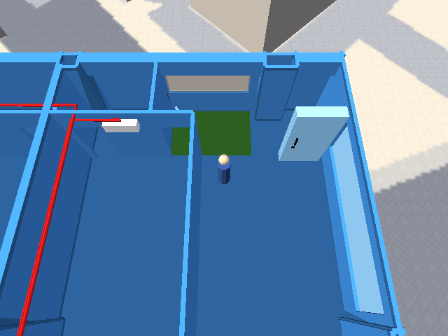 |
| spawned on the patio, open | spawned on the patio, closed |
| 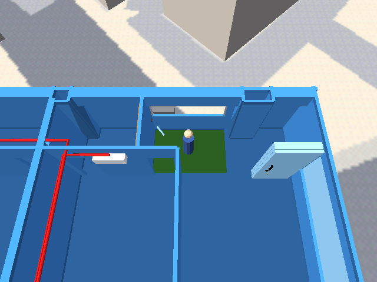 | 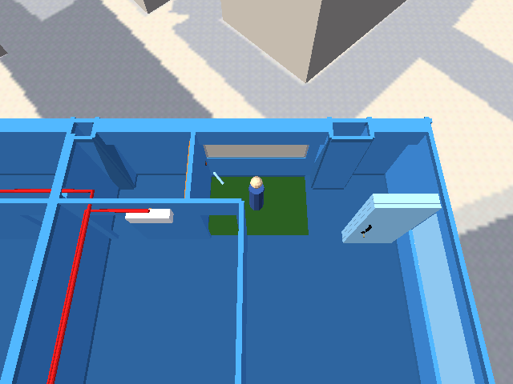 |
| spawned at 640's master window | the ledge over 640's west rooms |
| 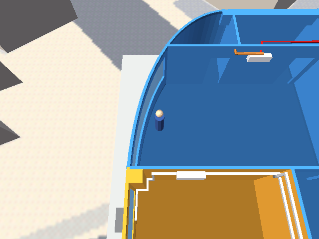 |  |
| grass seen from the project room (the step's riser faces away) | the façade ledge, overview |
| 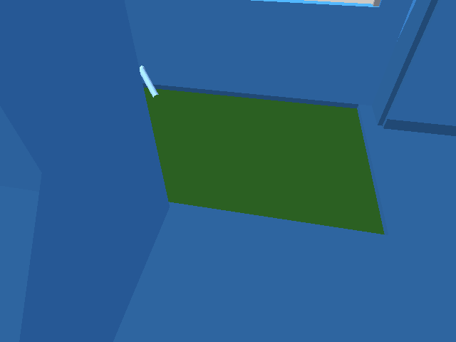 |  |

    The other camera suites on this build (door, teleport and camera controls; the camera suite then run twice more on this build and twice on HEAD's own level):

    ```
    $ for t in verify_condo_camera_controls verify_condo_door_button verify_condo_unit_teleport; do echo "=== $t"; python3 tests/$t.py 2>&1 | tail -3; done
    === verify_condo_camera_controls
    PASS: reload restores automatic walk 
    PASS: camera-reload script health 
    RESULT: ['walk restored after inspect', 'cardinal orbit 0', 'cardinal orbit 0.25', 'cardinal orbit 0.5', 'cardinal orbit 0.75']
    === verify_condo_door_button
    PASS  closed middle/right seam third blocks passage: x=6.47 final y=-2.159984 vs door plane -2.00
    PASS  closed right/fixed third blocks passage: x=7.1 final y=-2.159984 vs door plane -2.00
    RESULT: PASS
    === verify_condo_unit_teleport
    PASS: reload resets 640 entry 
    PASS: reload script health 
    RESULT: PASS
    [exit 0]

    === current build, run 1
    FAIL: cardinal orbit 0.25 
    FAIL: cardinal orbit 0.75 
    RESULT: ['cardinal orbit 0.25', 'cardinal orbit 0.75']
    === current build, run 2
    FAIL: controller zoom fallback 
    FAIL: opposing controls cancel 
    FAIL: azimuth wraps 
    FAIL: cardinal orbit 0.5 
    RESULT: ['controller zoom fallback', 'opposing controls cancel', 'azimuth wraps', 'cardinal orbit 0.5']

    (HEAD level, CONDO_TEST_LEVEL=condo_hd_base)
    === HEAD level, run 1
    PASS: cardinal orbit 0 
    PASS: cardinal orbit 0.25 
    FAIL: cardinal orbit 0.5 
    PASS: cardinal orbit 0.75 
    RESULT: ['reset restores automatic view', 'cardinal orbit 0.5']
    === HEAD level, run 2
    PASS: cardinal orbit 0 
    FAIL: cardinal orbit 0.25 
    PASS: cardinal orbit 0.5 
    FAIL: cardinal orbit 0.75 
    RESULT: ['reset restores automatic view', 'cardinal orbit 0.25', 'cardinal orbit 0.75']
    ```

    `verify_condo_camera_controls.py` is **timing-flaky, and was before this work**. Against HEAD's own level it failed different `cardinal orbit` checks in each of two runs; on this build, different subsets of its timed checks fail from run to run. The test writes the azimuth over the bridge and reads the derived offset 0.15 s later. `camera_controls.fth` is unchanged, and the failing checks run at the front door and in 640, away from anything built here. The door-button and unit-teleport suites pass. The camera suite's `reset restores automatic view` check now expects the doll-house shot, because there is no automatic window/patio shot left to restore; that check fails against HEAD's level, which still has the POV cuts, and passes here.

    Measured earlier the same day with the POV triggers still on (the evidence for Open question 10). This is camera height above the player over 4 s after a teleport to each patio position:

    ```
    today's level (CONDO_SHADE=0):
    == OFF (today's level) run 1
    closedness=0.0
    player y -1.50: camera−player dz min 1.700 max 1.928 last 1.700  camshot=31.0 cam.y=0.00
    player y -1.20: camera−player dz min 1.700 max 1.718 last 1.700  camshot=31.0 cam.y=0.30
    player y -0.60: camera−player dz min 1.700 max 1.714 last 1.700  camshot=31.0 cam.y=0.90
    player y -1.50: camera−player dz min 1.700 max 1.713 last 1.700  camshot=31.0 cam.y=0.01
    player y -1.20: camera−player dz min 1.656 max 1.717 last 1.700  camshot=31.0 cam.y=0.30
    == OFF (today's level) run 2
    closedness=0.0
    player y -1.50: camera−player dz min 1.702 max 3.792 last 1.702  camshot=31.0 cam.y=-0.00
    player y -1.20: camera−player dz min 1.700 max 1.715 last 1.700  camshot=31.0 cam.y=0.30
    player y -0.60: camera−player dz min 1.557 max 1.731 last 1.700  camshot=31.0 cam.y=0.90
    player y -1.50: camera−player dz min 1.700 max 1.715 last 1.700  camshot=31.0 cam.y=0.00
    player y -1.20: camera−player dz min 1.557 max 1.739 last 1.700  camshot=31.0 cam.y=0.30

    shade build, overhead parts at statplat Mass (as B.6):
    == SHADE build, open
    closedness=0.0
    player y -1.50: camera−player dz min 1.946 max 3.656 last 3.469  camshot=31.0 cam.y=-0.03
    player y -1.20: camera−player dz min 1.954 max 3.585 last 1.954  camshot=31.0 cam.y=0.28
    player y -0.60: camera−player dz min 1.701 max 1.928 last 1.701  camshot=31.0 cam.y=0.90
    player y -1.50: camera−player dz min 1.520 max 1.741 last 1.700  camshot=31.0 cam.y=0.01
    player y -1.20: camera−player dz min 1.700 max 1.719 last 1.700  camshot=31.0 cam.y=0.30
    == SHADE build, close
    closedness=1.0
    player y -1.50: camera−player dz min 1.529 max 3.564 last 3.263  camshot=31.0 cam.y=0.00
    player y -1.20: camera−player dz min 1.701 max 3.423 last 1.701  camshot=31.0 cam.y=0.30
    player y -0.60: camera−player dz min 1.520 max 1.757 last 1.700  camshot=31.0 cam.y=0.90
    player y -1.50: camera−player dz min 1.701 max 3.560 last 2.719  camshot=31.0 cam.y=0.00
    player y -1.20: camera−player dz min 1.724 max 3.577 last 1.724  camshot=31.0 cam.y=0.30

    shade build, CONDO_SHADE_OVERHEAD_MASS=0:
    == SHADE build, overhead Mass 0, open
    closedness=0.0
    player y -1.50: camera−player dz min 1.700 max 1.882 last 1.700  camshot=31.0 cam.y=0.00
    player y -1.20: camera−player dz min 1.700 max 1.716 last 1.700  camshot=31.0 cam.y=0.30
    player y -0.60: camera−player dz min 1.615 max 1.741 last 1.700  camshot=31.0 cam.y=0.90
    player y -1.50: camera−player dz min 1.700 max 1.719 last 1.700  camshot=31.0 cam.y=0.00
    player y -1.20: camera−player dz min 1.700 max 1.720 last 1.700  camshot=31.0 cam.y=0.30
    == SHADE build, overhead Mass 0, close
    closedness=1.0
    player y -1.50: camera−player dz min 1.700 max 1.724 last 1.700  camshot=31.0 cam.y=0.00
    player y -1.20: camera−player dz min 1.700 max 1.719 last 1.700  camshot=31.0 cam.y=0.30
    player y -0.60: camera−player dz min 1.700 max 1.717 last 1.700  camshot=31.0 cam.y=0.90
    player y -1.50: camera−player dz min 1.700 max 1.718 last 1.700  camshot=31.0 cam.y=0.00
    player y -1.20: camera−player dz min 1.700 max 1.717 last 1.700  camshot=31.0 cam.y=0.30
    == SHADE build, overhead Mass 0, open
    closedness=0.0
    player y -1.50: camera−player dz min 1.701 max 1.899 last 1.701  camshot=31.0 cam.y=0.00
    player y -1.20: camera−player dz min 1.700 max 1.718 last 1.700  camshot=31.0 cam.y=0.30
    player y -0.60: camera−player dz min 1.520 max 1.741 last 1.700  camshot=31.0 cam.y=0.90
    player y -1.50: camera−player dz min 1.700 max 1.722 last 1.700  camshot=31.0 cam.y=0.00
    player y -1.20: camera−player dz min 1.700 max 1.717 last 1.700  camshot=31.0 cam.y=0.30
    == SHADE build, overhead Mass 0, close
    closedness=1.0
    player y -1.50: camera−player dz min 1.700 max 1.719 last 1.700  camshot=31.0 cam.y=0.01
    player y -1.20: camera−player dz min 1.700 max 1.719 last 1.700  camshot=31.0 cam.y=0.30
    player y -0.60: camera−player dz min 1.700 max 1.718 last 1.700  camshot=31.0 cam.y=0.89
    player y -1.50: camera−player dz min 1.700 max 1.719 last 1.700  camshot=31.0 cam.y=0.01
    player y -1.20: camera−player dz min 1.700 max 1.719 last 1.700  camshot=31.0 cam.y=0.30
    ```

    **PASS.** There is no cut anywhere: `INDEXOF_CAMSHOT` stays on the doll-house shot on the patio (open and closed), at 640's master window, and across 439 samples while walking. The camera holds its 9 m offset. The view is never blocked, because the doll-house camera looks down from 9 m and the shade is in no automatic shot.

7. Pressing B (keyboard 2) within reach toggles the shade over about 2 s; a second press mid-travel reverses it smoothly; out of reach does nothing.

    ```
    $ python3 tests/verify_condo_balcony_shade.py
    PASS  wall switch beside the opening: 639_balcony_shade_switch.iff loaded
    actors: player=8 slat0=40 bar=48 camera=1
    PASS  loads open, slats parked in the cassette: target=0.0 closedness=0.0 slat0.z=15.90725 (want 15.9072) bar.z=16.763 (want 16.7630)
    PASS  steps down 6 cm onto the grass: project room (4.400, -3.200, 15.750) → balcony (4.409, -0.645, 15.690), drop 6.0 cm
    PASS  pony wall stops the player mid-span: held +Y from the balcony: (4.409, -0.320, 15.690) (pony wall inner face y −0.10)
    PASS  steps back up 6 cm into the project room: (4.392, -3.091, 15.750) vs room z 15.750
    PASS  south guide blocks: x=2.97: (3.314, -0.320, 15.690)
    PASS  north guide blocks: x=5.22: (5.219, -0.320, 15.690)
    PASS  north jamb blocks: x=5.52: (5.363, -0.320, 15.690)
    PASS  press in the project room ignored: target=0.0 reach=0.0
    PASS  press on the balcony beyond reach ignored (y −1.50 < −1.00): target=0.0 reach=0.0
    PASS  near press closes: target=1.0 reach=-1.0
    PASS  continuous travel: closedness sampled mid-travel=0.21315
    PASS  full close in about 2 s of level time: closedness=0.997536 after 1.9 s level time (2.03 s wall clock, incl. bridge polling)
    PASS  slats and bar land on their baked positions: slat0.z=15.75 bar.z=15.75 (want 15.75)
    PASS  mid-travel press reverses without a snap: before=0.704115 after=0.654115 final=1.0
    PASS  held press toggles once: target=0.0
    PASS  reopens and parks the slats again: closedness=0.0 slat0.z=15.90725
    PASS  doors open: B at shade reach (4.10, −0.60) moves shade only: shade target 0.0→1.0, door target 0.0→0.0
    PASS  doors open: B at door reach from the patio (7.25, −1.35) moves doors only: shade target 0.0→0.0, door target 0.0→1.0
    PASS  doors open: B at between the bands (4.10, −1.02) moves nothing only: shade target 0.0→0.0, door target 0.0→0.0
    PASS  doors closed: B at shade reach (4.10, −0.60) moves shade only: shade target 0.0→1.0, door target 1.0→1.0
    PASS  doors closed: B at door reach from the patio (4.10, −1.30) moves doors only: shade target 0.0→0.0, door target 1.0→0.0
    PASS  doors closed: B at between the bands (4.10, −1.02) moves nothing only: shade target 0.0→0.0, door target 1.0→1.0
    PASS  no camera cut, shade open, patio zone entry: camshots seen [5.0] (doll-house 5.0); camera − player = 9.0 (authored 9.0)
    PASS  no camera cut, shade open, patio: camshots seen [5.0] (doll-house 5.0); camera − player = 9.0 (authored 9.0)
    PASS  no camera cut, shade closed, patio zone entry: camshots seen [5.0] (doll-house 5.0); camera − player = 9.0 (authored 9.0)
    PASS  no camera cut, shade closed, patio: camshots seen [5.0] (doll-house 5.0); camera − player = 9.0 (authored 9.0)
    PASS  no camera cut at 640's master window: player at (-6.9, -4.4); camshots seen [5.0]
    PASS  no camera cut while walking onto the patio and back: 439 samples during the walks, camshots [5.0]
    RESULT: PASS
    [exit 0]
    ```

    **PASS.** A press in the project room does nothing, and so does one on the balcony beyond reach (y −1.50). A press within reach closes the shade in 1.9 s of level time (2 s by design), with continuous travel. A second press mid-travel reverses it from 0.70 without a snap, and a held press toggles once. Slats and bar land on their baked positions closed and park again when open.

7b. Pressing B in the shade's reach moves only the shade, and in the glass doors' reach only the doors, with the doors open and closed. *(Added 2026‑09‑30 at the coordinator's request.)*

    ```
    $ python3 tests/verify_condo_balcony_shade.py
    PASS  doors open: B at shade reach (4.10, −0.60) moves shade only: shade target 0.0→1.0, door target 0.0→0.0
    PASS  doors open: B at door reach from the patio (7.25, −1.35) moves doors only: shade target 0.0→0.0, door target 0.0→1.0
    PASS  doors open: B at between the bands (4.10, −1.02) moves nothing only: shade target 0.0→0.0, door target 0.0→0.0
    PASS  doors closed: B at shade reach (4.10, −0.60) moves shade only: shade target 0.0→1.0, door target 1.0→1.0
    PASS  doors closed: B at door reach from the patio (4.10, −1.30) moves doors only: shade target 0.0→0.0, door target 1.0→0.0
    PASS  doors closed: B at between the bands (4.10, −1.02) moves nothing only: shade target 0.0→0.0, door target 1.0→1.0
    RESULT: PASS
    (lines from the step-7 run above)
    ```

    **PASS.** The reach bands are disjoint by construction: the shade's is player y ≥ −1.00, 0.90 m from the pony wall's inner face, and the doors' ends at y ≤ −1.04, 0.85 m from the patio-side track. The build asserts this. Between the bands (y −1.02) a press moves nothing. The wall switch sits in the shade's band, on the south jamb at y −0.30, z 1.14.

8. **On site, before ordering:** measure the clear width at top, middle and bottom, the pony-wall cap level along its length, the face the pony wall is flush with, and the ledge's true height (Open questions 4–5, and the north jamb's plumb); update the constants.

    **Not run** — on site, before ordering.

