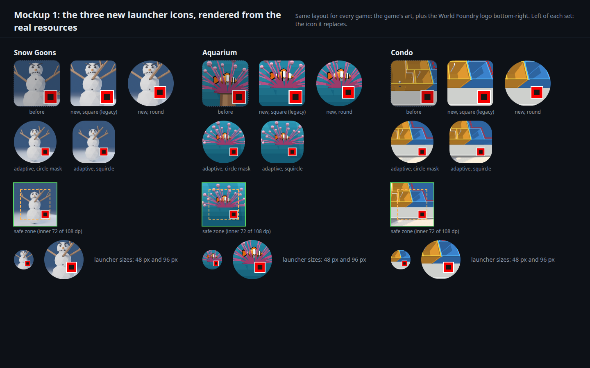
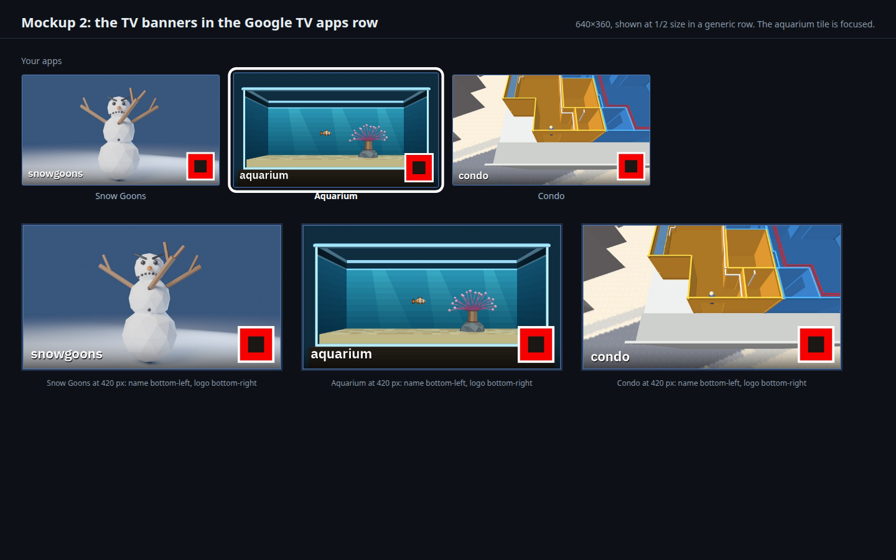
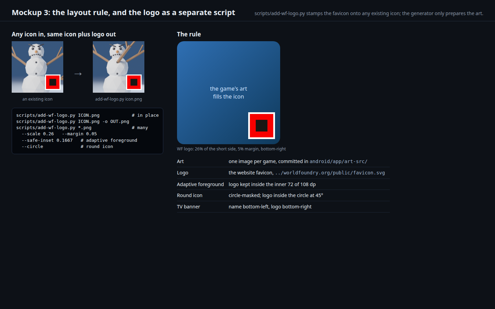

# New launcher icons and TV banners for the mobile and Chromecast games

Status: **art, scripts and resources generated; not yet built into an APK or seen on the Chromecast** (2026‑10‑01 12:10 (+07) = 05:10 UTC). Every Verification step says which.

- [x] Phase A: the art: a snowgoon, the aquarium's fish and anemone, a pulled-back condo
- [x] Phase B: the logo as a separate script, and one generator for every game's icons and banner
- [ ] Phase C: build the three APKs, look at the icons on the Chromecast's apps row and in an emulator or phone launcher
- [ ] Phase D: any other World Foundry game that ships on mobile follows the same layout (none yet)

## Request

From the user, 2026‑10‑01:

- **snowgoons:** "a snowgoon, obvs", and later: "these are 3-armed snowmen from calvin and hobbes (menacing, hence goons)", plus "i'm not sure there are any snowgoons actually in the level at the moment".
- **snowgoons, arms:** "3-armed snowgoons!!!", "all 3 arms should be in the upper torso area... cuz ARMS!", then "put it in the center, between the 2 regular arms".
- **aquarium:** "keep same except remove rock", then "i meant just the fish and anemone", then "remove the brown sleeve from the icon".
- **condo:** "pull camera back more to show more", then "for condo icon, show half and half at front of condos".
- **Every World Foundry game on mobile:** "keep the same design layout for all: icon representing the game PLUS a world foundry logo in the bottom-right. use favicon from ../worldfoundry.org/".
- **The logo as its own script:** "the worldfoundry logo should implemented as a separate script which can add the logo to any existing icon".
- Plan with rendered mockups of all three new icons, opened in the browser.

## Design

**The layout rule (all games):** the game's art fills the icon; the World Foundry logo sits bottom-right. Same for the legacy square icon, the round icon, the adaptive foreground and the TV banner (where the game's name goes bottom-left).

**The logo is a separate script.** [`scripts/add-wf-logo.py`](../../scripts/add-wf-logo.py) stamps the logo onto **any** existing PNG and knows nothing about games or flavors:

```
scripts/add-wf-logo.py ICON.png                 # in place
scripts/add-wf-logo.py ICON.png -o OUT.png
scripts/add-wf-logo.py a.png b.png c.png        # several
  --scale 0.26 --margin 0.05
  --safe-inset 0.1667      # an adaptive-icon foreground: keep the logo inside the launcher's safe zone
  --circle                 # a round icon: mask to a circle, logo inside it at 45 degrees
```

The logo is the website's favicon, `../worldfoundry.org/public/favicon.svg` (a red square with a dark square inside), rasterised by the script itself (rect-only SVGs, which is all the favicon is) with a thin white keyline so it reads on any art. The generator, [`scripts/gen-android-icons.py`](../../scripts/gen-android-icons.py), only prepares each game's art and calls it, so a future game, or a hand-made icon, gets the same logo with one command.

**The art, per game** (all committed in `android/app/art-src/`, so the output is deterministic):

| Game | Art | Made by | Notes |
|---|---|---|---|
| snowgoons | a menacing three-armed snowman, low-poly and flat-shaded | [`scripts/render-snowgoon.py`](../../scripts/render-snowgoon.py) (Blender, headless) | **The repository has no snowman mesh** (the level's actors are placeholder boxes), so this is **new original art** drawn from primitives: three snow balls, coal eyes under angled brows, a carrot nose, a jagged scowl, and **three stick arms, all on the torso** (nothing on the head or the back): one raised from each shoulder and the third from the **centre of the upper chest, between them**, angled steeply up and slightly toward the viewer in a forked hand (the user: it comes out of the centre of the torso, "but the arm doesn't need to point straight out"; it is kept clear of the face). Placements the user rejected: low on the right (the logo covers it), low on the left (not the torso), and rising behind the head (it read as hair on his head, and as an arm on his back). Two other chest placements were rendered as options (out to the right; a second arm on the left shoulder); this is the one closest to "in the center, between the 2 regular arms". **Source research, done late after the user pointed out it had not been:** in the Calvin and Hobbes arc (collected as "Attack of the Deranged Mutant Killer Monster Snow Goons") the goon is a snowman that packs more snow onto itself, grows bigger, then "adds a second head and a third arm", and Calvin names it a "deranged mutant killer monster snow goon" ([Black Gate's retelling](https://www.blackgate.com/2026/02/02/oh-those-deranged-mutant-killer-snow-goons/)). **Not verified:** where the third arm sits in the strips, and the goons' exact look (the fandom wiki refused the fetch). This art follows the user's placement, not a traced reference; nothing is copied |
| aquarium | just the fish and the anemone's crown: no rock, no sand and **no brown stalk ("sleeve")** | [`scripts/derock-aquarium-frame.py`](../../scripts/derock-aquarium-frame.py) on camshot B | removes the rock, the sand, and the brown stalk with its base ring and the dark disc under the crown, painting the water behind (each removed span is repainted with the water of the same row); the tentacles and the fish are untouched. **"Move the fish up a bit higher"** is done by cropping the icon lower (about 55 px of 920 on the source), which raises the fish in the icon now that there is plain water beneath instead of a stalk. Lifting the fish *relative to the anemone* was tried by editing the capture and failed (the tentacles pass in front of the fish, so it tears), and doing it properly means re-posing the fish in the engine and re-capturing; say so if that is what was meant **This edits a capture, it does not re-render the level** (the rock is part of the level; rebuilding it was not worth it for an icon). The banner still shows the whole tank, rock included, because the request was about the icon |
| condo | the doll-house with the camera pulled back and lowered | [`scripts/capture-condo-pullback.py`](../../scripts/capture-condo-pullback.py) (the engine, driven through the debug bridge) | holds the in-game zoom-farther and lower-angle buttons. **The game's own controls cap the camera** (about 12 m, 10.8 m high); the capture uses all of it, lowered so it also moves back horizontally. Going further needs a limit change in `wflevels/condo_639_640/camera_controls.fth` and a level rebuild: a decision for the user. A square icon cannot show a 16:9 view, so **the icon is cropped on the front of the building, centred on the boundary between the two units: half 639 (orange) and half 640 (blue)**; the banner shows the whole view |

The condo needs the six `--vram-*` flags on the desktop too (the capture script reads them from `android/app/src/condo/assets/wf_args.txt`).

The two old per-flavor generators (`gen-aquarium-android-art.py`, `gen-condo-android-art.py`) are superseded by the one generator.

### Mockups

These are rendered from the **real generated resources** (the files that go into the APK), not drawn.

[](2026-10-01-android-icons/icons.html)

**1. The three icons.** For each game: the icon it replaces, the new legacy square, the new round icon, the adaptive foreground under a circle and a squircle mask, the launcher's safe zone (green outline; the dashed box is the inner 72 of 108 dp, where the logo is kept), and the 48 and 96 px launcher sizes. [Open it](2026-10-01-android-icons/icons.html).

[](2026-10-01-android-icons/banners.html)

**2. The TV banners** in a generic Google TV apps row (the aquarium tile focused) and at 420 px: art, the game's name bottom-left, the logo bottom-right. [Open it](2026-10-01-android-icons/banners.html).

[](2026-10-01-android-icons/layout.html)

**3. The layout rule and the logo script**: any existing icon in, the same icon plus logo out. [Open it](2026-10-01-android-icons/layout.html). All three are regenerated by [`make_mockups.py`](2026-10-01-android-icons/make_mockups.py).

## Out of scope

- iOS and macOS icons (the same logo script can be run on them later).
- Splitting snowgoons into separate apps and a menu selector for `cd.iff`: two separate TODO items (below).
- Re-rendering the aquarium or condo levels for the icon art.
- Animated icons.

## Related TODO items (asked for in the same message)

The user guessed that "snowgoons on Chromecast" means the multi-level `cd.iff`. That is right: the snowgoons flavor bundles `wfsource/source/game/cd.iff` (several levels), while the aquarium and the condo each ship a one-level `cd.iff`. The two items:

1. **Split the multi-level `cd.iff` into one app per game.**
2. **Implement a menu selector for the multi-level `cd.iff`.**

They are listed in `TODO.md` unranked: a tier can only be added to `TODO.md` in a Fable session.

## Verification

Numbered, runnable steps; each shows its raw output with PASS or FAIL, or says what is pending.

1. The logo script, on its own: `scripts/add-wf-logo.py --help`, then stamp a test icon without touching the input.

    ```
    $ scripts/add-wf-logo.py ~/tmp/icons/snowgoon.png -o ~/tmp/icons/snowgoon-logo-test.png --scale 0.22
    wrote /home/will/tmp/icons/snowgoon-logo-test.png (768x768)
    ```

    **PASS** (the logo appears bottom-right, in the red-square favicon, with a white keyline).

2. The generator, all three games.

    ```
    $ scripts/gen-android-icons.py
    snowgoons: wrote tv_banner.png, 5 foregrounds, 5 legacy and 5 round icons under android/app/src/snowgoons/res
    aquarium: wrote tv_banner.png, 5 foregrounds, 5 legacy and 5 round icons under android/app/src/aquarium/res
    condo: wrote tv_banner.png, 5 foregrounds, 5 legacy and 5 round icons under android/app/src/condo/res
    ```

    **PASS**

3. The art itself (`Read` the images). Expected: a menacing snowman with three arms; the fish and anemone only, with no rock and no sand; the condo pulled back. **PASS** for all three: the snowman has its third arm in the centre between the two raised arms, all from the upper torso; the aquarium shows only the crown and the fish, with no stalk, and the fish sits higher in the frame; the condo icon is half orange and half blue at the front.

4. The mockups are rendered from the generated files and are the three pages above. **PASS** (`make_mockups.py`: icons 459 KB, banners 254 KB, layout 83 KB, each under the 512 KB limit).

5. `./gradlew :app:assembleSnowgoonsDebug :app:assembleAquariumDebug :app:assembleCondoDebug`. Expected: BUILD SUCCESSFUL; each APK's resources carry the new icons. **PENDING**

6. On the Chromecast: install the three apps and look at the apps row (a screenshot of the home screen). Expected: the three new tiles. **PENDING** (and the snowgoons release build is blocked by the missing soundfont, see the aquarium-Chromecast plan, Phase D; the debug build works)

7. A phone or emulator launcher: the adaptive and round icons under a real mask. **PENDING**

8. The icon checks in `tests/test_aquarium_android.py` and `tests/test_condo_android.py` still pass with the new art (sizes and colour counts).

    ```
    $ python3 -m pytest tests/test_aquarium_android.py tests/test_condo_android.py -q
    21 passed in 0.80s
    ```

    **PASS**

## Cost

None: local renders and builds.

## Delegation

| Work | Tier | Why |
|---|---|---|
| The art (a new snowman, the image edit, the camera capture) and the scripts | T5 | taste and judgement against the user's wording, done in this session |
| Building, running on the Chromecast, fixing any test that checks the old art | T2 | one pipeline against a settled design |
