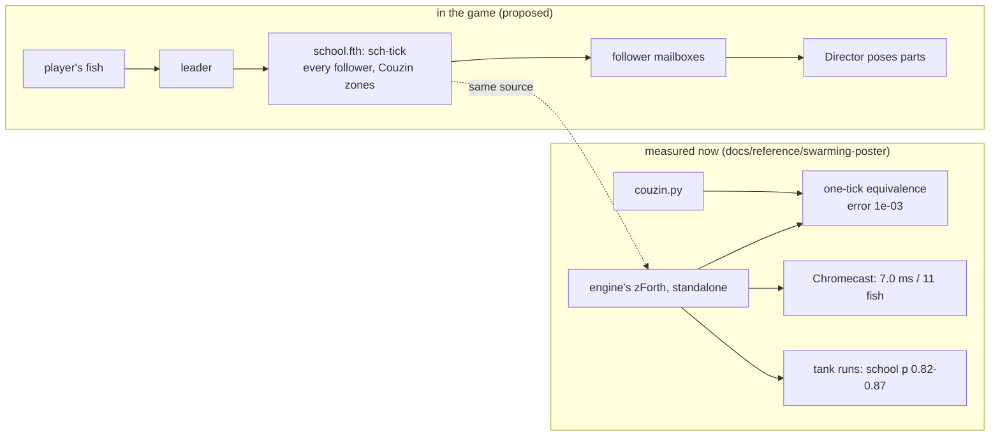
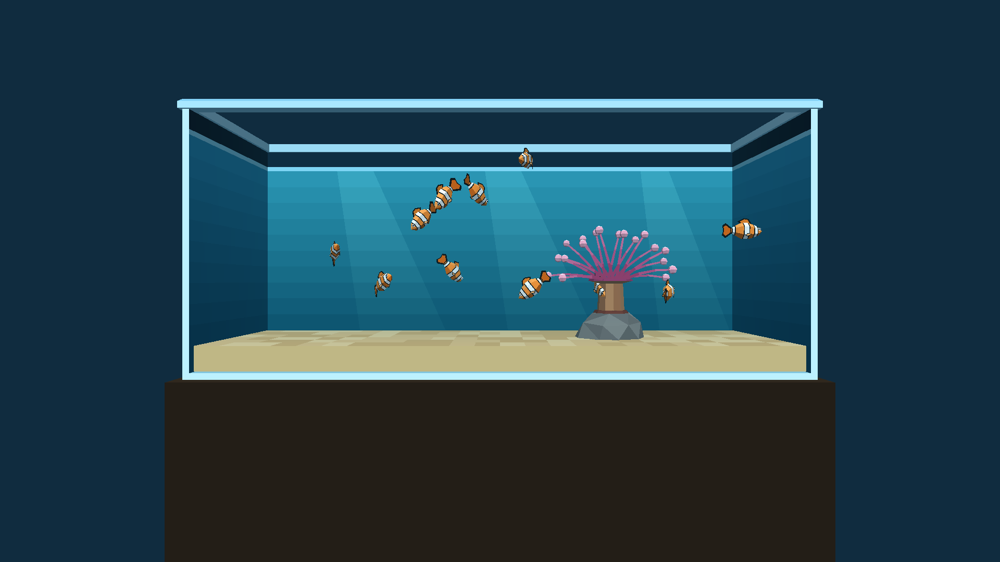
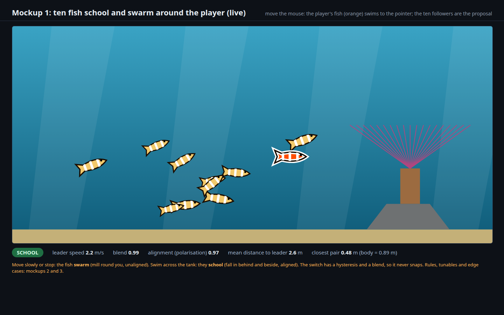
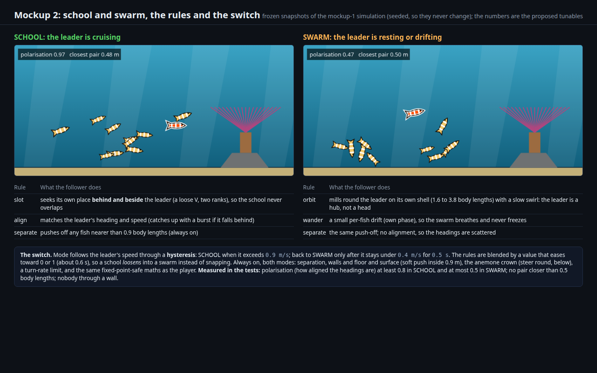
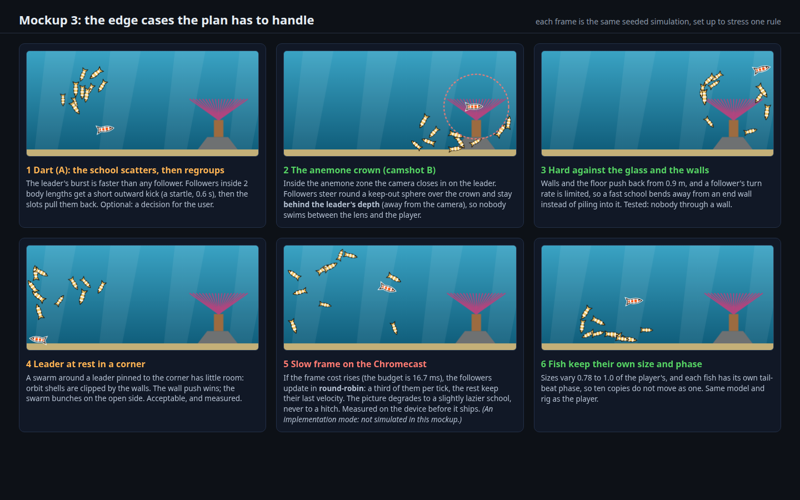

# Ten more fish that school and swarm around the player's fish

Status: **proposed** (2026‑10‑01 17:55 (+07) = 10:55 UTC, revised 18:40 after the user asked "did you research swarming before implementing anything?": **the first draft had not**, see § Research); nothing is built. The mockups are of the *behaviour* (a simulation in the tank's real proportions); the engine implementation is Forth. Tier ranks below are recommendations; ranking is set in `TODO.md` by a Fable session.

- [ ] Phase 0: measure first: ten **static** extra fish, what do they cost on Linux and on the Chromecast?
- [x] Phase 1: the fish rig made per-fish, and ten more fish in the level (**done 2026‑10‑01**)
- [~] Phase 2: the behaviour: **school** and **swarm** around the player, with the switch between them (**wired and running on the Chromecast 2026‑10‑01; untuned**)
- [ ] Phase 3: polish: sizes and phases, anemone and camera, optional startle
- [ ] Phase 4: tests, the Chromecast, the parity references

## Request

From the user, 2026‑10‑01: "**add 10 new fish. they should 'school' and 'swarm' based on the user-controlled player's fish**".

## What exists (read from the level, not assumed)

- **A fish is six actors** ([`clownfish.py`](../../wflevels/aquarium/clownfish.py)): the `Player` (class `player`, a kinematic Jolt character with an **invisible** hull) and five visible parts (`clownfish-body`, `-tail`, `-dorsal`, `-pec-near`, `-pec-far`), each an **anchored `platform`, Mass 0, with no Jolt body**. WF has no parent/child hierarchy, so the **Director's Forth script poses the five parts every tick** (`fish-rig-tick`: `write-actor-mailbox` by runtime actor index), reading the Player's X/Y/Z and the rig's input mailboxes.
- **The rig is written for exactly one fish.** Its actor indices are generated constants (`fish-actor-body` and so on) and its inputs (`fish-heading`, `-pitch`, `-roll`, `-yaw-rate`, `-speed`, `-burst`, `-brake`) are single global mailboxes in the `600..639` range. Mailboxes `700..719` and `740..759` hold the swim and camera state and `720..739` the anemone sway. **Ten more fish therefore need the rig to take a fish number**: this is the main refactor, not the flocking.
- **Why followers get no physics body.** Jolt capsules were the source of the pin-the-player and wall-push bugs in Phases 1 to 3 (the `statplat` lesson, `docs/plans/2026-09-30-aquarium-level.md`). Followers are visual only, like the five parts: steering keeps them apart, so they cost no physics and cannot pin or push the player.
- **Budget evidence.** The aquarium has **33 objects**; ten fish add 50 part actors, giving **83**, below the condo's **116**, which runs at **59.9 fps** on the Chromecast HD. The aquarium itself runs at 59.9 fps with 31 MB (release, 2026‑10‑01). The engine is fixed-point (16.16), the world scale is ×10 (the tank is 12.19 m wide, the fish 0.889 m long), and the zForth dictionary is 65536 cells (`docs/scripting-languages.md`). **None of this says what ten fish cost in Forth**, which is why Phase 0 measures before anything is designed further.
- Controls, camshot B (the camera closing in on the anemone) and the touch profile are unchanged by this plan: followers react to the leader's **speed and position**, not to buttons.

## Research (done after the first draft; the mockup rules were my own design, not the literature's)

The user asked whether swarming had been researched before anything was designed. It had not: the first draft's rules, speeds and the 0.8 and 0.5 polarisation targets came from general boids knowledge and were not sourced. What the literature says, checked against the sources (the poster is built: [the swarming poster plan](2026-10-01-swarming-poster.md)):

| Finding | Source | What it changes here |
|---|---|---|
| A **shoal** is a social aggregation of fish; a **school** is a *synchronised, polarised* shoal; they are points on a continuum from randomly oriented to polarised, with swarms among the intermediate forms | Pitcher (1983), as summarised in [Shoaling and schooling](https://en.wikipedia.org/wiki/Shoaling_and_schooling) and [From Schooling to Shoaling](https://journals.plos.org/plosone/article?id=10.1371%2Fjournal.pone.0048865) | the request's two words map onto polarised (school) and unpolarised (swarm) behaviour, which is what the plan's two modes are |
| The standard model, **Couzin, Krause, James, Ruxton & Franks (2002)**: three concentric zones round each individual, **repulsion** (r_r, highest priority), **orientation** (width Δr_o) and **attraction** (width Δr_a), a blind volume behind (field of perception 200 to 360°), a turning-rate limit, Gaussian error, a fixed time step (0.1 s). Repulsion alone if anyone is in it; otherwise the average of the orientation and attraction vectors | [Collective memory and spatial sorting in animal groups, J. Theor. Biol. 218:1–11](https://jmvidal.cse.sc.edu/library/couzin02a.pdf) (read from the PDF) | the plan's rules are replaced by **this model plus one leader term**; the zones, not two hand-made rule sets, make the modes |
| The model has **four collective states** that change **sharply** as the zone widths change: **swarm** (cohesive, low polarisation p_group, low angular momentum m_group), **torus** (milling round an empty core: low p, high m; small Δr_o, large Δr_a), **dynamic parallel group** (high p, low m), **highly parallel group** (very high p, rectilinear) | the same paper | "school" = a (highly) parallel group, "swarm" = the swarm state; and the **torus must be avoided or accepted knowingly**, because a swarm around a hub drifts into it |
| **Hysteresis (collective memory):** the state a group is in at a given parameter value depends on its history | the same paper | independent support for the plan's mode hysteresis; the switch is made by **moving the orientation-zone width**, not by swapping rule sets |
| **Metrics:** p_group = |Σ v_i| / N (alignment) and m_group = |Σ r_ic × v_i| / N (rotation about the centre), both 0 to 1 | the same paper, eqns 4 and 5 | the plan's "polarisation" is now exactly p_group, and the swarm test adds m_group so a torus cannot pass as a swarm |
| **Leadership:** a *small* proportion of **informed** individuals can guide a whole group, and the larger the group the smaller the proportion needed; uninformed individuals matter too | Couzin, Krause, Franks & Levin (2005), [Effective leadership and decision-making in animal groups on the move, Nature 433:513–516](https://www.nature.com/articles/nature03236) | the **player is the one informed individual** (1 in 11, about 9 %): followers get an explicit leader-weighted term, and a group of 11 is small enough that the weight must be strong, to be tuned against p_group |
| **Real ocellaris clownfish are not schooling fish:** they are strongly site-attached to a host anemone, territorial, and live in small size-ranked groups round it (the search results said nothing of schooling) | [Ocellaris clownfish](https://en.wikipedia.org/wiki/Ocellaris_clownfish), [Florida Museum](https://www.floridamuseum.ufl.edu/discover-fish/species-profiles/clown-anemonefish/) | ten schooling clownfish is a **game mechanic, not biology**; the plan says so, and decision 1 (which fish) gets this evidence |

Parameters verified from the paper (its Fig. 3, used for the swarming poster's figures too): N = 100, r_r = 1 unit, α = 270°, θ = 40° per second, s = 3 units per second, σ = 0.05 rad, 30 replicates per parameter pair; Δr_o and Δr_a each explored from 0 to 15. **Not yet checked:** how a model built for 100 individuals behaves with 10 followers and one leader (the paper explores N from 10 to 100, so 11 is at the edge), which is what the poster's own simulation and Phase 2 measure.

### Evidence from the Forth core (2026‑10‑01)

The rules above now **exist and run**: [`wflevels/aquarium/school.fth`](../../wflevels/aquarium/school.fth), tested against a numpy reference in the engine's own zForth, and printed on [the swarming poster](2026-10-01-swarming-poster.md). What it changes in this plan (all measured; the plan has the raw output):

| Was assumed | Now measured | Consequence |
|---|---|---|
| "Forth may be too slow; a C++ fallback may be needed" | **2,936 bytes**; **7.0 ms for one 11-fish step on the Chromecast HD** (about 0.7 ms a follower), interpreter only | not too slow: round robin of two followers a frame costs about 1.4 ms. **Not yet measured inside the engine**, so the C++ question stays open until Phase 0 |
| Speeds in metres at ×10, the tank 12.19 m wide | the tank's **inside is 13.4 × 3.4 × 4.7 body lengths**: only 3.4 deep | work in body lengths; the school lives in a slab |
| The paper's turn rate (40°/s at 3 body lengths a second) | a 90° turn then needs 6.75 body lengths: fish leave the tank | **2 body lengths a second, 120°/s**, a 0.6 body-length wall zone (ours, not the paper's) |
| The leader pulls the group | followers school with each other (p_group 0.82 to 0.87) but align with the leader only +0.12 to +0.18, at weight 1, 3 and 6 | the leader weight, and probably a longer-range leader term, **must be tuned in Phase 2**; in open space a group that loses the leader never regains it |
| "Swarm" and "torus" settings give clean states | with 11 fish, swarm p_group 0.27 to 0.51, torus setting 0.58 to 0.64: not the paper's 100-fish states | the swarm test ("p low **and** m low") needs thresholds set from the engine's own runs |

**Mailboxes:** the core needs 200 global mailboxes (800 to 1009; the aquarium owns 600 to 759); the map, drawn from a real run, is in [the swarming poster plan](2026-10-01-swarming-poster.md#mailboxes-where-the-state-lives). The ten followers' *rig* mailboxes are an open item there.

The mockups below were drawn with the first draft's hand-made rules (slot, align, orbit); they show the *shape* of the two modes and the edge cases, not these rules or these numbers.

### Built and running on the Chromecast (2026‑10‑01)

`AQUARIUM_SCHOOL_N=10` builds the level with **ten more clownfish** (`wflevels/aquarium_school`, git-ignored): `school.fth` (the Couzin model) plus [`school_rig.fth`](../../wflevels/aquarium/school_rig.fth) (the glue). The rig is now per-fish (**Phase 1, done**): every rig mailbox goes through `fish-off`, so one rig poses the player (offset 0) and each follower (its own 40 mailboxes at `1100 + 40 (k - 1)`, its own five part actors). The followers share the player's five meshes, so they add 50 part actors and **no assets**. **Phase 2, the behaviour, is wired:** the player's fish is the leader, the mode (school above 1.0 body lengths a second, swarm below 0.45, blended) moves the zone width, and followers are updated **two a frame** (a full step every five frames) while all ten are posed every frame.

| On the real Chromecast HD, release build | Result |
|---|---|
| Frame pacing with the school | **59.9 fps median**, p90 33.4 ms, worst 50 ms (the plain aquarium: p90 16.7) |
| Director script per tick | **10.2 ms** (worst 12.7 ms): the player's rig, the camera, the sway, the school, ten rigs |
| Mailbox bridge | 0.28 µs a call, about 300,000 calls a second |

**The user's review of the first Chromecast run (2026‑10‑01), and what the plan now says:**

1. **"Do they actually school? They don't seem to interact."** Not demonstrated, so **not claimed**. The model passed its tests in the standalone interpreter and in the tank runs, but nobody had measured the *real level*: the followers' alignment, spacing and response to the leader on the engine. Two causes are already known and are being fixed: the game's logic rate fell to **30 ticks a second** (the Director script took 10.2 ms a tick, so the frame ran at 30 fps while the display still presented 60), and `school.fth` was told a step is 0.083 s when the real interval between a follower's updates was twice that, so the school ran at half speed. The measurement is `scripts/analyse-aquarium-school.py` (p_group, m_group, nearest-neighbour distance, alignment with the leader, school against swarm).
2. **Sizes: the ten followers vary from 60 % to 93 % of the player's fish** (a fixed spread: 0.60, 0.64, …, 0.93, assigned in a scrambled order so neighbours differ). Done by scaling each follower's five part actors and their offsets.
3. **The school becomes the default aquarium app: yes (decided by the user).** The level builder's `AQUARIUM_SCHOOL_N` defaults to 10 (0 turns it off); the tracked level, `cd.iff` and APK carry the school; the tests' object counts become 33 + 50 = 83.

**Not done, plainly:** the followers **do not avoid the anemone** (one swims through the crown in the screenshot), the startle is not wired to the dart, all ten are the same size, the leader weight and thresholds are untuned (the tank runs showed a weak lead), camshot B's cone is not kept clear, and only some frames are smooth (p90 33 ms). It is **not the default aquarium app yet**: the school level is built separately and was installed from a throwaway worktree.

## Design

### Behaviour: the Couzin zone model with a leader, two regimes

**Revised after the research above.** The followers run the **Couzin 2002 rules** (repulsion first; otherwise the mean of the orientation and attraction directions; error; a turning-rate limit), with the **player as an informed leader** that every follower weights. **School vs swarm is made by moving the orientation-zone width** (and the leader weight), the way the paper's states change, instead of swapping two hand-made rule sets. The table and the mockups below are the **first draft's behaviour, kept as the picture of the intended *shape***; Phase 2 replaces its rules with the model and checks it against the same targets. The player's fish is the **leader**. The ten followers have no goal of their own; everything they do is relative to the leader. Two modes, blended:

| | **SCHOOL** (the leader is cruising) | **SWARM** (the leader is resting or drifting) |
|---|---|---|
| Shape | a loose V behind and beside the leader, in two ranks, aligned | a cloud milling round the leader: the leader is a hub, not a head |
| Rules | **slot** (each fish seeks its own place behind and beside the leader), **align** (match the leader's heading and speed, bursting to catch up), separate | **orbit** (a private shell of 1.6 to 3.8 body lengths, a slow swirl with alternating direction), **wander** (a small per-fish drift, its own phase), separate |
| p_group (alignment) and m_group (rotation) | p_group high (a number to be set against the model's own runs, first guess 0.8) | p_group low **and** m_group low (a swarm, not a torus) |

Always on in both: separation (a push-off inside 0.9 body lengths), the walls, floor and surface (a soft push inside 0.9 m), a keep-out sphere over the anemone crown, a turn-rate limit, and the same fixed-point-safe maths as the player.

**The switch is a hysteresis plus a blend.** SCHOOL begins when the leader exceeds **0.9 m/s**; SWARM returns only after it stays under **0.4 m/s for 0.5 s**. A single value eases toward 0 or 1 (about 0.6 s) and weights the two rule sets, so a school *loosens* into a swarm and never snaps. This mirrors the camshot-B zone, which already uses a hysteresis.

### Where it lives

All in Forth, in the Director, after `fish-rig-tick`: a `school-tick` entry point, the same way `aq-camera-tick` and `aq-sway-tick` are entered. Per-follower state (position, heading, pitch, speed, plus the rig inputs the existing rig already needs) lives in a **block of mailboxes per fish** (a stride, in a free range above `759`, to be confirmed against the mailbox limit in Phase 0). The constants and the actor-index table are **generated by `blender_create_aquarium.py`**, like every other generated Forth constant. The tunables above are Forth constants in one place, not scattered numbers.

- **Deterministic.** A fixed-seed generator (an LCG in a mailbox), no wall clock, so two runs trace identically and the tests can compare them.
- **Cheap on purpose.** Flocking decisions run **round-robin, a third of the fish per tick**, while the rig poses all ten every tick; each fish has about 55 pair distances to check at worst. If Phase 0 shows Forth is too slow for even that, the fallback is a **native Forth word** (`school-step`) that does the pair loop in C++; that is an engine change, so it is a decision for the user, not a default.
- **A build switch**, `AQUARIUM_SCHOOL_N` (default 10, **0 = none**), in the same style as `AQUARIUM_PROFILE`. Tests that need the lone fish (the idle-rig test, the icon capture script) build with 0.

### The fish themselves

**Default: ten more ocellaris clownfish, the same model and rig as the player**, with sizes 0.78 to 1.0 of the player's and a private tail-beat phase each, so ten copies do not move as one. All ten share the five part meshes of the player (the level file references the same mesh files; Phase 0 confirms the exporter allows it). Different species would need new models and rigs: see the decisions below.

### Camera and the anemone

Inside the anemone zone the camera closes in on the leader (camshot B). Followers **steer round a keep-out sphere over the crown** and, while the leader is in the zone, drift to the **far side of the leader's depth (away from the lens)**, so nobody swims between the camera and the player. The mockup simulation includes both rules.

### What changes outside the level

- **Reference images.** `tests/fixtures/renderer/aquarium-linux-frame20.png` (and the macOS Metal parity gate that compares against it) will go stale the moment fish are added: they are regenerated deliberately, in the same commit as the level change. The porting-status page's aquarium screenshots show one fish and need a note or a refresh.
- **Icon art.** `scripts/capture-aquarium-fish-high.py` (the launcher icon's capture) builds with `AQUARIUM_SCHOOL_N=0`, so the icon stays the fish and the anemone.
- **Android and Chromecast** need nothing new: it is the same IFF, the same Forth. The aquarium APK grows by 50 actor records.

### Mockups

**1. Ten fish school and swarm around the player (live: move the mouse).** The simulation implements the rules above in the tank's real proportions; the leader is the orange fish with the white outline. Stop moving and they swarm; swim across the tank and they fall in behind you. The readout shows the mode, the blend, the polarisation and the closest pair. The picture is frozen mid-cruise: **SCHOOL, polarisation 0.97**, closest pair 0.48 m. [Open the live mockup](2026-10-01-aquarium-schooling/live-sim.html).

**2. The two modes, their rules and the switch**, with two frozen snapshots of the same seeded simulation (SCHOOL 0.78 to 0.97 and SWARM 0.47 polarisation in these runs) and the proposed numbers. [Open it](2026-10-01-aquarium-schooling/modes.html).

**3. The edge cases:** a dart and the optional startle, the anemone crown and the camera, the walls, a leader pinned in a corner, a slow frame (an implementation mode, not simulated), and the size and phase variety. [Open it](2026-10-01-aquarium-schooling/edge-cases.html). All three are regenerated by [`make_mockups.py`](2026-10-01-aquarium-schooling/make_mockups.py).

**What the mockup does not prove.** It is JavaScript in floating point with a 2D side view; the engine is fixed-point Forth in 3D. It shows the *shape* of the behaviour and the *numbers worth testing*; the real polarisation, spacing and cost are measured on the engine (Verification).

## Decisions asked of you

1. **Which fish?** The default is **ten more clownfish** (cheapest, the rig exists), **but real ocellaris clownfish do not school** (they hold a host anemone and live in small size-ranked groups round it): schooling clownfish is a game mechanic. A naturally schooling reef fish would be more truthful. New species (for example small schooling fish) mean new models, rigs and a second set of part actors: a separate plan. Say if that is what you meant by "10 new fish".
2. ~~**Startle on a dart (A)?**~~ **Decided by the user ("sure"): yes.** The school scatters for 0.6 s, then regroups: a short outward kick for followers within 2 body lengths, then the zones pull them back. A Verification step is added for it.
3. **May followers shelter in the anemone** (clownfish do) when the leader rests in the crown, or is the crown a keep-out? The plan keeps it a keep-out so the camera shot stays clean.
4. **Is ten fixed?** The plan makes it a build constant (`AQUARIUM_SCHOOL_N`), allocated statically, so the number can be tuned without rewriting anything.

## Out of scope

- Predators, feeding, breeding, more than a build-time constant of followers, and followers that are not clownfish (a separate plan).
- Jolt bodies or real collisions for followers.
- Sound or haptics for the school (the [SFX plan](2026-10-01-sfx-without-lua.md) and the phone controller could hook in later).
- A C++ flocking implementation, unless Phase 0 forces it (then it is a decision). **What that means:** if Forth proves too slow for ten fish on the Chromecast, the ladder is (1) stay in Forth and update a third of the fish per tick (already planned); (2) add **one native Forth word** (for example `school-step`) in `engine/stubs/scripting_zforth.cc`, where `write-actor-mailbox` and the other bridge words are numbered `sys` calls in `zf_host_sys`, doing only the pair loop in C++ while the script keeps the tunables, the mode switch, the rig and the posing; (3) a full C++ flock actor class, which is not recommended. Option 2 is a small change to the **shared engine**, so it touches all four platforms and needs its own C++ tests: that is why it is the user's call, with the Phase 0 numbers in hand, and not a default.

## Risks

| Risk | Why | Step |
|---|---|---|
| Forth is too slow for ten fish on the Chromecast | the aquarium's one fish runs at 59.9 fps, but the cost of ten rigs plus flocking in zForth has never been measured | 1, 12 |
| The rig refactor breaks the player's fish | the player's idle rig and steering share the code | 3 |
| Mailbox space | ten fish need a stride of mailboxes above `759`; the level's limit has not been checked | 1, 2 |
| The behaviour looks wrong in 3D fixed point | the mockup is floating point and 2D | 5, 6, 7 |
| Followers spoil camshot B | a fish between the lens and the player | 9 |
| Reference images go stale | the macOS parity gate compares frame 20 | 14 |

## Verification

Numbered, runnable steps; each stays **PENDING** until its raw output is pasted under it with PASS or FAIL. Times in 24-hour form.

1. **Phase 0, the measurement. Partly done 2026‑10‑01: the Forth core was timed inside the engine on the Chromecast** ([results](2026-10-01-swarming-poster.md#phase-e-step-1-the-forth-inside-the-engine-on-the-chromecast): 39 to 43 ms a tick at first, **an engine bug** (a per-call debug stream in the mailbox path, 4.2 µs a call) found and fixed, then 11.3 ms and 59.9 fps with all ten followers updated every tick). **Still to do:** the cost of ten extra *static* fish (50 part actors) and the free-mailbox count, as written below. Build the level with ten static extra fish (parts only, no AI, the rig posing them in place); `python3 wflevels/aquarium/run_aquarium_checks.py --cost`. Expected: the frame cost on Linux against the baseline (the committed number is 11.1 ms for one fish); the number of free mailboxes above `759`; whether ten actors may share the player's five mesh files. **PENDING**
2. The level builds with `AQUARIUM_SCHOOL_N` of 10 and of 0. `tests/test_aquarium_level.py` extended: the object count is 33 + 50 = 83 (and 33 with 0), actor names are unique, the generated actor-index table matches the runtime indices, and the mailbox strides do not overlap `600..759`. **PENDING**
3. The refactor does not change the player: `tests/test_aquarium_idle.py` and the existing steering traces (`run_aquarium_checks.py --steer`) give the same numbers as before. Expected: identical, or the differences listed. **PENDING**
4. Determinism: two runs of the harness with the same input trace the followers identically (every fish, every tick). **PENDING**
5. SCHOOL: the leader cruises for 3 s at its normal speed. Expected: p_group of the followers (Couzin eqn 4) at least 0.8 for the last second; no pair closer than 0.5 body lengths; every follower within 6 body lengths of its slot. **PENDING**
6. SWARM: the leader rests for 5 s. Expected: p_group at most 0.5 **and m_group (eqn 5) low, so it is a swarm and not a torus**; the mean distance to the leader between 1.6 and 3.8 body lengths; no pair closer than 0.5 body lengths. **PENDING**
7. The switch: the leader's speed is driven across the thresholds and held near them. Expected: at most one mode change per crossing (no flapping), and the blend moves smoothly (no step larger than the per-tick limit). **PENDING**
7b. The startle: the leader darts (A) with the school behind it. Expected: followers within 2 body lengths are kicked outward for about 0.6 s, no pair ends closer than 0.5 body lengths, and the school regroups to p_group at least 0.8 within a few seconds. **PENDING**
8. Walls, floor and surface: the leader is held against each wall for 10 s, and dives and climbs. Expected: no follower's box outside the tank limits, ever. **PENDING**
9. Camshot B: the leader rests in the crown for 10 s. Expected: no follower inside the keep-out sphere and none in the cone between the camera and the leader (checked every tick), and a screenshot of camshot B for the plan. **PENDING**
10. The touch profile and the keyboard profile both still run (`task aquarium-touch-level`, `task aquarium-level`). **PENDING**
11. Linux frame cost with ten fish against the baseline, from `--cost`. Expected: a number recorded honestly; it sets the budget for step 12. **PENDING**
12. **On the Chromecast HD, release build**, `scripts/android-device-run.sh --app aquarium --release --seconds 45 --poke --resume`. Expected: alive, no crash; frame pacing median 16.7 ms and p90 at most 33.4 ms (today: p90 16.7, worst 16.7); total memory within 10 MB of today's 31 MB; the school and the swarm on screenshots. If it misses, the round-robin share is lowered before anything else is changed. **PENDING**
13. Both modes seen on the real device with the D-pad: swim across (they school), stop (they swarm). Evidence: two screenshots and a short note. **PENDING**
14. The parity references: `tests/test_renderer_references_fresh.py` and the macOS gate in `codemagic.yaml` pass after the references are regenerated in the same commit. **PENDING**
15. Codemagic `android-apk-debug`, `macos-desktop-debug` and `ios-simulator-debug` green. **PENDING**

## Cost

None: local builds and device runs, a few free Codemagic Mac-minutes per run. No paid service.

## Delegation

| Work | Tier | Why |
|---|---|---|
| Phase 0: the measurement | T2 | one level build and one script run, a number out |
| Phase 1: the per-fish rig and the level build (generated constants, mailbox strides, 50 actors) | T4 | cross-cutting Forth shared with the player; a wrong turn breaks the player's fish |
| Phase 2: the school-tick (the rules, the switch, the fixed-point maths) | T4 | non-obvious behaviour in a fixed-point script, tuned against measured traces |
| Phase 3: polish (sizes, phases, startle, anemone and camera rules) | T3 | settled design, several files |
| Tests and the harness steps (5 to 9) | T3 | against a settled plan |
| The device run and the reference refresh | T2 | scripted, with a recorded verdict |
| The decisions above and the final look | T5 | the user's taste |
