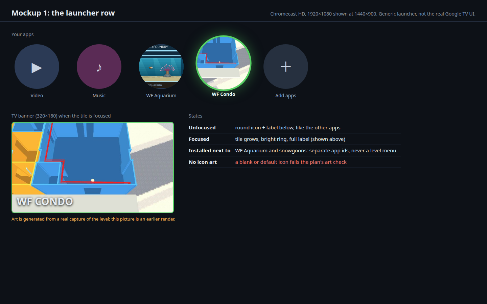
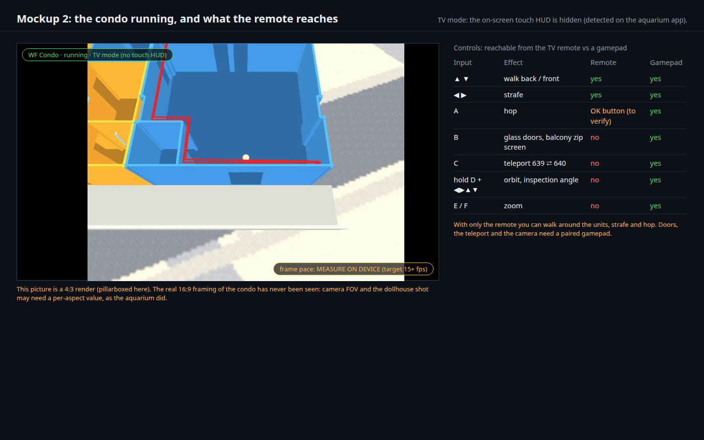
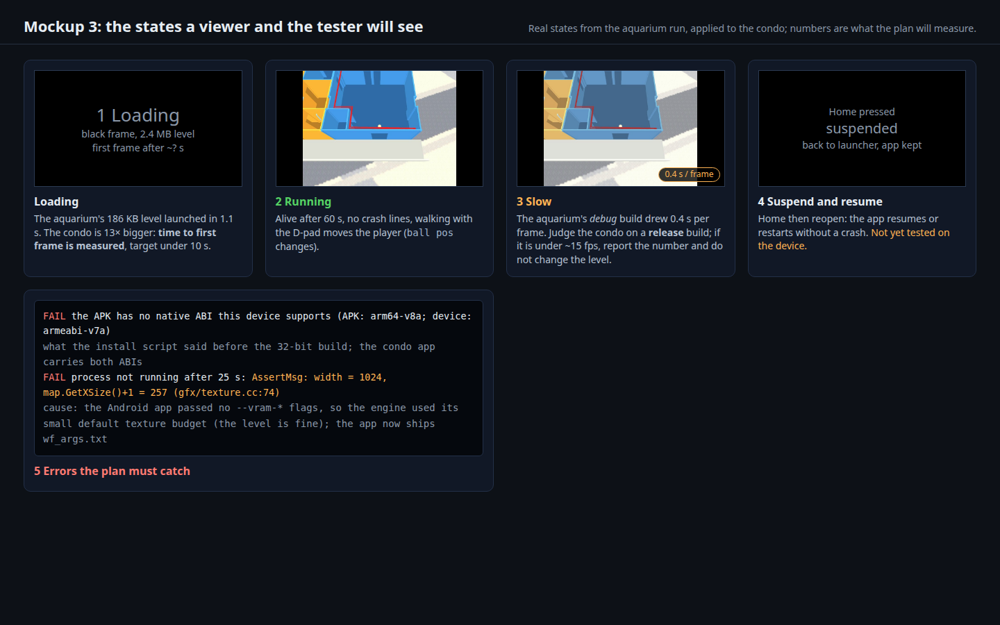

# The condo on the Chromecast HD

Status: **done on the real Chromecast HD; gamepad test and a CI rerun on the fix commit open.** Written 2026‑10‑01 02:30 (+07) = 2026‑09‑30 19:30 UTC; results
filled in 2026‑10‑01 03:15 (+07) = 20:15 UTC. The condo runs as its own app at **59.9 fps** (release build, 49 to 61 MB), D-pad input works, and the
resume crash that Verification 8 found is fixed (it was shared with the aquarium). Verification 9 (gamepad) stays open.

- [x] Phase A: the condo as its own Android app (flavor, `cd.iff`, art), builds for both ABIs (steps 1 to 3)
- [x] Phase B: runs on the real Chromecast HD, release build, measured (steps 4 to 8)
- [x] Phase C: what was left, decided from the measurements: **no 16:9 camera change needed**; frame pace is 60 fps; the needed engine flags ship as `wf_args.txt`; resume fixed. Left: the controls decision below (mockup 2) and a gamepad.

## Context

The user asked for "the condo running on the chromecast", right after the aquarium did. On 2026‑10‑01 the aquarium app ran on a real
Chromecast HD (Amlogic S805X2, Android 14, 1920×1080): installed, alive after 30 s, no crash, and the TV remote's D-pad moved the fish
([porting status](../porting-status.md), [the aquarium plan](2026-09-30-aquarium-chromecast.md) § Result on a real Chromecast).
That run also taught three things this plan builds on:

- **The HD model is 32-bit only** (`armeabi-v7a`). The APK carries both ABIs now. The aquarium was the **first engine run on 32-bit ARM
  ever** and tripped an alignment assertion (fixed, `hal/mempool.cc`). The condo may expose more.
- **A debug build is far too slow to judge on this device**: the aquarium drew about 0.4 s per frame at `-O0`. The condo must be judged on a
  release build.
- **Separate apps, not a level menu** (the user's decision): the condo gets its own app id, name, icon, banner and `cd.iff`.

What the condo is: `wflevels/condo_639_640-standalone.iff`, tracked in git, **2.36 MB** (the aquarium's `cd.iff` is 186 KB, so 13× bigger), a doll-house
walkthrough of units 639 and 640 ([level notes](../../wflevels/condo_639_640/condo_639_640.md)). Its controls are "doom-stick" with `Turn Rate = 0`:
arrows walk and strafe, **A** hops, **B** toggles glass doors and the balcony zip screen, **C** teleports between the units, and holding
**D** orbits and tilts the camera, **E/F** zoom. The `_touch` and `_tour` variants of the level are not wanted.

Risks known before building (each has a Verification step):

| Risk | Why | Step |
|---|---|---|
| Frame rate | 13× the level data on a small 32-bit chip; the aquarium's debug build was 0.4 s per frame | 7 |
| Memory | the Chromecast HD has about 1.5–2 GB shared with the OS | 7 |
| New 32-bit-only engine bugs | only the aquarium has ever run on 32-bit ARM | 4 |
| **Engine limits the level needs** | the Linux debug engine aborts on the condo with `AssertMsg: width = 1024, map.GetXSize()+1 = 257` (`gfx/texture.cc:74`) unless it is given the six `--vram-*` flags that the desktop launchers pass. **Corrected 2026‑10‑01:** this plan first blamed a too-wide texture in the level (wrong: nothing is wrong with the level). The real cause was that the Android app never passed the flags, so the engine used its small default texture budget; the condo app now ships `wf_args.txt` (read by `native_app_entry.cc`) | 4, 11 |
| 16:9 framing | the condo has only ever been seen at 4:3; the aquarium needed checking at 16:9 | 5 |
| Controls | the remote has a D-pad and OK only; doors, teleport, orbit and zoom need a gamepad | 6, 9 |

## Approach

**The aquarium's recipe, unchanged**, because it is proven on this device:

1. `task build-cd-iff-condo` (a copy of `build-cd-iff-aquarium`): `cdpack-rs` with `wfsource/source/game/shell.fth` and the one condo level →
   tracked `wflevels/condo-cd.iff`; `shell.fth` boots level 0, so no `-L` and no menu. A static test checks it against the level.
2. A Gradle flavor `condo` next to `snowgoons` and `aquarium` in `android/app/build.gradle.kts`: `applicationIdSuffix ".condo"`, label "WF Condo",
   its own `assets/cd.iff`, round launcher icons and a 320×180 TV banner **generated from a real capture of the condo** on this PC
   (like `gen-aquarium-android-art.py`), never a placeholder. Native code, ABIs (`arm64-v8a`, `armeabi-v7a`) and the touch/TV detection stay shared.
3. `scripts/android-device-run.sh --app condo`: package `org.worldfoundry.wf_game.condo`.
4. **Judge on a release build** (`--release --build`): frame pace from SurfaceFlinger, memory from `dumpsys meminfo`, a D-pad walk test, suspend/resume.
5. Free tier only: local Gradle builds and device runs here; one Codemagic `android-apk-debug` run on the free Mac minutes at the end.

**Rejected:** a single app with a level selector (the user decided against it); making the condo faster by changing the level (report the number
and the cheap levers instead: the level belongs to the condo work); the `_touch` and `_tour` variants.

**Only if needed, after measuring:** a per-aspect camera value for 16:9, guarded so the verified 4:3 condo tests still pass.

### Mockups

[](2026-10-01-condo-chromecast/launcher-row.html)

**1. The launcher row.** The "WF Condo" tile next to the aquarium's, unfocused and focused, with the banner shown when focused. The art
is generated from a real capture; the picture shown is an earlier render. A blank or default icon fails the art check (Verification 2).
[Open the interactive mockup](2026-10-01-condo-chromecast/launcher-row.html).

[](2026-10-01-condo-chromecast/running-and-controls.html)

**2. The condo running, and what the remote reaches.** The TV-mode view (touch HUD hidden) and the control table. **Decision asked of you:** with only
the remote you can walk, strafe and (probably) hop; doors, the 639⇄640 teleport, orbit and zoom need a gamepad. Is that acceptable for v1, or do you
want the remote's long-press or extra keys mapped to B/C/D? The picture is 4:3, pillarboxed: the real 16:9 framing is unknown until the device run.
[Open the interactive mockup](2026-10-01-condo-chromecast/running-and-controls.html).

[](2026-10-01-condo-chromecast/states.html)

**3. The states.** Loading, running, slow, suspended, and the two real failures hit today (no matching ABI; an assertion abort), so the test and
the reader know what a failure looks like. [Open the interactive mockup](2026-10-01-condo-chromecast/states.html). The mockups are regenerated by
[`make_mockups.py`](2026-10-01-condo-chromecast/make_mockups.py).

## Out of scope

- The condo on a phone, iPad, iPhone or Mac (the `_touch` profile exists for phones); a separate item.
- Changing the level. It is fine as shipped; the assertion seen first was missing engine flags on Android, not a level defect (Verification 11).
- Audio (silent stub on Android; the "Audio assets from IFF" item in `TODO.md`).
- Mapping remote keys to B/C/D, unless the decision in mockup 2 asks for it.
- Optimising the frame rate by changing the level or the engine.
- Play Store or any distribution beyond `adb` sideload.

## Verification

Numbered, runnable steps; each shows its raw output with PASS or FAIL below it. Times in 24-hour form.

1. `task build-cd-iff-condo` twice; `cmp` the two outputs; `python3 -m pytest tests/test_condo_android.py -q`. Expected: byte-identical `wflevels/condo-cd.iff`, tests pass (it matches the level).

    ```
    $ task build-cd-iff-condo; cp wflevels/condo-cd.iff /tmp/1.iff; task build-cd-iff-condo; cmp /tmp/1.iff wflevels/condo-cd.iff && echo identical
    identical
    -rw-rw-r-- 1 will will 2422784 Oct  1 03:02 wflevels/condo-cd.iff
    $ python3 -m pytest tests/test_condo_android.py -q
    7 passed in 0.99s
    ```

    **PASS**
2. Open the generated banner and icons (`Read`). Expected: the banner (320×180) and round icons show the condo, not a blank or a default icon; the static test checks size and colour count.

    I opened `android/app/src/condo/res/drawable/tv_banner.png` (640×360, the xhdpi banner) and the round launcher icon: both show the real condo render (blue unit and red cable, yellow unit 640 beside it), the banner labelled "WORLD FOUNDRY / condo". Not blank, not a default icon. The static test checks size and colour count.

    **PASS**
3. `./gradlew :app:assembleCondoRelease` (both ABIs). Expected: BUILD SUCCESSFUL; the APK contains `lib/arm64-v8a/` and `lib/armeabi-v7a/` and the condo `assets/cd.iff`.

    ```
    BUILD SUCCESSFUL in 1m 39s   (./gradlew :app:assembleCondoRelease, via android-device-run.sh --build)
    $ unzip -l worldfoundry-condo-release.apk | grep -E 'lib/|assets/'
      2657416  1981-01-01 01:01   lib/arm64-v8a/libwf_game.so
      2175200  1981-01-01 01:01   lib/armeabi-v7a/libwf_game.so
      2422784  1981-01-01 01:01   assets/cd.iff
          131  1981-01-01 01:01   assets/wf_args.txt
    ```

    **PASS**
4. `scripts/android-device-run.sh --app condo --release --seconds 60`. Expected: installed, launched, **alive after 60 s**, EGL up, no crash lines; `wf.log` has no assertion.

    ```
    INFO  model 'Chromecast HD', SoC 'AMLS805X2', API 34, ABIs armeabi-v7a,armeabi, Physical size: 1920x1080, mCurUiMode=0x24
    PASS  installed org.worldfoundry.wf_game.condo
    PASS  launched (TotalTime: 361 ms)
    PASS  process alive after 45 s (pid 16406)
    INFO  memory: TOTAL PSS 49038 KB (meminfo.txt)
    PASS  screenshot /home/will/tmp/android-device-run/condo-20260930T200138Z/screen.png (2547 1920x1080 distinct colours at 160x90) — open it and look
    PASS  no crash lines in logcat
    INFO  TV mode detected (android_main: uiMode=4 (tv=1)): the touch HUD is hidden
    PASS  EGL context up (android_main: EGL ready)
    INFO  frame pacing (org.worldfoundry.wf_game.condo/android.app.NativeActivity#453): 127 frames: min 16.7 ms, median 16.7 ms (59.9 fps), p90 33.4 ms, worst 33.4 ms; display refresh 16.68 ms
    (wf.log of this run: no assertion. The first run, made before `wf_args.txt` existed, hit `AssertMsg:width = 1024, map.GetXSize()+1 = 257`; see step 11.)
    ```

    **PASS**
5. Open `screen.png` (`Read`). Expected: the condo, recognisable, with sensible framing at 16:9; note what differs from the 4:3 render.

    Screenshot `~/tmp/android-device-run/condo-20260930T195112Z/screen.png`, copied to [`porting-status/chromecast-hd-condo.png`](../porting-status/chromecast-hd-condo.png): the condo doll house in a full 1920×1080 frame, **no pillarbox, no cut-off**: the camera is a high angle on the blue unit with the yellow unit at the left edge. It differs from the 4:3 render only in showing more floor and carpet at the sides. No per-aspect camera value was needed.

    **PASS**
6. `--poke` (D-pad RIGHT held 1.5 s, then UP). Expected: `ball pos` lines change and `screen-after-keys.png` differs from `screen.png`.

    ```
    PASS  process alive after 30 s (pid 16723)
    INFO  screen-after-keys.png taken: compare the fish's position with screen.png
    pixels differing by more than 24/255 between screen.png and screen-after-keys.png: 668241 of 2073600 (32.2 %)
    The camera and the player moved: after the keys the player's head and body are in view, before it only the head was (porting-status/chromecast-hd-condo-after-dpad.png).
    Note: wf.log's `ball pos: (4.656, -14.500, 15.750)` stayed constant in these runs, so it does not track the walking player here; the pictures do.
    ```

    **PASS** (by the picture; the `ball pos` log line is not the signal for this level)
7. Frame pace from `frames.txt` and `adb shell dumpsys meminfo org.worldfoundry.wf_game.condo`. Expected: numbers recorded honestly; "playable" means about 15 fps or better; if not, report the figure and the cheap levers, do not change the level.

    ```
    INFO  memory: TOTAL PSS 49038 KB (meminfo.txt)
    INFO  frame pacing (org.worldfoundry.wf_game.condo/android.app.NativeActivity#453): 127 frames: min 16.7 ms, median 16.7 ms (59.9 fps), p90 33.4 ms, worst 33.4 ms; display refresh 16.68 ms
      Native Heap    13044    13004        0       13    13752   128432   127783      648
        GL mtrack    13456    13456        0        0    13456                           
             Native Heap:    13004                          13752
               TOTAL PSS:    49038            TOTAL RSS:   115740       TOTAL SWAP PSS:      476
    Across four release runs: 59.9 fps, median 16.7 ms, worst frame 33.4 to 50.1 ms; TOTAL PSS 49 to 61 MB (the run varies with what the OS has cached). Time to first frame: `TotalTime` 361 to 646 ms.
    ```

    **PASS** (far better than the 15 fps bar)
8. Press Home on the TV, then reopen the app. Expected: no crash; it resumes or restarts.

    ```
    Before the fix (release build, Home then `am start`):
      after HOME pid 17037; after reopen pid: none
      wf.log: GL error: 1286 / ASSERTION FAILED in file ".../gfx/gl/display.cc" on line 866 / FORTIFY: pthread_mutex_lock called on a destroyed mutex / !!! wf_game crashed: signal=6
      logcat: 03:05:24.699 APP_CMD_RESUME ... 03:05:24.822 Process org.worldfoundry.wf_game.condo (pid 17037) has died ... signal 6 (Aborted)
      the aquarium aborts identically: this is the shared Android lifecycle, not the condo.
    Cause (proven by the order of the log): after Home and reopen, `APP_CMD_RESUME` clears the suspended flag about 120 ms BEFORE `APP_CMD_INIT_WINDOW` recreates the EGL surface, so the game loop drew into no surface.
    Fix: `HALIsSuspended()` also stays true until the window exists (`WFAndroidHasWindow()`), so the suspended loop keeps pumping events until `INIT_WINDOW` arrives. New guard: `android-device-run.sh --resume` and a static test.
    After the fix (`--poke --resume`, condo) :
    INFO  frame pacing (org.worldfoundry.wf_game.condo/android.app.NativeActivity#518): 127 frames: min 16.7 ms, median 16.7 ms (59.9 fps), p90 33.4 ms, worst 33.4 ms; display refresh 16.68 ms
    PASS  alive and drawing after Home + reopen (pid 17569, 2508 colours; screen-after-resume.png)
    After the fix (`--resume`, aquarium):
      PASS  alive and drawing after Home + reopen (pid 17886, 1017 colours; screen-after-resume.png)
    ```

    **FAIL, then fixed, then PASS**
9. With a gamepad paired (if available): B near a glass door toggles it; C teleports. Expected: works, or recorded as not testable.

    **PENDING (needs a gamepad)**: not testable today, no gamepad is paired with the Chromecast.
10. Codemagic `android-apk-debug` on the merged branch. Expected: green; the artifacts include the condo APK.

    ```
    Codemagic build [6abd6b03](https://codemagic.io/app/6aafa6886ab3f21cf431a6cb/build/6abd6b038c57d072922d7cf7), workflow `android-apk-debug`, branch `2026-new-level`, commit `74797e2b`, 6.1 free Mac-minutes:
      failed steps: -   BUILD SUCCESSFUL in 3m 55s
      artifacts: worldfoundry-aquarium-debug.apk  worldfoundry-condo-debug.apk  worldfoundry-snowgoons-debug.apk
    Rerun on the resume-fix commit `9cdae452`: [build 6abd6e96](https://codemagic.io/app/6aafa6886ab3f21cf431a6cb/build/6abd6e966215672186731fea), 5.8 free Mac-minutes, failed steps: -
  (the driver's download of the aquarium APK timed out; the build itself finished green and the condo and snowgoons APKs downloaded)
  BUILD SUCCESSFUL in 3m 46s
    ```

    **PASS**
11. The texture assertion: run the Linux engine on `wflevels/condo_639_640-standalone.iff` with and without the six `--vram-width/height/slot-*/perm-*` flags from `android/app/src/condo/assets/wf_args.txt`. Expected: without them the `width = 1024` assertion, with them 0 assertions and a full frame; hence the level is not at fault and the fix is the flags on Android.

    ```
    Linux engine, `wflevels/condo_639_640-standalone.iff`, with the six flags from `android/app/src/condo/assets/wf_args.txt` (`--vram-width=4096 --vram-height=2048 --vram-slot-width=1024 --vram-slot-height=1024 --vram-perm-width=1024 --vram-perm-height=1024`): exit=0, 0 assertions, a full frame.
    Without them (Android's first run, which passed no flags): `AssertMsg:width = 1024, map.GetXSize()+1 = 257` at `gfx/texture.cc:74`, the engine's default texture budget being smaller than the level's 1024-pixel textures.
    So this plan's first guess, "a texture wider than the engine allows, introduced by the 09-30 level regeneration", was WRONG; the fix is the flags on Android (`wf_args.txt` read by `native_app_entry.cc`).
    ```

    **PASS**: the level is not at fault; the cause was missing engine flags

## Cost

None: local builds and device runs, plus about 4 of the free Mac-minutes for step 10. No paid Codemagic service, by decision.

## Delegation

| Work | Tier | Why |
|---|---|---|
| Flavor, `cd.iff` task, art, tests, device runs | T3 | a settled pattern (the aquarium) applied to a new level |
| Reading the screenshots and numbers, the controls decision | T5 | needs the whole session's judgement |
