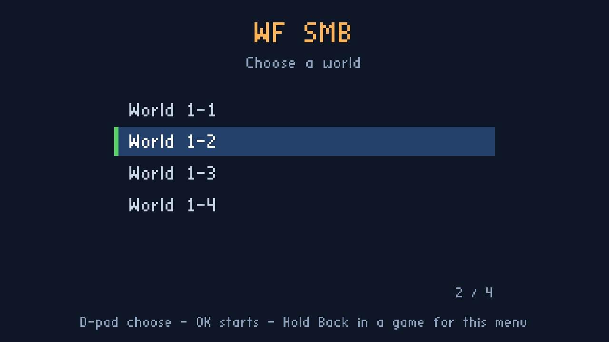
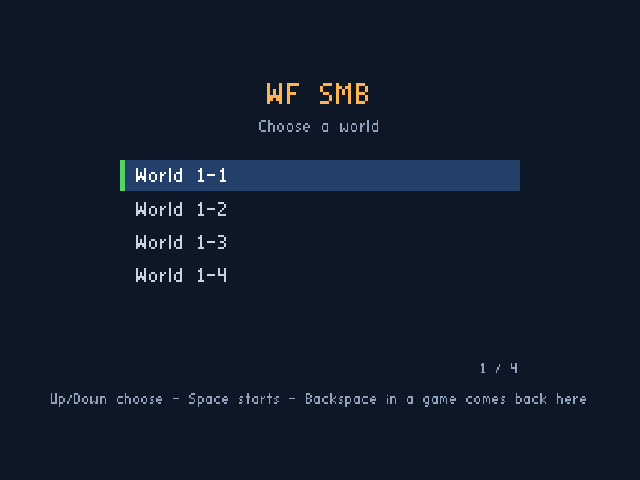
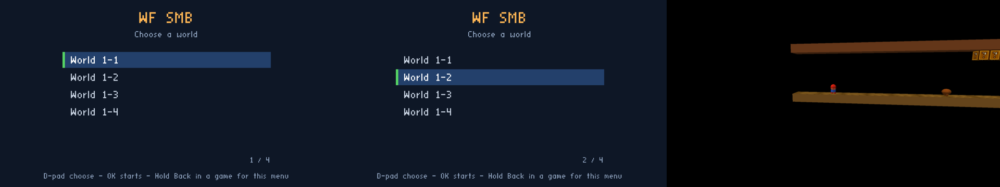

# A level menu for multi-level bundles (SMB world select first)

Status: **built: desktop and the `smb` app on the Chromecast HD; the remote's Back held waits for the user's check** (2026‑10‑01 22:55 (+07) = 15:55 UTC; accepted
for SMB at 22:05, the user: "let's do it for smb"). TODO item: "Implement a menu selector for the multi-level `cd.iff`" (pick a level at launch instead of
booting level 0, as the alternative or addition to separate apps). Each Verification step says PASS, FAIL or PENDING once run.

- [x] ~~Phase A: this plan and its mockups~~ (`924e73a9`, `b754c2de`)
- [x] ~~Phase B: level names as data: `cdpack --manifest` writes a `MENU` chunk; bundles without a manifest stay byte for byte as they are~~ (`69f32d9d`)
- [x] ~~Phase C: the SMB menu on the desktop: a portable menu module, the engine glue, the desktop drawer, `shell-menu.fth`, the opt-in task, tests with
  no device, Backspace back to the menu~~ (`69f32d9d`, `e6a275b8`)
- [x] ~~Phase D: the menu in the `smb` Android app: the Android drawer, Back held on the remote, the flavor's bundle, a screenshot from the
  Chromecast HD~~ (`a40da0de`; on the TV: the menu, D-pad, OK and a level start; Back held is built but only the user can check it)
- [ ] Later, one manifest away: the desktop bundle of all seven levels (shown in the mockups, not built now)

## Use cases

1. **SMB world select (primary, being built).** After the [one-app-per-game split](2026-10-01-split-cd-iff-one-app-per-game.md), `smb` is the one app
   with several levels: `wflevels/smb-cd.iff` holds W1‑1 to W1‑4, `shell.fth` boots W1‑1, and the flagpole and axe ActBoxes chain W1‑1 → W1‑2 → W1‑3 →
   W1‑4 → W1‑1 in an endless loop. A world select lets the player start at any of the four; the chain then carries on from there. It must work with the
   Chromecast remote alone (D-pad and OK) and with a gamepad.
2. **The desktop bundle (second, not built now).** `wfsource/source/game/cd.iff` holds all seven levels (the four SMB worlds, snowgoons, Q\*bert, Astra
   Marble Madness) and always starts in Mario. The same mechanism with a seven-line manifest and one more task.

The menu is opt-in: a new task builds the menu bundle; `build-cd-iff`, `build-cd-iff-smb`, their outputs and `shell.fth` stay byte for byte unchanged.

## How a level is chosen today

`WFGame::RunGameScript` (`wfsource/source/game/game.cc`) loads the TOC from sector 0 of `cd.iff`, then loops: run the `SHEL` Forth script once, load TOC
level `_desiredLevelNum`, run it until it ends, repeat. The shell runs to completion before each level; it has **no frame loop, no drawing and no input**.
`_desiredLevelNum` is the system mailbox **5000** (`LEVEL_TO_RUN`). `shell.fth` writes 0 to it on the first pass only (persistent mailbox 6000 is the
"already booted" flag); after that only the levels write it (the SMB flagpoles write 1, 2, 3 and the axe 0, each with `END_OF_LEVEL`, mailbox 1905).
Death and game over set `END_OF_LEVEL` only, so the same index reloads. The split plan's audit lists every writer.

`cdpack-rs` lays out the bundle: sector 0 is `GAME` + `TOC` (12 bytes per entry: tag, offset, size) + `ALGN`; sector 1 is `SHEL`; each level follows,
sector-aligned. The engine finds level `n` as TOC entry `1 + n`.

## Options considered

| Option | Verdict |
|---|---|
| A. Forth shell menu, drawn with engine primitives | rejected |
| B. Engine/HAL overlay, like the phone panel | **chosen** |
| C. A menu level authored as an IFF | rejected |

**A. A Forth shell menu.** The shell runs once between levels, with no frame loop, no renderer and no joystick. A menu there needs an engine frame loop
for the shell plus new Forth words for text, rectangles and input: more engine change than B for a worse result (the names would sit in a Forth list, or
need a chunk-reading word anyway).

**B. An overlay drawn by the engine.** A portable module (`wfsource/source/game/level_menu.{h,cc}`) holds the menu logic and turns it into a list of solid
rectangles, text included (`stb_easy_font`, already vendored and used by the HUD and the phone panel). The engine runs it in a small frame loop between the
shell and the level when the shell asks for it; each platform only draws rectangles. This is how the phone-controller panel already works
(`hal/phonepad/phonepad_overlay.cc` builds `PhonepadRect`s; `gfx/gl/android_window.cc` uploads them only when they change and draws them with the touch
HUD's shader), so the Android drawer is mostly reuse, and the logic is tested the same way: compiled on Linux with a tiny host `main` and a fake clock.

**C. A menu level.** A level with text actors and a script that reads the stick and writes `LEVEL_TO_RUN`. The engine has no text actor (the HUD is C++),
so the names would be textures baked by the Blender pipeline: not "from data" without a level rebuild per name change, heavy to build and slow to boot.

**Why B.** It is the only option where the names come straight from the bundle, the logic is testable without a display, and no level or level script
changes. Its cost is a small hook in `game.cc` and one drawer per platform (desktop now, Android in Phase D).

## Design

### Names as data: the `MENU` chunk

- `cdpack` gains `--manifest <file>`. Without it, the code path and the output are unchanged (Verification 1 pins this against the tracked bundles).
- The manifest is plain text, one level per line, in TOC order, paths relative to the manifest's directory:

  ```
  # wflevels/smb-menu.manifest
  title WF SMB
  prompt Choose a world
  level smb_w1_1-standalone.iff | World 1-1
  level smb_w1_2-standalone.iff | World 1-2
  level smb_w1_3-standalone.iff | World 1-3
  level smb_w1_4-standalone.iff | World 1-4
  ```

- With a manifest, `cdpack` writes the same `GAME`/`TOC`/`SHEL`/levels layout and appends **one more TOC entry, `MENU`, after the last level**, so every level
  keeps its index and the level scripts' `LEVEL_TO_RUN` writes still mean the same levels (the SMB chain keeps working). The chunk:

  ```
  'MENU' u32 payload_size
    u32 version (1)   u32 level_count   u32 entry_count
    u16 title_len  title bytes   u16 prompt_len  prompt bytes
    entry_count x { u32 level_index  u16 name_len  name bytes }
  ```

  little-endian, zero-padded to the next sector like a level. Names are printable ASCII (the font has nothing else), 1 to 60 characters; `cdpack` refuses
  anything else, an empty manifest, and a manifest given together with level paths.
- The SMB manifest keeps `smb-cd.iff`'s TOC order, so the menu bundle's levels sit at the same indices.
- **Found while building:** a Forth `-1` reaches the engine as **−2**. Forth cells are floats, and the float build's `Scalar::WholePart` floors with
  `int(s - 1.0)` for negatives (`math/scalar.hpi`), so −1.0 becomes −2. The engine therefore treats any negative `LEVEL_TO_RUN` as "ask the player"
  (the first run asserted `_desiredLevelNum >= 0` with the value −2).

### The shell: `shell-menu.fth`

A new file next to `shell.fth` (which is not touched). On the first pass it writes **−1** to `LEVEL_TO_RUN` instead of 0. −1 means "ask the player": no
level or shell writes it today, and the engine asserts `>= 0`, so the value is unused.

### The engine glue (`game.cc`)

- In the `RunGameScript` loop, after the shell and the `-l` override: if `_desiredLevelNum == -1`, run the menu and use its answer.
- The menu reads sector 0 itself and looks for the `MENU` TOC entry (no `DiskTOC` change). No `MENU` chunk, or a platform with no menu drawer: level 0 and
  a line on stderr. One entry: start it, no menu.
- The menu loop: read joystick 1, update the menu, build its rectangles, `RenderBegin`, draw, `RenderEnd`, `PageFlip` (which pumps the window's events).
  The level starts only after every button is released (or after 1.5 s), so the OK that chose World 1‑3 does not also make Mario jump.
- The chosen index goes to `_desiredLevelNum` (the `LEVEL_TO_RUN` mailbox); the menu prints `level-menu: LEVEL_TO_RUN=<n> (<name>)` on stderr, and while a
  menu bundle runs each level start prints `level-menu: level <n> starts`.
- The cursor starts on the last level picked when the menu comes back.
- The rectangles are `PhonepadRect`s (pixels, top-left origin, `0xRRGGBBAA`), so Android can draw them with the phone panel's existing path.

### Input on each platform

All of it arrives as the same joystick bits, so the menu reads one thing:

| Source | Move | Start |
|---|---|---|
| Chromecast remote | D-pad up/down | OK (mapped to A) |
| Gamepad | D-pad or stick | A |
| Phone controller | stick | A |
| Desktop keyboard | arrows, I/K | Space or 1 (A) |

The phone's mask is merged into the same `_HALSetJoystickButtons` call as the remote and the gamepad (`native_app_entry.cc`), so the phone works wherever
the menu runs. The `smb` app ships without the phone controller (a split-plan decision), so there it is the remote and gamepads.

### Back to the menu

Engine-side, no level script change: while a menu bundle's level runs, a **return request** sets `LEVEL_TO_RUN` to −1 and ends the level through the
existing `ContinueRequested()` path (the one the designer "level aborted" cheat already uses), and the loop reaches the menu again. The request comes
from a HAL call, not from a joystick bit, so no game loses a button (holding B is how Mario runs):

- Desktop: **Backspace** (unmapped today). Escape stays "quit".
- Chromecast remote (Phase D): **Back held for 1 s**. A short Back keeps its meaning (leave the app). Built in `native_app_entry.cc`, active only once a
  menu has been shown (`levelmenu::MenuRunning()`): the decision uses the key event's own down time on release, so it works whether or not the remote
  sends key repeats, and a repeat past 1 s fires it early; a short press calls `ANativeActivity_finish`, which is what the system's Back does.
- "When a game ends" is not generic: game over only reloads the same level today (`END_OF_LEVEL`), so returning to the menu on game over needs each
  level to say so. Follow-up, not in this design.

### Test and automation input: `--menu-input=`

`wf_game --menu-input=down,down,a,wait:90,back,up,a,quit` replays a script, one token per frame (with a released frame between presses), into the menu and,
during levels, the `back`/`quit` requests. It makes the real engine testable end to end on the desktop with no keystrokes injected into the session.

### Look and operation

[](2026-10-01-level-menu-selector/default.html)
[](2026-10-01-level-menu-selector/moved.html)
[](2026-10-01-level-menu-selector/scrolling.html)

[](2026-10-01-level-menu-selector/long-name.html)
[](2026-10-01-level-menu-selector/remote-hint.html)
[](2026-10-01-level-menu-selector/one-level.html)

- A full-screen dark panel (nothing is loaded behind it yet), the title and prompt from the manifest, up to six rows, the chosen row on a blue bar with a
  green edge, "N / M" under the list, arrows when rows are hidden above or below, and a hint line at the bottom.
- Designed on a 1920×1080 canvas and scaled to the surface, like the phone panel (720p on the Chromecast HD).
- Up and down move one row; held, they repeat after 400 ms every 120 ms; the cursor stops at the ends (no wrap). A (OK) starts the level.
- A name wider than the row is cut and ends in `...`.
- The hint is per platform: TV "D-pad choose - OK starts - Hold Back in a game for this menu"; desktop "Up/Down choose - Space starts - Backspace in a game
  comes back here".

### Defaults the user should confirm

| Choice | Default |
|---|---|
| Menu vs split apps | addition: the split apps stay; the menu goes into `smb` |
| `smb` app | ships the menu bundle (Phase D) |
| SMB names | title "WF SMB", "World 1‑1" to "World 1‑4" |
| Look | text only, no screenshots or icons |
| Back to the menu | Backspace (desktop), Back held 1 s (remote) |
| Navigation | clamp at the ends, no wrap |
| Desktop seven-level menu | not built now; Marble Madness last if it is |

The names are placeholders; the project owns neither "Super Mario Bros." nor "Q\*bert" (the split plan's app labels are placeholders too).

## Files

| File | Change |
|---|---|
| `wftools/cdpack-rs/src/main.rs` | `--manifest`, `MENU` chunk, `-h` |
| `wflevels/smb-menu.manifest` | new: four worlds, title, prompt |
| `wflevels/smb-menu-cd.iff` | new: the built SMB menu bundle |
| `wfsource/source/game/shell-menu.fth` | new: writes −1 |
| `wfsource/source/game/level_menu.h`, `.cc` | new: portable menu |
| `wfsource/source/game/level_menu_host.cc` | new: host `main` for tests |
| `wfsource/source/game/game.cc`, `game.hp` | menu hook, return request |
| `wfsource/source/game/main.cc` | `--menu-input=` |
| `wfsource/source/gfx/gl/display.cc` | desktop drawer (fixed-function GL) |
| `wfsource/source/gfx/gl/mesa.cc` | Backspace: return request |
| `Taskfile.yml` | appended: `build-cd-iff-smb-menu`, `run-smb-menu`, `test-level-menu` |
| `tests/test_level_menu.py`, `tests/level_menu_harness.py` | new |

`level_menu_host.cc` lives in the game directory, which CMake globs for every platform, so it compiles to nothing unless the harness defines
`WF_LEVEL_MENU_HOST`. The committed `smb-menu-cd.iff` follows the pattern of the other bundles (Android assets need a tracked file); a test rebuilds it
and fails when it is stale.

Commands:

```
task build-cd-iff-smb-menu      # -> wflevels/smb-menu-cd.iff, or CD_OUT=<path>
task run-smb-menu               # wf_game on the SMB menu bundle, the menu first
task test-level-menu            # python3 -m pytest tests/test_level_menu.py -v
```

## Cost

About 1 200 lines in all, a third of them tests; no infrastructure, no new dependency, no Codemagic minutes. The bundle is about 580 KB (the four levels
plus one sector). Phase D adds one APK rebuild of the `smb` flavor and a screenshot on the Chromecast HD.

## Risks

- **Engine glue on every platform.** `game.cc` and `level_menu.cc` compile on Linux, Android, macOS, iOS and the web. The glue only runs when a shell
  writes −1, and platforms without a drawer fall back to level 0, so no existing bundle can reach it. Only Linux is built here; Android is built in
  Phase D; macOS and iOS compile on Codemagic.
- **Two drawers.** The desktop drawer is immediate-mode GL like the HUD; Android needs the GLES path (the phone panel's). A platform without one gets level 0.
- **Ending a level early.** The return request uses the same `_bContinue = false` path as the "level aborted" cheat; persistent mailboxes (score, the boot
  flag) survive it, as they survive any level change today.
- **Back on the remote** (Phase D). Holding Back must be told apart from a short Back that leaves the app; it is new input handling and needs the device.
- **Placeholder names** need the user's call before anything ships.

## Out of scope

- Returning to the menu on game over (needs per-level signals).
- Mouse and touch selection.
- Screenshots or icons per entry.

## Verification

1. Without `--manifest`, the new `cdpack` reproduces the tracked bundles byte for byte: `wfsource/source/game/cd.iff`, `wflevels/smb-cd.iff`,
   `wflevels/snowgoons-cd.iff`, `wflevels/qbert-cd.iff`, `wflevels/aquarium-cd.iff` and `wflevels/condo-cd.iff`.
   `python3 -m pytest tests/test_level_menu.py -v -k identical`.

   ```
   test_identical_without_manifest[wflevels/aquarium-cd.iff] PASSED [ 16%]
   test_identical_without_manifest[wflevels/condo-cd.iff] PASSED [ 33%]
   test_identical_without_manifest[wflevels/qbert-cd.iff] PASSED [ 50%]
   test_identical_without_manifest[wflevels/smb-cd.iff] PASSED [ 66%]
   test_identical_without_manifest[wflevels/snowgoons-cd.iff] PASSED [ 83%]
   test_identical_without_manifest[wfsource/source/game/cd.iff] PASSED [100%]
   ======================= 6 passed, 24 deselected in 1.44s =======================
   ```

   **PASS**
2. `task build-cd-iff-smb-menu` reproduces the committed `wflevels/smb-menu-cd.iff`; its first five TOC entries' offsets and sizes and all level bytes
   equal `smb-cd.iff`'s, and its last TOC entry is `MENU` with "WF SMB", "Choose a world" and the four world names. `-k menu_bundle`.

   ```
   $ task build-cd-iff-smb-menu
   cdpack: wrote 579584 bytes to wflevels/smb-menu-cd.iff
     SHEL: 431 bytes (sector 1)
     L0: 149504 bytes at sector 2 (smb_w1_1-standalone.iff)
     L1: 163840 bytes at sector 75 (smb_w1_2-standalone.iff)
     L2: 133120 bytes at sector 155 (smb_w1_3-standalone.iff)
     L3: 126976 bytes at sector 220 (smb_w1_4-standalone.iff)
     MENU: 104 bytes at sector 282 ("WF SMB", 4 entries)
   $ git status --short wflevels/smb-menu-cd.iff        (no output: identical to the committed file)
   test_menu_bundle_is_current_and_keeps_the_smb_indices PASSED [100%]
   ======================= 1 passed, 29 deselected in 0.35s =======================
   ```

   **PASS**, with one correction to the wording: of the first five TOC entries, `SHEL`'s *size* differs by design (it is `shell-menu.fth`, 431 bytes,
   not `shell.fth`); its offset and the four level entries' tags, offsets and sizes are equal, which is what the test checks.
3. `cdpack` refuses bad manifests (no levels, non-ASCII name, name too long, missing level file, manifest plus level paths) with exit code 1. `-k refuses`.

   ```
   test_refuses_bad_manifests[no-levels] PASSED   [ 16%]
   test_refuses_bad_manifests[non-ascii] PASSED   [ 33%]
   test_refuses_bad_manifests[too-long] PASSED    [ 50%]
   test_refuses_bad_manifests[missing-file] PASSED [ 66%]
   test_refuses_bad_manifests[both] PASSED        [ 83%]
   test_refuses_bad_manifests[keyword] PASSED     [100%]
   ======================= 6 passed, 24 deselected in 0.51s =======================
   ```

   **PASS** (also an unknown keyword; `cdpack -h` exits 0, `test_help_exits_zero`).
4. The menu module, in the host harness with ASan and UBSan, reads the real `smb-menu-cd.iff`, moves, clamps, repeats, scrolls, truncates, ignores a
   button held at entry, starts only after release, auto-starts a one-entry bundle, and finds no menu in `smb-cd.iff`. `-k host`.

   ```
   test_host_reads_the_real_bundle PASSED         [  7%]
   test_host_finds_no_menu_in_plain_bundles[wflevels/smb-cd.iff] PASSED [ 15%]
   test_host_finds_no_menu_in_plain_bundles[wfsource/source/game/cd.iff] PASSED [ 23%]
   test_host_autopick_one_or_no_entry PASSED      [ 30%]
   test_host_moves_and_clamps PASSED              [ 38%]
   test_host_held_at_entry_is_ignored PASSED      [ 46%]
   test_host_starts_only_after_release PASSED     [ 53%]
   test_host_starts_anyway_if_a_button_sticks PASSED [ 61%]
   test_host_held_direction_repeats_and_scrolls PASSED [ 69%]
   test_host_scroll_window_and_arrows PASSED      [ 76%]
   test_host_cuts_a_long_name PASSED              [ 84%]
   test_host_geometry PASSED                      [ 92%]
   test_host_renders_the_states PASSED            [100%]
   ====================== 13 passed, 17 deselected in 20.87s ======================
   ```

   **PASS**. The real rectangles at 720p with the TV hint (the Phase D text), rendered by the test:

   
5. The tests fail when the feature is broken: with the release wait removed from the menu module, step 4's release test fails; restored, it passes.

   ```
   broken (A sets Phase::Done at once):
   E       assert [(1, 1), (1, 1), (1, 1)] == [(1, 0), (1, 0), (1, 1)]
   E       assert [(1, 3), (1, 3), (1, 3)] == [(0, 3), (0, 3), (1, 3)]
   FAILED test_level_menu.py::test_host_starts_only_after_release - assert [(1, ...
   FAILED test_level_menu.py::test_host_starts_anyway_if_a_button_sticks - asser...
   2 failed, 11 passed, 17 deselected in 13.28s
   restored:
   13 passed, 17 deselected in 12.55s
   ```

   **PASS**. The engine side had its own "before": the first engine run asserted `_desiredLevelNum >= 0` (the −2 above); the fix is the `< 0` test.
6. The real engine on the desktop display: `wf_game --menu-input=down,down,a,...` on the SMB menu bundle shows four entries and starts World 1‑3
   (`LEVEL_TO_RUN=2`); the level's own chain still works (the debug bridge writes what the flagpole ActBox writes, 3 to `LEVEL_TO_RUN` and 1 to
   `END_OF_LEVEL`, and World 1‑4, level 3, starts); `back` returns to the menu with the cursor on World 1‑3; `up`, `a` starts World 1‑2; `quit` exits
   with code 0. A `--capture-frame` of the menu shows the highlight bar. `-k engine`.

   ```
   test_button_bits_match_the_engine PASSED       [ 50%]
   test_engine_smb_menu_chain_and_return PASSED   [100%]
   ====================== 2 passed, 28 deselected in 58.49s =======================
   ```

   The engine's lines in the same scenario, replayed by hand (`--menu-input=wait:10,down,down,a,wait:1500,back,wait:10,up,a,wait:30,quit`, the bridge
   writing 5000 = 3 and 1905 = 1 once World 1‑3 runs), exit code 0:

   ```
   level-menu: showing 4 entries ("WF SMB"), cursor on 0
   level-menu: cursor on 1 (World 1-2)
   level-menu: cursor on 2 (World 1-3)
   level-menu: LEVEL_TO_RUN=2 (World 1-3)
   level-menu: level 2 starts
   level-menu: level 3 starts
   level-menu: back to the menu
   level-menu: showing 4 entries ("WF SMB"), cursor on 2
   level-menu: cursor on 1 (World 1-2)
   level-menu: LEVEL_TO_RUN=1 (World 1-2)
   level-menu: level 1 starts
   rc 0
   ```

   **PASS**. The engine's own frame (`--capture-frame=4`, the 640×480 capture surface, the canvas centred):

   
7. Nothing else moved: `Taskfile.yml` gains additions at the end only; `shell.fth`, `cd.iff`, `smb-cd.iff` and everything under `android/` are unchanged;
   `task build` succeeds.

   ```
   $ for c in 924e73a9 b754c2de 69f32d9d e6a275b8; do git show --name-only --format= $c | grep -E '<shell.fth|cd.iff|smb-cd.iff|android/|CI>'; done
     (none of shell.fth, cd.iff, smb-cd.iff, android/, CI)        x 4
   $ git show 69f32d9d -- Taskfile.yml | grep -E '^@@|^-'
   --- a/Taskfile.yml
   @@ -1492,3 +1492,28 @@ tasks:
   $ task build   ->  build=0   (engine/wf_game rebuilt with the menu)
   ```

   **PASS**. The Android release flags also compile the changed files (`-fsyntax-only` with `android/app/.cxx/.../aquariumRelease` compile commands,
   arm64‑v8a and armeabi‑v7a: `game.cc`, `main.cc`, `level_menu.cc`, `level_menu_host.cc`, `gfx/display.cc`, all rc 0); no APK was built.
8. By hand on the desktop (`task run-smb-menu`): the arrows move, Space starts, Backspace in a game comes back. Screenshot in this plan.

   **PENDING**: needs a person at the keyboard (the scripted run in step 6 covers the same paths except the X key events themselves).
9. Phase D, on the Chromecast HD with the `smb` app: the menu appears at launch at 720p (screenshot by `adb`, no key events); the user checks the remote:
   D-pad moves, OK starts, holding Back in a level comes back, a short Back still leaves the app.

   Release APK built from a clean worktree of committed HEAD (`ccede076`, which contains `a40da0de`): `BUILD SUCCESSFUL in 8m 28s`; it ships
   `assets/cd.iff` = `wflevels/smb-menu-cd.iff` byte for byte, both ABIs. One device block (keys allowed: WAKEUP, DPAD_DOWN, DPAD_CENTER; Home last):

   ```
   2026-10-01T15:50:44Z PASS  installed org.worldfoundry.wf_game.smb
   2026-10-01T15:50:46Z PASS  launched (TotalTime: 449 ms)
   2026-10-01T15:50:52Z PASS  process alive after 6 s (pid 18039)
   2026-10-01T15:50:55Z INFO  frame pacing (...): 126 frames: min 16.7 ms, median 16.7 ms (59.9 fps), p90 16.7 ms, worst 16.7 ms
   10-01 22:50:45.882 I wf_game : level-menu: showing 4 entries ("WF SMB"), cursor on 0
   10-01 22:50:56.662 I wf_game : key code=20 action=0 mask=0x1000
   10-01 22:50:56.665 I wf_game : level-menu: cursor on 1 (World 1-2)
   10-01 22:50:59.248 I wf_game : key code=23 action=0 mask=0x1
   10-01 22:50:59.281 I wf_game : key code=23 action=1 mask=0x1
   10-01 22:50:59.283 I wf_game : level-menu: LEVEL_TO_RUN=1 (World 1-2)
   10-01 22:50:59.283 I wf_game : level-menu: level 1 starts
   ```

   The menu at launch, after DPAD_DOWN, and World 1‑2 running 5 s after DPAD_CENTER (OK); the level started on OK's release, as designed:

   

   **PASS** for the menu, the D-pad, OK and the level start. **PENDING** for the user, by hand with the real remote: holding Back 1 s in a level
   returns to the menu, and a short Back still leaves the app (no Back key events were allowed in this block).

## Notes from the test runs

- `tests/test_game_shutdown.py` fails at the moment in all three modes with an ASan leak report (15.7 MB in 5 allocations, `tsf_load_presets` via
  `MusicPlayer::play`). Not this change: the same binary exits 0 from a directory without `florestan-subset.sf2` and leaks from one with it
  (`audio: MusicPlayer — soundfont loaded (florestan-subset.sf2, 7842132 B)`, then `SUMMARY: AddressSanitizer: 15737640 byte(s) leaked`). That
  soundfont is gitignored and was generated in `wfsource/source/game/` at 17:11 today by the soundfont work; before it existed, `play()` returned
  early. The synth the player loads is never freed at exit.
- `tests/test_game_apps_android.py::test_built_release_apk[smb]` fails in the shared tree until someone rebuilds the `smb` APK there: the APK under
  `android/app/build/` is the split's, with `smb-cd.iff`; the menu APK was built in a separate worktree, as asked.
- `tests/test_aquarium_android.py::test_built_aquarium_apk_contents` fails because the built APK's `cd.iff` is older than the working tree's
  `wflevels/aquarium-cd.iff`, which another session is changing. Not this change either.

## Delegation

Designed and built by the T4 agent that wrote this plan. Phase D is the same agent once the split has landed (it holds the context).
