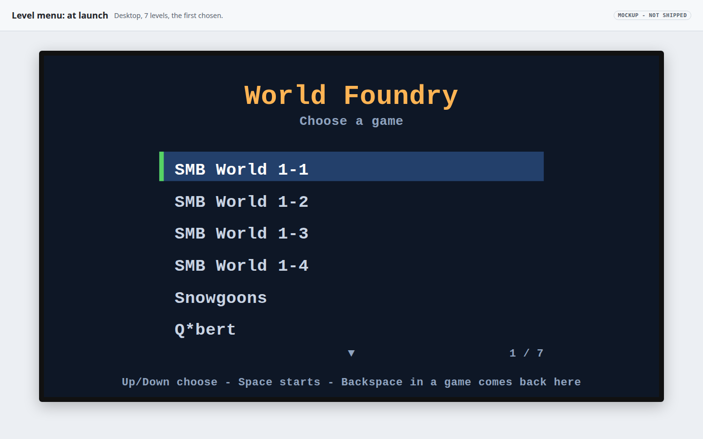
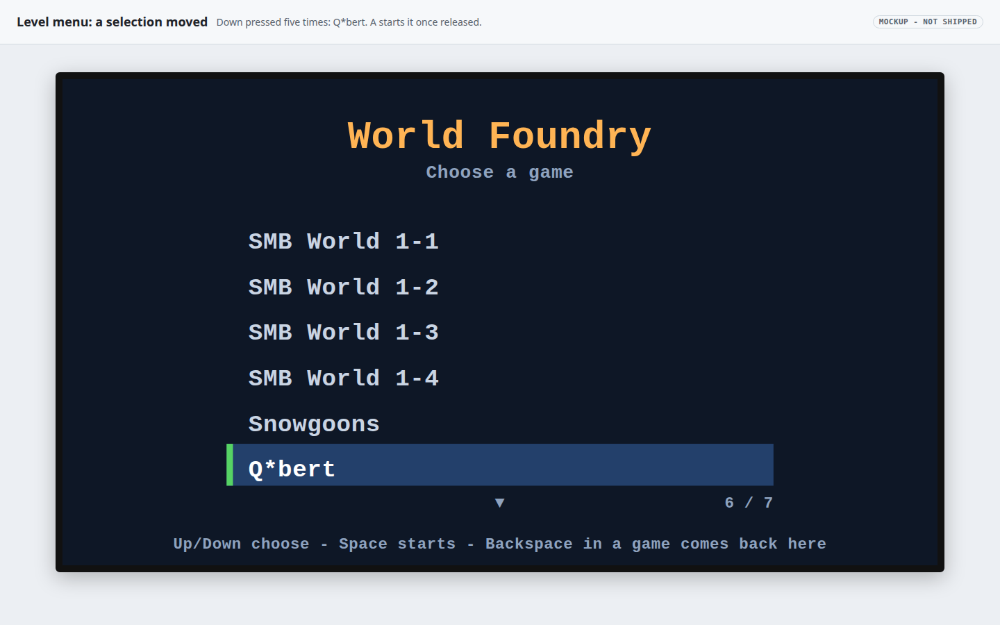
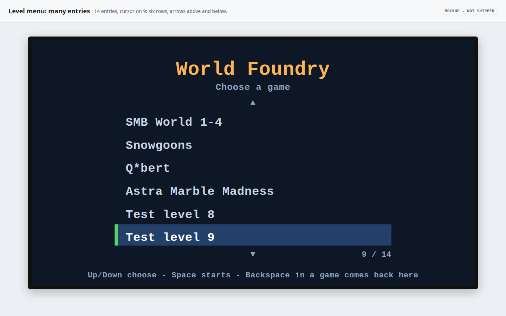
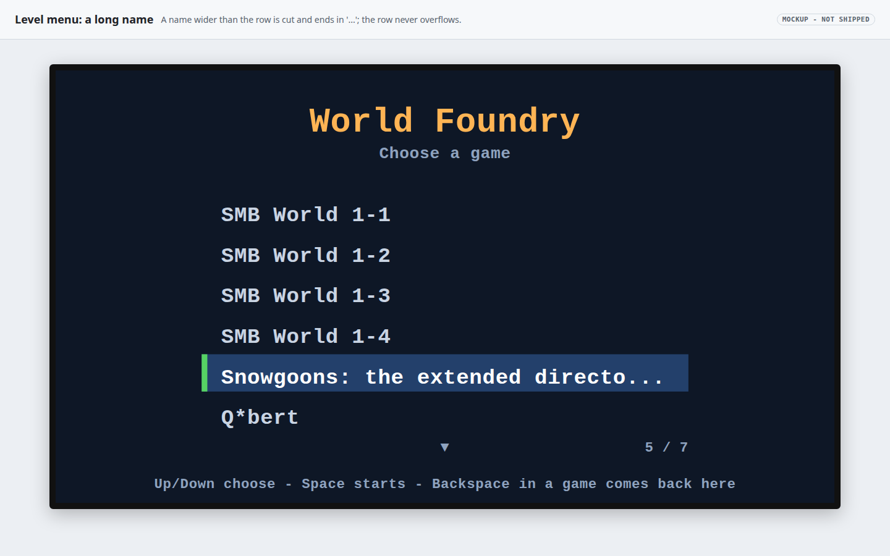
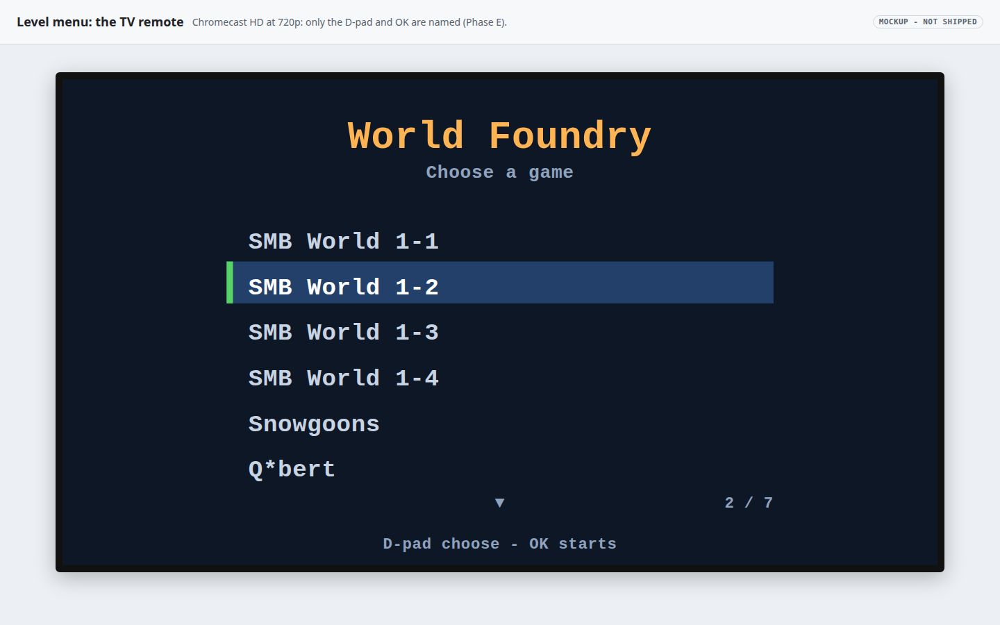
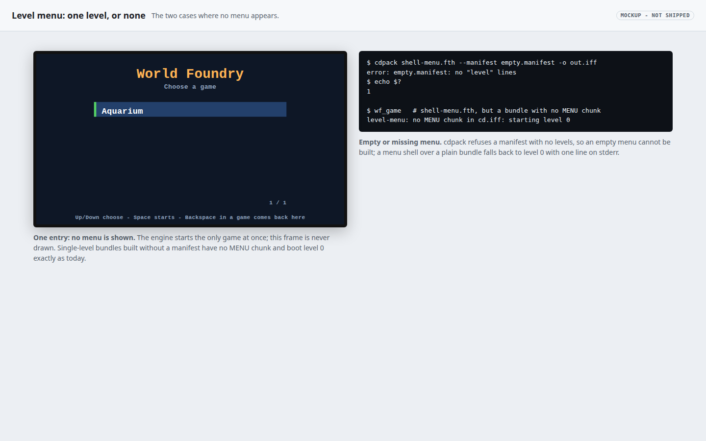

# A menu selector for the multi-level `cd.iff`

Status: **planned** (2026‑10‑01 21:40 (+07) = 14:40 UTC). TODO item: "Implement a menu selector for the multi-level `cd.iff`" (pick a level at launch instead of
booting level 0, as the alternative or addition to separate apps). Each Verification step says PASS, FAIL or PENDING once run.

- [ ] Phase A: this plan and its mockups
- [ ] Phase B: level names as data: `cdpack --manifest` writes a `MENU` chunk; bundles without a manifest stay byte for byte as they are
- [ ] Phase C: the menu itself: a portable menu module, the engine glue, the desktop GL drawer, `shell-menu.fth`, the opt-in task
- [ ] Phase D: tests with no device (cdpack, the menu module in a host harness, the real engine on the desktop display)
- [ ] Phase E (later, not in this change): Android and the Chromecast remote

## Request

Today `wfsource/source/game/cd.iff` holds seven levels and `shell.fth` always boots TOC level 0, so the bundle starts in Mario and nothing reaches
snowgoons, Q\*bert or Astra Marble Madness without a command-line flag. The [split plan](2026-10-01-split-cd-iff-one-app-per-game.md) answers this on
Android with one app per game. This plan is the other answer, for any bundle that keeps several levels (the desktop bundle first): a menu at launch.

Requirements given with the task:

1. A list of the games at launch, operated with the controls every platform has: up and down to move, A to start (OK on the Chromecast remote, A on the
   phone controller). Mouse and touch are a bonus.
2. A way back to the menu from a running level, if that can be done safely without editing level scripts.
3. Level names come from data, reproducible from the repository; `task build-cd-iff` outputs for single-level bundles stay byte-identical.
4. Opt-in: a **new** task builds the menu bundle; `build-cd-iff`, `wfsource/source/game/cd.iff` and `shell.fth` stay byte for byte unchanged.
5. Desktop (Linux) first, tested with no device; nothing under `android/` changes, and existing Taskfile tasks are not edited.

## How a level is chosen today

`WFGame::RunGameScript` (`wfsource/source/game/game.cc`) loads the TOC from sector 0 of `cd.iff`, then loops: run the `SHEL` Forth script once, load TOC
level `_desiredLevelNum`, run it until it ends, repeat. The shell runs to completion before each level; it has **no frame loop, no drawing and no input**.
`_desiredLevelNum` is the system mailbox **5000** (`LEVEL_TO_RUN`). `shell.fth` writes 0 to it on the first pass only (persistent mailbox 6000 is the
"already booted" flag); after that only the levels write it (the SMB flagpoles chain 0 → 1 → 2 → 3 → 0). Death and game over set `END_OF_LEVEL` only, so the
same index reloads. The split plan's audit lists every writer.

`cdpack-rs` lays out the bundle: sector 0 is `GAME` + `TOC` (12 bytes per entry: tag, offset, size) + `ALGN`; sector 1 is `SHEL`; each level follows,
sector-aligned. The engine finds level `n` as TOC entry `1 + n`.

## Options considered

| Option | Verdict |
|---|---|
| A. Forth shell level, drawn with engine primitives | rejected |
| B. Engine/HAL overlay, like the phone panel | **chosen** |
| C. A menu level authored as an IFF | rejected |

**A. A Forth shell menu.** The shell runs once, between levels, with no frame loop, no renderer and no joystick. A menu there needs an engine frame loop
for the shell plus new Forth words for text, rectangles and input: more engine change than option B, for a worse result (the names would sit in a Forth
list or need a new chunk-reading word anyway).

**B. An overlay drawn by the engine.** A portable module (`wfsource/source/game/level_menu.{h,cc}`) holds the menu logic and turns it into a list of solid
rectangles, text included (`stb_easy_font`, already vendored and used by the HUD and the phone panel). The engine runs it in a small frame loop between the
shell and the level whenever the shell asks for it; each platform only has to draw rectangles. This is exactly how the phone-controller panel works
(`hal/phonepad/phonepad_overlay.cc`), so the same test approach applies: the logic is compiled on Linux with a tiny host `main` and driven with a fake clock.

**C. A menu level.** A level with text actors and a script that reads the stick and writes `LEVEL_TO_RUN`. The engine has no text actor (the HUD is C++),
so the names would be textures baked by the Blender pipeline: not "from data" without a level rebuild per name change, heavy to build and slow to boot.

**Why B.** It is the only option where the names come straight from the bundle, the logic is testable without a display, and no level or level script
changes. Its cost is a small hook in `game.cc` and one drawer per platform (desktop now, Android later).

## Design

### Names as data: the `MENU` chunk

- `cdpack` gains `--manifest <file>`. Without it, the code path and the output are unchanged (Verification 1 pins this against the tracked bundles).
- The manifest is plain text, one level per line, in TOC order, paths relative to the manifest's directory:

  ```
  # wflevels/menu-bundle.manifest
  title World Foundry
  level smb_w1_1-standalone.iff | SMB World 1-1
  level snowgoons-standalone.iff | Snowgoons
  ```

- With a manifest, `cdpack` writes the same `GAME`/`TOC`/`SHEL`/levels layout and appends **one more TOC entry, `MENU`, after the last level**, so every level
  keeps its index (TOC entry `1 + n`) and the level scripts' `LEVEL_TO_RUN` writes still mean the same levels. The chunk:

  ```
  'MENU' u32 payload_size
    u32 version (1)   u32 level_count   u32 entry_count
    u16 title_len  title bytes
    entry_count x { u32 level_index  u16 name_len  name bytes }
  ```

  little-endian, zero-padded to the next sector like a level. Names are printable ASCII (the font has nothing else), 1 to 60 characters; `cdpack` refuses
  anything else, an empty manifest, and a manifest given together with level paths.
- `wflevels/menu-bundle.manifest` lists the seven levels of `cd.iff` in the same order, so the menu bundle's indices match `cd.iff` (the SMB chain works).

### The shell: `shell-menu.fth`

A new file next to `shell.fth` (which is not touched). On the first pass it writes **−1** to `LEVEL_TO_RUN` instead of 0. −1 means "ask the player": no
level or shell writes it today, and the engine asserted `>= 0`, so the value was unused.

### The engine glue (`game.cc`)

- In the `RunGameScript` loop, after the shell and the `-l` override: if `_desiredLevelNum == -1`, run the menu and use its answer.
- The menu reads sector 0 itself and looks for the `MENU` TOC entry (no `DiskTOC` change). No `MENU` chunk, or a platform with no menu drawer: level 0 and
  a line on stderr. One entry: start it, no menu.
- The menu loop: read joystick 1, update the menu, build its rectangles, `RenderBegin`, draw, `RenderEnd`, `PageFlip` (which pumps the window's events).
  The level starts only after every button is released, so the A that chose the game does not also make Mario jump.
- The chosen index goes to `_desiredLevelNum` (the `LEVEL_TO_RUN` mailbox), and the menu prints `level-menu: LEVEL_TO_RUN=<n> (<name>)` on stderr.
- The cursor starts on the last game played when the menu comes back.

### Back to the menu

Engine-side, no level script change: while a menu bundle's level runs, a **return request** sets `LEVEL_TO_RUN` to −1 and ends the level through the
existing `ContinueRequested()` path (the one the designer "level aborted" cheat already uses). The loop then reaches the menu again. The request comes
from a HAL call, not from a joystick bit, so no game loses a button:

- Desktop: **Backspace** (unmapped today). Escape stays "quit".
- Chromecast remote: **Back** is the natural key, but Back already hides the phone panel and leaves the app, and `native_app_entry.cc` is Android work.
  Proposed for Phase E: a long press of Back returns to the menu when the menu bundle is running.
- "When a game ends" is not generic: game over only reloads the same level today (`END_OF_LEVEL`), so returning to the menu on game over needs each
  level to say so. Follow-up, not done here.

### Test and automation input: `--menu-input=`

`wf_game --menu-input=down,down,a,wait:90,back,up,a,quit` replays a script, one token per frame (with a released frame between presses), into the menu and,
during levels, the `back`/`quit` requests. It makes the real engine testable end to end without keyboard injection into the desktop session.

### Look and operation

[](2026-10-01-level-menu-selector/default.html)
[](2026-10-01-level-menu-selector/moved.html)
[](2026-10-01-level-menu-selector/scrolling.html)

[](2026-10-01-level-menu-selector/long-name.html)
[](2026-10-01-level-menu-selector/remote-hint.html)
[](2026-10-01-level-menu-selector/one-level.html)

- A full-screen dark panel (no game behind it: nothing is loaded yet), the title from the manifest, "Choose a game", up to six rows, the chosen row on a
  blue bar with a green edge, "N / M" under the list, arrows when rows are hidden above or below, and a hint line at the bottom.
- Designed on a 1920×1080 canvas and scaled to the surface, like the phone panel (720p on the Chromecast HD).
- Up and down move one row, held keys repeat after 400 ms every 120 ms; the cursor stops at the ends (no wrap). A starts the game. On the desktop A is
  Space or 1 (the existing key map).
- Names longer than the row end in `...`.
- The hint is per platform: desktop "Up/Down choose - Space starts - Backspace in a game comes back here"; TV "D-pad choose - OK starts".

### Defaults the user should confirm

| Choice | Default |
|---|---|
| Menu vs split apps | alongside: desktop bundle now, Android later |
| Levels listed | all seven, in `cd.iff` order |
| Names | SMB World 1‑1 to 1‑4, Snowgoons, Q\*bert, Astra Marble Madness |
| Marble Madness | listed last (low priority, but it is in `cd.iff`) |
| Look | text only, no screenshots or icons |
| Back to the menu | Backspace (desktop); long Back on TV later |
| Navigation | clamp at the ends, no wrap |

The names are placeholders in the manifest; the project owns neither "Super Mario Bros." nor "Q\*bert" (the split plan's labels are placeholders too).

## Files

| File | Change |
|---|---|
| `wftools/cdpack-rs/src/main.rs` | `--manifest`, `MENU` chunk, `-h` |
| `wflevels/menu-bundle.manifest` | new: the seven levels and names |
| `wfsource/source/game/shell-menu.fth` | new: writes −1 |
| `wfsource/source/game/level_menu.h`, `.cc` | new: portable menu |
| `wfsource/source/game/level_menu_host.cc` | new: host `main` for tests |
| `wfsource/source/game/game.cc`, `game.hp` | menu hook, return request |
| `wfsource/source/game/main.cc` | `--menu-input=` |
| `wfsource/source/gfx/gl/display.cc` | desktop rectangle drawer |
| `wfsource/source/gfx/gl/mesa.cc` | Backspace: return request |
| `Taskfile.yml` | appended: `build-cd-iff-menu`, `run-menu`, `test-level-menu` |
| `tests/test_level_menu.py`, `tests/level_menu_harness.py` | new |

`level_menu_host.cc` lives in the game directory, which CMake globs for every platform, so it is guarded to build only when `WF_LEVEL_MENU_HOST` is
defined (the harness defines it).

Commands, for reference:

```
task build-cd-iff-menu          # -> build-menu/cd.iff (gitignored), or CD_OUT=<path>
task run-menu                   # wf_game in build-menu/, the menu first
task test-level-menu            # python3 -m pytest tests/test_level_menu.py -v
```

## Risks

- **Engine glue on every platform.** `game.cc` and `level_menu.cc` compile on Linux, Android, macOS, iOS and the web. The glue only runs when a shell
  writes −1, and platforms without a drawer fall back to level 0, so the five existing bundles cannot reach it. Only the Linux build is compiled here.
- **Fixed-function GL.** The drawer uses the same immediate-mode GL as the HUD, so it is desktop-only; Android needs its own drawer (the phone panel's is
  the model).
- **Ending a level early.** The return request uses the same `_bContinue = false` path as the "level aborted" cheat; persistent mailboxes (score, the boot
  flag) survive it, as they survive any level change.
- **Placeholder names** need the user's call before anything ships.

## Cost

No infrastructure, no new dependency. About 500 lines of C++ and Rust plus tests. The menu bundle is about 1.4 MB, built into the gitignored `build-menu/`.

## Out of scope

- Android and the Chromecast: a GLES drawer (as `android_window.cc` draws the phone panel), the long Back press, a menu flavor or a menu in an existing app.
- Returning to the menu on game over (needs per-level signals).
- Mouse and touch selection.

## Verification

1. Without `--manifest`, the new `cdpack` reproduces the tracked bundles byte for byte: `wfsource/source/game/cd.iff` (seven levels),
   `wflevels/aquarium-cd.iff` and `wflevels/condo-cd.iff`. `python3 -m pytest tests/test_level_menu.py -v -k identical`.
2. `task build-cd-iff-menu` writes `build-menu/cd.iff`; its first eight TOC entries and all level bytes equal `cd.iff`'s, and its last TOC entry is `MENU`
   with the manifest's title and seven names. `-k manifest_bundle`.
3. `cdpack` refuses bad manifests (no levels, non-ASCII name, name too long, missing level file, manifest plus level paths) with exit code 1.
   `-k refuses`.
4. The menu module, in the host harness with ASan and UBSan, reads the real `build-menu/cd.iff`, moves, clamps, repeats, scrolls, truncates, ignores a
   button held at entry, starts only after release, auto-starts a one-entry bundle, and finds no menu in plain `cd.iff`. `-k host`.
5. The tests fail when the feature is broken: with the release wait removed from the menu module, step 4's release test fails; restored, it passes.
6. The real engine, on the desktop display: `wf_game --menu-input=...` in a directory holding the menu bundle shows seven entries, picks Q\*bert
   (`LEVEL_TO_RUN=5`), runs it, returns to the menu on `back`, picks snowgoons (`LEVEL_TO_RUN=4`) and quits cleanly; a `--capture-frame` of the menu shows
   the highlight bar. `-k engine`.
7. Nothing else moved: `git diff --stat` of `Taskfile.yml` is additions at the end only; `shell.fth`, `cd.iff` and everything under `android/` are
   unchanged; `task build` succeeds.
8. By hand on the desktop (`task run-menu`): the arrows move, Space starts, Backspace in a game comes back. Screenshot in this plan.

## Delegation

Designed and built by the T4 agent that wrote this plan. Phase E (Android drawer, long Back) is T3 against this design once the user confirms the defaults.
