# Split the multi-level cd.iff into one Android app per game

Status: **done except the device rerun** (2026‑10‑01 22:20 (+07) = 15:20 UTC). Three apps (smb, snowgoons, qbert) build for both ABIs and ran on the real Chromecast HD; the rerun with the final APKs and the TV-launcher look at the new snowgoons banner are PENDING (the user asked not to use the Chromecast while another agent records a video).

- [x] Phase A: the audit of every level-index write, recorded below
- [x] Phase B: one `cd.iff` per game, built by its own task, committed and pinned by a test
- [x] Phase C: the apps: `snowgoons` boots snowgoons; new `smb` and `qbert` flavors with their own art
- [x] Phase D: CI, the device script, tasks and docs know every flavor
- [ ] Phase E: builds for both ABIs (done), then a smoke run of each new app on the real Chromecast HD (done once; the rerun with the final APKs is PENDING)

## Request

The TODO item "Split the multi-level `cd.iff` into one app per game", raised in [the icons plan](2026-10-01-android-icons.md) (§ Related TODO items) together with
a menu selector for that `cd.iff` (a separate item, not this one).

Today the `snowgoons` flavor (`org.worldfoundry.wf_game`, the original install) bundles the desktop's multi-level `wfsource/source/game/cd.iff`:

| TOC | Level | Game |
|---|---|---|
| 0 to 3 | `smb_w1_1` to `smb_w1_4` | Super-Mario-style W1‑1 to W1‑4 (they chain) |
| 4 | `snowgoons` | snowgoons |
| 5 | `qbert_practice` | Q\*bert |
| 6 | `marble-madness-3d-astra` | Astra Marble Madness |

`shell.fth` boots TOC level 0, so the app called snowgoons boots into Mario, and nothing on a TV remote reaches levels 4 to 6. The aquarium and the
condo already ship as one-level apps ([aquarium plan](2026-09-30-aquarium-chromecast.md), [condo plan](2026-10-01-condo-chromecast.md)); this plan
copies their recipe.

## Decisions (given with the task)

- **One app per game, three apps:** `smb` (the four W1 levels stay together: one game that chains), `snowgoons` and `qbert`.
- **Astra Marble Madness gets no app.** It is a stated low priority (no accurate arcade conversions; archive rather than invest), so it stays only in
  the desktop `cd.iff`.
- **`snowgoons` keeps `org.worldfoundry.wf_game`**, so existing installs upgrade in place; its label was World Foundry and is **Snowgoons** since the user's request (2026‑10‑01 evening), and it keeps `level0.mid` and soundfont.
  It now boots snowgoons.
- **New ids:** `org.worldfoundry.wf_game.smb` and `org.worldfoundry.wf_game.qbert`.
- **Labels, placeholders:** "WF SMB" and "WF Q\*bert". The project does not own either name; the user picks the real ones later.
- **The desktop is out of scope:** `task build-cd-iff` and `wfsource/source/game/cd.iff` stay byte for byte as they are.
- **No phone controller and no permission** in the new apps: the phone gamepad and `INTERNET` stay aquarium and condo only.
- **Shared level sources are not edited** to fix indices unless there is no other way and the edit is tiny; a cross-game jump, an engine change or
  a Blender rebuild stops the work (escalation).

## The audit: who writes the level index

The meta-loop (`WFGame::RunGameScript`, `wfsource/source/game/game.cc`) runs `shell.fth`, then loads TOC level `_desiredLevelNum`, and repeats when the
level ends. `_desiredLevelNum` changes only through mailbox **5000** (`LEVEL_TO_RUN`, `wfsource/source/mailbox/mailbox.inc`). `shell.fth` writes 0 to
it once, on the first pass (guarded by persistent mailbox 6000). Death and game over set `END_OF_LEVEL` (1905) only, so the same index reloads.

Searched: the `.lev` sources of all seven levels (ActBox `MailBox` fields and every script), the **shipped binaries** (`wflevels/<level>-standalone.iff`,
for an aligned int32 5000 and for script text naming `LEVEL_TO_RUN`, `5000` or a 6000-range persistent mailbox), `shell.fth`, `game.cc`, `mailbox.inc`,
`wflevels/smb_common.py` (which writes the flag ActBoxes) and the tests. The one `5000` inside the SMB player script is the flag-height score bonus, not a
mailbox.

| Level | Index before | Index after | Writes to `LEVEL_TO_RUN` | Death, win, restart |
|---|---|---|---|---|
| `smb_w1_1` | 0 | 0 (smb app) | flag ActBox: 1 | death and game over: `END_OF_LEVEL` only, reload 0 |
| `smb_w1_2` | 1 | 1 (smb app) | flag ActBox: 2 | same, reload 1 |
| `smb_w1_3` | 2 | 2 (smb app) | flag ActBox: 3 | same, reload 2 |
| `smb_w1_4` | 3 | 3 (smb app) | axe ActBox: 0 | same, reload 3 |
| `snowgoons` | 4 | 0 (snowgoons app) | none | reload 0 |
| `qbert_practice` | 5 | 0 (qbert app) | none | reload 0 |
| `marble-madness-3d-astra` | 6 | desktop only | none | n/a |

**Result: every bundle is self-consistent with no level edit.** The SMB app keeps indices 0 to 3, so its W1‑1 → W1‑2 → W1‑3 → W1‑4 → W1‑1 loop is
unchanged; snowgoons and Q\*bert write no index at all, so a one-level bundle can never jump to a missing level, and nothing jumps across games.
A test pins this against the shipped binaries, so a rebuilt level that starts writing an index fails it.

Two index-dependent side effects, recorded rather than changed:

- **Music is chosen by index** (`level<N>.mid`, `game.cc`). The snowgoons app ships `level0.mid` (Für Elise, the same bytes as `fur_elise.mid`), which
  so far played over W1‑1; it now plays over snowgoons. The SMB app ships no music (as before in practice: the old app played Für Elise, not a Mario tune).
- **Q\*bert's sound effects** are loaded from desktop-relative paths (`wflevels/qbert_practice/sfx/…`, `game.cc`), which resolve to nothing on Android:
  the Q\*bert app is silent, exactly as level 5 was inside the old app. Moving audio into the IFF is the existing "Audio assets from IFF" item.

## Design

### Bundles

One task per game, the same recipe as `build-cd-iff-condo` (cdpack-rs, `shell.fth`, the `*-standalone.iff` files, `CD_OUT=` to write elsewhere):

| Task | Output (committed) | Levels, in TOC order |
|---|---|---|
| `build-cd-iff-smb` | `wflevels/smb-cd.iff` | `smb_w1_1` to `smb_w1_4` |
| `build-cd-iff-snowgoons` | `wflevels/snowgoons-cd.iff` | `snowgoons` |
| `build-cd-iff-qbert` | `wflevels/qbert-cd.iff` | `qbert_practice` |

A test rebuilds nothing; it reads each committed bundle's TOC and checks that `SHEL` is `shell.fth` and every level is today's standalone file byte for
byte (as `tests/test_condo_android.py` does), so a rebuilt level with a stale bundle fails.

### Flavors

| Flavor | applicationId | Label | `assets/` |
|---|---|---|---|
| `snowgoons` | `org.worldfoundry.wf_game` (unchanged) | Snowgoons (was World Foundry) | `cd.iff` → `wflevels/snowgoons-cd.iff`; `level0.mid`, `florestan-subset.sf2` as before |
| `smb` | `org.worldfoundry.wf_game.smb` | WF SMB (placeholder) | `cd.iff` → `wflevels/smb-cd.iff` |
| `qbert` | `org.worldfoundry.wf_game.qbert` | WF Q\*bert (placeholder) | `cd.iff` → `wflevels/qbert-cd.iff` |

Each new flavor has `src/<flavor>/res/` (label, launcher icons, TV banner, adaptive background colour) and no `AndroidManifest.xml`, so no permission.
`aquarium` and `condo` do not change.

### Art

The icons plan's layout, unchanged: the game's art fills the icon, the World Foundry logo sits bottom-right (stamped by `scripts/add-wf-logo.py`), and the
16:9 TV banner carries the name bottom-left. `scripts/gen-android-icons.py` gains two entries; each takes a **real engine frame** from the repository,
copied into `android/app/art-src/` so a later test run that rewrites a screenshot cannot change the icons:

| App | Source frame | Why this one |
|---|---|---|
| `smb` | `tests/screenshots/smb_mushroom_02_super.png` (the W1‑1 test harness) | the biggest Mario in any capture, with ? blocks, bricks and a pipe in one view (the icon keeps Mario and the ? blocks; the pipe shows in the banner) |
| `qbert` | `docs/plans/2026-09-20-relight-swept-levels/qbert-after.png` | the whole pyramid, Q\*bert on top, the discs, current lighting |

The icon crops keep the subject inside the middle two thirds (the legacy icon and the launcher's mask show only that). The banners are cut below the
score line. The adaptive background is the frames' black. Banner names: `smb` and `qbert` (placeholders, like the labels). These frames are small
(640 px wide), so the 432 px foreground is an upscale: soft, not fabricated.

### Icons

Every app's icons and banner, read from the real files under `android/app/src/<flavor>/res/` (the adaptive column is the foreground over its
background colour under a circle mask, as a launcher draws it, made by [`make_mockups.py`](2026-10-01-split-cd-iff-one-app-per-game/make_mockups.py)).
The legacy round icon is the legacy square under a circle, so it is not shown again.

| App | Adaptive | Legacy | TV banner | Art from | Replace? |
|---|---|---|---|---|---|
| WF SMB (new) | 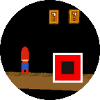 | 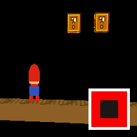 | 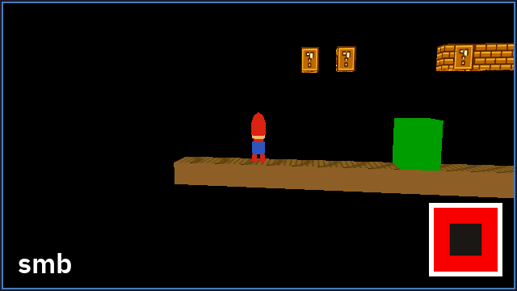 | real frame (1) | name only |
| WF Q\*bert (new) | 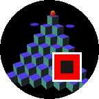 | 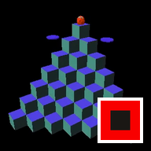 | 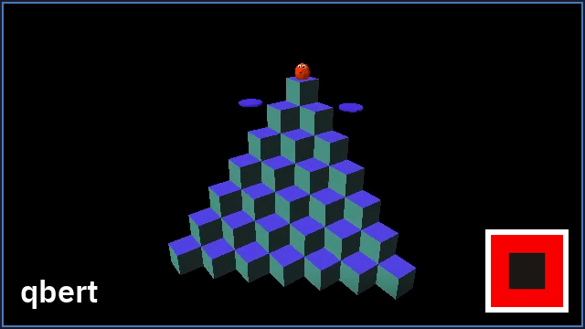 | real frame (2) | name only |
| Snowgoons | 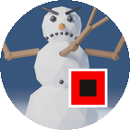 | 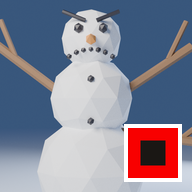 | 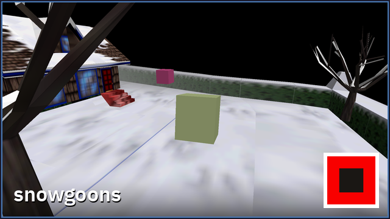 | icon: new render (3); banner: level screenshot (6) | no |
| WF Aquarium | 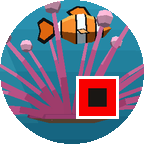 | 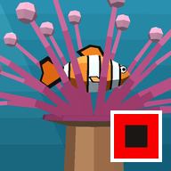 |  | engine capture (4) | no |
| WF Condo |  | 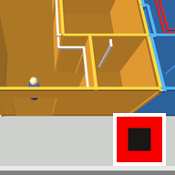 | 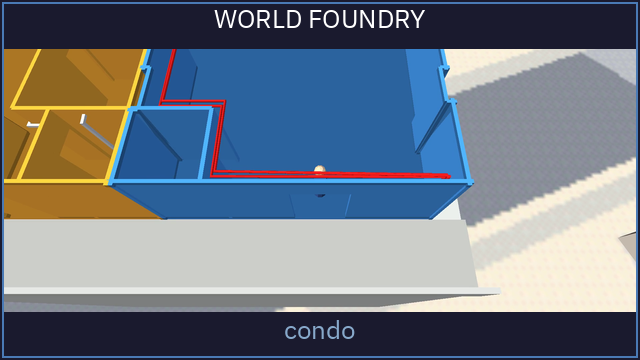 | engine capture (5) | no |

None is a placeholder image. The two new names are placeholders ("Replace?": name only), and so are the banner captions `smb` and `qbert`.

1. `tests/screenshots/smb_mushroom_02_super.png`: W1‑1 in the engine's SMB test harness, copied to `android/app/art-src/smb-w1-1-super-mario-640.png`.
2. `docs/plans/2026-09-20-relight-swept-levels/qbert-after.png`: the Q\*bert pyramid in the engine after the relight, copied to `android/app/art-src/qbert-pyramid-640x480.png`.
3. `scripts/render-snowgoon.py`: a three-armed snowman drawn in Blender for the icons plan (new art, not a level frame).
4. `scripts/capture-aquarium-fish-high.py`: the fish and the anemone's crown, an engine capture.
5. `scripts/capture-condo-pullback.py`: the condo with the camera pulled back, an engine capture.
6. `android/app/art-src/snowgoons-level-chromecast-1920x1080.png`: the snowgoons level itself, screenshotted on the Chromecast HD by the new snowgoons release app 8 s after launch, no input (`scripts/android-device-run.sh --app snowgoons --release --seconds 8 192.168.4.38:41447`, an `adb` screencap). Asked for by the user on 2026‑10‑01; it replaced the snowman in the banner only. The level's actors are still placeholder boxes, so the frame shows the yard, the house, the trees and the boxes, not a snowgoon.

How they look together on a TV launcher and a phone launcher (live pages; the thumbnails link to them):

[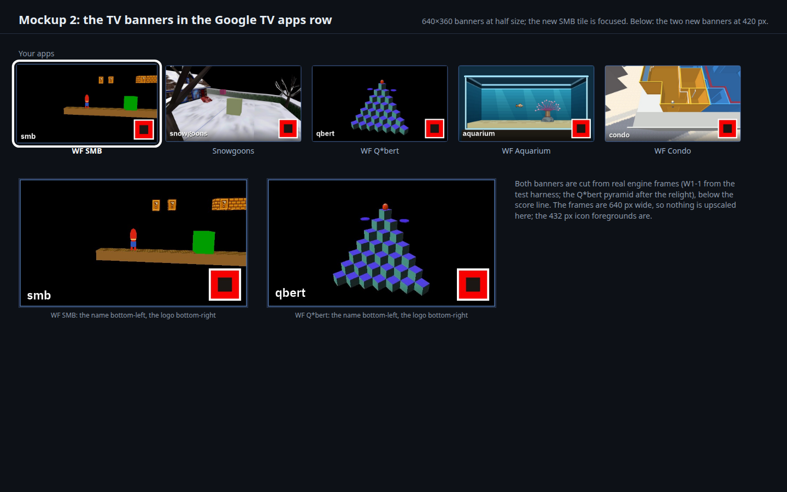](2026-10-01-split-cd-iff-one-app-per-game/banners.html)

[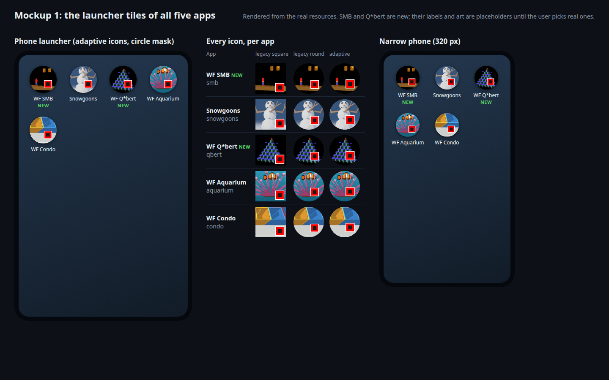](2026-10-01-split-cd-iff-one-app-per-game/launcher.html)

### Plumbing

- `android/app/build.gradle.kts`: the two flavors and the asset comment.
- `scripts/android-device-run.sh`: `--app smb` and `--app qbert`, in `-h` and the error message.
- `Taskfile.yml`: the three bundle tasks; the app lists in `install-apk`, `build-apk` and `build-apk-debug`.
- CI: `codemagic.yaml` already builds `:app:assembleDebug` (every flavor) and publishes `apk/*/debug/*.apk`; only its comment names the flavors. The test
  that pins this also checks that every flavor in `build.gradle.kts` is one `assembleDebug` covers (no flavor filter anywhere).
- Docs: `android/README.md` (flavor table), `docs/porting-status.md`.

### Mockups

Rendered from the real generated resources by [`make_mockups.py`](2026-10-01-split-cd-iff-one-app-per-game/make_mockups.py), not drawn.

[](2026-10-01-split-cd-iff-one-app-per-game/launcher.html)

**1. The launcher tiles of all five apps**: a phone launcher grid (adaptive icons under a circle mask, with labels), the legacy square and round icons,
and the same grid at a narrow phone width. [Open it](2026-10-01-split-cd-iff-one-app-per-game/launcher.html).

[](2026-10-01-split-cd-iff-one-app-per-game/banners.html)

**2. The TV banners** in a Google TV apps row (the new SMB tile focused), and the two new banners at 420 px. [Open it](2026-10-01-split-cd-iff-one-app-per-game/banners.html).

## Out of scope

- The desktop `cd.iff`, its task and every desktop `run-*` task.
- A menu that picks a level inside one `cd.iff` (its own TODO item).
- An app for Astra Marble Madness.
- The phone controller and any permission for the new apps.
- iOS and macOS apps for these games.
- Real names and real art (the user's choice; the placeholders are listed in the Result).
- Music and sound for SMB and Q\*bert ("Audio assets from IFF").

## Verification

Numbered, runnable steps; each shows its raw output with PASS or FAIL, or says what is pending.

1. The audit is pinned: `python3 -m pytest tests/test_game_apps_android.py -k audit -v`. Expected: SMB writes 1, 2, 3, 0 and nothing else; snowgoons and
   Q\*bert write nothing; every target is inside its bundle.

    ```
    test_audit_level_to_run_writes[smb_w1_1] PASSED
    test_audit_level_to_run_writes[smb_w1_2] PASSED
    test_audit_level_to_run_writes[smb_w1_3] PASSED
    test_audit_level_to_run_writes[smb_w1_4] PASSED
    test_audit_level_to_run_writes[snowgoons] PASSED
    test_audit_level_to_run_writes[qbert_practice] PASSED
    test_audit_lev_sources_agree PASSED
    test_audit_every_target_is_inside_its_bundle[smb] PASSED
    test_audit_every_target_is_inside_its_bundle[snowgoons] PASSED
    test_audit_every_target_is_inside_its_bundle[qbert] PASSED
    10 passed, 21 deselected in 0.87s
    ```

    **PASS** (the binary scan found the int32 5000 only in the SMB flag/axe ActBoxes, followed by 1, 2, 3 and 0; none in snowgoons, Q\*bert or Astra Marble Madness).

2. The bundles are reproducible: `task build-cd-iff-smb`, `task build-cd-iff-snowgoons`, `task build-cd-iff-qbert`, then `git status --short wflevels/*-cd.iff`.
   Expected: no change after a rebuild.

    ```
    cdpack: wrote 577536 bytes to wflevels/smb-cd.iff
    cdpack: wrote 172032 bytes to wflevels/snowgoons-cd.iff
    cdpack: wrote 370688 bytes to wflevels/qbert-cd.iff
    $ git status --short wflevels/smb-cd.iff wflevels/snowgoons-cd.iff wflevels/qbert-cd.iff     (after the commit, rebuilt again)
    (no output)
    ```

    **PASS**

3. The desktop is untouched: build the desktop recipe to a scratch file and compare, then `task build-cd-iff` and `git status --short wfsource/source/game/cd.iff`.
   Expected: identical, and no change.

    ```
    cdpack: wrote 1384448 bytes to …/scratchpad/desktop-cd.iff
    DESKTOP-IDENTICAL                                    (cmp with wfsource/source/game/cd.iff)
    $ task build-cd-iff
    cdpack: wrote 1384448 bytes to wfsource/source/game/cd.iff   (L0..L6 = smb_w1_1..4, snowgoons, qbert_practice, marble-madness-3d-astra)
    $ git status --short wfsource/source/game/cd.iff
    (no output)
    ```

    **PASS** (`test_desktop_cd_iff_unchanged` pins it too).

4. Each bundle boots the right game on the desktop engine: `engine/wf_game -rate20 --capture-frame=60=…` in a scratch directory whose `cd.iff` is the
   bundle. Expected: SMB shows Mario W1‑1, snowgoons the snow field, Q\*bert the pyramid.

    ```
    smb       linux: capture frame 60 -> f60.png (640x480) written, non-black pixels 14068/307200
    snowgoons linux: capture frame 60 -> f60.png (640x480) written, non-black pixels 251381/307200
    qbert     linux: capture frame 60 -> f60.png (640x480) written, non-black pixels 5291/307200
    ```

    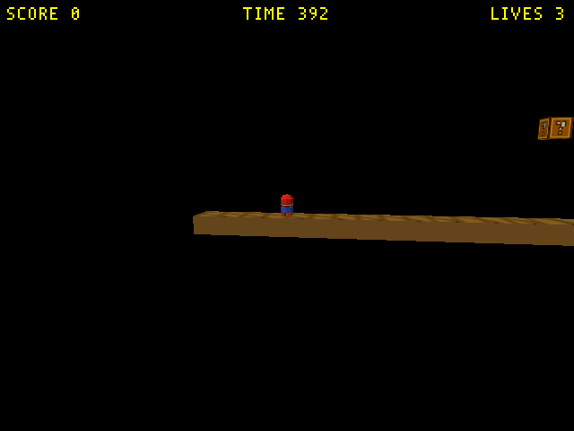 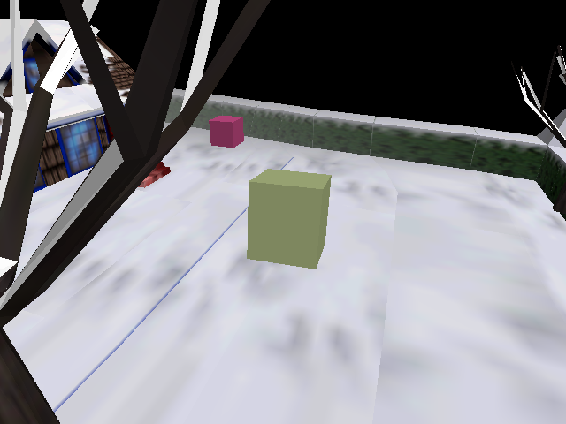 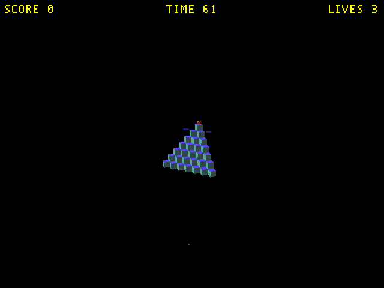

    **PASS** (each run was ended by a 40 s timeout, no assertion). The Q\*bert log carries `zforth compile error 2` lines for the Coily script; they are in the level itself and appear in the multi-level bundle too, not caused by the split.

5. The static tests: `python3 -m pytest tests/test_aquarium_android.py tests/test_condo_android.py tests/test_android_size_trim.py tests/test_phone_controller_android.py tests/test_game_apps_android.py -q`.
   Expected: all pass.

    ```
    FAILED tests/test_aquarium_android.py::test_built_aquarium_apk_contents - Ass...
    1 failed, 76 passed in 14.48s
    ```

    **PASS for this plan; one unrelated failure.** The failing check compares the aquarium **debug** APK (built at `ca284a6a`) with
    `wflevels/aquarium-cd.iff`, which another session re-committed afterwards (`4a906de5`, the follower wall limit). The same test's snowgoons half was checked
    separately: the fresh snowgoons debug APK's `cd.iff` equals `wflevels/snowgoons-cd.iff` (True). `tests/test_game_apps_android.py` alone: 31 passed.

6. The art: `scripts/gen-android-icons.py smb qbert`, then look at the generated icons and banners. Expected: the logo bottom-right, the subject
   inside the mask.

    ```
    smb: wrote tv_banner.png, 5 foregrounds, 5 legacy and 5 round icons under android/app/src/smb/res
    qbert: wrote tv_banner.png, 5 foregrounds, 5 legacy and 5 round icons under android/app/src/qbert/res
    snowgoons: wrote tv_banner.png, 5 foregrounds, 5 legacy and 5 round icons under android/app/src/snowgoons/res   (the new banner; the icons are byte-identical)
    ```

    **PASS** (looked at: see the Icons table; the logo covers the pipe in the SMB icon, which the banner still shows).

7. The release APKs for both ABIs: `./gradlew :app:assembleSnowgoonsRelease :app:assembleSmbRelease :app:assembleQbertRelease`. Expected: BUILD
   SUCCESSFUL; each APK holds its own `cd.iff` and `lib/{arm64-v8a,armeabi-v7a}/libwf_game.so`. Also: whether the lint skip is still needed.

    Built in a clean worktree at `ca284a6a`, because another session's uncommitted level-menu work in `game.cc` did not compile in the shared tree
    (`error: use of undeclared identifier 'levelmenu'`, `game.cc:291`).

    ```
    BUILD SUCCESSFUL in 8m 51s
    snowgoons 9498337 bytes: assets/cd.iff 172032, florestan-subset.sf2 7842132, level0.mid 7590; lib/arm64-v8a 2244056, lib/armeabi-v7a 1898248
    smb       2296379 bytes: assets/cd.iff 577536;                                          lib/arm64-v8a 2244056, lib/armeabi-v7a 1898248
    qbert     2505495 bytes: assets/cd.iff 370688;                                          lib/arm64-v8a 2244056, lib/armeabi-v7a 1898248
    > Task :app:lintVitalAnalyzeSmbRelease / :app:lintVitalSmbRelease / … Snowgoons …   (ran, passed)
    ```

    **PASS**. No lint skip is needed: `smb` and `qbert` ship no soundfont, and `snowgoons` builds with lint now that `task soundfont` has made the gitignored soundfont on this machine (a clean checkout still needs it or the skip).

8. Badging: `aapt dump badging` of each release APK. Expected: the package, the label and the banner of each app.

    ```
    package: name='org.worldfoundry.wf_game.smb'     application: label='WF SMB' icon='res/BW.xml' banner='res/gU.png'
    package: name='org.worldfoundry.wf_game.qbert'   application: label='WF Q*bert' icon='res/BW.xml' banner='res/gU.png'
    package: name='org.worldfoundry.wf_game'         application: label='World Foundry' icon='res/BW.xml' banner='res/gU.png'
    native-code: 'arm64-v8a' 'armeabi-v7a'           (all three)
    ```

    **PASS** (`aapt2`; the release build renames resources, so the banner shows as `res/gU.png`).

9. The Chromecast HD: `bash scripts/android-device-run.sh --app <app> --release --seconds 8 <ip:port>` for `smb`, `qbert` and `snowgoons`. Expected:
   alive, no crash lines, EGL up, a screenshot of the right game. No key events.

    Run 2026‑10‑01 21:51 to 21:52 (+07) = 14:51 to 14:52 UTC, with the release APKs built in the shared tree at 21:39 and 21:45, before the other
    session's engine edits (from 21:51) and before the banner change.

    ```
    smb       PASS installed org.worldfoundry.wf_game.smb; launched (842 ms); alive after 8 s; no crash lines; EGL context up; 127 frames, median 16.7 ms (59.9 fps); PSS 31683 KB
    qbert     PASS installed org.worldfoundry.wf_game.qbert; launched (618 ms); alive after 8 s; no crash lines; EGL context up; 126 frames, median 16.7 ms (59.9 fps); PSS 27645 KB
    snowgoons PASS installed org.worldfoundry.wf_game; launched (403 ms); alive after 8 s; no crash lines; EGL context up; 126 frames, median 16.7 ms (59.9 fps); PSS 39389 KB
    evidence: ~/tmp/android-device-run/{smb-20261001T145126Z,qbert-20261001T145152Z,snowgoons-20261001T145218Z}/
    ```

    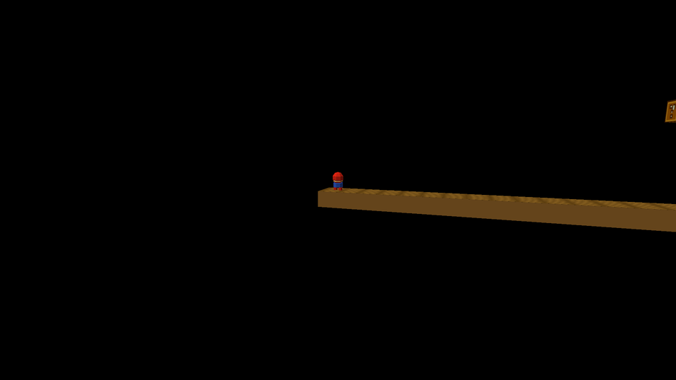 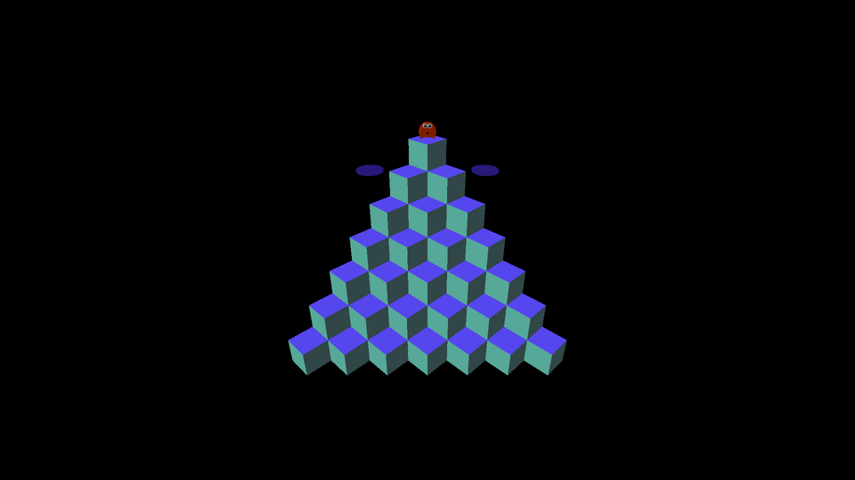 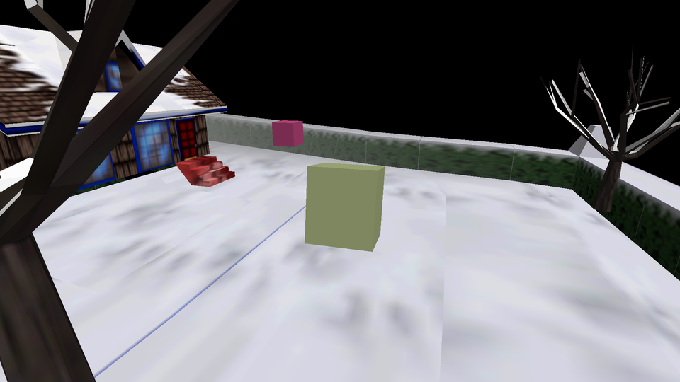

    **PASS** for the three apps: SMB boots W1‑1 (Mario on the first ground strip, a ? block), Q\*bert the pyramid, snowgoons the snowy yard. **PENDING:** the
    new snowgoons banner on the TV launcher, and a rerun with the final APKs: the user asked not to use the Chromecast (another agent is recording a video).
    The TV was last left running the snowgoons app by this plan; the recording agent has had it since.

10. The docs render: `task md -- android/README.md`, `task md -- docs/porting-status.md` and this plan.

    ```
    /home/will/tmp/README.html (273 KB)
    /home/will/tmp/porting-status.html (1854 KB)
    /home/will/tmp/2026-10-01-split-cd-iff-one-app-per-game.html
    ```

    **PASS** (looked at: the flavor table, the new porting-status bullet, and this plan's Icons table with every image present).

## Cost

None: local builds and a device on the desk. No CI minutes are spent on purpose (the next push builds every flavor in the existing free workflow).

## Delegation

| Work | Tier | Why |
|---|---|---|
| The audit, the bundles, the flavors, the art, CI and docs | T3 | multi-file work against this plan |
| Real names, real art, whether Marble Madness gets an app | T5 | the user's choice |
